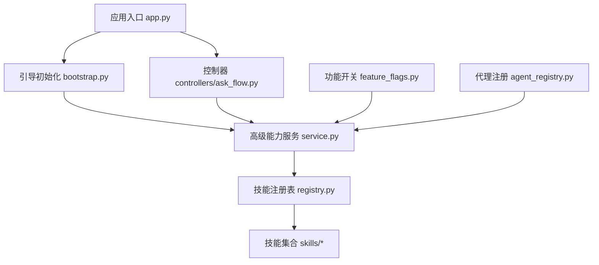
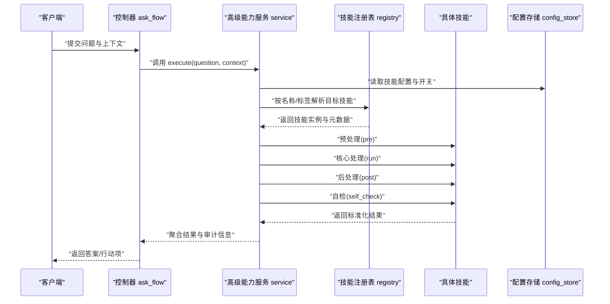
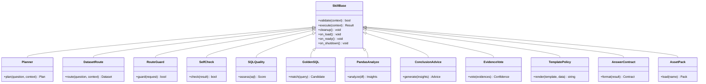
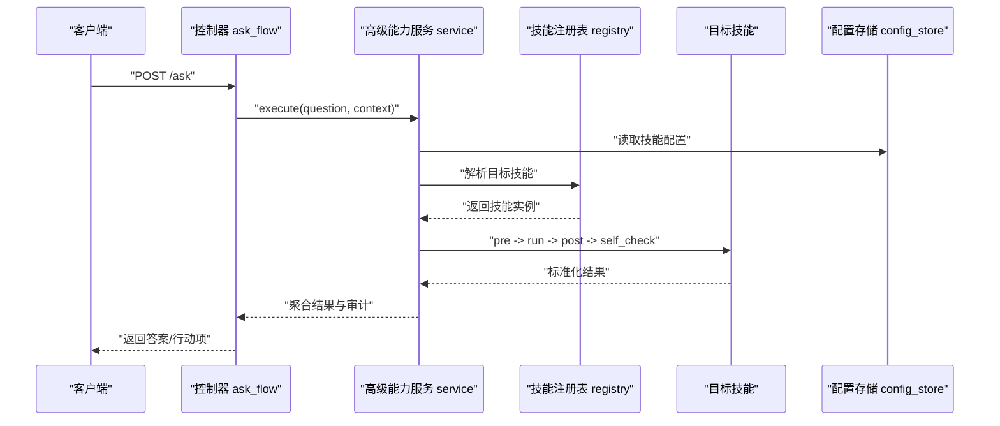
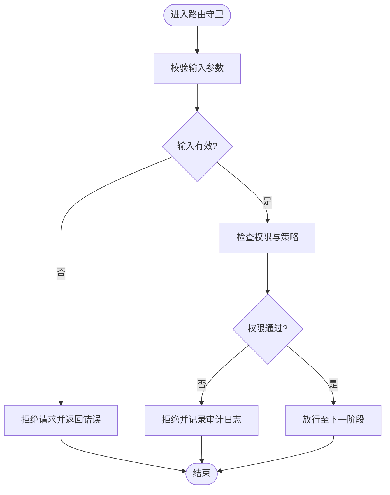
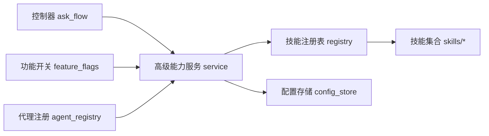

# 扩展开发

<cite>
**本文引用的文件**   
- [backend/smartask_advanced/registry.py](file://backend/smartask_advanced/registry.py)
- [backend/smartask_advanced/service.py](file://backend/smartask_advanced/service.py)
- [backend/smartask_advanced/config_store.py](file://backend/smartask_advanced/config_store.py)
- [backend/smartask_advanced/skills/__init__.py](file://backend/smartask_advanced/skills/__init__.py)
- [backend/smartask_advanced/skills/common.py](file://backend/smartask_advanced/skills/common.py)
- [backend/smartask_advanced/skills/planner.py](file://backend/smartask_advanced/skills/planner.py)
- [backend/smartask_advanced/skills/dataset_route.py](file://backend/smartask_advanced/skills/dataset_route.py)
- [backend/smartask_advanced/skills/route_guard.py](file://backend/smartask_advanced/skills/route_guard.py)
- [backend/smartask_advanced/skills/self_check.py](file://backend/smartask_advanced/skills/self_check.py)
- [backend/smartask_advanced/skills/sql_quality.py](file://backend/smartask_advanced/skills/sql_quality.py)
- [backend/smartask_advanced/skills/golden_sql.py](file://backend/smartask_advanced/skills/golden_sql.py)
- [backend/smartask_advanced/skills/pandas_analyze.py](file://backend/smartask_advanced/skills/pandas_analyze.py)
- [backend/smartask_advanced/skills/conclusion_advice.py](file://backend/smartask_advanced/skills/conclusion_advice.py)
- [backend/smartask_advanced/skills/evidence_vote.py](file://backend/smartask_advanced/skills/evidence_vote.py)
- [backend/smartask_advanced/skills/template_policy.py](file://backend/smartask_advanced/skills/template_policy.py)
- [backend/smartask_advanced/skills/answer_contract.py](file://backend/smartask_advanced/skills/answer_contract.py)
- [backend/smartask_advanced/skills/asset_pack.py](file://backend/smartask_advanced/skills/asset_pack.py)
- [backend/app.py](file://backend/app.py)
- [backend/bootstrap.py](file://backend/bootstrap.py)
- [backend/controllers/ask_flow.py](file://backend/controllers/ask_flow.py)
- [backend/agent_registry.py](file://backend/agent_registry.py)
- [backend/feature_flags.py](file://backend/feature_flags.py)
- [backend/tests/test_ask_flow_controller.py](file://backend/tests/test_ask_flow_controller.py)
- [backend/tests/test_basic_dataset_confirmation_scoring.py](file://backend/tests/test_basic_dataset_confirmation_scoring.py)
- [backend/tests/test_security_guards.py](file://backend/tests/test_security_guards.py)
- [backend/tests/test_route_and_permission_guards.py](file://backend/tests/test_route_and_permission_guards.py)
</cite>

## 目录
1. [简介](#简介)
2. [项目结构](#项目结构)
3. [核心组件](#核心组件)
4. [架构总览](#架构总览)
5. [详细组件分析](#详细组件分析)
6. [依赖关系分析](#依赖关系分析)
7. [性能考虑](#性能考虑)
8. [故障排查指南](#故障排查指南)
9. [结论](#结论)
10. [附录](#附录)

## 简介
本文件面向希望为 SmartAsk 智能问数平台进行扩展开发的工程师与产品技术同学，系统性阐述技能系统的扩展机制、插件架构设计原理与实践方法。内容覆盖自定义技能的创建、注册与生命周期管理；新技能的接口定义、数据处理逻辑、错误处理与性能优化；中间件与钩子函数的使用；第三方集成方式；常见扩展类型（数据源适配器、查询处理器、结果格式化器）的具体示例；测试与调试方法（单元测试、集成测试、性能基准）；以及打包分发与版本管理策略和最佳实践（代码质量、安全性、兼容性）。

## 项目结构
SmartAsk 后端采用模块化分层组织，技能系统位于 smartask_advanced 模块内，通过 registry 与 service 提供统一的注册与执行能力，skills 子包包含多种内置技能实现。应用启动时由 bootstrap 初始化配置与依赖，app 暴露 HTTP 接口，控制器 ask_flow 编排问答流程并调用高级能力服务。

图表来源
- [backend/app.py](file://backend/app.py)
- [backend/bootstrap.py](file://backend/bootstrap.py)
- [backend/smartask_advanced/service.py](file://backend/smartask_advanced/service.py)
- [backend/smartask_advanced/registry.py](file://backend/smartask_advanced/registry.py)
- [backend/controllers/ask_flow.py](file://backend/controllers/ask_flow.py)
- [backend/feature_flags.py](file://backend/feature_flags.py)
- [backend/agent_registry.py](file://backend/agent_registry.py)

章节来源
- [backend/app.py](file://backend/app.py)
- [backend/bootstrap.py](file://backend/bootstrap.py)
- [backend/smartask_advanced/service.py](file://backend/smartask_advanced/service.py)
- [backend/smartask_advanced/registry.py](file://backend/smartask_advanced/registry.py)
- [backend/controllers/ask_flow.py](file://backend/controllers/ask_flow.py)

## 核心组件
- 技能注册表（Registry）：负责技能的发现、注册、去重与按名称检索，维护技能元数据与依赖声明，支持条件启用与版本约束。
- 高级能力服务（Service）：对外提供统一的能力编排接口，接收请求上下文，解析目标技能，调度执行，收集中间结果，处理异常与超时，返回标准化响应。
- 配置存储（ConfigStore）：集中管理技能运行期配置，包括参数默认值、开关、阈值、缓存策略等，支持热更新与多环境隔离。
- 技能基类与通用工具（common）：定义技能抽象接口、生命周期回调、输入输出契约、日志与度量埋点、重试与熔断策略。
- 内置技能集（skills/*）：涵盖规划、路由、守卫、自检、SQL 质量、黄金 SQL、Pandas 分析、结论建议、证据投票、模板策略、答案契约、资产包等。

章节来源
- [backend/smartask_advanced/registry.py](file://backend/smartask_advanced/registry.py)
- [backend/smartask_advanced/service.py](file://backend/smartask_advanced/service.py)
- [backend/smartask_advanced/config_store.py](file://backend/smartask_advanced/config_store.py)
- [backend/smartask_advanced/skills/common.py](file://backend/smartask_advanced/skills/common.py)

## 架构总览
技能系统采用“注册表 + 服务编排”的插件化架构。控制器将用户问题与上下文交给高级能力服务，服务根据意图与策略选择目标技能，依次执行预处理、核心处理、后处理与校验阶段，期间可插入中间件与钩子函数，最终返回结构化答案或行动项。

图表来源
- [backend/controllers/ask_flow.py](file://backend/controllers/ask_flow.py)
- [backend/smartask_advanced/service.py](file://backend/smartask_advanced/service.py)
- [backend/smartask_advanced/registry.py](file://backend/smartask_advanced/registry.py)
- [backend/smartask_advanced/config_store.py](file://backend/smartask_advanced/config_store.py)

## 详细组件分析

### 技能注册表（Registry）
- 职责：技能发现与注册、名称到实例映射、依赖解析、条件启用、版本兼容检查。
- 关键行为：
  - 注册：接收技能类/实例与元数据（名称、版本、标签、依赖、开关）。
  - 解析：根据名称或标签定位候选技能，结合运行时配置过滤。
  - 生命周期：提供加载、预热、销毁钩子，便于资源管理与状态清理。
  - 并发安全：注册表读写需线程安全，避免竞态。
- 扩展点：
  - 自定义发现器：扫描特定路径或外部仓库。
  - 条件过滤器：基于环境变量、租户、功能开关动态启用。

章节来源
- [backend/smartask_advanced/registry.py](file://backend/smartask_advanced/registry.py)

### 高级能力服务（Service）
- 职责：统一编排技能执行，管理上下文传递、错误处理、超时控制、指标采集。
- 关键行为：
  - 解析请求：提取问题、上下文、权限、租户、会话信息。
  - 策略选择：依据意图识别、路由规则、权限策略选择目标技能。
  - 执行管线：pre → run → post → self_check，支持中间件插拔。
  - 异常处理：捕获并分类异常，记录审计日志，返回友好错误码。
  - 性能控制：设置超时、重试、熔断、限流。
- 扩展点：
  - 中间件：在 pre/post 阶段注入横切关注点（鉴权、审计、缓存、监控）。
  - 钩子函数：在关键节点触发回调（如开始执行、完成、失败）。

章节来源
- [backend/smartask_advanced/service.py](file://backend/smartask_advanced/service.py)

### 配置存储（ConfigStore）
- 职责：集中管理技能运行期配置，支持多环境、多租户、热更新。
- 关键行为：
  - 读取：按命名空间获取配置，合并默认值与环境变量。
  - 写入：支持运行时更新，触发监听器刷新。
  - 校验：对必填字段、取值范围、格式进行校验。
- 扩展点：
  - 配置源：本地文件、环境变量、远程配置中心。
  - 事件总线：配置变更广播给订阅者。

章节来源
- [backend/smartask_advanced/config_store.py](file://backend/smartask_advanced/config_store.py)

### 技能基类与通用工具（common）
- 职责：定义技能抽象接口、生命周期回调、输入输出契约、日志与度量、重试与熔断。
- 关键行为：
  - 抽象接口：定义 validate、execute、cleanup 等方法。
  - 生命周期：on_load、on_ready、on_shutdown。
  - 工具：参数校验、上下文构建、错误封装、指标上报。
- 扩展点：
  - 自定义校验器：针对领域数据的验证规则。
  - 自定义指标：业务相关的关键指标埋点。

章节来源
- [backend/smartask_advanced/skills/common.py](file://backend/smartask_advanced/skills/common.py)

### 内置技能集（skills/*）概览
- planner：任务规划与步骤分解，生成执行计划。
- dataset_route：数据集路由与选择，基于权限与语义匹配。
- route_guard：路由守卫，拦截非法或不完整请求。
- self_check：自检与一致性校验，确保结果可信。
- sql_quality：SQL 质量评估与优化建议。
- golden_sql：黄金 SQL 库匹配与推荐。
- pandas_analyze：Pandas 数据分析与可视化准备。
- conclusion_advice：结论与建议生成。
- evidence_vote：多证据投票与置信度计算。
- template_policy：模板策略与渲染。
- answer_contract：答案契约与格式规范。
- asset_pack：资产包管理与复用。

章节来源
- [backend/smartask_advanced/skills/planner.py](file://backend/smartask_advanced/skills/planner.py)
- [backend/smartask_advanced/skills/dataset_route.py](file://backend/smartask_advanced/skills/dataset_route.py)
- [backend/smartask_advanced/skills/route_guard.py](file://backend/smartask_advanced/skills/route_guard.py)
- [backend/smartask_advanced/skills/self_check.py](file://backend/smartask_advanced/skills/self_check.py)
- [backend/smartask_advanced/skills/sql_quality.py](file://backend/smartask_advanced/skills/sql_quality.py)
- [backend/smartask_advanced/skills/golden_sql.py](file://backend/smartask_advanced/skills/golden_sql.py)
- [backend/smartask_advanced/skills/pandas_analyze.py](file://backend/smartask_advanced/skills/pandas_analyze.py)
- [backend/smartask_advanced/skills/conclusion_advice.py](file://backend/smartask_advanced/skills/conclusion_advice.py)
- [backend/smartask_advanced/skills/evidence_vote.py](file://backend/smartask_advanced/skills/evidence_vote.py)
- [backend/smartask_advanced/skills/template_policy.py](file://backend/smartask_advanced/skills/template_policy.py)
- [backend/smartask_advanced/skills/answer_contract.py](file://backend/smartask_advanced/skills/answer_contract.py)
- [backend/smartask_advanced/skills/asset_pack.py](file://backend/smartask_advanced/skills/asset_pack.py)

### 对象模型与关系（类图）

图表来源
- [backend/smartask_advanced/skills/common.py](file://backend/smartask_advanced/skills/common.py)
- [backend/smartask_advanced/skills/planner.py](file://backend/smartask_advanced/skills/planner.py)
- [backend/smartask_advanced/skills/dataset_route.py](file://backend/smartask_advanced/skills/dataset_route.py)
- [backend/smartask_advanced/skills/route_guard.py](file://backend/smartask_advanced/skills/route_guard.py)
- [backend/smartask_advanced/skills/self_check.py](file://backend/smartask_advanced/skills/self_check.py)
- [backend/smartask_advanced/skills/sql_quality.py](file://backend/smartask_advanced/skills/sql_quality.py)
- [backend/smartask_advanced/skills/golden_sql.py](file://backend/smartask_advanced/skills/golden_sql.py)
- [backend/smartask_advanced/skills/pandas_analyze.py](file://backend/smartask_advanced/skills/pandas_analyze.py)
- [backend/smartask_advanced/skills/conclusion_advice.py](file://backend/smartask_advanced/skills/conclusion_advice.py)
- [backend/smartask_advanced/skills/evidence_vote.py](file://backend/smartask_advanced/skills/evidence_vote.py)
- [backend/smartask_advanced/skills/template_policy.py](file://backend/smartask_advanced/skills/template_policy.py)
- [backend/smartask_advanced/skills/answer_contract.py](file://backend/smartask_advanced/skills/answer_contract.py)
- [backend/smartask_advanced/skills/asset_pack.py](file://backend/smartask_advanced/skills/asset_pack.py)

### API/服务调用序列（以问答流程为例）

图表来源
- [backend/controllers/ask_flow.py](file://backend/controllers/ask_flow.py)
- [backend/smartask_advanced/service.py](file://backend/smartask_advanced/service.py)
- [backend/smartask_advanced/registry.py](file://backend/smartask_advanced/registry.py)
- [backend/smartask_advanced/config_store.py](file://backend/smartask_advanced/config_store.py)

### 复杂逻辑流程图（以路由守卫为例）

图表来源
- [backend/smartask_advanced/skills/route_guard.py](file://backend/smartask_advanced/skills/route_guard.py)

章节来源
- [backend/controllers/ask_flow.py](file://backend/controllers/ask_flow.py)
- [backend/smartask_advanced/skills/route_guard.py](file://backend/smartask_advanced/skills/route_guard.py)

## 依赖关系分析
- 控制器 ask_flow 依赖高级能力服务 service，service 依赖注册表 registry 与配置存储 config_store。
- 技能之间通过 common 基类与工具解耦，避免直接耦合。
- 功能开关 feature_flags 影响技能启用与行为分支。
- 代理注册 agent_registry 可能用于扩展外部代理或工具链。

图表来源
- [backend/controllers/ask_flow.py](file://backend/controllers/ask_flow.py)
- [backend/smartask_advanced/service.py](file://backend/smartask_advanced/service.py)
- [backend/smartask_advanced/registry.py](file://backend/smartask_advanced/registry.py)
- [backend/smartask_advanced/config_store.py](file://backend/smartask_advanced/config_store.py)
- [backend/feature_flags.py](file://backend/feature_flags.py)
- [backend/agent_registry.py](file://backend/agent_registry.py)

章节来源
- [backend/controllers/ask_flow.py](file://backend/controllers/ask_flow.py)
- [backend/smartask_advanced/service.py](file://backend/smartask_advanced/service.py)
- [backend/smartask_advanced/registry.py](file://backend/smartask_advanced/registry.py)
- [backend/smartask_advanced/config_store.py](file://backend/smartask_advanced/config_store.py)
- [backend/feature_flags.py](file://backend/feature_flags.py)
- [backend/agent_registry.py](file://backend/agent_registry.py)

## 性能考虑
- 注册表查找：使用哈希索引与缓存命中，避免重复解析。
- 执行管线：合理设置超时与重试上限，避免级联延迟。
- 内存管理：大数据集分析（如 Pandas）应分块处理与释放临时对象。
- 并发控制：限制并发技能实例数量，防止资源耗尽。
- 指标与追踪：埋点关键路径耗时与错误率，便于定位瓶颈。

[本节为通用指导，不直接分析具体文件]

## 故障排查指南
- 常见问题：
  - 技能未注册：检查注册流程与命名冲突。
  - 配置缺失：确认配置键存在且值合法。
  - 权限拒绝：查看路由守卫与 RBAC 策略。
  - 超时与重试：调整超时阈值与重试策略。
- 调试方法：
  - 启用详细日志与审计记录。
  - 使用单元测试与集成测试复现问题。
  - 性能基准测试定位热点路径。

章节来源
- [backend/tests/test_ask_flow_controller.py](file://backend/tests/test_ask_flow_controller.py)
- [backend/tests/test_security_guards.py](file://backend/tests/test_security_guards.py)
- [backend/tests/test_route_and_permission_guards.py](file://backend/tests/test_route_and_permission_guards.py)
- [backend/tests/test_basic_dataset_confirmation_scoring.py](file://backend/tests/test_basic_dataset_confirmation_scoring.py)

## 结论
SmartAsk 的技能系统与插件架构提供了高内聚、低耦合的扩展能力。通过统一的注册表与服务编排，开发者可以便捷地创建、注册与管理自定义技能，并在执行管线中灵活插入中间件与钩子函数。遵循本文的最佳实践，可有效提升代码质量、安全性与兼容性，保障系统在复杂场景下的稳定与高性能。

[本节为总结性内容，不直接分析具体文件]

## 附录

### 自定义技能开发指南
- 接口定义：继承技能基类，实现 validate、execute、cleanup 等方法。
- 生命周期：实现 on_load、on_ready、on_shutdown 以管理资源。
- 输入输出：遵循 common 定义的契约，确保类型一致与可序列化。
- 错误处理：抛出标准异常，附带错误码与消息，便于上层处理。
- 性能优化：避免阻塞操作，使用异步与批处理，减少内存占用。

章节来源
- [backend/smartask_advanced/skills/common.py](file://backend/smartask_advanced/skills/common.py)

### 插件架构与中间件
- 中间件开发：在 pre/post 阶段注入横切逻辑，如鉴权、审计、缓存。
- 钩子函数：在关键节点触发回调，如开始执行、完成、失败。
- 第三方集成：通过适配器模式封装外部 API，保持内部接口稳定。

章节来源
- [backend/smartask_advanced/service.py](file://backend/smartask_advanced/service.py)

### 常见扩展类型示例
- 数据源适配器：封装不同数据库连接与查询语法，统一返回数据集。
- 查询处理器：解析自然语言为结构化查询，支持多引擎适配。
- 结果格式化器：将原始结果转换为前端友好的展示格式。

章节来源
- [backend/smartask_advanced/skills/pandas_analyze.py](file://backend/smartask_advanced/skills/pandas_analyze.py)
- [backend/smartask_advanced/skills/answer_contract.py](file://backend/smartask_advanced/skills/answer_contract.py)

### 测试与调试
- 单元测试：针对技能逻辑编写用例，覆盖正常与异常路径。
- 集成测试：模拟端到端流程，验证控制器与服务协作。
- 性能基准：使用压测工具评估吞吐与延迟，定位瓶颈。

章节来源
- [backend/tests/test_ask_flow_controller.py](file://backend/tests/test_ask_flow_controller.py)
- [backend/tests/test_security_guards.py](file://backend/tests/test_security_guards.py)
- [backend/tests/test_route_and_permission_guards.py](file://backend/tests/test_route_and_permission_guards.py)
- [backend/tests/test_basic_dataset_confirmation_scoring.py](file://backend/tests/test_basic_dataset_confirmation_scoring.py)

### 打包、分发与版本管理
- 打包：将技能模块打包为独立包，包含依赖清单与元数据。
- 分发：通过内部仓库或包管理器发布，支持版本锁定。
- 版本管理：遵循语义化版本，记录变更日志与兼容性矩阵。

[本节为通用指导，不直接分析具体文件]

### 最佳实践
- 代码质量：遵循 PEP8，使用静态检查与代码审查。
- 安全性：输入校验、权限控制、敏感信息脱敏。
- 兼容性：向后兼容旧接口，提供迁移脚本与降级策略。

[本节为通用指导，不直接分析具体文件]