# 技能开发

<cite>
**本文引用的文件**   
- [backend/smartask_advanced/registry.py](file://backend/smartask_advanced/registry.py)
- [backend/smartask_advanced/service.py](file://backend/smartask_advanced/service.py)
- [backend/smartask_advanced/config_store.py](file://backend/smartask_advanced/config_store.py)
- [backend/smartask_advanced/skills/__init__.py](file://backend/smartask_advanced/skills/__init__.py)
- [backend/smartask_advanced/skills/common.py](file://backend/smartask_advanced/skills/common.py)
- [backend/smartask_advanced/skills/answer_contract.py](file://backend/smartask_advanced/skills/answer_contract.py)
- [backend/smartask_advanced/skills/dataset_route.py](file://backend/smartask_advanced/skills/dataset_route.py)
- [backend/smartask_advanced/skills/evidence_vote.py](file://backend/smartask_advanced/skills/evidence_vote.py)
- [backend/smartask_advanced/skills/golden_sql.py](file://backend/smartask_advanced/skills/golden_sql.py)
- [backend/smartask_advanced/skills/pandas_analyze.py](file://backend/smartask_advanced/skills/pandas_analyze.py)
- [backend/smartask_advanced/skills/planner.py](file://backend/smartask_advanced/skills/planner.py)
- [backend/smartask_advanced/skills/route_guard.py](file://backend/smartask_advanced/skills/route_guard.py)
- [backend/smartask_advanced/skills/self_check.py](file://backend/smartask_advanced/skills/self_check.py)
- [backend/smartask_advanced/skills/sql_quality.py](file://backend/smartask_advanced/skills/sql_quality.py)
- [backend/smartask_advanced/skills/template_policy.py](file://backend/smartask_advanced/skills/template_policy.py)
- [backend/smartask_advanced/skills/conclusion_advice.py](file://backend/smartask_advanced/skills/conclusion_advice.py)
- [backend/smartask_advanced/skills/asset_pack.py](file://backend/smartask_advanced/skills/asset_pack.py)
- [backend/tests/test_ask_flow_controller.py](file://backend/tests/test_ask_flow_controller.py)
- [backend/tests/test_security_guards.py](file://backend/tests/test_security_guards.py)
- [backend/tests/test_basic_unique_level_routing.py](file://backend/tests/test_basic_unique_level_routing.py)
</cite>

## 目录
1. [简介](#简介)
2. [项目结构](#项目结构)
3. [核心组件](#核心组件)
4. [架构总览](#架构总览)
5. [详细组件分析](#详细组件分析)
6. [依赖关系分析](#依赖关系分析)
7. [性能考虑](#性能考虑)
8. [故障排查指南](#故障排查指南)
9. [结论](#结论)
10. [附录](#附录)

## 简介
本文件面向 SmartAsk 智能问数平台的“技能系统”开发者，系统性阐述技能的定义、接口规范、生命周期与注册机制，并提供从简单数据处理到复杂业务逻辑的完整开发指南。文档涵盖：
- 技能基类与契约：统一输入输出、错误处理与日志记录
- 注册中心与服务编排：动态发现、参数校验与执行调度
- 配置管理：运行时配置加载、校验与热更新
- 测试策略：单元测试、模拟数据与集成测试
- 调试与排错：常见问题定位与优化建议

## 项目结构
SmartAsk 的技能系统位于后端模块 smartask_advanced 下，采用“服务 + 注册表 + 技能包”的分层组织方式：
- 服务层 service.py：负责技能实例化、生命周期管理与调用编排
- 注册表 registry.py：集中管理技能元数据、版本与路由
- 配置存储 config_store.py：提供配置的读取、校验与缓存
- 技能包 skills/*：具体技能实现，按职责划分（路由、质量评估、数据分析等）
- 测试 tests/*：覆盖控制器、安全守卫与路由分支等关键路径

```mermaid
graph TB
subgraph "高级能力模块"
SVC["service.py<br/>技能服务"]
REG["registry.py<br/>技能注册表"]
CFG["config_store.py<br/>配置存储"]
end
subgraph "技能包"
S_COMMON["skills/common.py<br/>通用工具"]
S_ANS["skills/answer_contract.py<br/>答案契约"]
S_ROUTE["skills/dataset_route.py<br/>数据集路由"]
S_EVID["skills/evidence_vote.py<br/>证据投票"]
S_GOLD["skills/golden_sql.py<br/>黄金SQL"]
S_PANDAS["skills/pandas_analyze.py<br/>Pandas分析"]
S_PLAN["skills/planner.py<br/>规划器"]
S_GUARD["skills/route_guard.py<br/>路由守卫"]
S_SELF["skills/self_check.py<br/>自检"]
S_SQLQ["skills/sql_quality.py<br/>SQL质量"]
S_TPL["skills/template_policy.py<br/>模板策略"]
S_CONC["skills/conclusion_advice.py<br/>结论建议"]
S_ASSET["skills/asset_pack.py<br/>资产打包"]
end
SVC --> REG
SVC --> CFG
SVC --> S_COMMON
SVC --> S_ANS
SVC --> S_ROUTE
SVC --> S_EVID
SVC --> S_GOLD
SVC --> S_PANDAS
SVC --> S_PLAN
SVC --> S_GUARD
SVC --> S_SELF
SVC --> S_SQLQ
SVC --> S_TPL
SVC --> S_CONC
SVC --> S_ASSET
```

图表来源
- [backend/smartask_advanced/service.py](file://backend/smartask_advanced/service.py)
- [backend/smartask_advanced/registry.py](file://backend/smartask_advanced/registry.py)
- [backend/smartask_advanced/config_store.py](file://backend/smartask_advanced/config_store.py)
- [backend/smartask_advanced/skills/common.py](file://backend/smartask_advanced/skills/common.py)
- [backend/smartask_advanced/skills/answer_contract.py](file://backend/smartask_advanced/skills/answer_contract.py)
- [backend/smartask_advanced/skills/dataset_route.py](file://backend/smartask_advanced/skills/dataset_route.py)
- [backend/smartask_advanced/skills/evidence_vote.py](file://backend/smartask_advanced/skills/evidence_vote.py)
- [backend/smartask_advanced/skills/golden_sql.py](file://backend/smartask_advanced/skills/golden_sql.py)
- [backend/smartask_advanced/skills/pandas_analyze.py](file://backend/smartask_advanced/skills/pandas_analyze.py)
- [backend/smartask_advanced/skills/planner.py](file://backend/smartask_advanced/skills/planner.py)
- [backend/smartask_advanced/skills/route_guard.py](file://backend/smartask_advanced/skills/route_guard.py)
- [backend/smartask_advanced/skills/self_check.py](file://backend/smartask_advanced/skills/self_check.py)
- [backend/smartask_advanced/skills/sql_quality.py](file://backend/smartask_advanced/skills/sql_quality.py)
- [backend/smartask_advanced/skills/template_policy.py](file://backend/smartask_advanced/skills/template_policy.py)
- [backend/smartask_advanced/skills/conclusion_advice.py](file://backend/smartask_advanced/skills/conclusion_advice.py)
- [backend/smartask_advanced/skills/asset_pack.py](file://backend/smartask_advanced/skills/asset_pack.py)

章节来源
- [backend/smartask_advanced/service.py](file://backend/smartask_advanced/service.py)
- [backend/smartask_advanced/registry.py](file://backend/smartask_advanced/registry.py)
- [backend/smartask_advanced/config_store.py](file://backend/smartask_advanced/config_store.py)
- [backend/smartask_advanced/skills/__init__.py](file://backend/smartask_advanced/skills/__init__.py)

## 核心组件
- 技能服务（Service）：负责技能的创建、生命周期管理、参数校验、执行编排与结果聚合。对外暴露统一的调用入口，屏蔽内部多技能协作细节。
- 注册表（Registry）：维护技能元数据（名称、版本、依赖、权限、超时等），支持动态注册、查找与版本选择。
- 配置存储（ConfigStore）：提供配置项的读取、校验、默认值合并与缓存，确保技能运行期可配置且稳定。
- 技能包（Skills）：每个技能聚焦单一职责，遵循统一契约（输入/输出/错误/日志），通过注册表被服务发现与调度。

章节来源
- [backend/smartask_advanced/service.py](file://backend/smartask_advanced/service.py)
- [backend/smartask_advanced/registry.py](file://backend/smartask_advanced/registry.py)
- [backend/smartask_advanced/config_store.py](file://backend/smartask_advanced/config_store.py)
- [backend/smartask_advanced/skills/common.py](file://backend/smartask_advanced/skills/common.py)

## 架构总览
技能系统的整体流程如下：
- 请求进入后，服务层根据上下文选择并实例化目标技能
- 注册表解析技能元数据，完成依赖注入与参数校验
- 配置存储加载运行时配置，合并默认值
- 技能执行完成后返回结构化结果，服务层进行聚合与标准化

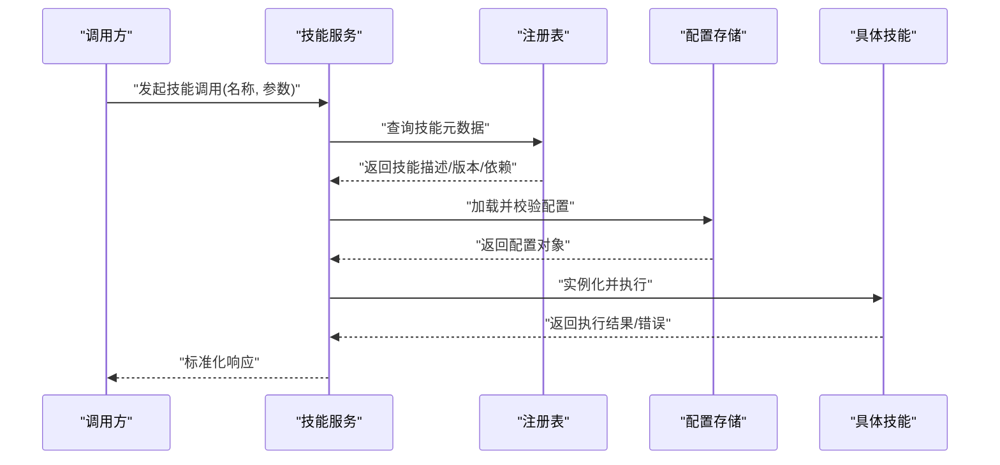

图表来源
- [backend/smartask_advanced/service.py](file://backend/smartask_advanced/service.py)
- [backend/smartask_advanced/registry.py](file://backend/smartask_advanced/registry.py)
- [backend/smartask_advanced/config_store.py](file://backend/smartask_advanced/config_store.py)

## 详细组件分析

### 技能基类与契约（common.py / answer_contract.py）
- 统一输入输出模型：定义技能输入的结构化字段、必填项与类型约束；输出包含数据、元信息与状态码
- 错误处理约定：异常分类（参数错误、执行失败、外部依赖不可用）、错误码与消息格式
- 日志记录规范：结构化日志（上下文ID、耗时、关键指标），便于追踪与审计
- 契约校验：在技能入口处对输入进行快速校验，减少无效执行

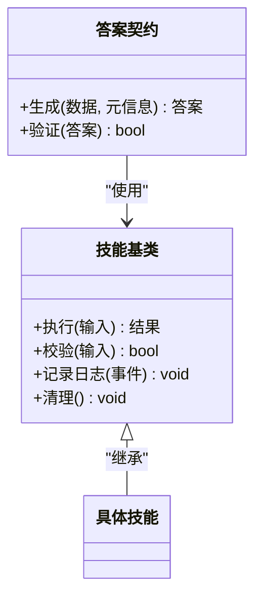

图表来源
- [backend/smartask_advanced/skills/common.py](file://backend/smartask_advanced/skills/common.py)
- [backend/smartask_advanced/skills/answer_contract.py](file://backend/smartask_advanced/skills/answer_contract.py)

章节来源
- [backend/smartask_advanced/skills/common.py](file://backend/smartask_advanced/skills/common.py)
- [backend/smartask_advanced/skills/answer_contract.py](file://backend/smartask_advanced/skills/answer_contract.py)

### 注册表（registry.py）
- 技能注册：支持按名称、版本、标签注册，避免重复与冲突
- 元数据管理：保存依赖、权限、超时、重试策略等
- 查找与选择：根据上下文与优先级选择最佳匹配技能
- 生命周期钩子：初始化、预热、销毁

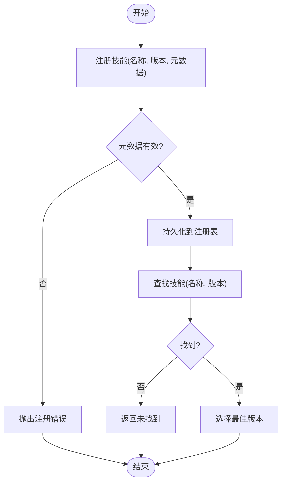

图表来源
- [backend/smartask_advanced/registry.py](file://backend/smartask_advanced/registry.py)

章节来源
- [backend/smartask_advanced/registry.py](file://backend/smartask_advanced/registry.py)

### 配置存储（config_store.py）
- 配置加载：从环境变量、配置文件或远程配置源加载
- 校验与默认值：强制字段校验、缺失字段填充默认值
- 缓存与热更新：内存缓存提升读取性能，支持运行时刷新

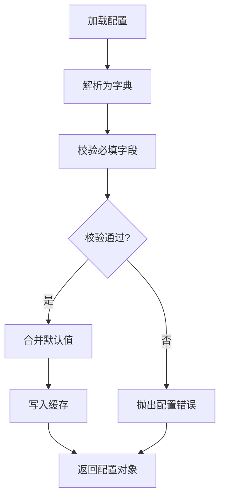

图表来源
- [backend/smartask_advanced/config_store.py](file://backend/smartask_advanced/config_store.py)

章节来源
- [backend/smartask_advanced/config_store.py](file://backend/smartask_advanced/config_store.py)

### 技能示例：Pandas 分析（pandas_analyze.py）
- 功能：对传入的数据集进行统计分析与可视化准备
- 输入：数据集、分析维度、聚合函数
- 输出：统计结果、图表数据、质量报告
- 错误：数据类型不匹配、空数据集、计算超时

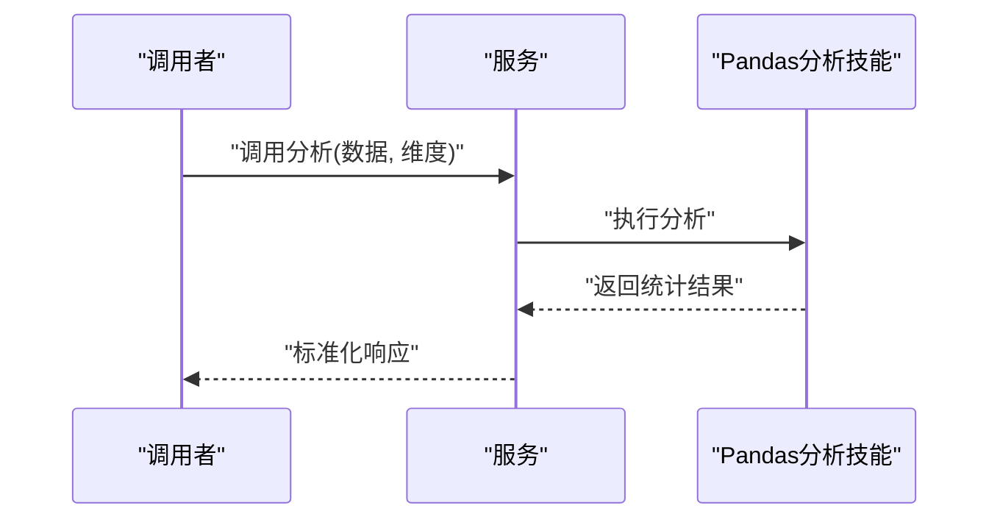

图表来源
- [backend/smartask_advanced/skills/pandas_analyze.py](file://backend/smartask_advanced/skills/pandas_analyze.py)

章节来源
- [backend/smartask_advanced/skills/pandas_analyze.py](file://backend/smartask_advanced/skills/pandas_analyze.py)

### 技能示例：SQL 质量评估（sql_quality.py）
- 功能：评估 SQL 语句的可读性、性能与安全性
- 输入：SQL 文本、数据库方言、规则集
- 输出：质量分数、问题列表、优化建议
- 错误：语法错误、方言不支持、规则加载失败

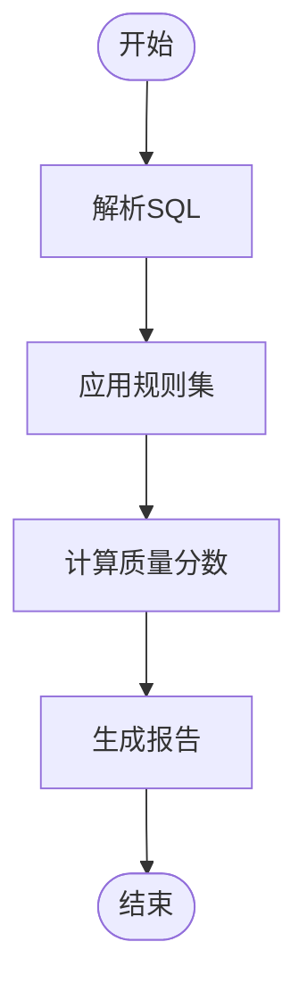

图表来源
- [backend/smartask_advanced/skills/sql_quality.py](file://backend/smartask_advanced/skills/sql_quality.py)

章节来源
- [backend/smartask_advanced/skills/sql_quality.py](file://backend/smartask_advanced/skills/sql_quality.py)

### 技能示例：路由守卫（route_guard.py）
- 功能：在执行前进行权限、配额与条件检查
- 输入：用户上下文、资源标识、操作类型
- 输出：允许/拒绝决策及原因
- 错误：上下文缺失、权限不足、配额超限

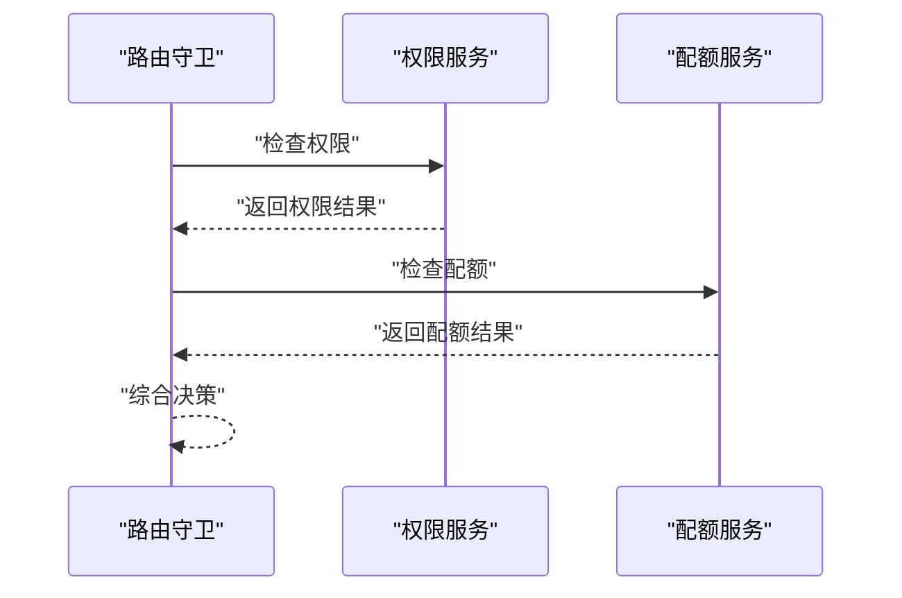

图表来源
- [backend/smartask_advanced/skills/route_guard.py](file://backend/smartask_advanced/skills/route_guard.py)

章节来源
- [backend/smartask_advanced/skills/route_guard.py](file://backend/smartask_advanced/skills/route_guard.py)

### 技能示例：数据集路由（dataset_route.py）
- 功能：根据查询意图选择最合适的数据集
- 输入：自然语言问题、数据集索引、语义映射
- 输出：候选数据集列表、置信度
- 错误：索引缺失、语义匹配失败

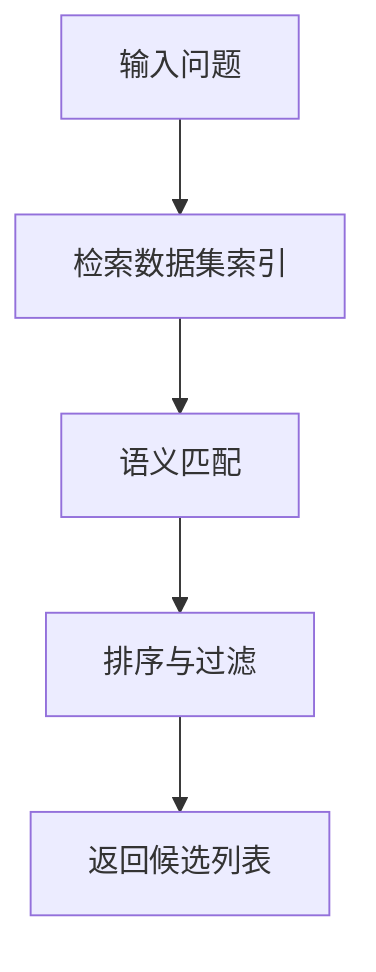

图表来源
- [backend/smartask_advanced/skills/dataset_route.py](file://backend/smartask_advanced/skills/dataset_route.py)

章节来源
- [backend/smartask_advanced/skills/dataset_route.py](file://backend/smartask_advanced/skills/dataset_route.py)

### 技能示例：证据投票（evidence_vote.py）
- 功能：对多个证据源进行加权投票，得出最终结论
- 输入：证据列表、权重配置、阈值
- 输出：投票结果、置信度、依据摘要
- 错误：证据为空、权重非法、阈值越界

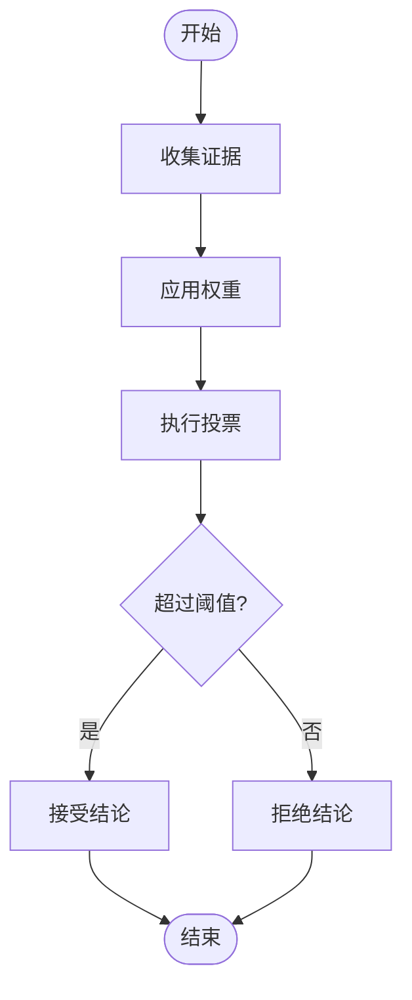

图表来源
- [backend/smartask_advanced/skills/evidence_vote.py](file://backend/smartask_advanced/skills/evidence_vote.py)

章节来源
- [backend/smartask_advanced/skills/evidence_vote.py](file://backend/smartask_advanced/skills/evidence_vote.py)

### 技能示例：黄金 SQL（golden_sql.py）
- 功能：基于历史优质 SQL 生成新查询
- 输入：问题描述、模板库、约束条件
- 输出：SQL 语句、解释说明、风险等级
- 错误：模板缺失、约束冲突、生成失败

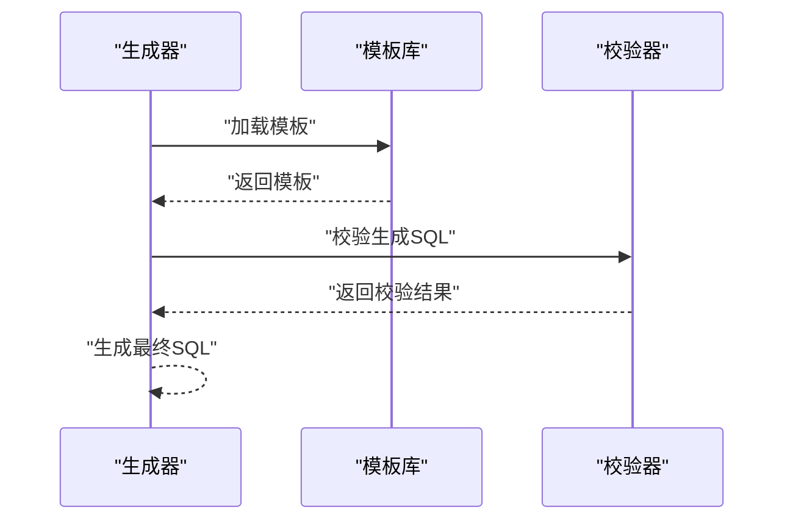

图表来源
- [backend/smartask_advanced/skills/golden_sql.py](file://backend/smartask_advanced/skills/golden_sql.py)

章节来源
- [backend/smartask_advanced/skills/golden_sql.py](file://backend/smartask_advanced/skills/golden_sql.py)

### 技能示例：规划器（planner.py）
- 功能：将复杂任务分解为子任务序列
- 输入：目标描述、可用技能、约束
- 输出：执行计划、依赖图、回滚策略
- 错误：循环依赖、资源不足、计划不可行

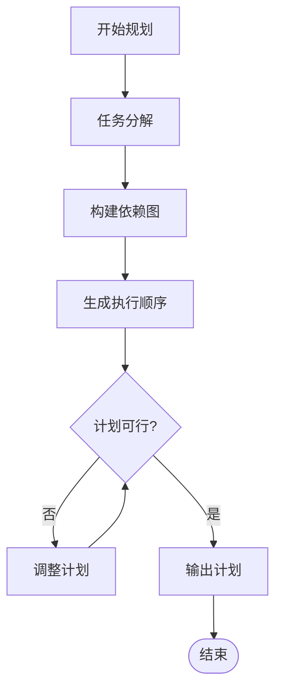

图表来源
- [backend/smartask_advanced/skills/planner.py](file://backend/smartask_advanced/skills/planner.py)

章节来源
- [backend/smartask_advanced/skills/planner.py](file://backend/smartask_advanced/skills/planner.py)

### 技能示例：自检（self_check.py）
- 功能：在关键节点进行健康检查与一致性验证
- 输入：检查项、阈值、上下文
- 输出：检查结果、告警信息
- 错误：检查项缺失、阈值非法、上下文不完整

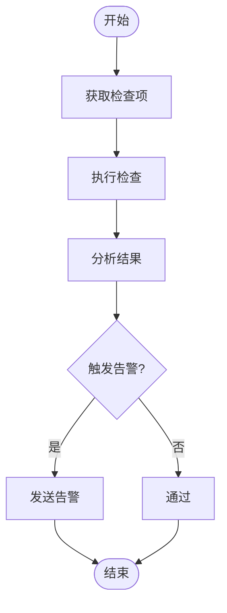

图表来源
- [backend/smartask_advanced/skills/self_check.py](file://backend/smartask_advanced/skills/self_check.py)

章节来源
- [backend/smartask_advanced/skills/self_check.py](file://backend/smartask_advanced/skills/self_check.py)

### 技能示例：模板策略（template_policy.py）
- 功能：根据场景选择并应用模板策略
- 输入：场景标识、策略库、参数
- 输出：策略结果、应用日志
- 错误：策略不存在、参数不匹配

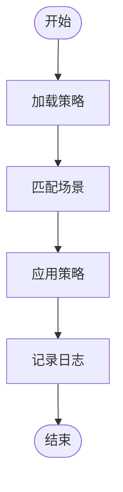

图表来源
- [backend/smartask_advanced/skills/template_policy.py](file://backend/smartask_advanced/skills/template_policy.py)

章节来源
- [backend/smartask_advanced/skills/template_policy.py](file://backend/smartask_advanced/skills/template_policy.py)

### 技能示例：结论建议（conclusion_advice.py）
- 功能：基于分析结果生成可读结论与建议
- 输入：分析数据、业务规则、表达风格
- 输出：结论文本、建议列表、置信度
- 错误：数据缺失、规则冲突、风格不支持

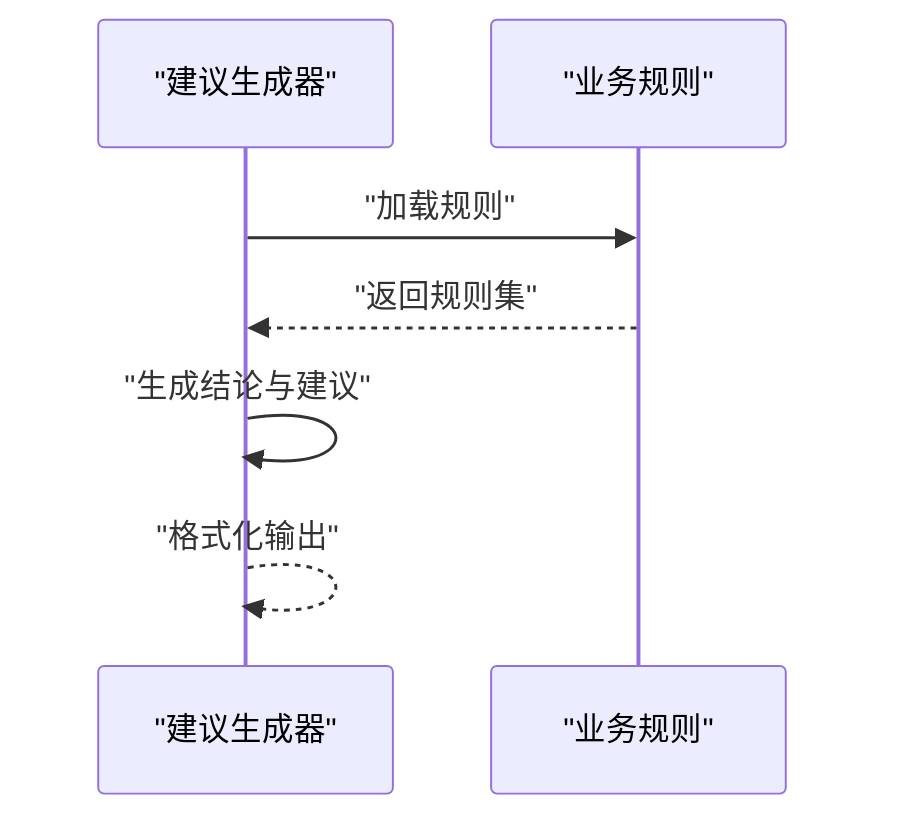

图表来源
- [backend/smartask_advanced/skills/conclusion_advice.py](file://backend/smartask_advanced/skills/conclusion_advice.py)

章节来源
- [backend/smartask_advanced/skills/conclusion_advice.py](file://backend/smartask_advanced/skills/conclusion_advice.py)

### 技能示例：资产打包（asset_pack.py）
- 功能：将多个技能产物打包为可分发资产
- 输入：技能结果、元数据、签名密钥
- 输出：压缩包、哈希值、清单
- 错误：打包失败、签名失败、清单不一致

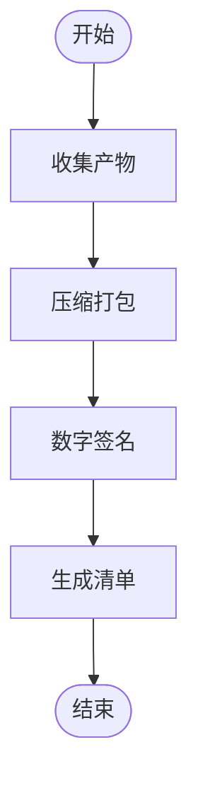

图表来源
- [backend/smartask_advanced/skills/asset_pack.py](file://backend/smartask_advanced/skills/asset_pack.py)

章节来源
- [backend/smartask_advanced/skills/asset_pack.py](file://backend/smartask_advanced/skills/asset_pack.py)

## 依赖关系分析
- 服务层依赖注册表与配置存储，用于技能发现与参数装配
- 各技能之间通过共享契约与中间数据进行协作，避免直接耦合
- 测试用例覆盖控制器、安全守卫与路由分支，确保端到端正确性

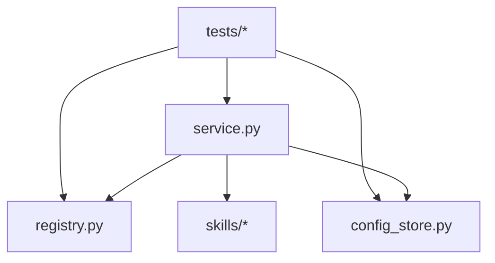

图表来源
- [backend/smartask_advanced/service.py](file://backend/smartask_advanced/service.py)
- [backend/smartask_advanced/registry.py](file://backend/smartask_advanced/registry.py)
- [backend/smartask_advanced/config_store.py](file://backend/smartask_advanced/config_store.py)
- [backend/tests/test_ask_flow_controller.py](file://backend/tests/test_ask_flow_controller.py)
- [backend/tests/test_security_guards.py](file://backend/tests/test_security_guards.py)
- [backend/tests/test_basic_unique_level_routing.py](file://backend/tests/test_basic_unique_level_routing.py)

章节来源
- [backend/smartask_advanced/service.py](file://backend/smartask_advanced/service.py)
- [backend/smartask_advanced/registry.py](file://backend/smartask_advanced/registry.py)
- [backend/smartask_advanced/config_store.py](file://backend/smartask_advanced/config_store.py)
- [backend/tests/test_ask_flow_controller.py](file://backend/tests/test_ask_flow_controller.py)
- [backend/tests/test_security_guards.py](file://backend/tests/test_security_guards.py)
- [backend/tests/test_basic_unique_level_routing.py](file://backend/tests/test_basic_unique_level_routing.py)

## 性能考虑
- 注册表查找：使用索引与缓存降低查找开销，避免重复解析
- 配置加载：延迟加载与按需刷新，减少启动时间
- 技能执行：并行执行无依赖技能，设置超时与熔断保护
- 数据流：避免大对象拷贝，使用流式处理与增量计算
- 日志记录：采样与异步写入，降低 I/O 影响

[本节为通用指导，无需特定文件引用]

## 故障排查指南
- 注册失败：检查元数据完整性与版本冲突
- 配置错误：确认必填字段与类型约束
- 技能执行异常：查看结构化日志中的错误码与上下文
- 性能退化：监控耗时与资源占用，识别瓶颈点
- 测试失败：核对模拟数据与期望输出的一致性

章节来源
- [backend/smartask_advanced/registry.py](file://backend/smartask_advanced/registry.py)
- [backend/smartask_advanced/config_store.py](file://backend/smartask_advanced/config_store.py)
- [backend/smartask_advanced/skills/common.py](file://backend/smartask_advanced/skills/common.py)
- [backend/tests/test_ask_flow_controller.py](file://backend/tests/test_ask_flow_controller.py)
- [backend/tests/test_security_guards.py](file://backend/tests/test_security_guards.py)
- [backend/tests/test_basic_unique_level_routing.py](file://backend/tests/test_basic_unique_level_routing.py)

## 结论
SmartAsk 技能系统通过统一契约、集中注册与灵活编排，实现了高内聚、低耦合的技能生态。开发者可基于基类快速实现自定义技能，借助配置与测试工具保障质量与稳定性。建议在生产环境中启用监控与告警，持续优化性能与可靠性。

[本节为总结性内容，无需特定文件引用]

## 附录
- 开发步骤概览：
  - 继承基类并实现必要方法
  - 在注册表中登记技能元数据
  - 编写单元测试与集成测试
  - 配置运行时参数与日志级别
  - 部署与灰度发布

[本节为补充信息，无需特定文件引用]