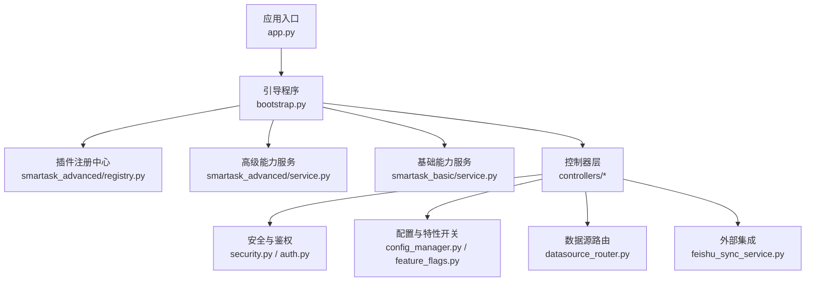
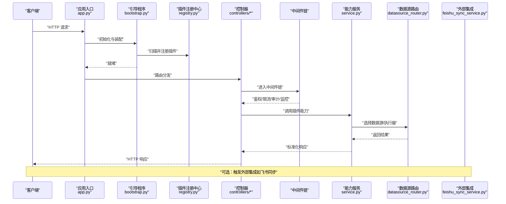
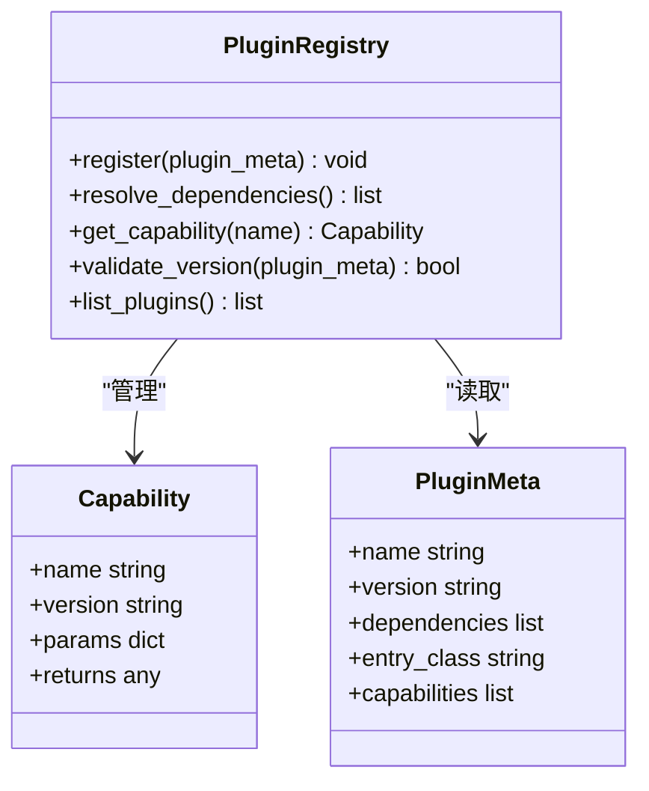
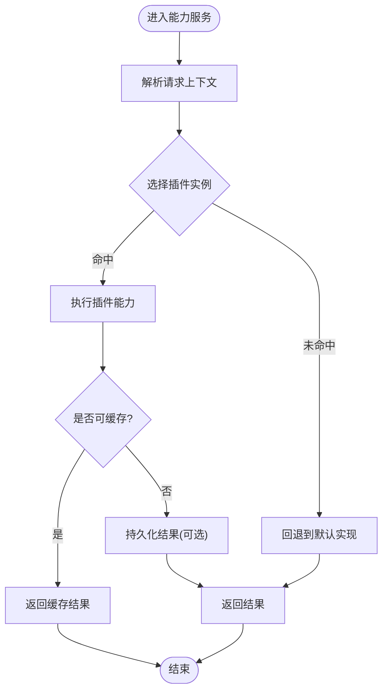
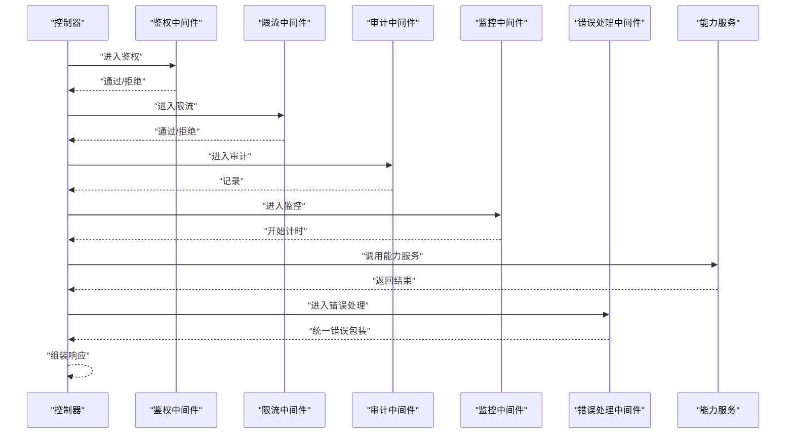
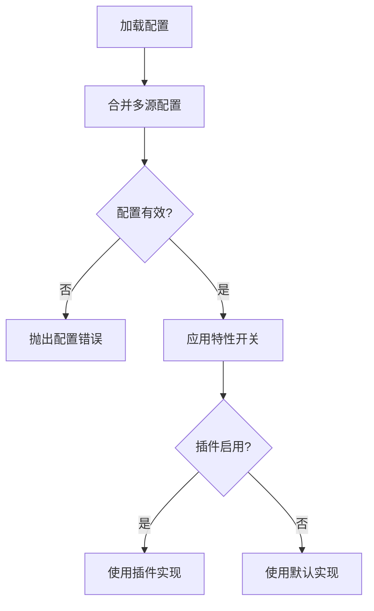
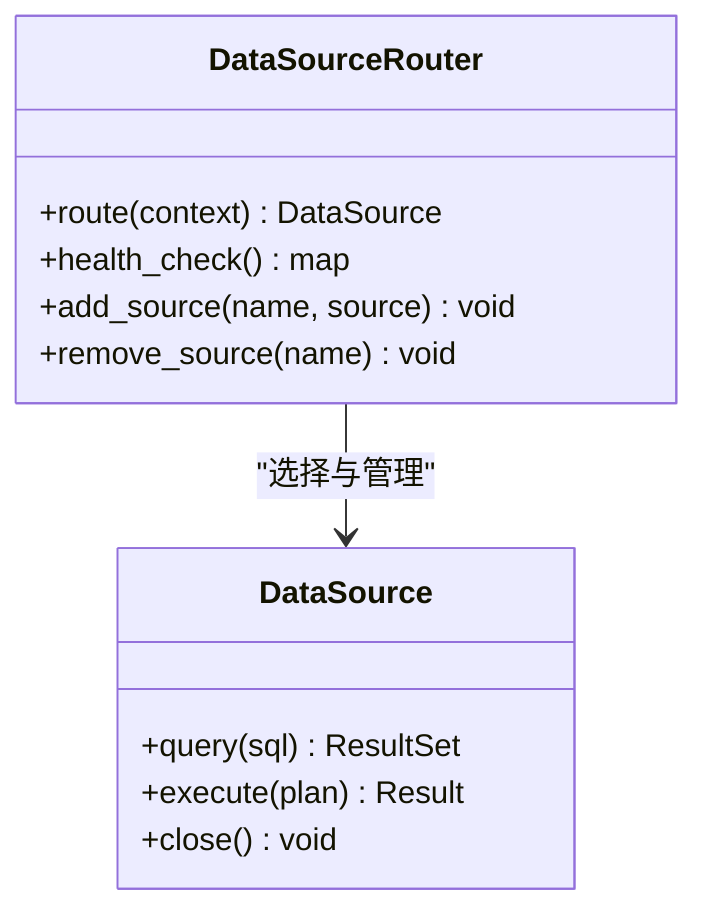
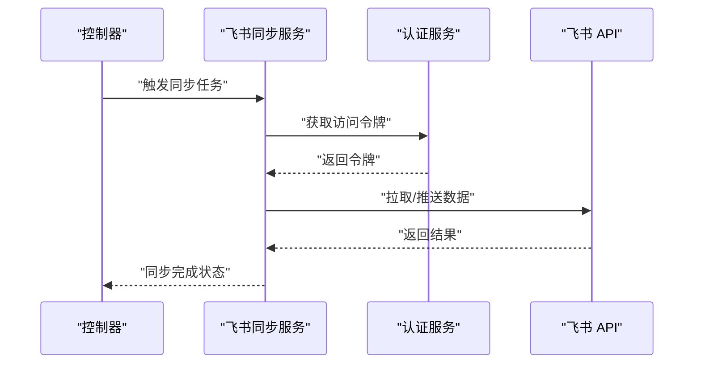
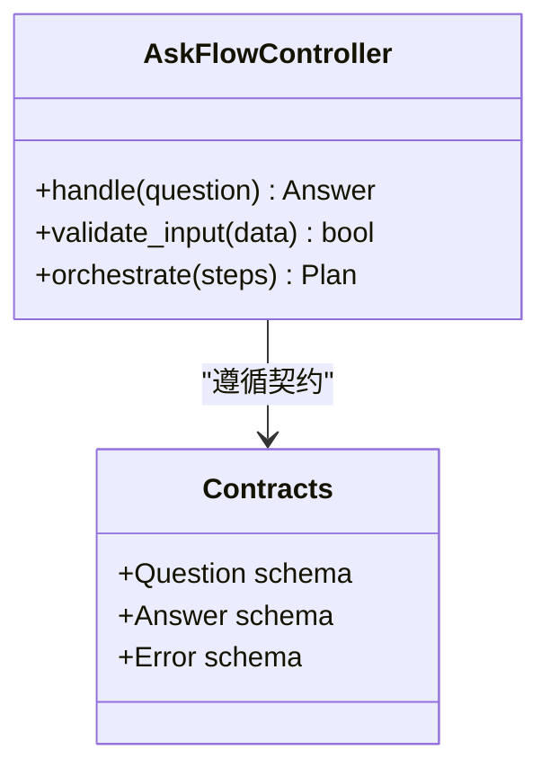
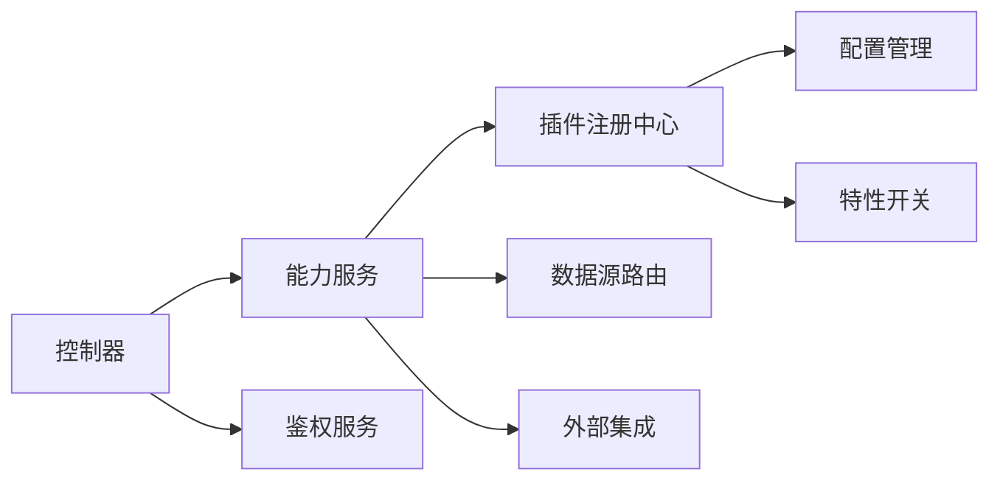

# 插件架构

<cite>
**本文引用的文件**   
- [backend/app.py](file://backend/app.py)
- [backend/bootstrap.py](file://backend/bootstrap.py)
- [backend/agent_registry.py](file://backend/agent_registry.py)
- [backend/smartask_advanced/service.py](file://backend/smartask_advanced/service.py)
- [backend/smartask_advanced/registry.py](file://backend/smartask_advanced/registry.py)
- [backend/smartask_basic/service.py](file://backend/smartask_basic/service.py)
- [backend/controllers/advanced_capabilities.py](file://backend/controllers/advanced_capabilities.py)
- [backend/controllers/auth.py](file://backend/controllers/auth.py)
- [backend/security.py](file://backend/security.py)
- [backend/config_manager.py](file://backend/config_manager.py)
- [backend/feature_flags.py](file://backend/feature_flags.py)
- [backend/datasource_router.py](file://backend/datasource_router.py)
- [backend/feishu_sync_service.py](file://backend/feishu_sync_service.py)
- [backend/ask_flow/controller.py](file://backend/ask_flow/controller.py)
- [backend/ask_flow/contracts.py](file://backend/ask_flow/contracts.py)
</cite>

## 目录
1. [引言](#引言)
2. [项目结构](#项目结构)
3. [核心组件](#核心组件)
4. [架构总览](#架构总览)
5. [详细组件分析](#详细组件分析)
6. [依赖关系分析](#依赖关系分析)
7. [性能考量](#性能考量)
8. [故障排查指南](#故障排查指南)
9. [结论](#结论)
10. [附录](#附录)

## 引言
本文件为 SmartAsk 智能问数平台的“插件架构”文档，面向开发者与集成方，系统化阐述插件系统的设计原理与实现要点。内容覆盖：
- 插件发现机制、加载顺序、依赖管理与版本兼容性
- 中间件开发模式（请求拦截、响应处理、错误处理、性能监控）
- 钩子函数使用场景（生命周期钩子、事件钩子、条件钩子）
- 第三方集成最佳实践（API 适配、认证集成、数据同步、消息通知）
- 安全考虑（权限控制、资源隔离、沙箱机制）
- 插件开发示例与调试指南

## 项目结构
SmartAsk 后端采用分层与模块化组织方式，插件相关能力主要分布在以下位置：
- 应用启动与装配：入口与引导程序负责初始化配置、注册服务与控制器
- 插件注册中心：集中管理插件元数据、能力声明与生命周期
- 领域服务：高级能力与基础能力的服务层，体现插件化扩展点
- 控制器层：对外暴露 API，承载中间件链路与鉴权逻辑
- 安全与配置：统一的安全策略、特性开关与配置管理
- 数据源路由：按插件能力选择数据源或执行器
- 外部集成：如飞书同步等可插拔的集成模块

图表来源
- [backend/app.py](file://backend/app.py)
- [backend/bootstrap.py](file://backend/bootstrap.py)
- [backend/smartask_advanced/registry.py](file://backend/smartask_advanced/registry.py)
- [backend/smartask_advanced/service.py](file://backend/smartask_advanced/service.py)
- [backend/smartask_basic/service.py](file://backend/smartask_basic/service.py)
- [backend/controllers/advanced_capabilities.py](file://backend/controllers/advanced_capabilities.py)
- [backend/security.py](file://backend/security.py)
- [backend/auth.py](file://backend/controllers/auth.py)
- [backend/config_manager.py](file://backend/config_manager.py)
- [backend/feature_flags.py](file://backend/feature_flags.py)
- [backend/datasource_router.py](file://backend/datasource_router.py)
- [backend/feishu_sync_service.py](file://backend/feishu_sync_service.py)

章节来源
- [backend/app.py](file://backend/app.py)
- [backend/bootstrap.py](file://backend/bootstrap.py)

## 核心组件
- 插件注册中心：维护插件清单、能力接口、版本约束与依赖图；提供查询、校验与排序能力
- 能力服务层：将插件能力封装为可调用的服务方法，屏蔽底层差异
- 控制器与中间件：在请求链路中注入鉴权、限流、审计、缓存、监控等横切关注点
- 配置与特性开关：通过配置项与特性标志控制插件启用、降级与灰度发布
- 数据源路由：根据插件能力与上下文动态选择数据源或执行器
- 外部集成适配器：以插件形式接入第三方系统（如飞书），遵循统一契约

章节来源
- [backend/smartask_advanced/registry.py](file://backend/smartask_advanced/registry.py)
- [backend/smartask_advanced/service.py](file://backend/smartask_advanced/service.py)
- [backend/smartask_basic/service.py](file://backend/smartask_basic/service.py)
- [backend/controllers/advanced_capabilities.py](file://backend/controllers/advanced_capabilities.py)
- [backend/datasource_router.py](file://backend/datasource_router.py)
- [backend/feishu_sync_service.py](file://backend/feishu_sync_service.py)

## 架构总览
下图展示从请求进入至插件执行的端到端流程，包括中间件链、插件注册与调度、以及外部集成。

图表来源
- [backend/app.py](file://backend/app.py)
- [backend/bootstrap.py](file://backend/bootstrap.py)
- [backend/smartask_advanced/registry.py](file://backend/smartask_advanced/registry.py)
- [backend/controllers/advanced_capabilities.py](file://backend/controllers/advanced_capabilities.py)
- [backend/smartask_advanced/service.py](file://backend/smartask_advanced/service.py)
- [backend/datasource_router.py](file://backend/datasource_router.py)
- [backend/feishu_sync_service.py](file://backend/feishu_sync_service.py)

## 详细组件分析

### 插件注册中心与发现机制
- 插件发现：启动时扫描指定目录或包，读取插件元数据（名称、版本、能力列表、依赖、入口类）
- 能力声明：每个插件声明其提供的能力接口与参数契约，供上层服务调用
- 依赖解析：构建依赖图并进行拓扑排序，确保加载顺序正确
- 版本兼容：校验插件版本与平台版本的兼容性矩阵，不满足则拒绝加载或降级

图表来源
- [backend/smartask_advanced/registry.py](file://backend/smartask_advanced/registry.py)

章节来源
- [backend/smartask_advanced/registry.py](file://backend/smartask_advanced/registry.py)

### 能力服务层与插件调度
- 服务封装：将插件能力封装为标准服务方法，统一输入输出格式
- 调度策略：根据请求上下文（用户、租户、数据集、功能开关）选择合适插件实例
- 降级与回退：当主插件不可用时，自动切换到备用实现或默认行为
- 缓存与批处理：对热点能力进行结果缓存与批量优化

图表来源
- [backend/smartask_advanced/service.py](file://backend/smartask_advanced/service.py)
- [backend/smartask_basic/service.py](file://backend/smartask_basic/service.py)

章节来源
- [backend/smartask_advanced/service.py](file://backend/smartask_advanced/service.py)
- [backend/smartask_basic/service.py](file://backend/smartask_basic/service.py)

### 控制器与中间件链
- 控制器职责：路由分发、参数校验、调用能力服务、组装响应
- 中间件链：鉴权、限流、审计、缓存、监控、错误处理、响应格式化
- 错误处理：统一异常捕获、错误码映射、日志记录与告警
- 性能监控：埋点统计耗时、吞吐、错误率，支持追踪 ID

图表来源
- [backend/controllers/advanced_capabilities.py](file://backend/controllers/advanced_capabilities.py)
- [backend/controllers/auth.py](file://backend/controllers/auth.py)
- [backend/security.py](file://backend/security.py)

章节来源
- [backend/controllers/advanced_capabilities.py](file://backend/controllers/advanced_capabilities.py)
- [backend/controllers/auth.py](file://backend/controllers/auth.py)
- [backend/security.py](file://backend/security.py)

### 配置与特性开关
- 配置管理：集中读取环境变量、配置文件与远程配置，支持热更新
- 特性开关：按租户、用户、路径维度控制插件启用与灰度发布
- 降级策略：当特性关闭或依赖不可用时，自动切换默认实现

图表来源
- [backend/config_manager.py](file://backend/config_manager.py)
- [backend/feature_flags.py](file://backend/feature_flags.py)

章节来源
- [backend/config_manager.py](file://backend/config_manager.py)
- [backend/feature_flags.py](file://backend/feature_flags.py)

### 数据源路由
- 路由策略：基于数据集、租户、权限与插件能力选择数据源
- 连接池：复用连接，提升并发性能
- 健康检查：定期检测数据源可用性，失败自动切换

图表来源
- [backend/datasource_router.py](file://backend/datasource_router.py)

章节来源
- [backend/datasource_router.py](file://backend/datasource_router.py)

### 外部集成（以飞书为例）
- 适配器模式：统一抽象第三方 API，屏蔽差异
- 认证集成：OAuth、Token 轮换、签名校验
- 数据同步：增量同步、冲突解决、幂等性保证
- 消息通知：异步任务、重试与失败告警

图表来源
- [backend/feishu_sync_service.py](file://backend/feishu_sync_service.py)

章节来源
- [backend/feishu_sync_service.py](file://backend/feishu_sync_service.py)

### 问数流程与契约
- 流程控制器：编排问数步骤（意图识别、SQL 生成、执行、结果聚合）
- 契约定义：明确输入输出结构、错误码与重试策略

图表来源
- [backend/ask_flow/controller.py](file://backend/ask_flow/controller.py)
- [backend/ask_flow/contracts.py](file://backend/ask_flow/contracts.py)

章节来源
- [backend/ask_flow/controller.py](file://backend/ask_flow/controller.py)
- [backend/ask_flow/contracts.py](file://backend/ask_flow/contracts.py)

## 依赖关系分析
- 组件耦合：控制器依赖能力服务，能力服务依赖插件注册中心与数据源路由
- 外部依赖：认证服务、第三方 API（如飞书）、数据库连接池
- 循环依赖：通过接口抽象与延迟导入避免
- 版本兼容：插件元数据声明版本范围，启动时校验

图表来源
- [backend/controllers/advanced_capabilities.py](file://backend/controllers/advanced_capabilities.py)
- [backend/smartask_advanced/service.py](file://backend/smartask_advanced/service.py)
- [backend/smartask_advanced/registry.py](file://backend/smartask_advanced/registry.py)
- [backend/datasource_router.py](file://backend/datasource_router.py)
- [backend/controllers/auth.py](file://backend/controllers/auth.py)
- [backend/feishu_sync_service.py](file://backend/feishu_sync_service.py)
- [backend/config_manager.py](file://backend/config_manager.py)
- [backend/feature_flags.py](file://backend/feature_flags.py)

章节来源
- [backend/smartask_advanced/service.py](file://backend/smartask_advanced/service.py)
- [backend/smartask_advanced/registry.py](file://backend/smartask_advanced/registry.py)
- [backend/datasource_router.py](file://backend/datasource_router.py)
- [backend/controllers/auth.py](file://backend/controllers/auth.py)
- [backend/feishu_sync_service.py](file://backend/feishu_sync_service.py)
- [backend/config_manager.py](file://backend/config_manager.py)
- [backend/feature_flags.py](file://backend/feature_flags.py)

## 性能考量
- 插件加载：启动时预加载与懒加载结合，减少冷启动时间
- 中间件链：最小化中间件数量，避免重复计算
- 缓存策略：热点数据多级缓存（内存、分布式缓存）
- 连接池：数据库与外部 API 连接复用与超时控制
- 监控埋点：关键路径耗时、错误率、资源使用率采集

## 故障排查指南
- 插件加载失败：检查元数据完整性、依赖解析与版本兼容性
- 能力调用异常：查看中间件链日志、错误码映射与堆栈信息
- 数据源问题：健康检查状态、连接池耗尽、权限不足
- 外部集成失败：认证过期、网络超时、限流与重试策略
- 配置错误：环境变量缺失、特性开关误配、热更新未生效

章节来源
- [backend/security.py](file://backend/security.py)
- [backend/controllers/auth.py](file://backend/controllers/auth.py)
- [backend/config_manager.py](file://backend/config_manager.py)
- [backend/feature_flags.py](file://backend/feature_flags.py)

## 结论
SmartAsk 插件架构通过统一的注册中心、能力服务层与中间件链，实现了高内聚、低耦合的可扩展设计。借助配置与特性开关，平台能够灵活地启用、降级与灰度插件能力。未来可进一步引入更细粒度的权限控制、沙箱执行环境与更丰富的监控指标，以提升安全性与可观测性。

## 附录

### 插件开发示例（概念性）
- 创建插件元数据：声明名称、版本、依赖与能力列表
- 实现能力接口：遵循统一契约，处理输入输出与错误
- 注册插件：在引导阶段自动发现并注册
- 测试与调试：单元测试、集成测试与性能基准

### 调试指南
- 启用调试日志：增加日志级别与追踪 ID
- 断点与堆栈：定位中间件与插件调用链
- 模拟外部依赖：Mock 第三方 API 与数据源
- 性能剖析：火焰图与慢查询分析