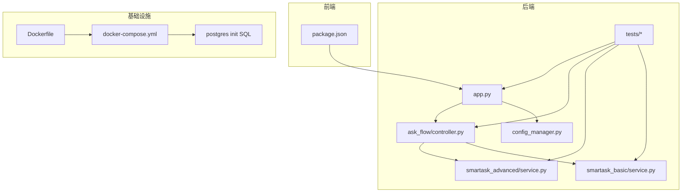
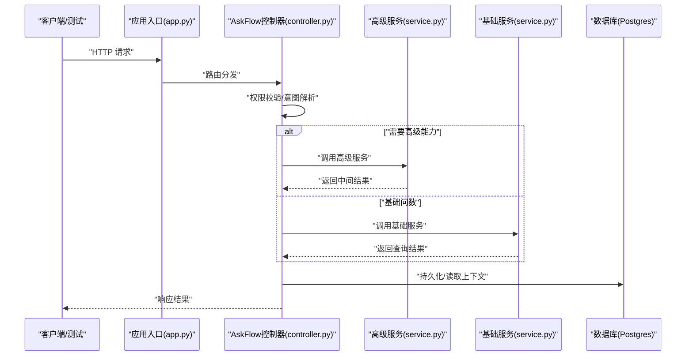
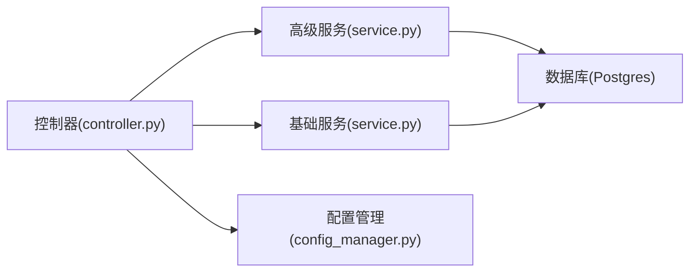

# 测试与调试

<cite>
**本文引用的文件**   
- [backend/tests/test_ask_flow_controller.py](file://backend/tests/test_ask_flow_controller.py)
- [backend/tests/test_advanced_cross_dataset.py](file://backend/tests/test_advanced_cross数据集.py)
- [backend/tests/test_basic_route_branch_disambiguation.py](file://backend/tests/test_basic_route_branch_disambiguation.py)
- [backend/tests/test_security_guards.py](file://backend/tests/test_security_guards.py)
- [backend/app.py](file://backend/app.py)
- [backend/ask_flow/controller.py](file://backend/ask_flow/controller.py)
- [backend/smartask_advanced/service.py](file://backend/smartask_advanced/service.py)
- [backend/smartask_basic/service.py](file://backend/smartask_basic/service.py)
- [backend/config_manager.py](file://backend/config_manager.py)
- [docker-compose.yml](file://docker-compose.yml)
- [scripts/integration_test.py](file://scripts/integration_test.py)
- [config/run_smartask_tests.py](file://config/run_smartask_tests.py)
- [frontend/package.json](file://frontend/package.json)
- [backend/Dockerfile](file://backend/Dockerfile)
- [docker/postgres/init/001_bookshelf_schema.sql](file://docker/postgres/init/001_bookshelf_schema.sql)
</cite>

## 目录
1. [简介](#简介)
2. [项目结构](#项目结构)
3. [核心组件](#核心组件)
4. [架构总览](#架构总览)
5. [详细组件分析](#详细组件分析)
6. [依赖分析](#依赖分析)
7. [性能考虑](#性能考虑)
8. [故障排查指南](#故障排查指南)
9. [结论](#结论)
10. [附录](#附录)

## 简介
本文件面向 SmartAsk 智能问数平台的测试与调试，覆盖单元测试、集成测试、端到端测试与性能测试的编写方法；说明如何为技能（skills）和插件编写测试用例，包括模拟数据准备、外部依赖 Mock 与断言验证；提供调试技巧与工具使用（日志分析、性能剖析、内存泄漏检测、并发问题排查）；详述测试环境搭建（测试数据库配置、Mock 服务、测试数据管理）；并给出持续集成中的测试自动化方案（覆盖率要求、质量门禁、发布前检查），以及常见问题调试方法与性能优化建议。

## 项目结构
SmartAsk 后端基于 Python，前端基于 Vue/Vite，测试主要位于 backend/tests 与 scripts 目录，同时包含 Docker Compose 与数据库初始化脚本，便于快速构建本地与 CI 测试环境。

图表来源 
- [backend/app.py](file://backend/app.py)
- [backend/ask_flow/controller.py](file://backend/ask_flow/controller.py)
- [backend/smartask_advanced/service.py](file://backend/smartask_advanced/service.py)
- [backend/smartask_basic/service.py](file://backend/smartask_basic/service.py)
- [backend/config_manager.py](file://backend/config_manager.py)
- [docker-compose.yml](file://docker-compose.yml)
- [docker/postgres/init/001_bookshelf_schema.sql](file://docker/postgres/init/001_bookshelf_schema.sql)
- [backend/Dockerfile](file://backend/Dockerfile)
- [frontend/package.json](file://frontend/package.json)

章节来源
- [backend/app.py](file://backend/app.py)
- [backend/ask_flow/controller.py](file://backend/ask_flow/controller.py)
- [backend/smartask_advanced/service.py](file://backend/smartask_advanced/service.py)
- [backend/smartask_basic/service.py](file://backend/smartask_basic/service.py)
- [backend/config_manager.py](file://backend/config_manager.py)
- [docker-compose.yml](file://docker-compose.yml)
- [docker/postgres/init/001_bookshelf_schema.sql](file://docker/postgres/init/001_bookshelf_schema.sql)
- [backend/Dockerfile](file://backend/Dockerfile)
- [frontend/package.json](file://frontend/package.json)

## 核心组件
- 应用入口与路由：后端主应用负责注册 API 路由、加载配置、启动服务。
- Ask Flow 控制器：编排问答流程、权限校验、路由分支与消歧。
- 高级与基础服务：分别实现高阶能力（如跨数据集推理、策略执行）与基础问数能力。
- 配置管理：集中管理运行时配置、特性开关与外部服务连接参数。
- 测试套件：围绕控制器与服务进行单元与集成测试，覆盖权限、路由、意图识别等关键路径。

章节来源
- [backend/app.py](file://backend/app.py)
- [backend/ask_flow/controller.py](file://backend/ask_flow/controller.py)
- [backend/smartask_advanced/service.py](file://backend/smartask_advanced/service.py)
- [backend/smartask_basic/service.py](file://backend/smartask_basic/service.py)
- [backend/config_manager.py](file://backend/config_manager.py)

## 架构总览
下图展示从请求进入、Ask Flow 编排到具体服务执行的调用链，以及测试如何注入 Mock 与断言结果。

图表来源 
- [backend/app.py](file://backend/app.py)
- [backend/ask_flow/controller.py](file://backend/ask_flow/controller.py)
- [backend/smartask_advanced/service.py](file://backend/smartask_advanced/service.py)
- [backend/smartask_basic/service.py](file://backend/smartask_basic/service.py)

## 详细组件分析

### 单元测试策略与示例
- 目标：对控制器与服务的关键逻辑进行隔离测试，确保输入输出正确、异常路径可复现。
- 要点：
  - 使用轻量 Mock 替代数据库与外部 LLM/缓存服务。
  - 构造最小化输入数据，覆盖正常与边界条件。
  - 断言返回值结构与状态码，必要时断言副作用（如日志或事件）。
- 参考用例：
  - 控制器行为与权限校验
  - 路由分支与消歧逻辑
  - 安全守卫与访问控制

章节来源
- [backend/tests/test_ask_flow_controller.py](file://backend/tests/test_ask_flow_controller.py)
- [backend/tests/test_basic_route_branch_disambiguation.py](file://backend/tests/test_basic_route_branch_disambiguation.py)
- [backend/tests/test_security_guards.py](file://backend/tests/test_security_guards.py)

### 集成测试策略与示例
- 目标：验证多组件协作的正确性，包括数据库交互、权限体系、跨数据集推理链路。
- 要点：
  - 使用独立测试数据库实例，通过 Docker Compose 启动 Postgres。
  - 在测试前执行必要的迁移与种子数据初始化。
  - 通过 HTTP 层或内部接口组合调用，断言端到端结果。
- 参考用例：
  - 跨数据集场景下的推理与聚合
  - 复杂权限与组织树路由

章节来源
- [backend/tests/test_advanced_cross_dataset.py](file://backend/tests/test_advanced_cross_dataset.py)
- [docker-compose.yml](file://docker-compose.yml)
- [docker/postgres/init/001_bookshelf_schema.sql](file://docker/postgres/init/001_bookshelf_schema.sql)

### 端到端测试策略
- 目标：模拟真实用户操作，覆盖前端到后端的完整链路。
- 要点：
  - 前端使用 Vite 提供的测试工具（见 package.json 脚本），配合 Mock API。
  - 后端以容器化方式运行，提供稳定的测试基线。
  - 通过脚本驱动端到端用例，收集指标与截图。

章节来源
- [frontend/package.json](file://frontend/package.json)
- [scripts/integration_test.py](file://scripts/integration_test.py)

### 性能测试策略
- 目标：评估高并发与大数据量场景下的稳定性与吞吐。
- 要点：
  - 使用压测工具对关键接口进行负载测试，观察延迟分布与错误率。
  - 结合数据库慢查询分析与索引优化，减少热点路径耗时。
  - 对 LLM 调用进行限流与缓存，避免雪崩。

章节来源
- [backend/app.py](file://backend/app.py)
- [backend/ask_flow/controller.py](file://backend/ask_flow/controller.py)

### 技能与插件测试
- 目标：确保新增或修改的技能/插件不影响既有行为，且满足契约。
- 要点：
  - 为每个技能定义输入/输出契约与边界条件。
  - 使用固定种子数据与确定性随机种子，保证可重复性。
  - 对第三方依赖（如向量库、LLM）进行 Mock，聚焦业务逻辑。

章节来源
- [backend/smartask_advanced/service.py](file://backend/smartask_advanced/service.py)
- [backend/smartask_basic/service.py](file://backend/smartask_basic/service.py)

## 依赖分析
- 模块耦合：
  - 控制器依赖高级/基础服务，服务依赖配置管理与数据库。
  - 测试通过 Mock 降低对外部依赖的耦合度。
- 外部依赖：
  - 数据库（Postgres）、可能的 LLM/缓存服务、文件系统与消息队列。
- 潜在循环依赖：
  - 应避免服务间互相直接引用，统一通过控制器或抽象接口解耦。

图表来源 
- [backend/ask_flow/controller.py](file://backend/ask_flow/controller.py)
- [backend/smartask_advanced/service.py](file://backend/smartask_advanced/service.py)
- [backend/smartask_basic/service.py](file://backend/smartask_basic/service.py)
- [backend/config_manager.py](file://backend/config_manager.py)

章节来源
- [backend/ask_flow/controller.py](file://backend/ask_flow/controller.py)
- [backend/smartask_advanced/service.py](file://backend/smartask_advanced/service.py)
- [backend/smartask_basic/service.py](file://backend/smartask_basic/service.py)
- [backend/config_manager.py](file://backend/config_manager.py)

## 性能考虑
- 数据库层面：
  - 针对高频查询建立合适索引，避免全表扫描。
  - 使用连接池与读写分离（若适用）。
- 应用层面：
  - 对 LLM 调用增加超时与重试上限，启用缓存命中优先。
  - 异步处理耗时任务，避免阻塞请求线程。
- 监控与剖析：
  - 接入性能剖析工具（如 cProfile、py-spy），定位热点函数。
  - 采集关键指标（QPS、P95/P99 延迟、错误率）并设置告警。

[本节为通用指导，不直接分析具体文件]

## 故障排查指南
- 日志分析：
  - 统一结构化日志格式，按请求 ID 追踪链路。
  - 关键节点记录入参、出参与耗时，便于回溯。
- 常见错误：
  - 权限不足：检查 RBAC 规则与组织树映射。
  - 路由歧义：查看意图解析与分支选择逻辑。
  - 数据不一致：核对事务边界与幂等性设计。
- 调试工具：
  - 使用调试器附加进程，设置断点与变量监视。
  - 通过容器日志与数据库慢查询日志定位瓶颈。

章节来源
- [backend/app.py](file://backend/app.py)
- [backend/ask_flow/controller.py](file://backend/ask_flow/controller.py)

## 结论
SmartAsk 的测试与调试体系应围绕“隔离、稳定、可重复”的原则构建：单元测试保障核心逻辑正确性，集成测试验证组件协作，端到端测试贴近真实场景，性能测试确保系统在高负载下稳健运行。通过完善的 Mock、数据管理与 CI 自动化，可在迭代中持续提升质量与交付效率。

[本节为总结性内容，不直接分析具体文件]

## 附录
- 测试环境搭建：
  - 使用 docker-compose 启动 Postgres 与后端服务，执行数据库初始化脚本。
  - 配置环境变量与密钥，确保测试与生产一致。
- 持续集成：
  - 在 CI 中运行单元测试与集成测试，统计覆盖率并设置质量门禁。
  - 发布前执行冒烟测试与回归测试，确保变更安全。
- 常用命令与脚本：
  - 运行测试套件与生成报告。
  - 一键启动/停止测试环境。

章节来源
- [docker-compose.yml](file://docker-compose.yml)
- [docker/postgres/init/001_bookshelf_schema.sql](file://docker/postgres/init/001_bookshelf_schema.sql)
- [scripts/integration_test.py](file://scripts/integration_test.py)
- [config/run_smartask_tests.py](file://config/run_smartask_tests.py)
- [backend/Dockerfile](file://backend/Dockerfile)
- [frontend/package.json](file://frontend/package.json)