# 第三方集成

<cite>
**本文引用的文件**   
- [backend/controllers/feishu_sync.py](file://backend/controllers/feishu_sync.py)
- [backend/feishu_sync_manager.py](file://backend/feishu_sync_manager.py)
- [backend/feishu_sync_service.py](file://backend/feishu_sync_service.py)
- [backend/feishu_url_parser.py](file://backend/feishu_url_parser.py)
- [backend/feishu_sync_logger.py](file://backend/feishu_sync_logger.py)
- [backend/start_feishu_sync.py](file://backend/start_feishu_sync.py)
- [frontend/src/views/FeishuSync.vue](file://frontend/src/views/FeishuSync.vue)
- [frontend/src/utils/feishu.js](file://frontend/src/utils/feishu.js)
- [backend/app.py](file://backend/app.py)
- [backend/auth_store.py](file://backend/auth_store.py)
- [backend/security.py](file://backend/security.py)
- [backend/datasource_router.py](file://backend/datasource_router.py)
- [backend/controllers/datasources.py](file://backend/controllers/datasources.py)
- [backend/config_manager.py](file://backend/config_manager.py)
</cite>

## 目录
1. [简介](#简介)
2. [项目结构](#项目结构)
3. [核心组件](#核心组件)
4. [架构总览](#架构总览)
5. [详细组件分析](#详细组件分析)
6. [依赖关系分析](#依赖关系分析)
7. [性能考虑](#性能考虑)
8. [故障排除指南](#故障排除指南)
9. [结论](#结论)
10. [附录](#附录)

## 简介
本文件面向 SmartAsk 智能问数平台的第三方集成开发，重点覆盖飞书集成的实现方式（OAuth 认证、API 调用、数据同步与消息推送），并给出数据源适配器的开发方法（数据库连接、查询执行、结果转换、错误处理）。同时阐述认证系统的扩展机制（多提供商支持、令牌管理、会话控制、权限映射），以及外部 API 集成的最佳实践（请求重试、超时、缓存、错误恢复）、Webhook 与回调机制（安全验证、签名校验、异步处理），并提供完整集成示例与排障指南。

## 项目结构
SmartAsk 的第三方集成主要分布在后端控制器、服务层、工具模块与前端页面中：
- 后端控制器与服务：负责飞书 OAuth、数据同步、URL 解析、日志记录等能力
- 启动脚本：用于运行后台同步任务
- 前端视图与工具：提供飞书同步配置界面与前端交互逻辑
- 通用基础设施：应用路由、认证存储、安全校验、数据源路由与配置管理

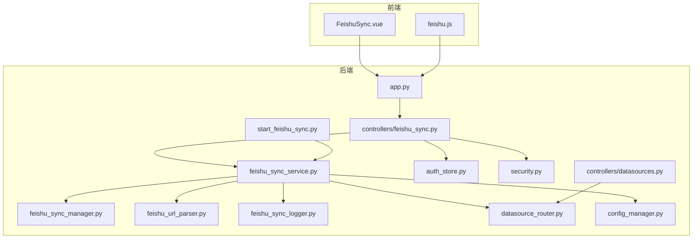

**图表来源** 
- [backend/app.py](file://backend/app.py)
- [backend/controllers/feishu_sync.py](file://backend/controllers/feishu_sync.py)
- [backend/feishu_sync_service.py](file://backend/feishu_sync_service.py)
- [backend/feishu_sync_manager.py](file://backend/feishu_sync_manager.py)
- [backend/feishu_url_parser.py](file://backend/feishu_url_parser.py)
- [backend/feishu_sync_logger.py](file://backend/feishu_sync_logger.py)
- [backend/start_feishu_sync.py](file://backend/start_feishu_sync.py)
- [backend/auth_store.py](file://backend/auth_store.py)
- [backend/security.py](file://backend/security.py)
- [backend/datasource_router.py](file://backend/datasource_router.py)
- [backend/controllers/datasources.py](file://backend/controllers/datasources.py)
- [backend/config_manager.py](file://backend/config_manager.py)

**章节来源**
- [backend/app.py](file://backend/app.py)
- [backend/controllers/feishu_sync.py](file://backend/controllers/feishu_sync.py)
- [backend/feishu_sync_service.py](file://backend/feishu_sync_service.py)
- [backend/feishu_sync_manager.py](file://backend/feishu_sync_manager.py)
- [backend/feishu_url_parser.py](file://backend/feishu_url_parser.py)
- [backend/feishu_sync_logger.py](file://backend/feishu_sync_logger.py)
- [backend/start_feishu_sync.py](file://backend/start_feishu_sync.py)
- [frontend/src/views/FeishuSync.vue](file://frontend/src/views/FeishuSync.vue)
- [frontend/src/utils/feishu.js](file://frontend/src/utils/feishu.js)
- [backend/auth_store.py](file://backend/auth_store.py)
- [backend/security.py](file://backend/security.py)
- [backend/datasource_router.py](file://backend/datasource_router.py)
- [backend/controllers/datasources.py](file://backend/controllers/datasources.py)
- [backend/config_manager.py](file://backend/config_manager.py)

## 核心组件
- 飞书同步控制器：暴露 HTTP 接口，处理飞书 OAuth 授权、回调、数据同步任务触发与状态查询
- 飞书同步服务：封装飞书 API 调用、数据拉取与转换、错误处理与重试策略
- 飞书同步管理器：协调同步任务调度、并发控制与持久化状态
- URL 解析器：解析飞书链接，提取表/文档 ID 与组织信息
- 日志记录器：统一记录同步过程、异常与审计信息
- 启动脚本：以独立进程运行后台同步任务
- 前端页面与工具：提供配置界面、发起同步、展示进度与结果

**章节来源**
- [backend/controllers/feishu_sync.py](file://backend/controllers/feishu_sync.py)
- [backend/feishu_sync_service.py](file://backend/feishu_sync_service.py)
- [backend/feishu_sync_manager.py](file://backend/feishu_sync_manager.py)
- [backend/feishu_url_parser.py](file://backend/feishu_url_parser.py)
- [backend/feishu_sync_logger.py](file://backend/feishu_sync_logger.py)
- [backend/start_feishu_sync.py](file://backend/start_feishu_sync.py)
- [frontend/src/views/FeishuSync.vue](file://frontend/src/views/FeishuSync.vue)
- [frontend/src/utils/feishu.js](file://frontend/src/utils/feishu.js)

## 架构总览
整体流程包括前端发起飞书同步请求，后端控制器鉴权后交由服务层调用飞书 API，解析返回数据并通过数据源适配器写入目标库，同时将结果与日志持久化。

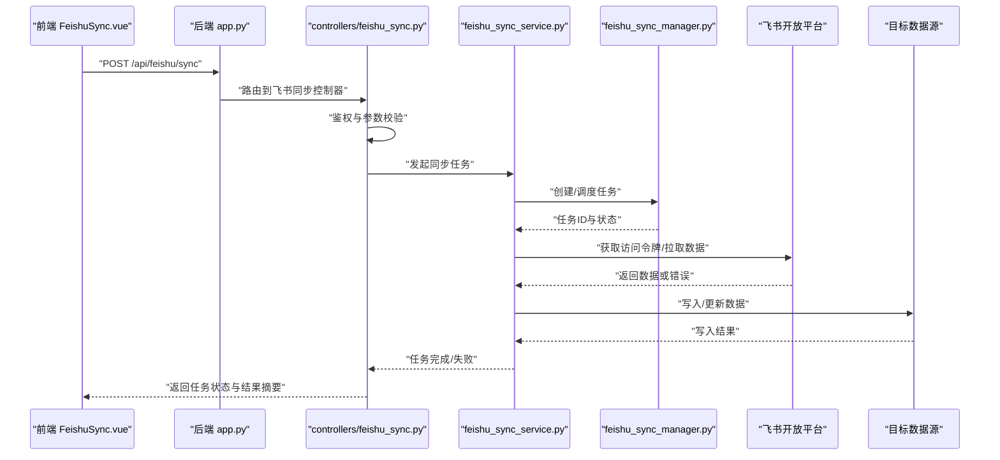

**图表来源** 
- [backend/app.py](file://backend/app.py)
- [backend/controllers/feishu_sync.py](file://backend/controllers/feishu_sync.py)
- [backend/feishu_sync_service.py](file://backend/feishu_sync_service.py)
- [backend/feishu_sync_manager.py](file://backend/feishu_sync_manager.py)
- [backend/datasource_router.py](file://backend/datasource_router.py)

## 详细组件分析

### 飞书同步控制器（HTTP 入口）
职责：
- 定义飞书相关路由（如授权、回调、同步触发、状态查询）
- 进行鉴权与参数校验，调用服务层执行具体逻辑
- 统一错误响应与日志输出

关键点：
- 使用统一的鉴权中间件确保用户身份与权限
- 对请求体进行严格校验，避免非法输入导致下游异常
- 将耗时操作交给服务层与任务管理器，保持控制器轻量

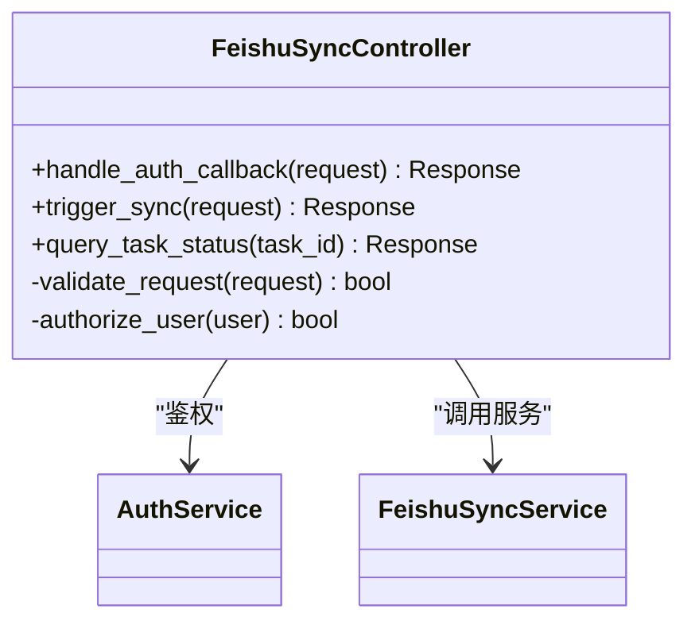

**图表来源** 
- [backend/controllers/feishu_sync.py](file://backend/controllers/feishu_sync.py)
- [backend/auth_store.py](file://backend/auth_store.py)
- [backend/security.py](file://backend/security.py)
- [backend/feishu_sync_service.py](file://backend/feishu_sync_service.py)

**章节来源**
- [backend/controllers/feishu_sync.py](file://backend/controllers/feishu_sync.py)
- [backend/auth_store.py](file://backend/auth_store.py)
- [backend/security.py](file://backend/security.py)

### 飞书同步服务（API 调用与数据处理）
职责：
- 封装飞书 API 调用（令牌获取、数据拉取、分页处理）
- 数据清洗与类型转换，适配目标数据源格式
- 错误分类与重试策略（网络异常、限流、业务错误）
- 与数据源路由器协作，选择正确的写入路径

关键点：
- 使用指数退避重试，区分可重试与不可重试错误
- 对大结果集采用流式处理与分批写入，降低内存占用
- 统一异常包装，便于上层捕获与告警

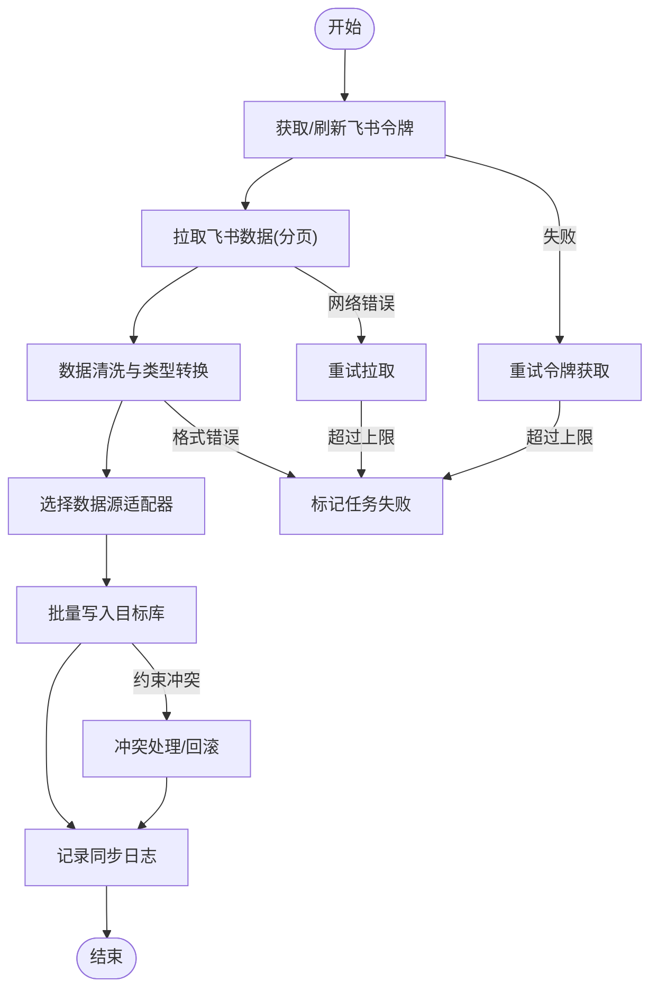

**图表来源** 
- [backend/feishu_sync_service.py](file://backend/feishu_sync_service.py)
- [backend/datasource_router.py](file://backend/datasource_router.py)
- [backend/feishu_sync_logger.py](file://backend/feishu_sync_logger.py)

**章节来源**
- [backend/feishu_sync_service.py](file://backend/feishu_sync_service.py)
- [backend/datasource_router.py](file://backend/datasource_router.py)
- [backend/feishu_sync_logger.py](file://backend/feishu_sync_logger.py)

### 飞书同步管理器（任务调度与状态）
职责：
- 创建与调度同步任务，维护任务生命周期
- 并发控制与资源隔离，防止过载
- 持久化任务状态与进度，支持查询与恢复

关键点：
- 使用队列或定时任务框架驱动执行
- 任务幂等设计，支持断点续跑
- 监控指标上报（成功率、耗时、错误分布）

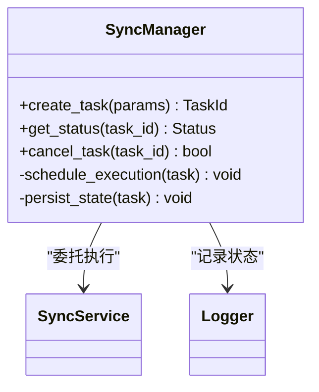

**图表来源** 
- [backend/feishu_sync_manager.py](file://backend/feishu_sync_manager.py)
- [backend/feishu_sync_service.py](file://backend/feishu_sync_service.py)
- [backend/feishu_sync_logger.py](file://backend/feishu_sync_logger.py)

**章节来源**
- [backend/feishu_sync_manager.py](file://backend/feishu_sync_manager.py)
- [backend/feishu_sync_service.py](file://backend/feishu_sync_service.py)
- [backend/feishu_sync_logger.py](file://backend/feishu_sync_logger.py)

### URL 解析器（飞书链接解析）
职责：
- 解析飞书表格/文档链接，提取关键标识（表 ID、空间 ID、组织 ID）
- 校验链接有效性，返回结构化参数供上游使用

关键点：
- 正则与规则引擎结合，兼容不同链接格式
- 对无效链接快速失败，减少下游开销

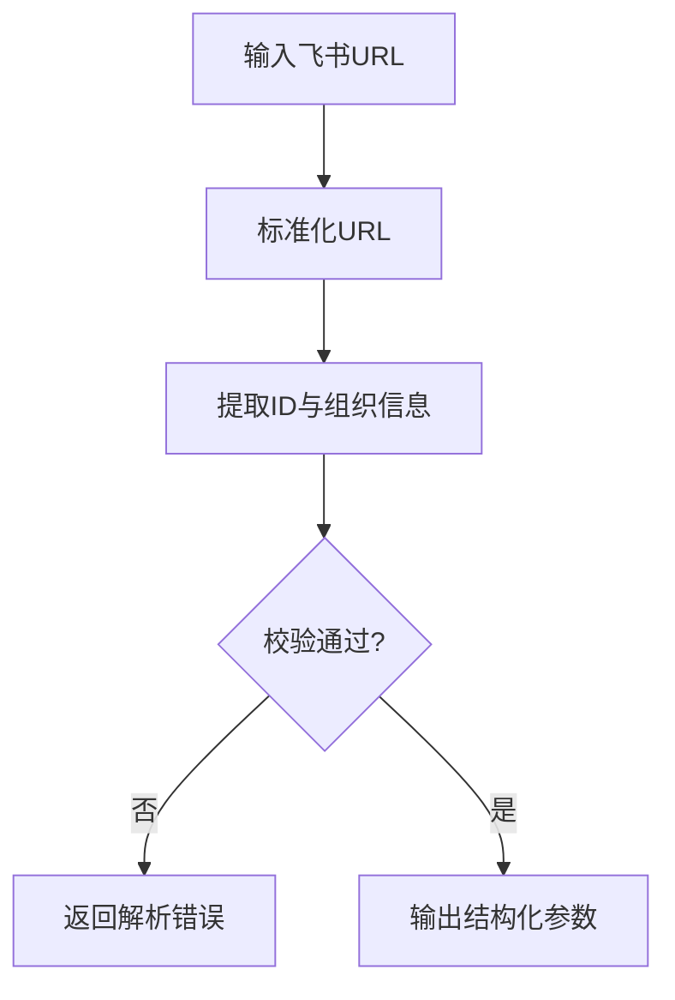

**图表来源** 
- [backend/feishu_url_parser.py](file://backend/feishu_url_parser.py)

**章节来源**
- [backend/feishu_url_parser.py](file://backend/feishu_url_parser.py)

### 日志记录器（同步审计）
职责：
- 记录同步过程的步骤、耗时、错误与审计信息
- 支持分级日志与结构化输出，便于检索与分析

关键点：
- 按任务维度聚合日志，便于追踪
- 敏感信息脱敏处理

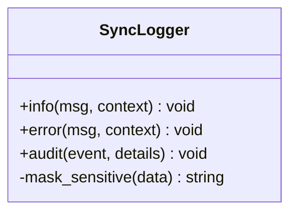

**图表来源** 
- [backend/feishu_sync_logger.py](file://backend/feishu_sync_logger.py)

**章节来源**
- [backend/feishu_sync_logger.py](file://backend/feishu_sync_logger.py)

### 启动脚本（后台同步任务）
职责：
- 启动独立的同步任务进程
- 加载配置、初始化依赖、进入主循环

关键点：
- 优雅退出与信号处理
- 健康检查与监控探针

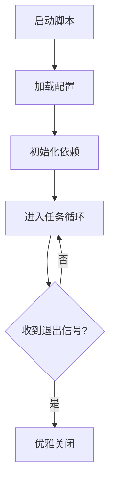

**图表来源** 
- [backend/start_feishu_sync.py](file://backend/start_feishu_sync.py)

**章节来源**
- [backend/start_feishu_sync.py](file://backend/start_feishu_sync.py)

### 前端视图与工具（用户交互）
职责：
- 提供飞书同步配置界面，发起同步任务，轮询任务状态
- 封装飞书相关前端逻辑（如跳转授权、回调处理）

关键点：
- 友好的错误提示与重试引导
- 与后端接口保持一致的错误码约定

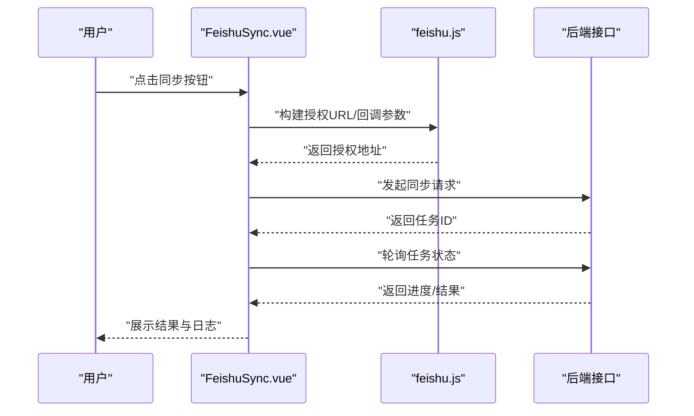

**图表来源** 
- [frontend/src/views/FeishuSync.vue](file://frontend/src/views/FeishuSync.vue)
- [frontend/src/utils/feishu.js](file://frontend/src/utils/feishu.js)

**章节来源**
- [frontend/src/views/FeishuSync.vue](file://frontend/src/views/FeishuSync.vue)
- [frontend/src/utils/feishu.js](file://frontend/src/utils/feishu.js)

### 数据源适配器（开发与扩展）
目标：
- 统一数据库连接、查询执行、结果转换与错误处理
- 支持多数据源（MySQL、PostgreSQL、ClickHouse 等）

建议实现要点：
- 连接池管理与健康检查
- SQL 生成与参数绑定，防注入
- 结果集迭代与分批写入，避免 OOM
- 错误分类（网络、语法、约束冲突）与重试策略
- 元数据缓存（表结构、字段类型）提升性能

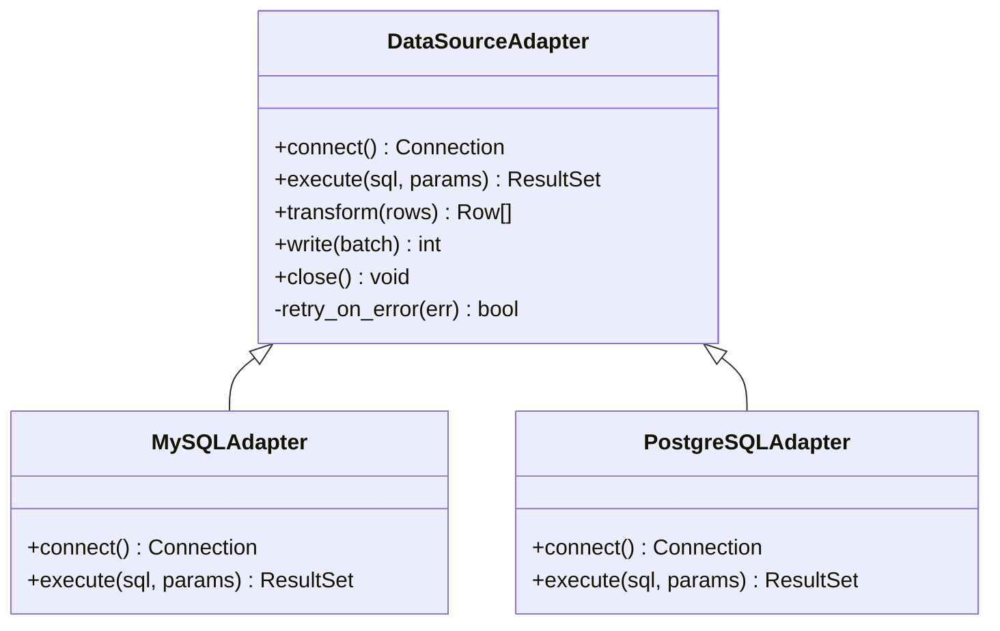

[无图表来源，因为该图为概念性类图]

**章节来源**
- [backend/datasource_router.py](file://backend/datasource_router.py)
- [backend/controllers/datasources.py](file://backend/controllers/datasources.py)

### 认证系统扩展（多提供商与令牌管理）
目标：
- 支持多认证提供商（本地、飞书、企业微信等）
- 令牌生命周期管理（签发、刷新、吊销）
- 会话控制与权限映射（RBAC）

建议实现要点：
- 抽象认证接口，按提供商注册实现
- 统一令牌格式与加密存储
- 会话上下文携带用户与角色信息
- 权限校验在控制器或服务层前置拦截

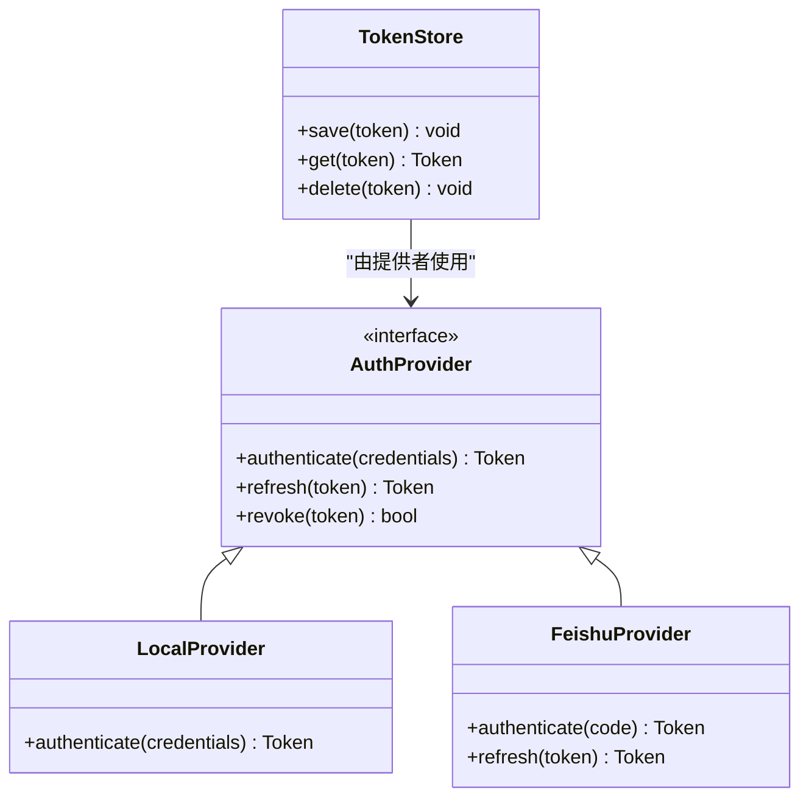

**图表来源** 
- [backend/auth_store.py](file://backend/auth_store.py)
- [backend/security.py](file://backend/security.py)

**章节来源**
- [backend/auth_store.py](file://backend/auth_store.py)
- [backend/security.py](file://backend/security.py)

### 外部 API 集成最佳实践
- 请求重试：指数退避、最大重试次数、区分可重试错误（网络抖动、限流）
- 超时处理：连接超时、读取超时、整体超时分层设置
- 缓存策略：热点数据缓存（TTL、失效策略）、一致性保证
- 错误恢复：降级与熔断、补偿事务、幂等设计

[本节为通用指导，不直接分析具体文件]

### Webhook 与回调机制
- 安全验证：校验请求来源 IP、时间戳、随机数
- 签名校验：HMAC-SHA256 签名验证，防篡改
- 异步处理：入队处理、去重与重试、失败告警

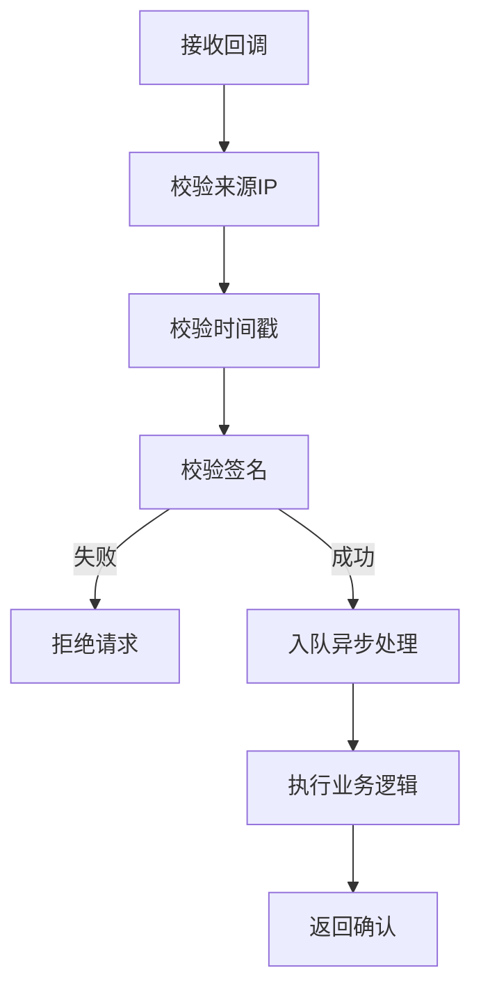

[无图表来源，因为该图为概念性流程图]

## 依赖关系分析
- 控制器依赖服务层，服务层依赖管理器与解析器
- 服务层通过数据源路由器选择具体适配器
- 认证与安全模块贯穿所有对外接口
- 前端通过统一 API 与后端交互

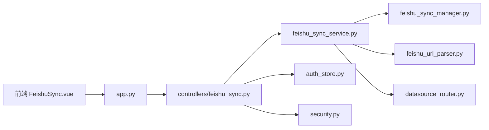

**图表来源** 
- [backend/app.py](file://backend/app.py)
- [backend/controllers/feishu_sync.py](file://backend/controllers/feishu_sync.py)
- [backend/feishu_sync_service.py](file://backend/feishu_sync_service.py)
- [backend/feishu_sync_manager.py](file://backend/feishu_sync_manager.py)
- [backend/feishu_url_parser.py](file://backend/feishu_url_parser.py)
- [backend/datasource_router.py](file://backend/datasource_router.py)
- [backend/auth_store.py](file://backend/auth_store.py)
- [backend/security.py](file://backend/security.py)

**章节来源**
- [backend/app.py](file://backend/app.py)
- [backend/controllers/feishu_sync.py](file://backend/controllers/feishu_sync.py)
- [backend/feishu_sync_service.py](file://backend/feishu_sync_service.py)
- [backend/feishu_sync_manager.py](file://backend/feishu_sync_manager.py)
- [backend/feishu_url_parser.py](file://backend/feishu_url_parser.py)
- [backend/datasource_router.py](file://backend/datasource_router.py)
- [backend/auth_store.py](file://backend/auth_store.py)
- [backend/security.py](file://backend/security.py)

## 性能考虑
- 连接池：数据库与外部 API 连接复用，合理设置最大连接数
- 批处理：批量写入与批量拉取，减少往返次数
- 分页与流式：大数据集分片处理，避免内存峰值
- 缓存：热点元数据与令牌缓存，缩短延迟
- 监控：关键指标采集（QPS、延迟、错误率、资源使用）

[本节为通用指导，不直接分析具体文件]

## 故障排除指南
常见问题与定位步骤：
- 授权失败：检查客户端 ID/密钥、回调地址、域名白名单；查看令牌获取日志
- 数据同步失败：核对飞书链接解析结果、权限范围、表结构变更；查看任务日志与错误分类
- 写入冲突：检查唯一约束与索引，启用幂等键与冲突处理策略
- 外部限流：调整重试间隔与并发度，观察限流响应码

排查要点：
- 使用结构化日志与任务 ID 关联
- 开启调试模式，打印关键参数与响应体摘要
- 对敏感信息进行脱敏，避免泄露

**章节来源**
- [backend/feishu_sync_logger.py](file://backend/feishu_sync_logger.py)
- [backend/feishu_sync_service.py](file://backend/feishu_sync_service.py)
- [backend/feishu_url_parser.py](file://backend/feishu_url_parser.py)

## 结论
SmartAsk 的第三方集成以飞书为核心，构建了从认证、API 调用、数据同步到消息推送的完整链路。通过清晰的分层设计与可扩展的数据源适配器，平台能够灵活对接多种外部系统与数据库。遵循本文的最佳实践与排障指南，可显著提升集成稳定性与可维护性。

[本节为总结性内容，不直接分析具体文件]

## 附录
- 配置项说明：飞书应用凭证、回调地址、数据源连接串、重试与超时参数
- 接口清单：授权回调、同步触发、状态查询、日志检索
- 部署建议：独立同步进程、监控告警、日志归档

[本节为补充信息，不直接分析具体文件]