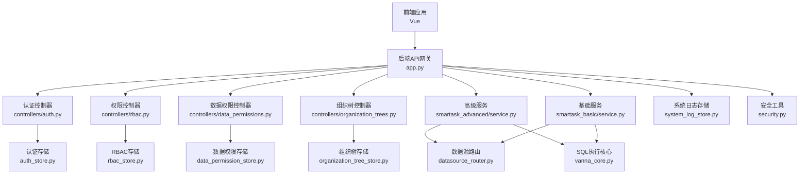
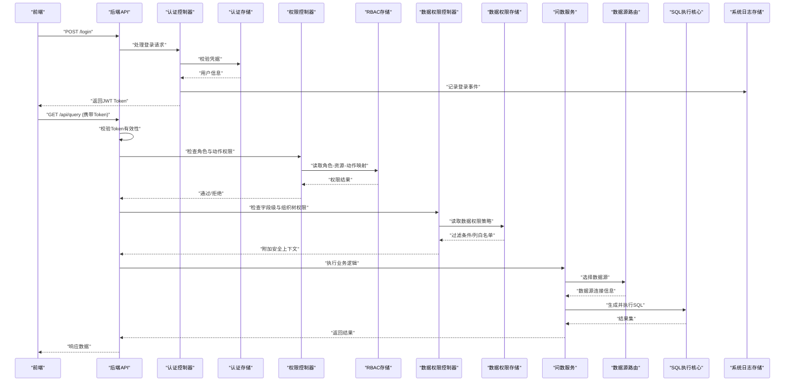
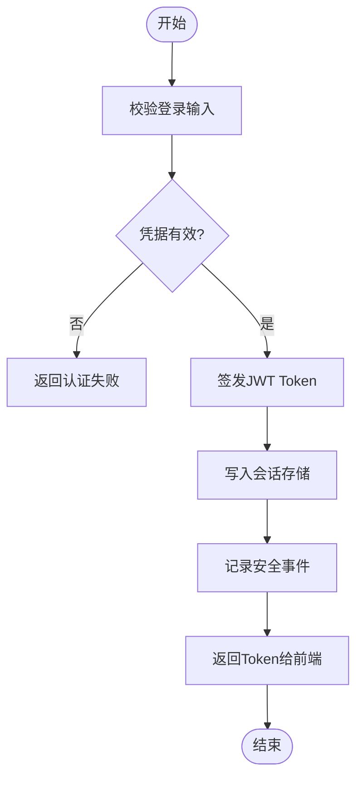
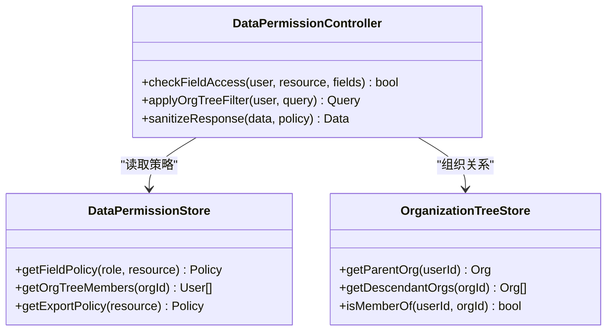
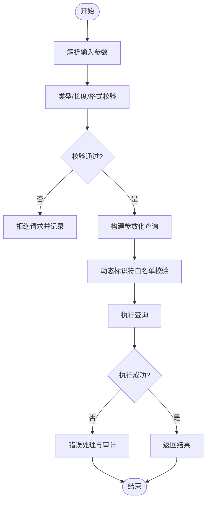
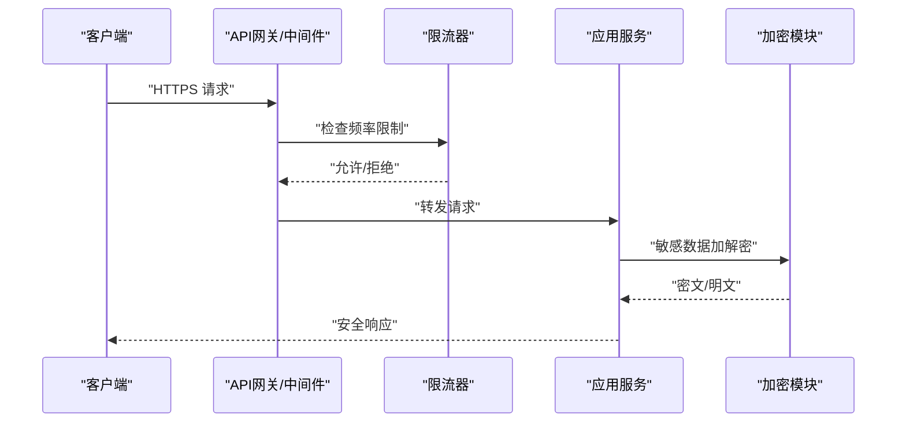
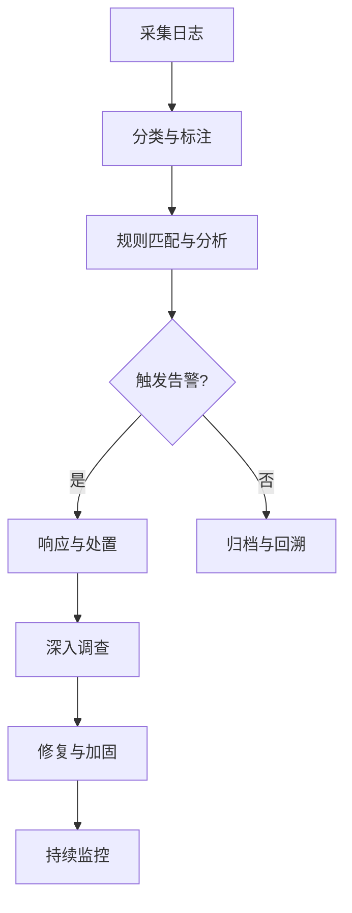
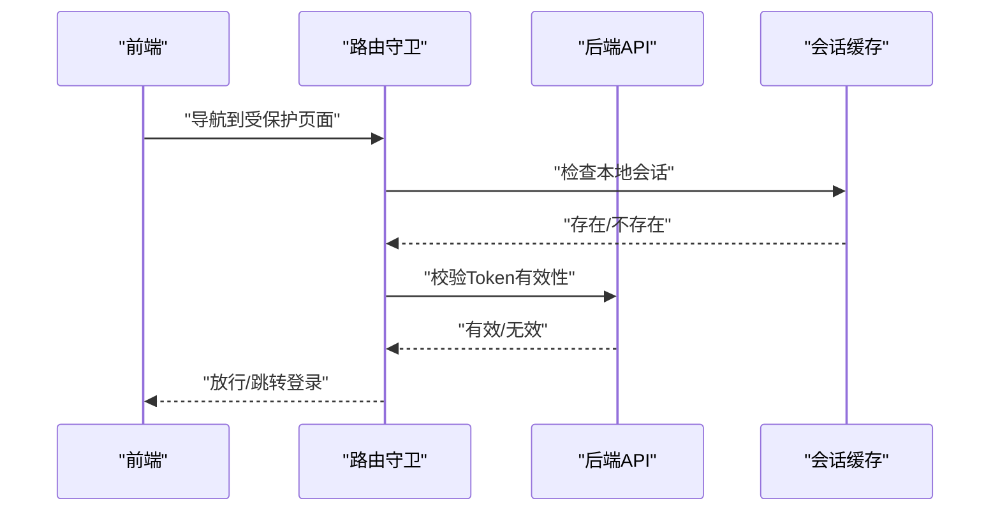
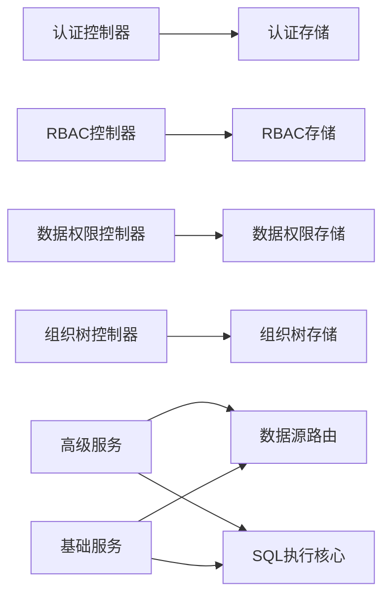

# 安全排查指南

<cite>
**本文引用的文件**   
- [backend/app.py](file://backend/app.py)
- [backend/auth_store.py](file://backend/auth_store.py)
- [backend/security.py](file://backend/security.py)
- [backend/controllers/auth.py](file://backend/controllers/auth.py)
- [backend/controllers/rbac.py](file://backend/controllers/rbac.py)
- [backend/controllers/data_permissions.py](file://backend/controllers/data_permissions.py)
- [backend/controllers/organization_trees.py](file://backend/controllers/organization_trees.py)
- [backend/rbac_store.py](file://backend/rbac_store.py)
- [backend/data_permission_store.py](file://backend/data_permission_store.py)
- [backend/organization_tree_store.py](file://backend/organization_tree_store.py)
- [backend/system_log_store.py](file://backend/system_log_store.py)
- [backend/smartask_advanced/service.py](file://backend/smartask_advanced/service.py)
- [backend/smartask_basic/service.py](file://backend/smartask_basic/service.py)
- [backend/datasource_router.py](file://backend/datasource_router.py)
- [backend/vanna_core.py](file://backend/vanna_core.py)
- [backend/config_manager.py](file://backend/config_manager.py)
- [frontend/src/api/index.js](file://frontend/src/api/index.js)
- [frontend/src/router/index.js](file://frontend/src/router/index.js)
- [frontend/src/state/sessionCache.js](file://frontend/src/state/sessionCache.js)
</cite>

## 目录
1. [简介](#简介)
2. [项目结构](#项目结构)
3. [核心组件](#核心组件)
4. [架构总览](#架构总览)
5. [详细组件分析](#详细组件分析)
6. [依赖关系分析](#依赖关系分析)
7. [性能与可用性考量](#性能与可用性考量)
8. [故障排查指南](#故障排查指南)
9. [结论](#结论)
10. [附录](#附录)

## 简介
本指南面向 SmartAsk 智能问数平台的安全排查与加固，聚焦以下主题：
- 认证授权问题排查：JWT Token 失效、会话管理异常、RBAC 权限配置错误
- 数据访问权限问题：字段级权限异常、组织树权限隔离失败、数据泄露防护
- SQL 注入防护：输入验证、参数化查询与安全编码实践
- API 安全防护：请求频率限制、敏感信息加密、传输安全配置
- 安全日志分析与入侵检测：审计日志、告警规则、事件响应
- 漏洞扫描与渗透测试：自动化扫描、人工渗透、修复闭环

本指南以代码仓库为依据，提供可操作的诊断步骤、修复建议与可视化流程图，帮助开发与运维团队快速定位并解决问题。

## 项目结构
SmartAsk 后端采用 Python 模块化设计，前端使用 Vue 工程。安全相关的关键位置包括：
- 后端入口与全局中间件：app.py、security.py、config_manager.py
- 认证与会话：controllers/auth.py、auth_store.py
- 权限控制：controllers/rbac.py、rbac_store.py、controllers/data_permissions.py、data_permission_store.py、controllers/organization_trees.py、organization_tree_store.py
- 数据执行与路由：smartask_advanced/service.py、smartask_basic/service.py、datasource_router.py、vanna_core.py
- 系统日志：system_log_store.py
- 前端鉴权与状态：frontend/src/api/index.js、frontend/src/router/index.js、frontend/src/state/sessionCache.js

**图示来源** 
- [backend/app.py](file://backend/app.py)
- [backend/security.py](file://backend/security.py)
- [backend/controllers/auth.py](file://backend/controllers/auth.py)
- [backend/controllers/rbac.py](file://backend/controllers/rbac.py)
- [backend/controllers/data_permissions.py](file://backend/controllers/data_permissions.py)
- [backend/controllers/organization_trees.py](file://backend/controllers/organization_trees.py)
- [backend/smartask_advanced/service.py](file://backend/smartask_advanced/service.py)
- [backend/smartask_basic/service.py](file://backend/smartask_basic/service.py)
- [backend/datasource_router.py](file://backend/datasource_router.py)
- [backend/vanna_core.py](file://backend/vanna_core.py)
- [backend/auth_store.py](file://backend/auth_store.py)
- [backend/rbac_store.py](file://backend/rbac_store.py)
- [backend/data_permission_store.py](file://backend/data_permission_store.py)
- [backend/organization_tree_store.py](file://backend/organization_tree_store.py)
- [backend/system_log_store.py](file://backend/system_log_store.py)

**章节来源**
- [backend/app.py](file://backend/app.py)
- [backend/security.py](file://backend/security.py)
- [backend/config_manager.py](file://backend/config_manager.py)

## 核心组件
- 认证与会话管理：负责用户登录、Token 签发与校验、会话生命周期管理
- RBAC 权限控制：基于角色的访问控制，资源与动作的授权决策
- 数据权限控制：字段级权限、组织树隔离、数据可见性策略
- SQL 执行与路由：数据源选择、SQL 生成与执行、结果返回
- 安全工具：加解密、签名、输入校验、速率限制等通用能力
- 系统日志：安全事件记录、审计追踪、告警触发

**章节来源**
- [backend/controllers/auth.py](file://backend/controllers/auth.py)
- [backend/auth_store.py](file://backend/auth_store.py)
- [backend/controllers/rbac.py](file://backend/controllers/rbac.py)
- [backend/rbac_store.py](file://backend/rbac_store.py)
- [backend/controllers/data_permissions.py](file://backend/controllers/data_permissions.py)
- [backend/data_permission_store.py](file://backend/data_permission_store.py)
- [backend/controllers/organization_trees.py](file://backend/controllers/organization_trees.py)
- [backend/organization_tree_store.py](file://backend/organization_tree_store.py)
- [backend/smartask_advanced/service.py](file://backend/smartask_advanced/service.py)
- [backend/smartask_basic/service.py](file://backend/smartask_basic/service.py)
- [backend/datasource_router.py](file://backend/datasource_router.py)
- [backend/vanna_core.py](file://backend/vanna_core.py)
- [backend/security.py](file://backend/security.py)
- [backend/system_log_store.py](file://backend/system_log_store.py)

## 架构总览
下图展示从前端到后端的认证与权限控制流程，以及数据执行链路中的安全关键点。

**图示来源** 
- [backend/controllers/auth.py](file://backend/controllers/auth.py)
- [backend/auth_store.py](file://backend/auth_store.py)
- [backend/controllers/rbac.py](file://backend/controllers/rbac.py)
- [backend/rbac_store.py](file://backend/rbac_store.py)
- [backend/controllers/data_permissions.py](file://backend/controllers/data_permissions.py)
- [backend/data_permission_store.py](file://backend/data_permission_store.py)
- [backend/smartask_advanced/service.py](file://backend/smartask_advanced/service.py)
- [backend/datasource_router.py](file://backend/datasource_router.py)
- [backend/vanna_core.py](file://backend/vanna_core.py)
- [backend/system_log_store.py](file://backend/system_log_store.py)

## 详细组件分析

### 认证与授权（JWT、会话、RBAC）
- JWT Token 失效排查要点
  - 确认 Token 签发与校验逻辑是否一致（算法、密钥、过期时间）
  - 检查服务端会话存储与客户端缓存同步情况
  - 关注跨域与 Cookie/Authorization 头传递是否正确
- 会话管理异常排查要点
  - 会话创建、更新、销毁的生命周期是否完整
  - 并发场景下的会话竞争与锁机制
  - 会话超时与刷新策略是否符合业务预期
- RBAC 权限配置错误排查要点
  - 角色-资源-动作映射是否完整且正确
  - 默认拒绝策略是否生效
  - 动态权限变更后的缓存或存储一致性

**图示来源** 
- [backend/controllers/auth.py](file://backend/controllers/auth.py)
- [backend/auth_store.py](file://backend/auth_store.py)
- [backend/system_log_store.py](file://backend/system_log_store.py)

**章节来源**
- [backend/controllers/auth.py](file://backend/controllers/auth.py)
- [backend/auth_store.py](file://backend/auth_store.py)
- [backend/controllers/rbac.py](file://backend/controllers/rbac.py)
- [backend/rbac_store.py](file://backend/rbac_store.py)
- [backend/system_log_store.py](file://backend/system_log_store.py)

### 数据访问权限（字段级、组织树、防泄露）
- 字段级权限异常排查要点
  - 列白名单与过滤条件是否正确注入
  - 不同角色对同一字段的可见性策略是否冲突
  - 聚合与导出场景下是否遵循最小可见原则
- 组织树权限隔离失败排查要点
  - 组织层级与成员关系是否正确加载
  - 跨组织访问是否被拒绝
  - 缓存命中导致的越权问题
- 数据泄露防护要点
  - 敏感字段脱敏与掩码策略
  - 导出与打印时的二次校验
  - 接口响应体中是否包含多余敏感信息

**图示来源** 
- [backend/controllers/data_permissions.py](file://backend/controllers/data_permissions.py)
- [backend/data_permission_store.py](file://backend/data_permission_store.py)
- [backend/controllers/organization_trees.py](file://backend/controllers/organization_trees.py)
- [backend/organization_tree_store.py](file://backend/organization_tree_store.py)

**章节来源**
- [backend/controllers/data_permissions.py](file://backend/controllers/data_permissions.py)
- [backend/data_permission_store.py](file://backend/data_permission_store.py)
- [backend/controllers/organization_trees.py](file://backend/controllers/organization_trees.py)
- [backend/organization_tree_store.py](file://backend/organization_tree_store.py)

### SQL 注入防护（输入验证、参数化、安全编码）
- 输入验证
  - 对所有用户输入进行类型、长度、格式校验
  - 黑名单与白名单结合，拒绝危险字符与模式
- 参数化查询
  - 禁止字符串拼接 SQL，统一使用参数化接口
  - 对动态表名/列名进行严格白名单校验
- 安全编码实践
  - 输出编码与转义，防止二次注入
  - 统一错误消息，避免泄露内部细节

**图示来源** 
- [backend/vanna_core.py](file://backend/vanna_core.py)
- [backend/datasource_router.py](file://backend/datasource_router.py)
- [backend/security.py](file://backend/security.py)

**章节来源**
- [backend/vanna_core.py](file://backend/vanna_core.py)
- [backend/datasource_router.py](file://backend/datasource_router.py)
- [backend/security.py](file://backend/security.py)

### API 安全防护（限流、加密、传输安全）
- 请求频率限制
  - 针对登录、注册、导出等高敏感接口实施限流
  - 支持按 IP、用户、租户维度统计与阻断
- 敏感信息加密
  - 密码、密钥、令牌等敏感数据的存储加密
  - 传输层使用 TLS 加密，禁用弱协议与套件
- 传输安全配置
  - 强制 HTTPS、HSTS、CSP 等头部策略
  - 跨域与 Cookie 安全属性配置

**图示来源** 
- [backend/security.py](file://backend/security.py)
- [backend/config_manager.py](file://backend/config_manager.py)
- [backend/system_log_store.py](file://backend/system_log_store.py)

**章节来源**
- [backend/security.py](file://backend/security.py)
- [backend/config_manager.py](file://backend/config_manager.py)
- [backend/system_log_store.py](file://backend/system_log_store.py)

### 安全日志分析与入侵检测
- 日志采集与分类
  - 认证事件、权限决策、SQL 执行、导出行为、异常错误
- 告警规则与阈值
  - 登录失败次数、异常高频访问、越权尝试、SQL 异常
- 事件响应与取证
  - 自动封禁、通知、工单流转、证据留存

**图示来源** 
- [backend/system_log_store.py](file://backend/system_log_store.py)
- [backend/security.py](file://backend/security.py)

**章节来源**
- [backend/system_log_store.py](file://backend/system_log_store.py)
- [backend/security.py](file://backend/security.py)

### 前端鉴权与会话管理
- 前端 Token 管理
  - 登录后保存 Token，请求时自动附加
  - Token 过期提示与自动刷新
- 路由守卫
  - 未登录重定向至登录页
  - 角色/权限不足时显示无权限页面
- 会话缓存
  - 本地缓存与服务器会话一致性
  - 清理与退出登录逻辑

**图示来源** 
- [frontend/src/router/index.js](file://frontend/src/router/index.js)
- [frontend/src/state/sessionCache.js](file://frontend/src/state/sessionCache.js)
- [frontend/src/api/index.js](file://frontend/src/api/index.js)

**章节来源**
- [frontend/src/router/index.js](file://frontend/src/router/index.js)
- [frontend/src/state/sessionCache.js](file://frontend/src/state/sessionCache.js)
- [frontend/src/api/index.js](file://frontend/src/api/index.js)

## 依赖关系分析
- 组件耦合与内聚
  - 认证控制器依赖认证存储；权限控制器依赖 RBAC 与数据权限存储
  - 问数服务依赖数据源路由与 SQL 执行核心
- 外部依赖与集成点
  - 数据库连接、缓存、消息队列（如有）
  - 第三方身份提供商（如飞书）
- 循环依赖风险
  - 确保控制器与服务之间单向依赖
  - 存储层抽象避免直接耦合

**图示来源** 
- [backend/controllers/auth.py](file://backend/controllers/auth.py)
- [backend/auth_store.py](file://backend/auth_store.py)
- [backend/controllers/rbac.py](file://backend/controllers/rbac.py)
- [backend/rbac_store.py](file://backend/rbac_store.py)
- [backend/controllers/data_permissions.py](file://backend/controllers/data_permissions.py)
- [backend/data_permission_store.py](file://backend/data_permission_store.py)
- [backend/controllers/organization_trees.py](file://backend/controllers/organization_trees.py)
- [backend/organization_tree_store.py](file://backend/organization_tree_store.py)
- [backend/smartask_advanced/service.py](file://backend/smartask_advanced/service.py)
- [backend/smartask_basic/service.py](file://backend/smartask_basic/service.py)
- [backend/datasource_router.py](file://backend/datasource_router.py)
- [backend/vanna_core.py](file://backend/vanna_core.py)

**章节来源**
- [backend/app.py](file://backend/app.py)
- [backend/security.py](file://backend/security.py)

## 性能与可用性考量
- 认证与鉴权的缓存策略
  - 角色与权限策略缓存，减少重复查询
  - 合理设置 TTL 与失效策略
- SQL 执行优化
  - 索引与查询计划优化
  - 分页与结果集大小限制
- 限流与熔断
  - 高并发下的降级与保护
  - 关键接口的健康检查与自愈

[本节为通用指导，不直接分析具体文件]

## 故障排查指南
- JWT Token 失效
  - 检查签发算法、密钥、过期时间配置
  - 核对客户端携带方式（Header/Cookie）与服务端解析逻辑
  - 查看认证日志与错误码定位原因
- 会话管理异常
  - 检查会话存储可用性与容量
  - 确认会话刷新与续期逻辑
  - 排查并发与分布式环境下的会话一致性
- RBAC 权限配置错误
  - 核对角色-资源-动作映射表
  - 检查默认拒绝策略与例外规则
  - 验证动态权限变更的生效范围
- 字段级权限异常
  - 检查列白名单与过滤条件注入
  - 确认聚合与导出路径的权限校验
  - 审计日志中查找越权访问痕迹
- 组织树权限隔离失败
  - 验证组织层级与成员关系数据
  - 检查缓存命中与一致性
  - 审计跨组织访问日志
- SQL 注入防护
  - 审查所有 SQL 构建路径，确保参数化
  - 强化输入校验与白名单策略
  - 启用数据库审计与慢查询监控
- API 安全防护
  - 配置限流策略与阈值
  - 启用 TLS 与强加密套件
  - 检查敏感信息是否在响应中泄露
- 安全日志分析与入侵检测
  - 建立告警规则与阈值
  - 定期审计与回溯
  - 联动 SIEM 与工单系统

**章节来源**
- [backend/controllers/auth.py](file://backend/controllers/auth.py)
- [backend/auth_store.py](file://backend/auth_store.py)
- [backend/controllers/rbac.py](file://backend/controllers/rbac.py)
- [backend/rbac_store.py](file://backend/rbac_store.py)
- [backend/controllers/data_permissions.py](file://backend/controllers/data_permissions.py)
- [backend/data_permission_store.py](file://backend/data_permission_store.py)
- [backend/controllers/organization_trees.py](file://backend/controllers/organization_trees.py)
- [backend/organization_tree_store.py](file://backend/organization_tree_store.py)
- [backend/vanna_core.py](file://backend/vanna_core.py)
- [backend/datasource_router.py](file://backend/datasource_router.py)
- [backend/security.py](file://backend/security.py)
- [backend/system_log_store.py](file://backend/system_log_store.py)

## 结论
本指南围绕 SmartAsk 平台的认证授权、数据权限、SQL 安全、API 防护、日志与入侵检测等方面提供了系统的排查方法与修复建议。通过标准化的流程与可视化的图示，帮助团队快速定位问题并落实加固措施。建议将本指南纳入日常安全巡检与发布前安全检查清单，持续提升平台安全性与稳定性。

[本节为总结性内容，不直接分析具体文件]

## 附录
- 漏洞扫描与渗透测试实施指南
  - 自动化扫描：使用 SAST/DAST 工具覆盖前后端代码与接口
  - 人工渗透：模拟攻击者视角，验证认证绕过、权限提升、SQL 注入等
  - 修复闭环：缺陷登记、优先级评估、修复验证与回归测试
  - 持续改进：定期复扫与演练，完善告警与响应流程

[本节为通用指导，不直接分析具体文件]