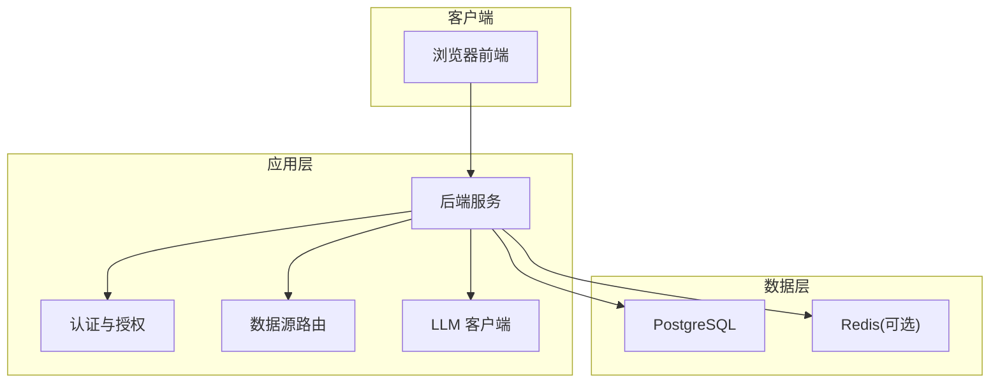
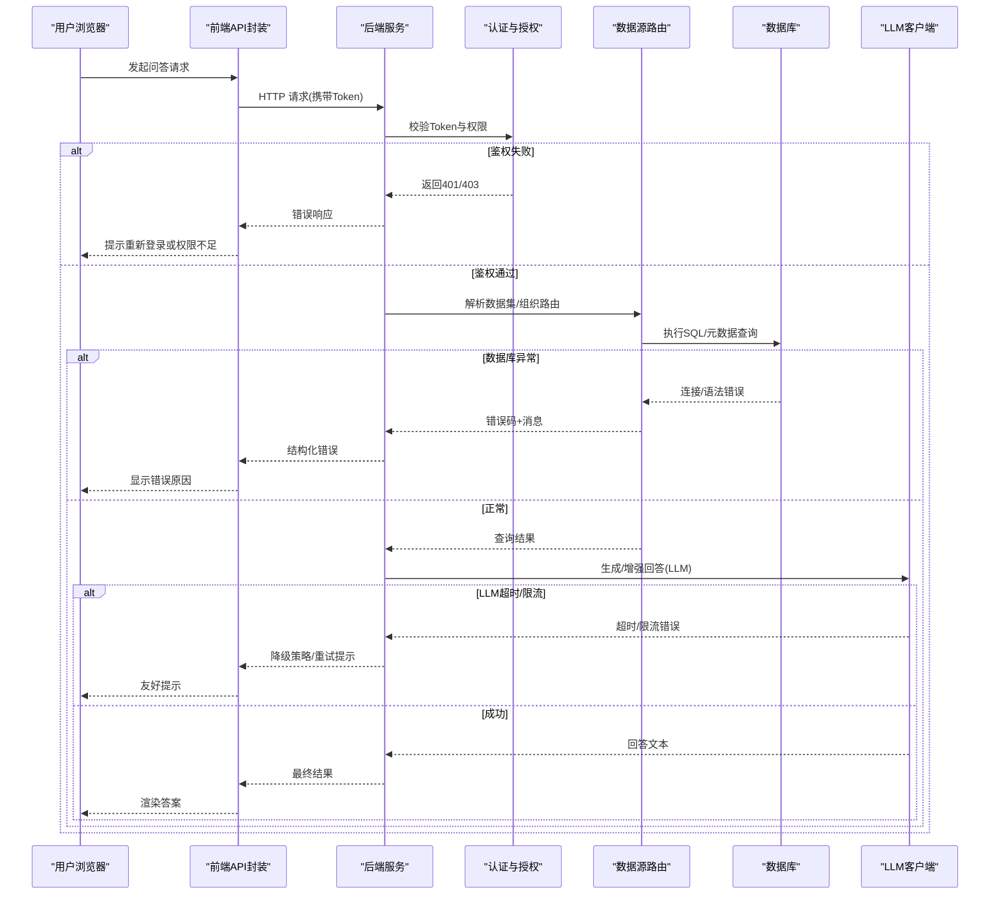
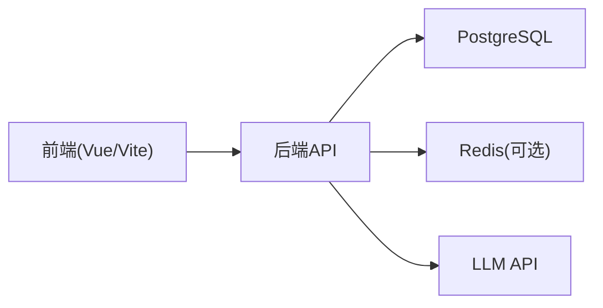

# 常见问题解答

<cite>
**本文引用的文件**   
- [docker-compose.yml](file://docker-compose.yml)
- [backend/app.py](file://backend/app.py)
- [backend/config_manager.py](file://backend/config_manager.py)
- [backend/security.py](file://backend/security.py)
- [backend/auth_store.py](file://backend/auth_store.py)
- [backend/datasource_router.py](file://backend/datasource_router.py)
- [backend/feature_flags.py](file://backend/feature_flags.py)
- [backend/vanna_core.py](file://backend/vanna_core.py)
- [frontend/src/router/index.js](file://frontend/src/router/index.js)
- [frontend/src/api/index.js](file://frontend/src/api/index.js)
- [scripts/verify_deployment.py](file://scripts/verify_deployment.py)
- [backend/requirements.txt](file://backend/requirements.txt)
- [backend/Dockerfile](file://backend/Dockerfile)
- [frontend/Dockerfile](file://frontend/Dockerfile)
- [deploy.sh](file://deploy.sh)
- [start_all.bat](file://start_all.bat)
- [doctor.sh](file://doctor.sh)
</cite>

## 目录
1. [简介](#简介)
2. [项目结构](#项目结构)
3. [核心组件](#核心组件)
4. [架构总览](#架构总览)
5. [详细组件分析](#详细组件分析)
6. [依赖关系分析](#依赖关系分析)
7. [性能注意事项](#性能注意事项)
8. [故障排查指南](#故障排查指南)
9. [结论](#结论)
10. [附录](#附录)

## 简介
本“常见问题解答”面向 SmartAsk 智能问数平台的安装部署、运行期问题、配置与用户操作四大类场景，提供可操作的诊断步骤与解决方案。内容覆盖环境依赖缺失、端口冲突、数据库连接失败、权限验证失败、数据集访问异常、LLM API 调用超时、环境变量与配置文件错误、服务间通信异常、登录失败、查询无结果、权限不足等典型问题，并给出错误示例、根因分析与解决步骤。

## 项目结构
SmartAsk 采用前后端分离与容器化部署：
- 后端（Python）：提供业务接口、认证鉴权、数据源路由、特征开关、LLM 集成等能力
- 前端（Vue/Vite）：提供问答界面、管理控制台与调试工具
- 基础设施：PostgreSQL 数据库、可选的 Redis、外部 LLM API
- 部署脚本：一键部署、健康检查、医生模式自检

[本节为概念性说明，不直接分析具体文件]

## 核心组件
- 后端入口与生命周期：负责启动服务、加载配置、注册路由与中间件
- 配置管理：统一读取环境变量与配置文件，校验必填项与格式
- 安全与认证：JWT/会话管理、RBAC 权限控制、敏感信息处理
- 数据源路由：按组织/租户/数据集维度选择目标数据库
- 特征开关：运行时动态启用/禁用功能
- LLM 客户端：封装外部大模型 API 调用、重试与超时策略
- 前端路由与 API 网关：统一请求前缀、鉴权头注入、错误提示

**章节来源**
- [backend/app.py:1-200](file://backend/app.py#L1-L200)
- [backend/config_manager.py:1-200](file://backend/config_manager.py#L1-L200)
- [backend/security.py:1-200](file://backend/security.py#L1-L200)
- [backend/auth_store.py:1-200](file://backend/auth_store.py#L1-L200)
- [backend/datasource_router.py:1-200](file://backend/datasource_router.py#L1-L200)
- [backend/feature_flags.py:1-200](file://backend/feature_flags.py#L1-L200)
- [backend/vanna_core.py:1-200](file://backend/vanna_core.py#L1-L200)
- [frontend/src/router/index.js:1-200](file://frontend/src/router/index.js#L1-L200)
- [frontend/src/api/index.js:1-200](file://frontend/src/api/index.js#L1-L200)

## 架构总览
下图展示从前端到后端、再到数据源与 LLM 的典型请求链路，以及关键错误分支。

**图表来源**
- [backend/app.py:1-200](file://backend/app.py#L1-L200)
- [backend/security.py:1-200](file://backend/security.py#L1-L200)
- [backend/datasource_router.py:1-200](file://backend/datasource_router.py#L1-L200)
- [backend/vanna_core.py:1-200](file://backend/vanna_core.py#L1-L200)
- [frontend/src/api/index.js:1-200](file://frontend/src/api/index.js#L1-L200)

## 详细组件分析

### 安装与部署常见问题
- 环境依赖缺失
  - 症状：后端启动报错缺少模块、命令不存在、Python版本不符
  - 常见原因：未安装 requirements、系统库缺失、容器基础镜像不匹配
  - 排查步骤：
    - 检查 Python 版本与 pip 依赖是否满足要求
    - 确认 Docker 基础镜像与构建参数一致
    - 查看容器日志定位缺失包名
  - 解决步骤：
    - 使用依赖清单安装所需包
    - 在 Dockerfile 中补齐系统依赖
    - 重新构建镜像并启动

- 端口冲突
  - 症状：服务无法启动，报端口占用
  - 常见原因：宿主机或其他进程占用了 80/443/8000/5432 等端口
  - 排查步骤：
    - 使用系统命令查看端口占用情况
    - 检查 docker-compose 端口映射配置
  - 解决步骤：
    - 修改端口映射或释放占用端口
    - 重启服务

- 数据库连接失败
  - 症状：启动后健康检查失败、查询报错
  - 常见原因：连接串错误、用户名密码不正确、网络不可达、SSL 配置不一致
  - 排查步骤：
    - 校验数据库地址、端口、库名、账号密码
    - 从后端容器内测试连通性
    - 检查防火墙与安全组规则
  - 解决步骤：
    - 修正连接串与认证信息
    - 开放必要端口与白名单
    - 如启用 SSL，确保证书与协议一致

- 容器编排问题
  - 症状：服务启动顺序错乱、环境变量未生效
  - 常见原因：depends_on 未等待就绪、环境变量未挂载
  - 排查步骤：
    - 检查编排文件中服务依赖与健康检查
    - 确认环境变量注入方式
  - 解决步骤：
    - 增加健康检查与重试逻辑
    - 将环境变量以安全方式注入

**章节来源**
- [docker-compose.yml:1-200](file://docker-compose.yml#L1-L200)
- [backend/requirements.txt:1-200](file://backend/requirements.txt#L1-L200)
- [backend/Dockerfile:1-200](file://backend/Dockerfile#L1-L200)
- [frontend/Dockerfile:1-200](file://frontend/Dockerfile#L1-L200)
- [deploy.sh:1-200](file://deploy.sh#L1-L200)
- [start_all.bat:1-200](file://start_all.bat#L1-L200)

### 运行时常见错误
- 权限验证失败
  - 症状：登录后仍被拒绝访问、接口返回 401/403
  - 常见原因：Token 过期、签名密钥不一致、角色/资源权限未分配
  - 排查步骤：
    - 检查 Token 有效期与签发方
    - 核对服务端签名密钥与前端传递的 Header
    - 查看 RBAC 配置与用户角色
  - 解决步骤：
    - 刷新 Token 或重新登录
    - 修正签名密钥与环境变量
    - 为用户分配相应角色与资源权限

- 数据集访问异常
  - 症状：查询时报表不存在、字段缺失、权限不足
  - 常见原因：数据源路由错误、视图/表未同步、列级权限未开启
  - 排查步骤：
    - 检查数据集元数据与路由规则
    - 确认数据源连接与权限
    - 查看列级权限配置
  - 解决步骤：
    - 修正路由与数据集定义
    - 同步元数据与权限
    - 调整列级权限策略

- LLM API 调用超时
  - 症状：问答卡顿、返回超时或限流错误
  - 常见原因：网络延迟、上游限流、并发过高、超时配置过小
  - 排查步骤：
    - 检查网络连通性与带宽
    - 查看上游限流与配额
    - 评估并发与超时阈值
  - 解决步骤：
    - 增大超时与重试次数
    - 启用降级与缓存策略
    - 优化并发与批处理

**章节来源**
- [backend/security.py:1-200](file://backend/security.py#L1-L200)
- [backend/auth_store.py:1-200](file://backend/auth_store.py#L1-L200)
- [backend/datasource_router.py:1-200](file://backend/datasource_router.py#L1-L200)
- [backend/vanna_core.py:1-200](file://backend/vanna_core.py#L1-L200)

### 配置相关问题
- 环境变量设置错误
  - 症状：服务启动失败、行为异常
  - 常见原因：键名拼写错误、类型转换失败、敏感信息未加密
  - 排查步骤：
    - 对照配置清单逐项核对
    - 打印并校验解析后的配置对象
    - 检查敏感信息加解密流程
  - 解决步骤：
    - 修正环境变量名称与值
    - 统一类型与默认值
    - 使用安全存储与注入

- 配置文件格式问题
  - 症状：加载配置时报 JSON/YAML 解析错误
  - 常见原因：非法字符、注释不规范、缩进错误
  - 排查步骤：
    - 使用格式化工具校验
    - 定位报错行号与上下文
  - 解决步骤：
    - 修复格式错误
    - 引入模板与校验脚本

- 服务间通信异常
  - 症状：跨服务调用失败、超时、重定向循环
  - 常见原因：域名解析失败、TLS 不匹配、代理配置错误
  - 排查步骤：
    - 检查 DNS 与 hosts
    - 校验 TLS 证书链
    - 审查反向代理与负载均衡配置
  - 解决步骤：
    - 修正解析与证书
    - 调整代理转发规则

**章节来源**
- [backend/config_manager.py:1-200](file://backend/config_manager.py#L1-L200)
- [backend/feature_flags.py:1-200](file://backend/feature_flags.py#L1-L200)
- [docker-compose.yml:1-200](file://docker-compose.yml#L1-L200)

### 用户操作层面常见问题
- 登录失败
  - 症状：输入正确账号密码仍无法登录
  - 常见原因：CORS 限制、Cookie/Session 配置、第三方登录回调失败
  - 排查步骤：
    - 检查浏览器控制台与网络面板
    - 核对前后端域名与端口
    - 查看第三方回调配置
  - 解决步骤：
    - 配置正确的 CORS 与 Cookie 域
    - 修正回调 URL 与密钥
    - 清除缓存并重试

- 查询无结果
  - 症状：提问后返回空结果或提示无数据
  - 常见原因：过滤条件过严、数据集未包含相关数据、权限导致可见集为空
  - 排查步骤：
    - 放宽过滤条件或切换数据集
    - 检查数据新鲜度与分区
    - 确认用户可见范围
  - 解决步骤：
    - 调整查询意图与过滤词
    - 补充或更新数据集
    - 扩大可见范围

- 权限不足
  - 症状：部分菜单或按钮不可用
  - 常见原因：角色未绑定、资源未授权、列级权限未开启
  - 排查步骤：
    - 查看角色-资源映射
    - 检查列级权限开关
  - 解决步骤：
    - 分配角色与资源
    - 开启列级权限并同步

**章节来源**
- [frontend/src/router/index.js:1-200](file://frontend/src/router/index.js#L1-L200)
- [frontend/src/api/index.js:1-200](file://frontend/src/api/index.js#L1-L200)
- [backend/security.py:1-200](file://backend/security.py#L1-L200)
- [backend/auth_store.py:1-200](file://backend/auth_store.py#L1-L200)

## 依赖关系分析
SmartAsk 的关键依赖包括：
- 后端依赖：Python 包、数据库驱动、HTTP 客户端、加密库
- 前端依赖：Vue 生态、Vite、API 封装
- 基础设施：PostgreSQL、Redis（可选）、Nginx（可选）

**图表来源**
- [backend/requirements.txt:1-200](file://backend/requirements.txt#L1-L200)
- [frontend/package.json:1-200](file://frontend/package.json#L1-L200)
- [docker-compose.yml:1-200](file://docker-compose.yml#L1-L200)

**章节来源**
- [backend/requirements.txt:1-200](file://backend/requirements.txt#L1-L200)
- [frontend/package.json:1-200](file://frontend/package.json#L1-L200)
- [docker-compose.yml:1-200](file://docker-compose.yml#L1-L200)

## 性能注意事项
- 数据库连接池：合理设置最大连接数与超时，避免连接耗尽
- LLM 调用：启用重试、退避与熔断，降低上游抖动影响
- 缓存策略：对热点查询与字典数据进行缓存
- 并发控制：限制并发请求与批处理大小，防止雪崩
- 监控告警：建立关键指标与告警阈值，快速定位瓶颈

[本节为通用指导，不直接分析具体文件]

## 故障排查指南
- 一键健康检查
  - 使用部署验证脚本进行端到端检查
  - 检查服务状态、端口、数据库连通、环境变量
- 医生模式自检
  - 运行医生脚本输出环境与依赖诊断报告
  - 根据报告逐项修复
- 日志与追踪
  - 收集后端与容器日志
  - 定位错误堆栈与时间线
- 常见错误定位
  - 认证失败：核对 Token、签名密钥、角色权限
  - 数据源异常：核对连接串、权限、元数据
  - LLM 超时：检查网络、配额、超时配置

**章节来源**
- [scripts/verify_deployment.py:1-200](file://scripts/verify_deployment.py#L1-L200)
- [doctor.sh:1-200](file://doctor.sh#L1-L200)

## 结论
通过系统化地识别环境依赖、端口与数据库配置、认证与权限、数据源路由、LLM 调用与前端交互等关键环节，能够快速定位并解决 SmartAsk 平台在安装部署与运行期的常见问题。建议结合健康检查与医生模式脚本，形成标准化的排障流程与自动化巡检机制。

## 附录
- 常用命令与路径
  - 启动/停止服务：参考启动脚本
  - 健康检查：运行验证脚本
  - 医生模式：运行自检脚本
- 配置清单
  - 环境变量：数据库、缓存、LLM、安全密钥
  - 配置文件：JSON/YAML 格式规范
- 参考文档
  - 部署手册与演示材料

[本节为概览性内容，不直接分析具体文件]