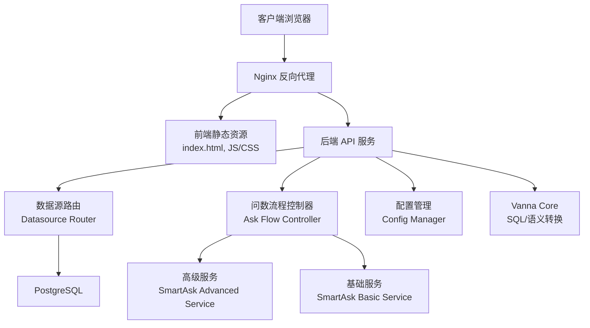
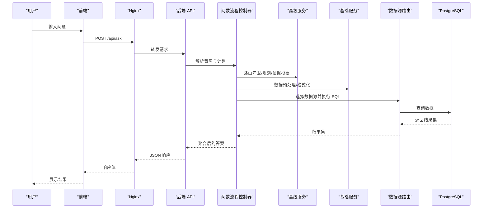
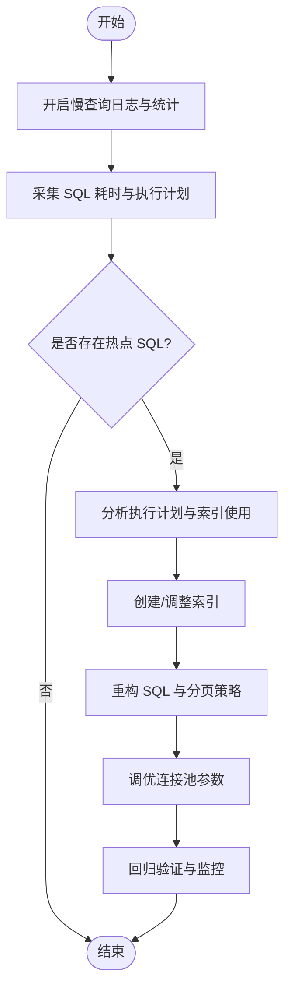
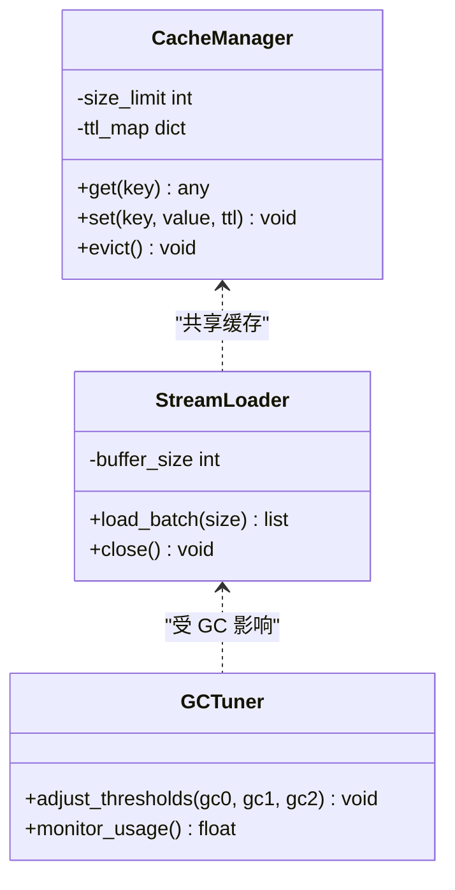
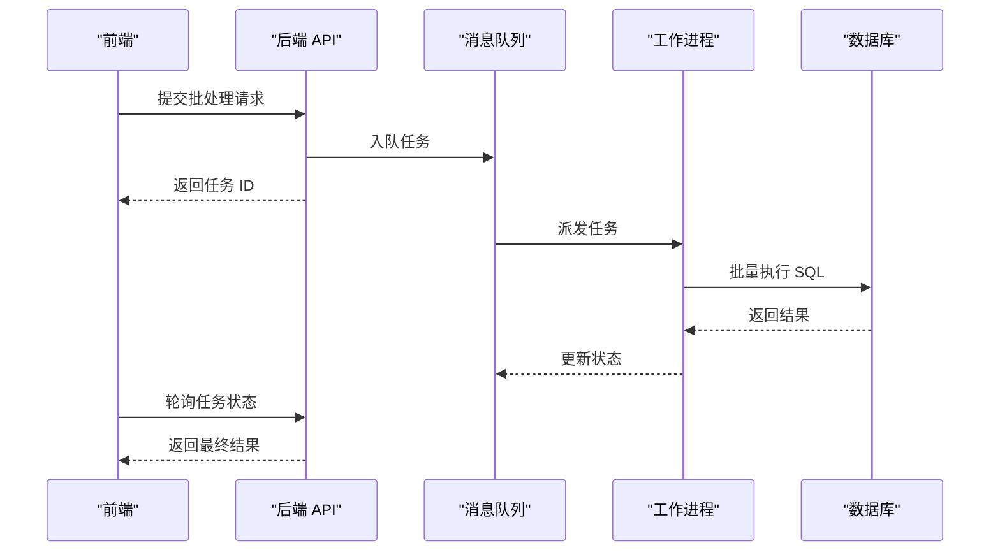
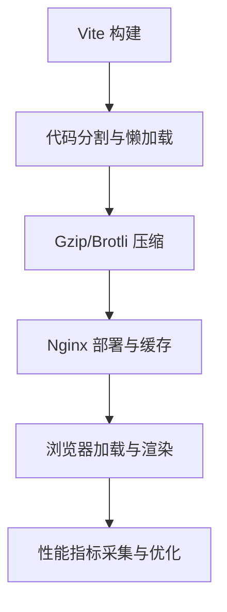
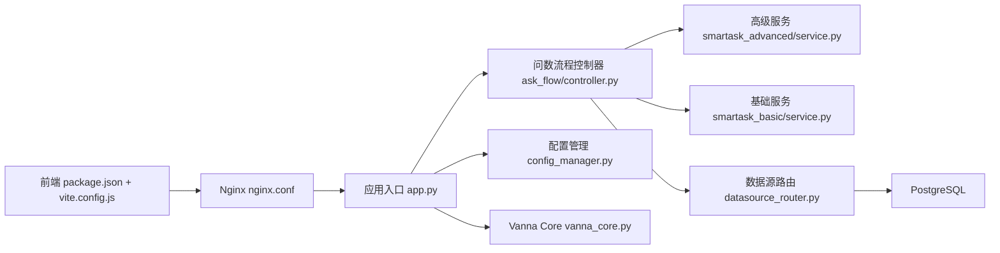

# 性能优化指南

<cite>
**本文引用的文件**   
- [app.py](file://backend/app.py)
- [config_manager.py](file://backend/config_manager.py)
- [datasource_router.py](file://backend/datasource_router.py)
- [ask_flow/controller.py](file://backend/ask_flow/controller.py)
- [smartask_advanced/service.py](file://backend/smartask_advanced/service.py)
- [vanna_core.py](file://backend/vanna_core.py)
- [docker-compose.yml](file://docker-compose.yml)
- [nginx.conf](file://frontend/nginx.conf)
- [vite.config.js](file://frontend/vite.config.js)
- [package.json](file://frontend/package.json)
- [001_bookshelf_schema.sql](file://docker/postgres/init/001_bookshelf_schema.sql)
- [004_report_config.sql](file://docker/postgres/init/004_report_config.sql)
- [batch_test_questions.py](file://backend/batch_test_questions.py)
- [single_test.py](file://backend/single_test.py)
</cite>

## 目录
1. [简介](#简介)
2. [项目结构](#项目结构)
3. [核心组件](#核心组件)
4. [架构总览](#架构总览)
5. [详细组件分析](#详细组件分析)
6. [依赖关系分析](#依赖关系分析)
7. [性能考量](#性能考量)
8. [故障排查指南](#故障排查指南)
9. [结论](#结论)
10. [附录](#附录)

## 简介
本指南面向 SmartAsk 智能问数平台，聚焦于数据库查询、内存使用、响应时间、前端渲染与网络、以及监控与压测等关键性能维度。内容覆盖慢查询识别、索引优化、SQL 重构、连接池配置、缓存策略、大对象处理、GC 调优、异步与批处理、负载均衡、前端懒加载与资源压缩、API 响应优化、监控指标采集与基准测试实践等，帮助团队在开发与生产环境中持续提升系统吞吐、降低延迟并稳定运行。

## 项目结构
SmartAsk 采用前后端分离架构：
- 后端（Python）：提供 API、数据源路由、问数流程编排、高级能力服务、基础服务、权限与认证、报告与日志等模块。
- 前端（Vue + Vite）：提供用户界面、状态管理、API 调用、主题与构建配置。
- 基础设施：Docker Compose 编排 PostgreSQL 与 Nginx，Nginx 作为反向代理与静态资源服务器，Vite 负责前端构建与优化。

**图表来源** 
- [nginx.conf](file://frontend/nginx.conf)
- [app.py](file://backend/app.py)
- [datasource_router.py](file://backend/datasource_router.py)
- [ask_flow/controller.py](file://backend/ask_flow/controller.py)
- [smartask_advanced/service.py](file://backend/smartask_advanced/service.py)
- [vanna_core.py](file://backend/vanna_core.py)
- [docker-compose.yml](file://docker-compose.yml)

**章节来源**
- [docker-compose.yml](file://docker-compose.yml)
- [nginx.conf](file://frontend/nginx.conf)
- [vite.config.js](file://frontend/vite.config.js)
- [package.json](file://frontend/package.json)

## 核心组件
- 应用入口与中间件：统一请求生命周期、鉴权、限流、日志与错误处理。
- 数据源路由：根据数据集与权限动态选择数据源，执行 SQL 或接口调用。
- 问数流程控制器：解析意图、生成计划、路由分支、执行 SQL、聚合结果。
- 高级服务：规划、路由守卫、证据投票、SQL 质量检查、模板策略等。
- 基础服务：通用数据处理与结果格式化。
- Vanna Core：语义到 SQL 的转换与校验。
- 配置管理：运行时配置、功能开关、数据源参数。
- 前端构建与代理：Vite 开发/生产构建、Nginx 静态资源与反向代理。

**章节来源**
- [app.py](file://backend/app.py)
- [datasource_router.py](file://backend/datasource_router.py)
- [ask_flow/controller.py](file://backend/ask_flow/controller.py)
- [smartask_advanced/service.py](file://backend/smartask_advanced/service.py)
- [vanna_core.py](file://backend/vanna_core.py)
- [config_manager.py](file://backend/config_manager.py)

## 架构总览
SmartAsk 的请求链路从前端发起，经 Nginx 转发至后端 API；后端通过数据源路由访问数据库，问数流程控制器协调高级与基础服务完成 SQL 生成、执行与结果聚合；配置管理贯穿各层以支持运行时调整。

**图表来源** 
- [ask_flow/controller.py](file://backend/ask_flow/controller.py)
- [smartask_advanced/service.py](file://backend/smartask_advanced/service.py)
- [datasource_router.py](file://backend/datasource_router.py)
- [nginx.conf](file://frontend/nginx.conf)

## 详细组件分析

### 数据库查询性能优化
- 慢查询识别
  - 启用 PostgreSQL 慢查询日志与统计视图，结合业务 QPS 与 P95/P99 延迟阈值定位热点表与语句。
  - 在后端对关键路径添加耗时埋点，输出 SQL 文本与执行时长，便于回归对比。
- 索引优化
  - 基于高频过滤条件与 JOIN 键建立复合索引，避免全表扫描与临时表排序。
  - 定期分析索引使用率与碎片，删除冗余索引，重建高碎片索引。
- 查询语句重构
  - 将复杂子查询改写为 CTE 或物化视图，减少重复计算。
  - 限制返回列与行数，避免 SELECT * 与大结果集传输。
  - 合理使用分页与增量拉取，避免一次性加载大数据。
- 连接池配置
  - 合理设置最大连接数、最小空闲连接、连接超时与回收策略，避免连接泄漏与抖动。
  - 针对读多写少场景拆分读写连接池，提升并发吞吐。

**图表来源** 
- [001_bookshelf_schema.sql](file://docker/postgres/init/001_bookshelf_schema.sql)
- [004_report_config.sql](file://docker/postgres/init/004_report_config.sql)

**章节来源**
- [datasource_router.py](file://backend/datasource_router.py)
- [ask_flow/controller.py](file://backend/ask_flow/controller.py)
- [001_bookshelf_schema.sql](file://docker/postgres/init/001_bookshelf_schema.sql)
- [004_report_config.sql](file://docker/postgres/init/004_report_config.sql)

### 内存使用优化策略
- 缓存机制调优
  - 对热点查询结果与字典映射进行 LRU 缓存，设置合理的 TTL 与容量上限，避免内存膨胀。
  - 区分会话级与全局缓存，减少跨请求复制成本。
- 大对象处理
  - 对大结果集采用流式读取与分批处理，避免一次性加载到内存。
  - 对图片、PDF 等大附件使用分块上传与 CDN 缓存，减少后端内存占用。
- 垃圾回收优化
  - 控制对象生命周期，及时释放临时变量与引用。
  - 调整 Python GC 阈值与触发频率，平衡停顿时间与吞吐。

**图表来源** 
- [config_manager.py](file://backend/config_manager.py)
- [smartask_advanced/service.py](file://backend/smartask_advanced/service.py)

**章节来源**
- [config_manager.py](file://backend/config_manager.py)
- [smartask_advanced/service.py](file://backend/smartask_advanced/service.py)

### 响应时间优化方案
- 异步处理
  - 将耗时任务（如长 SQL、外部 API 调用）放入队列异步执行，前端通过轮询或 SSE 获取进度。
  - 使用协程与线程池隔离 IO 密集型与 CPU 密集型任务。
- 负载均衡
  - 在多实例部署下通过 Nginx 或容器编排进行请求分发，避免单点过载。
  - 按路由或数据源亲和性分配实例，减少跨节点通信开销。
- 请求批处理
  - 合并多个小查询为批量操作，减少往返次数与锁竞争。
  - 对写入操作采用批量提交与事务合并，提升吞吐。

**图表来源** 
- [ask_flow/controller.py](file://backend/ask_flow/controller.py)
- [nginx.conf](file://frontend/nginx.conf)

**章节来源**
- [ask_flow/controller.py](file://backend/ask_flow/controller.py)
- [nginx.conf](file://frontend/nginx.conf)

### 前端性能优化技巧
- 组件懒加载
  - 使用动态 import 与路由级懒加载，减少首屏包体积。
  - 对重型组件（如图表、编辑器）按需加载。
- 资源压缩
  - 启用 Gzip/Brotli 压缩，合并与拆分 JS/CSS 按需加载。
  - 图片与字体使用 WebP/AVIF 与字体子集化。
- 网络请求优化
  - 使用 HTTP/2、Keep-Alive、CDN 缓存与 ETag。
  - 对频繁请求做去抖与节流，避免重复请求。

**图表来源** 
- [vite.config.js](file://frontend/vite.config.js)
- [nginx.conf](file://frontend/nginx.conf)
- [package.json](file://frontend/package.json)

**章节来源**
- [vite.config.js](file://frontend/vite.config.js)
- [nginx.conf](file://frontend/nginx.conf)
- [package.json](file://frontend/package.json)

## 依赖关系分析
后端模块之间的依赖呈现清晰的层次：API 层依赖控制器，控制器依赖高级与基础服务，数据源路由依赖数据库驱动与配置管理。前端通过 Nginx 反向代理与后端交互，构建期由 Vite 管理依赖与打包。

**图表来源** 
- [app.py](file://backend/app.py)
- [ask_flow/controller.py](file://backend/ask_flow/controller.py)
- [smartask_advanced/service.py](file://backend/smartask_advanced/service.py)
- [datasource_router.py](file://backend/datasource_router.py)
- [config_manager.py](file://backend/config_manager.py)
- [vanna_core.py](file://backend/vanna_core.py)
- [nginx.conf](file://frontend/nginx.conf)
- [vite.config.js](file://frontend/vite.config.js)
- [package.json](file://frontend/package.json)

**章节来源**
- [app.py](file://backend/app.py)
- [ask_flow/controller.py](file://backend/ask_flow/controller.py)
- [smartask_advanced/service.py](file://backend/smartask_advanced/service.py)
- [datasource_router.py](file://backend/datasource_router.py)
- [config_manager.py](file://backend/config_manager.py)
- [vanna_core.py](file://backend/vanna_core.py)
- [nginx.conf](file://frontend/nginx.conf)
- [vite.config.js](file://frontend/vite.config.js)
- [package.json](file://frontend/package.json)

## 性能考量
- 数据库
  - 优先通过执行计划与索引命中评估优化效果，避免盲目加索引。
  - 对热点表分区与归档历史数据，降低查询复杂度。
- 内存与 GC
  - 监控 RSS/Heap 增长趋势，定位内存泄漏与未释放引用。
  - 对大对象使用内存映射或外部存储，减少堆压力。
- 响应时间
  - 引入端到端追踪（请求 ID、链路跨度），定位瓶颈阶段。
  - 对非关键路径降级与熔断，保障核心链路可用。
- 前端
  - 使用 Lighthouse 与 Performance Panel 分析首屏与交互延迟。
  - 对第三方脚本异步加载与延迟执行，避免阻塞渲染。

[本节为通用指导，不直接分析具体文件]

## 故障排查指南
- 慢查询与死锁
  - 查看 PostgreSQL 活动会话与等待事件，定位锁争用与长事务。
  - 对频繁超时的 SQL 增加超时与重试退避策略。
- 连接池耗尽
  - 监控连接池使用率与等待队列，调整最大连接数与超时。
  - 检查是否有未关闭的连接或异常路径导致泄漏。
- 内存峰值与 OOM
  - 使用内存快照与堆转储分析对象分布，定位大对象与循环引用。
  - 调整 GC 阈值与限制单次处理的数据量。
- 前端卡顿与白屏
  - 检查资源加载失败与 CORS 错误，优化分包与缓存策略。
  - 对重型组件进行懒加载与降级显示。

**章节来源**
- [app.py](file://backend/app.py)
- [config_manager.py](file://backend/config_manager.py)
- [nginx.conf](file://frontend/nginx.conf)

## 结论
通过对数据库、内存、响应时间与前端的系统性优化，并结合监控与压测闭环，SmartAsk 可在高并发与大数据量场景下保持稳定与高效。建议持续迭代索引与 SQL 策略，完善缓存与异步处理，强化前端懒加载与资源压缩，并以标准化压测与指标监控保障性能基线与回归。

[本节为总结性内容，不直接分析具体文件]

## 附录
- 性能监控工具与指标
  - 后端：Prometheus + Grafana 采集 CPU、内存、GC、连接池、请求延迟与错误率。
  - 数据库：pg_stat_statements、pg_stat_activity、EXPLAIN ANALYZE 分析热点与计划。
  - 前端：Lighthouse、WebPageTest、浏览器 Performance 面板。
- 基准测试最佳实践
  - 使用 JMeter/Locust 模拟真实负载，覆盖典型用例与边界场景。
  - 定义 SLO（如 P95 延迟、错误率、吞吐），建立回归基线。
  - 在 CI/CD 中集成压测与性能门禁，防止性能退化。

**章节来源**
- [batch_test_questions.py](file://backend/batch_test_questions.py)
- [single_test.py](file://backend/single_test.py)