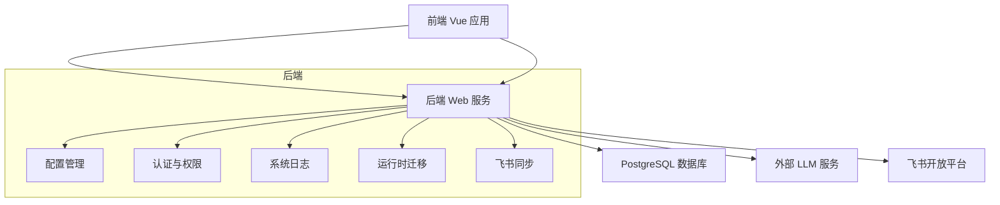
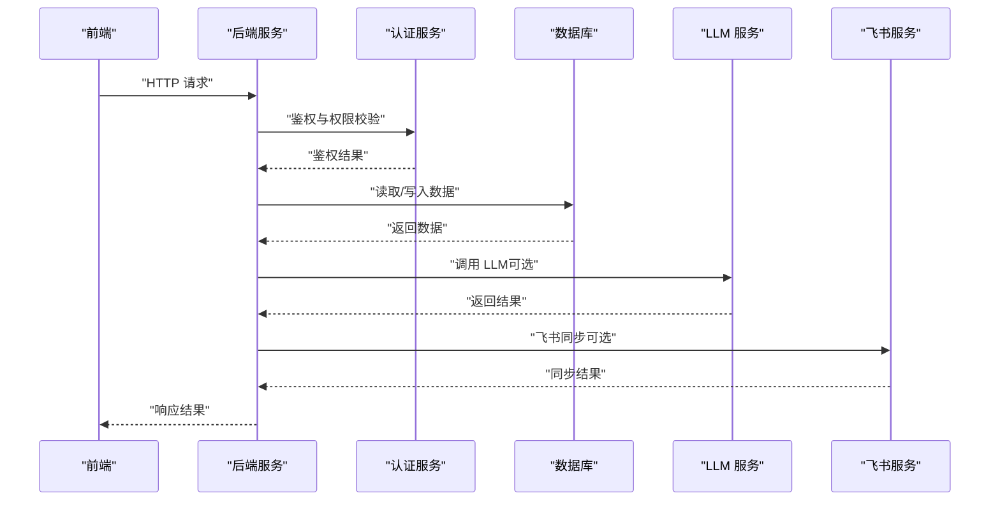
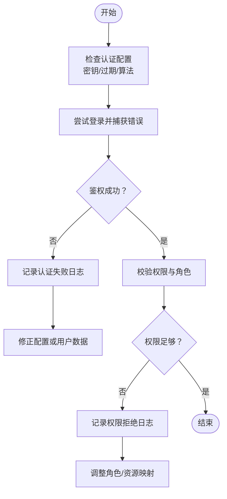
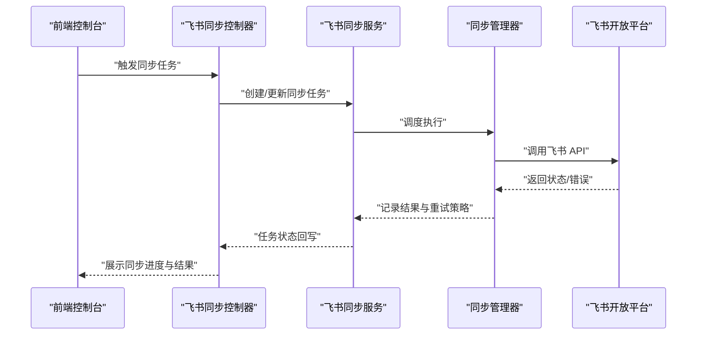
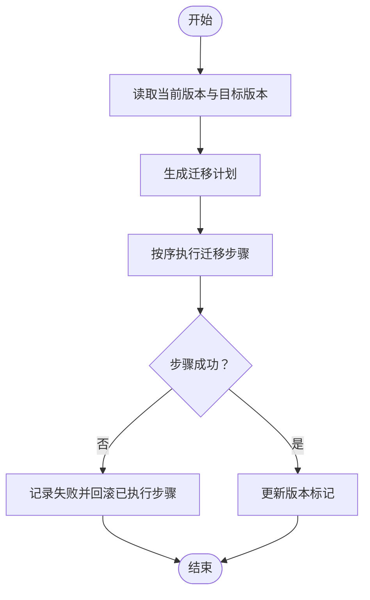
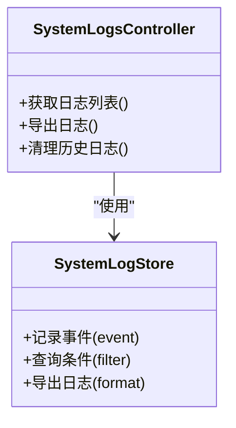
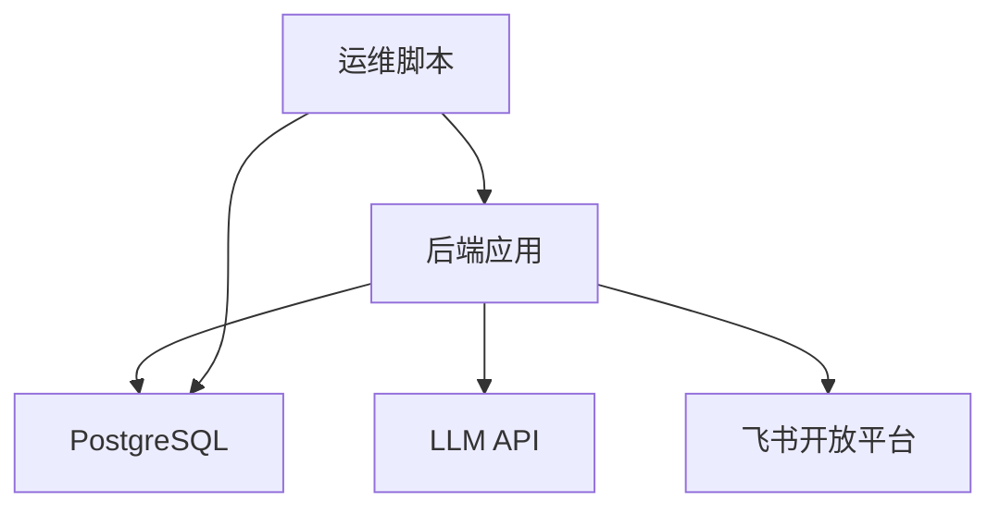

# 故障排除

<cite>
**本文引用的文件**   
- [backend/app.py](file://backend/app.py)
- [backend/config_manager.py](file://backend/config_manager.py)
- [backend/security.py](file://backend/security.py)
- [backend/auth_store.py](file://backend/auth_store.py)
- [backend/controllers/auth.py](file://backend/controllers/auth.py)
- [backend/controllers/feishu_sync.py](file://backend/controllers/feishu_sync.py)
- [backend/feishu_sync_manager.py](file://backend/feishu_sync_manager.py)
- [backend/feishu_sync_service.py](file://backend/feishu_sync_service.py)
- [backend/feishu_sync_logger.py](file://backend/feishu_sync_logger.py)
- [backend/system_log_store.py](file://backend/system_log_store.py)
- [backend/controllers/system_logs.py](file://backend/controllers/system_logs.py)
- [backend/runtime_migration.py](file://backend/runtime_migration.py)
- [backend/migrations/20260512_system_event_logs.sql](file://backend/migrations/20260512_system_event_logs.sql)
- [docker-compose.yml](file://docker-compose.yml)
- [scripts/backup_all.py](file://scripts/backup_all.py)
- [restore.sh](file://restore.sh)
- [doctor.sh](file://doctor.sh)
- [deploy.sh](file://deploy.sh)
- [frontend/src/views/FeishuSync.vue](file://frontend/src/views/FeishuSync.vue)
- [frontend/src/api/index.js](file://frontend/src/api/index.js)
</cite>

## 目录
1. [简介](#简介)
2. [项目结构](#项目结构)
3. [核心组件](#核心组件)
4. [架构总览](#架构总览)
5. [详细组件分析](#详细组件分析)
6. [依赖关系分析](#依赖关系分析)
7. [性能注意事项](#性能注意事项)
8. [故障排查指南](#故障排查指南)
9. [结论](#结论)
10. [附录](#附录)

## 简介
本故障排除文档面向 SmartAsk 智能问数平台的运维与开发人员，覆盖安装部署、运行时错误、性能问题、数据一致性、安全、系统集成（飞书同步、LLM API、外部服务）、故障恢复与灾难恢复、监控告警与预防性维护等主题。文档以仓库中的后端服务、配置管理、日志存储、迁移脚本、容器编排以及前端集成点为依据，提供可操作的定位步骤与修复建议。

## 项目结构
SmartAsk 采用前后端分离架构：
- 后端：Python Web 应用，包含控制器、服务层、配置与权限、系统日志、迁移脚本、飞书同步模块等。
- 前端：Vue 应用，提供控制台与交互界面，调用后端 API。
- 基础设施：Docker Compose 编排数据库与后端服务；脚本支持备份、恢复、健康检查与部署。

图表来源
- [backend/app.py](file://backend/app.py)
- [docker-compose.yml](file://docker-compose.yml)

章节来源
- [backend/app.py](file://backend/app.py)
- [docker-compose.yml](file://docker-compose.yml)

## 核心组件
- 配置管理：集中加载环境变量与运行时配置，支撑鉴权、数据库连接、外部服务接入。
- 认证与权限：用户登录、会话管理、RBAC 控制。
- 系统日志：事件记录、查询与导出，用于排障与审计。
- 运行时迁移：数据库结构与运行态配置变更的幂等执行。
- 飞书同步：与飞书开放平台的数据同步与任务调度。
- 安全：敏感信息处理、访问控制与输入校验。

章节来源
- [backend/config_manager.py](file://backend/config_manager.py)
- [backend/security.py](file://backend/security.py)
- [backend/auth_store.py](file://backend/auth_store.py)
- [backend/controllers/auth.py](file://backend/controllers/auth.py)
- [backend/system_log_store.py](file://backend/system_log_store.py)
- [backend/controllers/system_logs.py](file://backend/controllers/system_logs.py)
- [backend/runtime_migration.py](file://backend/runtime_migration.py)
- [backend/feishu_sync_manager.py](file://backend/feishu_sync_manager.py)
- [backend/feishu_sync_service.py](file://backend/feishu_sync_service.py)
- [backend/feishu_sync_logger.py](file://backend/feishu_sync_logger.py)

## 架构总览
SmartAsk 的核心请求链路包括：前端发起 HTTP 请求 → 后端路由与控制器 → 业务服务（认证、权限、数据源、报告）→ 数据库与外部服务（LLM、飞书）。系统日志贯穿全链路，便于追踪问题。

图表来源
- [backend/app.py](file://backend/app.py)
- [backend/controllers/auth.py](file://backend/controllers/auth.py)
- [backend/system_log_store.py](file://backend/system_log_store.py)

## 详细组件分析

### 认证与权限异常排查
常见问题：
- 登录失败、令牌无效、权限不足。
- 会话丢失或跨域导致前端无法维持登录态。

排查要点：
- 检查认证控制器与存储实现，确认密钥、过期策略、密码哈希是否正确。
- 核对数据库用户表与 RBAC 配置是否一致。
- 查看系统日志中认证相关事件，定位失败原因。

图表来源
- [backend/controllers/auth.py](file://backend/controllers/auth.py)
- [backend/auth_store.py](file://backend/auth_store.py)
- [backend/system_log_store.py](file://backend/system_log_store.py)

章节来源
- [backend/controllers/auth.py](file://backend/controllers/auth.py)
- [backend/auth_store.py](file://backend/auth_store.py)
- [backend/system_log_store.py](file://backend/system_log_store.py)

### 飞书同步失败诊断
常见问题：
- 飞书 API 调用超时或鉴权失败。
- 同步任务卡住或重复执行。
- 数据不一致导致同步中断。

排查要点：
- 检查飞书同步控制器与服务层的配置（App ID/Secret、回调地址、权限范围）。
- 查看飞书同步日志与系统日志，定位具体错误码与重试次数。
- 验证网络连通性与防火墙策略，确保能访问飞书开放平台。

图表来源
- [backend/controllers/feishu_sync.py](file://backend/controllers/feishu_sync.py)
- [backend/feishu_sync_service.py](file://backend/feishu_sync_service.py)
- [backend/feishu_sync_manager.py](file://backend/feishu_sync_manager.py)
- [backend/feishu_sync_logger.py](file://backend/feishu_sync_logger.py)

章节来源
- [backend/controllers/feishu_sync.py](file://backend/controllers/feishu_sync.py)
- [backend/feishu_sync_service.py](file://backend/feishu_sync_service.py)
- [backend/feishu_sync_manager.py](file://backend/feishu_sync_manager.py)
- [backend/feishu_sync_logger.py](file://backend/feishu_sync_logger.py)
- [frontend/src/views/FeishuSync.vue](file://frontend/src/views/FeishuSync.vue)

### 运行时迁移与数据一致性
常见问题：
- 迁移脚本执行失败或重复执行导致冲突。
- 数据库结构与代码期望不一致。
- 历史数据不兼容新字段或约束。

排查要点：
- 检查迁移脚本与运行时迁移逻辑，确保幂等与版本标记正确。
- 查看系统日志中的迁移事件，定位失败阶段与回滚策略。
- 在测试环境先行验证迁移后再在生产执行。

图表来源
- [backend/runtime_migration.py](file://backend/runtime_migration.py)
- [backend/migrations/20260512_system_event_logs.sql](file://backend/migrations/20260512_system_event_logs.sql)
- [backend/system_log_store.py](file://backend/system_log_store.py)

章节来源
- [backend/runtime_migration.py](file://backend/runtime_migration.py)
- [backend/migrations/20260512_system_event_logs.sql](file://backend/migrations/20260512_system_event_logs.sql)
- [backend/system_log_store.py](file://backend/system_log_store.py)

### 系统日志与错误诊断
常见问题：
- 日志级别不当导致关键信息缺失或噪音过多。
- 日志未持久化或查询困难。
- 错误堆栈不完整难以定位根因。

排查要点：
- 通过系统日志控制器与存储接口查询事件，过滤时间范围与事件类型。
- 合理设置日志级别（如 DEBUG/INFO/WARN/ERROR），在排障时临时提升级别。
- 结合外部服务调用链路与数据库慢查询日志进行关联分析。

图表来源
- [backend/system_log_store.py](file://backend/system_log_store.py)
- [backend/controllers/system_logs.py](file://backend/controllers/system_logs.py)

章节来源
- [backend/system_log_store.py](file://backend/system_log_store.py)
- [backend/controllers/system_logs.py](file://backend/controllers/system_logs.py)

## 依赖关系分析
SmartAsk 的关键依赖包括：
- 数据库：PostgreSQL，承载用户、权限、数据集、报告配置与系统日志。
- 外部服务：LLM API（文本生成/分析）、飞书开放平台（消息与表格同步）。
- 容器编排：Docker Compose 统一启动后端与数据库。

图表来源
- [docker-compose.yml](file://docker-compose.yml)
- [backend/app.py](file://backend/app.py)

章节来源
- [docker-compose.yml](file://docker-compose.yml)
- [backend/app.py](file://backend/app.py)

## 性能注意事项
- 数据库查询优化：避免 N+1 查询，合理使用索引与分页；对热点报表启用物化视图或缓存。
- 内存使用分析：关注大对象序列化与批量数据处理，必要时分片与流式处理。
- 响应时间调优：异步处理耗时任务（如飞书同步、报告生成），设置合理的超时与重试策略。
- 外部服务限流：对 LLM 与飞书 API 调用增加速率限制与退避重试，避免雪崩。

[本节为通用指导，不直接分析具体文件]

## 故障排查指南

### 安装部署问题
- 容器启动失败：检查 docker-compose.yml 的环境变量、端口映射与卷挂载。
- 数据库初始化失败：确认初始化脚本顺序与权限，查看迁移日志。
- 前端构建失败：检查 Node 版本与依赖安装，确认代理与 API 路径配置。

操作建议：
- 使用健康检查脚本验证各组件状态。
- 查看后端与应用日志，定位具体错误。
- 在隔离环境复现问题后逐步推进到生产。

章节来源
- [docker-compose.yml](file://docker-compose.yml)
- [deploy.sh](file://deploy.sh)
- [doctor.sh](file://doctor.sh)

### 运行时错误
- 认证失败：检查密钥、过期策略与用户数据一致性。
- 权限异常：核对 RBAC 配置与资源映射。
- 外部服务异常：检查网络连通性、证书与限流策略。

操作建议：
- 提升日志级别至 DEBUG，捕获完整堆栈。
- 使用系统日志控制器筛选错误事件。
- 针对外部服务调用增加重试与降级逻辑。

章节来源
- [backend/controllers/auth.py](file://backend/controllers/auth.py)
- [backend/system_log_store.py](file://backend/system_log_store.py)

### 性能问题
- 慢查询：通过数据库慢查询日志定位 SQL 瓶颈，补充索引或改写查询。
- 内存峰值：分析大对象与批处理逻辑，拆分任务与限制并发。
- 响应延迟：引入异步队列与缓存，减少阻塞调用。

操作建议：
- 开启性能剖析工具（如 cProfile、APM）。
- 对热点接口添加指标采集与告警阈值。

[本节为通用指导，不直接分析具体文件]

### 数据一致性问题
- 迁移冲突：检查版本标记与幂等性，避免重复执行。
- 读写不一致：使用事务与锁机制，确保强一致性场景。
- 外部数据不同步：增加校验与补偿任务，定期比对差异。

操作建议：
- 在预发布环境执行全量回归测试。
- 建立数据一致性巡检任务与告警。

章节来源
- [backend/runtime_migration.py](file://backend/runtime_migration.py)
- [backend/system_log_store.py](file://backend/system_log_store.py)

### 安全问题
- 权限异常：审查 RBAC 策略与最小权限原则。
- 认证失败：检查令牌签发与校验逻辑，防止伪造与重放。
- 数据泄露防护：加密敏感字段，限制日志输出与访问控制。

操作建议：
- 定期进行安全扫描与渗透测试。
- 强化输入校验与输出编码。

章节来源
- [backend/security.py](file://backend/security.py)
- [backend/auth_store.py](file://backend/auth_store.py)

### 系统集成问题
- 飞书同步失败：检查 API 凭证、权限范围与回调地址，查看同步日志。
- LLM API 调用异常：确认模型参数、限流与重试策略。
- 外部服务连接问题：检查 DNS、代理与防火墙规则。

操作建议：
- 对外部服务调用增加熔断与降级。
- 建立连接池与超时配置的最佳实践。

章节来源
- [backend/controllers/feishu_sync.py](file://backend/controllers/feishu_sync.py)
- [backend/feishu_sync_service.py](file://backend/feishu_sync_service.py)
- [backend/feishu_sync_manager.py](file://backend/feishu_sync_manager.py)
- [backend/feishu_sync_logger.py](file://backend/feishu_sync_logger.py)

### 故障恢复与灾难恢复
- 数据备份恢复：使用备份脚本导出数据库与配置文件，恢复时校验完整性。
- 服务重启：按顺序重启后端与数据库，观察健康检查与日志。
- 配置回滚：回滚到上一稳定版本，重新执行迁移与验证。

操作建议：
- 制定演练计划，定期验证恢复流程。
- 保留多版本快照与回滚脚本。

章节来源
- [scripts/backup_all.py](file://scripts/backup_all.py)
- [restore.sh](file://restore.sh)
- [deploy.sh](file://deploy.sh)

### 监控告警与响应流程
- 监控指标：QPS、错误率、响应时间、数据库连接数、外部服务可用性。
- 告警阈值：基于历史基线设定动态阈值，避免误报。
- 响应流程：分级告警、自动恢复、人工介入与复盘改进。

操作建议：
- 集成 APM 与日志聚合平台，建立统一看板。
- 编写应急预案与演练手册。

[本节为通用指导，不直接分析具体文件]

### 预防性维护最佳实践
- 定期巡检：检查磁盘、内存、CPU 与网络资源。
- 依赖升级：评估第三方库与安全补丁，灰度发布。
- 容量规划：根据业务增长预测扩容策略。

[本节为通用指导，不直接分析具体文件]

## 结论
通过系统化地梳理 SmartAsk 的认证、权限、日志、迁移、飞书同步与安全等核心组件，结合容器编排与运维脚本，可以高效定位与解决安装部署、运行时错误、性能与数据一致性问题。建议建立完善的监控告警体系与灾备演练机制，持续提升系统的稳定性与可维护性。

## 附录
- 常用命令与脚本：
  - 健康检查：doctor.sh
  - 部署与更新：deploy.sh
  - 备份与恢复：backup_all.py、restore.sh
- 前端集成点：
  - 飞书同步页面：frontend/src/views/FeishuSync.vue
  - API 调用封装：frontend/src/api/index.js

章节来源
- [doctor.sh](file://doctor.sh)
- [deploy.sh](file://deploy.sh)
- [scripts/backup_all.py](file://scripts/backup_all.py)
- [restore.sh](file://restore.sh)
- [frontend/src/views/FeishuSync.vue](file://frontend/src/views/FeishuSync.vue)
- [frontend/src/api/index.js](file://frontend/src/api/index.js)