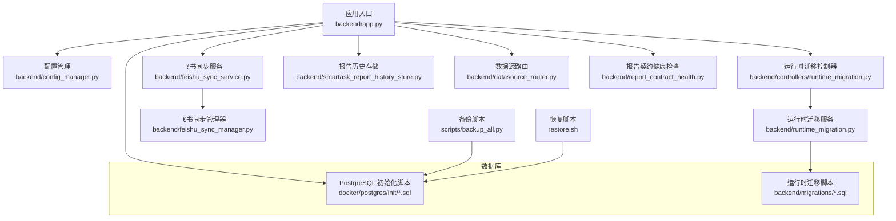
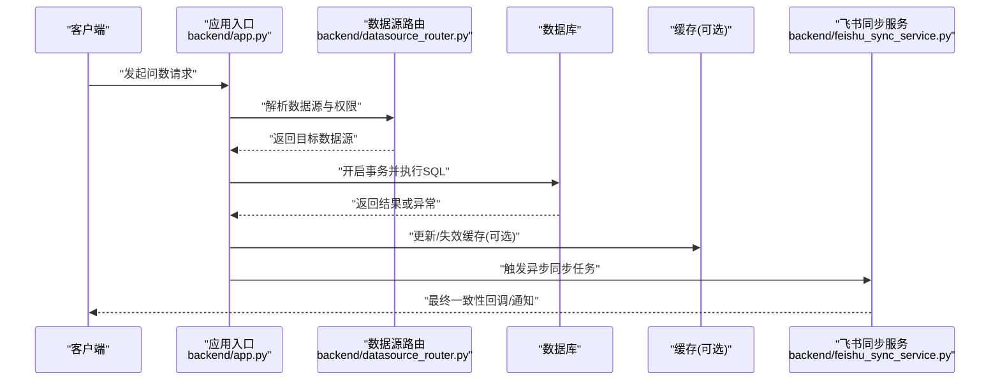
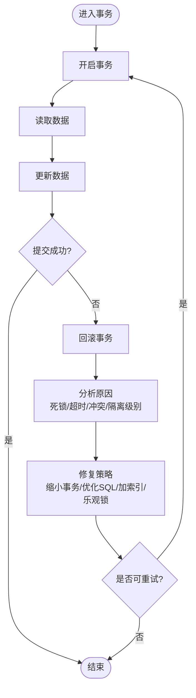
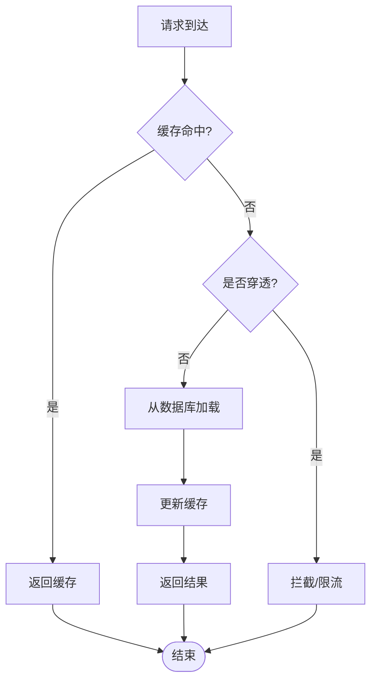
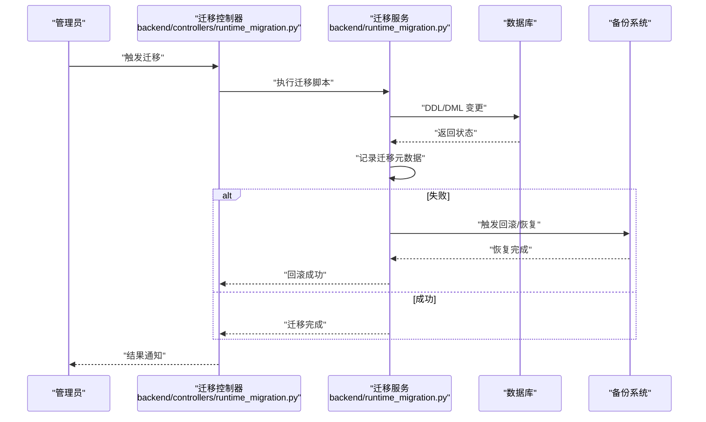
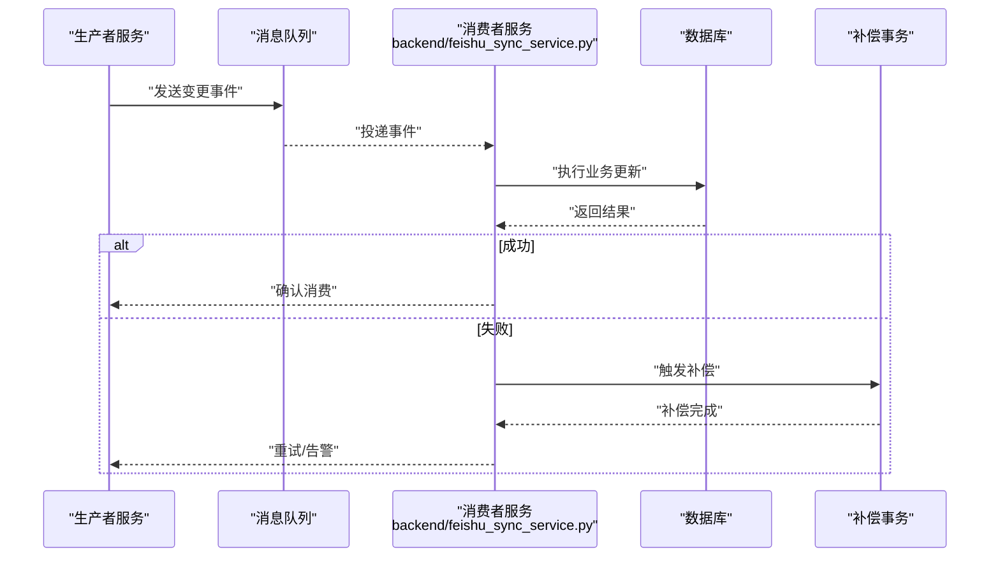
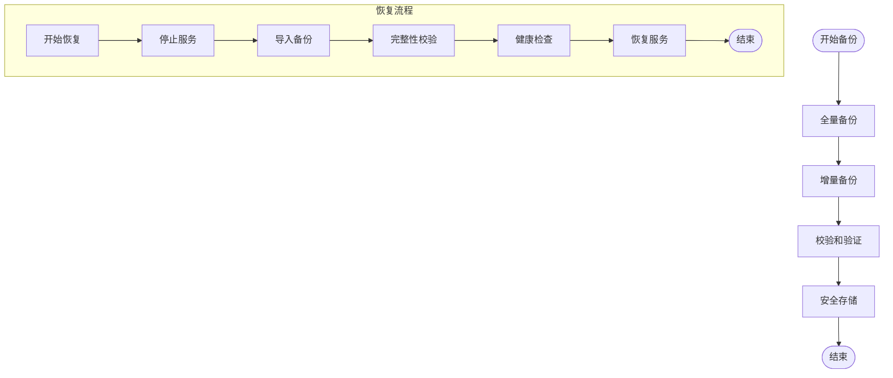
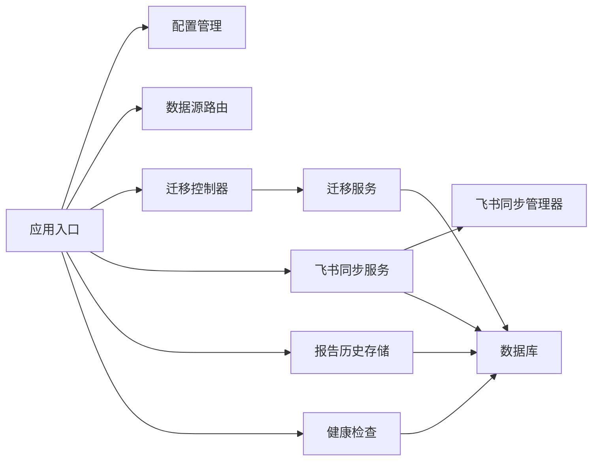

# 数据一致性问题

<cite>
**本文引用的文件**   
- [backend/app.py](file://backend/app.py)
- [backend/config_manager.py](file://backend/config_manager.py)
- [backend/runtime_migration.py](file://backend/runtime_migration.py)
- [backend/controllers/runtime_migration.py](file://backend/controllers/runtime_migration.py)
- [backend/feishu_sync_service.py](file://backend/feishu_sync_service.py)
- [backend/feishu_sync_manager.py](file://backend/feishu_sync_manager.py)
- [backend/smartask_report_history_store.py](file://backend/smartask_report_history_store.py)
- [backend/datasource_router.py](file://backend/datasource_router.py)
- [backend/report_contract_health.py](file://backend/report_contract_health.py)
- [scripts/backup_all.py](file://scripts/backup_all.py)
- [restore.sh](file://restore.sh)
- [docker/postgres/init/001_bookshelf_schema.sql](file://docker/postgres/init/001_bookshelf_schema.sql)
- [backend/migrations/20260330_bookshelf_schema.sql](file://backend/migrations/20260330_bookshelf_schema.sql)
- [backend/migrations/20260430_report_config.sql](file://backend/migrations/20260430_report_config.sql)
- [backend/migrations/20260512_system_event_logs.sql](file://backend/migrations/20260512_system_event_logs.sql)
- [backend/migrations/20260630_dataset_transforms.sql](file://backend/migrations/20260630_dataset_transforms.sql)
- [backend/tests/test_ask_flow_controller.py](file://backend/tests/test_ask_flow_controller.py)
- [backend/tests/test_security_guards.py](file://backend/tests/test_security_guards.py)
</cite>

## 目录
1. [引言](#引言)
2. [项目结构](#项目结构)
3. [核心组件](#核心组件)
4. [架构总览](#架构总览)
5. [详细组件分析](#详细组件分析)
6. [依赖关系分析](#依赖关系分析)
7. [性能考量](#性能考量)
8. [故障排查指南](#故障排查指南)
9. [结论](#结论)
10. [附录](#附录)

## 引言
本指南面向 SmartAsk 智能问数平台的数据一致性排查与治理，覆盖数据库事务问题（死锁、超时、并发冲突、脏读）、缓存一致性问题（穿透、雪崩、击穿、缓存与DB不一致）、数据迁移问题（脚本失败、版本不兼容、损坏恢复）、分布式同步问题（跨服务一致性、最终一致性、补偿事务），以及备份恢复与完整性校验流程。文档以仓库现有实现为依据，提供可操作的诊断步骤、流程图与最佳实践，帮助研发与运维快速定位并解决问题。

## 项目结构
SmartAsk 后端采用 Python Web 框架组织，关键模块包括：
- 应用入口与配置管理：app.py、config_manager.py
- 运行时迁移：runtime_migration.py、controllers/runtime_migration.py
- 飞书同步：feishu_sync_service.py、feishu_sync_manager.py
- 报告历史存储：smartask_report_history_store.py
- 数据源路由：datasource_router.py
- 健康检查与契约校验：report_contract_health.py
- 数据库初始化与迁移脚本：docker/postgres/init/*.sql、backend/migrations/*.sql
- 备份与恢复：scripts/backup_all.py、restore.sh

图表来源
- [backend/app.py](file://backend/app.py)
- [backend/config_manager.py](file://backend/config_manager.py)
- [backend/controllers/runtime_migration.py](file://backend/controllers/runtime_migration.py)
- [backend/runtime_migration.py](file://backend/runtime_migration.py)
- [backend/feishu_sync_service.py](file://backend/feishu_sync_service.py)
- [backend/feishu_sync_manager.py](file://backend/feishu_sync_manager.py)
- [backend/smartask_report_history_store.py](file://backend/smartask_report_history_store.py)
- [backend/datasource_router.py](file://backend/datasource_router.py)
- [backend/report_contract_health.py](file://backend/report_contract_health.py)
- [docker/postgres/init/001_bookshelf_schema.sql](file://docker/postgres/init/001_bookshelf_schema.sql)
- [backend/migrations/20260330_bookshelf_schema.sql](file://backend/migrations/20260330_bookshelf_schema.sql)
- [backend/migrations/20260430_report_config.sql](file://backend/migrations/20260430_report_config.sql)
- [backend/migrations/20260512_system_event_logs.sql](file://backend/migrations/20260512_system_event_logs.sql)
- [backend/migrations/20260630_dataset_transforms.sql](file://backend/migrations/20260630_dataset_transforms.sql)
- [scripts/backup_all.py](file://scripts/backup_all.py)
- [restore.sh](file://restore.sh)

章节来源
- [backend/app.py](file://backend/app.py)
- [backend/config_manager.py](file://backend/config_manager.py)

## 核心组件
- 应用入口与生命周期：负责启动服务、注册路由、加载配置、初始化迁移与健康检查。
- 运行时迁移：提供版本化迁移执行、回滚与状态记录，确保数据库结构与代码版本一致。
- 飞书同步：跨服务数据同步，保证增量变更的最终一致性，支持重试与补偿。
- 报告历史存储：持久化查询结果与中间态，保障幂等与可追溯。
- 数据源路由：根据请求上下文选择合适的数据源，避免跨库不一致。
- 健康检查：校验报告契约与数据质量，提前发现不一致风险。

章节来源
- [backend/app.py](file://backend/app.py)
- [backend/runtime_migration.py](file://backend/runtime_migration.py)
- [backend/controllers/runtime_migration.py](file://backend/controllers/runtime_migration.py)
- [backend/feishu_sync_service.py](file://backend/feishu_sync_service.py)
- [backend/feishu_sync_manager.py](file://backend/feishu_sync_manager.py)
- [backend/smartask_report_history_store.py](file://backend/smartask_report_history_store.py)
- [backend/datasource_router.py](file://backend/datasource_router.py)
- [backend/report_contract_health.py](file://backend/report_contract_health.py)

## 架构总览
SmartAsk 的架构围绕“请求-处理-持久化-同步”的主链路展开，关键一致性点包括：
- 数据库事务边界与隔离级别控制
- 迁移脚本的版本管理与幂等性
- 跨服务同步的最终一致性与补偿机制
- 缓存层（如存在）与数据库的一致性策略
- 备份恢复与完整性校验

图表来源
- [backend/app.py](file://backend/app.py)
- [backend/datasource_router.py](file://backend/datasource_router.py)
- [backend/feishu_sync_service.py](file://backend/feishu_sync_service.py)

## 详细组件分析

### 数据库事务问题诊断
- 死锁检测
  - 现象：请求长时间挂起，日志出现锁等待或死锁错误。
  - 排查要点：确认事务粒度是否过大；是否存在多表更新顺序不一致；索引是否缺失导致锁升级。
  - 解决建议：缩小事务范围；统一加锁顺序；为高频条件添加索引；使用 SELECT ... FOR UPDATE 明确行级锁。
- 事务超时
  - 现象：长事务被数据库或连接池中断。
  - 排查要点：检查 SQL 复杂度与扫描行数；网络延迟；连接池配置。
  - 解决建议：拆分大事务；优化 SQL；调整超时参数；引入分页与批处理。
- 并发更新冲突
  - 现象：同一行数据被多个事务同时修改导致冲突。
  - 排查要点：识别热点行；检查版本号或时间戳字段；是否存在无唯一约束的重复写入。
  - 解决建议：引入乐观锁（版本号）；使用 UPSERT；对热点数据进行分片或队列串行化。
- 脏读现象
  - 现象：读取到未提交数据或不一致快照。
  - 排查要点：确认隔离级别；是否存在未提交读；读写路径是否共享连接。
  - 解决建议：提升隔离级别至可重复读或串行化；读写分离；强制事务内只读路径使用快照。

章节来源
- [backend/app.py](file://backend/app.py)
- [backend/datasource_router.py](file://backend/datasource_router.py)
- [backend/smartask_report_history_store.py](file://backend/smartask_report_history_store.py)

### 缓存一致性问题
- 缓存穿透
  - 现象：大量不存在键的请求直达数据库。
  - 解决：布隆过滤器或空值缓存；限流与降级。
- 缓存雪崩
  - 现象：大量缓存同时过期导致数据库压力骤增。
  - 解决：随机过期时间；多级缓存；预热与熔断。
- 缓存击穿
  - 现象：热点键过期瞬间大量请求涌入。
  - 解决：互斥锁重建；逻辑过期与后台刷新。
- 缓存与数据库不一致
  - 现象：写后读不一致或旧值残留。
  - 解决：先更新数据库再删除缓存；或使用延迟双删；引入一致性校验任务。

[本节为概念性说明，不直接分析具体文件]

### 数据迁移问题解决方案
- 迁移脚本执行失败
  - 现象：迁移中断或报错，状态不一致。
  - 解决：幂等脚本设计；断点续跑；回滚脚本；记录迁移元数据。
- 版本不兼容
  - 现象：新旧版本共存时数据结构不匹配。
  - 解决：灰度发布；向后兼容字段；迁移前后校验。
- 数据损坏恢复
  - 现象：迁移后数据异常或损坏。
  - 解决：基于备份恢复；校验和比对；回滚到稳定版本。

图表来源
- [backend/controllers/runtime_migration.py](file://backend/controllers/runtime_migration.py)
- [backend/runtime_migration.py](file://backend/runtime_migration.py)
- [docker/postgres/init/001_bookshelf_schema.sql](file://docker/postgres/init/001_bookshelf_schema.sql)
- [backend/migrations/20260330_bookshelf_schema.sql](file://backend/migrations/20260330_bookshelf_schema.sql)
- [backend/migrations/20260430_report_config.sql](file://backend/migrations/20260430_report_config.sql)
- [backend/migrations/20260512_system_event_logs.sql](file://backend/migrations/20260512_system_event_logs.sql)
- [backend/migrations/20260630_dataset_transforms.sql](file://backend/migrations/20260630_dataset_transforms.sql)

章节来源
- [backend/runtime_migration.py](file://backend/runtime_migration.py)
- [backend/controllers/runtime_migration.py](file://backend/controllers/runtime_migration.py)
- [docker/postgres/init/001_bookshelf_schema.sql](file://docker/postgres/init/001_bookshelf_schema.sql)
- [backend/migrations/20260330_bookshelf_schema.sql](file://backend/migrations/20260330_bookshelf_schema.sql)
- [backend/migrations/20260430_report_config.sql](file://backend/migrations/20260430_report_config.sql)
- [backend/migrations/20260512_system_event_logs.sql](file://backend/migrations/20260512_system_event_logs.sql)
- [backend/migrations/20260630_dataset_transforms.sql](file://backend/migrations/20260630_dataset_transforms.sql)

### 分布式数据同步问题
- 跨服务数据一致性
  - 策略：事件驱动 + 幂等消费；消息去重；补偿事务。
- 最终一致性保证
  - 策略：出队重试；死信队列；监控告警；一致性校验任务。
- 补偿事务实现
  - 策略：正向操作与反向补偿成对；状态机驱动；人工干预兜底。

图表来源
- [backend/feishu_sync_service.py](file://backend/feishu_sync_service.py)
- [backend/feishu_sync_manager.py](file://backend/feishu_sync_manager.py)

章节来源
- [backend/feishu_sync_service.py](file://backend/feishu_sync_service.py)
- [backend/feishu_sync_manager.py](file://backend/feishu_sync_manager.py)

### 数据备份恢复与完整性校验
- 备份流程
  - 全量备份：定期导出数据库快照。
  - 增量备份：基于 WAL 或时间点恢复。
- 恢复流程
  - 停机恢复：停止服务，导入备份，校验一致性。
  - 在线恢复：主从切换或热备恢复。
- 完整性校验
  - 校验和比对：哈希校验文件完整性。
  - 业务校验：运行健康检查与契约校验。

图表来源
- [scripts/backup_all.py](file://scripts/backup_all.py)
- [restore.sh](file://restore.sh)
- [backend/report_contract_health.py](file://backend/report_contract_health.py)

章节来源
- [scripts/backup_all.py](file://scripts/backup_all.py)
- [restore.sh](file://restore.sh)
- [backend/report_contract_health.py](file://backend/report_contract_health.py)

## 依赖关系分析
- 应用入口依赖配置管理与路由，路由依赖数据源配置与权限。
- 迁移服务依赖迁移脚本与数据库，控制器暴露迁移接口。
- 飞书同步服务依赖管理器与消息通道，确保最终一致性。
- 报告历史存储依赖数据库与缓存（可选）。
- 健康检查依赖数据库与契约定义。

图表来源
- [backend/app.py](file://backend/app.py)
- [backend/config_manager.py](file://backend/config_manager.py)
- [backend/datasource_router.py](file://backend/datasource_router.py)
- [backend/controllers/runtime_migration.py](file://backend/controllers/runtime_migration.py)
- [backend/runtime_migration.py](file://backend/runtime_migration.py)
- [backend/feishu_sync_service.py](file://backend/feishu_sync_service.py)
- [backend/feishu_sync_manager.py](file://backend/feishu_sync_manager.py)
- [backend/smartask_report_history_store.py](file://backend/smartask_report_history_store.py)
- [backend/report_contract_health.py](file://backend/report_contract_health.py)

章节来源
- [backend/app.py](file://backend/app.py)
- [backend/config_manager.py](file://backend/config_manager.py)
- [backend/datasource_router.py](file://backend/datasource_router.py)
- [backend/controllers/runtime_migration.py](file://backend/controllers/runtime_migration.py)
- [backend/runtime_migration.py](file://backend/runtime_migration.py)
- [backend/feishu_sync_service.py](file://backend/feishu_sync_service.py)
- [backend/feishu_sync_manager.py](file://backend/feishu_sync_manager.py)
- [backend/smartask_report_history_store.py](file://backend/smartask_report_history_store.py)
- [backend/report_contract_health.py](file://backend/report_contract_health.py)

## 性能考量
- 事务优化：缩短事务、减少锁竞争、合理索引。
- 缓存优化：热点预热、多级缓存、过期策略。
- 迁移优化：分批执行、并行化、幂等设计。
- 同步优化：批量处理、背压控制、重试退避。
- 备份优化：增量备份、压缩传输、校验加速。

[本节为通用指导，不直接分析具体文件]

## 故障排查指南
- 数据库事务问题
  - 死锁：查看锁等待图，定位热点表与SQL，补充索引，统一加锁顺序。
  - 超时：分析慢查询，拆分事务，调整超时参数。
  - 并发冲突：引入乐观锁，UPSERT，队列串行化。
  - 脏读：提升隔离级别，读写分离，快照读。
- 缓存一致性问题
  - 穿透：布隆过滤器，空值缓存，限流。
  - 雪崩：随机过期，多级缓存，预热。
  - 击穿：互斥锁，逻辑过期，后台刷新。
  - 不一致：先更库再删缓存，延迟双删，一致性校验。
- 数据迁移问题
  - 失败：幂等脚本，断点续跑，回滚脚本，元数据记录。
  - 版本不兼容：灰度发布，向后兼容，迁移前后校验。
  - 损坏恢复：备份恢复，校验比对，回滚稳定版。
- 分布式同步问题
  - 一致性：事件驱动，幂等消费，消息去重。
  - 最终一致：重试，死信队列，监控告警，校验任务。
  - 补偿事务：正反向成对，状态机驱动，人工兜底。
- 备份恢复与完整性校验
  - 备份：全量+增量，安全存储。
  - 恢复：停机/在线恢复，校验一致性。
  - 校验：哈希校验，健康检查，契约校验。

章节来源
- [backend/app.py](file://backend/app.py)
- [backend/runtime_migration.py](file://backend/runtime_migration.py)
- [backend/controllers/runtime_migration.py](file://backend/controllers/runtime_migration.py)
- [backend/feishu_sync_service.py](file://backend/feishu_sync_service.py)
- [backend/feishu_sync_manager.py](file://backend/feishu_sync_manager.py)
- [backend/smartask_report_history_store.py](file://backend/smartask_report_history_store.py)
- [backend/report_contract_health.py](file://backend/report_contract_health.py)
- [scripts/backup_all.py](file://scripts/backup_all.py)
- [restore.sh](file://restore.sh)

## 结论
SmartAsk 的数据一致性治理需要贯穿“事务-缓存-迁移-同步-备份”全链路。通过明确的边界、幂等设计、最终一致性与完善的监控校验，可有效降低不一致风险。建议在生产环境落地上述策略，并结合健康检查与契约校验持续改进。

[本节为总结性内容，不直接分析具体文件]

## 附录
- 参考测试用例与安全检查
  - 问数流程控制器测试：用于验证请求处理与权限控制。
  - 安全守卫测试：用于验证权限与访问控制。

章节来源
- [backend/tests/test_ask_flow_controller.py](file://backend/tests/test_ask_flow_controller.py)
- [backend/tests/test_security_guards.py](file://backend/tests/test_security_guards.py)