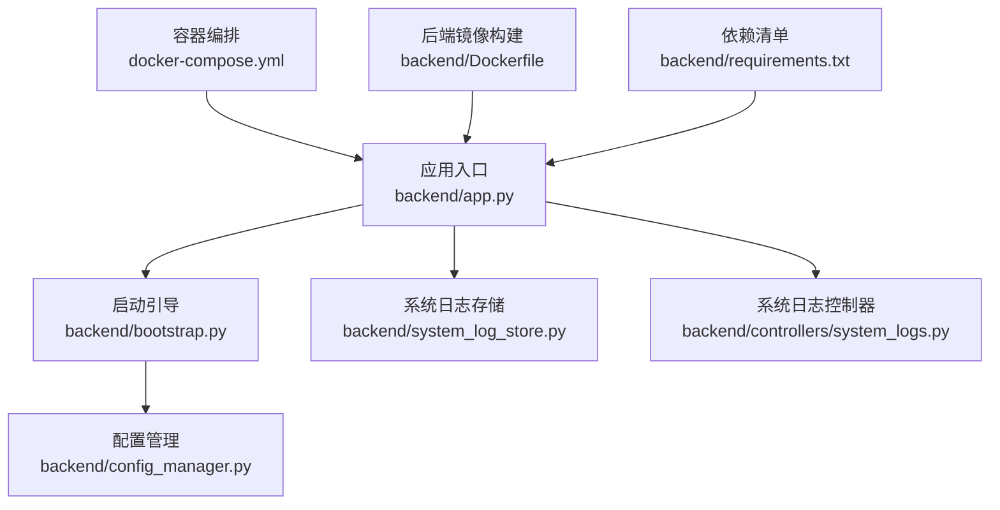
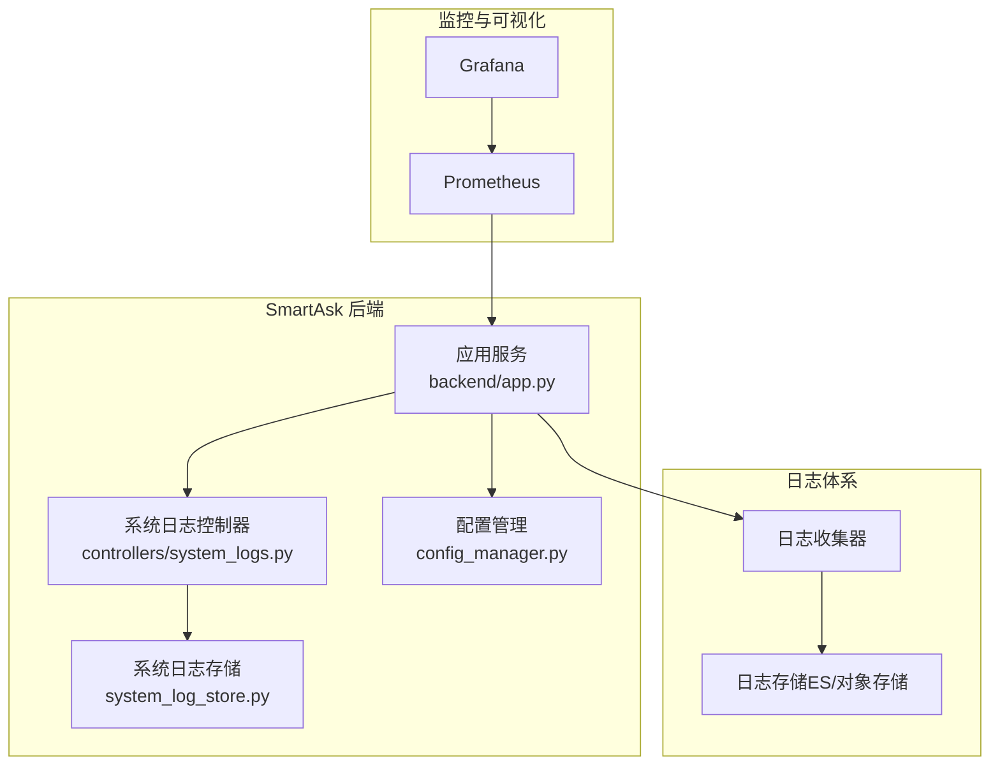
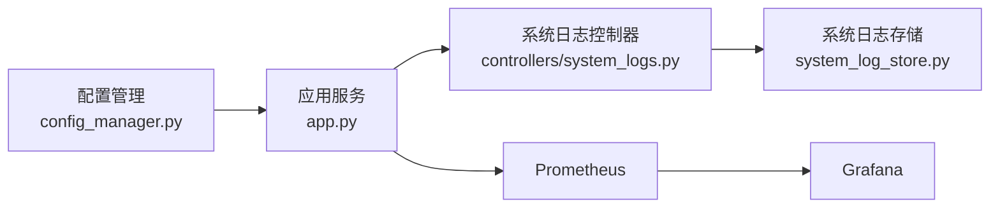

# 监控告警配置

<cite>
**本文引用的文件**   
- [app.py](file://backend/app.py)
- [bootstrap.py](file://backend/bootstrap.py)
- [config_manager.py](file://backend/config_manager.py)
- [system_log_store.py](file://backend/system_log_store.py)
- [controllers/system_logs.py](file://backend/controllers/system_logs.py)
- [docker-compose.yml](file://docker-compose.yml)
- [Dockerfile (backend)](file://backend/Dockerfile)
- [requirements.txt](file://backend/requirements.txt)
- [README.md](file://README.md)
</cite>

## 目录
1. [简介](#简介)
2. [项目结构](#项目结构)
3. [核心组件](#核心组件)
4. [架构总览](#架构总览)
5. [详细组件分析](#详细组件分析)
6. [依赖关系分析](#依赖关系分析)
7. [性能考虑](#性能考虑)
8. [故障排查指南](#故障排查指南)
9. [结论](#结论)
10. [附录](#附录)

## 简介
本指南面向 SmartAsk 智能问数平台的运维与研发人员，提供完整的监控与告警配置方案。内容覆盖：
- 应用性能指标、业务指标与资源使用指标的采集与定义
- 结构化日志格式、日志级别与日志聚合存储的搭建
- 告警规则配置（阈值、级别、通知渠道）
- 健康检查接口实现（服务可用性、依赖状态、自诊断）
- 监控仪表板搭建与可视化
- 告警响应流程与故障升级机制

本指南基于仓库中后端应用、系统日志存储、容器编排与依赖清单等现有实现进行说明，确保落地可操作。

## 项目结构
SmartAsk 后端采用 Python Web 框架，关键监控与日志相关位置如下：
- 应用入口与启动：backend/app.py、backend/bootstrap.py
- 配置管理：backend/config_manager.py
- 系统日志存储与控制器：backend/system_log_store.py、backend/controllers/system_logs.py
- 容器化与运行环境：docker-compose.yml、backend/Dockerfile、backend/requirements.txt
- 项目说明：README.md

图表来源
- [app.py](file://backend/app.py)
- [bootstrap.py](file://backend/bootstrap.py)
- [config_manager.py](file://backend/config_manager.py)
- [system_log_store.py](file://backend/system_log_store.py)
- [controllers/system_logs.py](file://backend/controllers/system_logs.py)
- [docker-compose.yml](file://docker-compose.yml)
- [backend/Dockerfile](file://backend/Dockerfile)
- [requirements.txt](file://backend/requirements.txt)

章节来源
- [README.md](file://README.md)
- [docker-compose.yml](file://docker-compose.yml)
- [backend/Dockerfile](file://backend/Dockerfile)
- [backend/requirements.txt](file://backend/requirements.txt)

## 核心组件
- 应用入口与中间件层：负责注册路由、挂载中间件、暴露健康检查与日志查询接口
- 配置管理：集中化管理监控开关、日志级别、外部依赖地址等
- 系统日志存储：统一写入结构化日志，支持按级别、时间范围、模块检索
- 容器编排：为 Prometheus、Grafana、日志收集组件提供运行环境与数据持久化

章节来源
- [app.py](file://backend/app.py)
- [bootstrap.py](file://backend/bootstrap.py)
- [config_manager.py](file://backend/config_manager.py)
- [system_log_store.py](file://backend/system_log_store.py)
- [controllers/system_logs.py](file://backend/controllers/system_logs.py)

## 架构总览
下图展示 SmartAsk 监控与日志的整体架构：应用通过中间件与控制器输出指标与结构化日志；Prometheus 抓取指标，Grafana 可视化；日志经收集器汇聚至集中存储，供检索与告警联动。

图表来源
- [app.py](file://backend/app.py)
- [controllers/system_logs.py](file://backend/controllers/system_logs.py)
- [system_log_store.py](file://backend/system_log_store.py)
- [config_manager.py](file://backend/config_manager.py)
- [docker-compose.yml](file://docker-compose.yml)

## 详细组件分析

### 应用性能指标与采集
- 指标类别
  - 应用性能：请求耗时、QPS、错误率、连接池状态、任务队列长度
  - 业务指标：问答成功率、SQL 生成成功率、报告生成成功率、用户活跃度
  - 资源使用：CPU、内存、磁盘 I/O、网络 I/O、数据库连接数
- 采集方式
  - 应用内埋点：在请求生命周期中记录耗时、成功/失败计数
  - 运行时指标：进程级 CPU/内存、GC 统计、线程/协程数量
  - 基础设施指标：容器/主机层面的资源使用
- 建议实现要点
  - 使用统一的指标命名规范与标签维度（如 service、env、module、endpoint）
  - 暴露标准导出端点供 Prometheus 抓取
  - 对高基数标签进行限制，避免存储膨胀

章节来源
- [app.py](file://backend/app.py)
- [bootstrap.py](file://backend/bootstrap.py)
- [requirements.txt](file://backend/requirements.txt)

### 业务指标与采集
- 关键业务事件
  - 问答链路：意图识别、路由决策、SQL 生成、执行结果、答案组装
  - 报告链路：报表规格校验、数据源连通性、渲染与导出
  - 权限与组织：RBAC 校验、组织树解析
- 指标设计
  - 成功率 = 成功次数 / 总次数（按模块/接口维度）
  - 时延分位：P50/P90/P99
  - 错误分类：超时、参数错误、权限拒绝、下游异常
- 采集建议
  - 在每个处理阶段打点，形成端到端时序
  - 将业务上下文作为标签（如 dataset_id、report_id），控制基数

章节来源
- [controllers/system_logs.py](file://backend/controllers/system_logs.py)
- [system_log_store.py](file://backend/system_log_store.py)

### 资源使用指标与采集
- 指标项
  - CPU 使用率、内存占用、堆大小、GC 停顿
  - 磁盘读写吞吐、IOPS、延迟
  - 网络带宽、连接数、重传率
  - 数据库连接池活跃/空闲、慢查询数
- 采集建议
  - 容器层面由编排平台或节点代理采集
  - 应用层面暴露运行时指标端点
  - 统一时间戳与采样间隔

章节来源
- [docker-compose.yml](file://docker-compose.yml)
- [backend/Dockerfile](file://backend/Dockerfile)

### 结构化日志格式与级别
- 日志格式
  - JSON 结构化字段：timestamp、level、service、trace_id、span_id、module、message、context
  - 敏感信息脱敏：token、密码、密钥不输出
- 日志级别
  - DEBUG：调试细节
  - INFO：关键业务流程
  - WARN：可恢复异常与降级
  - ERROR：不可恢复错误
  - CRITICAL：系统级致命错误
- 采集与聚合
  - 应用输出到 stdout/stderr，由容器日志驱动收集
  - 统一接入日志收集器并落盘到集中存储

章节来源
- [system_log_store.py](file://backend/system_log_store.py)
- [controllers/system_logs.py](file://backend/controllers/system_logs.py)

### 日志聚合与存储
- 推荐方案
  - 收集器：Filebeat/Fluent Bit/Vector
  - 存储：Elasticsearch/OpenSearch 或对象存储 + 索引
  - 查询与分析：Kibana/Loki/Grafana Loki
- 策略
  - 按天滚动、保留策略、冷热分层
  - 索引模板包含 trace/span/module 等字段
  - 访问控制与审计

章节来源
- [docker-compose.yml](file://docker-compose.yml)
- [backend/Dockerfile](file://backend/Dockerfile)

### 健康检查接口实现
- 健康检查类型
  - 存活探针（liveness）：进程是否存活
  - 就绪探针（readiness）：依赖是否可用、负载是否允许接收流量
  - 自定义健康：数据库连通性、缓存连通性、第三方服务状态
- 实现建议
  - 暴露 /healthz、/readyz、/metrics 等端点
  - 返回明确的状态码与简要描述
  - 结合配置开关动态启用/禁用检查项

章节来源
- [app.py](file://backend/app.py)
- [bootstrap.py](file://backend/bootstrap.py)
- [config_manager.py](file://backend/config_manager.py)

### 告警规则配置
- 指标类告警
  - 错误率超过阈值（如 5 分钟内 > 5%）
  - P99 延迟超过阈值（如 > 2s）
  - 资源使用超阈（CPU > 80%、内存 > 85%）
- 业务类告警
  - 问答成功率下降（环比跌幅 > 10%）
  - SQL 生成失败率上升
  - 报告导出失败率上升
- 日志类告警
  - ERROR/CRITICAL 级别突增
  - 特定错误关键字出现频率异常
- 通知渠道
  - 企业微信/飞书/钉钉机器人
  - 邮件、短信、电话
  - PagerDuty/Opsgenie 等事件平台

章节来源
- [config_manager.py](file://backend/config_manager.py)
- [system_log_store.py](file://backend/system_log_store.py)

### 监控仪表板搭建
- 指标面板
  - 概览：QPS、错误率、P99、资源使用
  - 业务：问答成功率、SQL 生成成功率、报告成功率
  - 依赖：数据库连接、缓存命中率、下游调用延迟
- 日志面板
  - 错误趋势、Top 错误、Trace 追踪
  - 模块维度分布、级别分布
- 交互能力
  - 多时间范围切换、下钻到 Trace
  - 告警联动跳转

章节来源
- [docker-compose.yml](file://docker-compose.yml)
- [app.py](file://backend/app.py)

### 告警响应流程与故障升级
- 响应流程
  - 自动降噪与去重
  - 分级派发（L1/L2/L3）
  - 工单与变更联动
- 升级机制
  - 未响应超时自动升级
  - 影响面扩大自动升级
  - 值班轮转与备份联系人

章节来源
- [config_manager.py](file://backend/config_manager.py)

## 依赖关系分析
- 应用与配置：应用启动读取配置，决定监控开关、日志级别、健康检查项
- 应用与日志：控制器调用日志存储，统一写入结构化日志
- 应用与监控：暴露指标端点供 Prometheus 抓取
- 容器编排：统一管理各组件生命周期与数据卷

图表来源
- [config_manager.py](file://backend/config_manager.py)
- [app.py](file://backend/app.py)
- [controllers/system_logs.py](file://backend/controllers/system_logs.py)
- [system_log_store.py](file://backend/system_log_store.py)
- [docker-compose.yml](file://docker-compose.yml)

章节来源
- [docker-compose.yml](file://docker-compose.yml)
- [backend/requirements.txt](file://backend/requirements.txt)

## 性能考虑
- 指标采样与降采样：在高并发场景下合理设置采样间隔与聚合粒度
- 标签基数控制：避免过多高基数标签导致存储压力
- 日志异步写入：降低对主流程的影响
- 存储分层：热数据快速检索，冷数据归档压缩
- 容量规划：根据 QPS、日志量、保留周期估算存储与计算资源

[本节为通用指导，不直接分析具体文件]

## 故障排查指南
- 常见问题定位
  - 健康检查失败：检查依赖连通性与配置
  - 指标缺失：确认端点暴露与抓取配置
  - 日志丢失：检查收集器与存储连通性
  - 告警风暴：检查阈值与降噪策略
- 排查步骤
  - 查看健康检查与指标端点
  - 检索错误日志与 Trace
  - 核对配置与依赖状态
  - 逐步隔离问题域

章节来源
- [system_log_store.py](file://backend/system_log_store.py)
- [controllers/system_logs.py](file://backend/controllers/system_logs.py)
- [app.py](file://backend/app.py)

## 结论
通过统一的指标采集、结构化日志与集中式存储，配合合理的告警规则与可视化面板，SmartAsk 可实现全链路可观测与高效故障处置。建议在上线前完成指标与日志基线采集，持续优化阈值与降噪策略，保障系统稳定性与可维护性。

[本节为总结性内容，不直接分析具体文件]

## 附录
- 部署参考：容器编排与镜像构建
- 依赖清单：监控与日志相关库版本管理
- 文档参考：项目总体说明与部署手册

章节来源
- [docker-compose.yml](file://docker-compose.yml)
- [backend/Dockerfile](file://backend/Dockerfile)
- [backend/requirements.txt](file://backend/requirements.txt)
- [README.md](file://README.md)