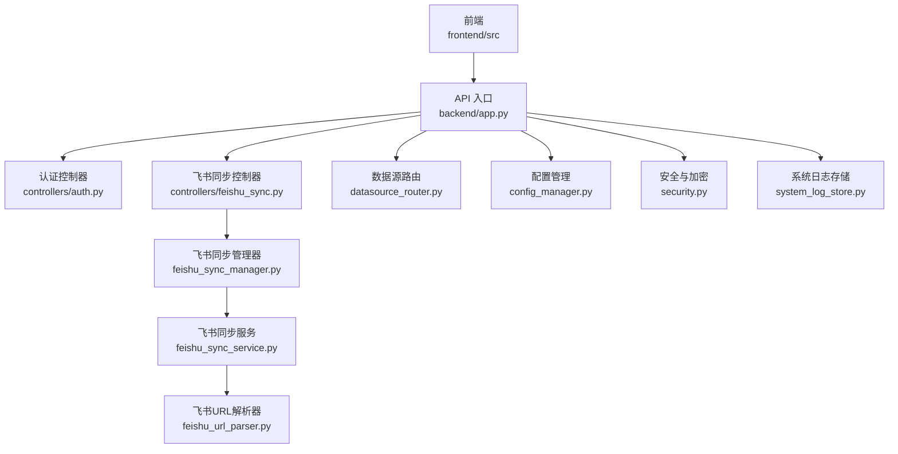
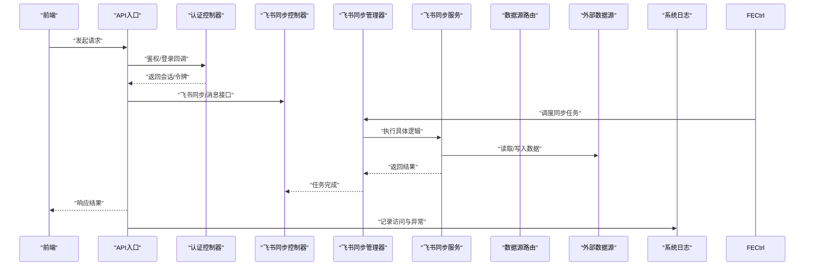
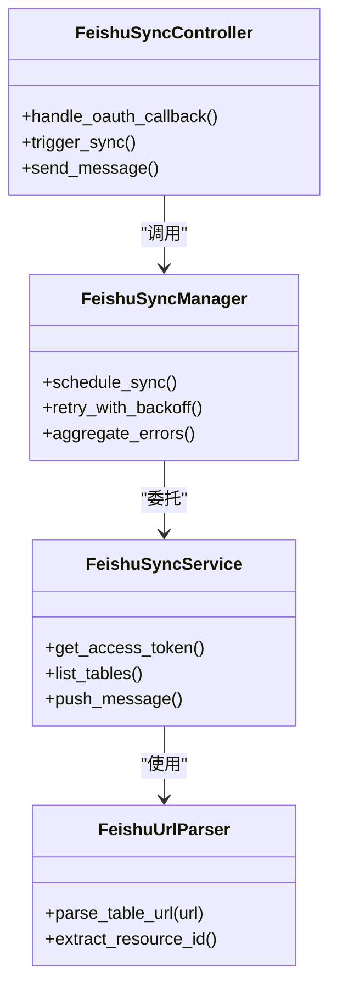
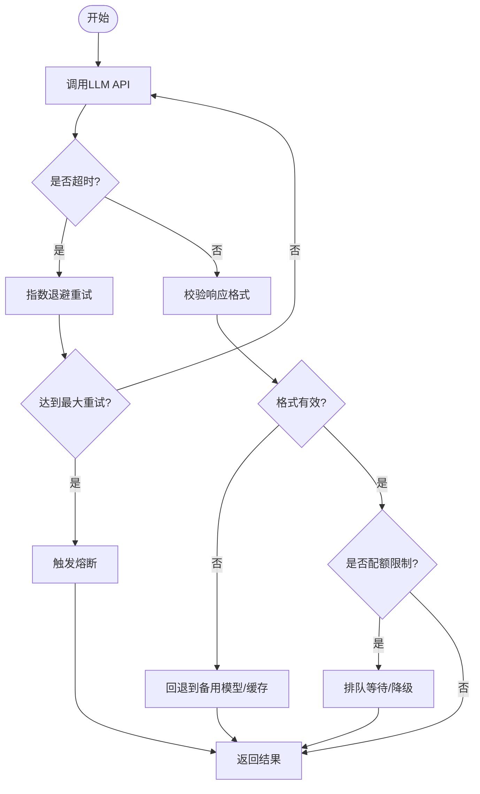
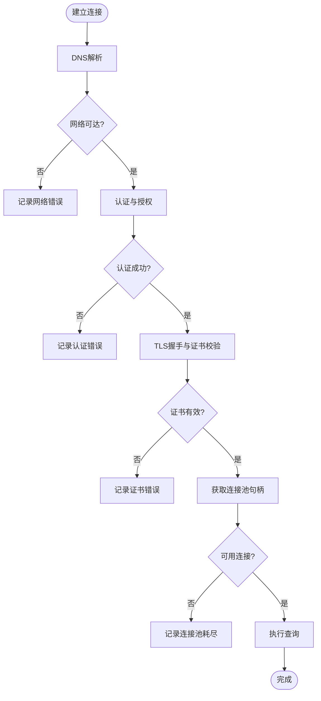
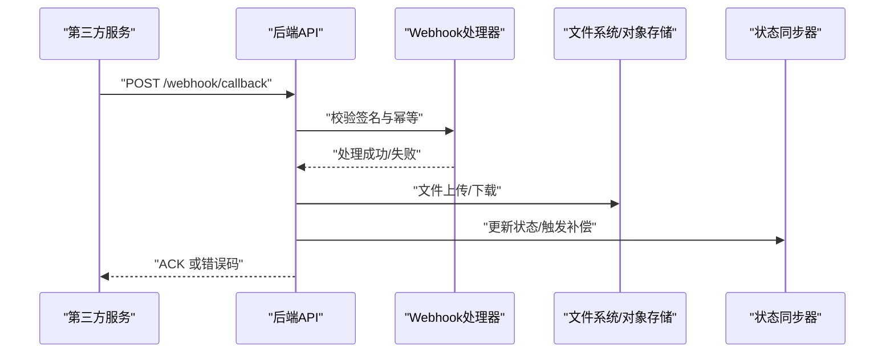
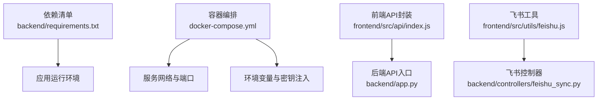

# 系统集成问题

<cite>
**本文引用的文件**   
- [backend/app.py](file://backend/app.py)
- [backend/controllers/auth.py](file://backend/controllers/auth.py)
- [backend/controllers/feishu_sync.py](file://backend/controllers/feishu_sync.py)
- [backend/feishu_sync_manager.py](file://backend/feishu_sync_manager.py)
- [backend/feishu_sync_service.py](file://backend/feishu_sync_service.py)
- [backend/feishu_url_parser.py](file://backend/feishu_url_parser.py)
- [backend/datasource_router.py](file://backend/datasource_router.py)
- [backend/config_manager.py](file://backend/config_manager.py)
- [backend/security.py](file://backend/security.py)
- [backend/system_log_store.py](file://backend/system_log_store.py)
- [frontend/src/api/index.js](file://frontend/src/api/index.js)
- [frontend/src/utils/feishu.js](file://frontend/src/utils/feishu.js)
- [docker-compose.yml](file://docker-compose.yml)
- [backend/requirements.txt](file://backend/requirements.txt)
</cite>

## 目录
1. [简介](#简介)
2. [项目结构](#项目结构)
3. [核心组件](#核心组件)
4. [架构总览](#架构总览)
5. [详细组件分析](#详细组件分析)
6. [依赖关系分析](#依赖关系分析)
7. [性能与稳定性](#性能与稳定性)
8. [故障排查指南](#故障排查指南)
9. [结论](#结论)
10. [附录](#附录)

## 简介
本指南面向 SmartAsk 智能问数平台的系统集成问题排查，覆盖飞书集成、LLM API 集成、外部数据源连接、第三方服务集成（Webhook、文件上传下载、状态同步）等常见故障场景。文档提供从现象到根因的定位方法、关键日志与指标采集点、降级与熔断策略建议，以及监控告警配置思路，帮助运维与研发快速恢复服务并提升系统韧性。

## 项目结构
SmartAsk 后端采用模块化控制器与服务分层设计，前端通过 API 网关与后端交互；飞书相关能力由控制器、管理器和服务层共同实现；外部数据源通过统一路由进行接入；配置与安全模块贯穿各层。

图表来源
- [backend/app.py](file://backend/app.py)
- [backend/controllers/auth.py](file://backend/controllers/auth.py)
- [backend/controllers/feishu_sync.py](file://backend/controllers/feishu_sync.py)
- [backend/feishu_sync_manager.py](file://backend/feishu_sync_manager.py)
- [backend/feishu_sync_service.py](file://backend/feishu_sync_service.py)
- [backend/feishu_url_parser.py](file://backend/feishu_url_parser.py)
- [backend/datasource_router.py](file://backend/datasource_router.py)
- [backend/config_manager.py](file://backend/config_manager.py)
- [backend/security.py](file://backend/security.py)
- [backend/system_log_store.py](file://backend/system_log_store.py)

章节来源
- [backend/app.py](file://backend/app.py)
- [backend/controllers/auth.py](file://backend/controllers/auth.py)
- [backend/controllers/feishu_sync.py](file://backend/controllers/feishu_sync.py)
- [backend/feishu_sync_manager.py](file://backend/feishu_sync_manager.py)
- [backend/feishu_sync_service.py](file://backend/feishu_sync_service.py)
- [backend/feishu_url_parser.py](file://backend/feishu_url_parser.py)
- [backend/datasource_router.py](file://backend/datasource_router.py)
- [backend/config_manager.py](file://backend/config_manager.py)
- [backend/security.py](file://backend/security.py)
- [backend/system_log_store.py](file://backend/system_log_store.py)

## 核心组件
- 认证与授权：负责 OAuth 流程、令牌校验与权限控制。
- 飞书集成：包括 OAuth 回调、表元数据同步、消息推送与链接解析。
- 数据源路由：统一接入多类数据库与数据仓库，处理连接与查询。
- 配置与安全：集中管理环境变量、密钥与敏感信息加解密。
- 系统日志：记录关键操作与异常堆栈，支撑可观测性。

章节来源
- [backend/controllers/auth.py](file://backend/controllers/auth.py)
- [backend/controllers/feishu_sync.py](file://backend/controllers/feishu_sync.py)
- [backend/feishu_sync_manager.py](file://backend/feishu_sync_manager.py)
- [backend/feishu_sync_service.py](file://backend/feishu_sync_service.py)
- [backend/feishu_url_parser.py](file://backend/feishu_url_parser.py)
- [backend/datasource_router.py](file://backend/datasource_router.py)
- [backend/config_manager.py](file://backend/config_manager.py)
- [backend/security.py](file://backend/security.py)
- [backend/system_log_store.py](file://backend/system_log_store.py)

## 架构总览
下图展示请求从前端进入后端，经过认证、业务控制器、飞书同步与数据源路由的调用链，以及日志与配置的贯穿作用。

图表来源
- [backend/app.py](file://backend/app.py)
- [backend/controllers/auth.py](file://backend/controllers/auth.py)
- [backend/controllers/feishu_sync.py](file://backend/controllers/feishu_sync.py)
- [backend/feishu_sync_manager.py](file://backend/feishu_sync_manager.py)
- [backend/feishu_sync_service.py](file://backend/feishu_sync_service.py)
- [backend/datasource_router.py](file://backend/datasource_router.py)
- [backend/system_log_store.py](file://backend/system_log_store.py)

## 详细组件分析

### 飞书集成组件
- 职责划分
  - 控制器：接收前端或外部回调，参数校验，调用管理器。
  - 管理器：编排同步任务、重试与限流、错误聚合。
  - 服务：封装飞书 API 调用、OAuth 流程、消息发送与链接解析。
  - URL 解析器：标准化飞书文档/表格链接，提取资源标识。

图表来源
- [backend/controllers/feishu_sync.py](file://backend/controllers/feishu_sync.py)
- [backend/feishu_sync_manager.py](file://backend/feishu_sync_manager.py)
- [backend/feishu_sync_service.py](file://backend/feishu_sync_service.py)
- [backend/feishu_url_parser.py](file://backend/feishu_url_parser.py)

章节来源
- [backend/controllers/feishu_sync.py](file://backend/controllers/feishu_sync.py)
- [backend/feishu_sync_manager.py](file://backend/feishu_sync_manager.py)
- [backend/feishu_sync_service.py](file://backend/feishu_sync_service.py)
- [backend/feishu_url_parser.py](file://backend/feishu_url_parser.py)

### LLM API 集成组件
- 关注点
  - 模型调用超时与重试：指数退避、最大重试次数、熔断阈值。
  - 响应格式校验：结构化字段缺失、类型不匹配时的回退策略。
  - 配额限制：速率限制、排队与降级为备用模型。
  - 错误分类：网络错误、服务端错误、业务错误，分别处理。

[此图为概念流程图，未直接映射具体源码文件]

### 外部数据源连接组件
- 关注点
  - 连接失败：驱动缺失、凭据错误、端口不可达。
  - 网络超时：DNS 解析失败、防火墙拦截、代理配置错误。
  - SSL 证书：证书过期、不受信任的 CA、主机名不匹配。
  - 连接池耗尽：并发过高、长事务未释放、泄漏检测。

[此图为概念流程图，未直接映射具体源码文件]

### 第三方服务集成（Webhook、文件、状态同步）
- Webhook 回调
  - 签名验证、幂等键、重试与死信队列。
- 文件上传下载
  - 分片上传、断点续传、大小限制、病毒扫描。
- 状态同步
  - 最终一致性、补偿任务、冲突解决。

[此图为概念序列图，未直接映射具体源码文件]

## 依赖关系分析
- 运行时依赖
  - Python 包依赖集中在 requirements.txt，确保版本一致性与安全补丁。
- 容器化部署
  - docker-compose.yml 定义服务间网络、环境变量与卷挂载，影响连接与证书加载。
- 前端依赖
  - frontend/src/api/index.js 与 frontend/src/utils/feishu.js 封装了 HTTP 客户端与飞书工具函数。

图表来源
- [backend/requirements.txt](file://backend/requirements.txt)
- [docker-compose.yml](file://docker-compose.yml)
- [frontend/src/api/index.js](file://frontend/src/api/index.js)
- [frontend/src/utils/feishu.js](file://frontend/src/utils/feishu.js)
- [backend/app.py](file://backend/app.py)
- [backend/controllers/feishu_sync.py](file://backend/controllers/feishu_sync.py)

章节来源
- [backend/requirements.txt](file://backend/requirements.txt)
- [docker-compose.yml](file://docker-compose.yml)
- [frontend/src/api/index.js](file://frontend/src/api/index.js)
- [frontend/src/utils/feishu.js](file://frontend/src/utils/feishu.js)
- [backend/app.py](file://backend/app.py)
- [backend/controllers/feishu_sync.py](file://backend/controllers/feishu_sync.py)

## 性能与稳定性
- 连接池与并发
  - 合理设置连接池大小、超时与空闲回收，避免连接泄漏。
- 重试与熔断
  - 对不稳定外部调用实施指数退避与熔断，防止雪崩。
- 限流与配额
  - 针对第三方 API 的 QPS 限制进行前置限流与排队。
- 缓存与降级
  - 热点数据缓存、只读降级、备用模型切换。

[本节为通用指导，无需特定源码引用]

## 故障排查指南

### 飞书集成问题排查
- OAuth 认证失败
  - 检查回调地址、App ID/Secret、权限范围与域名白名单。
  - 核对前端跳转与后端回调路径一致性。
  - 查看系统日志中的错误码与描述。
- API 调用限制
  - 观察 429/配额不足响应，启用排队与退避重试。
  - 降低批量任务频率，拆分大任务。
- 数据同步延迟
  - 检查同步任务队列堆积、消费者线程数与锁竞争。
  - 评估飞书 API 响应时间与分页效率。
- 消息推送异常
  - 校验消息模板、卡片结构与用户可见性。
  - 确认目标群/用户权限与机器人配置。

章节来源
- [backend/controllers/auth.py](file://backend/controllers/auth.py)
- [backend/controllers/feishu_sync.py](file://backend/controllers/feishu_sync.py)
- [backend/feishu_sync_manager.py](file://backend/feishu_sync_manager.py)
- [backend/feishu_sync_service.py](file://backend/feishu_sync_service.py)
- [backend/system_log_store.py](file://backend/system_log_store.py)

### LLM API 集成问题排查
- 模型调用超时
  - 调整超时阈值与重试策略，区分网络超时与服务端慢响应。
  - 启用熔断以保护下游服务。
- 响应格式异常
  - 增加 JSON Schema 校验与字段默认值回退。
  - 记录原始响应以便调试。
- 配额限制
  - 前置限流、排队与降级至低成本模型。
- 错误重试机制
  - 仅对可重试错误（如 5xx、网络抖动）重试，幂等键保障重复提交安全。

章节来源
- [backend/config_manager.py](file://backend/config_manager.py)
- [backend/security.py](file://backend/security.py)
- [backend/system_log_store.py](file://backend/system_log_store.py)

### 外部数据源连接问题排查
- 数据库连接失败
  - 校验驱动安装、连接串、用户名密码与端口。
  - 检查防火墙与网络安全组规则。
- 网络超时
  - 测试 DNS 解析与连通性，检查代理与 VPN 配置。
- SSL 证书问题
  - 确保证书链完整、CA 受信任且主机名匹配。
  - 在容器中正确挂载证书文件。
- 连接池耗尽
  - 监控活跃连接与等待队列，定位长事务与泄漏。
  - 调整池大小与超时，启用连接健康检查。

章节来源
- [backend/datasource_router.py](file://backend/datasource_router.py)
- [backend/config_manager.py](file://backend/config_manager.py)
- [backend/system_log_store.py](file://backend/system_log_store.py)

### 第三方服务集成问题排查
- Webhook 回调失败
  - 校验签名算法与时钟偏差，启用幂等键与重试。
  - 配置死信队列与人工干预入口。
- 文件上传下载异常
  - 分片大小与并发度调优，校验完整性与病毒扫描。
  - 对象存储桶权限与生命周期策略检查。
- 状态同步问题
  - 引入补偿任务与冲突解决策略，确保最终一致性。

章节来源
- [backend/system_log_store.py](file://backend/system_log_store.py)
- [backend/config_manager.py](file://backend/config_manager.py)

### 监控与告警配置
- 指标采集
  - 暴露关键指标：QPS、错误率、延迟分位、连接池使用率、重试与熔断计数。
- 日志规范
  - 统一日志格式，包含请求ID、用户ID、资源ID与错误码。
- 告警规则
  - 基于阈值与趋势（如错误率突增、延迟飙升）触发告警。
- 可视化看板
  - 聚合服务健康、依赖调用与业务指标，便于快速定位。

[本节为通用指导，无需特定源码引用]

### 降级与熔断策略
- 降级
  - 只读模式、缓存优先、备用模型与简化流程。
- 熔断
  - 按依赖维度隔离，失败率与慢调用比例触发熔断，半开探测恢复。
- 限流
  - 按用户、租户或接口维度限流，保护系统稳定。

[本节为通用指导，无需特定源码引用]

## 结论
通过对飞书集成、LLM API、外部数据源与第三方服务的系统化排查与治理，结合完善的监控告警与降级熔断策略，可显著提升 SmartAsk 平台的稳定性与可维护性。建议在上线前完成端到端演练与压测，持续优化关键路径的性能与可靠性。

## 附录
- 常用命令与脚本
  - 启动/停止服务、备份与恢复脚本位于项目根目录。
- 参考文档
  - 部署手册与培训材料见 docs 目录。

[本节为通用指导，无需特定源码引用]