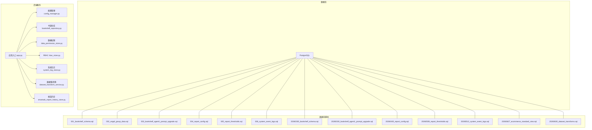
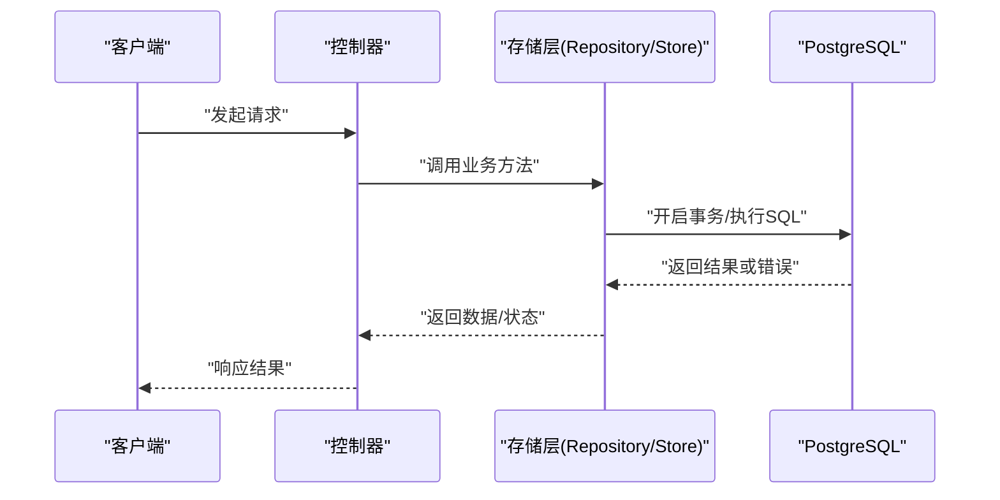
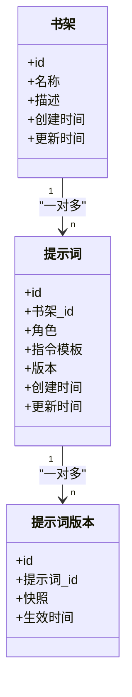
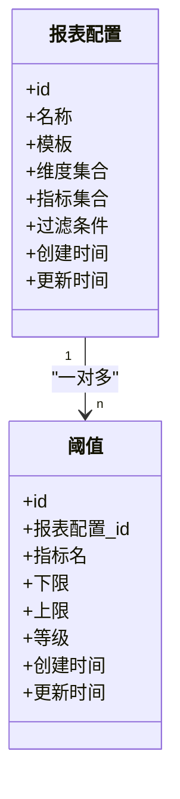
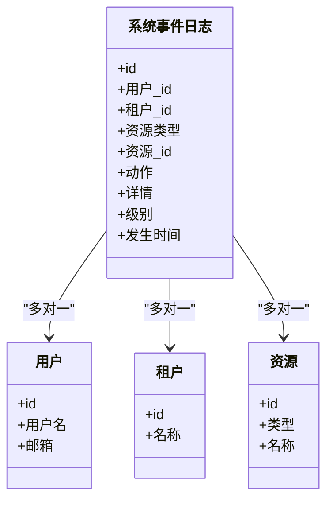
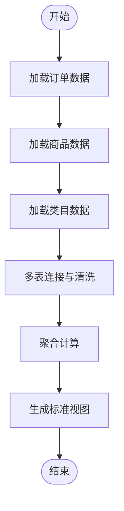
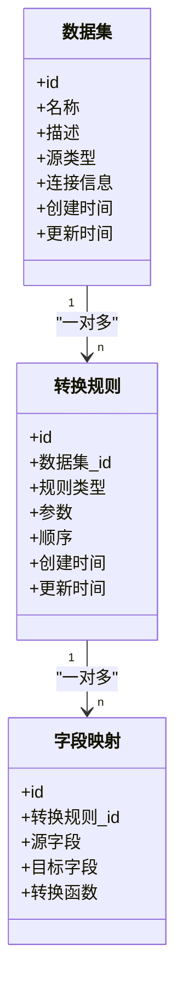
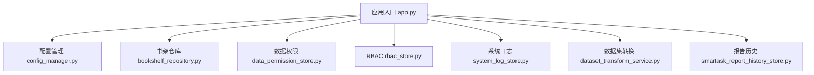

# 关系设计

<cite>
**本文引用的文件**   
- [001_bookshelf_schema.sql](file://docker/postgres/init/001_bookshelf_schema.sql)
- [002_angel_group_data.sql](file://docker/postgres/init/002_angel_group_data.sql)
- [003_bookshelf_agent1_prompt_upgrade.sql](file://docker/postgres/init/003_bookshelf_agent1_prompt_upgrade.sql)
- [004_report_config.sql](file://docker/postgres/init/004_report_config.sql)
- [005_report_thresholds.sql](file://docker/postgres/init/005_report_thresholds.sql)
- [006_system_event_logs.sql](file://docker/postgres/init/006_system_event_logs.sql)
- [20260330_bookshelf_schema.sql](file://backend/migrations/20260330_bookshelf_schema.sql)
- [20260330_bookshelf_agent1_prompt_upgrade.sql](file://backend/migrations/20260330_bookshelf_agent1_prompt_upgrade.sql)
- [20260430_report_config.sql](file://backend/migrations/20260430_report_config.sql)
- [20260509_report_thresholds.sql](file://backend/migrations/20260509_report_thresholds.sql)
- [20260512_system_event_logs.sql](file://backend/migrations/20260512_system_event_logs.sql)
- [20260627_ecommerce_standard_view.sql](file://backend/migrations/20260627_ecommerce_standard_view.sql)
- [20260630_dataset_transforms.sql](file://backend/migrations/20260630_dataset_transforms.sql)
- [app.py](file://backend/app.py)
- [config_manager.py](file://backend/config_manager.py)
- [bookshelf_repository.py](file://backend/bookshelf_repository.py)
- [data_permission_store.py](file://backend/data_permission_store.py)
- [rbac_store.py](file://backend/rbac_store.py)
- [system_log_store.py](file://backend/system_log_store.py)
- [dataset_transform_service.py](file://backend/dataset_transform_service.py)
- [smartask_report_history_store.py](file://backend/smartask_report_history_store.py)
</cite>

## 目录
1. [简介](#简介)
2. [项目结构](#项目结构)
3. [核心组件](#核心组件)
4. [架构总览](#架构总览)
5. [详细组件分析](#详细组件分析)
6. [依赖分析](#依赖分析)
7. [性能考虑](#性能考虑)
8. [故障排查指南](#故障排查指南)
9. [结论](#结论)
10. [附录](#附录)

## 简介
本文件面向 SmartAsk 智能问数平台的数据库关系设计，聚焦以下目标：
- 梳理表与表之间的关联关系（一对一、一对多、多对多）
- 说明外键约束与级联策略的设计原则与实现方式
- 给出复杂查询的连接优化与查询计划分析方法
- 阐述数据一致性保障机制（事务处理、并发控制）
- 提供常见查询模式的 SQL 示例与优化建议
- 解释反范式设计的应用场景与权衡
- 给出数据完整性验证与修复策略

## 项目结构
SmartAsk 的数据库定义主要位于初始化脚本与迁移脚本中，后端通过 Python 存储层访问数据库。关键位置如下：
- 数据库初始化与迁移：docker/postgres/init 与 backend/migrations
- 应用入口与配置：backend/app.py、backend/config_manager.py
- 存储层模块：bookshelf_repository.py、data_permission_store.py、rbac_store.py、system_log_store.py、dataset_transform_service.py、smartask_report_history_store.py

**图表来源** 
- [app.py](file://backend/app.py)
- [config_manager.py](file://backend/config_manager.py)
- [bookshelf_repository.py](file://backend/bookshelf_repository.py)
- [data_permission_store.py](file://backend/data_permission_store.py)
- [rbac_store.py](file://backend/rbac_store.py)
- [system_log_store.py](file://backend/system_log_store.py)
- [dataset_transform_service.py](file://backend/dataset_transform_service.py)
- [smartask_report_history_store.py](file://backend/smartask_report_history_store.py)
- [001_bookshelf_schema.sql](file://docker/postgres/init/001_bookshelf_schema.sql)
- [002_angel_group_data.sql](file://docker/postgres/init/002_angel_group_data.sql)
- [003_bookshelf_agent1_prompt_upgrade.sql](file://docker/postgres/init/003_bookshelf_agent1_prompt_upgrade.sql)
- [004_report_config.sql](file://docker/postgres/init/004_report_config.sql)
- [005_report_thresholds.sql](file://docker/postgres/init/005_report_thresholds.sql)
- [006_system_event_logs.sql](file://docker/postgres/init/006_system_event_logs.sql)
- [20260330_bookshelf_schema.sql](file://backend/migrations/20260330_bookshelf_schema.sql)
- [20260330_bookshelf_agent1_prompt_upgrade.sql](file://backend/migrations/20260330_bookshelf_agent1_prompt_upgrade.sql)
- [20260430_report_config.sql](file://backend/migrations/20260430_report_config.sql)
- [20260509_report_thresholds.sql](file://backend/migrations/20260509_report_thresholds.sql)
- [20260512_system_event_logs.sql](file://backend/migrations/20260512_system_event_logs.sql)
- [20260627_ecommerce_standard_view.sql](file://backend/migrations/20260627_ecommerce_standard_view.sql)
- [20260630_dataset_transforms.sql](file://backend/migrations/20260630_dataset_transforms.sql)

**章节来源**
- [app.py](file://backend/app.py)
- [config_manager.py](file://backend/config_manager.py)
- [001_bookshelf_schema.sql](file://docker/postgres/init/001_bookshelf_schema.sql)
- [20260330_bookshelf_schema.sql](file://backend/migrations/20260330_bookshelf_schema.sql)

## 核心组件
- 书架与提示词：书架实体、Agent1 提示词配置、版本升级脚本
- 报表配置与阈值：报表模板、指标阈值、阈值变更
- 系统事件日志：操作审计、错误追踪
- 电商标准视图：跨域数据聚合视图
- 数据集转换：数据集元数据与转换规则

上述能力由对应的迁移脚本定义表结构与索引，并由后端存储层进行读写。

**章节来源**
- [001_bookshelf_schema.sql](file://docker/postgres/init/001_bookshelf_schema.sql)
- [003_bookshelf_agent1_prompt_upgrade.sql](file://docker/postgres/init/003_bookshelf_agent1_prompt_upgrade.sql)
- [004_report_config.sql](file://docker/postgres/init/004_report_config.sql)
- [005_report_thresholds.sql](file://docker/postgres/init/005_report_thresholds.sql)
- [006_system_event_logs.sql](file://docker/postgres/init/006_system_event_logs.sql)
- [20260627_ecommerce_standard_view.sql](file://backend/migrations/20260627_ecommerce_standard_view.sql)
- [20260630_dataset_transforms.sql](file://backend/migrations/20260630_dataset_transforms.sql)

## 架构总览
SmartAsk 的数据流从控制器到存储层，再到数据库。存储层负责封装 SQL 与事务边界，确保一致性与可观测性。

**图表来源** 
- [app.py](file://backend/app.py)
- [bookshelf_repository.py](file://backend/bookshelf_repository.py)
- [data_permission_store.py](file://backend/data_permission_store.py)
- [rbac_store.py](file://backend/rbac_store.py)
- [system_log_store.py](file://backend/system_log_store.py)
- [dataset_transform_service.py](file://backend/dataset_transform_service.py)
- [smartask_report_history_store.py](file://backend/smartask_report_history_store.py)

## 详细组件分析

### 书架与提示词模型
- 书架实体：用于组织与管理知识库内容
- Agent1 提示词：与书架关联的配置项，支持版本升级与回滚
- 典型关系：书架与提示词为“一对多”；提示词与版本信息为“一对多”

**图表来源** 
- [001_bookshelf_schema.sql](file://docker/postgres/init/001_bookshelf_schema.sql)
- [003_bookshelf_agent1_prompt_upgrade.sql](file://docker/postgres/init/003_bookshelf_agent1_prompt_upgrade.sql)
- [20260330_bookshelf_schema.sql](file://backend/migrations/20260330_bookshelf_schema.sql)
- [20260330_bookshelf_agent1_prompt_upgrade.sql](file://backend/migrations/20260330_bookshelf_agent1_prompt_upgrade.sql)

**章节来源**
- [001_bookshelf_schema.sql](file://docker/postgres/init/001_bookshelf_schema.sql)
- [003_bookshelf_agent1_prompt_upgrade.sql](file://docker/postgres/init/003_bookshelf_agent1_prompt_upgrade.sql)
- [20260330_bookshelf_schema.sql](file://backend/migrations/20260330_bookshelf_schema.sql)
- [20260330_bookshelf_agent1_prompt_upgrade.sql](file://backend/migrations/20260330_bookshelf_agent1_prompt_upgrade.sql)

### 报表配置与阈值
- 报表配置：定义报表模板、维度、指标、过滤条件等
- 阈值：针对指标的预警阈值，支持多级阈值与触发策略
- 典型关系：报表配置与阈值为“一对多”

**图表来源** 
- [004_report_config.sql](file://docker/postgres/init/004_report_config.sql)
- [005_report_thresholds.sql](file://docker/postgres/init/005_report_thresholds.sql)
- [20260430_report_config.sql](file://backend/migrations/20260430_report_config.sql)
- [20260509_report_thresholds.sql](file://backend/migrations/20260509_report_thresholds.sql)

**章节来源**
- [004_report_config.sql](file://docker/postgres/init/004_report_config.sql)
- [005_report_thresholds.sql](file://docker/postgres/init/005_report_thresholds.sql)
- [20260430_report_config.sql](file://backend/migrations/20260430_report_config.sql)
- [20260509_report_thresholds.sql](file://backend/migrations/20260509_report_thresholds.sql)

### 系统事件日志
- 系统事件日志：记录操作审计、错误追踪、告警事件
- 典型关系：日志与用户/租户/资源为“多对一”（通过外键或标识字段关联）

**图表来源** 
- [006_system_event_logs.sql](file://docker/postgres/init/006_system_event_logs.sql)
- [20260512_system_event_logs.sql](file://backend/migrations/20260512_system_event_logs.sql)

**章节来源**
- [006_system_event_logs.sql](file://docker/postgres/init/006_system_event_logs.sql)
- [20260512_system_event_logs.sql](file://backend/migrations/20260512_system_event_logs.sql)

### 电商标准视图
- 电商标准视图：将订单、商品、类目等多源数据标准化为统一视图，便于分析与报表
- 典型关系：视图基于多表连接，属于“多对多”聚合展示

**图表来源** 
- [20260627_ecommerce_standard_view.sql](file://backend/migrations/20260627_ecommerce_standard_view.sql)

**章节来源**
- [20260627_ecommerce_standard_view.sql](file://backend/migrations/20260627_ecommerce_standard_view.sql)

### 数据集转换
- 数据集转换：定义数据集元数据与转换规则，支持动态解析与执行
- 典型关系：数据集与转换规则为“一对多”，规则与字段映射为“一对多”

**图表来源** 
- [20260630_dataset_transforms.sql](file://backend/migrations/20260630_dataset_transforms.sql)

**章节来源**
- [20260630_dataset_transforms.sql](file://backend/migrations/20260630_dataset_transforms.sql)

## 依赖分析
- 存储层模块依赖数据库脚本定义的表结构
- 应用入口与配置管理负责初始化连接池与事务上下文
- 各存储层模块之间通过接口解耦，避免循环依赖

**图表来源** 
- [app.py](file://backend/app.py)
- [config_manager.py](file://backend/config_manager.py)
- [bookshelf_repository.py](file://backend/bookshelf_repository.py)
- [data_permission_store.py](file://backend/data_permission_store.py)
- [rbac_store.py](file://backend/rbac_store.py)
- [system_log_store.py](file://backend/system_log_store.py)
- [dataset_transform_service.py](file://backend/dataset_transform_service.py)
- [smartask_report_history_store.py](file://backend/smartask_report_history_store.py)

**章节来源**
- [app.py](file://backend/app.py)
- [config_manager.py](file://backend/config_manager.py)
- [bookshelf_repository.py](file://backend/bookshelf_repository.py)
- [data_permission_store.py](file://backend/data_permission_store.py)
- [rbac_store.py](file://backend/rbac_store.py)
- [system_log_store.py](file://backend/system_log_store.py)
- [dataset_transform_service.py](file://backend/dataset_transform_service.py)
- [smartask_report_history_store.py](file://backend/smartask_report_history_store.py)

## 性能考虑
- 索引策略：为高频查询字段建立复合索引，减少全表扫描
- 连接优化：优先使用物化视图或中间表缓存聚合结果，降低实时连接开销
- 查询计划分析：使用 EXPLAIN/EXPLAIN ANALYZE 分析执行计划，识别瓶颈
- 分页与限制：合理使用 LIMIT/OFFSET 或游标分页，避免大结果集传输
- 分区与归档：对日志类大表按时间分区，定期归档冷数据

[本节为通用指导，不直接分析具体文件]

## 故障排查指南
- 事务回滚：检查存储层的事务边界与异常捕获逻辑，确保失败时回滚
- 锁等待：监控长事务与锁竞争，必要时拆分写入路径
- 慢查询：结合日志与 EXPLAIN 定位慢查询，优化索引与 SQL
- 数据不一致：通过校验脚本比对源数据与视图结果，发现并修复差异

**章节来源**
- [system_log_store.py](file://backend/system_log_store.py)
- [dataset_transform_service.py](file://backend/dataset_transform_service.py)
- [smartask_report_history_store.py](file://backend/smartask_report_history_store.py)

## 结论
SmartAsk 的关系设计以清晰的实体划分与稳定的外键约束为基础，配合视图与转换规则满足复杂分析需求。通过合理的索引、连接优化与事务控制，系统在性能与一致性之间取得平衡。后续演进应关注数据治理与监控能力的增强。

[本节为总结，不直接分析具体文件]

## 附录

### 常见查询模式与优化建议
- 多表连接查询：优先选择选择性高的列作为连接键，建立合适索引
- 聚合统计：使用窗口函数与 CTE 提升可读性与性能
- 分页查询：采用基于主键的分页替代 OFFSET，提高稳定性
- 视图查询：利用物化视图缓存热点数据，按需刷新

[本节为通用指导，不直接分析具体文件]

### 反范式设计的应用与权衡
- 应用场景：报表宽表、审计日志冗余字段、缓存命中优化
- 权衡考虑：写入复杂度增加、一致性维护成本上升、存储空间增长
- 实践建议：在只读或低频写场景使用，配合异步同步与校验任务

[本节为通用指导，不直接分析具体文件]

### 数据完整性验证与修复策略
- 约束校验：启用外键与唯一约束，防止脏数据进入
- 校验脚本：定期运行一致性检查，输出差异报告
- 修复流程：定位问题数据，制定修复脚本，灰度发布与回滚预案

[本节为通用指导，不直接分析具体文件]