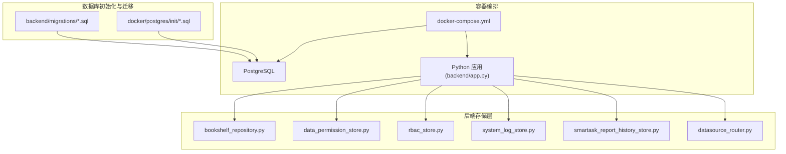
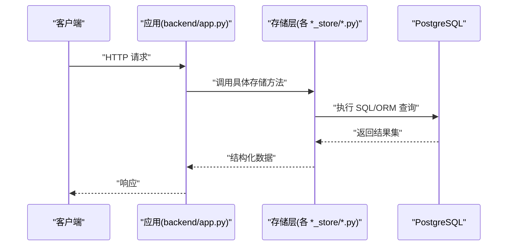
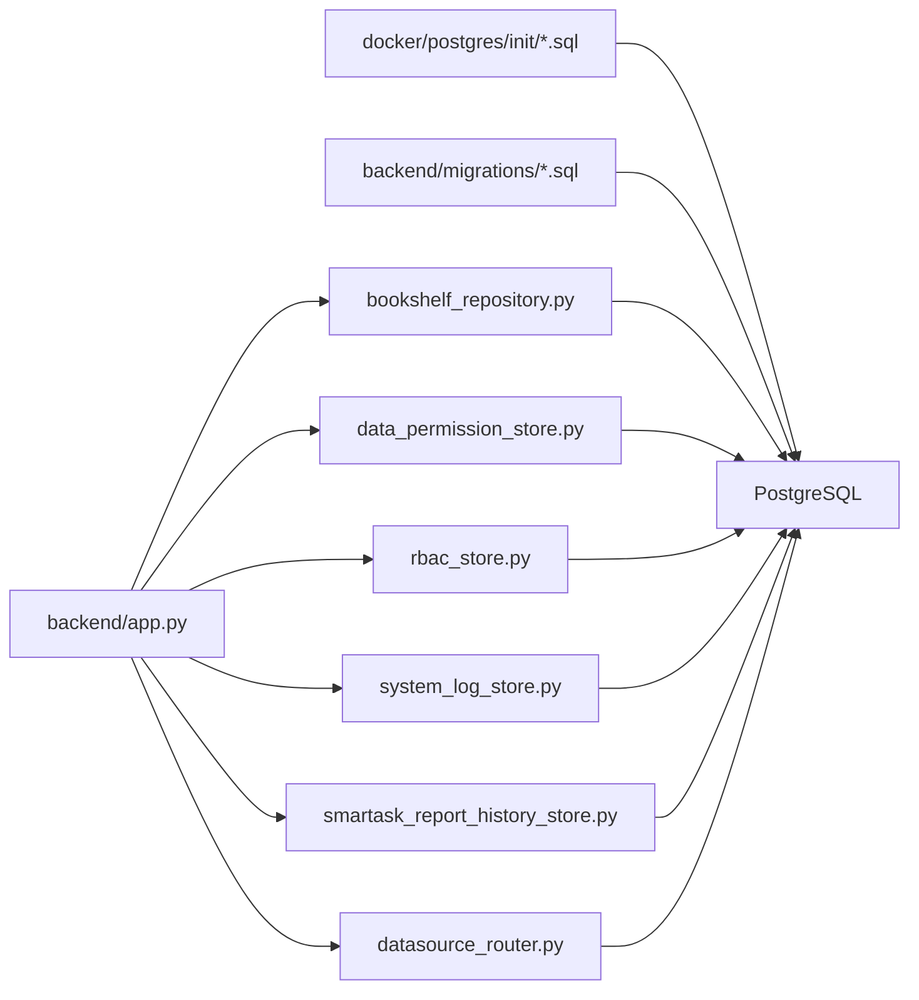

# 性能优化

<cite>
**本文档引用的文件**   
- [docker-compose.yml](file://docker-compose.yml)
- [backend/app.py](file://backend/app.py)
- [backend/config_manager.py](file://backend/config_manager.py)
- [backend/requirements.txt](file://backend/requirements.txt)
- [docker/postgres/init/001_bookshelf_schema.sql](file://docker/postgres/init/001_bookshelf_schema.sql)
- [docker/postgres/init/002_angel_group_data.sql](file://docker/postgres/init/002_angel_group_data.sql)
- [docker/postgres/init/003_bookshelf_agent1_prompt_upgrade.sql](file://docker/postgres/init/003_bookshelf_agent1_prompt_upgrade.sql)
- [docker/postgres/init/004_report_config.sql](file://docker/postgres/init/004_report_config.sql)
- [docker/postgres/init/005_report_thresholds.sql](file://docker/postgres/init/005_report_thresholds.sql)
- [docker/postgres/init/006_system_event_logs.sql](file://docker/postgres/init/006_system_event_logs.sql)
- [backend/migrations/20260330_bookshelf_schema.sql](file://backend/migrations/20260330_bookshelf_schema.sql)
- [backend/migrations/20260330_bookshelf_agent1_prompt_upgrade.sql](file://backend/migrations/20260330_bookshelf_agent1_prompt_upgrade.sql)
- [backend/migrations/20260430_report_config.sql](file://backend/migrations/20260430_report_config.sql)
- [backend/migrations/20260509_report_thresholds.sql](file://backend/migrations/20260509_report_thresholds.sql)
- [backend/migrations/20260512_system_event_logs.sql](file://backend/migrations/20260512_system_event_logs.sql)
- [backend/migrations/20260627_ecommerce_standard_view.sql](file://backend/migrations/20260627_ecommerce_standard_view.sql)
- [backend/migrations/20260630_dataset_transforms.sql](file://backend/migrations/20260630_dataset_transforms.sql)
- [backend/bookshelf_repository.py](file://backend/bookshelf_repository.py)
- [backend/data_permission_store.py](file://backend/data_permission_store.py)
- [backend/rbac_store.py](file://backend/rbac_store.py)
- [backend/system_log_store.py](file://backend/system_log_store.py)
- [backend/smartask_report_history_store.py](file://backend/smartask_report_history_store.py)
- [backend/datasource_router.py](file://backend/datasource_router.py)
- [backend/feature_flags.py](file://backend/feature_flags.py)
</cite>

## 目录
1. [引言](#引言)
2. [项目结构](#项目结构)
3. [核心组件](#核心组件)
4. [架构总览](#架构总览)
5. [详细组件分析](#详细组件分析)
6. [依赖关系分析](#依赖关系分析)
7. [性能考虑](#性能考虑)
8. [故障排查指南](#故障排查指南)
9. [结论](#结论)
10. [附录](#附录)

## 引言
本文件面向 SmartAsk 智能问数平台的数据库性能优化，聚焦 PostgreSQL 场景。内容涵盖索引策略设计（单列、复合、部分、函数索引）、查询优化（执行计划分析、慢查询识别与 SQL 调优）、连接池配置、内存管理与缓存策略、大数据量下的分区表与分库分表方案、监控指标与瓶颈诊断方法、批量操作与事务优化、并发控制策略，以及 PostgreSQL 特定参数调优建议。文档同时结合仓库中的数据库初始化脚本、迁移脚本与后端存储层实现，给出可落地的优化路径。

## 项目结构
SmartAsk 后端基于 Python 应用，通过 Docker Compose 编排服务，PostgreSQL 作为主数据源。数据库结构与变更由初始化脚本与迁移脚本共同维护；业务侧通过若干“store/repository”模块访问数据库。

图表来源
- [docker-compose.yml](file://docker-compose.yml)
- [backend/app.py](file://backend/app.py)
- [docker/postgres/init/001_bookshelf_schema.sql](file://docker/postgres/init/001_bookshelf_schema.sql)
- [backend/migrations/20260330_bookshelf_schema.sql](file://backend/migrations/20260330_bookshelf_schema.sql)

章节来源
- [docker-compose.yml](file://docker-compose.yml)
- [backend/app.py](file://backend/app.py)
- [backend/requirements.txt](file://backend/requirements.txt)

## 核心组件
- 数据库初始化与迁移：通过 docker/postgres/init 与 backend/migrations 两套 SQL 脚本管理 schema 与数据。
- 后端存储层：bookshelf_repository、data_permission_store、rbac_store、system_log_store、smartask_report_history_store 等模块封装对数据库的读写。
- 数据源路由：datasource_router 负责多数据源或动态路由能力。
- 配置与特性开关：config_manager、feature_flags 影响运行时行为与查询路径。

章节来源
- [docker/postgres/init/001_bookshelf_schema.sql](file://docker/postgres/init/001_bookshelf_schema.sql)
- [backend/migrations/20260330_bookshelf_schema.sql](file://backend/migrations/20260330_bookshelf_schema.sql)
- [backend/bookshelf_repository.py](file://backend/bookshelf_repository.py)
- [backend/data_permission_store.py](file://backend/data_permission_store.py)
- [backend/rbac_store.py](file://backend/rbac_store.py)
- [backend/system_log_store.py](file://backend/system_log_store.py)
- [backend/smartask_report_history_store.py](file://backend/smartask_report_history_store.py)
- [backend/datasource_router.py](file://backend/datasource_router.py)
- [backend/config_manager.py](file://backend/config_manager.py)
- [backend/feature_flags.py](file://backend/feature_flags.py)

## 架构总览
下图展示从请求到数据库的关键链路，突出存储层与数据库交互点，便于后续定位性能瓶颈与优化切入点。

图表来源
- [backend/app.py](file://backend/app.py)
- [backend/bookshelf_repository.py](file://backend/bookshelf_repository.py)
- [backend/data_permission_store.py](file://backend/data_permission_store.py)
- [backend/rbac_store.py](file://backend/rbac_store.py)
- [backend/system_log_store.py](file://backend/system_log_store.py)
- [backend/smartask_report_history_store.py](file://backend/smartask_report_history_store.py)

## 详细组件分析

### 索引策略设计
- 单列索引
  - 适用场景：高频等值过滤、排序键、唯一约束字段（如用户ID、租户ID、状态码）。
  - 建议：优先为外键与常用 WHERE 条件建立 B-tree 索引；避免在低基数字段上建过多单列索引。
- 复合索引
  - 适用场景：多列联合过滤、排序与覆盖查询。
  - 建议：遵循最左前缀原则，将选择性高的列放在前面；尽量让索引覆盖 SELECT 所需列以减少回表。
- 部分索引
  - 适用场景：仅对满足特定条件的子集加速（如未删除记录、活跃会话、待处理任务）。
  - 建议：使用 WHERE 子句限定范围，显著降低索引体积并提升扫描效率。
- 函数索引
  - 适用场景：对表达式进行过滤或排序（如大小写不敏感搜索、日期截断、JSON 字段提取）。
  - 建议：谨慎使用，确保表达式稳定且必要；注意更新开销与统计信息准确性。

章节来源
- [docker/postgres/init/001_bookshelf_schema.sql](file://docker/postgres/init/001_bookshelf_schema.sql)
- [backend/migrations/20260330_bookshelf_schema.sql](file://backend/migrations/20260330_bookshelf_schema.sql)
- [backend/migrations/20260627_ecommerce_standard_view.sql](file://backend/migrations/20260627_ecommerce_standard_view.sql)

### 查询优化技术
- 执行计划分析
  - 使用 EXPLAIN/EXPLAIN ANALYZE 观察全表扫描、索引扫描、嵌套循环、哈希连接等。
  - 关注 Seq Scan、Index Scan、Bitmap Heap Scan、Sort、Hash Join、Merge Join 的使用与成本。
- 慢查询识别
  - 启用 log_min_duration_statement 与 pg_stat_statements，收集慢查询与热点语句。
  - 定期分析 top 耗时语句，结合执行计划定位问题。
- SQL 调优
  - 避免 N+1 查询，使用 JOIN 与 IN 列表替代多次往返。
  - 合理使用 LIMIT/OFFSET 与游标分页，避免深分页。
  - 减少不必要的函数包裹导致索引失效，必要时改用函数索引。
  - 调整统计信息与直方图，保证规划器选择最优计划。

章节来源
- [backend/bookshelf_repository.py](file://backend/bookshelf_repository.py)
- [backend/data_permission_store.py](file://backend/data_permission_store.py)
- [backend/rbac_store.py](file://backend/rbac_store.py)
- [backend/system_log_store.py](file://backend/system_log_store.py)
- [backend/smartask_report_history_store.py](file://backend/smartask_report_history_store.py)

### 连接池配置、内存管理与缓存策略
- 连接池
  - 合理设置最大连接数与最小空闲连接，避免连接风暴与频繁创建销毁。
  - 针对长事务与短查询混合场景，采用连接池隔离或专用池。
- 内存管理
  - 调整 shared_buffers、work_mem、maintenance_work_mem、effective_cache_size 等关键参数。
  - 根据工作负载类型（OLTP/OLAP）差异化配置，避免过度分配导致交换。
- 缓存策略
  - 应用层缓存热点查询结果（Redis/Memcached），设置合理的过期与失效策略。
  - 数据库层面利用物化视图、临时表与窗口函数减少重复计算。

章节来源
- [backend/config_manager.py](file://backend/config_manager.py)
- [backend/feature_flags.py](file://backend/feature_flags.py)
- [backend/datasource_router.py](file://backend/datasource_router.py)

### 大数据量场景下的分区表与分库分表
- 分区表
  - 按时间（月/季/年）或业务维度（租户/组织）进行范围或列表分区。
  - 配合部分索引与并行查询，显著提升大表扫描与聚合性能。
- 分库分表
  - 水平拆分按租户或业务域，跨库路由通过 datasource_router 实现。
  - 引入一致性协议与分布式事务（必要时），保障跨分片数据一致性。

章节来源
- [backend/datasource_router.py](file://backend/datasource_router.py)
- [docker/postgres/init/001_bookshelf_schema.sql](file://docker/postgres/init/001_bookshelf_schema.sql)

### 批量操作优化、事务优化与并发控制
- 批量操作
  - 使用批量插入/更新（executemany 或 COPY），减少网络往返与锁竞争。
  - 分批提交，控制每批大小以避免长事务与日志膨胀。
- 事务优化
  - 缩短事务生命周期，避免在事务中进行外部 IO 或长耗时计算。
  - 合理设置隔离级别，必要时使用快照读减少锁冲突。
- 并发控制
  - 使用行级锁与乐观锁（版本号）避免写冲突。
  - 限制并发度与限流，保护数据库与下游系统。

章节来源
- [backend/system_log_store.py](file://backend/system_log_store.py)
- [backend/smartask_report_history_store.py](file://backend/smartask_report_history_store.py)
- [backend/rbac_store.py](file://backend/rbac_store.py)

### PostgreSQL 特定优化技术与参数调优
- 规划器与统计
  - 定期 VACUUM/ANALYZE，保持统计信息准确；必要时调整 table/column 级别的 statistics target。
  - 使用 pg_hint_plan 或提示词引导规划器选择更优计划（谨慎使用）。
- I/O 与 WAL
  - 调整 checkpoint_completion_target、wal_buffers、max_wal_size，平衡写入吞吐与恢复时间。
  - 使用 SSD 与合适的 RAID，提升随机读写性能。
- 扩展与工具
  - 启用 pg_stat_statements 进行慢查询与热点分析。
  - 使用 pg_cron 定时维护任务（VACUUM、统计更新、归档）。

章节来源
- [docker/postgres/init/001_bookshelf_schema.sql](file://docker/postgres/init/001_bookshelf_schema.sql)
- [backend/migrations/20260330_bookshelf_schema.sql](file://backend/migrations/20260330_bookshelf_schema.sql)
- [backend/migrations/20260627_ecommerce_standard_view.sql](file://backend/migrations/20260627_ecommerce_standard_view.sql)

## 依赖关系分析
后端存储模块与数据库脚本之间的依赖关系如下：

图表来源
- [backend/app.py](file://backend/app.py)
- [backend/bookshelf_repository.py](file://backend/bookshelf_repository.py)
- [backend/data_permission_store.py](file://backend/data_permission_store.py)
- [backend/rbac_store.py](file://backend/rbac_store.py)
- [backend/system_log_store.py](file://backend/system_log_store.py)
- [backend/smartask_report_history_store.py](file://backend/smartask_report_history_store.py)
- [backend/datasource_router.py](file://backend/datasource_router.py)
- [docker/postgres/init/001_bookshelf_schema.sql](file://docker/postgres/init/001_bookshelf_schema.sql)
- [backend/migrations/20260330_bookshelf_schema.sql](file://backend/migrations/20260330_bookshelf_schema.sql)

章节来源
- [backend/app.py](file://backend/app.py)
- [backend/requirements.txt](file://backend/requirements.txt)

## 性能考虑
- 索引与查询
  - 以执行计划为导向，优先消除全表扫描与高成本排序/连接。
  - 针对热点查询建立覆盖索引，减少回表与额外 IO。
- 连接与内存
  - 连接池上限与 work_mem 需根据 CPU/内存资源与并发模型匹配。
  - 避免过大的临时表与排序，必要时增加 work_mem 或改写 SQL。
- 分区与分片
  - 大表按时间或租户分区，结合并行查询与部分索引提升吞吐。
  - 分库分表需评估一致性、路由复杂度与运维成本。
- 监控与诊断
  - 持续采集慢查询、锁等待、I/O 延迟、缓冲命中率等指标。
  - 建立告警阈值与自动化巡检，提前发现退化趋势。

[本节为通用指导，无需列出章节来源]

## 故障排查指南
- 慢查询定位
  - 启用 pg_stat_statements，导出 top 耗时语句，结合 EXPLAIN ANALYZE 分析。
  - 检查是否出现 Seq Scan、Nested Loop、Sort 等高成本节点。
- 锁与并发
  - 使用 pg_locks、pg_stat_activity 查看阻塞链与长事务。
  - 优化事务边界与锁粒度，避免长时间持有行锁。
- I/O 与内存
  - 观察 iostat、vmstat 与 PostgreSQL 日志，判断是否存在磁盘瓶颈或内存不足。
  - 调整 shared_buffers、effective_cache_size、checkpoint 相关参数。
- 数据一致性与迁移
  - 迁移脚本幂等执行，失败回滚；校验统计信息与索引完整性。

章节来源
- [backend/system_log_store.py](file://backend/system_log_store.py)
- [backend/smartask_report_history_store.py](file://backend/smartask_report_history_store.py)
- [backend/rbac_store.py](file://backend/rbac_store.py)
- [backend/migrations/20260512_system_event_logs.sql](file://backend/migrations/20260512_system_event_logs.sql)

## 结论
通过对索引策略、查询优化、连接池与内存管理、分区与分片、监控与诊断、批量与事务优化、并发控制以及 PostgreSQL 参数调优的系统性改进，SmartAsk 可在高并发与大数据量场景下获得稳定的性能表现。建议以执行计划与监控指标为依据，持续迭代优化，确保系统在增长过程中保持高效与可靠。

[本节为总结，无需列出章节来源]

## 附录
- 常用命令与脚本
  - EXPLAIN/EXPLAIN ANALYZE 分析执行计划。
  - pg_stat_statements 导出慢查询报告。
  - VACUUM/ANALYZE 维护统计信息与索引健康。
- 参考脚本位置
  - 初始化脚本：docker/postgres/init/*.sql
  - 迁移脚本：backend/migrations/*.sql
  - 存储层实现：backend/*_store.py / bookshelf_repository.py

章节来源
- [docker/postgres/init/001_bookshelf_schema.sql](file://docker/postgres/init/001_bookshelf_schema.sql)
- [backend/migrations/20260330_bookshelf_schema.sql](file://backend/migrations/20260330_bookshelf_schema.sql)
- [backend/migrations/20260627_ecommerce_standard_view.sql](file://backend/migrations/20260627_ecommerce_standard_view.sql)
- [backend/bookshelf_repository.py](file://backend/bookshelf_repository.py)
- [backend/system_log_store.py](file://backend/system_log_store.py)
- [backend/smartask_report_history_store.py](file://backend/smartask_report_history_store.py)