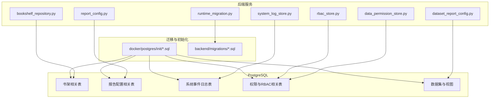
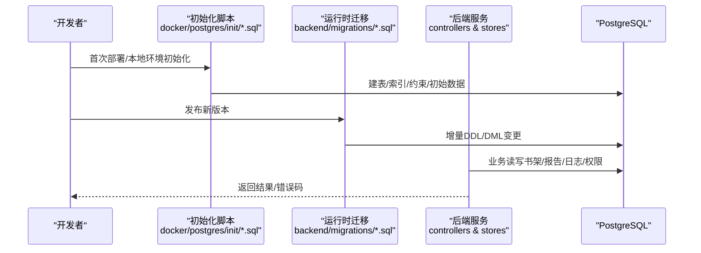
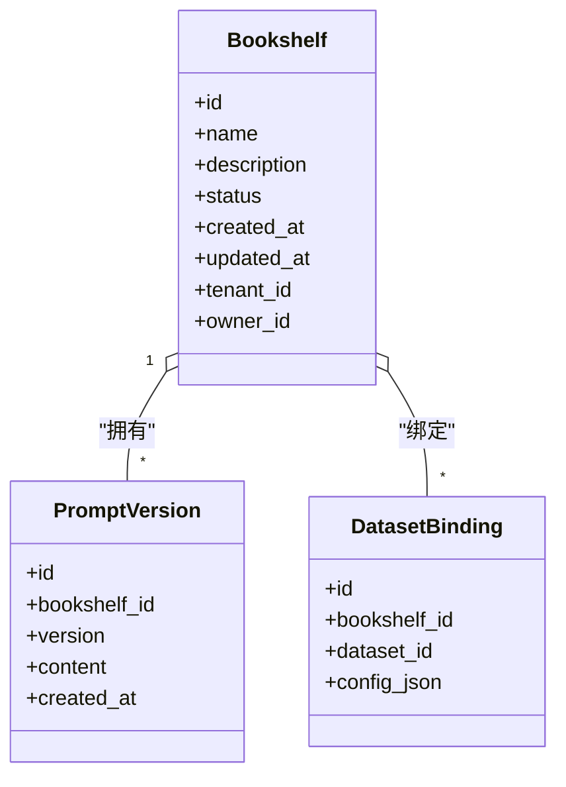
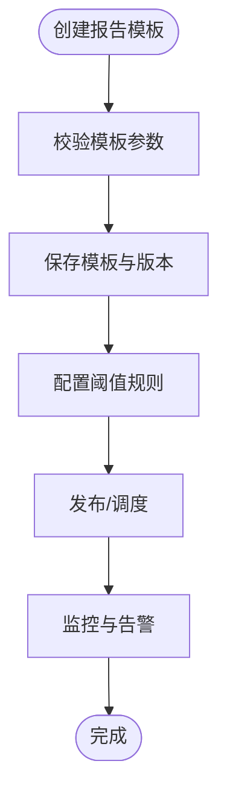
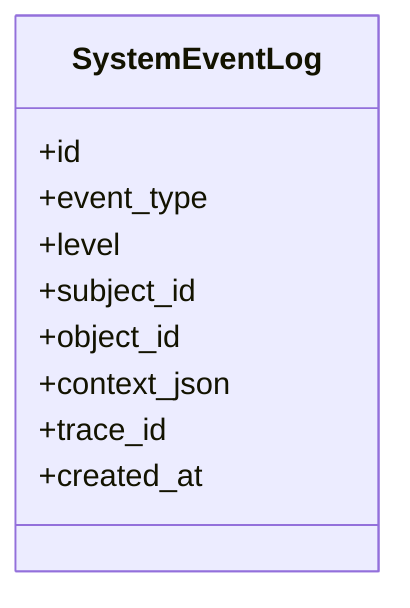
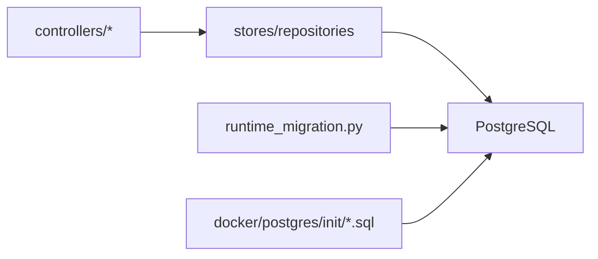

# 数据库设计

<cite>
**本文档引用的文件**
- [docker/postgres/init/001_bookshelf_schema.sql](file://docker/postgres/init/001_bookshelf_schema.sql)
- [docker/postgres/init/004_report_config.sql](file://docker/postgres/init/004_report_config.sql)
- [docker/postgres/init/005_report_thresholds.sql](file://docker/postgres/init/005_report_thresholds.sql)
- [docker/postgres/init/006_system_event_logs.sql](file://docker/postgres/init/006_system_event_logs.sql)
- [backend/migrations/20260330_bookshelf_schema.sql](file://backend/migrations/20260330_bookshelf_schema.sql)
- [backend/migrations/20260330_bookshelf_agent1_prompt_upgrade.sql](file://backend/migrations/20260330_bookshelf_agent1_prompt_upgrade.sql)
- [backend/migrations/20260430_report_config.sql](file://backend/migrations/20260430_report_config.sql)
- [backend/migrations/20260509_report_thresholds.sql](file://backend/migrations/20260509_report_thresholds.sql)
- [backend/migrations/20260512_system_event_logs.sql](file://backend/migrations/20260512_system_event_logs.sql)
- [backend/migrations/20260627_ecommerce_standard_view.sql](file://backend/migrations/20260627_ecommerce_standard_view.sql)
- [backend/migrations/20260630_dataset_transforms.sql](file://backend/migrations/20260630_dataset_transforms.sql)
- [backend/bookshelf_repository.py](file://backend/bookshelf_repository.py)
- [backend/controllers/report_config.py](file://backend/controllers/report_config.py)
- [backend/system_log_store.py](file://backend/system_log_store.py)
- [backend/data_permission_store.py](file://backend/data_permission_store.py)
- [backend/rbac_store.py](file://backend/rbac_store.py)
- [backend/dataset_report_config.py](file://backend/dataset_report_config.py)
- [backend/runtime_migration.py](file://backend/runtime_migration.py)
- [scripts/backup_all.py](file://scripts/backup_all.py)
- [restore.sh](file://restore.sh)
- [backup.sh](file://backup.sh)
</cite>

## 目录
1. [简介](#简介)
2. [项目结构](#项目结构)
3. [核心组件](#核心组件)
4. [架构总览](#架构总览)
5. [详细组件分析](#详细组件分析)
6. [依赖关系分析](#依赖关系分析)
7. [性能考虑](#性能考虑)
8. [故障排查指南](#故障排查指南)
9. [结论](#结论)
10. [附录](#附录)

## 简介
本文件面向 SmartAsk 智能问数平台的 PostgreSQL 数据库，提供从实体关系、表结构设计、索引与约束、迁移策略到数据访问模式与运维保障的完整设计说明。文档聚焦以下目标：
- 明确书架、报告配置、系统日志、权限等核心业务表的字段定义、数据类型与业务含义
- 解释主外键关联、完整性约束与查询优化考量
- 给出迁移版本管理、增量更新与一致性保证方案
- 提供连接池、事务、批量操作与性能调优最佳实践
- 制定备份恢复策略、监控指标与故障排查指南
- 附带 SQL 示例与查询优化建议（以路径引用为主，避免直接粘贴代码）

## 项目结构
SmartAsk 的数据库设计与演进通过两类资产协同维护：
- 初始化脚本：位于 docker/postgres/init，用于容器化环境快速建库与初始数据
- 运行时迁移：位于 backend/migrations，用于生产环境的增量升级与回滚

此外，后端通过 Python 存储层（store/repository）与控制器（controllers）对数据库进行读写，并通过 runtime_migration 驱动迁移执行。



图表来源
- [docker/postgres/init/001_bookshelf_schema.sql](file://docker/postgres/init/001_bookshelf_schema.sql)
- [docker/postgres/init/004_report_config.sql](file://docker/postgres/init/004_report_config.sql)
- [docker/postgres/init/005_report_thresholds.sql](file://docker/postgres/init/005_report_thresholds.sql)
- [docker/postgres/init/006_system_event_logs.sql](file://docker/postgres/init/006_system_event_logs.sql)
- [backend/migrations/20260330_bookshelf_schema.sql](file://backend/migrations/20260330_bookshelf_schema.sql)
- [backend/migrations/20260430_report_config.sql](file://backend/migrations/20260430_report_config.sql)
- [backend/migrations/20260509_report_thresholds.sql](file://backend/migrations/20260509_report_thresholds.sql)
- [backend/migrations/20260512_system_event_logs.sql](file://backend/migrations/20260512_system_event_logs.sql)
- [backend/migrations/20260627_ecommerce_standard_view.sql](file://backend/migrations/20260627_ecommerce_standard_view.sql)
- [backend/migrations/20260630_dataset_transforms.sql](file://backend/migrations/20260630_dataset_transforms.sql)

章节来源
- [docker/postgres/init/001_bookshelf_schema.sql](file://docker/postgres/init/001_bookshelf_schema.sql)
- [docker/postgres/init/004_report_config.sql](file://docker/postgres/init/004_report_config.sql)
- [docker/postgres/init/005_report_thresholds.sql](file://docker/postgres/init/005_report_thresholds.sql)
- [docker/postgres/init/006_system_event_logs.sql](file://docker/postgres/init/006_system_event_logs.sql)
- [backend/migrations/20260330_bookshelf_schema.sql](file://backend/migrations/20260330_bookshelf_schema.sql)
- [backend/migrations/20260430_report_config.sql](file://backend/migrations/20260430_report_config.sql)
- [backend/migrations/20260509_report_thresholds.sql](file://backend/migrations/20260509_report_thresholds.sql)
- [backend/migrations/20260512_system_event_logs.sql](file://backend/migrations/20260512_system_event_logs.sql)
- [backend/migrations/20260627_ecommerce_standard_view.sql](file://backend/migrations/20260627_ecommerce_standard_view.sql)
- [backend/migrations/20260630_dataset_transforms.sql](file://backend/migrations/20260630_dataset_transforms.sql)

## 核心组件
- 书架模块：承载用户自定义的数据集、提示词与 Agent 配置，支撑“智能问数”的核心能力
- 报告配置模块：定义报表模板、阈值、渲染参数与发布策略
- 系统日志模块：记录系统事件、审计轨迹与排障信息
- 权限与 RBAC：组织、角色、用户与资源级权限控制
- 数据集与视图：标准视图与转换逻辑，支撑跨数据集分析与聚合

章节来源
- [backend/bookshelf_repository.py](file://backend/bookshelf_repository.py)
- [backend/controllers/report_config.py](file://backend/controllers/report_config.py)
- [backend/system_log_store.py](file://backend/system_log_store.py)
- [backend/data_permission_store.py](file://backend/data_permission_store.py)
- [backend/rbac_store.py](file://backend/rbac_store.py)
- [backend/dataset_report_config.py](file://backend/dataset_report_config.py)

## 架构总览
下图展示 SmartAsk 数据库在应用中的位置与交互关系，包括初始化脚本与运行时迁移如何共同维护数据模型，以及各存储层对表的访问路径。



图表来源
- [docker/postgres/init/001_bookshelf_schema.sql](file://docker/postgres/init/001_bookshelf_schema.sql)
- [docker/postgres/init/004_report_config.sql](file://docker/postgres/init/004_report_config.sql)
- [docker/postgres/init/005_report_thresholds.sql](file://docker/postgres/init/005_report_thresholds.sql)
- [docker/postgres/init/006_system_event_logs.sql](file://docker/postgres/init/006_system_event_logs.sql)
- [backend/migrations/20260330_bookshelf_schema.sql](file://backend/migrations/20260330_bookshelf_schema.sql)
- [backend/migrations/20260430_report_config.sql](file://backend/migrations/20260430_report_config.sql)
- [backend/migrations/20260509_report_thresholds.sql](file://backend/migrations/20260509_report_thresholds.sql)
- [backend/migrations/20260512_system_event_logs.sql](file://backend/migrations/20260512_system_event_logs.sql)

## 详细组件分析

### 书架模块（Bookshelf）
- 职责：管理用户书架、Agent 提示词、数据集绑定与版本信息
- 关键表与字段要点
  - 书架主表：标识、名称、描述、创建/更新时间、状态、租户/组织维度
  - 提示词与 Agent 配置：JSON/文本类型，支持结构化扩展
  - 版本与快照：用于提示词升级与回滚
- 索引与约束
  - 唯一性约束：同一组织内书架名唯一
  - 外键约束：与组织/用户关联
  - 常用查询索引：按组织、状态、更新时间
- 典型操作
  - 创建/更新书架、导入导出、提示词升级
- 参考实现路径
  - 初始化与迁移：[001_bookshelf_schema.sql](file://docker/postgres/init/001_bookshelf_schema.sql)、[20260330_bookshelf_schema.sql](file://backend/migrations/20260330_bookshelf_schema.sql)、[20260330_bookshelf_agent1_prompt_upgrade.sql](file://backend/migrations/20260330_bookshelf_agent1_prompt_upgrade.sql)
  - 访问层：[bookshelf_repository.py](file://backend/bookshelf_repository.py)



图表来源
- [docker/postgres/init/001_bookshelf_schema.sql](file://docker/postgres/init/001_bookshelf_schema.sql)
- [backend/migrations/20260330_bookshelf_schema.sql](file://backend/migrations/20260330_bookshelf_schema.sql)
- [backend/migrations/20260330_bookshelf_agent1_prompt_upgrade.sql](file://backend/migrations/20260330_bookshelf_agent1_prompt_upgrade.sql)

章节来源
- [docker/postgres/init/001_bookshelf_schema.sql](file://docker/postgres/init/001_bookshelf_schema.sql)
- [backend/migrations/20260330_bookshelf_schema.sql](file://backend/migrations/20260330_bookshelf_schema.sql)
- [backend/migrations/20260330_bookshelf_agent1_prompt_upgrade.sql](file://backend/migrations/20260330_bookshelf_agent1_prompt_upgrade.sql)
- [backend/bookshelf_repository.py](file://backend/bookshelf_repository.py)

### 报告配置模块（Report Config）
- 职责：定义报表模板、阈值规则、渲染参数与发布策略
- 关键表与字段要点
  - 报告模板：标题、描述、模板内容、状态、版本
  - 阈值配置：指标、阈值表达式、告警级别
  - 发布与调度：周期、目标渠道、参数映射
- 索引与约束
  - 唯一性：同组织下模板名唯一
  - 外键：与组织、用户、数据集关联
  - 常用索引：按组织、状态、更新时间、模板名
- 典型操作
  - 创建/编辑模板、设置阈值、发布与预览
- 参考实现路径
  - 初始化与迁移：[004_report_config.sql](file://docker/postgres/init/004_report_config.sql)、[20260430_report_config.sql](file://backend/migrations/20260430_report_config.sql)
  - 阈值扩展：[005_report_thresholds.sql](file://docker/postgres/init/005_report_thresholds.sql)、[20260509_report_thresholds.sql](file://backend/migrations/20260509_report_thresholds.sql)
  - 访问层：[controllers/report_config.py](file://backend/controllers/report_config.py)、[dataset_report_config.py](file://backend/dataset_report_config.py)



图表来源
- [docker/postgres/init/004_report_config.sql](file://docker/postgres/init/004_report_config.sql)
- [backend/migrations/20260430_report_config.sql](file://backend/migrations/20260430_report_config.sql)
- [docker/postgres/init/005_report_thresholds.sql](file://docker/postgres/init/005_report_thresholds.sql)
- [backend/migrations/20260509_report_thresholds.sql](file://backend/migrations/20260509_report_thresholds.sql)

章节来源
- [docker/postgres/init/004_report_config.sql](file://docker/postgres/init/004_report_config.sql)
- [backend/migrations/20260430_report_config.sql](file://backend/migrations/20260430_report_config.sql)
- [docker/postgres/init/005_report_thresholds.sql](file://docker/postgres/init/005_report_thresholds.sql)
- [backend/migrations/20260509_report_thresholds.sql](file://backend/migrations/20260509_report_thresholds.sql)
- [backend/controllers/report_config.py](file://backend/controllers/report_config.py)
- [backend/dataset_report_config.py](file://backend/dataset_report_config.py)

### 系统日志模块（System Event Logs）
- 职责：记录系统事件、审计轨迹、异常与排障信息
- 关键表与字段要点
  - 事件类型、级别、时间戳、主体、对象、上下文 JSON
  - 追踪ID：跨链路追踪
- 索引与约束
  - 高写入吞吐：分区或归档策略（按时间）
  - 常用查询索引：事件类型、级别、时间范围、主体
- 典型操作
  - 写入审计日志、查询历史事件、清理过期数据
- 参考实现路径
  - 初始化与迁移：[006_system_event_logs.sql](file://docker/postgres/init/006_system_event_logs.sql)、[20260512_system_event_logs.sql](file://backend/migrations/20260512_system_event_logs.sql)
  - 访问层：[system_log_store.py](file://backend/system_log_store.py)



图表来源
- [docker/postgres/init/006_system_event_logs.sql](file://docker/postgres/init/006_system_event_logs.sql)
- [backend/migrations/20260512_system_event_logs.sql](file://backend/migrations/20260512_system_event_logs.sql)

章节来源
- [docker/postgres/init/006_system_event_logs.sql](file://docker/postgres/init/006_system_event_logs.sql)
- [backend/migrations/20260512_system_event_logs.sql](file://backend/migrations/20260512_system_event_logs.sql)
- [backend/system_log_store.py](file://backend/system_log_store.py)

### 权限与 RBAC（Data Permission & RBAC）
- 职责：组织、角色、用户与资源级权限控制
- 关键表与字段要点
  - 组织树、角色、用户、资源、权限映射
  - 数据权限：行级/列级过滤条件
- 索引与约束
  - 唯一性：角色名、用户-角色组合
  - 外键：组织、用户、资源
  - 常用索引：组织ID、用户ID、资源ID、权限类型
- 典型操作
  - 分配角色、授予资源权限、校验访问
- 参考实现路径
  - 访问层：[data_permission_store.py](file://backend/data_permission_store.py)、[rbac_store.py](file://backend/rbac_store.py)

```mermaid
erDiagram
ORGANIZATION {
uuid id PK
string name
timestamp created_at
}
USER {
uuid id PK
string username
uuid org_id FK
timestamp created_at
}
ROLE {
uuid id PK
string name
uuid org_id FK
}
RESOURCE {
uuid id PK
string type
string code
}
PERMISSION {
uuid id PK
role_id FK
resource_id FK
action
}
ORGANIZATION ||--o{ USER : "包含"
ORGANIZATION ||--o{ ROLE : "包含"
ROLE ||--o{ PERMISSION : "拥有"
RESOURCE ||--o{ PERMISSION : "被授权"
```

图表来源
- [backend/data_permission_store.py](file://backend/data_permission_store.py)
- [backend/rbac_store.py](file://backend/rbac_store.py)

章节来源
- [backend/data_permission_store.py](file://backend/data_permission_store.py)
- [backend/rbac_store.py](file://backend/rbac_store.py)

### 数据集与视图（Dataset & Standard Views）
- 职责：标准化视图与转换逻辑，支撑跨数据集分析与报表
- 关键内容
  - 电商标准视图：统一字段命名与类型
  - 数据集转换：清洗、映射、聚合
- 参考实现路径
  - 迁移：[20260627_ecommerce_standard_view.sql](file://backend/migrations/20260627_ecommerce_standard_view.sql)、[20260630_dataset_transforms.sql](file://backend/migrations/20260630_dataset_transforms.sql)

章节来源
- [backend/migrations/20260627_ecommerce_standard_view.sql](file://backend/migrations/20260627_ecommerce_standard_view.sql)
- [backend/migrations/20260630_dataset_transforms.sql](file://backend/migrations/20260630_dataset_transforms.sql)

## 依赖关系分析
- 初始化脚本与运行时迁移的关系
  - 初始化脚本用于本地与容器化环境快速搭建
  - 运行时迁移用于生产环境增量升级，确保版本一致性与可回滚
- 存储层与控制器
  - controllers 负责请求处理与参数校验
  - stores/repository 封装 SQL 与事务边界
- 外部依赖
  - PostgreSQL 连接池、事务隔离级别、锁机制
  - 备份与恢复工具链



图表来源
- [backend/controllers/report_config.py](file://backend/controllers/report_config.py)
- [backend/system_log_store.py](file://backend/system_log_store.py)
- [backend/data_permission_store.py](file://backend/data_permission_store.py)
- [backend/rbac_store.py](file://backend/rbac_store.py)
- [backend/runtime_migration.py](file://backend/runtime_migration.py)
- [docker/postgres/init/001_bookshelf_schema.sql](file://docker/postgres/init/001_bookshelf_schema.sql)

章节来源
- [backend/controllers/report_config.py](file://backend/controllers/report_config.py)
- [backend/system_log_store.py](file://backend/system_log_store.py)
- [backend/data_permission_store.py](file://backend/data_permission_store.py)
- [backend/rbac_store.py](file://backend/rbac_store.py)
- [backend/runtime_migration.py](file://backend/runtime_migration.py)
- [docker/postgres/init/001_bookshelf_schema.sql](file://docker/postgres/init/001_bookshelf_schema.sql)

## 性能考虑
- 连接池配置
  - 合理设置最小/最大连接数，避免连接耗尽
  - 使用连接复用与短事务，减少长事务持有锁的时间
- 事务管理
  - 明确事务边界，避免跨多个写操作的长事务
  - 使用读已提交隔离级别，必要时加显式锁
- 批量操作
  - 使用批量插入/更新，减少往返次数
  - 分批次提交，避免单事务过大导致 WAL 膨胀
- 索引策略
  - 针对高频查询构建复合索引
  - 定期分析统计信息与重建索引
- 查询优化
  - 避免 SELECT *，仅选择必要字段
  - 使用 EXPLAIN 分析执行计划，消除全表扫描
  - 合理使用分页与限制返回行数

章节来源
- [backend/runtime_migration.py](file://backend/runtime_migration.py)
- [backend/system_log_store.py](file://backend/system_log_store.py)
- [backend/data_permission_store.py](file://backend/data_permission_store.py)
- [backend/rbac_store.py](file://backend/rbac_store.py)

## 故障排查指南
- 常见问题定位
  - 连接失败：检查连接串、认证、防火墙与端口
  - 锁等待：查看 pg_locks、pg_stat_activity，识别阻塞源
  - 慢查询：启用慢查询日志，结合 EXPLAIN 分析
- 日志与审计
  - 系统事件日志表用于审计与排障，关注错误级别与 trace_id
- 备份与恢复
  - 使用脚本进行全量/增量备份与恢复
  - 验证备份有效性，定期演练恢复流程
- 参考实现路径
  - 备份脚本：[backup_all.py](file://scripts/backup_all.py)、[backup.sh](file://backup.sh)
  - 恢复脚本：[restore.sh](file://restore.sh)
  - 系统日志访问层：[system_log_store.py](file://backend/system_log_store.py)

章节来源
- [scripts/backup_all.py](file://scripts/backup_all.py)
- [backup.sh](file://backup.sh)
- [restore.sh](file://restore.sh)
- [backend/system_log_store.py](file://backend/system_log_store.py)

## 结论
SmartAsk 的数据库设计围绕书架、报告配置、系统日志与权限四大核心域展开，采用初始化脚本与运行时迁移双轨并行的演进策略，确保开发与生产的一致性。通过合理的索引与约束、严格的权限控制与完善的备份恢复机制，平台具备高可用与可扩展能力。后续应持续优化查询与索引策略，完善监控与告警体系，提升整体稳定性与性能。

## 附录
- SQL 示例与查询优化建议（以路径引用为主）
  - 书架查询示例：参考 [bookshelf_repository.py](file://backend/bookshelf_repository.py)
  - 报告配置查询示例：参考 [controllers/report_config.py](file://backend/controllers/report_config.py)
  - 系统日志查询示例：参考 [system_log_store.py](file://backend/system_log_store.py)
  - 权限校验示例：参考 [data_permission_store.py](file://backend/data_permission_store.py)、[rbac_store.py](file://backend/rbac_store.py)
- 监控指标建议
  - 连接数、活跃事务、锁等待、慢查询数量、WAL 增长、备份成功率与时长
- 数据一致性保障
  - 迁移幂等性、回滚脚本、灰度发布与回退策略