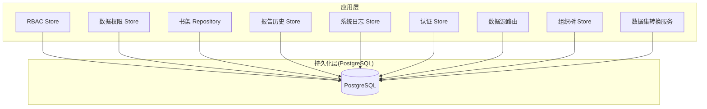
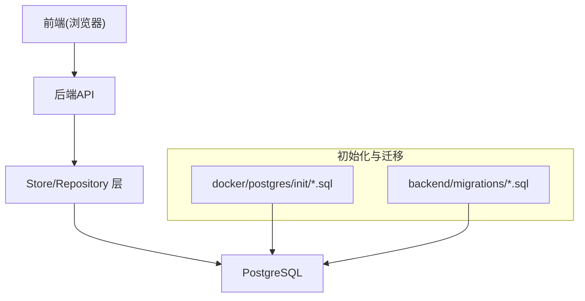
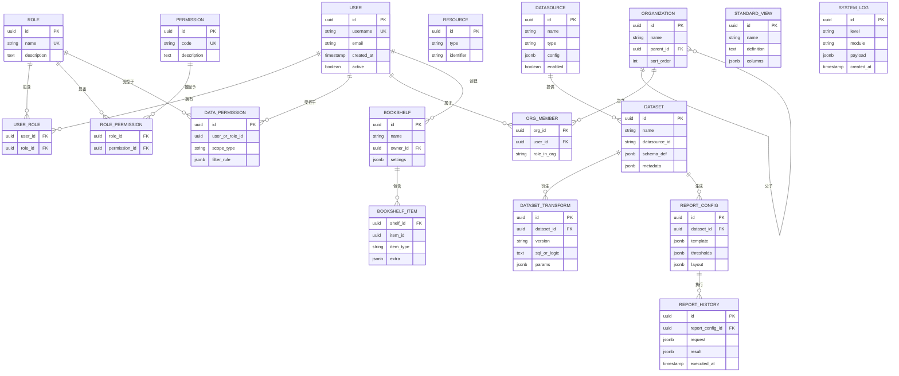
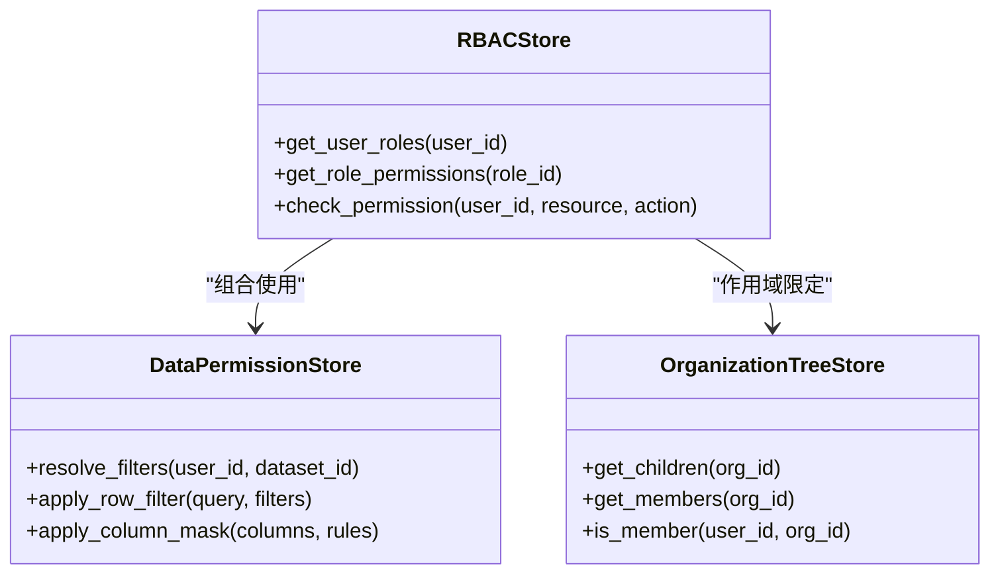
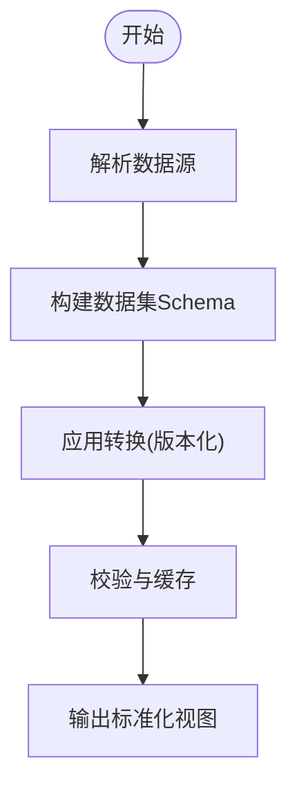
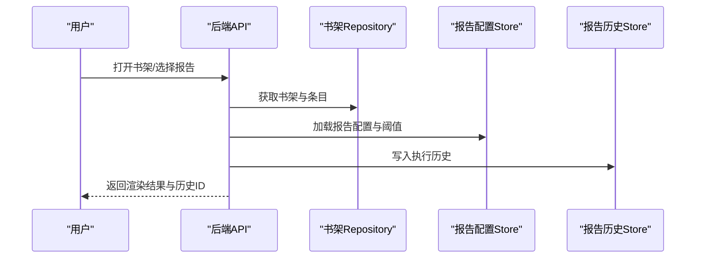
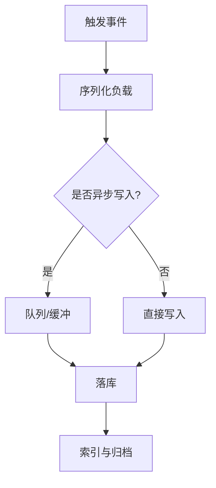
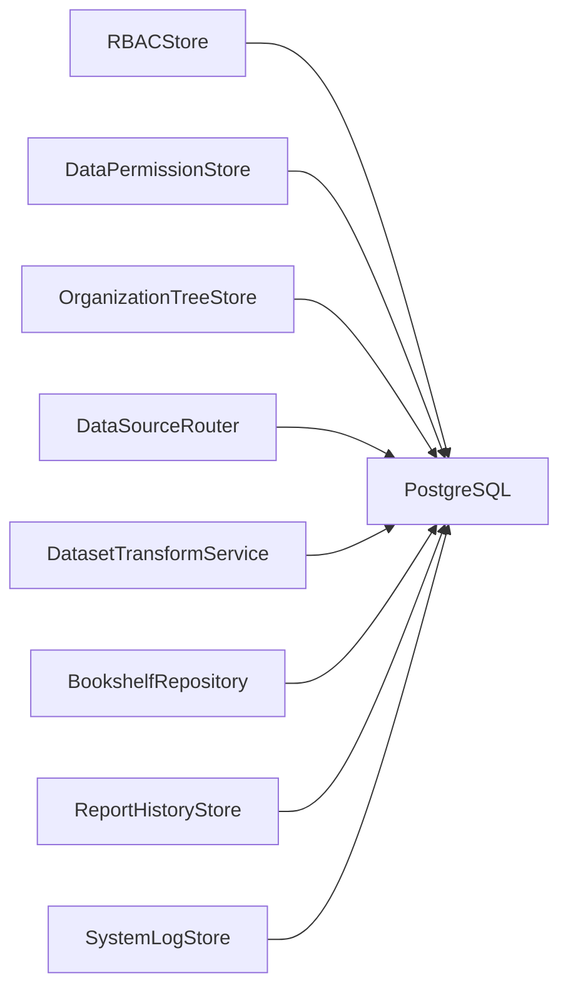

# 数据模型概览

<cite>
**本文引用的文件**   
- [docker/postgres/init/001_bookshelf_schema.sql](file://docker/postgres/init/001_bookshelf_schema.sql)
- [docker/postgres/init/002_angel_group_data.sql](file://docker/postgres/init/002_angel_group_data.sql)
- [docker/postgres/init/003_bookshelf_agent1_prompt_upgrade.sql](file://docker/postgres/init/003_bookshelf_agent1_prompt_upgrade.sql)
- [docker/postgres/init/004_report_config.sql](file://docker/postgres/init/004_report_config.sql)
- [docker/postgres/init/005_report_thresholds.sql](file://docker/postgres/init/005_report_thresholds.sql)
- [docker/postgres/init/006_system_event_logs.sql](file://docker/postgres/init/006_system_event_logs.sql)
- [backend/migrations/20260330_bookshelf_schema.sql](file://backend/migrations/20260330_bookshelf_schema.sql)
- [backend/migrations/20260330_bookshelf_agent1_prompt_upgrade.sql](file://backend/migrations/20260330_bookshelf_agent1_prompt_upgrade.sql)
- [backend/migrations/20260430_report_config.sql](file://backend/migrations/20260430_report_config.sql)
- [backend/migrations/20260509_report_thresholds.sql](file://backend/migrations/20260509_report_thresholds.sql)
- [backend/migrations/20260512_system_event_logs.sql](file://backend/migrations/20260512_system_event_logs.sql)
- [backend/migrations/20260627_ecommerce_standard_view.sql](file://backend/migrations/20260627_ecommerce_standard_view.sql)
- [backend/migrations/20260630_dataset_transforms.sql](file://backend/migrations/20260630_dataset_transforms.sql)
- [backend/rbac_store.py](file://backend/rbac_store.py)
- [backend/data_permission_store.py](file://backend/data_permission_store.py)
- [backend/bookshelf_repository.py](file://backend/bookshelf_repository.py)
- [backend/smartask_report_history_store.py](file://backend/smartask_report_history_store.py)
- [backend/system_log_store.py](file://backend/system_log_store.py)
- [backend/auth_store.py](file://backend/auth_store.py)
- [backend/datasource_router.py](file://backend/datasource_router.py)
- [backend/organization_tree_store.py](file://backend/organization_tree_store.py)
- [backend/dataset_transform_service.py](file://backend/dataset_transform_service.py)
</cite>

## 目录
1. [引言](#引言)
2. [项目结构](#项目结构)
3. [核心组件](#核心组件)
4. [架构总览](#架构总览)
5. [详细组件分析](#详细组件分析)
6. [依赖关系分析](#依赖关系分析)
7. [性能考虑](#性能考虑)
8. [故障排查指南](#故障排查指南)
9. [结论](#结论)
10. [附录](#附录)

## 引言
本文件为 SmartAsk 智能问数平台的数据模型概览，聚焦数据库实体关系（ERD）、模块划分、依赖与数据流向、完整性约束与业务规则、模型演进与版本管理策略，以及索引、查询优化与分区等性能考量。文档面向产品、研发与运维人员，力求以循序渐进的方式帮助读者快速理解并有效使用数据模型。

## 项目结构
SmartAsk 后端采用 Python + PostgreSQL 的架构，数据库初始化脚本集中在 docker/postgres/init 目录，迁移脚本集中在 backend/migrations 目录；运行时数据访问通过若干 store/repository 模块实现。核心数据域包括：
- 用户与组织域：用户、角色、权限、组织架构树
- 数据集与数据源域：数据源、数据集、转换、标准视图
- 书架与报告域：书架、报告配置、阈值、历史
- 系统日志域：事件日志、审计记录

图表来源
- [backend/rbac_store.py](file://backend/rbac_store.py)
- [backend/data_permission_store.py](file://backend/data_permission_store.py)
- [backend/bookshelf_repository.py](file://backend/bookshelf_repository.py)
- [backend/smartask_report_history_store.py](file://backend/smartask_report_history_store.py)
- [backend/system_log_store.py](file://backend/system_log_store.py)
- [backend/auth_store.py](file://backend/auth_store.py)
- [backend/datasource_router.py](file://backend/datasource_router.py)
- [backend/organization_tree_store.py](file://backend/organization_tree_store.py)
- [backend/dataset_transform_service.py](file://backend/dataset_transform_service.py)

章节来源
- [docker/postgres/init/001_bookshelf_schema.sql](file://docker/postgres/init/001_bookshelf_schema.sql)
- [backend/migrations/20260330_bookshelf_schema.sql](file://backend/migrations/20260330_bookshelf_schema.sql)
- [backend/migrations/20260430_report_config.sql](file://backend/migrations/20260430_report_config.sql)
- [backend/migrations/20260509_report_thresholds.sql](file://backend/migrations/20260509_report_thresholds.sql)
- [backend/migrations/20260512_system_event_logs.sql](file://backend/migrations/20260512_system_event_logs.sql)
- [backend/migrations/20260627_ecommerce_standard_view.sql](file://backend/migrations/20260627_ecommerce_standard_view.sql)
- [backend/migrations/20260630_dataset_transforms.sql](file://backend/migrations/20260630_dataset_transforms.sql)

## 核心组件
- 用户与权限
  - 用户、角色、权限、资源映射，支撑细粒度按钮级与字段级控制
  - 数据权限：行级/列级过滤条件与策略
- 组织与数据源
  - 组织树：层级结构与成员关系
  - 数据源：连接信息、类型、可见性
- 数据集与转换
  - 数据集定义、维度/指标、别名、路由
  - 转换：SQL/逻辑转换、版本、校验
  - 标准视图：跨域统一口径
- 书架与报告
  - 书架：主题集合、收藏、分享
  - 报告配置：模板、阈值、渲染参数
  - 报告历史：执行轨迹、结果快照
- 系统日志
  - 事件日志：操作审计、错误追踪、性能埋点

章节来源
- [backend/rbac_store.py](file://backend/rbac_store.py)
- [backend/data_permission_store.py](file://backend/data_permission_store.py)
- [backend/organization_tree_store.py](file://backend/organization_tree_store.py)
- [backend/datasource_router.py](file://backend/datasource_router.py)
- [backend/dataset_transform_service.py](file://backend/dataset_transform_service.py)
- [backend/bookshelf_repository.py](file://backend/bookshelf_repository.py)
- [backend/smartask_report_history_store.py](file://backend/smartask_report_history_store.py)
- [backend/system_log_store.py](file://backend/system_log_store.py)

## 架构总览
下图展示数据模型在系统中的分层与交互：应用层通过各 Store/Repository 访问 PostgreSQL，迁移与初始化脚本确保模式一致性与可演进性。

图表来源
- [docker/postgres/init/001_bookshelf_schema.sql](file://docker/postgres/init/001_bookshelf_schema.sql)
- [docker/postgres/init/004_report_config.sql](file://docker/postgres/init/004_report_config.sql)
- [docker/postgres/init/006_system_event_logs.sql](file://docker/postgres/init/006_system_event_logs.sql)
- [backend/migrations/20260330_bookshelf_schema.sql](file://backend/migrations/20260330_bookshelf_schema.sql)
- [backend/migrations/20260430_report_config.sql](file://backend/migrations/20260430_report_config.sql)
- [backend/migrations/20260512_system_event_logs.sql](file://backend/migrations/20260512_system_event_logs.sql)

## 详细组件分析

### ERD：核心实体与关系
以下 ERD 概括了用户、组织、数据源、数据集、转换、书架、报告、权限与日志等核心实体的关系。该图为概念性建模，用于指导实际表结构设计。

图表来源
- [docker/postgres/init/001_bookshelf_schema.sql](file://docker/postgres/init/001_bookshelf_schema.sql)
- [docker/postgres/init/004_report_config.sql](file://docker/postgres/init/004_report_config.sql)
- [docker/postgres/init/006_system_event_logs.sql](file://docker/postgres/init/006_system_event_logs.sql)
- [backend/migrations/20260330_bookshelf_schema.sql](file://backend/migrations/20260330_bookshelf_schema.sql)
- [backend/migrations/20260430_report_config.sql](file://backend/migrations/20260430_report_config.sql)
- [backend/migrations/20260512_system_event_logs.sql](file://backend/migrations/20260512_system_event_logs.sql)
- [backend/migrations/20260627_ecommerce_standard_view.sql](file://backend/migrations/20260627_ecommerce_standard_view.sql)
- [backend/migrations/20260630_dataset_transforms.sql](file://backend/migrations/20260630_dataset_transforms.sql)

### 用户与权限域
- 角色与权限：基于 RBAC 的角色-权限-资源三元组，支持按钮级与字段级控制
- 数据权限：行级/列级过滤规则，结合用户或角色进行动态注入
- 组织与成员：组织树与成员关系，作为权限作用域的边界

图表来源
- [backend/rbac_store.py](file://backend/rbac_store.py)
- [backend/data_permission_store.py](file://backend/data_permission_store.py)
- [backend/organization_tree_store.py](file://backend/organization_tree_store.py)

章节来源
- [backend/rbac_store.py](file://backend/rbac_store.py)
- [backend/data_permission_store.py](file://backend/data_permission_store.py)
- [backend/organization_tree_store.py](file://backend/organization_tree_store.py)

### 数据集与数据源域
- 数据源：多类型连接配置，启用开关与可见性控制
- 数据集：元数据与 Schema 定义，支持别名与路由
- 转换：版本化的 SQL/逻辑转换，保障口径一致性
- 标准视图：跨域统一口径，便于报表复用

图表来源
- [backend/datasource_router.py](file://backend/datasource_router.py)
- [backend/dataset_transform_service.py](file://backend/dataset_transform_service.py)
- [backend/migrations/20260627_ecommerce_standard_view.sql](file://backend/migrations/20260627_ecommerce_standard_view.sql)
- [backend/migrations/20260630_dataset_transforms.sql](file://backend/migrations/20260630_dataset_transforms.sql)

章节来源
- [backend/datasource_router.py](file://backend/datasource_router.py)
- [backend/dataset_transform_service.py](file://backend/dataset_transform_service.py)
- [backend/migrations/20260627_ecommerce_standard_view.sql](file://backend/migrations/20260627_ecommerce_standard_view.sql)
- [backend/migrations/20260630_dataset_transforms.sql](file://backend/migrations/20260630_dataset_transforms.sql)

### 书架与报告域
- 书架：主题集合、收藏项、分享设置
- 报告配置：模板、布局、阈值策略
- 报告历史：请求与结果快照，便于回溯与审计

图表来源
- [backend/bookshelf_repository.py](file://backend/bookshelf_repository.py)
- [backend/smartask_report_history_store.py](file://backend/smartask_report_history_store.py)
- [docker/postgres/init/004_report_config.sql](file://docker/postgres/init/004_report_config.sql)
- [docker/postgres/init/005_report_thresholds.sql](file://docker/postgres/init/005_report_thresholds.sql)

章节来源
- [backend/bookshelf_repository.py](file://backend/bookshelf_repository.py)
- [backend/smartask_report_history_store.py](file://backend/smartask_report_history_store.py)
- [docker/postgres/init/004_report_config.sql](file://docker/postgres/init/004_report_config.sql)
- [docker/postgres/init/005_report_thresholds.sql](file://docker/postgres/init/005_report_thresholds.sql)

### 系统日志域
- 事件日志：级别、模块、负载、时间戳
- 用途：审计、排障、性能监控与告警

图表来源
- [backend/system_log_store.py](file://backend/system_log_store.py)
- [docker/postgres/init/006_system_event_logs.sql](file://docker/postgres/init/006_system_event_logs.sql)
- [backend/migrations/20260512_system_event_logs.sql](file://backend/migrations/20260512_system_event_logs.sql)

章节来源
- [backend/system_log_store.py](file://backend/system_log_store.py)
- [docker/postgres/init/006_system_event_logs.sql](file://docker/postgres/init/006_system_event_logs.sql)
- [backend/migrations/20260512_system_event_logs.sql](file://backend/migrations/20260512_system_event_logs.sql)

## 依赖关系分析
- 低耦合高内聚：每个 Store/Repository 专注单一领域，避免跨域强耦合
- 外部依赖：PostgreSQL 作为唯一持久化存储；数据源适配器由 datasource_router 统一接入
- 潜在循环依赖：通过接口抽象与依赖注入规避，保持清晰调用链

图表来源
- [backend/rbac_store.py](file://backend/rbac_store.py)
- [backend/data_permission_store.py](file://backend/data_permission_store.py)
- [backend/organization_tree_store.py](file://backend/organization_tree_store.py)
- [backend/datasource_router.py](file://backend/datasource_router.py)
- [backend/dataset_transform_service.py](file://backend/dataset_transform_service.py)
- [backend/bookshelf_repository.py](file://backend/bookshelf_repository.py)
- [backend/smartask_report_history_store.py](file://backend/smartask_report_history_store.py)
- [backend/system_log_store.py](file://backend/system_log_store.py)

章节来源
- [backend/rbac_store.py](file://backend/rbac_store.py)
- [backend/data_permission_store.py](file://backend/data_permission_store.py)
- [backend/organization_tree_store.py](file://backend/organization_tree_store.py)
- [backend/datasource_router.py](file://backend/datasource_router.py)
- [backend/dataset_transform_service.py](file://backend/dataset_transform_service.py)
- [backend/bookshelf_repository.py](file://backend/bookshelf_repository.py)
- [backend/smartask_report_history_store.py](file://backend/smartask_report_history_store.py)
- [backend/system_log_store.py](file://backend/system_log_store.py)

## 性能考虑
- 索引设计
  - 主键与唯一键：所有核心表的主键与业务唯一键（如用户名、权限码）
  - 外键与关联查询：数据集-数据源、报告配置-数据集、书架-条目等关联字段建立索引
  - 高频查询列：按时间范围、级别、模块对系统日志建复合索引
  - JSONB 字段：对常用过滤键建立表达式索引（如 filter_rule 中的关键字段）
- 查询优化
  - 分页与投影：仅返回必要字段，限制返回行数
  - 预计算与物化：标准视图与转换结果可物化为中间表
  - 读写分离：只读报表查询走副本实例
- 分区策略
  - 系统日志按时间分区（月/周），定期归档与清理
  - 报告历史按时间分区，冷热数据分离
- 缓存与批处理
  - 数据集 Schema 与转换结果缓存
  - 批量写入日志与历史，降低锁竞争

## 故障排查指南
- 权限问题
  - 检查用户-角色-权限映射是否正确
  - 验证数据权限规则是否生效（行级/列级）
- 数据源与数据集
  - 确认数据源连通性与配置
  - 检查转换 SQL 的版本与语法
- 报告与书架
  - 核对报告配置模板与阈值
  - 查看报告历史中的请求与结果快照
- 系统日志
  - 按级别与模块筛选异常
  - 关注慢查询与超时记录

章节来源
- [backend/rbac_store.py](file://backend/rbac_store.py)
- [backend/data_permission_store.py](file://backend/data_permission_store.py)
- [backend/datasource_router.py](file://backend/datasource_router.py)
- [backend/dataset_transform_service.py](file://backend/dataset_transform_service.py)
- [backend/smartask_report_history_store.py](file://backend/smartask_report_history_store.py)
- [backend/system_log_store.py](file://backend/system_log_store.py)

## 结论
SmartAsk 的数据模型围绕“用户-组织-权限”、“数据源-数据集-转换”、“书架-报告-历史”、“系统日志”四大域展开，层次清晰、职责明确。通过迁移与初始化脚本保证模式的一致性与可演进性，配合索引、分区与缓存策略满足高性能需求。建议在后续迭代中持续完善数据权限精细化与查询性能调优。

## 附录

### 数据完整性约束与业务规则
- 完整性约束
  - 主键唯一、非空约束
  - 外键约束保证引用完整性
  - 唯一键防止重复（用户名、权限码、数据集名）
  - JSONB 字段校验（正则/枚举/必填）
- 业务规则
  - 数据权限优先于角色权限
  - 数据集转换必须版本化且可回滚
  - 报告阈值变更需审计留痕
  - 书架分享遵循最小权限原则

### 数据模型演进与版本管理
- 迁移策略
  - 增量式迁移脚本命名规范：YYYYMMDD_description.sql
  - 幂等性：支持重复执行不破坏状态
  - 回滚脚本：每次新增/修改需提供反向迁移
- 版本管理
  - 初始化脚本与迁移脚本双轨并行，生产环境以迁移为准
  - 关键表结构变更需评审与灰度发布
  - 数据字典与 ERD 随版本同步更新

章节来源
- [backend/migrations/20260330_bookshelf_schema.sql](file://backend/migrations/20260330_bookshelf_schema.sql)
- [backend/migrations/20260430_report_config.sql](file://backend/migrations/20260430_report_config.sql)
- [backend/migrations/20260509_report_thresholds.sql](file://backend/migrations/20260509_report_thresholds.sql)
- [backend/migrations/20260512_system_event_logs.sql](file://backend/migrations/20260512_system_event_logs.sql)
- [backend/migrations/20260627_ecommerce_standard_view.sql](file://backend/migrations/20260627_ecommerce_standard_view.sql)
- [backend/migrations/20260630_dataset_transforms.sql](file://backend/migrations/20260630_dataset_transforms.sql)
- [docker/postgres/init/001_bookshelf_schema.sql](file://docker/postgres/init/001_bookshelf_schema.sql)
- [docker/postgres/init/004_report_config.sql](file://docker/postgres/init/004_report_config.sql)
- [docker/postgres/init/005_report_thresholds.sql](file://docker/postgres/init/005_report_thresholds.sql)
- [docker/postgres/init/006_system_event_logs.sql](file://docker/postgres/init/006_system_event_logs.sql)