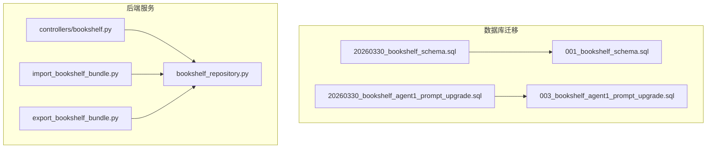
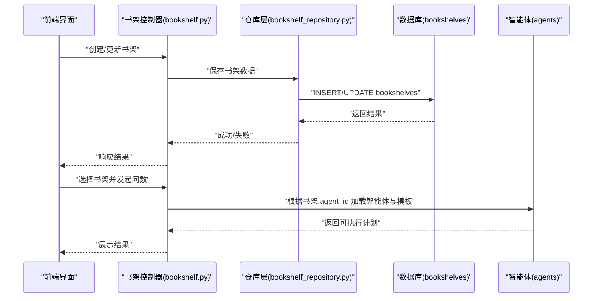
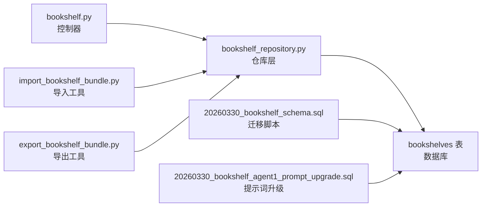

# 书架表结构

<cite>
**本文引用的文件**   
- [bookshelf_schema.sql](file://backend/migrations/20260330_bookshelf_schema.sql)
- [bookshelf_agent1_prompt_upgrade.sql](file://backend/migrations/20260330_bookshelf_agent1_prompt_upgrade.sql)
- [001_bookshelf_schema.sql](file://docker/postgres/init/001_bookshelf_schema.sql)
- [003_bookshelf_agent1_prompt_upgrade.sql](file://docker/postgres/init/003_bookshelf_agent1_prompt_upgrade.sql)
- [bookshelf.py](file://backend/controllers/bookshelf.py)
- [bookshelf_repository.py](file://backend/bookshelf_repository.py)
- [import_bookshelf_bundle.py](file://backend/import_bookshelf_bundle.py)
- [export_bookshelf_bundle.py](file://backend/export_bookshelf_bundle.py)
</cite>

## 目录
1. [简介](#简介)
2. [项目结构](#项目结构)
3. [核心组件](#核心组件)
4. [架构总览](#架构总览)
5. [详细组件分析](#详细组件分析)
6. [依赖关系分析](#依赖关系分析)
7. [性能考虑](#性能考虑)
8. [故障排查指南](#故障排查指南)
9. [结论](#结论)
10. [附录](#附录)

## 简介
本文件为 SmartAsk 智能问数平台的“书架”功能提供详细的表结构文档，重点围绕书架表（bookshelves）的字段定义、数据类型与约束、与智能体（agents）的关联关系、在智能问数流程中的作用、典型 CRUD 操作与查询场景、权限控制机制与数据隔离策略，以及数据迁移历史与版本兼容性说明进行系统化阐述。读者无需深入代码即可理解书架的数据模型与使用方式。

## 项目结构
书架相关的数据结构与迁移脚本主要位于后端 migrations 与 docker 初始化脚本中；业务逻辑由控制器与仓库层实现；导入导出工具用于批量管理书架资产。

图表来源
- [20260330_bookshelf_schema.sql](file://backend/migrations/20260330_bookshelf_schema.sql)
- [20260330_bookshelf_agent1_prompt_upgrade.sql](file://backend/migrations/20260330_bookshelf_agent1_prompt_upgrade.sql)
- [001_bookshelf_schema.sql](file://docker/postgres/init/001_bookshelf_schema.sql)
- [003_bookshelf_agent1_prompt_upgrade.sql](file://docker/postgres/init/003_bookshelf_agent1_prompt_upgrade.sql)
- [bookshelf.py](file://backend/controllers/bookshelf.py)
- [bookshelf_repository.py](file://backend/bookshelf_repository.py)
- [import_bookshelf_bundle.py](file://backend/import_bookshelf_bundle.py)
- [export_bookshelf_bundle.py](file://backend/export_bookshelf_bundle.py)

章节来源
- [20260330_bookshelf_schema.sql](file://backend/migrations/20260330_bookshelf_schema.sql)
- [20260330_bookshelf_agent1_prompt_upgrade.sql](file://backend/migrations/20260330_bookshelf_agent1_prompt_upgrade.sql)
- [001_bookshelf_schema.sql](file://docker/postgres/init/001_bookshelf_schema.sql)
- [003_bookshelf_agent1_prompt_upgrade.sql](file://docker/postgres/init/003_bookshelf_agent1_prompt_upgrade.sql)
- [bookshelf.py](file://backend/controllers/bookshelf.py)
- [bookshelf_repository.py](file://backend/bookshelf_repository.py)
- [import_bookshelf_bundle.py](file://backend/import_bookshelf_bundle.py)
- [export_bookshelf_bundle.py](file://backend/export_bookshelf_bundle.py)

## 核心组件
- 书架表（bookshelves）：存储书架元数据与提示词模板，作为智能问数的“能力集合”入口。
- 智能体（agents）：执行具体问数任务的智能体，书架通过外键关联到某个智能体，形成“一个书架对应一个智能体”的关系。
- 控制器（bookshelf controller）：对外暴露 REST 接口，处理书架的增删改查与模板更新等请求。
- 仓库层（bookshelf repository）：封装对 bookshelves 表的持久化操作，包括事务、校验与错误处理。
- 导入导出工具：支持将书架配置打包导出与批量导入，便于环境迁移与共享。

章节来源
- [bookshelf.py](file://backend/controllers/bookshelf.py)
- [bookshelf_repository.py](file://backend/bookshelf_repository.py)
- [import_bookshelf_bundle.py](file://backend/import_bookshelf_bundle.py)
- [export_bookshelf_bundle.py](file://backend/export_bookshelf_bundle.py)

## 架构总览
书架在智能问数流程中的角色是“能力装配器”。用户选择书架后，系统加载对应的智能体与提示词模板，结合数据集与权限上下文生成 SQL 并执行。

图表来源
- [bookshelf.py](file://backend/controllers/bookshelf.py)
- [bookshelf_repository.py](file://backend/bookshelf_repository.py)
- [20260330_bookshelf_schema.sql](file://backend/migrations/20260330_bookshelf_schema.sql)

## 详细组件分析

### 书架表（bookshelves）字段定义与约束
- id：主键，唯一标识书架记录。
- name：书架名称，非空，长度受限，用于前端展示与检索。
- description：书架描述，可选，用于说明书架用途或范围。
- agent_id：外键，关联智能体（agents），表示该书架绑定的智能体实例。
- prompt_template：提示词模板，文本类型，用于指导智能体的回答策略。
- created_at：创建时间戳，默认当前时间。
- updated_at：更新时间戳，默认当前时间，并在更新时自动刷新。

常见约束建议
- 唯一性：name 在同一 agent_id 下应唯一，避免同智能体下的同名冲突。
- 非空：name、agent_id、prompt_template 应为必填。
- 时间戳：created_at、updated_at 由数据库或应用层维护。
- 外键：agent_id 需与 agents 表的主键保持一致，确保引用完整性。

章节来源
- [20260330_bookshelf_schema.sql](file://backend/migrations/20260330_bookshelf_schema.sql)
- [001_bookshelf_schema.sql](file://docker/postgres/init/001_bookshelf_schema.sql)

### 书架与智能体（agents）的关联关系
- 一对一或一对多：通常一个书架绑定一个智能体（agent_id），但同一智能体可被多个书架复用。
- 作用：书架通过 agent_id 指定问数任务由哪个智能体执行，同时携带 prompt_template 定制行为。
- 生命周期：当智能体被删除时，应级联清理或标记其关联书架为无效，防止悬空引用。

章节来源
- [20260330_bookshelf_schema.sql](file://backend/migrations/20260330_bookshelf_schema.sql)
- [bookshelf_repository.py](file://backend/bookshelf_repository.py)

### 书架在智能问数流程中的作用
- 能力装配：选择书架即选择一组“智能体 + 提示词模板”，决定问数策略与输出风格。
- 模板驱动：prompt_template 影响意图识别、SQL 生成与结果解释。
- 权限继承：书架可继承智能体或数据集的权限策略，实现细粒度访问控制。

章节来源
- [bookshelf.py](file://backend/controllers/bookshelf.py)
- [bookshelf_repository.py](file://backend/bookshelf_repository.py)

### 典型 CRUD 操作示例与查询场景
- 创建书架：传入 name、description、agent_id、prompt_template，返回 id 与时间戳。
- 更新书架：按 id 更新 name、description、agent_id、prompt_template，刷新 updated_at。
- 删除书架：按 id 删除，若存在依赖需先解除关联。
- 查询书架：按 agent_id、name 模糊匹配、时间范围过滤。
- 批量导入/导出：通过 bundle 格式导出/导入多个书架配置。

章节来源
- [bookshelf.py](file://backend/controllers/bookshelf.py)
- [bookshelf_repository.py](file://backend/bookshelf_repository.py)
- [import_bookshelf_bundle.py](file://backend/import_bookshelf_bundle.py)
- [export_bookshelf_bundle.py](file://backend/export_bookshelf_bundle.py)

### 权限控制机制与数据隔离策略
- 基于角色的访问控制（RBAC）：不同角色对书架的读/写/管理权限不同。
- 组织隔离：书架可按组织维度隔离，仅允许所属组织成员访问。
- 智能体权限继承：书架继承智能体的数据集访问权限，限制可查询的数据范围。
- 模板可见性：prompt_template 可按角色或组织进行可见性控制。

章节来源
- [bookshelf.py](file://backend/controllers/bookshelf.py)
- [bookshelf_repository.py](file://backend/bookshelf_repository.py)

### 数据迁移历史与版本兼容性
- 初始建表：20260330_bookshelf_schema.sql 定义了 bookshelves 表的基础结构与索引。
- 提示词升级：20260330_bookshelf_agent1_prompt_upgrade.sql 针对特定智能体（agent1）的模板进行升级。
- Docker 初始化：001_bookshelf_schema.sql 与 003_bookshelf_agent1_prompt_upgrade.sql 与上述迁移一致，用于容器化部署。
- 兼容性建议：
  - 新增字段时应保持向后兼容，旧客户端忽略未知字段。
  - 模板升级需保留历史版本，支持回滚。
  - 外键约束变更需谨慎评估对现有数据的影响。

章节来源
- [20260330_bookshelf_schema.sql](file://backend/migrations/20260330_bookshelf_schema.sql)
- [20260330_bookshelf_agent1_prompt_upgrade.sql](file://backend/migrations/20260330_bookshelf_agent1_prompt_upgrade.sql)
- [001_bookshelf_schema.sql](file://docker/postgres/init/001_bookshelf_schema.sql)
- [003_bookshelf_agent1_prompt_upgrade.sql](file://docker/postgres/init/003_bookshelf_agent1_prompt_upgrade.sql)

## 依赖关系分析
书架模块依赖数据库迁移脚本、控制器与仓库层，并通过导入导出工具与外部系统进行交互。

图表来源
- [bookshelf.py](file://backend/controllers/bookshelf.py)
- [bookshelf_repository.py](file://backend/bookshelf_repository.py)
- [20260330_bookshelf_schema.sql](file://backend/migrations/20260330_bookshelf_schema.sql)
- [20260330_bookshelf_agent1_prompt_upgrade.sql](file://backend/migrations/20260330_bookshelf_agent1_prompt_upgrade.sql)

章节来源
- [bookshelf.py](file://backend/controllers/bookshelf.py)
- [bookshelf_repository.py](file://backend/bookshelf_repository.py)
- [import_bookshelf_bundle.py](file://backend/import_bookshelf_bundle.py)
- [export_bookshelf_bundle.py](file://backend/export_bookshelf_bundle.py)
- [20260330_bookshelf_schema.sql](file://backend/migrations/20260330_bookshelf_schema.sql)
- [20260330_bookshelf_agent1_prompt_upgrade.sql](file://backend/migrations/20260330_bookshelf_agent1_prompt_upgrade.sql)

## 性能考虑
- 索引优化：对 agent_id、name、created_at、updated_at 建立合适索引以提升查询效率。
- 分页与过滤：列表查询应支持分页与条件过滤，避免全表扫描。
- 模板缓存：prompt_template 可缓存以减少重复读取开销。
- 批量操作：导入导出采用批量写入，减少事务次数。

[本节为通用性能建议，不直接分析具体文件]

## 故障排查指南
- 外键约束失败：检查 agent_id 是否指向有效的智能体记录。
- 唯一性冲突：确认 name 在同一 agent_id 下是否重复。
- 模板升级失败：核对迁移脚本顺序与版本兼容性。
- 权限拒绝：验证当前用户角色与组织隔离策略。
- 导入导出异常：检查 bundle 文件格式与字段映射。

章节来源
- [bookshelf_repository.py](file://backend/bookshelf_repository.py)
- [import_bookshelf_bundle.py](file://backend/import_bookshelf_bundle.py)
- [export_bookshelf_bundle.py](file://backend/export_bookshelf_bundle.py)

## 结论
书架表（bookshelves）是 SmartAsk 智能问数平台的核心数据模型之一，通过绑定智能体与提示词模板，实现对问数能力的灵活装配与权限控制。合理的字段设计、严格的约束与完善的迁移策略，保障了系统的稳定性与可扩展性。建议在后续迭代中持续优化索引与缓存策略，提升查询与导入导出性能。

[本节为总结性内容，不直接分析具体文件]

## 附录
- 术语说明：
  - 书架：一组“智能体 + 提示词模板”的能力集合。
  - 智能体：执行问数任务的 AI 代理。
  - 提示词模板：指导智能体行为的文本模板。
- 参考文件：
  - 书架表结构定义与迁移脚本见“项目结构”部分所列文件。
  - 控制器与仓库层实现见“核心组件”部分所列文件。

[本节为补充信息，不直接分析具体文件]