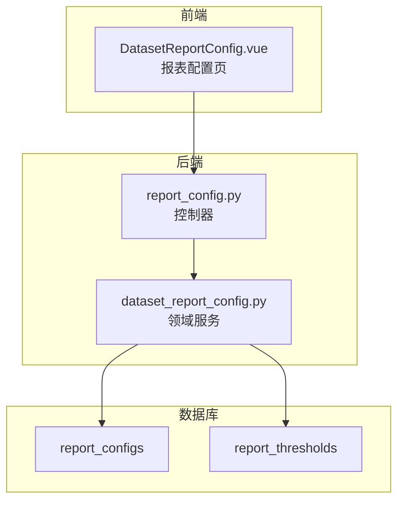
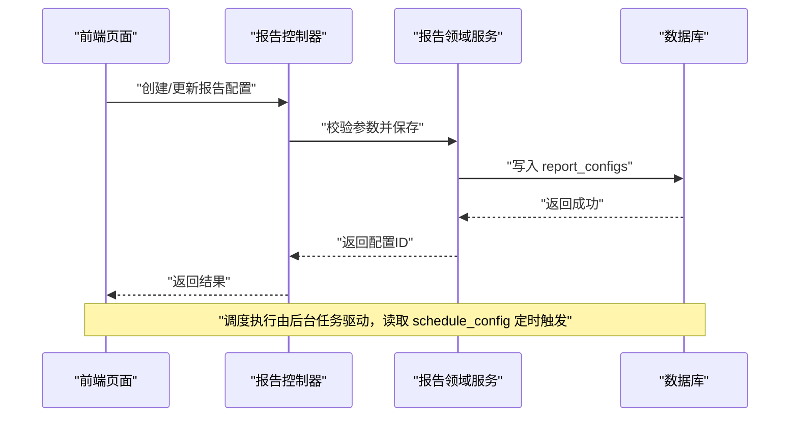
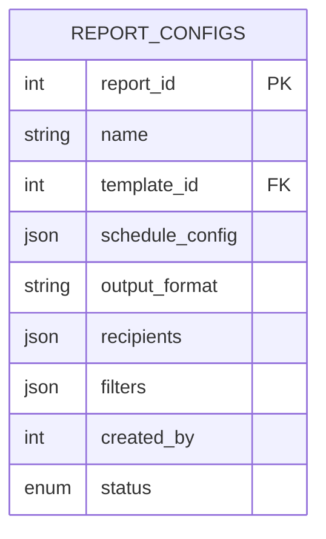
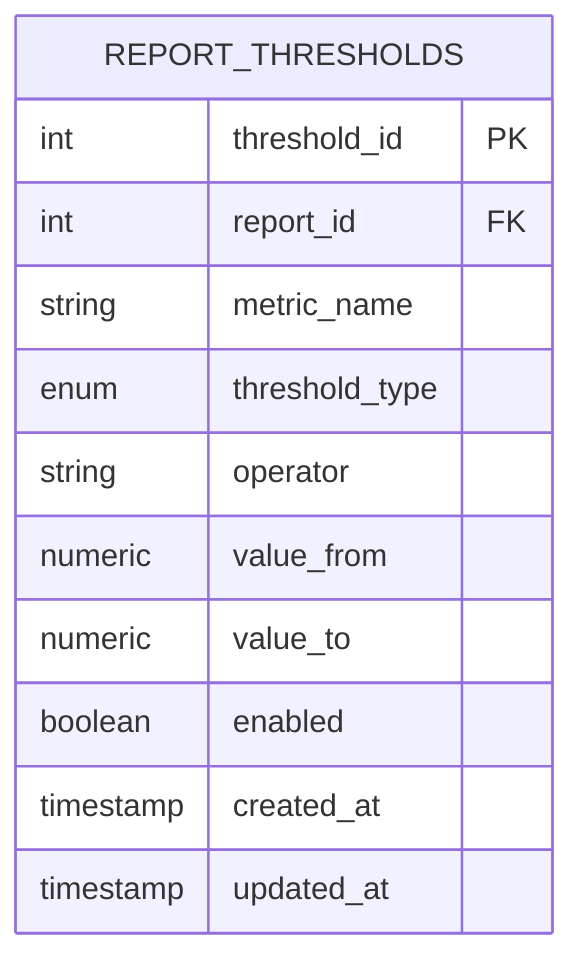
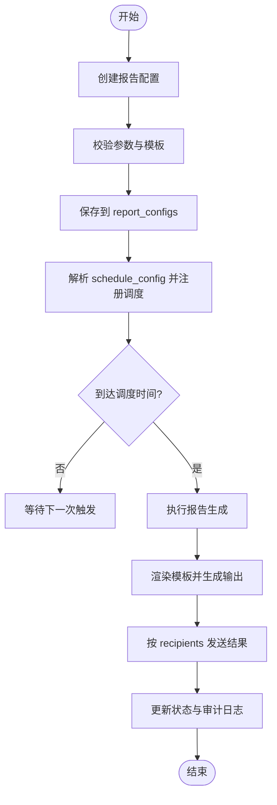
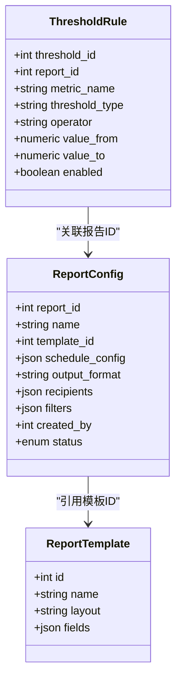
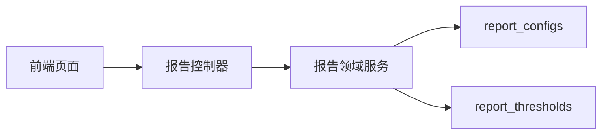

# 报告配置表结构

<cite>
**本文引用的文件**   
- [backend/controllers/report_config.py](file://backend/controllers/report_config.py)
- [backend/migrations/20260430_report_config.sql](file://backend/migrations/20260430_report_config.sql)
- [backend/migrations/20260509_report_thresholds.sql](file://backend/migrations/20260509_report_thresholds.sql)
- [docker/postgres/init/004_report_config.sql](file://docker/postgres/init/004_report_config.sql)
- [docker/postgres/init/005_report_thresholds.sql](file://docker/postgres/init/005_report_thresholds.sql)
- [frontend/src/views/DatasetReportConfig.vue](file://frontend/src/views/DatasetReportConfig.vue)
- [backend/dataset_report_config.py](file://backend/dataset_report_config.py)
</cite>

## 目录
1. [简介](#简介)
2. [项目结构](#项目结构)
3. [核心组件](#核心组件)
4. [架构总览](#架构总览)
5. [详细组件分析](#详细组件分析)
6. [依赖关系分析](#依赖关系分析)
7. [性能考虑](#性能考虑)
8. [故障排查指南](#故障排查指南)
9. [结论](#结论)
10. [附录](#附录)

## 简介
本文件为 SmartAsk 智能问数平台的“报告系统”提供详细的表结构文档，重点覆盖：
- 报告配置表 report_configs 的字段定义与业务含义（report_id、name、template_id、schedule_config、output_format、recipients、filters、created_by、status 等）
- 报告阈值配置表 report_thresholds 的结构设计（阈值类型、比较运算符、阈值范围等）
- 报告配置的完整生命周期管理示例（创建、调度、执行、结果输出）
- 报告模板与配置的关联关系和扩展机制

## 项目结构
与报告配置相关的代码主要分布在以下位置：
- 数据库迁移脚本：定义 report_configs 与 report_thresholds 表结构
- 后端控制器：暴露报告配置的增删改查与调度相关接口
- 前端页面：用于可视化配置报告与阈值
- 领域服务：封装报告配置的业务逻辑

**图表来源** 
- [backend/controllers/report_config.py](file://backend/controllers/report_config.py)
- [backend/dataset_report_config.py](file://backend/dataset_report_config.py)
- [frontend/src/views/DatasetReportConfig.vue](file://frontend/src/views/DatasetReportConfig.vue)
- [backend/migrations/20260430_report_config.sql](file://backend/migrations/20260430_report_config.sql)
- [backend/migrations/20260509_report_thresholds.sql](file://backend/migrations/20260509_report_thresholds.sql)

**章节来源**
- [backend/migrations/20260430_report_config.sql](file://backend/migrations/20260430_report_config.sql)
- [backend/migrations/20260509_report_thresholds.sql](file://backend/migrations/20260509_report_thresholds.sql)
- [docker/postgres/init/004_report_config.sql](file://docker/postgres/init/004_report_config.sql)
- [docker/postgres/init/005_report_thresholds.sql](file://docker/postgres/init/005_report_thresholds.sql)
- [backend/controllers/report_config.py](file://backend/controllers/report_config.py)
- [backend/dataset_report_config.py](file://backend/dataset_report_config.py)
- [frontend/src/views/DatasetReportConfig.vue](file://frontend/src/views/DatasetReportConfig.vue)

## 核心组件
- 报告配置表 report_configs：存储每个报告的元数据、调度策略、输出格式、收件人、过滤条件、创建人与状态等。
- 报告阈值配置表 report_thresholds：存储针对某项指标或字段的阈值规则，包括阈值类型、比较运算符、阈值范围等。
- 控制器 report_config.py：对外暴露报告配置的 CRUD 与调度控制接口。
- 领域服务 dataset_report_config.py：封装报告配置的业务逻辑，如校验、持久化、与阈值联动等。
- 前端 DatasetReportConfig.vue：提供报告配置与阈值的可视化编辑界面。

**章节来源**
- [backend/controllers/report_config.py](file://backend/controllers/report_config.py)
- [backend/dataset_report_config.py](file://backend/dataset_report_config.py)
- [frontend/src/views/DatasetReportConfig.vue](file://frontend/src/views/DatasetReportConfig.vue)

## 架构总览
报告系统的整体交互流程如下：
- 前端通过 API 调用后端控制器进行报告配置的增删改查与调度操作
- 控制器将请求转发至领域服务进行业务处理与数据持久化
- 领域服务读写 report_configs 与 report_thresholds 表
- 调度器根据 schedule_config 定时触发报告执行，生成结果并发送给 recipients

**图表来源** 
- [backend/controllers/report_config.py](file://backend/controllers/report_config.py)
- [backend/dataset_report_config.py](file://backend/dataset_report_config.py)
- [backend/migrations/20260430_report_config.sql](file://backend/migrations/20260430_report_config.sql)

## 详细组件分析

### 报告配置表 report_configs
- 字段说明（基于迁移脚本与控制器使用推断）：
  - report_id：主键，唯一标识一个报告配置
  - name：报告名称
  - template_id：关联的报告模板ID
  - schedule_config：调度配置（JSON），包含调度周期、时间窗口、时区等
  - output_format：输出格式（如 PDF、Excel、图片等）
  - recipients：收件人列表（JSON），支持邮箱、飞书用户等
  - filters：查询过滤条件（JSON），用于限定数据范围
  - created_by：创建人ID
  - status：状态（启用/禁用/草稿等）
- 数据类型建议：
  - report_id：整数或UUID
  - name：字符串
  - template_id：整数或UUID（外键指向模板表）
  - schedule_config：JSON 或 JSONB
  - output_format：枚举或字符串
  - recipients：JSON 数组
  - filters：JSON 对象
  - created_by：整数或UUID
  - status：枚举或字符串

**图表来源** 
- [backend/migrations/20260430_report_config.sql](file://backend/migrations/20260430_report_config.sql)
- [docker/postgres/init/004_report_config.sql](file://docker/postgres/init/004_report_config.sql)

**章节来源**
- [backend/migrations/20260430_report_config.sql](file://backend/migrations/20260430_report_config.sql)
- [docker/postgres/init/004_report_config.sql](file://docker/postgres/init/004_report_config.sql)
- [backend/controllers/report_config.py](file://backend/controllers/report_config.py)

### 报告阈值配置表 report_thresholds
- 字段说明（基于迁移脚本与控制器使用推断）：
  - threshold_id：主键，唯一标识一条阈值规则
  - report_id：关联的报告配置ID（外键）
  - metric_name：指标名称或字段名
  - threshold_type：阈值类型（如上限、下限、区间、同比、环比等）
  - operator：比较运算符（如 >、>=、<、<=、=、!=、between）
  - value_from/value_to：阈值范围（数值或表达式）
  - enabled：是否启用该阈值规则
  - created_at/updated_at：时间戳
- 数据类型建议：
  - threshold_id：整数或UUID
  - report_id：整数或UUID（外键）
  - metric_name：字符串
  - threshold_type：枚举或字符串
  - operator：枚举或字符串
  - value_from/value_to：数值或字符串（表达式）
  - enabled：布尔
  - created_at/updated_at：时间戳

**图表来源** 
- [backend/migrations/20260509_report_thresholds.sql](file://backend/migrations/20260509_report_thresholds.sql)
- [docker/postgres/init/005_report_thresholds.sql](file://docker/postgres/init/005_report_thresholds.sql)

**章节来源**
- [backend/migrations/20260509_report_thresholds.sql](file://backend/migrations/20260509_report_thresholds.sql)
- [docker/postgres/init/005_report_thresholds.sql](file://docker/postgres/init/005_report_thresholds.sql)
- [backend/controllers/report_config.py](file://backend/controllers/report_config.py)

### 报告配置的生命周期管理
- 创建：前端提交报告配置（含模板ID、调度、输出格式、收件人、过滤条件），后端校验并持久化到 report_configs
- 调度：schedule_config 被调度器解析，按周期触发执行
- 执行：根据 filters 生成查询，渲染模板，生成输出
- 输出：按 output_format 生成文件/链接，并通过 recipients 发送通知
- 状态：status 控制启停，便于运维管理

**图表来源** 
- [backend/controllers/report_config.py](file://backend/controllers/report_config.py)
- [backend/dataset_report_config.py](file://backend/dataset_report_config.py)
- [backend/migrations/20260430_report_config.sql](file://backend/migrations/20260430_report_config.sql)

**章节来源**
- [backend/controllers/report_config.py](file://backend/controllers/report_config.py)
- [backend/dataset_report_config.py](file://backend/dataset_report_config.py)

### 报告模板与配置的关联关系与扩展机制
- 关联关系：report_configs.template_id 指向模板表，确保报告内容与布局可复用
- 扩展机制：
  - 新增模板：在模板表中添加新模板，配置中引用即可
  - 动态字段：filters 支持 JSON 扩展，便于灵活限定数据范围
  - 输出扩展：output_format 支持枚举扩展，适配不同输出渠道
  - 阈值扩展：threshold_type 与 operator 支持枚举扩展，满足复杂告警场景

**图表来源** 
- [backend/migrations/20260430_report_config.sql](file://backend/migrations/20260430_report_config.sql)
- [backend/migrations/20260509_report_thresholds.sql](file://backend/migrations/20260509_report_thresholds.sql)

**章节来源**
- [backend/migrations/20260430_report_config.sql](file://backend/migrations/20260430_report_config.sql)
- [backend/migrations/20260509_report_thresholds.sql](file://backend/migrations/20260509_report_thresholds.sql)

## 依赖关系分析
- 控制器依赖领域服务进行业务处理
- 领域服务依赖数据库表 report_configs 与 report_thresholds
- 前端依赖控制器API进行配置管理

**图表来源** 
- [backend/controllers/report_config.py](file://backend/controllers/report_config.py)
- [backend/dataset_report_config.py](file://backend/dataset_report_config.py)
- [backend/migrations/20260430_report_config.sql](file://backend/migrations/20260430_report_config.sql)
- [backend/migrations/20260509_report_thresholds.sql](file://backend/migrations/20260509_report_thresholds.sql)

**章节来源**
- [backend/controllers/report_config.py](file://backend/controllers/report_config.py)
- [backend/dataset_report_config.py](file://backend/dataset_report_config.py)

## 性能考虑
- 索引优化：对 report_id、template_id、status 建立索引以加速查询
- JSON 字段：filters 与 schedule_config 使用 JSONB 并利用GIN索引提升检索性能
- 调度并发：合理设置调度并发度，避免资源争用
- 输出缓存：对相同条件的报告结果进行缓存，减少重复计算

[本节为通用指导，不直接分析具体文件]

## 故障排查指南
- 常见错误：
  - 模板ID不存在：检查 template_id 是否有效
  - 调度配置无效：校验 schedule_config 的语法与时区
  - 阈值规则冲突：检查 operator 与 value_from/value_to 的一致性
- 排查步骤：
  - 查看控制器日志与异常堆栈
  - 检查数据库记录完整性与约束
  - 验证前端提交的JSON结构是否符合预期

**章节来源**
- [backend/controllers/report_config.py](file://backend/controllers/report_config.py)
- [backend/dataset_report_config.py](file://backend/dataset_report_config.py)

## 结论
本报告配置表结构文档明确了 report_configs 与 report_thresholds 的字段定义、业务含义与关联关系，提供了完整的生命周期管理与扩展机制说明。通过合理的索引与调度策略，可保障报告系统的高效稳定运行。

[本节为总结性内容，不直接分析具体文件]

## 附录
- 相关迁移脚本路径：
  - [backend/migrations/20260430_report_config.sql](file://backend/migrations/20260430_report_config.sql)
  - [backend/migrations/20260509_report_thresholds.sql](file://backend/migrations/20260509_report_thresholds.sql)
  - [docker/postgres/init/004_report_config.sql](file://docker/postgres/init/004_report_config.sql)
  - [docker/postgres/init/005_report_thresholds.sql](file://docker/postgres/init/005_report_thresholds.sql)
- 前端配置页面：
  - [frontend/src/views/DatasetReportConfig.vue](file://frontend/src/views/DatasetReportConfig.vue)