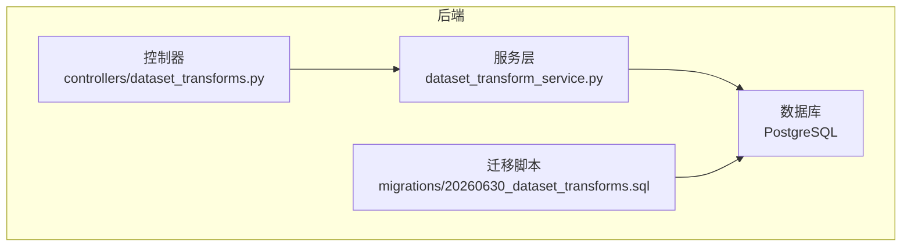
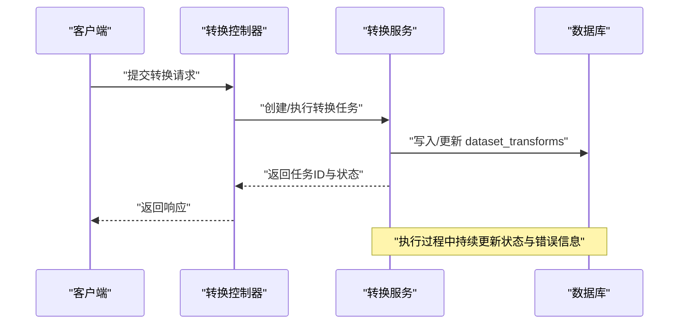
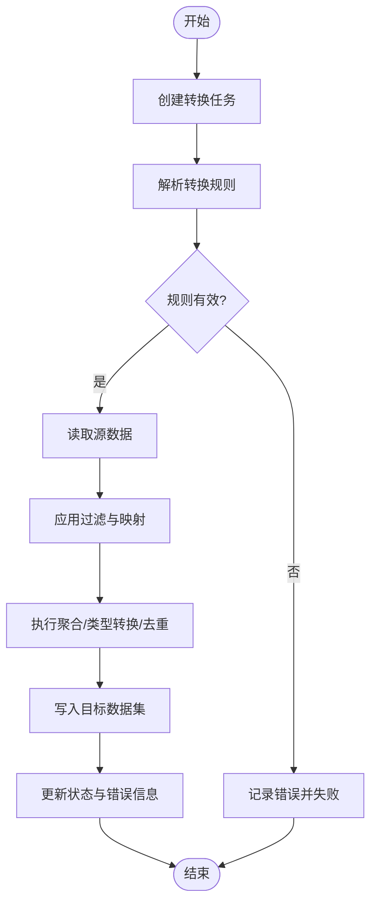
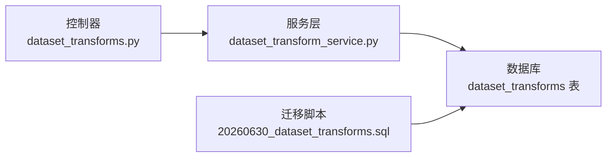

# 数据集转换表结构

<cite>
**本文引用的文件**   
- [dataset_transforms.py](file://backend/controllers/dataset_transforms.py)
- [dataset_transform_service.py](file://backend/dataset_transform_service.py)
- [20260630_dataset_transforms.sql](file://backend/migrations/20260630_dataset_transforms.sql)
</cite>

## 目录
1. [简介](#简介)
2. [项目结构](#项目结构)
3. [核心组件](#核心组件)
4. [架构总览](#架构总览)
5. [详细组件分析](#详细组件分析)
6. [依赖关系分析](#依赖关系分析)
7. [性能考虑](#性能考虑)
8. [故障排查指南](#故障排查指南)
9. [结论](#结论)
10. [附录](#附录)

## 简介
本文件面向 SmartAsk 智能问数平台的数据集转换能力，聚焦于“数据集转换表（dataset_transforms）”的字段定义、业务含义与使用方式，并围绕转换规则配置格式、执行引擎工作机制、完整流程示例（规则定义、执行监控、错误处理、结果验证）、调度策略与并发控制机制、数据血缘追踪与质量校验进行系统化说明。文档力求在技术细节与可读性之间取得平衡，便于产品、研发与运维人员共同理解与协作。

## 项目结构
与数据集转换相关的代码主要分布在以下位置：
- 控制器层：提供 HTTP API 入口，负责请求解析、权限校验、调用服务层并返回响应
- 服务层：封装转换任务的生命周期管理、规则解析、执行编排、状态更新与错误记录
- 数据库迁移脚本：定义 dataset_transforms 表的 DDL 及索引等元数据

图表来源
- [dataset_transforms.py](file://backend/controllers/dataset_transforms.py)
- [dataset_transform_service.py](file://backend/dataset_transform_service.py)
- [20260630_dataset_transforms.sql](file://backend/migrations/20260630_dataset_transforms.sql)

章节来源
- [dataset_transforms.py](file://backend/controllers/dataset_transforms.py)
- [dataset_transform_service.py](file://backend/dataset_transform_service.py)
- [20260630_dataset_transforms.sql](file://backend/migrations/20260630_dataset_transforms.sql)

## 核心组件
- 数据集转换表（dataset_transforms）：用于持久化每次数据集转换任务的元数据与执行上下文，包括源/目标数据集标识、转换规则、执行状态、错误信息与时间戳等
- 转换服务（DatasetTransformService）：负责创建转换任务、解析与校验转换规则、调度执行、更新状态与错误信息、生成血缘与质量校验结果
- 控制器（DatasetTransformsController）：对外暴露 RESTful API，接收前端或上游系统的转换请求，委托服务层完成具体逻辑

章节来源
- [dataset_transforms.py](file://backend/controllers/dataset_transforms.py)
- [dataset_transform_service.py](file://backend/dataset_transform_service.py)
- [20260630_dataset_transforms.sql](file://backend/migrations/20260630_dataset_transforms.sql)

## 架构总览
下图展示了从 API 到服务再到数据库的调用链路，以及转换任务在表中的生命周期流转。

图表来源
- [dataset_transforms.py](file://backend/controllers/dataset_transforms.py)
- [dataset_transform_service.py](file://backend/dataset_transform_service.py)
- [20260630_dataset_transforms.sql](file://backend/migrations/20260630_dataset_transforms.sql)

## 详细组件分析

### 数据集转换表（dataset_transforms）字段定义与业务含义
- transform_id：转换任务唯一标识，用于关联一次完整的转换过程及其所有中间状态
- source_dataset_id：源数据集标识，表示数据来源；需确保该数据集存在且具备读取权限
- target_dataset_id：目标数据集标识，表示转换结果写入的目标；需确保该数据集存在且具备写入权限
- transform_rules：转换规则的配置对象，描述字段映射、过滤条件、聚合计算、类型转换、去重策略等；建议采用结构化 JSON 格式，便于解析与校验
- execution_status：执行状态，常见值包括待执行、执行中、成功、失败、已取消等；用于驱动前端展示与后续处理
- error_message：错误消息，当执行失败时记录错误原因，便于定位问题与重试
- created_at：创建时间，记录任务首次入库的时间
- updated_at：更新时间，记录最近一次状态或错误信息的更新时间

说明
- 上述字段构成转换任务的核心元数据，支撑任务查询、监控、审计与回溯
- 建议在数据库层对关键字段建立索引（如 source_dataset_id、target_dataset_id、execution_status），以提升查询与统计效率

章节来源
- [20260630_dataset_transforms.sql](file://backend/migrations/20260630_dataset_transforms.sql)

### 转换规则（transform_rules）配置格式
- 推荐采用 JSON 结构，包含但不限于以下键：
  - field_mappings：字段映射规则，支持一对一、一对多、表达式映射
  - filters：过滤条件，支持等值、范围、集合匹配、正则等
  - aggregations：聚合计算，支持 SUM、COUNT、AVG、MAX、MIN 等
  - type_conversions：类型转换，支持字符串转数值、日期格式化、枚举映射等
  - dedup_strategy：去重策略，基于主键或组合键去重
  - validation：质量校验规则，如非空、范围、唯一性、一致性检查
  - lineage_tags：血缘标签，用于标记数据来源、加工步骤、责任人等
- 校验与解析：
  - 在服务层对 transform_rules 进行 schema 校验，缺失必填项或类型不匹配应拒绝执行并记录错误
  - 对于复杂表达式，建议使用安全的表达式引擎或白名单函数集，避免注入风险

章节来源
- [dataset_transform_service.py](file://backend/dataset_transform_service.py)

### 执行引擎工作机制
- 任务创建：控制器接收请求后，服务层创建转换任务并写入 dataset_transforms，初始状态为“待执行”
- 规则解析：服务层解析 transform_rules，进行语法与语义校验，构建执行计划
- 数据读取：根据 source_dataset_id 读取源数据，应用 filters 与 field_mappings
- 数据处理：执行 aggregations、type_conversions、dedup_strategy 等
- 数据写入：将处理结果写入 target_dataset_id，必要时进行幂等写入与事务回滚
- 状态更新：根据执行结果更新 execution_status 与 error_message，并刷新 updated_at
- 血缘与质量：记录 lineage_tags 与质量校验结果，供审计与追溯

图表来源
- [dataset_transform_service.py](file://backend/dataset_transform_service.py)

章节来源
- [dataset_transform_service.py](file://backend/dataset_transform_service.py)

### 完整流程示例
- 规则定义：在 transform_rules 中声明字段映射、过滤条件、聚合计算、类型转换、去重策略与质量校验规则
- 执行监控：通过 execution_status 与 error_message 观察任务进度与异常
- 错误处理：捕获异常并记录 error_message，支持按策略重试或人工干预
- 结果验证：对比目标数据集的行数、关键指标与样例数据，确保转换正确性

章节来源
- [dataset_transform_service.py](file://backend/dataset_transform_service.py)

### 调度策略与并发控制
- 调度策略：
  - 支持立即执行与定时调度（如 Cron 表达式）
  - 支持优先级队列，高优先级任务优先执行
- 并发控制：
  - 基于分布式锁防止同一转换任务重复执行
  - 限制全局并发度，避免资源争用与数据库压力
  - 支持任务拆分与并行子任务，提升大数据量处理效率

章节来源
- [dataset_transform_service.py](file://backend/dataset_transform_service.py)

### 数据血缘追踪与质量校验
- 血缘追踪：
  - 在 transform_rules 中维护 lineage_tags，记录数据来源、加工步骤、责任人
  - 在 dataset_transforms 中记录 source_dataset_id 与 target_dataset_id，形成上下游关系
- 质量校验：
  - 在 transform_rules 中定义 validation 规则，如非空、范围、唯一性、一致性
  - 执行后输出质量报告，包含通过率、失败明细与建议修复措施

章节来源
- [dataset_transform_service.py](file://backend/dataset_transform_service.py)

## 依赖关系分析
- 控制器依赖服务层：控制器仅负责接口适配与参数校验，核心逻辑下沉至服务层
- 服务层依赖数据库：服务层直接操作 dataset_transforms 表，读写任务元数据与状态
- 迁移脚本定义表结构：确保数据库 schema 与服务层期望一致

图表来源
- [dataset_transforms.py](file://backend/controllers/dataset_transforms.py)
- [dataset_transform_service.py](file://backend/dataset_transform_service.py)
- [20260630_dataset_transforms.sql](file://backend/migrations/20260630_dataset_transforms.sql)

章节来源
- [dataset_transforms.py](file://backend/controllers/dataset_transforms.py)
- [dataset_transform_service.py](file://backend/dataset_transform_service.py)
- [20260630_dataset_transforms.sql](file://backend/migrations/20260630_dataset_transforms.sql)

## 性能考虑
- 索引优化：对 source_dataset_id、target_dataset_id、execution_status 建立索引，加速查询与统计
- 批量处理：对大规模数据采用分批读取与写入，降低内存占用与锁竞争
- 异步执行：将耗时操作放入后台任务队列，避免阻塞请求线程
- 缓存策略：对频繁访问的规则与元数据进行缓存，减少数据库压力
- 资源隔离：为不同租户或数据集划分资源池，避免相互影响

[本节为通用指导，无需特定文件引用]

## 故障排查指南
- 常见问题：
  - 规则解析失败：检查 transform_rules 的 JSON 结构与必填字段
  - 权限不足：确认 source_dataset_id 与 target_dataset_id 的读写权限
  - 数据不一致：核对过滤条件与映射规则是否符合预期
  - 执行超时：评估数据量与复杂度，调整并发与批大小
- 排查步骤：
  - 查看 execution_status 与 error_message 获取错误上下文
  - 检查日志与审计记录，定位问题阶段
  - 复现最小可运行用例，逐步缩小问题范围
  - 必要时回滚目标数据集并重新执行

章节来源
- [dataset_transform_service.py](file://backend/dataset_transform_service.py)

## 结论
数据集转换表（dataset_transforms）是 SmartAsk 平台实现数据加工与治理的关键基础设施。通过规范化的字段设计、结构化的转换规则、稳健的执行引擎与完善的监控与审计能力，平台能够高效、可靠地完成跨数据集的数据转换与质量保障。建议在生产环境中结合调度与并发控制机制，持续优化性能与稳定性。

[本节为总结性内容，无需特定文件引用]

## 附录
- 术语表：
  - 数据集：具有明确主题与结构的数据集合
  - 转换规则：描述数据加工逻辑的结构化配置
  - 血缘：数据从来源到目标的加工路径与依赖关系
  - 质量校验：对数据完整性、准确性、一致性的检查
- 参考实践：
  - 使用版本化管理转换规则，支持回滚与审计
  - 引入数据契约与 Schema 注册，增强兼容性
  - 建立数据质量看板，实时监控与告警

[本节为补充信息，无需特定文件引用]