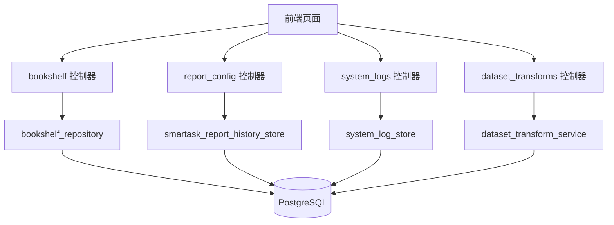
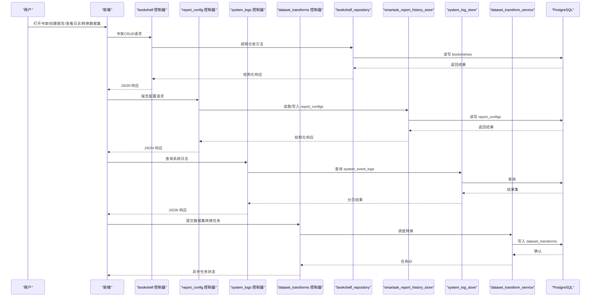
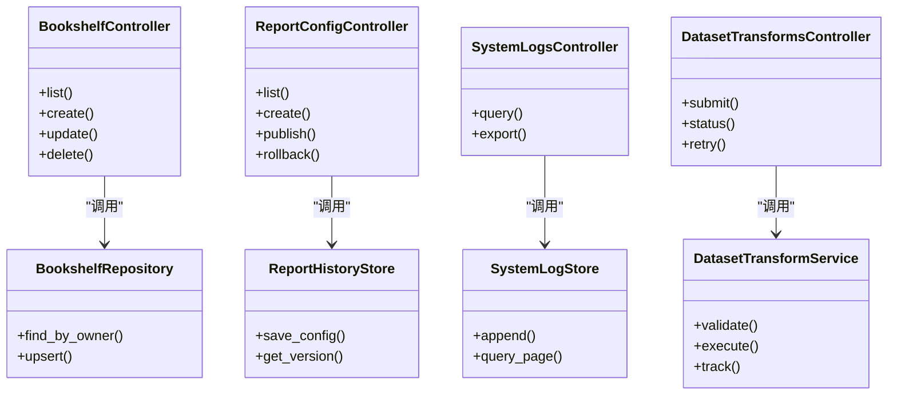

# 核心表结构

<cite>
**本文引用的文件**   
- [backend/migrations/20260330_bookshelf_schema.sql](file://backend/migrations/20260330_bookshelf_schema.sql)
- [docker/postgres/init/001_bookshelf_schema.sql](file://docker/postgres/init/001_bookshelf_schema.sql)
- [backend/migrations/20260430_report_config.sql](file://backend/migrations/20260430_report_config.sql)
- [backend/migrations/20260509_report_thresholds.sql](file://backend/migrations/20260509_report_thresholds.sql)
- [backend/migrations/20260512_system_event_logs.sql](file://backend/migrations/20260512_system_event_logs.sql)
- [backend/migrations/20260627_ecommerce_standard_view.sql](file://backend/migrations/20260627_ecommerce_standard_view.sql)
- [backend/migrations/20260630_dataset_transforms.sql](file://backend/migrations/20260630_dataset_transforms.sql)
- [backend/controllers/bookshelf.py](file://backend/controllers/bookshelf.py)
- [backend/controllers/report_config.py](file://backend/controllers/report_config.py)
- [backend/controllers/system_logs.py](file://backend/controllers/system_logs.py)
- [backend/controllers/dataset_transforms.py](file://backend/controllers/dataset_transforms.py)
- [backend/bookshelf_repository.py](file://backend/bookshelf_repository.py)
- [backend/smartask_report_history_store.py](file://backend/smartask_report_history_store.py)
- [backend/system_log_store.py](file://backend/system_log_store.py)
- [backend/dataset_transform_service.py](file://backend/dataset_transform_service.py)
</cite>

## 目录
1. [简介](#简介)
2. [项目结构](#项目结构)
3. [核心组件](#核心组件)
4. [架构总览](#架构总览)
5. [详细组件分析](#详细组件分析)
6. [依赖关系分析](#依赖关系分析)
7. [性能考量](#性能考量)
8. [故障排查指南](#故障排查指南)
9. [结论](#结论)
10. [附录](#附录)

## 简介
本文件面向 SmartAsk 智能问数平台的核心数据模型，聚焦以下五类关键对象：书架（bookshelves）、报告配置（report_configs）、系统日志（system_event_logs）、电商标准视图（ecommerce_standard_view）与数据集转换（dataset_transforms）。文档逐一说明字段定义、数据类型、约束条件与业务含义，并给出主键/外键/唯一/检查等完整性约束的设计要点、典型使用场景与查询示例，以及字段设计的业务考量与技术权衡。

## 项目结构
- 数据库迁移脚本集中于 backend/migrations 与 docker/postgres/init，分别用于开发/测试环境初始化与生产部署的增量变更。
- 控制器层位于 backend/controllers，负责 HTTP 接口与领域逻辑编排；仓储与存储服务位于 backend/*_repository.py、*_store.py、*_service.py，封装持久化与跨服务调用。
- 前端通过 API 访问后端控制器，间接读写上述核心表。

图表来源
- [backend/controllers/bookshelf.py](file://backend/controllers/bookshelf.py)
- [backend/controllers/report_config.py](file://backend/controllers/report_config.py)
- [backend/controllers/system_logs.py](file://backend/controllers/system_logs.py)
- [backend/controllers/dataset_transforms.py](file://backend/controllers/dataset_transforms.py)
- [backend/bookshelf_repository.py](file://backend/bookshelf_repository.py)
- [backend/smartask_report_history_store.py](file://backend/smartask_report_history_store.py)
- [backend/system_log_store.py](file://backend/system_log_store.py)
- [backend/dataset_transform_service.py](file://backend/dataset_transform_service.py)

章节来源
- [backend/migrations/20260330_bookshelf_schema.sql](file://backend/migrations/20260330_bookshelf_schema.sql)
- [docker/postgres/init/001_bookshelf_schema.sql](file://docker/postgres/init/001_bookshelf_schema.sql)
- [backend/migrations/20260430_report_config.sql](file://backend/migrations/20260430_report_config.sql)
- [backend/migrations/20260509_report_thresholds.sql](file://backend/migrations/20260509_report_thresholds.sql)
- [backend/migrations/20260512_system_event_logs.sql](file://backend/migrations/20260512_system_event_logs.sql)
- [backend/migrations/20260627_ecommerce_standard_view.sql](file://backend/migrations/20260627_ecommerce_standard_view.sql)
- [backend/migrations/20260630_dataset_transforms.sql](file://backend/migrations/20260630_dataset_transforms.sql)

## 核心组件
- 书架表（bookshelves）：承载用户/组织维度的“问答资产”集合，支持按主题或场景组织数据集、提示词与快捷入口。
- 报告配置表（report_configs）：定义报表模板、指标口径、阈值规则与渲染参数，驱动报告生成流水线。
- 系统日志表（system_event_logs）：记录系统运行事件、错误与审计轨迹，支撑可观测性与问题定位。
- 电商标准视图（ecommerce_standard_view）：对电商域多源数据进行标准化建模，提供统一查询口径。
- 数据集转换表（dataset_transforms）：描述数据集到目标形态的转换规则与执行元数据，支撑 ETL/ELT 流程。

章节来源
- [backend/migrations/20260330_bookshelf_schema.sql](file://backend/migrations/20260330_bookshelf_schema.sql)
- [backend/migrations/20260430_report_config.sql](file://backend/migrations/20260430_report_config.sql)
- [backend/migrations/20260512_system_event_logs.sql](file://backend/migrations/20260512_system_event_logs.sql)
- [backend/migrations/20260627_ecommerce_standard_view.sql](file://backend/migrations/20260627_ecommerce_standard_view.sql)
- [backend/migrations/20260630_dataset_transforms.sql](file://backend/migrations/20260630_dataset_transforms.sql)

## 架构总览
下图展示核心表与控制器/服务的交互关系，以及数据在请求链路中的流向。

图表来源
- [backend/controllers/bookshelf.py](file://backend/controllers/bookshelf.py)
- [backend/controllers/report_config.py](file://backend/controllers/report_config.py)
- [backend/controllers/system_logs.py](file://backend/controllers/system_logs.py)
- [backend/controllers/dataset_transforms.py](file://backend/controllers/dataset_transforms.py)
- [backend/bookshelf_repository.py](file://backend/bookshelf_repository.py)
- [backend/smartask_report_history_store.py](file://backend/smartask_report_history_store.py)
- [backend/system_log_store.py](file://backend/system_log_store.py)
- [backend/dataset_transform_service.py](file://backend/dataset_transform_service.py)

## 详细组件分析

### 书架表（bookshelves）
- 设计目标：为不同角色/组织提供“问答资产”的分组管理，便于复用数据集、提示词与快捷入口。
- 关键字段与类型（示例性说明，具体以迁移为准）：
  - id：主键，自增或UUID
  - name：文本，非空，长度限制
  - description：文本，可选
  - owner_id：外键，关联用户/组织
  - visibility：枚举，如 private/shared
  - created_at/updated_at：时间戳
- 约束：
  - 主键约束保证唯一性
  - 非空约束确保必要信息完整
  - 外键约束维护与用户/组织的引用完整性
  - 可选唯一约束避免同名冲突（按 owner_id+name）
- 业务含义：
  - 将分散的数据集与提示词按“书架”聚合，提升复用效率
  - 支持权限控制（visibility）与归属管理（owner_id）
- 典型使用场景：
  - 新建书架并添加数据集/提示词
  - 按组织维度检索可用书架
  - 导出/导入书架包
- 查询示例（概念性）：
  - 按所有者查询书架列表
  - 模糊搜索书架名称
  - 统计每个书架包含的资源数量

章节来源
- [backend/migrations/20260330_bookshelf_schema.sql](file://backend/migrations/20260330_bookshelf_schema.sql)
- [docker/postgres/init/001_bookshelf_schema.sql](file://docker/postgres/init/001_bookshelf_schema.sql)
- [backend/controllers/bookshelf.py](file://backend/controllers/bookshelf.py)
- [backend/bookshelf_repository.py](file://backend/bookshelf_repository.py)

### 报告配置表（report_configs）
- 设计目标：集中管理报表模板、指标口径、阈值策略与渲染参数，驱动报告生成。
- 关键字段与类型（示例性说明，具体以迁移为准）：
  - id：主键
  - name：文本，非空
  - template：JSON/文本，定义布局与组件
  - metrics：JSON，指标定义与计算口径
  - thresholds：JSON，阈值规则（告警/高亮）
  - datasource_ref：文本/外键，指向数据源
  - status：枚举，如 draft/published
  - created_at/updated_at：时间戳
- 约束：
  - 主键约束
  - 非空约束
  - 唯一约束（name + owner_id）
  - 检查约束（status 取值范围）
- 业务含义：
  - 将“如何呈现数据”与“数据从哪来”解耦，支持多模板复用
  - 阈值规则支持动态告警与可视化高亮
- 典型使用场景：
  - 创建/编辑报告模板
  - 发布/回滚版本
  - 基于模板批量生成报告
- 查询示例（概念性）：
  - 按状态筛选已发布的模板
  - 根据指标名检索相关配置
  - 统计各模板的使用次数

章节来源
- [backend/migrations/20260430_report_config.sql](file://backend/migrations/20260430_report_config.sql)
- [backend/migrations/20260509_report_thresholds.sql](file://backend/migrations/20260509_report_thresholds.sql)
- [backend/controllers/report_config.py](file://backend/controllers/report_config.py)
- [backend/smartask_report_history_store.py](file://backend/smartask_report_history_store.py)

### 系统日志表（system_event_logs）
- 设计目标：记录系统运行事件、错误与审计轨迹，满足可观测性与合规要求。
- 关键字段与类型（示例性说明，具体以迁移为准）：
  - id：主键
  - level：枚举，如 info/warn/error
  - event_type：文本，事件分类
  - message：文本，消息体
  - trace_id：文本，链路追踪ID
  - actor_id：文本/外键，操作者
  - extra：JSON，扩展字段
  - created_at：时间戳
- 约束：
  - 主键约束
  - 非空约束（level、event_type、created_at）
  - 索引优化（level、created_at、trace_id）
- 业务含义：
  - 支撑问题定位、审计追溯与监控告警
  - 通过 trace_id 串联跨服务调用链
- 典型使用场景：
  - 按时间范围与级别过滤日志
  - 基于 trace_id 追踪一次请求的全链路
  - 统计错误率与热点事件
- 查询示例（概念性）：
  - 最近一小时 error 级别日志
  - 某用户操作审计轨迹
  - 按事件类型聚合计数

章节来源
- [backend/migrations/20260512_system_event_logs.sql](file://backend/migrations/20260512_system_event_logs.sql)
- [backend/controllers/system_logs.py](file://backend/controllers/system_logs.py)
- [backend/system_log_store.py](file://backend/system_log_store.py)

### 电商标准视图（ecommerce_standard_view）
- 设计目标：对电商域多源数据进行标准化建模，提供统一查询口径，降低上层应用复杂度。
- 关键字段与类型（示例性说明，具体以迁移为准）：
  - order_id：订单标识
  - user_id：用户标识
  - product_id：商品标识
  - category：类目
  - amount：金额
  - quantity：数量
  - status：订单状态
  - created_at/updated_at：时间戳
- 约束：
  - 视图本身无行级约束，但底层表需具备主键/外键/检查约束
  - 视图列命名与类型需保持一致性
- 业务含义：
  - 屏蔽底层多表/多库差异，向上暴露统一语义
  - 作为 BI/报表/分析的基准数据源
- 典型使用场景：
  - 销售趋势分析
  - 用户复购率计算
  - 类目转化漏斗
- 查询示例（概念性）：
  - 近30天销售额与订单量
  - 各品类转化率对比
  - 用户分层消费行为

章节来源
- [backend/migrations/20260627_ecommerce_standard_view.sql](file://backend/migrations/20260627_ecommerce_standard_view.sql)

### 数据集转换表（dataset_transforms）
- 设计目标：描述数据集到目标形态的转换规则与执行元数据，支撑 ETL/ELT 流程的可控与可观测。
- 关键字段与类型（示例性说明，具体以迁移为准）：
  - id：主键
  - dataset_ref：文本/外键，源数据集
  - target_format：枚举，如 csv/json/sql
  - transform_spec：JSON，转换规则（映射、过滤、聚合）
  - status：枚举，如 pending/running/success/failed
  - run_id：文本，执行批次ID
  - error_message：文本，失败原因
  - created_at/updated_at：时间戳
- 约束：
  - 主键约束
  - 非空约束（dataset_ref、target_format、created_at）
  - 检查约束（status 取值范围）
  - 索引优化（status、run_id、created_at）
- 业务含义：
  - 将“转换意图”与“执行结果”分离，便于重试与回溯
  - 支持多种目标格式与复杂转换规则
- 典型使用场景：
  - 定时抽取并转换数据集
  - 失败任务自动重试
  - 转换质量校验与审计
- 查询示例（概念性）：
  - 查询失败任务及错误信息
  - 统计各格式转换成功率
  - 按 run_id 拉取批次明细

章节来源
- [backend/migrations/20260630_dataset_transforms.sql](file://backend/migrations/20260630_dataset_transforms.sql)
- [backend/controllers/dataset_transforms.py](file://backend/controllers/dataset_transforms.py)
- [backend/dataset_transform_service.py](file://backend/dataset_transform_service.py)

## 依赖关系分析
- 控制器依赖仓储/服务进行数据访问与业务编排
- 仓储/服务直接操作 PostgreSQL 表
- 视图 ecommerce_standard_view 依赖底层事实/维度表
- 报告配置与历史存储耦合，支撑报告生成与版本管理
- 系统日志独立且被多个模块写入，强调幂等与追加写

图表来源
- [backend/controllers/bookshelf.py](file://backend/controllers/bookshelf.py)
- [backend/controllers/report_config.py](file://backend/controllers/report_config.py)
- [backend/controllers/system_logs.py](file://backend/controllers/system_logs.py)
- [backend/controllers/dataset_transforms.py](file://backend/controllers/dataset_transforms.py)
- [backend/bookshelf_repository.py](file://backend/bookshelf_repository.py)
- [backend/smartask_report_history_store.py](file://backend/smartask_report_history_store.py)
- [backend/system_log_store.py](file://backend/system_log_store.py)
- [backend/dataset_transform_service.py](file://backend/dataset_transform_service.py)

章节来源
- [backend/controllers/bookshelf.py](file://backend/controllers/bookshelf.py)
- [backend/controllers/report_config.py](file://backend/controllers/report_config.py)
- [backend/controllers/system_logs.py](file://backend/controllers/system_logs.py)
- [backend/controllers/dataset_transforms.py](file://backend/controllers/dataset_transforms.py)
- [backend/bookshelf_repository.py](file://backend/bookshelf_repository.py)
- [backend/smartask_report_history_store.py](file://backend/smartask_report_history_store.py)
- [backend/system_log_store.py](file://backend/system_log_store.py)
- [backend/dataset_transform_service.py](file://backend/dataset_transform_service.py)

## 性能考量
- 索引策略：
  - system_event_logs：按 level、created_at、trace_id 建立复合索引，加速过滤与排序
  - dataset_transforms：按 status、run_id、created_at 建立索引，提升任务查询与重试效率
  - report_configs：按 status、owner_id 建立索引，提高发布与检索性能
- 分区建议：
  - system_event_logs 可按 created_at 按月分区，降低大表扫描成本
  - dataset_transforms 可按 created_at 或 run_id 分区，便于归档
- 视图优化：
  - ecommerce_standard_view 应基于物化视图或预聚合表，减少实时计算开销
- 并发与事务：
  - 报告配置更新采用乐观锁或版本号，避免覆盖
  - 日志写入采用异步落盘，降低主链路延迟

[本节为通用指导，不直接分析具体文件]

## 故障排查指南
- 常见问题定位：
  - 报告生成失败：检查 report_configs 的模板与指标定义是否完整，查看错误日志与阈值规则
  - 数据集转换失败：查看 dataset_transforms 的 error_message 与 status，必要时重试
  - 系统异常：通过 system_event_logs 的 level=error 与 trace_id 快速定位
- 排查步骤：
  - 获取 trace_id，串联上下游日志
  - 核对配置项与约束（唯一/检查），排除非法输入
  - 检查索引与分区是否生效，评估慢查询
- 恢复策略：
  - 对失败任务进行幂等重试
  - 对损坏配置进行回滚到上一版本

章节来源
- [backend/controllers/system_logs.py](file://backend/controllers/system_logs.py)
- [backend/system_log_store.py](file://backend/system_log_store.py)
- [backend/controllers/dataset_transforms.py](file://backend/controllers/dataset_transforms.py)
- [backend/dataset_transform_service.py](file://backend/dataset_transform_service.py)
- [backend/controllers/report_config.py](file://backend/controllers/report_config.py)
- [backend/smartask_report_history_store.py](file://backend/smartask_report_history_store.py)

## 结论
通过对书架、报告配置、系统日志、电商标准视图与数据集转换五大核心表的结构设计与实现进行分析，SmartAsk 在数据建模、可观测性与可维护性方面形成了清晰的边界与规范。合理的约束与索引策略保障了数据一致性与查询性能，而控制器/仓储/服务的分层设计提升了可扩展性与可测试性。后续可在分区、物化视图与异步化方面进一步优化，以支撑更大规模的数据与更高的并发需求。

## 附录
- 术语说明：
  - 书架：问答资产的分组容器
  - 报告配置：报表模板与指标口径的定义
  - 系统日志：运行事件与审计轨迹
  - 电商标准视图：电商域数据的标准化抽象
  - 数据集转换：ETL/ELT 的转换规则与执行元数据
- 参考路径：
  - 书架迁移：[backend/migrations/20260330_bookshelf_schema.sql](file://backend/migrations/20260330_bookshelf_schema.sql)、[docker/postgres/init/001_bookshelf_schema.sql](file://docker/postgres/init/001_bookshelf_schema.sql)
  - 报告配置迁移：[backend/migrations/20260430_report_config.sql](file://backend/migrations/20260430_report_config.sql)、[backend/migrations/20260509_report_thresholds.sql](file://backend/migrations/20260509_report_thresholds.sql)
  - 系统日志迁移：[backend/migrations/20260512_system_event_logs.sql](file://backend/migrations/20260512_system_event_logs.sql)
  - 电商标准视图迁移：[backend/migrations/20260627_ecommerce_standard_view.sql](file://backend/migrations/20260627_ecommerce_standard_view.sql)
  - 数据集转换迁移：[backend/migrations/20260630_dataset_transforms.sql](file://backend/migrations/20260630_dataset_transforms.sql)