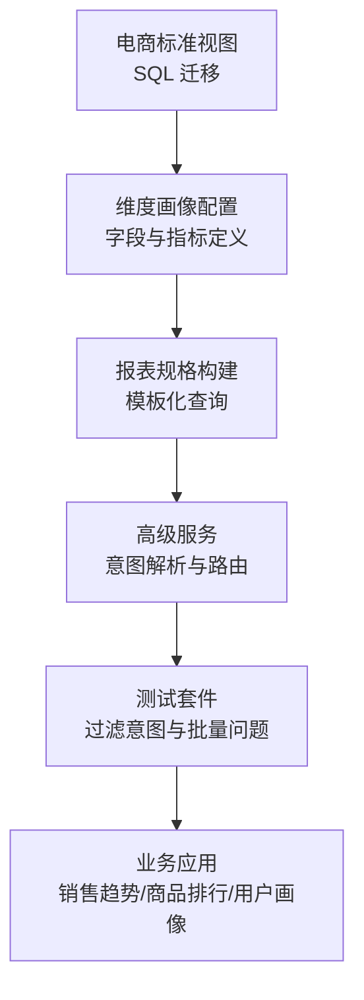
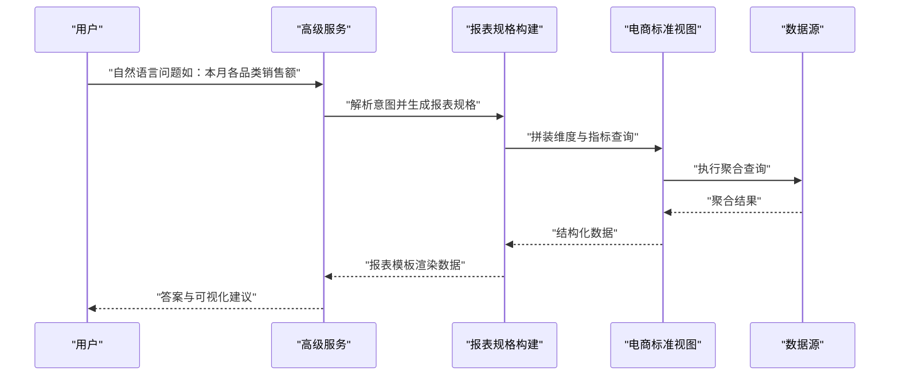
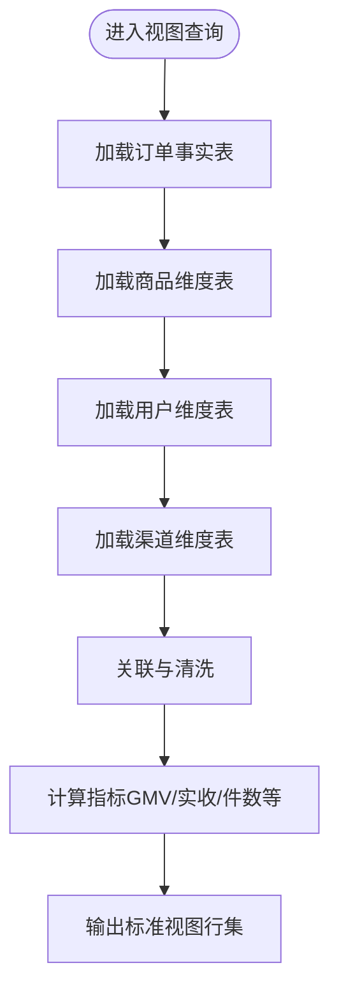
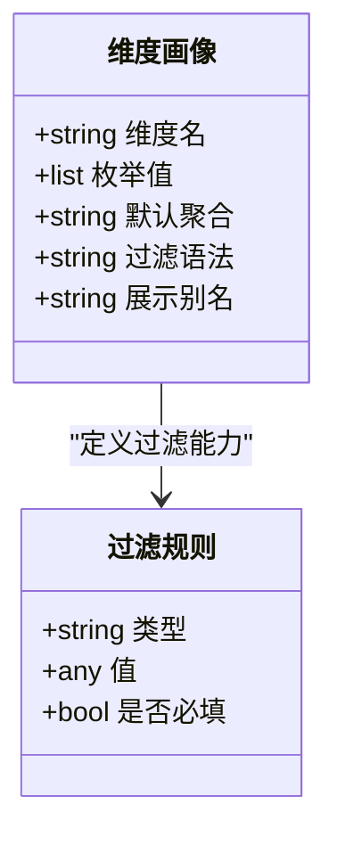
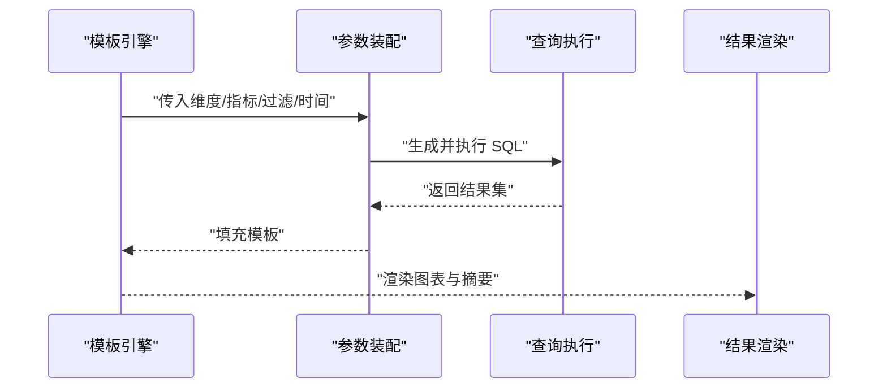
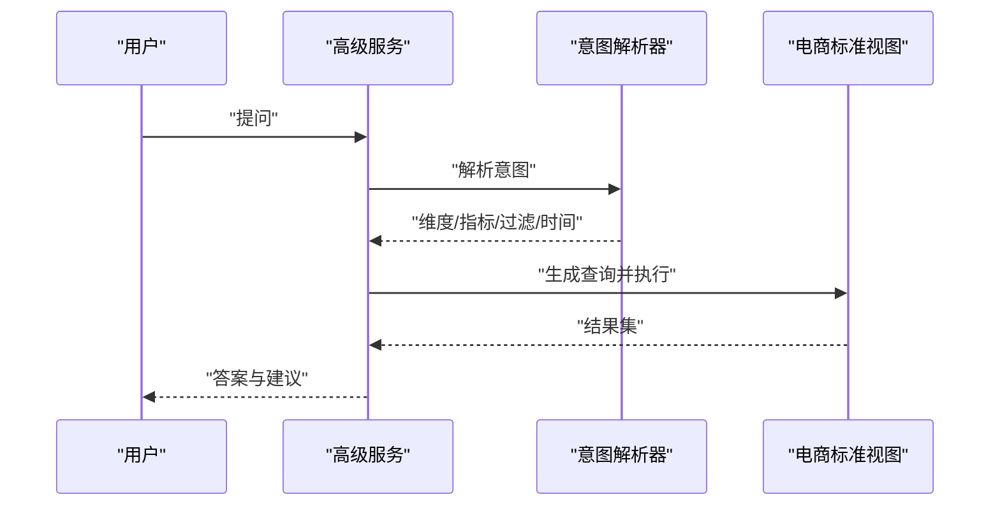
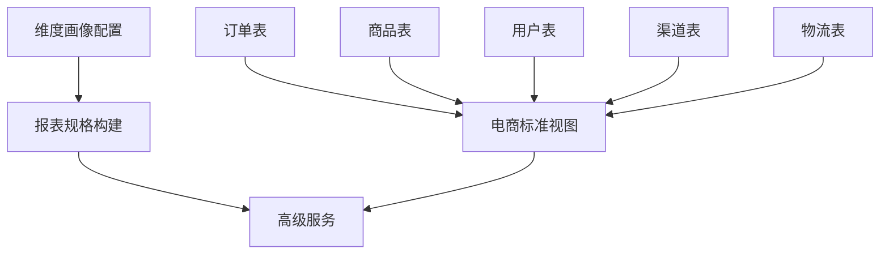

# 电商标准视图结构

<cite>
**本文引用的文件**   
- [20260627_ecommerce_standard_view.sql](file://backend/migrations/20260627_ecommerce_standard_view.sql)
- [dataset_dimension_profiles.py](file://backend/dataset_dimension_profiles.py)
- [test_ecommerce_filter_intent.py](file://backend/tests/test_ecommerce_filter_intent.py)
- [batch_test_ecommerce_questions.py](file://backend/batch_test_ecommerce_questions.py)
- [ecommerce_batch_test_report.md](file://backend/ecommerce_batch_test_report.md)
- [report_spec_builder.py](file://backend/report_spec_builder.py)
- [smartask_advanced/service.py](file://backend/smartask_advanced/service.py)
</cite>

## 目录
1. [简介](#简介)
2. [项目结构](#项目结构)
3. [核心组件](#核心组件)
4. [架构总览](#架构总览)
5. [详细组件分析](#详细组件分析)
6. [依赖关系分析](#依赖关系分析)
7. [性能考虑](#性能考虑)
8. [故障排查指南](#故障排查指南)
9. [结论](#结论)
10. [附录](#附录)

## 简介
本文件面向 SmartAsk 智能问数平台的电商场景，聚焦“电商标准视图（ecommerce_standard_view）”的设计与实现。文档从设计理念、字段映射、多源数据整合、典型查询示例、性能优化与索引设计、扩展点与自定义字段支持等维度进行系统化说明，帮助读者快速理解并高效使用该视图进行电商数据分析。

## 项目结构
围绕电商标准视图的相关代码主要分布在以下位置：
- 数据库迁移脚本：定义视图结构与基础索引
- 维度画像配置：描述维度、指标、过滤项的语义与默认行为
- 测试用例：覆盖电商过滤意图、批量问题执行与报告生成
- 报表规格构建：将视图能力封装为可复用的报表模板
- 高级服务：在运行时解析用户意图、路由到对应数据集与视图

**图表来源** 
- [20260627_ecommerce_standard_view.sql](file://backend/migrations/20260627_ecommerce_standard_view.sql)
- [dataset_dimension_profiles.py](file://backend/dataset_dimension_profiles.py)
- [report_spec_builder.py](file://backend/report_spec_builder.py)
- [smartask_advanced/service.py](file://backend/smartask_advanced/service.py)
- [test_ecommerce_filter_intent.py](file://backend/tests/test_ecommerce_filter_intent.py)
- [batch_test_ecommerce_questions.py](file://backend/batch_test_ecommerce_questions.py)

**章节来源**
- [20260627_ecommerce_standard_view.sql](file://backend/migrations/20260627_ecommerce_standard_view.sql)
- [dataset_dimension_profiles.py](file://backend/dataset_dimension_profiles.py)
- [report_spec_builder.py](file://backend/report_spec_builder.py)
- [smartask_advanced/service.py](file://backend/smartask_advanced/service.py)
- [test_ecommerce_filter_intent.py](file://backend/tests/test_ecommerce_filter_intent.py)
- [batch_test_ecommerce_questions.py](file://backend/batch_test_ecommerce_questions.py)

## 核心组件
- 电商标准视图（ecommerce_standard_view）
  - 统一聚合订单、商品、用户、渠道、时间等关键实体，提供标准化的维度与指标口径
  - 典型维度：时间（年/季度/月/日）、地区、类目、品牌、渠道、会员等级、支付方式等
  - 典型指标：GMV、实收金额、订单数、件数、客单价、转化率、退款率、毛利率等
- 维度画像配置（dataset_dimension_profiles.py）
  - 定义维度枚举、过滤语法、默认聚合方式、展示别名与分组顺序
  - 支撑自然语言到 SQL 的自动转换与校验
- 报表规格构建（report_spec_builder.py）
  - 基于视图生成标准化报表模板（如销售趋势、品类排行、用户画像）
- 高级服务（smartask_advanced/service.py）
  - 解析用户意图、选择数据集、拼接查询条件、返回结果与可视化建议

**章节来源**
- [dataset_dimension_profiles.py](file://backend/dataset_dimension_profiles.py)
- [report_spec_builder.py](file://backend/report_spec_builder.py)
- [smartask_advanced/service.py](file://backend/smartask_advanced/service.py)

## 架构总览
电商标准视图作为数据层的核心抽象，向上暴露统一的查询接口；中间层通过维度画像与报表规格构建标准化查询；上层由高级服务完成意图识别与结果组装。

**图表来源** 
- [smartask_advanced/service.py](file://backend/smartask_advanced/service.py)
- [report_spec_builder.py](file://backend/report_spec_builder.py)
- [20260627_ecommerce_standard_view.sql](file://backend/migrations/20260627_ecommerce_standard_view.sql)

## 详细组件分析

### 电商标准视图设计与字段映射
- 设计理念
  - 以“事实+维度”为核心，将订单、商品、用户、渠道、时间等跨表数据统一到一个宽表视图中，降低查询复杂度
  - 指标口径一致化，避免重复计算与歧义
- 字段映射关系（概念性说明）
  - 订单信息：订单ID、下单时间、支付时间、订单状态、订单金额、优惠金额、实付金额、运费、退款金额、支付方式、配送方式、收货地址、物流公司、物流单号等
  - 商品信息：商品ID、名称、类目、子类目、品牌、规格、单位、成本价、售价、库存、供应商、产地、标签等
  - 用户信息：用户ID、昵称、性别、年龄、会员等级、注册地、注册时间、来源渠道、是否新客、最近购买时间等
  - 销售指标：GMV、实收金额、订单数、件数、客单价、转化率、退款率、毛利率、复购率、退货率等
  - 时间与地理：年、季度、月、周、日、省份、城市、区县、商圈等
- 多源数据整合
  - 通过 JOIN 或 UNION 将订单、商品、用户、渠道、物流等多表数据合并
  - 使用 CASE WHEN 与聚合函数统一口径，保证指标一致性

**图表来源** 
- [20260627_ecommerce_standard_view.sql](file://backend/migrations/20260627_ecommerce_standard_view.sql)

**章节来源**
- [20260627_ecommerce_standard_view.sql](file://backend/migrations/20260627_ecommerce_standard_view.sql)

### 维度画像与过滤语义
- 维度画像配置要点
  - 维度枚举：时间、地区、类目、品牌、渠道、会员等级、支付方式等
  - 过滤语法：支持范围、包含、排除、层级（省/市/区）等
  - 默认聚合：按维度分组时的默认度量与排序规则
- 自然语言到过滤条件的映射
  - “本月”“近7天”“华东地区”“女装类目”“高价值用户”等短语转换为具体过滤条件
  - 校验与回退：当无法解析时给出提示或降级策略

**图表来源** 
- [dataset_dimension_profiles.py](file://backend/dataset_dimension_profiles.py)

**章节来源**
- [dataset_dimension_profiles.py](file://backend/dataset_dimension_profiles.py)

### 报表规格与模板化查询
- 报表规格构建流程
  - 输入：用户意图、维度组合、指标集合、时间窗口、过滤条件
  - 处理：根据模板拼装 SQL，注入维度与指标，应用过滤与排序
  - 输出：结构化结果与可视化建议（折线图、柱状图、排行榜等）
- 典型报表模板
  - 销售趋势：按时间维度聚合 GMV/订单数/件数
  - 商品排行：按类目/品牌/商品维度聚合销售额/销量
  - 用户画像：按会员等级/地域/渠道聚合消费频次/客单价/复购率

**图表来源** 
- [report_spec_builder.py](file://backend/report_spec_builder.py)

**章节来源**
- [report_spec_builder.py](file://backend/report_spec_builder.py)

### 意图解析与服务路由
- 高级服务职责
  - 解析用户问题中的维度、指标、过滤与时间窗口
  - 选择合适的数据集与视图（电商标准视图）
  - 生成查询计划并执行，返回答案与可视化建议
- 错误处理与回退
  - 当意图不明确时，提供选项或澄清问题
  - 当查询失败时，降级为更简单的聚合或提示修正

**图表来源** 
- [smartask_advanced/service.py](file://backend/smartask_advanced/service.py)

**章节来源**
- [smartask_advanced/service.py](file://backend/smartask_advanced/service.py)

### 典型查询示例（概念性说明）
- 销售趋势分析
  - 维度：时间（月/周/日）
  - 指标：GMV、订单数、件数、客单价
  - 过滤：指定时间段、地区、类目
- 商品排行
  - 维度：类目/品牌/商品
  - 指标：销售额、销量、利润率
  - 过滤：时间窗口、渠道、会员等级
- 用户画像
  - 维度：会员等级、地域、渠道
  - 指标：消费频次、客单价、复购率、退款率
  - 过滤：时间窗口、活跃度阈值

[本节为概念性说明，不直接分析具体文件]

## 依赖关系分析
- 视图依赖
  - 订单、商品、用户、渠道、物流等基础表
  - 时间、地区等维度表
- 模块依赖
  - 维度画像配置驱动过滤与聚合逻辑
  - 报表规格构建依赖维度画像与视图字段
  - 高级服务依赖报表规格与视图执行能力

**图表来源** 
- [20260627_ecommerce_standard_view.sql](file://backend/migrations/20260627_ecommerce_standard_view.sql)
- [dataset_dimension_profiles.py](file://backend/dataset_dimension_profiles.py)
- [report_spec_builder.py](file://backend/report_spec_builder.py)
- [smartask_advanced/service.py](file://backend/smartask_advanced/service.py)

**章节来源**
- [20260627_ecommerce_standard_view.sql](file://backend/migrations/20260627_ecommerce_standard_view.sql)
- [dataset_dimension_profiles.py](file://backend/dataset_dimension_profiles.py)
- [report_spec_builder.py](file://backend/report_spec_builder.py)
- [smartask_advanced/service.py](file://backend/smartask_advanced/service.py)

## 性能考虑
- 索引设计建议
  - 时间维度：创建时间相关索引（下单时间、支付时间）
  - 地理维度：省份/城市/区县复合索引
  - 类目与品牌：类目、子类目、品牌索引
  - 用户维度：会员等级、注册地、渠道来源索引
  - 订单维度：订单状态、支付方式、订单金额区间索引
- 查询优化策略
  - 预聚合：对高频指标建立物化视图或汇总表
  - 分区与分片：按时间或地区进行分区，减少扫描范围
  - 过滤下推：尽早应用过滤条件，减少中间结果集
  - 连接优化：合理选择 JOIN 顺序与键，避免笛卡尔积
- 监控与调优
  - 慢查询日志与执行计划分析
  - 缓存热点查询结果
  - 动态调整并发与资源配额

[本节为通用性能指导，不直接分析具体文件]

## 故障排查指南
- 常见问题定位
  - 字段缺失或命名不一致：检查视图定义与维度画像配置
  - 过滤条件无效：确认维度枚举与过滤语法匹配
  - 指标口径异常：核对聚合逻辑与数据来源
- 调试工具与用例
  - 过滤意图测试：验证自然语言到过滤条件的转换
  - 批量问题测试：覆盖典型电商问题，确保稳定性
  - 报告健康检查：验证报表模板与结果一致性

**章节来源**
- [test_ecommerce_filter_intent.py](file://backend/tests/test_ecommerce_filter_intent.py)
- [batch_test_ecommerce_questions.py](file://backend/batch_test_ecommerce_questions.py)
- [ecommerce_batch_test_report.md](file://backend/ecommerce_batch_test_report.md)

## 结论
电商标准视图为 SmartAsk 平台提供了统一、稳定、可扩展的电商数据分析基座。通过一致的字段映射、清晰的维度画像、模板化的报表构建以及强大的意图解析能力，平台能够高效支撑销售趋势、商品排行、用户画像等典型场景。配合合理的索引与查询优化策略，可在大规模数据下保持高性能与稳定性。未来可通过扩展点与自定义字段支持进一步丰富业务语义与查询能力。

## 附录
- 扩展点与自定义字段支持
  - 在维度画像中新增维度与枚举值
  - 在视图定义中扩展字段与计算逻辑
  - 在报表模板中增加新的指标与可视化类型
  - 在高级服务中增强意图解析与路由策略

[本节为概念性说明，不直接分析具体文件]