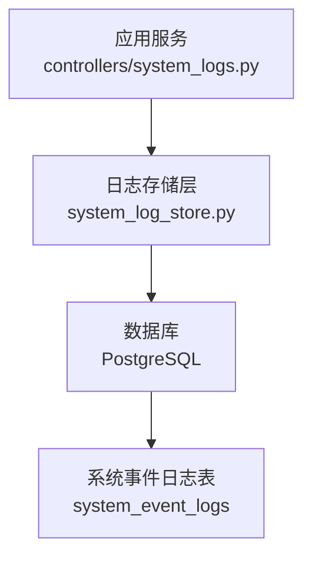
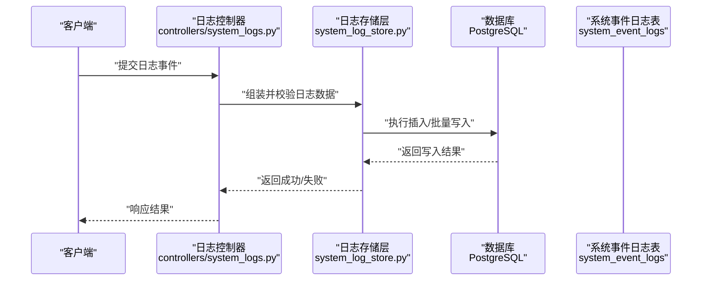
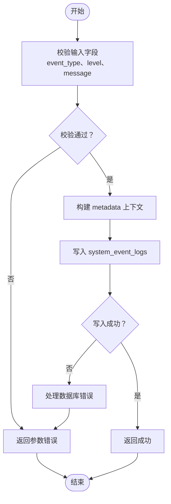
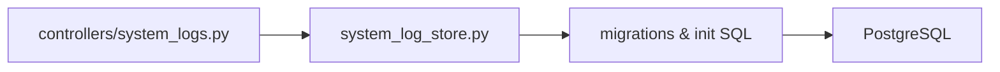

# 系统日志表结构

<cite>
**本文档引用的文件**
- [20260512_system_event_logs.sql](file://backend/migrations/20260512_system_event_logs.sql)
- [006_system_event_logs.sql](file://docker/postgres/init/006_system_event_logs.sql)
- [system_log_store.py](file://backend/system_log_store.py)
- [system_logs.py](file://backend/controllers/system_logs.py)
</cite>

## 目录
1. [简介](#简介)
2. [项目结构](#项目结构)
3. [核心组件](#核心组件)
4. [架构总览](#架构总览)
5. [详细组件分析](#详细组件分析)
6. [依赖关系分析](#依赖关系分析)
7. [性能考虑](#性能考虑)
8. [故障排查指南](#故障排查指南)
9. [结论](#结论)
10. [附录](#附录)

## 简介
本文件面向 SmartAsk 智能问数平台的监控系统，聚焦系统事件日志表 system_event_logs 的表结构与使用规范。文档将详细说明字段定义（如 log_id、event_type、level、message、user_id、session_id、metadata、created_at）的用途与约束；梳理事件类型分类与记录规则（用户操作日志、系统错误日志、性能监控日志等）；提供典型 SQL 查询与分析示例（时间范围过滤、用户行为分析、错误统计等）；并说明日志数据的存储策略、归档机制与清理规则，帮助读者在开发与运维中高效使用与维护该日志体系。

## 项目结构
与 system_event_logs 相关的代码与脚本主要分布在以下位置：
- 数据库迁移脚本：backend/migrations/20260512_system_event_logs.sql、docker/postgres/init/006_system_event_logs.sql
- 后端日志存储实现：backend/system_log_store.py
- 后端日志控制器接口：backend/controllers/system_logs.py

图表来源
- [system_logs.py](file://backend/controllers/system_logs.py)
- [system_log_store.py](file://backend/system_log_store.py)
- [20260512_system_event_logs.sql](file://backend/migrations/20260512_system_event_logs.sql)
- [006_system_event_logs.sql](file://docker/postgres/init/006_system_event_logs.sql)

章节来源
- [20260512_system_event_logs.sql](file://backend/migrations/20260512_system_event_logs.sql)
- [006_system_event_logs.sql](file://docker/postgres/init/006_system_event_logs.sql)
- [system_log_store.py](file://backend/system_log_store.py)
- [system_logs.py](file://backend/controllers/system_logs.py)

## 核心组件
- 系统事件日志表 system_event_logs：用于持久化平台运行过程中的各类事件，包括用户操作、系统错误、性能指标等。
- 日志存储层 system_log_store.py：封装对 system_event_logs 的写入与查询逻辑，统一数据格式与校验。
- 日志控制器 system_logs.py：对外暴露日志写入与查询的 API，供前端或内部服务调用。

章节来源
- [system_log_store.py](file://backend/system_log_store.py)
- [system_logs.py](file://backend/controllers/system_logs.py)

## 架构总览
下图展示了从请求进入控制器到落库的完整链路，以及日志表的核心字段与索引设计思路。

图表来源
- [system_logs.py](file://backend/controllers/system_logs.py)
- [system_log_store.py](file://backend/system_log_store.py)
- [20260512_system_event_logs.sql](file://backend/migrations/20260512_system_event_logs.sql)
- [006_system_event_logs.sql](file://docker/postgres/init/006_system_event_logs.sql)

## 详细组件分析

### 系统事件日志表 system_event_logs 字段定义与约束
- log_id：主键标识，唯一且自增或基于序列生成，确保每条日志可被精确定位。
- event_type：事件类型，枚举值用于区分用户操作、系统错误、性能监控等类别。
- level：日志级别，如 INFO、WARN、ERROR、DEBUG 等，便于分级检索与告警。
- message：消息内容，描述事件的简要信息，支持文本长度限制与编码规范。
- user_id：关联用户标识，用于追踪用户行为与权限审计。
- session_id：会话标识，用于聚合同一会话内的多条日志。
- metadata：扩展元数据，JSON 或结构化字段，用于记录上下文参数、耗时、SQL 片段等。
- created_at：创建时间戳，作为时间维度查询与分区的依据。

建议约束与索引
- 为 event_type、level、created_at、user_id、session_id 建立常用查询索引，提升时间范围过滤与用户行为分析效率。
- metadata 若为 JSON 类型，建议使用 GIN 索引以支持快速条件检索。
- created_at 可用于按时间分区，配合归档与清理策略降低单表规模。

章节来源
- [20260512_system_event_logs.sql](file://backend/migrations/20260512_system_event_logs.sql)
- [006_system_event_logs.sql](file://docker/postgres/init/006_system_event_logs.sql)

### 事件类型分类与记录规则
- 用户操作日志：记录登录、查询、导出、配置变更等行为，event_type 标记为 USER_OPERATION，level 通常为 INFO，需包含 user_id、session_id、message 与必要 metadata。
- 系统错误日志：记录异常、超时、外部依赖失败等，event_type 标记为 SYSTEM_ERROR，level 为 ERROR 或 WARN，message 应包含错误摘要与堆栈关键信息，metadata 可附加错误码与上下文。
- 性能监控日志：记录慢查询、接口耗时、资源占用等，event_type 标记为 PERFORMANCE_METRIC，level 为 INFO 或 WARN，metadata 包含耗时、SQL、缓存命中率等指标。

记录规则要点
- 必填字段：log_id、event_type、level、message、created_at。
- 可选字段：user_id、session_id、metadata，视场景决定是否记录。
- 敏感信息脱敏：message 与 metadata 中不得包含密码、密钥等敏感数据。
- 幂等写入：避免重复上报导致重复记录，必要时通过业务键去重。

章节来源
- [system_log_store.py](file://backend/system_log_store.py)
- [system_logs.py](file://backend/controllers/system_logs.py)

### 日志写入与查询流程

图表来源
- [system_log_store.py](file://backend/system_log_store.py)
- [system_logs.py](file://backend/controllers/system_logs.py)

章节来源
- [system_log_store.py](file://backend/system_log_store.py)
- [system_logs.py](file://backend/controllers/system_logs.py)

### 典型 SQL 查询与分析示例
- 时间范围过滤：按 created_at 筛选指定区间的日志，结合 event_type 与 level 缩小范围。
- 用户行为分析：按 user_id 与 session_id 聚合，统计操作次数、最近活跃时间、高频事件类型。
- 错误统计：按 event_type=SYSTEM_ERROR 与 level=ERROR 分组，统计错误数量、Top 错误消息、发生时段分布。
- 性能分析：按 event_type=PERFORMANCE_METRIC 提取 metadata 中的耗时字段，计算 P95/P99 耗时与慢查询趋势。

注意：具体 SQL 语法与函数取决于数据库方言（如 PostgreSQL），请根据实际环境调整。

章节来源
- [20260512_system_event_logs.sql](file://backend/migrations/20260512_system_event_logs.sql)
- [006_system_event_logs.sql](file://docker/postgres/init/006_system_event_logs.sql)

### 存储策略、归档机制与清理规则
- 存储策略：采用单表或按时间分区表存储，建议按 created_at 进行月/周分区，便于查询与归档。
- 归档机制：将历史数据迁移至归档表或冷存储（如对象存储 + 元数据索引），保留必要的查询能力。
- 清理规则：设定保留周期（如 90 天热数据、180 天温数据、长期归档），定期清理过期数据，释放空间。
- 备份与恢复：结合数据库备份策略，确保日志数据可恢复，满足合规与审计要求。

章节来源
- [20260512_system_event_logs.sql](file://backend/migrations/20260512_system_event_logs.sql)
- [006_system_event_logs.sql](file://docker/postgres/init/006_system_event_logs.sql)

## 依赖关系分析
- 控制器 system_logs.py 依赖存储层 system_log_store.py 完成数据写入与查询。
- 存储层依赖数据库 schema 定义（migrations 与 init 脚本），确保表结构与索引一致。
- 前端或调用方通过控制器 API 访问日志能力，无需感知底层实现细节。

图表来源
- [system_logs.py](file://backend/controllers/system_logs.py)
- [system_log_store.py](file://backend/system_log_store.py)
- [20260512_system_event_logs.sql](file://backend/migrations/20260512_system_event_logs.sql)
- [006_system_event_logs.sql](file://docker/postgres/init/006_system_event_logs.sql)

章节来源
- [system_logs.py](file://backend/controllers/system_logs.py)
- [system_log_store.py](file://backend/system_log_store.py)
- [20260512_system_event_logs.sql](file://backend/migrations/20260512_system_event_logs.sql)
- [006_system_event_logs.sql](file://docker/postgres/init/006_system_event_logs.sql)

## 性能考虑
- 索引优化：为高频率查询字段（event_type、level、created_at、user_id、session_id）建立合适索引。
- 批量写入：在高并发场景下使用批量插入减少事务开销。
- 分区与归档：按时间分区降低单表扫描成本，归档历史数据提升热数据查询性能。
- 元数据检索：metadata 使用 JSON 类型时启用 GIN 索引，避免全表扫描。

[本节为通用性能指导，不直接分析具体文件]

## 故障排查指南
- 写入失败：检查控制器入参校验、存储层事务与数据库连接状态，查看错误日志与重试策略。
- 查询缓慢：确认索引是否命中，分析执行计划，必要时增加复合索引或改写查询。
- 数据不一致：核对 metadata 结构与序列化逻辑，确保跨模块一致性。
- 归档与清理：验证定时任务是否正常运行，检查归档目标存储空间与权限。

章节来源
- [system_log_store.py](file://backend/system_log_store.py)
- [system_logs.py](file://backend/controllers/system_logs.py)

## 结论
system_event_logs 表为 SmartAsk 平台提供了统一的日志基础设施，支撑用户行为审计、错误定位与性能分析。通过规范的字段定义、事件分类与记录规则，结合合理的索引、分区与归档策略，可在保证查询性能的同时满足合规与运维需求。建议在开发中严格遵循记录规则，在运维中持续优化查询与存储策略，确保日志系统的稳定与高效。

[本节为总结性内容，不直接分析具体文件]

## 附录
- 相关脚本与迁移文件路径参考：
  - backend/migrations/20260512_system_event_logs.sql
  - docker/postgres/init/006_system_event_logs.sql
  - backend/system_log_store.py
  - backend/controllers/system_logs.py

[本节为补充信息，不直接分析具体文件]