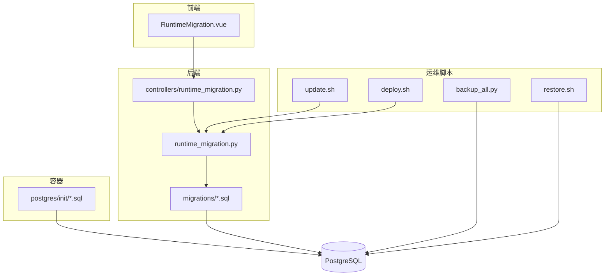
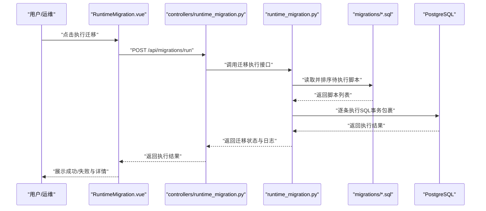
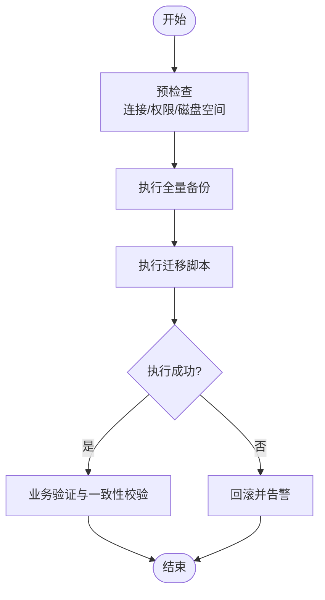
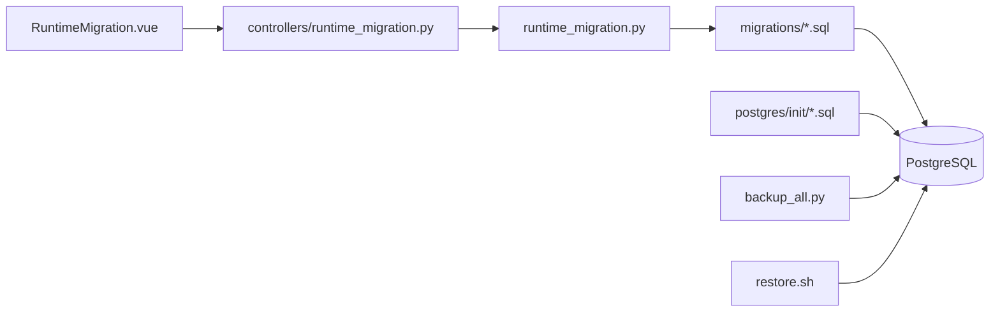

# 迁移管理

<cite>
**本文引用的文件**   
- [backend/migrations/20260330_bookshelf_schema.sql](file://backend/migrations/20260330_bookshelf_schema.sql)
- [backend/migrations/20260330_bookshelf_agent1_prompt_upgrade.sql](file://backend/migrations/20260330_bookshelf_agent1_prompt_upgrade.sql)
- [backend/migrations/20260430_report_config.sql](file://backend/migrations/20260430_report_config.sql)
- [backend/migrations/20260509_report_thresholds.sql](file://backend/migrations/20260509_report_thresholds.sql)
- [backend/migrations/20260512_system_event_logs.sql](file://backend/migrations/20260512_system_event_logs.sql)
- [backend/migrations/20260627_ecommerce_standard_view.sql](file://backend/migrations/20260627_ecommerce_standard_view.sql)
- [backend/migrations/20260630_dataset_transforms.sql](file://backend/migrations/20260630_dataset_transforms.sql)
- [docker/postgres/init/001_bookshelf_schema.sql](file://docker/postgres/init/001_bookshelf_schema.sql)
- [docker/postgres/init/002_angel_group_data.sql](file://docker/postgres/init/002_angel_group_data.sql)
- [docker/postgres/init/003_bookshelf_agent1_prompt_upgrade.sql](file://docker/postgres/init/003_bookshelf_agent1_prompt_upgrade.sql)
- [docker/postgres/init/004_report_config.sql](file://docker/postgres/init/004_report_config.sql)
- [docker/postgres/init/005_report_thresholds.sql](file://docker/postgres/init/005_report_thresholds.sql)
- [docker/postgres/init/006_system_event_logs.sql](file://docker/postgres/init/006_system_event_logs.sql)
- [backend/runtime_migration.py](file://backend/runtime_migration.py)
- [backend/controllers/runtime_migration.py](file://backend/controllers/runtime_migration.py)
- [frontend/src/views/RuntimeMigration.vue](file://frontend/src/views/RuntimeMigration.vue)
- [scripts/backup_all.py](file://scripts/backup_all.py)
- [deploy.sh](file://deploy.sh)
- [update.sh](file://update.sh)
- [restore.sh](file://restore.sh)
</cite>

## 目录
1. [简介](#简介)
2. [项目结构](#项目结构)
3. [核心组件](#核心组件)
4. [架构总览](#架构总览)
5. [详细组件分析](#详细组件分析)
6. [依赖关系分析](#依赖关系分析)
7. [性能考虑](#性能考虑)
8. [故障排查指南](#故障排查指南)
9. [结论](#结论)
10. [附录](#附录)

## 简介
本文件为 SmartAsk 智能问数平台的数据库迁移管理文档，覆盖迁移文件命名规范、版本管理与执行顺序、增量更新策略（表结构变更、数据迁移与回滚）、生产环境部署流程与故障处理、最佳实践（备份、测试、性能评估）、大型数据迁移与在线DDL操作、冲突解决与一致性验证、脚本编写规范与错误排查。目标是帮助研发与运维团队安全、可控地演进数据库结构，保障线上稳定性与可恢复性。

## 项目结构
SmartAsk 的数据库迁移相关资产分布在以下位置：
- 后端迁移脚本：backend/migrations/*.sql
- 容器初始化脚本：docker/postgres/init/*.sql
- 运行时迁移控制器与入口：backend/runtime_migration.py、backend/controllers/runtime_migration.py
- 前端迁移管理页面：frontend/src/views/RuntimeMigration.vue
- 备份与恢复脚本：scripts/backup_all.py、restore.sh
- 部署与更新脚本：deploy.sh、update.sh

图表来源
- [backend/runtime_migration.py](file://backend/runtime_migration.py)
- [backend/controllers/runtime_migration.py](file://backend/controllers/runtime_migration.py)
- [backend/migrations/20260330_bookshelf_schema.sql](file://backend/migrations/20260330_bookshelf_schema.sql)
- [docker/postgres/init/001_bookshelf_schema.sql](file://docker/postgres/init/001_bookshelf_schema.sql)
- [scripts/backup_all.py](file://scripts/backup_all.py)
- [deploy.sh](file://deploy.sh)
- [update.sh](file://update.sh)
- [restore.sh](file://restore.sh)

章节来源
- [backend/migrations/20260330_bookshelf_schema.sql](file://backend/migrations/20260330_bookshelf_schema.sql)
- [backend/migrations/20260430_report_config.sql](file://backend/migrations/20260430_report_config.sql)
- [backend/migrations/20260509_report_thresholds.sql](file://backend/migrations/20260509_report_thresholds.sql)
- [backend/migrations/20260512_system_event_logs.sql](file://backend/migrations/20260512_system_event_logs.sql)
- [backend/migrations/20260627_ecommerce_standard_view.sql](file://backend/migrations/20260627_ecommerce_standard_view.sql)
- [backend/migrations/20260630_dataset_transforms.sql](file://backend/migrations/20260630_dataset_transforms.sql)
- [docker/postgres/init/001_bookshelf_schema.sql](file://docker/postgres/init/001_bookshelf_schema.sql)
- [docker/postgres/init/002_angel_group_data.sql](file://docker/postgres/init/002_angel_group_data.sql)
- [docker/postgres/init/003_bookshelf_agent1_prompt_upgrade.sql](file://docker/postgres/init/003_bookshelf_agent1_prompt_upgrade.sql)
- [docker/postgres/init/004_report_config.sql](file://docker/postgres/init/004_report_config.sql)
- [docker/postgres/init/005_report_thresholds.sql](file://docker/postgres/init/005_report_thresholds.sql)
- [docker/postgres/init/006_system_event_logs.sql](file://docker/postgres/init/006_system_event_logs.sql)
- [backend/runtime_migration.py](file://backend/runtime_migration.py)
- [backend/controllers/runtime_migration.py](file://backend/controllers/runtime_migration.py)
- [frontend/src/views/RuntimeMigration.vue](file://frontend/src/views/RuntimeMigration.vue)
- [scripts/backup_all.py](file://scripts/backup_all.py)
- [deploy.sh](file://deploy.sh)
- [update.sh](file://update.sh)
- [restore.sh](file://restore.sh)

## 核心组件
- 迁移脚本集合（SQL）：按日期前缀组织，保证时间顺序与可追溯性；包含建表、视图、索引、数据修正等。
- 运行时迁移控制器：提供API或CLI能力，用于在应用启动或运维流程中触发迁移执行与状态查询。
- 前端迁移管理界面：可视化查看迁移状态、触发执行、查看日志与结果。
- 容器初始化脚本：用于本地/开发环境的数据库初始化，确保镜像内数据库结构与代码一致。
- 备份与恢复脚本：在执行迁移前后进行数据备份与快速回滚。
- 部署与更新脚本：编排迁移执行的时机与顺序，确保服务可用性与幂等性。

章节来源
- [backend/runtime_migration.py](file://backend/runtime_migration.py)
- [backend/controllers/runtime_migration.py](file://backend/controllers/runtime_migration.py)
- [frontend/src/views/RuntimeMigration.vue](file://frontend/src/views/RuntimeMigration.vue)
- [scripts/backup_all.py](file://scripts/backup_all.py)
- [deploy.sh](file://deploy.sh)
- [update.sh](file://update.sh)
- [restore.sh](file://restore.sh)

## 架构总览
下图展示从前端到后端再到数据库的迁移执行链路，以及容器初始化与备份恢复的集成点。

图表来源
- [frontend/src/views/RuntimeMigration.vue](file://frontend/src/views/RuntimeMigration.vue)
- [backend/controllers/runtime_migration.py](file://backend/controllers/runtime_migration.py)
- [backend/runtime_migration.py](file://backend/runtime_migration.py)
- [backend/migrations/20260330_bookshelf_schema.sql](file://backend/migrations/20260330_bookshelf_schema.sql)
- [backend/migrations/20260430_report_config.sql](file://backend/migrations/20260430_report_config.sql)
- [backend/migrations/20260509_report_thresholds.sql](file://backend/migrations/20260509_report_thresholds.sql)
- [backend/migrations/20260512_system_event_logs.sql](file://backend/migrations/20260512_system_event_logs.sql)
- [backend/migrations/20260627_ecommerce_standard_view.sql](file://backend/migrations/20260627_ecommerce_standard_view.sql)
- [backend/migrations/20260630_dataset_transforms.sql](file://backend/migrations/20260630_dataset_transforms.sql)

## 详细组件分析

### 迁移文件命名与版本管理
- 命名规范：采用“YYYYMMDD_描述.sql”形式，例如“20260330_bookshelf_schema.sql”。该格式天然支持按时间排序，避免并发与顺序问题。
- 版本管理：每个迁移文件代表一次不可逆的结构或数据变更。通过文件名中的日期作为版本号，结合执行记录（由运行时迁移组件维护）确保幂等执行。
- 执行顺序：按文件名升序执行，确保历史变更按时间线推进。

章节来源
- [backend/migrations/20260330_bookshelf_schema.sql](file://backend/migrations/20260330_bookshelf_schema.sql)
- [backend/migrations/20260330_bookshelf_agent1_prompt_upgrade.sql](file://backend/migrations/20260330_bookshelf_agent1_prompt_upgrade.sql)
- [backend/migrations/20260430_report_config.sql](file://backend/migrations/20260430_report_config.sql)
- [backend/migrations/20260509_report_thresholds.sql](file://backend/migrations/20260509_report_thresholds.sql)
- [backend/migrations/20260512_system_event_logs.sql](file://backend/migrations/20260512_system_event_logs.sql)
- [backend/migrations/20260627_ecommerce_standard_view.sql](file://backend/migrations/20260627_ecommerce_standard_view.sql)
- [backend/migrations/20260630_dataset_transforms.sql](file://backend/migrations/20260630_dataset_transforms.sql)

### 增量更新策略（结构变更、数据迁移、回滚）
- 结构变更：优先使用幂等的DDL语句（如IF NOT EXISTS），避免重复执行报错。对索引与约束变更建议分步执行，降低锁竞争。
- 数据迁移：大表数据修正应分批提交，避免长事务导致锁膨胀与主从延迟。必要时引入中间表与双写过渡。
- 回滚机制：每次迁移以事务包裹，失败自动回滚。对于已上线且无法回滚的变更，需准备反向脚本与数据修复方案。

章节来源
- [backend/runtime_migration.py](file://backend/runtime_migration.py)
- [backend/controllers/runtime_migration.py](file://backend/controllers/runtime_migration.py)

### 生产环境部署流程与故障处理
- 部署前：执行全量备份（逻辑备份），确认目标库连接与权限。
- 部署时：通过部署脚本触发迁移执行，监控执行日志与数据库指标。
- 异常处理：若迁移失败，立即回滚并告警；检查脚本幂等性与依赖关系；必要时回退至备份快照。
- 发布后：验证关键业务路径与报表输出，确保数据一致性。

图表来源
- [deploy.sh](file://deploy.sh)
- [update.sh](file://update.sh)
- [scripts/backup_all.py](file://scripts/backup_all.py)
- [restore.sh](file://restore.sh)

### 容器初始化与开发环境一致性
- 容器初始化脚本位于 docker/postgres/init，用于新实例快速构建一致的数据库结构。
- 与后端迁移脚本保持同步，避免开发与生产差异。

章节来源
- [docker/postgres/init/001_bookshelf_schema.sql](file://docker/postgres/init/001_bookshelf_schema.sql)
- [docker/postgres/init/002_angel_group_data.sql](file://docker/postgres/init/002_angel_group_data.sql)
- [docker/postgres/init/003_bookshelf_agent1_prompt_upgrade.sql](file://docker/postgres/init/003_bookshelf_agent1_prompt_upgrade.sql)
- [docker/postgres/init/004_report_config.sql](file://docker/postgres/init/004_report_config.sql)
- [docker/postgres/init/005_report_thresholds.sql](file://docker/postgres/init/005_report_thresholds.sql)
- [docker/postgres/init/006_system_event_logs.sql](file://docker/postgres/init/006_system_event_logs.sql)

### 前端迁移管理界面
- RuntimeMigration.vue 提供可视化操作入口，便于非技术人员触发迁移、查看状态与日志。
- 与后端控制器对接，实现异步执行与结果反馈。

章节来源
- [frontend/src/views/RuntimeMigration.vue](file://frontend/src/views/RuntimeMigration.vue)
- [backend/controllers/runtime_migration.py](file://backend/controllers/runtime_migration.py)

## 依赖关系分析
- 前端依赖后端控制器API，控制器依赖运行时迁移模块，后者负责扫描并执行SQL脚本。
- 容器初始化脚本独立于运行时迁移，主要用于新环境初始化。
- 备份与恢复脚本与数据库直接交互，不依赖应用层。

图表来源
- [frontend/src/views/RuntimeMigration.vue](file://frontend/src/views/RuntimeMigration.vue)
- [backend/controllers/runtime_migration.py](file://backend/controllers/runtime_migration.py)
- [backend/runtime_migration.py](file://backend/runtime_migration.py)
- [backend/migrations/20260330_bookshelf_schema.sql](file://backend/migrations/20260330_bookshelf_schema.sql)
- [docker/postgres/init/001_bookshelf_schema.sql](file://docker/postgres/init/001_bookshelf_schema.sql)
- [scripts/backup_all.py](file://scripts/backup_all.py)
- [restore.sh](file://restore.sh)

## 性能考虑
- 大表DDL：尽量使用在线DDL（PostgreSQL 11+支持部分在线ALTER），避免长时间锁表；必要时在低峰期执行。
- 批量数据更新：分批次提交，控制单次事务大小，减少锁竞争与内存占用。
- 索引重建：先删除旧索引再创建新索引，或使用CONCURRENTLY方式（PostgreSQL特性）。
- 监控指标：关注锁等待、慢查询、主从复制延迟、磁盘I/O与CPU峰值。

## 故障排查指南
- 常见错误
  - 脚本非幂等导致重复执行失败：检查IF NOT EXISTS与唯一约束。
  - 长事务导致锁膨胀：拆分大事务，增加提交频率。
  - 主从延迟引发读不一致：迁移期间限制读流量或暂停只读副本。
- 定位方法
  - 查看迁移执行日志与数据库错误日志。
  - 检查事务状态与锁信息，定位阻塞源。
  - 对比备份与当前数据，验证一致性。
- 恢复步骤
  - 使用备份脚本恢复至迁移前快照。
  - 修复脚本后重新执行，确保幂等。

章节来源
- [scripts/backup_all.py](file://scripts/backup_all.py)
- [restore.sh](file://restore.sh)

## 结论
通过规范的命名与版本管理、幂等的增量更新策略、完善的备份与回滚机制，以及可视化的迁移管理界面，SmartAsk 能够安全高效地演进数据库结构。在生产环境中，严格遵循部署流程与故障处理预案，配合性能优化与一致性验证，可显著降低迁移风险，保障系统稳定运行。

## 附录

### 迁移脚本编写规范
- 幂等性：所有DDL与DML必须支持重复执行而不报错。
- 事务包裹：单个迁移文件以事务为单位，失败即回滚。
- 注释说明：每条变更附注目的、影响范围与回滚方案。
- 依赖声明：明确与其他脚本的依赖关系，避免循环依赖。
- 性能提示：大表操作注明分批策略与执行窗口。

### 大型数据迁移与在线DDL操作
- 分批更新：按主键范围或时间分区分批提交，避免长事务。
- 双写过渡：新增字段时先双写，再逐步迁移历史数据，最后切换读取路径。
- 在线DDL：使用PostgreSQL的在线特性，减少锁表时间；必要时在低峰期执行。

### 迁移冲突解决与数据一致性验证
- 冲突解决：合并脚本时统一命名与顺序，避免重复定义；使用条件语句处理分支差异。
- 一致性验证：对比关键字段统计值、抽样校验、业务报表比对，确保无数据丢失或错乱。

### 生产部署清单
- 备份：执行全量逻辑备份并验证可恢复性。
- 预检：检查连接、权限、磁盘空间与数据库版本。
- 执行：通过部署脚本触发迁移，监控日志与指标。
- 验证：核心业务路径与报表输出验证。
- 回滚：准备回滚脚本与快照，失败即回滚。

章节来源
- [deploy.sh](file://deploy.sh)
- [update.sh](file://update.sh)
- [scripts/backup_all.py](file://scripts/backup_all.py)
- [restore.sh](file://restore.sh)