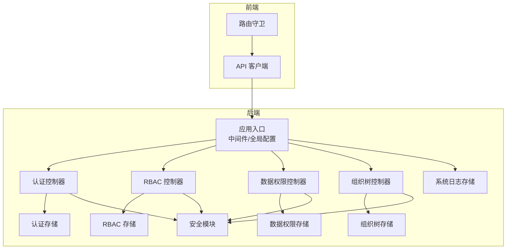
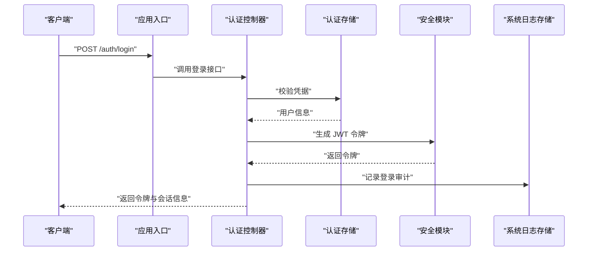
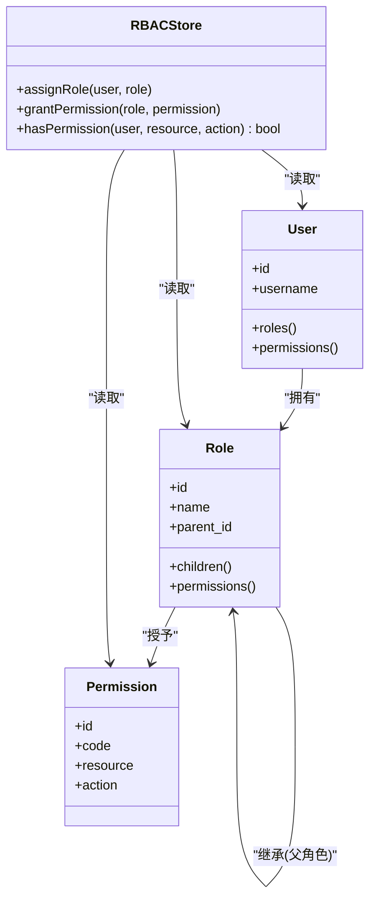
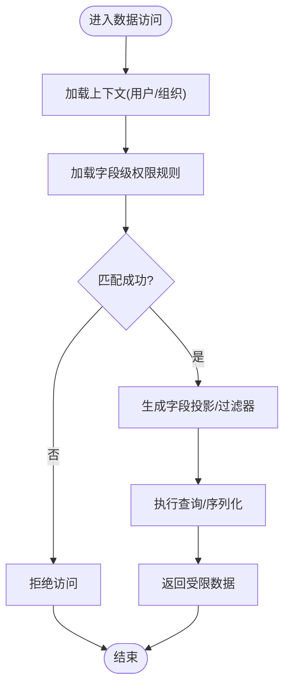
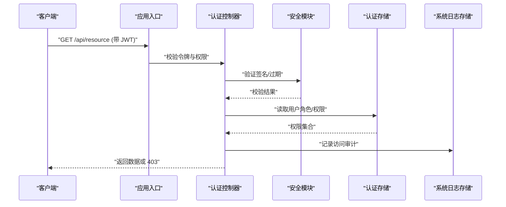
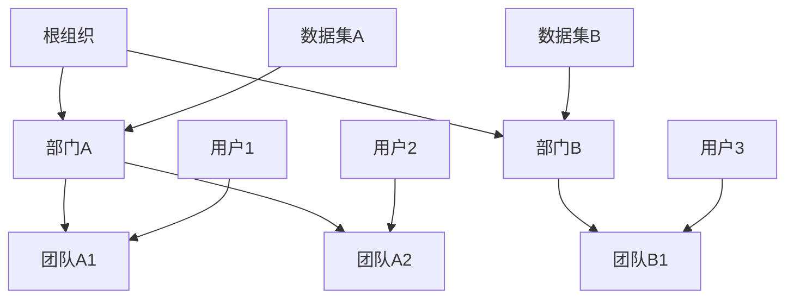
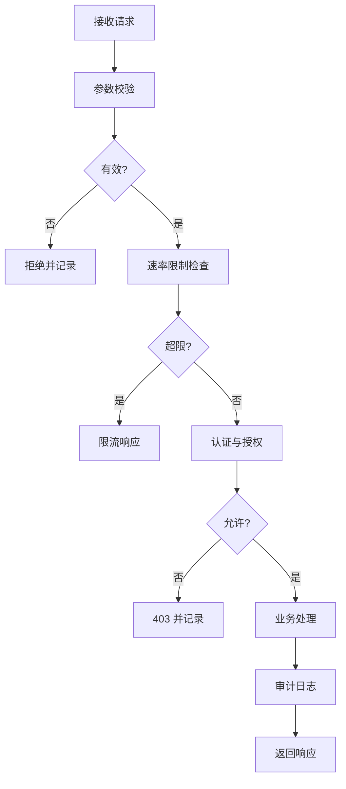
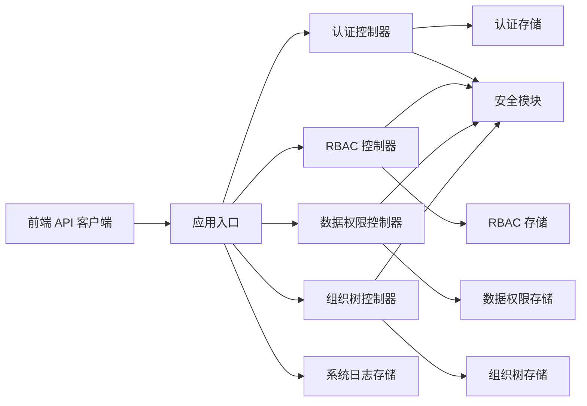

# 安全架构设计

<cite>
**本文引用的文件**   
- [backend/controllers/auth.py](file://backend/controllers/auth.py)
- [backend/controllers/rbac.py](file://backend/controllers/rbac.py)
- [backend/controllers/data_permissions.py](file://backend/controllers/data_permissions.py)
- [backend/controllers/organization_trees.py](file://backend/controllers/organization_trees.py)
- [backend/security.py](file://backend/security.py)
- [backend/auth_store.py](file://backend/auth_store.py)
- [backend/rbac_store.py](file://backend/rbac_store.py)
- [backend/data_permission_store.py](file://backend/data_permission_store.py)
- [backend/organization_tree_store.py](file://backend/organization_tree_store.py)
- [backend/system_log_store.py](file://backend/system_log_store.py)
- [backend/app.py](file://backend/app.py)
- [backend/config_manager.py](file://backend/config_manager.py)
- [backend/secret_codec.py](file://backend/secret_codec.py)
- [frontend/src/api/index.js](file://frontend/src/api/index.js)
- [frontend/src/router/index.js](file://frontend/src/router/index.js)
- [docker/postgres/init/001_bookshelf_schema.sql](file://docker/postgres/init/001_bookshelf_schema.sql)
</cite>

## 目录
1. [引言](#引言)
2. [项目结构](#项目结构)
3. [核心组件](#核心组件)
4. [架构总览](#架构总览)
5. [详细组件分析](#详细组件分析)
6. [依赖关系分析](#依赖关系分析)
7. [性能考量](#性能考量)
8. [故障排查指南](#故障排查指南)
9. [结论](#结论)
10. [附录](#附录)

## 引言
本文件为 SmartAsk 智能问数平台的安全架构设计文档，聚焦以下目标：
- 基于角色的访问控制（RBAC）模型与继承关系
- 字段级权限控制机制与细粒度数据访问
- 认证授权流程、JWT Token 管理与会话安全
- 数据安全策略：敏感信息加密、SQL 注入防护、XSS 防护
- API 安全：请求验证、速率限制、审计日志
- 组织树权限模型：多层级数据隔离与权限继承
- 安全架构图展示各组件协作与威胁防护策略

## 项目结构
后端采用分层架构：控制器层负责 HTTP 路由与鉴权校验；存储层负责持久化 RBAC、数据权限、组织树等；安全模块提供通用能力（如加密、令牌处理）。前端通过统一的 API 客户端发起请求并管理会话。

图表来源
- [backend/app.py](file://backend/app.py)
- [backend/controllers/auth.py](file://backend/controllers/auth.py)
- [backend/controllers/rbac.py](file://backend/controllers/rbac.py)
- [backend/controllers/data_permissions.py](file://backend/controllers/data_permissions.py)
- [backend/controllers/organization_trees.py](file://backend/controllers/organization_trees.py)
- [backend/security.py](file://backend/security.py)
- [backend/auth_store.py](file://backend/auth_store.py)
- [backend/rbac_store.py](file://backend/rbac_store.py)
- [backend/data_permission_store.py](file://backend/data_permission_store.py)
- [backend/organization_tree_store.py](file://backend/organization_tree_store.py)
- [backend/system_log_store.py](file://backend/system_log_store.py)

章节来源
- [backend/app.py](file://backend/app.py)
- [backend/controllers/auth.py](file://backend/controllers/auth.py)
- [backend/controllers/rbac.py](file://backend/controllers/rbac.py)
- [backend/controllers/data_permissions.py](file://backend/controllers/data_permissions.py)
- [backend/controllers/organization_trees.py](file://backend/controllers/organization_trees.py)
- [backend/security.py](file://backend/security.py)
- [backend/auth_store.py](file://backend/auth_store.py)
- [backend/rbac_store.py](file://backend/rbac_store.py)
- [backend/data_permission_store.py](file://backend/data_permission_store.py)
- [backend/organization_tree_store.py](file://backend/organization_tree_store.py)
- [backend/system_log_store.py](file://backend/system_log_store.py)

## 核心组件
- 认证控制器：登录、登出、刷新令牌、会话状态校验
- RBAC 控制器：用户-角色-权限的分配与查询，支持角色继承
- 数据权限控制器：字段级权限、行级过滤、条件表达式解析
- 组织树控制器：组织架构维护、成员归属、层级权限继承
- 安全模块：JWT 签发与校验、签名密钥管理、输入清洗、加密工具
- 存储层：认证会话、RBAC 关系、数据权限规则、组织树节点、审计日志

章节来源
- [backend/controllers/auth.py](file://backend/controllers/auth.py)
- [backend/controllers/rbac.py](file://backend/controllers/rbac.py)
- [backend/controllers/data_permissions.py](file://backend/controllers/data_permissions.py)
- [backend/controllers/organization_trees.py](file://backend/controllers/organization_trees.py)
- [backend/security.py](file://backend/security.py)
- [backend/auth_store.py](file://backend/auth_store.py)
- [backend/rbac_store.py](file://backend/rbac_store.py)
- [backend/data_permission_store.py](file://backend/data_permission_store.py)
- [backend/organization_tree_store.py](file://backend/organization_tree_store.py)
- [backend/system_log_store.py](file://backend/system_log_store.py)

## 架构总览
SmartAsk 的安全架构以“认证—授权—数据访问—审计”为主线，结合组织树实现多租户/多层级数据隔离。

图表来源
- [backend/controllers/auth.py](file://backend/controllers/auth.py)
- [backend/auth_store.py](file://backend/auth_store.py)
- [backend/security.py](file://backend/security.py)
- [backend/system_log_store.py](file://backend/system_log_store.py)

## 详细组件分析

### RBAC 模型与继承关系
- 实体与关系：用户、角色、权限；支持角色继承链，权限聚合到角色，用户通过角色获得权限
- 数据结构要点：用户-角色映射表、角色-权限映射表、角色父角色关系表
- 复杂度分析：权限计算采用闭包或路径枚举，查询时间复杂度近似 O(log n) 或 O(1)（取决于索引与缓存）
- 优化建议：预计算权限集、使用位图或集合缓存、避免重复计算

图表来源
- [backend/controllers/rbac.py](file://backend/controllers/rbac.py)
- [backend/rbac_store.py](file://backend/rbac_store.py)

章节来源
- [backend/controllers/rbac.py](file://backend/controllers/rbac.py)
- [backend/rbac_store.py](file://backend/rbac_store.py)

### 字段级权限控制机制
- 目标：对同一资源的不同字段进行细粒度访问控制（读/写/隐藏）
- 实现思路：在数据权限存储中定义字段级规则，结合组织树上下文动态裁剪输出字段
- 关键流程：解析请求上下文 → 加载用户权限 → 匹配字段规则 → 生成投影/过滤器 → 返回结果
- 复杂度：字段匹配与投影通常为 O(n)（n 为字段数量），可通过索引与缓存优化

图表来源
- [backend/controllers/data_permissions.py](file://backend/controllers/data_permissions.py)
- [backend/data_permission_store.py](file://backend/data_permission_store.py)

章节来源
- [backend/controllers/data_permissions.py](file://backend/controllers/data_permissions.py)
- [backend/data_permission_store.py](file://backend/data_permission_store.py)

### 认证授权流程与 JWT 管理
- 登录流程：校验凭据 → 生成 JWT → 写入会话 → 审计记录
- 令牌管理：签发、刷新、撤销、过期策略；签名算法与密钥轮换
- 会话安全：最小化会话信息、绑定 IP/UA（可选）、防重放攻击
- 授权校验：每个受保护端点检查 JWT 与权限

图表来源
- [backend/controllers/auth.py](file://backend/controllers/auth.py)
- [backend/security.py](file://backend/security.py)
- [backend/auth_store.py](file://backend/auth_store.py)
- [backend/system_log_store.py](file://backend/system_log_store.py)

章节来源
- [backend/controllers/auth.py](file://backend/controllers/auth.py)
- [backend/security.py](file://backend/security.py)
- [backend/auth_store.py](file://backend/auth_store.py)
- [backend/system_log_store.py](file://backend/system_log_store.py)

### 组织树权限模型与数据隔离
- 模型：组织节点、父子关系、成员归属；权限沿组织树向下继承
- 数据隔离：按组织节点划分数据集/视图，查询时附加组织上下文过滤
- 继承策略：子节点继承父节点权限，可覆盖或扩展
- 复杂度：组织树遍历 O(n)，权限合并可使用缓存与增量更新

图表来源
- [backend/controllers/organization_trees.py](file://backend/controllers/organization_trees.py)
- [backend/organization_tree_store.py](file://backend/organization_tree_store.py)

章节来源
- [backend/controllers/organization_trees.py](file://backend/controllers/organization_trees.py)
- [backend/organization_tree_store.py](file://backend/organization_tree_store.py)

### API 安全设计
- 请求验证：参数类型、长度、格式校验；白名单机制
- 速率限制：按用户/IP/接口维度限流，防止滥用与暴力破解
- 审计日志：登录、权限变更、数据访问、错误事件全量记录
- 前端配合：统一 API 客户端携带令牌、拦截器处理 401/403、路由守卫校验权限

图表来源
- [backend/app.py](file://backend/app.py)
- [backend/system_log_store.py](file://backend/system_log_store.py)
- [frontend/src/api/index.js](file://frontend/src/api/index.js)
- [frontend/src/router/index.js](file://frontend/src/router/index.js)

章节来源
- [backend/app.py](file://backend/app.py)
- [backend/system_log_store.py](file://backend/system_log_store.py)
- [frontend/src/api/index.js](file://frontend/src/api/index.js)
- [frontend/src/router/index.js](file://frontend/src/router/index.js)

### 数据安全策略
- 敏感信息加密：配置文件与密钥使用加密存储，运行时解密；传输层强制 HTTPS
- SQL 注入防护：参数化查询、ORM 白名单、禁止拼接 SQL
- XSS 防护：输出编码、内容安全策略（CSP）、输入清洗
- 密钥管理：集中化管理、定期轮换、最小权限原则

章节来源
- [backend/security.py](file://backend/security.py)
- [backend/config_manager.py](file://backend/config_manager.py)
- [backend/secret_codec.py](file://backend/secret_codec.py)

## 依赖关系分析
- 控制器依赖存储层与安全模块；存储层依赖数据库与缓存
- 前端依赖后端 API 与路由守卫；网关/中间件负责全局安全策略
- 审计日志贯穿认证、授权、数据访问全流程

图表来源
- [backend/app.py](file://backend/app.py)
- [backend/controllers/auth.py](file://backend/controllers/auth.py)
- [backend/controllers/rbac.py](file://backend/controllers/rbac.py)
- [backend/controllers/data_permissions.py](file://backend/controllers/data_permissions.py)
- [backend/controllers/organization_trees.py](file://backend/controllers/organization_trees.py)
- [backend/auth_store.py](file://backend/auth_store.py)
- [backend/rbac_store.py](file://backend/rbac_store.py)
- [backend/data_permission_store.py](file://backend/data_permission_store.py)
- [backend/organization_tree_store.py](file://backend/organization_tree_store.py)
- [backend/system_log_store.py](file://backend/system_log_store.py)
- [backend/security.py](file://backend/security.py)

章节来源
- [backend/app.py](file://backend/app.py)
- [backend/controllers/auth.py](file://backend/controllers/auth.py)
- [backend/controllers/rbac.py](file://backend/controllers/rbac.py)
- [backend/controllers/data_permissions.py](file://backend/controllers/data_permissions.py)
- [backend/controllers/organization_trees.py](file://backend/controllers/organization_trees.py)
- [backend/auth_store.py](file://backend/auth_store.py)
- [backend/rbac_store.py](file://backend/rbac_store.py)
- [backend/data_permission_store.py](file://backend/data_permission_store.py)
- [backend/organization_tree_store.py](file://backend/organization_tree_store.py)
- [backend/system_log_store.py](file://backend/system_log_store.py)
- [backend/security.py](file://backend/security.py)

## 性能考量
- 权限计算缓存：用户权限集与角色继承闭包缓存，减少重复计算
- 字段级投影优化：按需投影字段，降低网络与序列化开销
- 组织树遍历优化：预构建邻接表与路径缓存，支持快速祖先/后代查询
- 审计日志异步化：批量写入与落盘策略，避免阻塞主流程
- 令牌校验优化：本地签名校验优先，必要时再查存储

[本节为通用指导，不直接分析具体文件]

## 故障排查指南
- 认证失败：检查 JWT 签名、过期时间、密钥配置；查看登录审计日志
- 权限不足：确认用户-角色-权限映射是否正确；检查组织树成员归属
- 字段缺失：核对字段级权限规则与上下文组织节点；查看数据权限存储
- 速率限制触发：检查限流策略与阈值；定位高频请求来源
- 敏感信息泄露：核查加密配置与传输协议；审查日志脱敏

章节来源
- [backend/system_log_store.py](file://backend/system_log_store.py)
- [backend/security.py](file://backend/security.py)
- [backend/config_manager.py](file://backend/config_manager.py)

## 结论
SmartAsk 的安全架构以 RBAC 为核心，结合字段级权限与组织树模型，形成多层次、细粒度的访问控制体系。通过 JWT 令牌管理、输入校验、加密与审计，全面覆盖认证、授权、数据安全与 API 安全。建议在部署阶段强化密钥管理、启用 HTTPS、实施严格的速率限制与审计策略，持续监控与优化权限计算性能。

[本节为总结性内容，不直接分析具体文件]

## 附录
- 数据库初始化脚本参考：用于理解基础 schema 与约束
- 前端路由守卫与 API 客户端示例：用于理解客户端侧安全实践

章节来源
- [docker/postgres/init/001_bookshelf_schema.sql](file://docker/postgres/init/001_bookshelf_schema.sql)
- [frontend/src/router/index.js](file://frontend/src/router/index.js)
- [frontend/src/api/index.js](file://frontend/src/api/index.js)