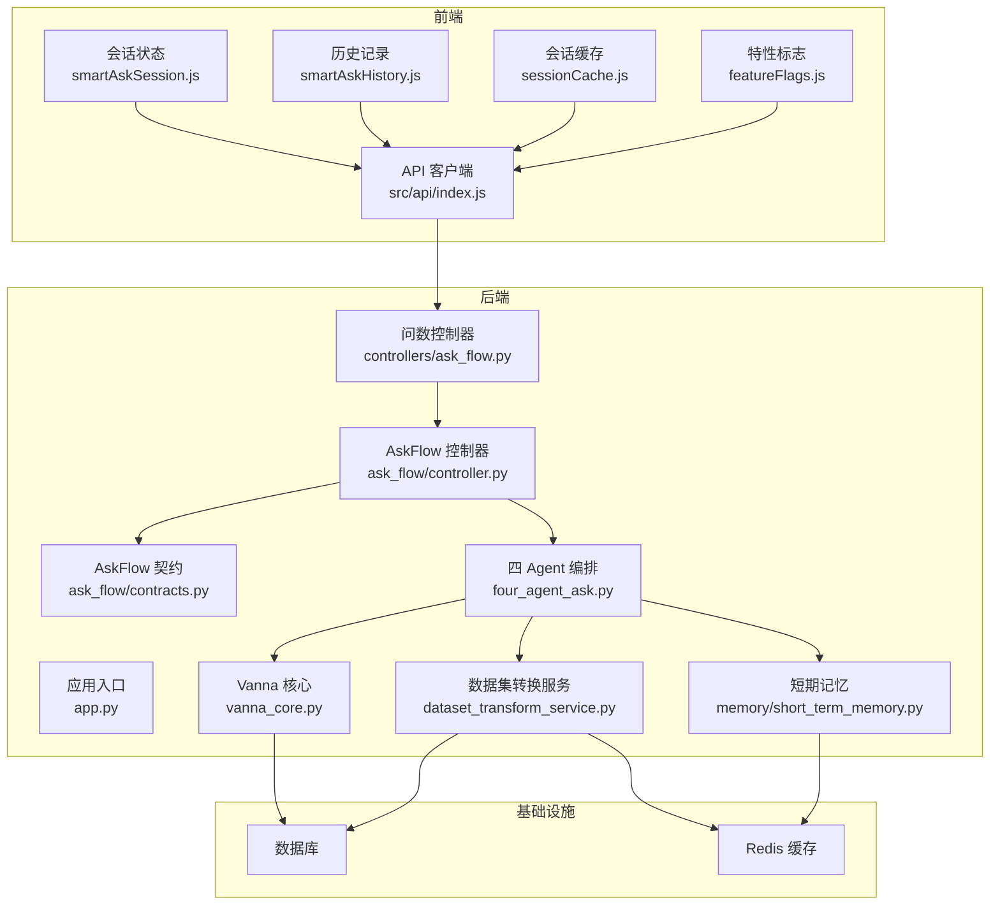
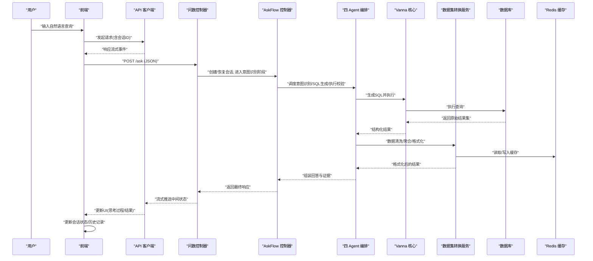
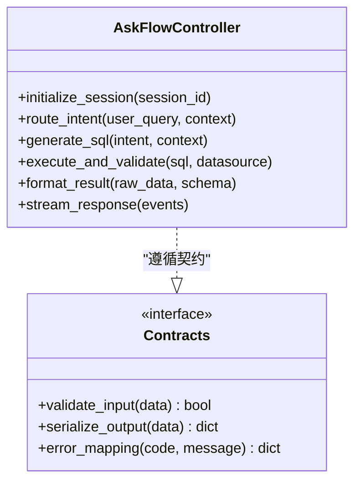
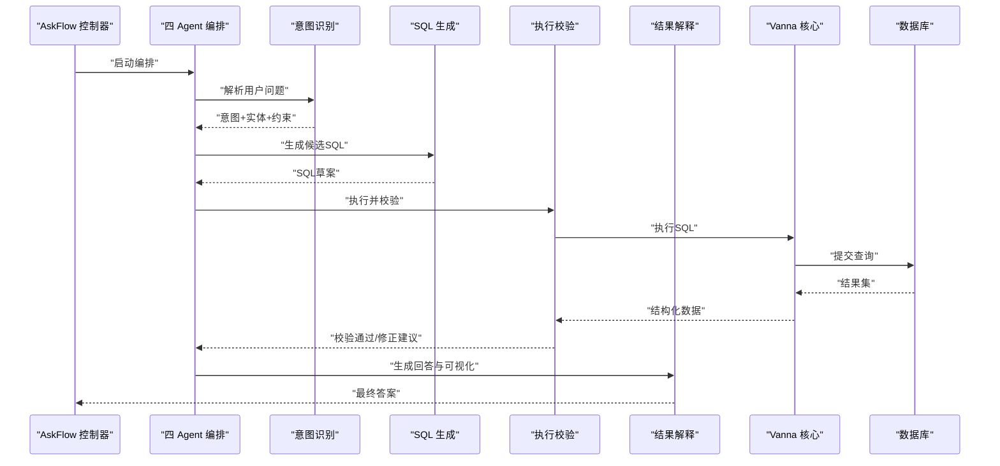
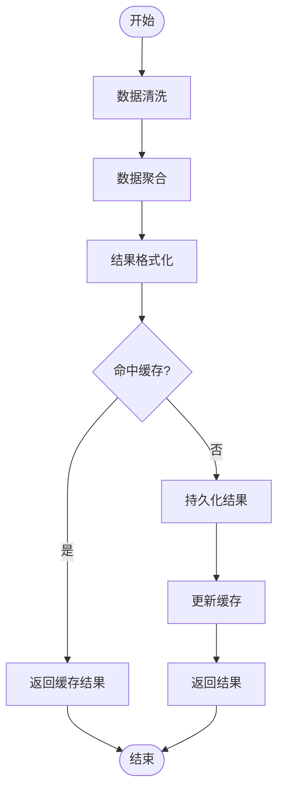
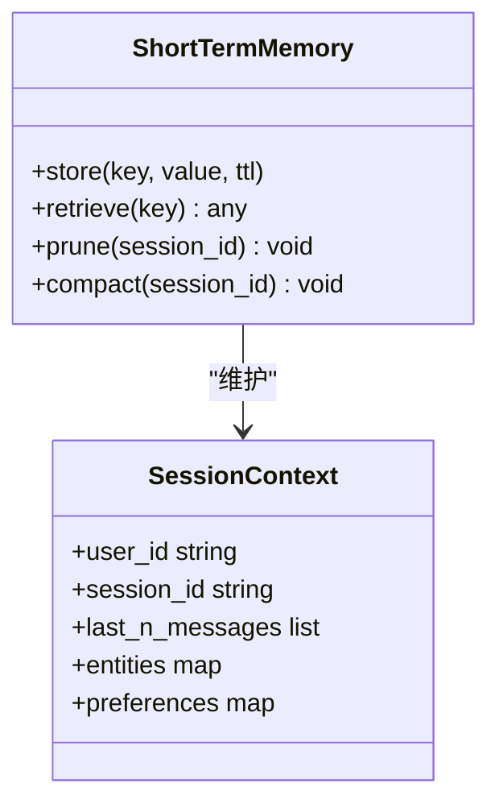
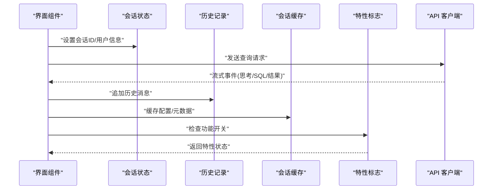
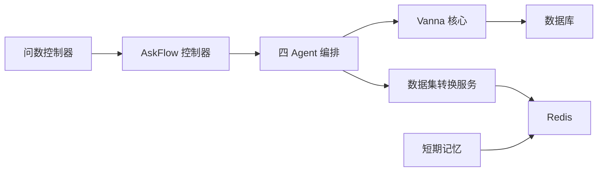

# 数据流设计

<cite>
**本文引用的文件**   
- [backend/app.py](file://backend/app.py)
- [backend/controllers/ask_flow.py](file://backend/controllers/ask_flow.py)
- [backend/ask_flow/controller.py](file://backend/ask_flow/controller.py)
- [backend/ask_flow/contracts.py](file://backend/ask_flow/contracts.py)
- [backend/four_agent_ask.py](file://backend/four_agent_ask.py)
- [backend/dataset_transform_service.py](file://backend/dataset_transform_service.py)
- [backend/memory/short_term_memory.py](file://backend/memory/short_term_memory.py)
- [backend/vanna_core.py](file://backend/vanna_core.py)
- [frontend/src/state/smartAskSession.js](file://frontend/src/state/smartAskSession.js)
- [frontend/src/state/smartAskHistory.js](file://frontend/src/state/smartAskHistory.js)
- [frontend/src/state/sessionCache.js](file://frontend/src/state/sessionCache.js)
- [frontend/src/state/featureFlags.js](file://frontend/src/state/featureFlags.js)
- [frontend/src/api/index.js](file://frontend/src/api/index.js)
- [docker-compose.yml](file://docker-compose.yml)
</cite>

## 目录
1. [简介](#简介)
2. [项目结构](#项目结构)
3. [核心组件](#核心组件)
4. [架构总览](#架构总览)
5. [详细组件分析](#详细组件分析)
6. [依赖关系分析](#依赖关系分析)
7. [性能考量](#性能考量)
8. [故障排查指南](#故障排查指南)
9. [结论](#结论)
10. [附录](#附录)

## 简介
本文件面向 SmartAsk 智能问数平台的数据流设计，聚焦从自然语言输入到 SQL 生成、执行与结果返回的完整链路；同时覆盖短期记忆管理、会话状态维护与上下文保持策略；阐述数据集转换服务的数据处理管道（清洗、聚合、格式化）；说明前端状态管理的数据流向（会话、历史、特性标志）；给出 Redis 缓存策略与失效机制；并以数据流图展示关键路径上的数据变换与处理逻辑。文档兼顾技术深度与可读性，便于不同背景的读者理解与落地。

## 项目结构
SmartAsk 采用前后端分离架构：
- 后端以 Python 应用为核心，提供问数编排、Agent 协作、数据集转换、权限与配置管理等能力。
- 前端基于 Vue 生态，通过 API 模块与后端交互，使用本地状态模块管理会话、历史与特性标志。
- 基础设施包括数据库与缓存（Redis），由容器编排统一管理。

**图表来源** 
- [backend/app.py](file://backend/app.py)
- [backend/controllers/ask_flow.py](file://backend/controllers/ask_flow.py)
- [backend/ask_flow/controller.py](file://backend/ask_flow/controller.py)
- [backend/ask_flow/contracts.py](file://backend/ask_flow/contracts.py)
- [backend/four_agent_ask.py](file://backend/four_agent_ask.py)
- [backend/dataset_transform_service.py](file://backend/dataset_transform_service.py)
- [backend/memory/short_term_memory.py](file://backend/memory/short_term_memory.py)
- [frontend/src/api/index.js](file://frontend/src/api/index.js)
- [frontend/src/state/smartAskSession.js](file://frontend/src/state/smartAskSession.js)
- [frontend/src/state/smartAskHistory.js](file://frontend/src/state/smartAskHistory.js)
- [frontend/src/state/sessionCache.js](file://frontend/src/state/sessionCache.js)
- [frontend/src/state/featureFlags.js](file://frontend/src/state/featureFlags.js)
- [docker-compose.yml](file://docker-compose.yml)

**章节来源**
- [backend/app.py](file://backend/app.py)
- [backend/controllers/ask_flow.py](file://backend/controllers/ask_flow.py)
- [backend/ask_flow/controller.py](file://backend/ask_flow/controller.py)
- [backend/ask_flow/contracts.py](file://backend/ask_flow/contracts.py)
- [backend/four_agent_ask.py](file://backend/four_agent_ask.py)
- [backend/dataset_transform_service.py](file://backend/dataset_transform_service.py)
- [backend/memory/short_term_memory.py](file://backend/memory/short_term_memory.py)
- [frontend/src/api/index.js](file://frontend/src/api/index.js)
- [frontend/src/state/smartAskSession.js](file://frontend/src/state/smartAskSession.js)
- [frontend/src/state/smartAskHistory.js](file://frontend/src/state/smartAskHistory.js)
- [frontend/src/state/sessionCache.js](file://frontend/src/state/sessionCache.js)
- [frontend/src/state/featureFlags.js](file://frontend/src/state/featureFlags.js)
- [docker-compose.yml](file://docker-compose.yml)

## 核心组件
- 问数控制器层：负责接收用户查询、路由到 AskFlow 控制器、协调多 Agent 编排与结果组装。
- AskFlow 控制器与契约：定义问数流程的状态机、阶段边界与数据结构契约，确保跨阶段一致性。
- 四 Agent 编排：将意图识别、SQL 生成、执行校验、结果解释等职责拆分为多个 Agent，提升可维护性与扩展性。
- Vanna 核心：封装与数据库的交互、SQL 执行与结果集获取，提供统一的查询接口。
- 数据集转换服务：实现数据清洗、聚合、格式化的数据处理管道，支持缓存加速。
- 短期记忆：维护会话级上下文（如最近 N 轮对话摘要、实体解析结果），降低 LLM 调用成本并提高连贯性。
- 前端状态管理：会话状态、历史记录、会话缓存与特性标志分别由独立模块管理，并通过 API 客户端与后端同步。

**章节来源**
- [backend/controllers/ask_flow.py](file://backend/controllers/ask_flow.py)
- [backend/ask_flow/controller.py](file://backend/ask_flow/controller.py)
- [backend/ask_flow/contracts.py](file://backend/ask_flow/contracts.py)
- [backend/four_agent_ask.py](file://backend/four_agent_ask.py)
- [backend/vanna_core.py](file://backend/vanna_core.py)
- [backend/dataset_transform_service.py](file://backend/dataset_transform_service.py)
- [backend/memory/short_term_memory.py](file://backend/memory/short_term_memory.py)
- [frontend/src/state/smartAskSession.js](file://frontend/src/state/smartAskSession.js)
- [frontend/src/state/smartAskHistory.js](file://frontend/src/state/smartAskHistory.js)
- [frontend/src/state/sessionCache.js](file://frontend/src/state/sessionCache.js)
- [frontend/src/state/featureFlags.js](file://frontend/src/state/featureFlags.js)

## 架构总览
下图展示了从用户输入到结果返回的关键数据流路径，以及各组件之间的交互关系。

**图表来源** 
- [backend/controllers/ask_flow.py](file://backend/controllers/ask_flow.py)
- [backend/ask_flow/controller.py](file://backend/ask_flow/controller.py)
- [backend/four_agent_ask.py](file://backend/four_agent_ask.py)
- [backend/vanna_core.py](file://backend/vanna_core.py)
- [backend/dataset_transform_service.py](file://backend/dataset_transform_service.py)
- [backend/memory/short_term_memory.py](file://backend/memory/short_term_memory.py)
- [frontend/src/api/index.js](file://frontend/src/api/index.js)
- [frontend/src/state/smartAskSession.js](file://frontend/src/state/smartAskSession.js)
- [frontend/src/state/smartAskHistory.js](file://frontend/src/state/smartAskHistory.js)
- [docker-compose.yml](file://docker-compose.yml)

## 详细组件分析

### 问数控制器与 AskFlow 控制器
- 职责划分
  - 问数控制器：对外暴露 REST 接口，鉴权与会话初始化，错误统一处理，流式响应控制。
  - AskFlow 控制器：维护问数流程状态机，按阶段推进（意图识别、SQL 生成、执行校验、结果解释），保证阶段间数据契约一致。
- 数据契约
  - 输入：用户问题、会话上下文、数据集选择、过滤条件。
  - 输出：结构化答案、SQL 片段、执行日志、可视化建议。
- 错误与重试
  - 对 LLM 调用失败、SQL 语法错误、权限不足等场景进行分级处理与重试策略。

**图表来源** 
- [backend/ask_flow/controller.py](file://backend/ask_flow/controller.py)
- [backend/ask_flow/contracts.py](file://backend/ask_flow/contracts.py)

**章节来源**
- [backend/controllers/ask_flow.py](file://backend/controllers/ask_flow.py)
- [backend/ask_flow/controller.py](file://backend/ask_flow/controller.py)
- [backend/ask_flow/contracts.py](file://backend/ask_flow/contracts.py)

### 四 Agent 编排与 Vanna 核心
- 四 Agent 编排
  - 意图识别 Agent：抽取用户意图、实体与约束。
  - SQL 生成 Agent：根据意图与 Schema 生成候选 SQL。
  - 执行校验 Agent：执行 SQL 并校验结果合理性（行数、字段类型、空值率）。
  - 结果解释 Agent：将结果转换为自然语言回答与可视化建议。
- Vanna 核心
  - 封装数据库连接、SQL 执行、结果集映射与分页。
  - 提供事务边界与回滚策略，确保查询一致性。

**图表来源** 
- [backend/four_agent_ask.py](file://backend/four_agent_ask.py)
- [backend/vanna_core.py](file://backend/vanna_core.py)

**章节来源**
- [backend/four_agent_ask.py](file://backend/four_agent_ask.py)
- [backend/vanna_core.py](file://backend/vanna_core.py)

### 数据集转换服务（DTS）
- 数据处理管道
  - 清洗：去重、缺失值处理、类型标准化、异常值过滤。
  - 聚合：分组统计、窗口函数、指标计算。
  - 格式化：数值精度、日期时间格式、单位换算、国际化。
- 缓存策略
  - 键设计：基于查询指纹（意图哈希+参数规范化）+ 数据集版本。
  - 失效机制：TTL 过期、写操作触发失效、版本变更广播失效。
- 性能优化
  - 增量聚合、物化视图预热、并行计算任务拆分。

**图表来源** 
- [backend/dataset_transform_service.py](file://backend/dataset_transform_service.py)

**章节来源**
- [backend/dataset_transform_service.py](file://backend/dataset_transform_service.py)

### 短期记忆与上下文保持
- 短期记忆
  - 存储内容：最近 N 轮对话摘要、实体解析结果、用户偏好。
  - 生命周期：会话级，随会话结束清理或归档。
  - 访问模式：读多写少，支持并发安全。
- 上下文保持策略
  - 动态裁剪：仅保留相关上下文片段，避免上下文爆炸。
  - 语义压缩：对长文本进行摘要，保留关键信息。
  - 一致性校验：在每次问答后校验上下文有效性。

**图表来源** 
- [backend/memory/short_term_memory.py](file://backend/memory/short_term_memory.py)

**章节来源**
- [backend/memory/short_term_memory.py](file://backend/memory/short_term_memory.py)

### 前端状态管理与数据流向
- 会话状态（smartAskSession.js）
  - 管理当前会话 ID、用户信息、加载状态、错误信息。
  - 与后端建立 WebSocket/SSE 连接，接收流式事件。
- 历史记录（smartAskHistory.js）
  - 本地存储历史消息，支持分页与搜索。
  - 与后端同步，支持增量更新。
- 会话缓存（sessionCache.js）
  - 缓存频繁访问的配置与元数据，减少重复请求。
  - 支持 TTL 与手动失效。
- 特性标志（featureFlags.js）
  - 管理功能开关，支持远程配置与本地覆盖。
  - 动态生效，无需重启应用。

**图表来源** 
- [frontend/src/state/smartAskSession.js](file://frontend/src/state/smartAskSession.js)
- [frontend/src/state/smartAskHistory.js](file://frontend/src/state/smartAskHistory.js)
- [frontend/src/state/sessionCache.js](file://frontend/src/state/sessionCache.js)
- [frontend/src/state/featureFlags.js](file://frontend/src/state/featureFlags.js)
- [frontend/src/api/index.js](file://frontend/src/api/index.js)

**章节来源**
- [frontend/src/state/smartAskSession.js](file://frontend/src/state/smartAskSession.js)
- [frontend/src/state/smartAskHistory.js](file://frontend/src/state/smartAskHistory.js)
- [frontend/src/state/sessionCache.js](file://frontend/src/state/sessionCache.js)
- [frontend/src/state/featureFlags.js](file://frontend/src/state/featureFlags.js)
- [frontend/src/api/index.js](file://frontend/src/api/index.js)

## 依赖关系分析
- 组件耦合
  - 问数控制器依赖 AskFlow 控制器与四 Agent 编排。
  - 四 Agent 编排依赖 Vanna 核心与数据集转换服务。
  - 短期记忆依赖 Redis 缓存。
- 外部依赖
  - 数据库：用于持久化查询结果与元数据。
  - Redis：用于缓存与短期记忆。
- 潜在循环依赖
  - 通过接口抽象与事件驱动避免直接循环依赖。

**图表来源** 
- [backend/controllers/ask_flow.py](file://backend/controllers/ask_flow.py)
- [backend/ask_flow/controller.py](file://backend/ask_flow/controller.py)
- [backend/four_agent_ask.py](file://backend/four_agent_ask.py)
- [backend/vanna_core.py](file://backend/vanna_core.py)
- [backend/dataset_transform_service.py](file://backend/dataset_transform_service.py)
- [backend/memory/short_term_memory.py](file://backend/memory/short_term_memory.py)
- [docker-compose.yml](file://docker-compose.yml)

**章节来源**
- [backend/controllers/ask_flow.py](file://backend/controllers/ask_flow.py)
- [backend/ask_flow/controller.py](file://backend/ask_flow/controller.py)
- [backend/four_agent_ask.py](file://backend/four_agent_ask.py)
- [backend/vanna_core.py](file://backend/vanna_core.py)
- [backend/dataset_transform_service.py](file://backend/dataset_transform_service.py)
- [backend/memory/short_term_memory.py](file://backend/memory/short_term_memory.py)
- [docker-compose.yml](file://docker-compose.yml)

## 性能考量
- 查询优化
  - 索引策略：为常用过滤字段与关联键建立索引。
  - 查询重写：自动添加 LIMIT/OFFSET 与必要 JOIN。
- 缓存优化
  - 多级缓存：浏览器缓存、Redis 缓存、数据库物化视图。
  - 缓存预热：热点查询预加载。
- 并发与限流
  - 队列化执行：避免瞬时高并发导致数据库压力。
  - 速率限制：按用户/IP 限制请求频率。
- 资源监控
  - 慢查询日志：记录执行时间超过阈值的查询。
  - 内存与 CPU 监控：及时发现资源瓶颈。

[本节为通用指导，不直接分析具体文件]

## 故障排查指南
- 常见问题定位
  - SQL 生成失败：检查意图识别结果与 Schema 匹配度。
  - 执行超时：分析查询复杂度与索引使用情况。
  - 缓存不一致：验证缓存键设计与失效策略。
- 调试工具
  - 启用详细日志：记录每个阶段的输入输出。
  - 模拟请求：使用测试套件复现问题。
- 恢复策略
  - 自动重试：对瞬态错误进行指数退避重试。
  - 降级模式：在 LLM 不可用时回退到规则引擎。

**章节来源**
- [backend/controllers/ask_flow.py](file://backend/controllers/ask_flow.py)
- [backend/ask_flow/controller.py](file://backend/ask_flow/controller.py)
- [backend/four_agent_ask.py](file://backend/four_agent_ask.py)
- [backend/dataset_transform_service.py](file://backend/dataset_transform_service.py)

## 结论
SmartAsk 的数据流设计通过模块化与分层架构实现了清晰的责任划分与可扩展性。问数控制器与 AskFlow 控制器确保了流程的可控性，四 Agent 编排提升了智能化水平，数据集转换服务提供了高效的数据处理能力，短期记忆增强了用户体验。前端状态管理保证了界面的响应性与一致性。整体设计在性能、可靠性与可维护性之间取得了良好平衡，为后续功能演进奠定了坚实基础。

[本节为总结性内容，不直接分析具体文件]

## 附录
- 术语表
  - 意图识别：从自然语言中提取用户查询意图的过程。
  - SQL 生成：根据意图与 Schema 自动生成 SQL 语句。
  - 执行校验：对生成的 SQL 进行执行与结果合理性验证。
  - 结果解释：将结构化结果转换为自然语言回答。
- 配置参考
  - 环境变量：数据库连接、Redis 地址、LLM 服务配置。
  - 特性标志：功能开关与灰度发布配置。

[本节为补充信息，不直接分析具体文件]