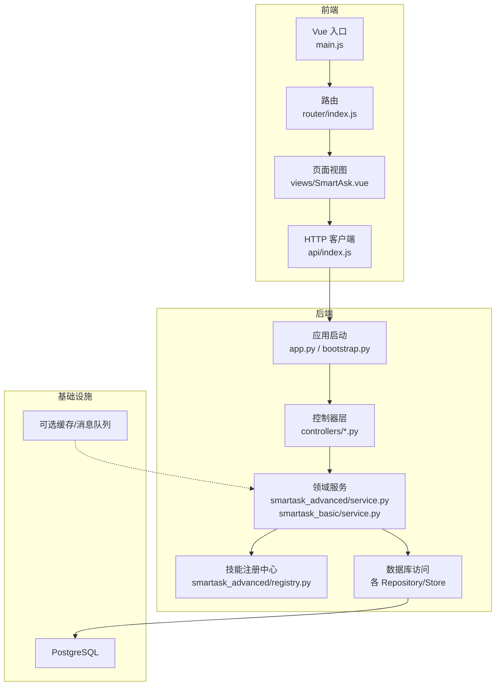
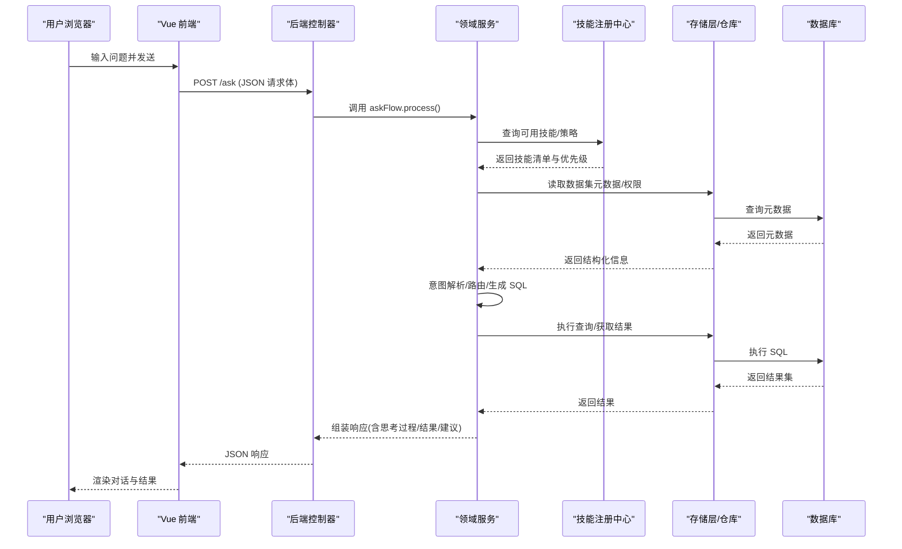
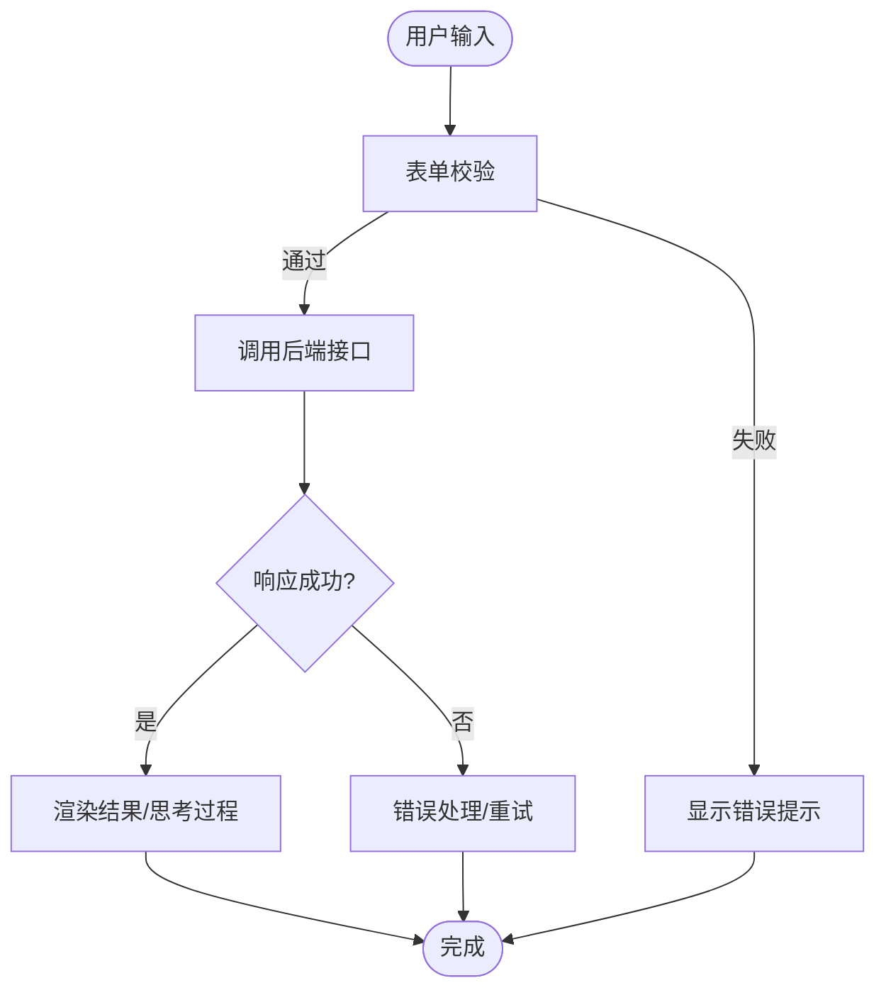
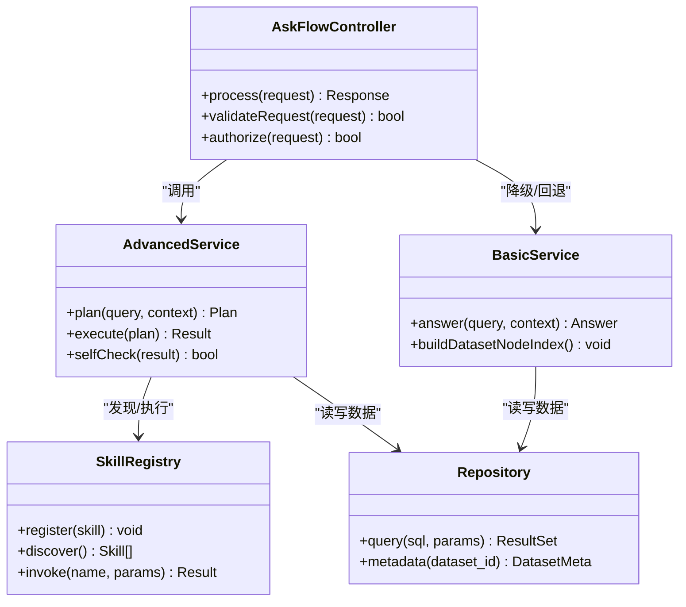
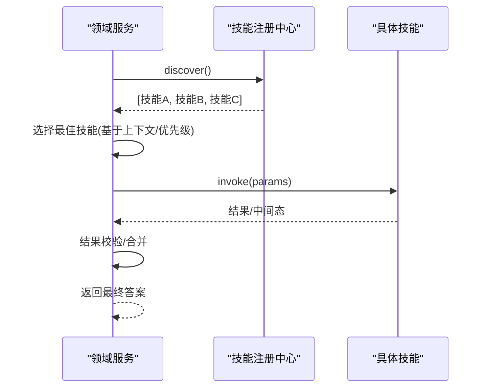
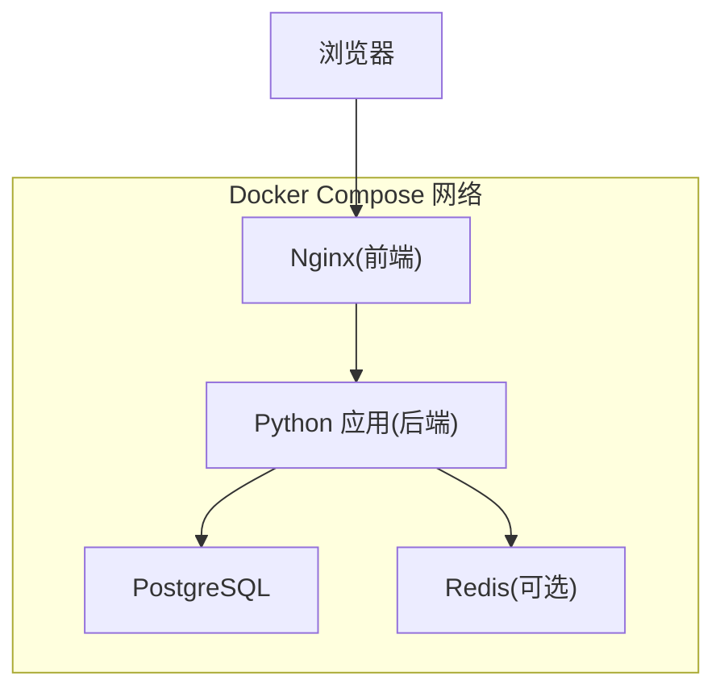
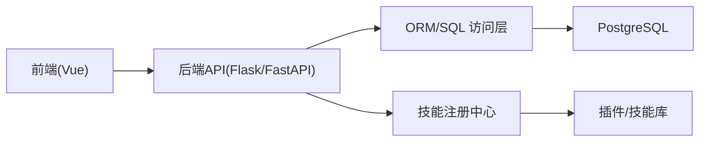

# 整体架构模式

<cite>
**本文引用的文件**   
- [docker-compose.yml](file://docker-compose.yml)
- [backend/app.py](file://backend/app.py)
- [backend/bootstrap.py](file://backend/bootstrap.py)
- [backend/ask_flow/controller.py](file://backend/ask_flow/controller.py)
- [backend/controllers/ask_flow.py](file://backend/controllers/ask_flow.py)
- [backend/smartask_advanced/service.py](file://backend/smartask_advanced/service.py)
- [backend/smartask_advanced/registry.py](file://backend/smartask_advanced/registry.py)
- [backend/smartask_basic/service.py](file://backend/smartask_basic/service.py)
- [frontend/src/main.js](file://frontend/src/main.js)
- [frontend/src/router/index.js](file://frontend/src/router/index.js)
- [frontend/src/api/index.js](file://frontend/src/api/index.js)
- [frontend/src/views/SmartAsk.vue](file://frontend/src/views/SmartAsk.vue)
- [frontend/Dockerfile](file://frontend/Dockerfile)
- [backend/Dockerfile](file://backend/Dockerfile)
</cite>

## 目录
1. [简介](#简介)
2. [项目结构](#项目结构)
3. [核心组件](#核心组件)
4. [架构总览](#架构总览)
5. [详细组件分析](#详细组件分析)
6. [依赖关系分析](#依赖关系分析)
7. [性能考虑](#性能考虑)
8. [故障排查指南](#故障排查指南)
9. [结论](#结论)
10. [附录](#附录)

## 简介
本文件为 SmartAsk 智能问数平台的整体架构模式文档，面向前后端分离、分层架构与插件化技能系统的设计与实践。内容覆盖：
- 前端 Vue.js 与后端 Python（Flask/FastAPI）的职责划分与通信机制
- Controller-Service-Repository 分层实现与数据流向
- 插件化技能系统的注册、发现与执行机制
- 微服务风格的模块划分策略、解耦设计与依赖管理
- 容器化部署拓扑与 Docker Compose 编排、服务发现
- 用户请求从前端到数据库的完整处理流程与各层交互协议、数据格式

## 项目结构
SmartAsk 采用前后端分离的工程组织方式：
- 前端位于 frontend/，基于 Vue 3 + Vite，提供对话式问数界面、管理控制台与可视化能力
- 后端位于 backend/，以 Python 应用为核心，包含控制器、领域服务、技能插件、配置与迁移脚本等
- 根目录 docker-compose.yml 统一编排前端、后端、数据库等组件
- docs/ 与 scripts/ 提供部署、测试与运维脚本

图表来源
- [frontend/src/main.js](file://frontend/src/main.js)
- [frontend/src/router/index.js](file://frontend/src/router/index.js)
- [frontend/src/api/index.js](file://frontend/src/api/index.js)
- [frontend/src/views/SmartAsk.vue](file://frontend/src/views/SmartAsk.vue)
- [backend/app.py](file://backend/app.py)
- [backend/bootstrap.py](file://backend/bootstrap.py)
- [backend/controllers/ask_flow.py](file://backend/controllers/ask_flow.py)
- [backend/smartask_advanced/service.py](file://backend/smartask_advanced/service.py)
- [backend/smartask_advanced/registry.py](file://backend/smartask_advanced/registry.py)

章节来源
- [docker-compose.yml](file://docker-compose.yml)
- [frontend/src/main.js](file://frontend/src/main.js)
- [backend/app.py](file://backend/app.py)

## 核心组件
- 前端应用
  - 入口与路由：负责初始化 Vue 应用、挂载路由与全局状态
  - API 客户端：封装 HTTP 请求、鉴权头、错误处理与重试
  - 视图组件：对话式交互、结果展示、SQL 调试与报告查看
- 后端应用
  - 应用启动：加载配置、注册中间件、挂载路由与生命周期钩子
  - 控制器层：接收请求、参数校验、权限检查、调用领域服务
  - 领域服务：业务编排、意图识别、多数据集路由、结果聚合
  - 技能注册中心：插件化技能的注册、发现与执行调度
  - 存储层：数据库访问、缓存、日志与审计
- 基础设施
  - 数据库：PostgreSQL，承载元数据、会话、报表配置与审计日志
  - 可选缓存/消息队列：用于异步任务与热点数据加速

章节来源
- [frontend/src/api/index.js](file://frontend/src/api/index.js)
- [frontend/src/views/SmartAsk.vue](file://frontend/src/views/SmartAsk.vue)
- [backend/app.py](file://backend/app.py)
- [backend/bootstrap.py](file://backend/bootstrap.py)
- [backend/controllers/ask_flow.py](file://backend/controllers/ask_flow.py)
- [backend/smartask_advanced/service.py](file://backend/smartask_advanced/service.py)
- [backend/smartask_advanced/registry.py](file://backend/smartask_advanced/registry.py)

## 架构总览
SmartAsk 采用“前后端分离 + 分层架构 + 插件化技能”的整体模式：
- 前端通过 RESTful API 与后端交互，使用 JSON 作为数据交换格式
- 后端按 Controller-Service-Repository 分层，职责清晰、可测试性强
- 技能系统以插件形式扩展，支持动态注册与运行时发现
- 容器化部署通过 Docker Compose 编排，统一管理服务依赖与服务发现

图表来源
- [frontend/src/api/index.js](file://frontend/src/api/index.js)
- [backend/controllers/ask_flow.py](file://backend/controllers/ask_flow.py)
- [backend/ask_flow/controller.py](file://backend/ask_flow/controller.py)
- [backend/smartask_advanced/service.py](file://backend/smartask_advanced/service.py)
- [backend/smartask_advanced/registry.py](file://backend/smartask_advanced/registry.py)

## 详细组件分析

### 前端组件与通信机制
- 入口与路由
  - main.js 初始化应用、挂载路由与全局状态
  - router/index.js 定义页面路由与导航守卫
- API 客户端
  - api/index.js 封装 HTTP 请求，统一设置鉴权头、错误码处理与重试策略
- 视图组件
  - views/SmartAsk.vue 实现对话式交互、流式输出、SQL 调试面板与结果卡片

章节来源
- [frontend/src/main.js](file://frontend/src/main.js)
- [frontend/src/router/index.js](file://frontend/src/router/index.js)
- [frontend/src/api/index.js](file://frontend/src/api/index.js)
- [frontend/src/views/SmartAsk.vue](file://frontend/src/views/SmartAsk.vue)

### 后端分层架构（Controller-Service-Repository）
- 控制器层
  - controllers/ask_flow.py 接收 /ask 请求，进行参数校验、权限检查，调用 ask_flow.controller
  - ask_flow/controller.py 编排具体流程，协调意图识别、路由、技能选择与结果聚合
- 领域服务
  - smartask_advanced/service.py 高级问数服务，包含复杂场景的规划、证据投票、质量评估等
  - smartask_basic/service.py 基础问数服务，处理简单单表查询与快速回答
- 存储层
  - 各 Store/Repository 模块负责与数据库交互，封装查询与事务

图表来源
- [backend/controllers/ask_flow.py](file://backend/controllers/ask_flow.py)
- [backend/ask_flow/controller.py](file://backend/ask_flow/controller.py)
- [backend/smartask_advanced/service.py](file://backend/smartask_advanced/service.py)
- [backend/smartask_basic/service.py](file://backend/smartask_basic/service.py)
- [backend/smartask_advanced/registry.py](file://backend/smartask_advanced/registry.py)

章节来源
- [backend/controllers/ask_flow.py](file://backend/controllers/ask_flow.py)
- [backend/ask_flow/controller.py](file://backend/ask_flow/controller.py)
- [backend/smartask_advanced/service.py](file://backend/smartask_advanced/service.py)
- [backend/smartask_basic/service.py](file://backend/smartask_basic/service.py)

### 插件化技能系统（注册、发现与执行）
- 设计原理
  - 技能以插件形式存在，具备统一的契约与生命周期
  - 注册中心维护技能清单、版本与优先级
  - 运行时根据上下文动态发现并选择合适技能
- 关键流程
  - 启动时扫描并注册技能
  - 请求到达时，服务层查询可用技能并按策略排序
  - 执行技能后，将结果回传至上层进行聚合与校验

图表来源
- [backend/smartask_advanced/registry.py](file://backend/smartask_advanced/registry.py)
- [backend/smartask_advanced/service.py](file://backend/smartask_advanced/service.py)

章节来源
- [backend/smartask_advanced/registry.py](file://backend/smartask_advanced/registry.py)
- [backend/smartask_advanced/service.py](file://backend/smartask_advanced/service.py)

### 微服务风格的模块划分与解耦设计
- 模块划分
  - 控制器模块：按功能域拆分（如 ask_flow、auth、bookshelf、datasources 等）
  - 领域服务模块：按业务能力拆分（advanced/basic 等）
  - 技能插件模块：独立目录，便于扩展与维护
- 解耦策略
  - 通过接口契约与事件驱动降低耦合
  - 使用配置中心与环境变量管理外部依赖
  - 存储层抽象化，屏蔽不同数据源差异

章节来源
- [backend/controllers/ask_flow.py](file://backend/controllers/ask_flow.py)
- [backend/smartask_advanced/service.py](file://backend/smartask_advanced/service.py)
- [backend/smartask_basic/service.py](file://backend/smartask_basic/service.py)

### 容器化部署拓扑与 Docker Compose 编排
- 组件关系
  - 前端：Nginx + Vue 静态资源，反向代理到后端
  - 后端：Python 应用，暴露 RESTful API
  - 数据库：PostgreSQL，持久化存储
  - 可选：缓存/消息队列（Redis/Kafka）
- 服务发现
  - 通过 Docker Compose 的网络与别名实现服务间通信
  - 环境变量注入配置，避免硬编码

图表来源
- [docker-compose.yml](file://docker-compose.yml)
- [frontend/Dockerfile](file://frontend/Dockerfile)
- [backend/Dockerfile](file://backend/Dockerfile)

章节来源
- [docker-compose.yml](file://docker-compose.yml)
- [frontend/Dockerfile](file://frontend/Dockerfile)
- [backend/Dockerfile](file://backend/Dockerfile)

## 依赖关系分析
- 前端依赖
  - Vue 生态（Vue Router、Pinia/Vuex、Axios/Fetch）
  - 构建工具（Vite）
- 后端依赖
  - Web 框架（Flask/FastAPI）
  - ORM/SQLAlchemy（或原生 SQL）
  - 插件框架（自定义注册中心）
  - 数据库驱动（psycopg2/asyncpg）
- 基础设施依赖
  - PostgreSQL
  - 可选 Redis/Kafka

图表来源
- [backend/app.py](file://backend/app.py)
- [backend/bootstrap.py](file://backend/bootstrap.py)
- [backend/smartask_advanced/registry.py](file://backend/smartask_advanced/registry.py)

章节来源
- [backend/app.py](file://backend/app.py)
- [backend/bootstrap.py](file://backend/bootstrap.py)
- [backend/smartask_advanced/registry.py](file://backend/smartask_advanced/registry.py)

## 性能考虑
- 前端优化
  - 路由懒加载、组件按需引入
  - 图片与静态资源 CDN 加速
  - 长列表虚拟滚动与分页
- 后端优化
  - 连接池与缓存命中提升查询性能
  - 异步任务与批处理减少阻塞
  - SQL 索引优化与慢查询监控
- 部署优化
  - 水平扩展后端实例
  - 使用反向代理与负载均衡
  - 合理设置超时与重试策略

[本节为通用指导，不直接分析具体文件]

## 故障排查指南
- 常见问题
  - 前端无法连接后端：检查 CORS、端口映射与网络连通性
  - 权限校验失败：确认鉴权头与会话状态
  - 技能未生效：检查注册中心是否加载、插件路径是否正确
  - 数据库连接失败：检查连接字符串、用户名密码与防火墙规则
- 诊断步骤
  - 查看后端日志与错误堆栈
  - 使用 Swagger/OpenAPI 验证接口契约
  - 启用调试模式与请求追踪
  - 检查 Docker Compose 服务状态与健康检查

章节来源
- [backend/app.py](file://backend/app.py)
- [backend/bootstrap.py](file://backend/bootstrap.py)

## 结论
SmartAsk 通过前后端分离、分层架构与插件化技能系统，实现了高内聚、低耦合的可扩展问数平台。容器化部署简化了运维复杂度，提升了交付效率。未来可进一步引入服务网格、可观测性与自动化测试，持续提升系统稳定性与开发体验。

[本节为总结性内容，不直接分析具体文件]

## 附录
- 术语表
  - 技能：可插拔的业务能力单元，支持动态注册与执行
  - 领域服务：封装核心业务逻辑，协调多个子系统协作
  - 存储层：抽象数据访问，屏蔽底层存储差异
- 参考文档
  - 部署手册与脚本位于 docs/ 与 scripts/
  - 测试用例位于 backend/tests/

[本节为补充信息，不直接分析具体文件]