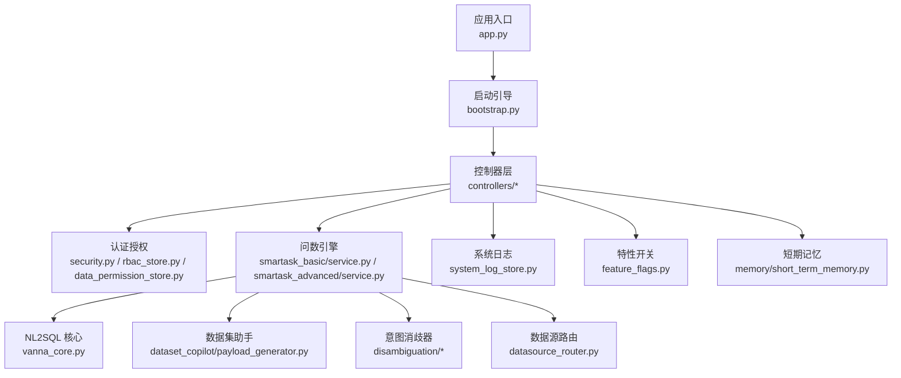
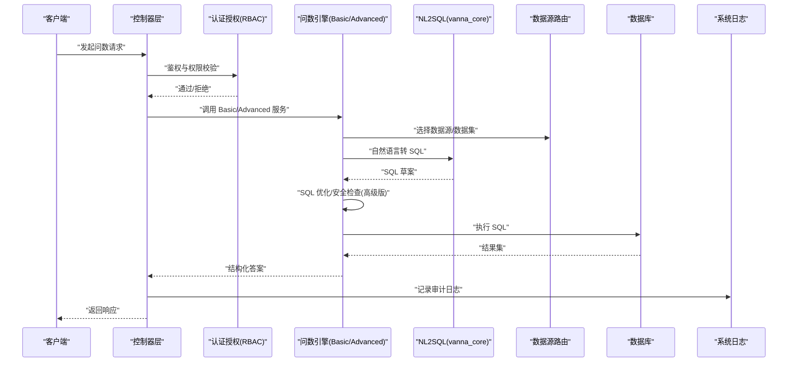
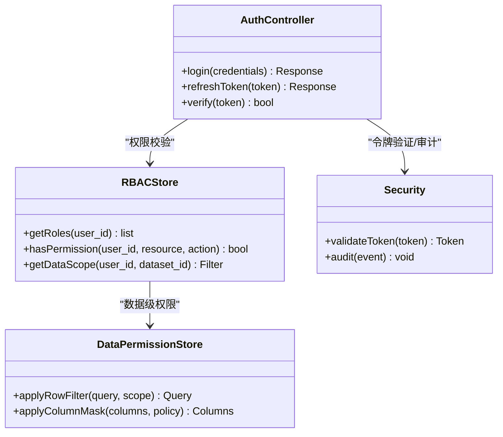
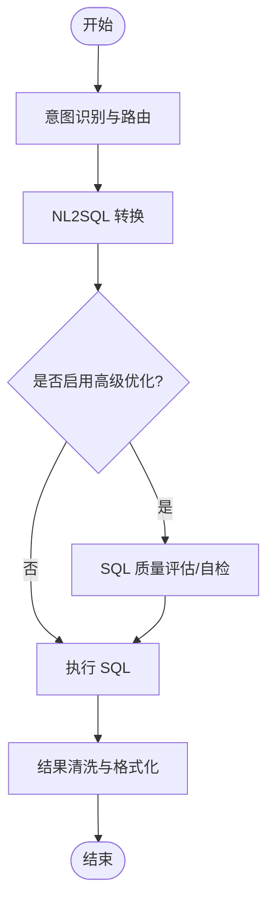
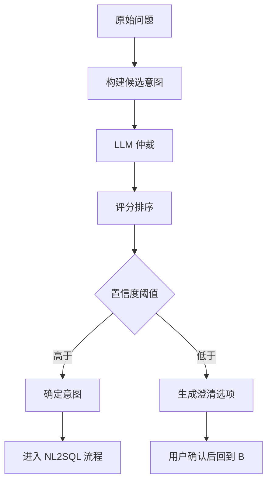
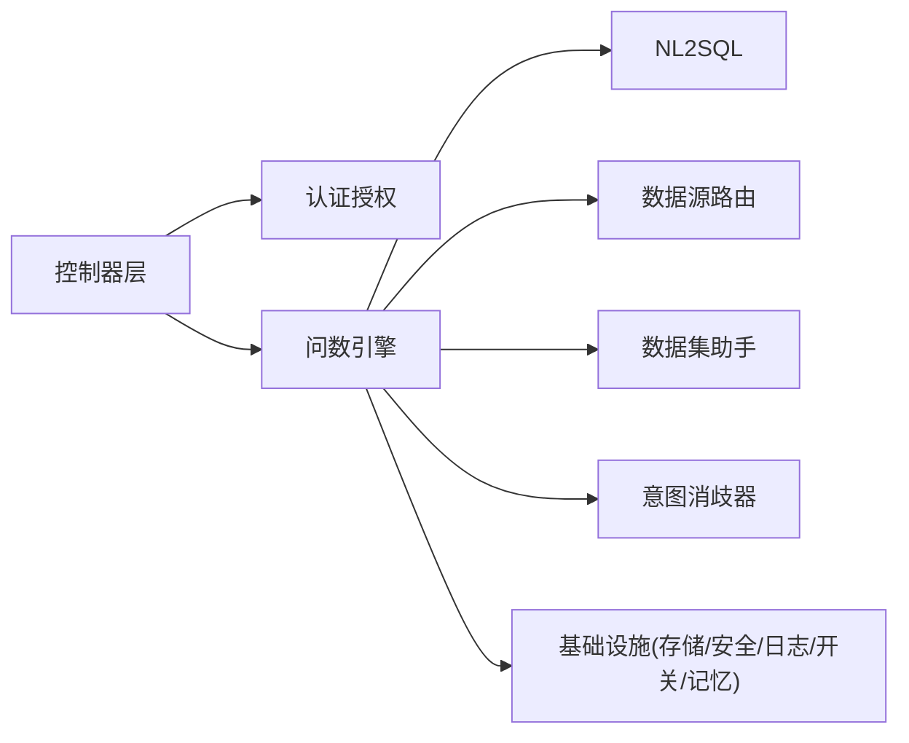

# 核心组件设计

<cite>
**本文引用的文件**   
- [app.py](file://backend/app.py)
- [bootstrap.py](file://backend/bootstrap.py)
- [controllers/auth.py](file://backend/controllers/auth.py)
- [controllers/rbac.py](file://backend/controllers/rbac.py)
- [rbac_store.py](file://backend/rbac_store.py)
- [data_permission_store.py](file://backend/data_permission_store.py)
- [security.py](file://backend/security.py)
- [ask_flow/controller.py](file://backend/ask_flow/controller.py)
- [ask_flow/contracts.py](file://backend/ask_flow/contracts.py)
- [smartask_basic/service.py](file://backend/smartask_basic/service.py)
- [smartask_advanced/service.py](file://backend/smartask_advanced/service.py)
- [dataset_copilot/payload_generator.py](file://backend/dataset_copilot/payload_generator.py)
- [disambiguation/llm_arbiter.py](file://backend/disambiguation/llm_arbiter.py)
- [disambiguation/option_builder.py](file://backend/disambiguation/option_builder.py)
- [disambiguation/scoring.py](file://backend/disambiguation/scoring.py)
- [vanna_core.py](file://backend/vanna_core.py)
- [datasource_router.py](file://backend/datasource_router.py)
- [feature_flags.py](file://backend/feature_flags.py)
- [system_log_store.py](file://backend/system_log_store.py)
- [memory/short_term_memory.py](file://backend/memory/short_term_memory.py)
</cite>

## 目录
1. [引言](#引言)
2. [项目结构](#项目结构)
3. [核心组件](#核心组件)
4. [架构总览](#架构总览)
5. [详细组件分析](#详细组件分析)
6. [依赖关系分析](#依赖关系分析)
7. [性能考量](#性能考量)
8. [故障排查指南](#故障排查指南)
9. [结论](#结论)
10. [附录](#附录)

## 引言
本设计文档面向 SmartAsk 智能问数平台的核心组件，聚焦以下目标：
- 明确认证授权（RBAC）组件的职责与接口边界
- 阐述智能问数引擎（基础版与高级版）的差异化能力与调用流程
- 定义数据集助手与意图消歧器的职责、输入输出与扩展点
- 描述权限校验、NL2SQL 转换、SQL 优化与执行等关键流程
- 说明事件驱动架构、异步任务处理与消息传递机制
- 给出组件生命周期管理、错误处理策略与性能监控点
- 提供典型业务场景下的组件交互序列图
- 规范扩展点与自定义组件开发方式

## 项目结构
后端采用模块化分层组织：
- 应用入口与启动引导：app.py、bootstrap.py
- 控制器层：controllers/* 暴露 HTTP API，编排业务流程
- 领域服务：smartask_basic、smartask_advanced、dataset_copilot、disambiguation
- 基础设施：auth_store、rbac_store、data_permission_store、system_log_store、security
- 数据访问与路由：vanna_core、datasource_router
- 特性开关与内存：feature_flags、memory/short_term_memory

图表来源
- [app.py](file://backend/app.py)
- [bootstrap.py](file://backend/bootstrap.py)
- [controllers/auth.py](file://backend/controllers/auth.py)
- [controllers/rbac.py](file://backend/controllers/rbac.py)
- [security.py](file://backend/security.py)
- [rbac_store.py](file://backend/rbac_store.py)
- [data_permission_store.py](file://backend/data_permission_store.py)
- [smartask_basic/service.py](file://backend/smartask_basic/service.py)
- [smartask_advanced/service.py](file://backend/smartask_advanced/service.py)
- [vanna_core.py](file://backend/vanna_core.py)
- [dataset_copilot/payload_generator.py](file://backend/dataset_copilot/payload_generator.py)
- [disambiguation/llm_arbiter.py](file://backend/disambiguation/llm_arbiter.py)
- [disambiguation/option_builder.py](file://backend/disambiguation/option_builder.py)
- [disambiguation/scoring.py](file://backend/disambiguation/scoring.py)
- [datasource_router.py](file://backend/datasource_router.py)
- [feature_flags.py](file://backend/feature_flags.py)
- [system_log_store.py](file://backend/system_log_store.py)
- [memory/short_term_memory.py](file://backend/memory/short_term_memory.py)

章节来源
- [app.py](file://backend/app.py)
- [bootstrap.py](file://backend/bootstrap.py)

## 核心组件
- 认证授权（RBAC）
  - 职责：用户身份鉴权、角色与资源权限校验、数据级权限过滤、会话与令牌管理
  - 关键模块：controllers/auth.py、controllers/rbac.py、rbac_store.py、data_permission_store.py、security.py
- 智能问数引擎
  - 基础版（Basic）：快速 NL2SQL 转换、单数据集查询、基础安全校验
  - 高级版（Advanced）：多数据集路由、意图消歧、SQL 质量评估、自我检查、规划与证据投票
  - 关键模块：smartask_basic/service.py、smartask_advanced/service.py、vanna_core.py、datasource_router.py
- 数据集助手
  - 职责：构建提示负载、抽取维度/指标、生成查询模板
  - 关键模块：dataset_copilot/payload_generator.py
- 意图消歧器
  - 职责：候选意图构建、LLM 仲裁、评分排序、选项生成
  - 关键模块：disambiguation/option_builder.py、disambiguation/llm_arbiter.py、disambiguation/scoring.py
- 问数流程编排
  - 职责：统一入口、请求契约、控制器编排
  - 关键模块：ask_flow/controller.py、ask_flow/contracts.py

章节来源
- [controllers/auth.py](file://backend/controllers/auth.py)
- [controllers/rbac.py](file://backend/controllers/rbac.py)
- [rbac_store.py](file://backend/rbac_store.py)
- [data_permission_store.py](file://backend/data_permission_store.py)
- [security.py](file://backend/security.py)
- [smartask_basic/service.py](file://backend/smartask_basic/service.py)
- [smartask_advanced/service.py](file://backend/smartask_advanced/service.py)
- [dataset_copilot/payload_generator.py](file://backend/dataset_copilot/payload_generator.py)
- [disambiguation/llm_arbiter.py](file://backend/disambiguation/llm_arbiter.py)
- [disambiguation/option_builder.py](file://backend/disambiguation/option_builder.py)
- [disambiguation/scoring.py](file://backend/disambiguation/scoring.py)
- [ask_flow/controller.py](file://backend/ask_flow/controller.py)
- [ask_flow/contracts.py](file://backend/ask_flow/contracts.py)

## 架构总览
SmartAsk 采用“控制器编排 + 领域服务 + 基础设施”的分层架构。HTTP 请求进入控制器后，依次进行认证授权、意图解析、NL2SQL 转换、SQL 优化与执行，最终返回结果并记录审计日志。高级版在基础版之上引入多数据集路由、意图消歧与质量保障环节。

图表来源
- [controllers/auth.py](file://backend/controllers/auth.py)
- [controllers/rbac.py](file://backend/controllers/rbac.py)
- [smartask_basic/service.py](file://backend/smartask_basic/service.py)
- [smartask_advanced/service.py](file://backend/smartask_advanced/service.py)
- [vanna_core.py](file://backend/vanna_core.py)
- [datasource_router.py](file://backend/datasource_router.py)
- [system_log_store.py](file://backend/system_log_store.py)

## 详细组件分析

### 认证授权（RBAC）组件
- 职责边界
  - 身份认证：登录、令牌签发与校验、会话状态维护
  - 权限控制：基于角色的访问控制（RBAC）、资源级与数据级权限
  - 安全策略：敏感操作审计、越权拦截、最小权限原则
- 关键接口
  - 登录与令牌：获取/刷新令牌、校验签名与过期时间
  - 权限校验：角色-资源映射、数据范围过滤（行/列级）
  - 审计记录：登录、授权失败、越权尝试等事件
- 错误处理
  - 非法令牌、过期、签名错误、权限不足等异常分类与统一返回码
- 性能要点
  - 令牌本地缓存、权限表索引优化、批量权限预取

图表来源
- [controllers/auth.py](file://backend/controllers/auth.py)
- [controllers/rbac.py](file://backend/controllers/rbac.py)
- [rbac_store.py](file://backend/rbac_store.py)
- [data_permission_store.py](file://backend/data_permission_store.py)
- [security.py](file://backend/security.py)

章节来源
- [controllers/auth.py](file://backend/controllers/auth.py)
- [controllers/rbac.py](file://backend/controllers/rbac.py)
- [rbac_store.py](file://backend/rbac_store.py)
- [data_permission_store.py](file://backend/data_permission_store.py)
- [security.py](file://backend/security.py)

### 智能问数引擎（基础版与高级版）
- 基础版（Basic）
  - 功能：单数据集 NL2SQL、基础语法与安全校验、结果格式化
  - 适用场景：简单指标查询、固定口径报表
- 高级版（Advanced）
  - 功能：多数据集路由、意图消歧、SQL 质量评估、自我检查、证据投票、模板策略
  - 适用场景：复杂跨库查询、多语义实体、动态条件组合
- 关键流程
  - 意图识别与路由：根据问题选择数据集/数据源
  - NL2SQL 转换：将自然语言转为可执行 SQL
  - SQL 优化：去重、聚合优化、安全规则注入
  - 执行与结果：参数化执行、分页与限流、结果清洗

图表来源
- [smartask_basic/service.py](file://backend/smartask_basic/service.py)
- [smartask_advanced/service.py](file://backend/smartask_advanced/service.py)
- [vanna_core.py](file://backend/vanna_core.py)
- [datasource_router.py](file://backend/datasource_router.py)

章节来源
- [smartask_basic/service.py](file://backend/smartask_basic/service.py)
- [smartask_advanced/service.py](file://backend/smartask_advanced/service.py)
- [vanna_core.py](file://backend/vanna_core.py)
- [datasource_router.py](file://backend/datasource_router.py)

### 数据集助手
- 职责
  - 构建提示负载：抽取维度、指标、过滤条件
  - 生成查询模板：标准化字段映射、默认聚合策略
  - 辅助校验：字段存在性、类型一致性、别名冲突检测
- 输入输出
  - 输入：数据集元数据、用户问题片段、上下文记忆
  - 输出：结构化提示负载、候选查询模板、字段映射表
- 扩展点
  - 自定义字段抽取策略、模板生成策略、校验规则插件

章节来源
- [dataset_copilot/payload_generator.py](file://backend/dataset_copilot/payload_generator.py)

### 意图消歧器
- 职责
  - 候选意图构建：从问题中抽取可能意图集合
  - LLM 仲裁：结合上下文与知识库进行意图判定
  - 评分排序：对候选意图打分并选择最优解
  - 选项生成：为确认或澄清生成用户可见选项
- 关键流程
  - 构建选项 -> LLM 仲裁 -> 评分 -> 选择 -> 生成澄清选项

图表来源
- [disambiguation/option_builder.py](file://backend/disambiguation/option_builder.py)
- [disambiguation/llm_arbiter.py](file://backend/disambiguation/llm_arbiter.py)
- [disambiguation/scoring.py](file://backend/disambiguation/scoring.py)

章节来源
- [disambiguation/option_builder.py](file://backend/disambiguation/option_builder.py)
- [disambiguation/llm_arbiter.py](file://backend/disambiguation/llm_arbiter.py)
- [disambiguation/scoring.py](file://backend/disambiguation/scoring.py)

### 问数流程编排（Ask Flow）
- 职责
  - 统一入口：接收请求、校验契约、分发到对应引擎
  - 契约定义：输入输出数据结构、错误码、重试策略
  - 编排逻辑：串联权限校验、意图消歧、NL2SQL、执行与日志
- 关键契约
  - 请求体：用户问题、上下文、可选参数（如数据集白名单）
  - 响应体：SQL 草案、执行结果、解释信息、审计追踪

章节来源
- [ask_flow/controller.py](file://backend/ask_flow/controller.py)
- [ask_flow/contracts.py](file://backend/ask_flow/contracts.py)

## 依赖关系分析
- 控制器依赖认证授权与问数引擎
- 问数引擎依赖 NL2SQL 核心、数据源路由、数据集助手与意图消歧器
- 基础设施层提供存储、安全、日志、特性开关与短期记忆
- 特性开关控制高级能力启用与降级路径

图表来源
- [controllers/auth.py](file://backend/controllers/auth.py)
- [controllers/rbac.py](file://backend/controllers/rbac.py)
- [smartask_basic/service.py](file://backend/smartask_basic/service.py)
- [smartask_advanced/service.py](file://backend/smartask_advanced/service.py)
- [vanna_core.py](file://backend/vanna_core.py)
- [datasource_router.py](file://backend/datasource_router.py)
- [dataset_copilot/payload_generator.py](file://backend/dataset_copilot/payload_generator.py)
- [disambiguation/llm_arbiter.py](file://backend/disambiguation/llm_arbiter.py)
- [security.py](file://backend/security.py)
- [system_log_store.py](file://backend/system_log_store.py)
- [feature_flags.py](file://backend/feature_flags.py)
- [memory/short_term_memory.py](file://backend/memory/short_term_memory.py)

章节来源
- [feature_flags.py](file://backend/feature_flags.py)
- [system_log_store.py](file://backend/system_log_store.py)
- [memory/short_term_memory.py](file://backend/memory/short_term_memory.py)

## 性能考量
- 令牌与权限缓存：减少重复鉴权开销
- 数据源连接池：提升并发执行能力
- SQL 优化与计划缓存：降低重复查询成本
- 异步任务与消息队列：削峰填谷，避免阻塞主线程
- 限流与熔断：保护下游数据库与 LLM 服务
- 监控与埋点：关键路径耗时、错误率、吞吐指标采集

[本节为通用指导，不直接分析具体文件]

## 故障排查指南
- 常见问题定位
  - 认证失败：检查令牌有效性、签名、过期时间与权限配置
  - 权限不足：核对角色-资源映射、数据级权限策略
  - NL2SQL 失败：查看提示负载、字段映射、约束规则
  - SQL 执行错误：检查参数化、数据类型、权限与连接池
  - 意图消歧偏差：调整仲裁策略、评分权重与阈值
- 日志与审计
  - 使用系统日志记录关键事件与错误堆栈
  - 开启调试模式收集中间态数据（脱敏）
- 恢复策略
  - 自动重试与退避、降级到基础版、回滚到上一版本配置

章节来源
- [system_log_store.py](file://backend/system_log_store.py)
- [security.py](file://backend/security.py)

## 结论
SmartAsk 通过清晰的组件划分与严格的权限控制，实现了从自然语言到可执行 SQL 的端到端能力。基础版满足简单场景，高级版覆盖复杂跨数据集与高质量保障需求。借助事件驱动与异步机制，系统在可扩展性与稳定性方面具备良好基础。建议在生产环境完善监控、限流与审计，持续优化 NL2SQL 质量与执行效率。

[本节为总结，不直接分析具体文件]

## 附录
- 扩展点与自定义组件开发规范
  - 插件接口：定义统一的输入输出契约与错误码
  - 注册机制：通过注册表加载自定义实现
  - 测试要求：单元测试与集成测试覆盖关键路径
  - 文档与示例：提供使用说明与最佳实践
- 典型业务场景序列图（概念）
  - 销售趋势查询：意图识别 -> 数据集路由 -> NL2SQL -> 执行 -> 结果展示
  - 跨部门对比：多数据集合并 -> 意图消歧 -> SQL 优化 -> 结果聚合

[本节为概念性内容，不直接分析具体文件]