# 系统架构设计

<cite>
**本文引用的文件**   
- [backend/app.py](file://backend/app.py)
- [backend/bootstrap.py](file://backend/bootstrap.py)
- [backend/agent_registry.py](file://agent_registry.py)
- [backend/controllers/auth.py](file://backend/controllers/auth.py)
- [backend/controllers/datasources.py](file://backend/controllers/datasources.py)
- [backend/controllers/ask_flow.py](file://backend/controllers/ask_flow.py)
- [backend/controllers/smart_chat.py](file://backend/controllers/smart_chat.py)
- [backend/controllers/rbac.py](file://backend/controllers/rbac.py)
- [backend/controllers/data_permissions.py](file://backend/controllers/data_permissions.py)
- [backend/controllers/feishu_sync.py](file://backend/controllers/feishu_sync.py)
- [backend/ask_flow/controller.py](file://backend/ask_flow/controller.py)
- [backend/four_agent_ask.py](file://backend/four_agent_ask.py)
- [backend/vanna_core.py](file://backend/vanna_core.py)
- [backend/dataset_transform_service.py](file://backend/dataset_transform_service.py)
- [backend/organization_route_resolver.py](file://backend/organization_route_resolver.py)
- [backend/security.py](file://backend/security.py)
- [backend/config_manager.py](file://backend/config_manager.py)
- [backend/feature_flags.py](file://backend/feature_flags.py)
- [backend/secret_codec.py](file://backend/secret_codec.py)
- [backend/bookshelf_repository.py](file://backend/bookshelf_repository.py)
- [backend/system_log_store.py](file://backend/system_log_store.py)
- [backend/feishu_sync_manager.py](file://backend/feishu_sync_manager.py)
- [backend/feishu_sync_service.py](file://backend/feishu_sync_service.py)
- [backend/feishu_url_parser.py](file://backend/feishu_url_parser.py)
- [backend/smartask_advanced/service.py](file://backend/smartask_advanced/service.py)
- [backend/smartask_basic/service.py](file://backend/smartask_basic/service.py)
- [backend/disambiguation/llm_arbiter.py](file://backend/disambiguation/llm_arbiter.py)
- [backend/memory/short_term_memory.py](file://backend/memory/short_term_memory.py)
- [frontend/src/router/index.js](file://frontend/src/router/index.js)
- [frontend/src/views/SmartAsk.vue](file://frontend/src/views/SmartAsk.vue)
- [frontend/src/api/index.js](file://frontend/src/api/index.js)
- [docker-compose.yml](file://docker-compose.yml)
- [backend/Dockerfile](file://backend/Dockerfile)
- [frontend/Dockerfile](file://frontend/Dockerfile)
</cite>

## 目录
1. [简介](#简介)
2. [项目结构](#项目结构)
3. [核心组件](#核心组件)
4. [架构总览](#架构总览)
5. [详细组件分析](#详细组件分析)
6. [依赖关系分析](#依赖关系分析)
7. [性能考虑](#性能考虑)
8. [故障排查指南](#故障排查指南)
9. [结论](#结论)
10. [附录](#附录)

## 简介
本文件为 SmartAsk 智能问数平台的系统架构文档，面向产品、研发与运维人员。文档围绕前后端分离、分层架构（Controller-Service-Repository）、插件化技能系统、微服务风格模块划分、事件驱动与容器化部署等关键设计决策展开，结合用户请求处理流程、NL2SQL 转换过程、权限验证机制等核心业务流进行说明，并给出技术选型权衡、可扩展性、性能优化与故障恢复策略建议。

## 项目结构
- 前端（Vue 3 + Vite）：提供对话式问答界面、管理控制台与飞书集成页面；通过 API 层调用后端 REST 接口。
- 后端（Python FastAPI）：以 app.py 为入口，按功能域拆分 controllers、services、repositories、skills 等模块；内置认证、RBAC、数据权限、组织路由、NL2SQL 编排、LLM 仲裁、记忆管理等能力。
- 基础设施：PostgreSQL 作为主存储，Docker Compose 编排服务，Nginx 反向代理前端静态资源。
- 工具与脚本：测试、导入导出、配置迁移、健康检查等辅助脚本位于 scripts 与 backend 根目录。

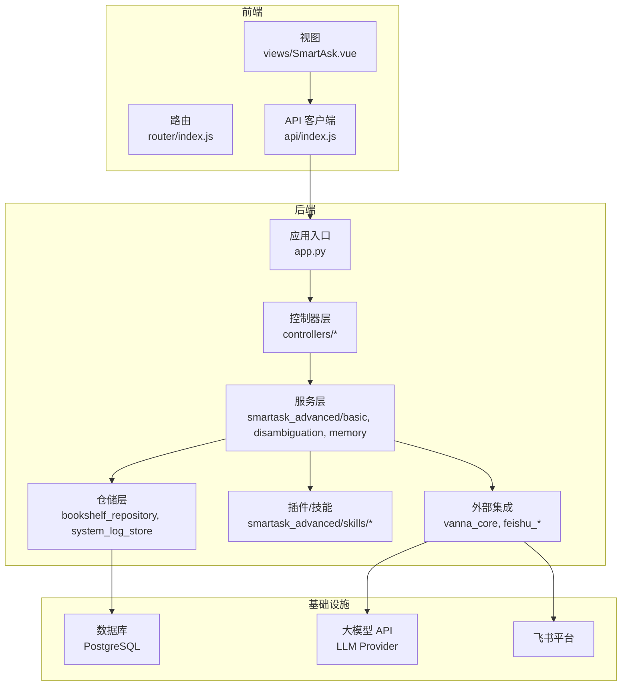

**图表来源** 
- [backend/app.py](file://backend/app.py)
- [frontend/src/router/index.js](file://frontend/src/router/index.js)
- [frontend/src/views/SmartAsk.vue](file://frontend/src/views/SmartAsk.vue)
- [frontend/src/api/index.js](file://frontend/src/api/index.js)

**章节来源**
- [backend/app.py](file://backend/app.py)
- [frontend/src/router/index.js](file://frontend/src/router/index.js)
- [frontend/src/views/SmartAsk.vue](file://frontend/src/views/SmartAsk.vue)
- [frontend/src/api/index.js](file://frontend/src/api/index.js)

## 核心组件
- 应用入口与启动：FastAPI 应用初始化、中间件注册、路由挂载、配置加载、健康检查与生命周期钩子。
- 控制器层：REST 接口定义与入参校验，统一鉴权拦截，转发至服务层。
- 服务层：业务流程编排（NL2SQL 生成、意图消歧、结果评分、报告生成），协调仓储与插件。
- 仓储层：数据访问抽象（Bookshelf、日志、运行时配置等），屏蔽底层存储差异。
- 插件/技能系统：可插拔的查询增强能力（如 SQL 质量评估、证据投票、模板策略、Pandas 分析等）。
- 外部集成：LLM 调用封装、飞书同步与 URL 解析、数据集变换服务。
- 安全与权限：认证、RBAC、字段级数据权限、组织树路由、密钥编解码与特性开关。

**章节来源**
- [backend/app.py](file://backend/app.py)
- [backend/bootstrap.py](file://backend/bootstrap.py)
- [backend/controllers/auth.py](file://backend/controllers/auth.py)
- [backend/controllers/rbac.py](file://backend/controllers/rbac.py)
- [backend/controllers/data_permissions.py](file://backend/controllers/data_permissions.py)
- [backend/smartask_advanced/service.py](file://backend/smartask_advanced/service.py)
- [backend/smartask_basic/service.py](file://backend/smartask_basic/service.py)
- [backend/bookshelf_repository.py](file://backend/bookshelf_repository.py)
- [backend/system_log_store.py](file://backend/system_log_store.py)
- [backend/vanna_core.py](file://backend/vanna_core.py)
- [backend/feishu_sync_manager.py](file://backend/feishu_sync_manager.py)
- [backend/feishu_sync_service.py](file://backend/feishu_sync_service.py)
- [backend/feishu_url_parser.py](file://backend/feishu_url_parser.py)
- [backend/dataset_transform_service.py](file://backend/dataset_transform_service.py)
- [backend/security.py](file://backend/security.py)
- [backend/config_manager.py](file://backend/config_manager.py)
- [backend/feature_flags.py](file://backend/feature_flags.py)
- [backend/secret_codec.py](file://backend/secret_codec.py)

## 架构总览
SmartAsk 采用前后端分离与分层架构，后端以 FastAPI 为核心，控制器负责协议适配与鉴权，服务层编排 NL2SQL 流程与多 Agent 协作，仓储层统一数据访问，插件系统支持按需扩展能力。外部集成通过适配器模式对接 LLM 与飞书。部署采用 Docker Compose，前后端与数据库解耦，便于水平扩展与灰度发布。

```mermaid
sequenceDiagram
participant U as "用户浏览器"
participant FE as "前端视图<br/>SmartAsk.vue"
participant API as "API 客户端<br/>api/index.js"
participant CTRL as "后端控制器<br/>ask_flow/smart_chat"
participant SVC as "服务层<br/>advanced/basic service"
participant PLG as "插件/技能<br/>skills/*"
participant REPO as "仓储层<br/>bookshelf/system_log"
participant EXT as "外部集成<br/>vanna_core/feishu"
participant DB as "数据库<br/>PostgreSQL"
participant LLM as "大模型 API"
U->>FE : 输入自然语言问题
FE->>API : POST /ask (携带上下文/会话ID)
API->>CTRL : 转发请求
CTRL->>CTRL : 鉴权与参数校验
CTRL->>SVC : 调用问数服务
SVC->>SVC : 意图识别/消歧
SVC->>PLG : 执行技能SQL质量/证据投票/模板策略
SVC->>EXT : 调用 LLM 生成/优化 SQL
EXT-->>SVC : 返回候选 SQL/解释
SVC->>REPO : 读取数据集元数据/权限
REPO-->>SVC : 返回元数据与权限信息
SVC->>DB : 执行 SQL受权限控制
DB-->>SVC : 返回结果集
SVC-->>CTRL : 组装回答含思考链/可视化
CTRL-->>API : JSON 响应
API-->>FE : 渲染对话与结果
```

**图表来源** 
- [frontend/src/views/SmartAsk.vue](file://frontend/src/views/SmartAsk.vue)
- [frontend/src/api/index.js](file://frontend/src/api/index.js)
- [backend/controllers/ask_flow.py](file://backend/controllers/ask_flow.py)
- [backend/controllers/smart_chat.py](file://backend/controllers/smart_chat.py)
- [backend/smartask_advanced/service.py](file://backend/smartask_advanced/service.py)
- [backend/smartask_basic/service.py](file://backend/smartask_basic/service.py)
- [backend/disambiguation/llm_arbiter.py](file://backend/disambiguation/llm_arbiter.py)
- [backend/vanna_core.py](file://backend/vanna_core.py)
- [backend/bookshelf_repository.py](file://backend/bookshelf_repository.py)
- [backend/system_log_store.py](file://backend/system_log_store.py)

## 详细组件分析

### 应用入口与启动流程
- 应用初始化：加载配置、注册中间件、挂载路由、初始化仓储与插件注册表。
- 生命周期：启动时构建数据集索引、加载特征开关、初始化外部集成连接池。
- 健康检查：暴露健康探针，供容器编排与健康监控使用。

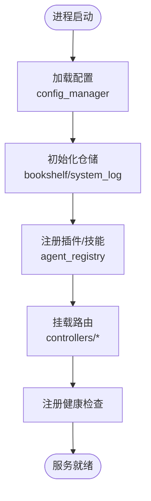

**图表来源** 
- [backend/app.py](file://backend/app.py)
- [backend/bootstrap.py](file://backend/bootstrap.py)
- [backend/config_manager.py](file://backend/config_manager.py)
- [backend/agent_registry.py](file://agent_registry.py)
- [backend/bookshelf_repository.py](file://backend/bookshelf_repository.py)
- [backend/system_log_store.py](file://backend/system_log_store.py)

**章节来源**
- [backend/app.py](file://backend/app.py)
- [backend/bootstrap.py](file://backend/bootstrap.py)
- [backend/config_manager.py](file://backend/config_manager.py)
- [backend/agent_registry.py](file://agent_registry.py)

### 控制器层（Controller）
- 职责：接收 HTTP 请求、参数校验、鉴权拦截、调用服务层、统一错误码与响应格式。
- 典型控制器：认证、数据源、问数流程、智能聊天、RBAC、数据权限、飞书同步等。
- 安全：基于令牌的身份校验与角色/数据权限校验，敏感操作记录审计日志。

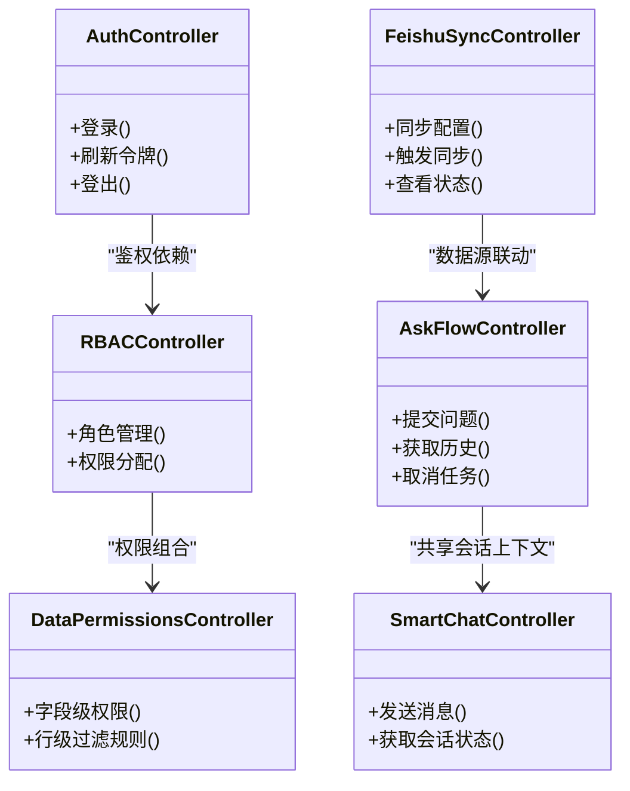

**图表来源** 
- [backend/controllers/ask_flow.py](file://backend/controllers/ask_flow.py)
- [backend/controllers/smart_chat.py](file://backend/controllers/smart_chat.py)
- [backend/controllers/auth.py](file://backend/controllers/auth.py)
- [backend/controllers/rbac.py](file://backend/controllers/rbac.py)
- [backend/controllers/data_permissions.py](file://backend/controllers/data_permissions.py)
- [backend/controllers/feishu_sync.py](file://backend/controllers/feishu_sync.py)

**章节来源**
- [backend/controllers/ask_flow.py](file://backend/controllers/ask_flow.py)
- [backend/controllers/smart_chat.py](file://backend/controllers/smart_chat.py)
- [backend/controllers/auth.py](file://backend/controllers/auth.py)
- [backend/controllers/rbac.py](file://backend/controllers/rbac.py)
- [backend/controllers/data_permissions.py](file://backend/controllers/data_permissions.py)
- [backend/controllers/feishu_sync.py](file://backend/controllers/feishu_sync.py)

### 服务层（Service）与 NL2SQL 流程
- 基础版服务：快速路径，直接意图识别与 SQL 生成，适合简单查询。
- 进阶版服务：多 Agent 协作、意图消歧、证据投票、SQL 质量评估、模板策略、结论与建议生成。
- 编排要点：先读元数据与权限，再调用 LLM 生成候选 SQL，经插件校验后执行，最后聚合结果与思考链。

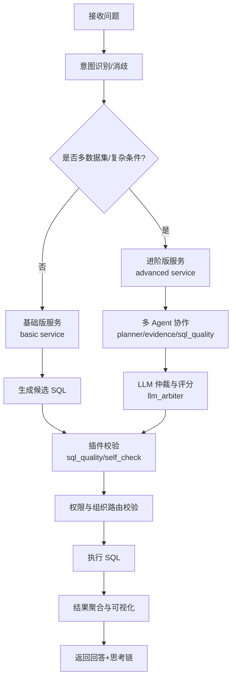

**图表来源** 
- [backend/smartask_basic/service.py](file://backend/smartask_basic/service.py)
- [backend/smartask_advanced/service.py](file://backend/smartask_advanced/service.py)
- [backend/disambiguation/llm_arbiter.py](file://backend/disambiguation/llm_arbiter.py)
- [backend/organization_route_resolver.py](file://backend/organization_route_resolver.py)

**章节来源**
- [backend/smartask_basic/service.py](file://backend/smartask_basic/service.py)
- [backend/smartask_advanced/service.py](file://backend/smartask_advanced/service.py)
- [backend/disambiguation/llm_arbiter.py](file://backend/disambiguation/llm_arbiter.py)
- [backend/organization_route_resolver.py](file://backend/organization_route_resolver.py)

### 插件化技能系统（Skills）
- 设计目标：将查询增强能力模块化，按需启用，降低耦合，提升可维护性与可测试性。
- 典型技能：答案契约、资产包、数据集路由、证据投票、黄金 SQL、Pandas 分析、规划器、路由守卫、自检、SQL 质量、模板策略等。
- 注册与发现：通过注册表集中管理，服务层在编排阶段动态加载。

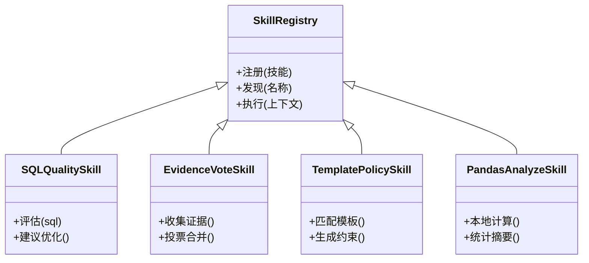

**图表来源** 
- [backend/smartask_advanced/skills/__init__.py](file://backend/smartask_advanced/skills/__init__.py)
- [backend/smartask_advanced/skills/sql_quality.py](file://backend/smartask_advanced/skills/sql_quality.py)
- [backend/smartask_advanced/skills/evidence_vote.py](file://backend/smartask_advanced/skills/evidence_vote.py)
- [backend/smartask_advanced/skills/template_policy.py](file://backend/smartask_advanced/skills/template_policy.py)
- [backend/smartask_advanced/skills/pandas_analyze.py](file://backend/smartask_advanced/skills/pandas_analyze.py)

**章节来源**
- [backend/smartask_advanced/skills/__init__.py](file://backend/smartask_advanced/skills/__init__.py)
- [backend/smartask_advanced/skills/sql_quality.py](file://backend/smartask_advanced/skills/sql_quality.py)
- [backend/smartask_advanced/skills/evidence_vote.py](file://backend/smartask_advanced/skills/evidence_vote.py)
- [backend/smartask_advanced/skills/template_policy.py](file://backend/smartask_advanced/skills/template_policy.py)
- [backend/smartask_advanced/skills/pandas_analyze.py](file://backend/smartask_advanced/skills/pandas_analyze.py)

### 外部集成（LLM 与飞书）
- LLM 集成：封装调用、重试与超时控制、结果缓存与降级策略。
- 飞书集成：URL 解析、表格/文档同步、异步任务队列、状态回写与错误告警。
- 数据集变换：对原始数据进行清洗、映射与标准化，提高 NL2SQL 准确率。

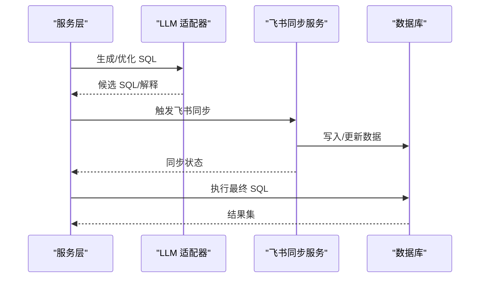

**图表来源** 
- [backend/vanna_core.py](file://backend/vanna_core.py)
- [backend/feishu_sync_service.py](file://backend/feishu_sync_service.py)
- [backend/feishu_sync_manager.py](file://backend/feishu_sync_manager.py)
- [backend/feishu_url_parser.py](file://backend/feishu_url_parser.py)
- [backend/dataset_transform_service.py](file://backend/dataset_transform_service.py)

**章节来源**
- [backend/vanna_core.py](file://backend/vanna_core.py)
- [backend/feishu_sync_service.py](file://backend/feishu_sync_service.py)
- [backend/feishu_sync_manager.py](file://backend/feishu_sync_manager.py)
- [backend/feishu_url_parser.py](file://backend/feishu_url_parser.py)
- [backend/dataset_transform_service.py](file://backend/dataset_transform_service.py)

### 权限与安全
- 认证：基于令牌的身份校验，支持刷新与登出。
- RBAC：角色与权限模型，按钮级与接口级控制。
- 数据权限：字段级与行级过滤，结合组织树路由实现租户隔离。
- 安全加固：密钥编解码、特性开关、审计日志、输入校验与输出脱敏。

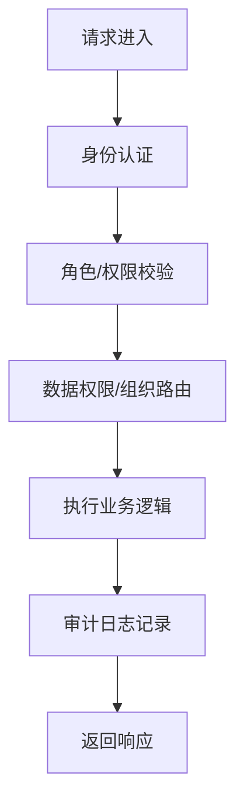

**图表来源** 
- [backend/controllers/auth.py](file://backend/controllers/auth.py)
- [backend/controllers/rbac.py](file://backend/controllers/rbac.py)
- [backend/controllers/data_permissions.py](file://backend/controllers/data_permissions.py)
- [backend/organization_route_resolver.py](file://backend/organization_route_resolver.py)
- [backend/security.py](file://backend/security.py)
- [backend/secret_codec.py](file://backend/secret_codec.py)
- [backend/system_log_store.py](file://backend/system_log_store.py)

**章节来源**
- [backend/controllers/auth.py](file://backend/controllers/auth.py)
- [backend/controllers/rbac.py](file://backend/controllers/rbac.py)
- [backend/controllers/data_permissions.py](file://backend/controllers/data_permissions.py)
- [backend/organization_route_resolver.py](file://backend/organization_route_resolver.py)
- [backend/security.py](file://backend/security.py)
- [backend/secret_codec.py](file://backend/secret_codec.py)
- [backend/system_log_store.py](file://backend/system_log_store.py)

### 数据存储与迁移
- Bookshelf 仓储：管理数据集、提示词、报告配置等运行时资产。
- 系统日志：记录事件、错误与审计轨迹，支持查询与导出。
- 迁移脚本：数据库 schema 与初始数据变更，保证版本一致性。

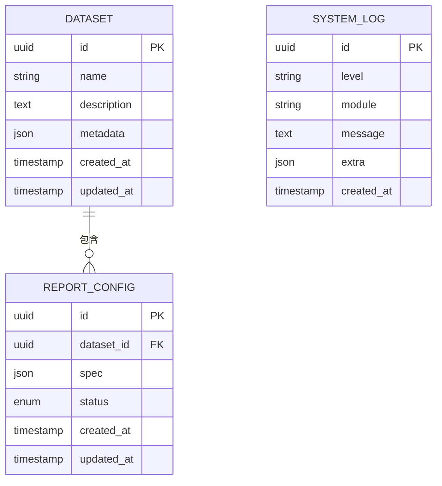

**图表来源** 
- [backend/bookshelf_repository.py](file://backend/bookshelf_repository.py)
- [backend/system_log_store.py](file://backend/system_log_store.py)
- [docker/postgres/init/001_bookshelf_schema.sql](file://docker/postgres/init/001_bookshelf_schema.sql)
- [docker/postgres/init/004_report_config.sql](file://docker/postgres/init/004_report_config.sql)
- [docker/postgres/init/006_system_event_logs.sql](file://docker/postgres/init/006_system_event_logs.sql)

**章节来源**
- [backend/bookshelf_repository.py](file://backend/bookshelf_repository.py)
- [backend/system_log_store.py](file://backend/system_log_store.py)

### 前端交互与路由
- 路由：SPA 路由管理页面跳转与参数传递。
- 视图：SmartAsk 主视图负责对话渲染、结果展示与调试面板。
- API：统一的请求封装、错误处理与重试策略。

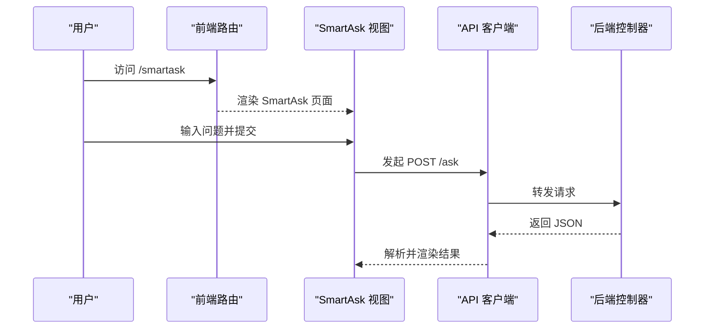

**图表来源** 
- [frontend/src/router/index.js](file://frontend/src/router/index.js)
- [frontend/src/views/SmartAsk.vue](file://frontend/src/views/SmartAsk.vue)
- [frontend/src/api/index.js](file://frontend/src/api/index.js)
- [backend/controllers/ask_flow.py](file://backend/controllers/ask_flow.py)

**章节来源**
- [frontend/src/router/index.js](file://frontend/src/router/index.js)
- [frontend/src/views/SmartAsk.vue](file://frontend/src/views/SmartAsk.vue)
- [frontend/src/api/index.js](file://frontend/src/api/index.js)

## 依赖关系分析
- 模块内聚与耦合：控制器低耦合于服务层，服务层通过仓储与插件接口解耦外部依赖。
- 外部依赖：LLM 与飞书通过适配器接入，便于替换与扩展。
- 潜在循环依赖：通过接口与注册表避免直接循环引用。

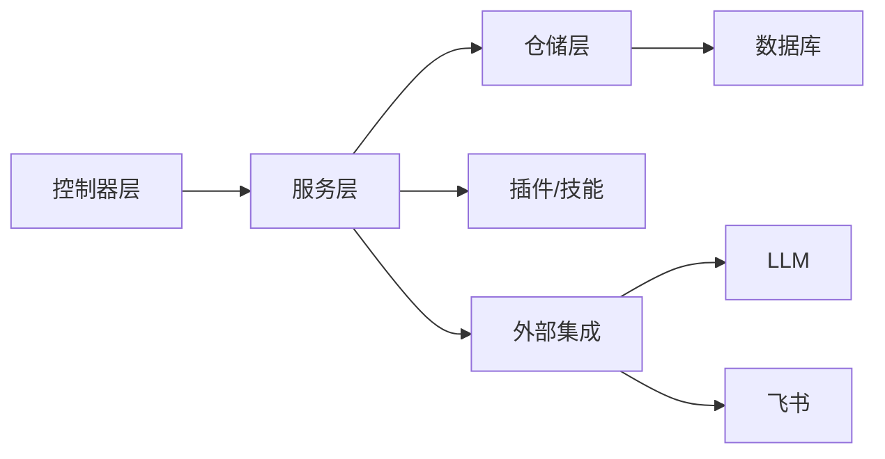

**图表来源** 
- [backend/app.py](file://backend/app.py)
- [backend/controllers/ask_flow.py](file://backend/controllers/ask_flow.py)
- [backend/smartask_advanced/service.py](file://backend/smartask_advanced/service.py)
- [backend/bookshelf_repository.py](file://backend/bookshelf_repository.py)
- [backend/vanna_core.py](file://backend/vanna_core.py)
- [backend/feishu_sync_service.py](file://backend/feishu_sync_service.py)

**章节来源**
- [backend/app.py](file://backend/app.py)
- [backend/controllers/ask_flow.py](file://backend/controllers/ask_flow.py)
- [backend/smartask_advanced/service.py](file://backend/smartask_advanced/service.py)
- [backend/bookshelf_repository.py](file://backend/bookshelf_repository.py)
- [backend/vanna_core.py](file://backend/vanna_core.py)
- [backend/feishu_sync_service.py](file://backend/feishu_sync_service.py)

## 性能考虑
- 缓存策略：对频繁访问的元数据与模板进行缓存，减少 LLM 调用与数据库压力。
- 并发与限流：控制器层引入请求限流与超时控制，保护后端与外部服务。
- 异步处理：飞书同步与批量任务采用异步队列，避免阻塞主流程。
- 查询优化：SQL 质量评估与改写，减少全表扫描与冗余计算。
- 资源隔离：按租户/组织维度隔离数据访问，防止热点冲突。

[本节为通用指导，不直接分析具体文件]

## 故障排查指南
- 常见问题定位：
  - 认证失败：检查令牌有效期、签名与权限配置。
  - NL2SQL 失败：查看 LLM 返回与 SQL 质量评估日志，确认元数据完整性。
  - 飞书同步异常：核对 URL 解析、权限与网络连通性。
- 诊断工具：
  - 系统日志：查询事件与错误堆栈，关联请求 ID。
  - 健康检查：确认服务状态与依赖可用性。
  - 调试面板：前端 SqlDebug 浮窗用于 SQL 与中间态可视化。

**章节来源**
- [backend/system_log_store.py](file://backend/system_log_store.py)
- [backend/security.py](file://backend/security.py)
- [backend/vanna_core.py](file://backend/vanna_core.py)
- [backend/feishu_sync_service.py](file://backend/feishu_sync_service.py)

## 结论
SmartAsk 通过清晰的分层与插件化设计，实现了高内聚、低耦合的可扩展架构。NL2SQL 流程在多 Agent 协作与插件校验下具备更强的鲁棒性；权限与安全体系覆盖接口、数据与审计层面；容器化部署与异步任务支撑了高可用与弹性伸缩。后续可在缓存、限流、监控与可观测性方面持续优化，进一步提升性能与稳定性。

[本节为总结性内容，不直接分析具体文件]

## 附录

### 容器化部署拓扑
- 编排：Docker Compose 统一管理前端、后端与数据库服务。
- 反向代理：Nginx 托管前端静态资源，转发 API 请求到后端。
- 环境变量：敏感配置通过密钥编解码注入，支持不同环境切换。

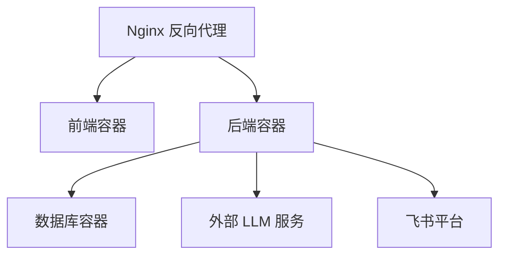

**图表来源** 
- [docker-compose.yml](file://docker-compose.yml)
- [backend/Dockerfile](file://backend/Dockerfile)
- [frontend/Dockerfile](file://frontend/Dockerfile)
- [backend/secret_codec.py](file://backend/secret_codec.py)

**章节来源**
- [docker-compose.yml](file://docker-compose.yml)
- [backend/Dockerfile](file://backend/Dockerfile)
- [frontend/Dockerfile](file://frontend/Dockerfile)
- [backend/secret_codec.py](file://backend/secret_codec.py)