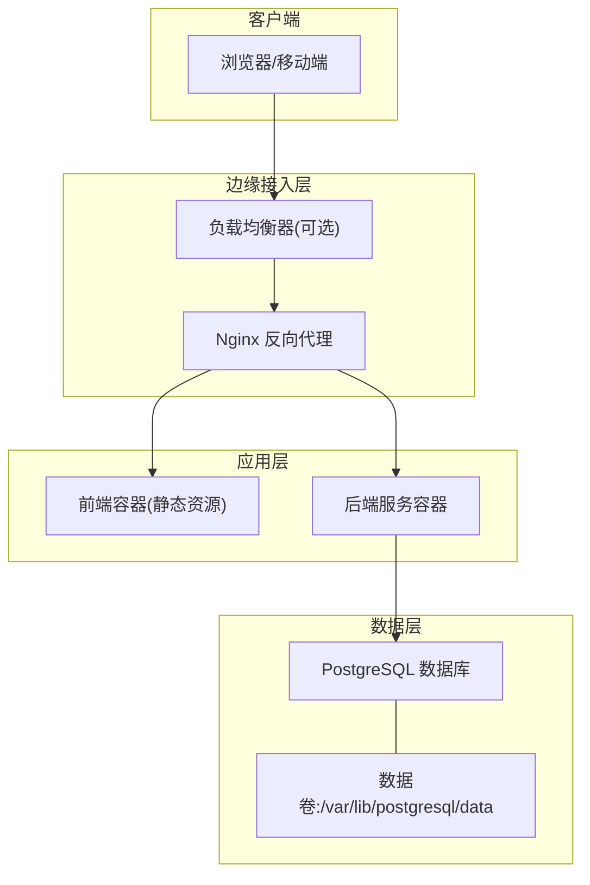
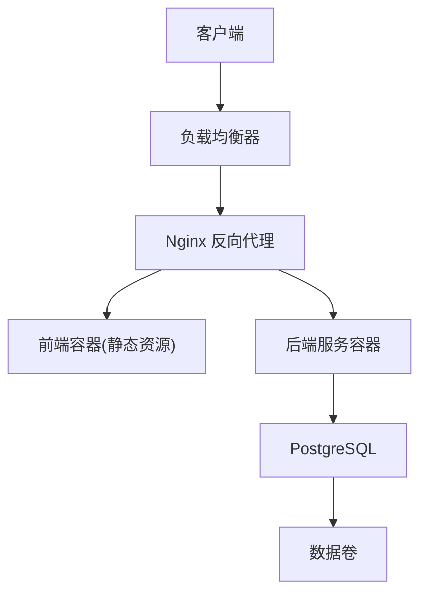
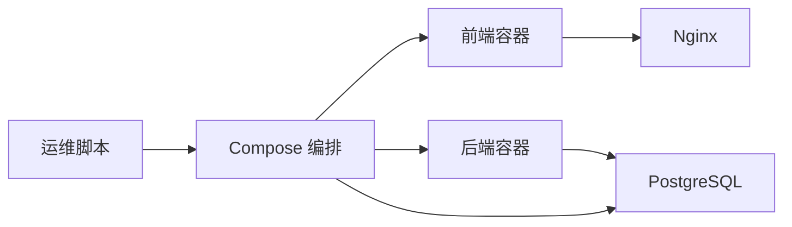

# 部署架构设计

<cite>
**本文引用的文件**   
- [docker-compose.yml](file://docker-compose.yml)
- [backend/Dockerfile](file://backend/Dockerfile)
- [frontend/Dockerfile](file://frontend/Dockerfile)
- [frontend/nginx.conf](file://frontend/nginx.conf)
- [backend/.dockerignore](file://backend/.dockerignore)
- [frontend/.dockerignore](file://frontend/.dockerignore)
- [deploy.sh](file://deploy.sh)
- [update.sh](file://update.sh)
- [backup.sh](file://backup.sh)
- [restore.sh](file://restore.sh)
- [doctor.sh](file://doctor.sh)
- [scripts/integration_test.py](file://scripts/integration_test.py)
- [scripts/verify_deployment.py](file://scripts/verify_deployment.py)
- [docker/postgres/init/001_bookshelf_schema.sql](file://docker/postgres/init/001_bookshelf_schema.sql)
- [docker/postgres/init/002_angel_group_data.sql](file://docker/postgres/init/002_angel_group_data.sql)
- [docker/postgres/init/003_bookshelf_agent1_prompt_upgrade.sql](file://docker/postgres/init/003_bookshelf_agent1_prompt_upgrade.sql)
- [docker/postgres/init/004_report_config.sql](file://docker/postgres/init/004_report_config.sql)
- [docker/postgres/init/005_report_thresholds.sql](file://docker/postgres/init/005_report_thresholds.sql)
- [docker/postgres/init/006_system_event_logs.sql](file://docker/postgres/init/006_system_event_logs.sql)
- [backend/app.py](file://backend/app.py)
- [backend/config_manager.py](file://backend/config_manager.py)
- [backend/requirements.txt](file://backend/requirements.txt)
- [frontend/package.json](file://frontend/package.json)
- [frontend/vite.config.js](file://frontend/vite.config.js)
- [README.md](file://README.md)
</cite>

## 目录
1. [简介](#简介)
2. [项目结构](#项目结构)
3. [核心组件](#核心组件)
4. [架构总览](#架构总览)
5. [详细组件分析](#详细组件分析)
6. [依赖关系分析](#依赖关系分析)
7. [性能考虑](#性能考虑)
8. [故障排查指南](#故障排查指南)
9. [结论](#结论)
10. [附录](#附录)

## 简介
本文件面向 SmartAsk 智能问数平台的工程与运维团队，提供生产级容器化部署架构设计与实施指南。内容覆盖：
- Docker 镜像构建、多阶段构建优化与镜像分层策略
- Docker Compose 编排与服务间网络通信、数据卷挂载与环境变量管理
- 生产环境拓扑（负载均衡、反向代理、高可用）
- PostgreSQL 数据库部署方案（主从复制、备份恢复、性能调优）
- CI/CD 流水线设计（自动化测试、构建与部署）
- 监控告警体系（日志收集、指标采集、故障诊断工具链）
- 部署架构图与各组件物理位置、依赖关系说明

## 项目结构
SmartAsk 采用前后端分离的容器化部署模式：
- 后端服务：Python FastAPI/Flask 应用（以 app.py 为入口），通过 Docker 镜像运行
- 前端资源：Vue 静态资源由 Nginx 提供服务，Docker 镜像包含构建产物与 Nginx 配置
- 数据库：PostgreSQL 作为持久化存储，初始化脚本位于 docker/postgres/init
- 编排：docker-compose.yml 统一编排后端、前端、Nginx、数据库等组件
- 运维脚本：deploy/update/backup/restore/doctor 等脚本用于日常操作

图表来源
- [docker-compose.yml](file://docker-compose.yml)
- [frontend/nginx.conf](file://frontend/nginx.conf)
- [backend/app.py](file://backend/app.py)

章节来源
- [docker-compose.yml](file://docker-compose.yml)
- [README.md](file://README.md)

## 核心组件
- 后端服务容器
  - 入口：app.py
  - 依赖：requirements.txt
  - 配置：config_manager.py（环境变量驱动）
  - 镜像：backend/Dockerfile（建议多阶段构建）
- 前端服务容器
  - 构建：vite.config.js + package.json
  - 运行：nginx.conf（静态资源与反向代理）
  - 镜像：frontend/Dockerfile（多阶段构建）
- 数据库
  - 初始化脚本：docker/postgres/init/*.sql
  - 数据卷：/var/lib/postgresql/data
- 编排与运维
  - 编排：docker-compose.yml
  - 部署脚本：deploy.sh, update.sh
  - 备份恢复：backup.sh, restore.sh
  - 健康检查：doctor.sh, scripts/verify_deployment.py

章节来源
- [backend/app.py](file://backend/app.py)
- [backend/config_manager.py](file://backend/config_manager.py)
- [backend/requirements.txt](file://backend/requirements.txt)
- [frontend/package.json](file://frontend/package.json)
- [frontend/vite.config.js](file://frontend/vite.config.js)
- [frontend/nginx.conf](file://frontend/nginx.conf)
- [docker/postgres/init/001_bookshelf_schema.sql](file://docker/postgres/init/001_bookshelf_schema.sql)
- [docker/postgres/init/002_angel_group_data.sql](file://docker/postgres/init/002_angel_group_data.sql)
- [docker/postgres/init/003_bookshelf_agent1_prompt_upgrade.sql](file://docker/postgres/init/003_bookshelf_agent1_prompt_upgrade.sql)
- [docker/postgres/init/004_report_config.sql](file://docker/postgres/init/004_report_config.sql)
- [docker/postgres/init/005_report_thresholds.sql](file://docker/postgres/init/005_report_thresholds.sql)
- [docker/postgres/init/006_system_event_logs.sql](file://docker/postgres/init/006_system_event_logs.sql)
- [docker-compose.yml](file://docker-compose.yml)
- [deploy.sh](file://deploy.sh)
- [update.sh](file://update.sh)
- [backup.sh](file://backup.sh)
- [restore.sh](file://restore.sh)
- [doctor.sh](file://doctor.sh)
- [scripts/verify_deployment.py](file://scripts/verify_deployment.py)

## 架构总览
SmartAsk 的生产部署拓扑建议如下：
- 外部流量经负载均衡器进入 Nginx 反向代理
- Nginx 将静态资源请求路由到前端容器，API 请求转发至后端服务
- 后端服务连接 PostgreSQL 进行数据读写
- 所有容器通过 Docker 网络互通，敏感配置通过环境变量注入
- 数据持久化通过数据卷挂载到宿主机或云盘

图表来源
- [docker-compose.yml](file://docker-compose.yml)
- [frontend/nginx.conf](file://frontend/nginx.conf)
- [backend/app.py](file://backend/app.py)

## 详细组件分析

### 容器镜像构建与分层策略
- 后端镜像（backend/Dockerfile）
  - 建议多阶段构建：第一阶段安装依赖并缓存，第二阶段仅拷贝运行时代码
  - 使用 .dockerignore 排除无关文件，减小镜像体积
  - 基础镜像选择轻量 Python 镜像，启用只读根文件系统
- 前端镜像（frontend/Dockerfile）
  - 构建阶段：Node 环境编译 Vite 产物
  - 运行阶段：Nginx 提供静态资源，最小化运行时依赖
  - 使用 .dockerignore 排除开发依赖与源码
- 分层优化要点
  - 将频繁变更的代码层放在镜像底部，稳定依赖层在上部，提升缓存命中率
  - 合并 RUN 指令减少层数，避免中间层过大
  - 使用非 root 用户运行容器，提高安全性

章节来源
- [backend/Dockerfile](file://backend/Dockerfile)
- [frontend/Dockerfile](file://frontend/Dockerfile)
- [backend/.dockerignore](file://backend/.dockerignore)
- [frontend/.dockerignore](file://frontend/.dockerignore)

### Docker Compose 编排与服务通信
- 服务定义
  - 后端服务：暴露 API 端口，挂载必要配置与日志
  - 前端服务：暴露 HTTP 端口，挂载 Nginx 配置与静态资源
  - 数据库服务：暴露 5432 端口，挂载数据卷与初始化脚本
- 网络通信
  - 默认桥接网络，服务间通过服务名解析
  - 可自定义网络隔离不同环境（dev/staging/prod）
- 数据卷挂载
  - 数据库数据卷：/var/lib/postgresql/data
  - 日志卷：便于集中收集
  - 配置文件卷：环境变量与密钥管理
- 环境变量管理
  - 数据库连接串、认证凭据、功能开关等通过环境变量注入
  - 建议使用 .env 文件或外部密钥管理服务

章节来源
- [docker-compose.yml](file://docker-compose.yml)

### 反向代理与负载均衡
- Nginx 反向代理
  - 静态资源路径直接返回前端构建产物
  - API 路径转发至后端服务
  - 支持 HTTPS 终止、Gzip 压缩、缓存策略
- 负载均衡
  - 多实例后端服务通过上游组轮询或加权分发
  - 健康检查与故障剔除确保高可用

章节来源
- [frontend/nginx.conf](file://frontend/nginx.conf)

### 数据库部署方案（PostgreSQL）
- 初始化脚本
  - 按顺序执行 schema、数据、升级脚本
  - 确保幂等性与回滚策略
- 主从复制
  - 主库写入，从库读取扩展
  - 流复制配置与同步模式选择（异步/同步）
- 备份恢复
  - 定期逻辑/物理备份，保留策略与异地容灾
  - 恢复演练与验证流程
- 性能调优
  - 内存参数（shared_buffers、work_mem）
  - WAL 与检查点配置
  - 索引与查询优化

章节来源
- [docker/postgres/init/001_bookshelf_schema.sql](file://docker/postgres/init/001_bookshelf_schema.sql)
- [docker/postgres/init/002_angel_group_data.sql](file://docker/postgres/init/002_angel_group_data.sql)
- [docker/postgres/init/003_bookshelf_agent1_prompt_upgrade.sql](file://docker/postgres/init/003_bookshelf_agent1_prompt_upgrade.sql)
- [docker/postgres/init/004_report_config.sql](file://docker/postgres/init/004_report_config.sql)
- [docker/postgres/init/005_report_thresholds.sql](file://docker/postgres/init/005_report_thresholds.sql)
- [docker/postgres/init/006_system_event_logs.sql](file://docker/postgres/init/006_system_event_logs.sql)

### CI/CD 流水线设计
- 触发条件：代码推送、标签发布、定时任务
- 步骤
  - 拉取代码与依赖缓存
  - 单元测试与集成测试（scripts/integration_test.py）
  - 构建镜像（后端与前端）
  - 镜像扫描与安全校验
  - 推送到镜像仓库
  - 部署到目标环境（staging/prod）
  - 冒烟测试与健康检查（scripts/verify_deployment.py）
- 回滚策略：版本标记与快速回滚

章节来源
- [scripts/integration_test.py](file://scripts/integration_test.py)
- [scripts/verify_deployment.py](file://scripts/verify_deployment.py)

### 监控告警体系
- 日志收集
  - 容器标准输出与错误日志
  - 应用结构化日志（JSON）
  - 集中式日志平台（ELK/Loki）
- 指标采集
  - 应用指标（QPS、延迟、错误率）
  - 系统指标（CPU、内存、磁盘、网络）
  - 数据库指标（连接数、慢查询、锁等待）
- 告警规则
  - 阈值告警与事件告警
  - 通知渠道（邮件、短信、IM）
- 故障诊断
  - 健康检查接口与探针
  - 分布式追踪与链路追踪
  - 调试工具与快照导出

章节来源
- [doctor.sh](file://doctor.sh)
- [scripts/verify_deployment.py](file://scripts/verify_deployment.py)

## 依赖关系分析
SmartAsk 各组件之间的依赖关系如下：
- 前端依赖 Nginx 提供静态资源
- 后端依赖 PostgreSQL 进行数据持久化
- 编排层依赖 Docker 与 Compose
- 运维脚本依赖系统命令与网络连通性

图表来源
- [docker-compose.yml](file://docker-compose.yml)
- [frontend/nginx.conf](file://frontend/nginx.conf)
- [backend/app.py](file://backend/app.py)

章节来源
- [docker-compose.yml](file://docker-compose.yml)

## 性能考虑
- 镜像构建
  - 多阶段构建与依赖缓存
  - 精简基础镜像与运行时依赖
- 容器运行
  - 资源限制与配额（CPU、内存）
  - 水平扩展与自动伸缩
- 网络优化
  - 连接池与超时配置
  - 反向代理缓存与压缩
- 数据库优化
  - 连接池与查询缓存
  - 索引与分区表策略
- 监控与调优
  - 全链路性能剖析
  - 瓶颈定位与容量规划

## 故障排查指南
- 常见问题
  - 容器启动失败：检查日志与依赖
  - 网络不通：检查端口映射与防火墙
  - 数据库连接失败：检查连接串与权限
  - 静态资源 404：检查 Nginx 配置与路径
- 诊断工具
  - doctor.sh：系统健康检查
  - verify_deployment.py：部署验证
  - backup.sh/restore.sh：数据备份与恢复
- 处理流程
  - 收集日志与指标
  - 复现问题与定位根因
  - 制定修复方案与验证
  - 更新文档与知识库

章节来源
- [doctor.sh](file://doctor.sh)
- [scripts/verify_deployment.py](file://scripts/verify_deployment.py)
- [backup.sh](file://backup.sh)
- [restore.sh](file://restore.sh)

## 结论
SmartAsk 的容器化部署架构以 Docker 与 Compose 为核心，结合 Nginx 反向代理与 PostgreSQL 数据库，形成稳定、可扩展的生产环境。通过多阶段镜像构建、环境变量管理与数据卷持久化，实现安全高效的部署与运维。配合 CI/CD 流水线与监控告警体系，保障系统的持续交付与高可用性。

## 附录
- 部署命令参考
  - 部署：deploy.sh
  - 更新：update.sh
  - 备份：backup.sh
  - 恢复：restore.sh
  - 健康检查：doctor.sh
- 配置文件参考
  - 后端入口：backend/app.py
  - 配置管理：backend/config_manager.py
  - 前端构建：frontend/vite.config.js
  - Nginx 配置：frontend/nginx.conf
  - 数据库初始化：docker/postgres/init/*.sql