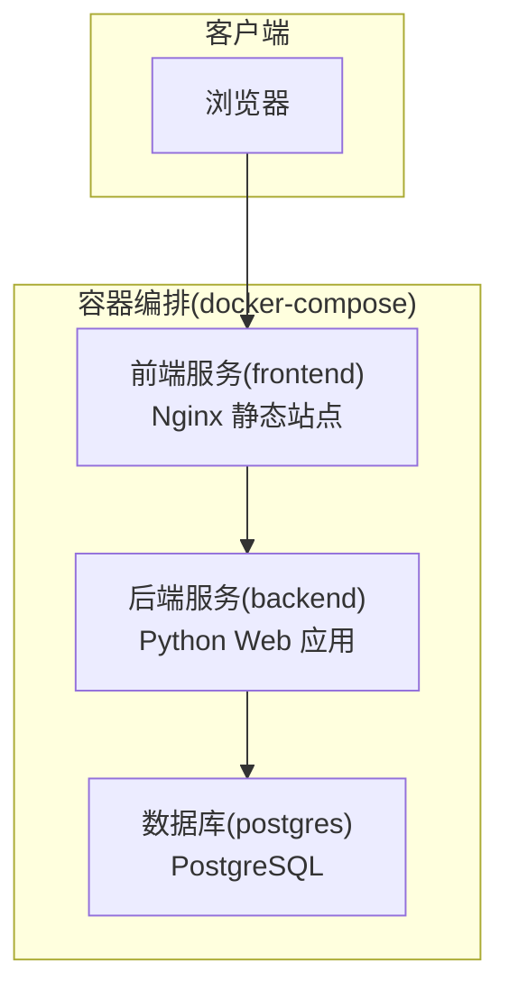
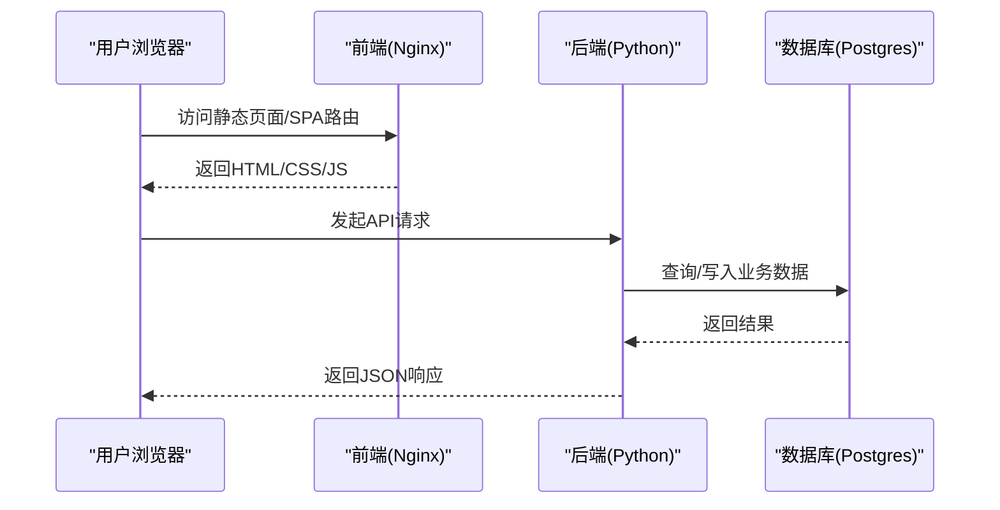
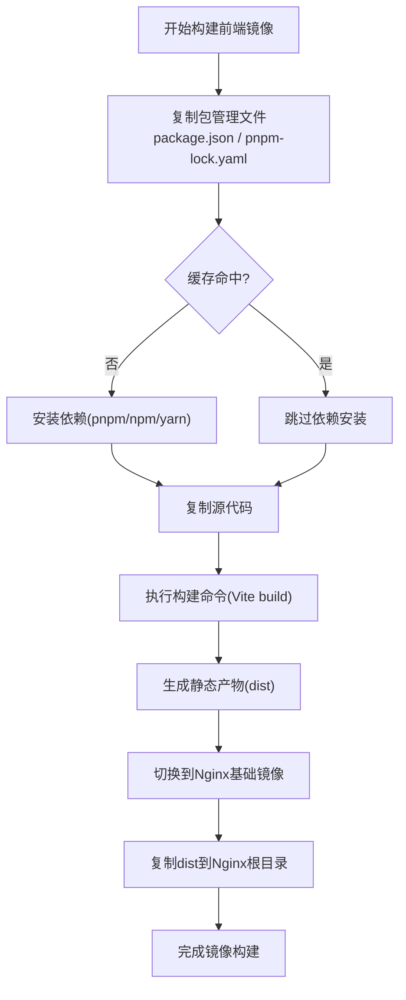
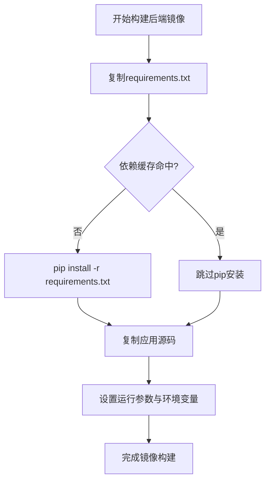
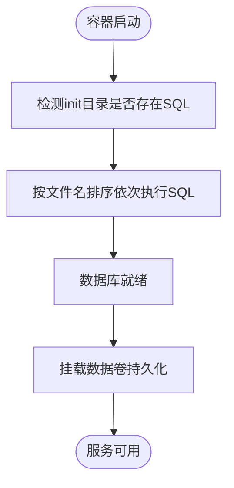
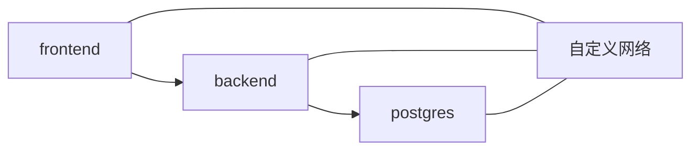
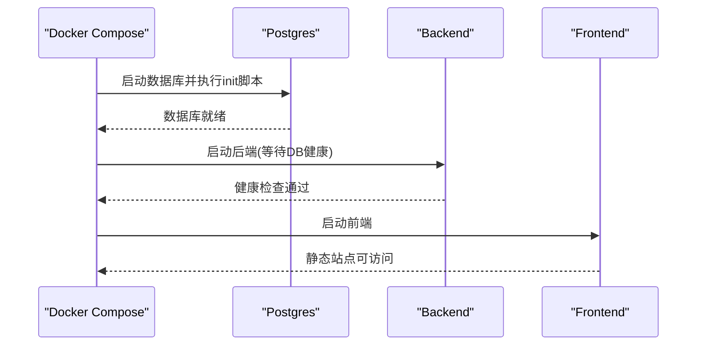
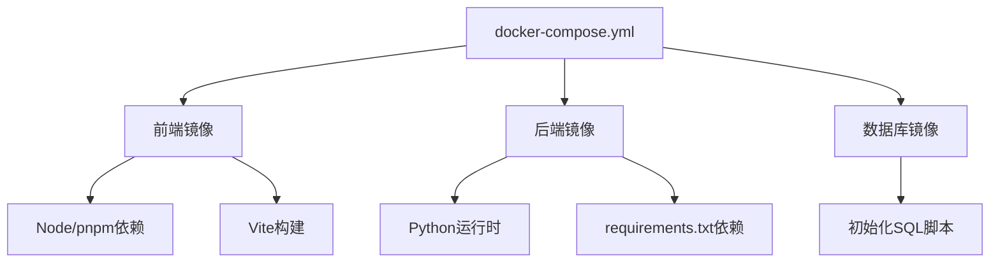

# Docker 容器化部署

<cite>
**本文引用的文件**   
- [docker-compose.yml](file://docker-compose.yml)
- [backend/Dockerfile](file://backend/Dockerfile)
- [frontend/Dockerfile](file://frontend/Dockerfile)
- [frontend/nginx.conf](file://frontend/nginx.conf)
- [docker/postgres/init/001_bookshelf_schema.sql](file://docker/postgres/init/001_bookshelf_schema.sql)
- [docker/postgres/init/002_angel_group_data.sql](file://docker/postgres/init/002_angel_group_data.sql)
- [docker/postgres/init/003_bookshelf_agent1_prompt_upgrade.sql](file://docker/postgres/init/003_bookshelf_agent1_prompt_upgrade.sql)
- [docker/postgres/init/004_report_config.sql](file://docker/postgres/init/004_report_config.sql)
- [docker/postgres/init/005_report_thresholds.sql](file://docker/postgres/init/005_report_thresholds.sql)
- [docker/postgres/init/006_system_event_logs.sql](file://docker/postgres/init/006_system_event_logs.sql)
- [backend/.dockerignore](file://backend/.dockerignore)
- [frontend/.dockerignore](file://frontend/.dockerignore)
- [.dockerignore](file://.dockerignore)
- [backend/app.py](file://backend/app.py)
- [backend/bootstrap.py](file://backend/bootstrap.py)
- [backend/config_manager.py](file://backend/config_manager.py)
- [backend/requirements.txt](file://backend/requirements.txt)
- [frontend/package.json](file://frontend/package.json)
- [frontend/vite.config.js](file://frontend/vite.config.js)
- [deploy.sh](file://deploy.sh)
- [start_all.bat](file://start_all.bat)
- [stop_all.bat](file://stop_all.bat)
</cite>

## 目录
1. [简介](#简介)
2. [项目结构](#项目结构)
3. [核心组件](#核心组件)
4. [架构总览](#架构总览)
5. [详细组件分析](#详细组件分析)
6. [依赖关系分析](#依赖关系分析)
7. [性能与镜像优化](#性能与镜像优化)
8. [故障排查指南](#故障排查指南)
9. [生产环境最佳实践](#生产环境最佳实践)
10. [结论](#结论)

## 简介
本文件面向 SmartAsk 智能问数平台的容器化部署，覆盖以下主题：
- Docker 镜像构建流程（多阶段构建、依赖缓存、镜像瘦身）
- docker-compose 编排（服务定义、网络、数据卷、环境变量）
- 完整启动流程（数据库初始化、应用启动、健康检查）
- 日志收集与监控集成、资源限制
- 常见故障排查方法
- 生产环境的滚动更新、蓝绿部署与灰度发布策略

## 项目结构
SmartAsk 采用前后端分离架构，后端为 Python Web 应用，前端为 Vue + Vite 静态站点并通过 Nginx 提供 HTTP 服务。数据库使用 PostgreSQL，通过 init SQL 脚本完成初始化和种子数据。

**图表来源**
- [docker-compose.yml](file://docker-compose.yml)
- [frontend/Dockerfile](file://frontend/Dockerfile)
- [backend/Dockerfile](file://backend/Dockerfile)

**章节来源**
- [docker-compose.yml](file://docker-compose.yml)
- [frontend/Dockerfile](file://frontend/Dockerfile)
- [backend/Dockerfile](file://backend/Dockerfile)

## 核心组件
- 前端镜像：基于 Node 构建产物，最终由 Nginx 提供服务，减少运行时依赖。
- 后端镜像：基于 Python，安装 requirements 并运行应用入口。
- 数据库镜像：官方 Postgres 镜像，挂载持久化卷，并通过 init 目录执行初始化脚本。
- 编排文件：统一管理服务、网络、卷、环境变量与健康检查。

**章节来源**
- [docker-compose.yml](file://docker-compose.yml)
- [frontend/Dockerfile](file://frontend/Dockerfile)
- [backend/Dockerfile](file://backend/Dockerfile)
- [frontend/nginx.conf](file://frontend/nginx.conf)

## 架构总览
下图展示了容器间通信、数据流向与关键配置点。

**图表来源**
- [docker-compose.yml](file://docker-compose.yml)
- [frontend/nginx.conf](file://frontend/nginx.conf)
- [backend/app.py](file://backend/app.py)

**章节来源**
- [docker-compose.yml](file://docker-compose.yml)
- [frontend/nginx.conf](file://frontend/nginx.conf)
- [backend/app.py](file://backend/app.py)

## 详细组件分析

### 前端镜像构建（多阶段构建与缓存优化）
- 构建阶段：使用 Node 镜像安装依赖并构建 Vite 产物，充分利用层缓存。
- 运行阶段：使用 Nginx 镜像托管静态资源，最小化运行时体积。
- 缓存策略：将 package.json 与 lock 文件优先拷贝，命中缓存后再拷贝源码。
- 输出产物：仅包含构建后的静态文件，避免携带开发依赖。

**图表来源**
- [frontend/Dockerfile](file://frontend/Dockerfile)
- [frontend/package.json](file://frontend/package.json)
- [frontend/vite.config.js](file://frontend/vite.config.js)

**章节来源**
- [frontend/Dockerfile](file://frontend/Dockerfile)
- [frontend/package.json](file://frontend/package.json)
- [frontend/vite.config.js](file://frontend/vite.config.js)

### 后端镜像构建（依赖缓存与镜像瘦身）
- 基础镜像：选择轻量 Python 镜像。
- 依赖安装：先复制 requirements.txt 并安装依赖，利用 Docker 层缓存加速重复构建。
- 应用代码：最后复制应用源码，确保依赖变更时不触发全量重建。
- 运行方式：以非 root 用户运行，提升安全性；设置合适的 CMD/ENTRYPOINT。

**图表来源**
- [backend/Dockerfile](file://backend/Dockerfile)
- [backend/requirements.txt](file://backend/requirements.txt)

**章节来源**
- [backend/Dockerfile](file://backend/Dockerfile)
- [backend/requirements.txt](file://backend/requirements.txt)

### 数据库初始化与数据持久化
- 初始化脚本：Postgres 镜像自动执行 docker/postgres/init 下的 SQL 脚本，按数字前缀顺序执行。
- 数据持久化：通过命名卷或绑定挂载持久化数据库文件，避免容器重启丢失数据。
- 环境变量：通过 POSTGRES_USER、POSTGRES_PASSWORD、POSTGRES_DB 等控制数据库实例。

**图表来源**
- [docker/postgres/init/001_bookshelf_schema.sql](file://docker/postgres/init/001_bookshelf_schema.sql)
- [docker/postgres/init/002_angel_group_data.sql](file://docker/postgres/init/002_angel_group_data.sql)
- [docker/postgres/init/003_bookshelf_agent1_prompt_upgrade.sql](file://docker/postgres/init/003_bookshelf_agent1_prompt_upgrade.sql)
- [docker/postgres/init/004_report_config.sql](file://docker/postgres/init/004_report_config.sql)
- [docker/postgres/init/005_report_thresholds.sql](file://docker/postgres/init/005_report_thresholds.sql)
- [docker/postgres/init/006_system_event_logs.sql](file://docker/postgres/init/006_system_event_logs.sql)

**章节来源**
- [docker/postgres/init/001_bookshelf_schema.sql](file://docker/postgres/init/001_bookshelf_schema.sql)
- [docker/postgres/init/002_angel_group_data.sql](file://docker/postgres/init/002_angel_group_data.sql)
- [docker/postgres/init/003_bookshelf_agent1_prompt_upgrade.sql](file://docker/postgres/init/003_bookshelf_agent1_prompt_upgrade.sql)
- [docker/postgres/init/004_report_config.sql](file://docker/postgres/init/004_report_config.sql)
- [docker/postgres/init/005_report_thresholds.sql](file://docker/postgres/init/005_report_thresholds.sql)
- [docker/postgres/init/006_system_event_logs.sql](file://docker/postgres/init/006_system_event_logs.sql)

### docker-compose 编排与服务定义
- 服务划分：frontend、backend、postgres 三个服务。
- 网络：默认 bridge 网络，服务间通过服务名互通。
- 数据卷：为 postgres 创建命名卷，用于持久化数据。
- 环境变量：集中管理数据库连接、应用开关、外部服务密钥等。
- 健康检查：对后端接口进行健康探测，确保服务就绪。

**图表来源**
- [docker-compose.yml](file://docker-compose.yml)

**章节来源**
- [docker-compose.yml](file://docker-compose.yml)

### 环境变量管理与配置注入
- 数据库连接：通过 DATABASE_URL 或 POSTGRES_* 系列变量注入。
- 应用开关：如 FEATURE_FLAGS、LOG_LEVEL 等。
- 外部服务：如飞书同步、AI 模型 API Key 等敏感信息建议通过 .env 或密钥管理工具注入。
- 安全建议：避免在镜像中硬编码密钥，使用运行时注入。

**章节来源**
- [docker-compose.yml](file://docker-compose.yml)
- [backend/config_manager.py](file://backend/config_manager.py)

### 启动流程与健康检查
- 启动顺序：Postgres 先启动并完成初始化，随后后端等待数据库就绪，最后前端启动。
- 健康检查：后端暴露健康检查端点，compose 定期探测。
- 依赖等待：可通过 healthcheck 状态或简单 sleep/wait-for-it 策略保证顺序。

**图表来源**
- [docker-compose.yml](file://docker-compose.yml)
- [backend/app.py](file://backend/app.py)
- [backend/bootstrap.py](file://backend/bootstrap.py)

**章节来源**
- [docker-compose.yml](file://docker-compose.yml)
- [backend/app.py](file://backend/app.py)
- [backend/bootstrap.py](file://backend/bootstrap.py)

## 依赖关系分析
- 前端依赖：Node 构建工具链、Vite、Vue 生态。
- 后端依赖：Python 运行时及 requirements 中的库。
- 数据库依赖：PostgreSQL 引擎与初始化脚本。
- 编排依赖：Docker 与 docker-compose。

**图表来源**
- [frontend/Dockerfile](file://frontend/Dockerfile)
- [backend/Dockerfile](file://backend/Dockerfile)
- [backend/requirements.txt](file://backend/requirements.txt)
- [docker/postgres/init/001_bookshelf_schema.sql](file://docker/postgres/init/001_bookshelf_schema.sql)
- [docker-compose.yml](file://docker-compose.yml)

**章节来源**
- [frontend/Dockerfile](file://frontend/Dockerfile)
- [backend/Dockerfile](file://backend/Dockerfile)
- [backend/requirements.txt](file://backend/requirements.txt)
- [docker/postgres/init/001_bookshelf_schema.sql](file://docker/postgres/init/001_bookshelf_schema.sql)
- [docker-compose.yml](file://docker-compose.yml)

## 性能与镜像优化
- 多阶段构建：前端使用 Node 构建、Nginx 运行，减小镜像体积。
- 依赖缓存：将包清单与锁文件优先拷贝，最大化层缓存命中率。
- 镜像瘦身：移除不必要的运行时依赖，使用 alpine/musl 变体（若适用）。
- 构建上下文：通过 .dockerignore 排除无关文件，加快构建速度。
- 并行构建：合理拆分构建步骤，避免不必要的全量重建。

**章节来源**
- [frontend/Dockerfile](file://frontend/Dockerfile)
- [backend/Dockerfile](file://backend/Dockerfile)
- [frontend/.dockerignore](file://frontend/.dockerignore)
- [backend/.dockerignore](file://backend/.dockerignore)
- [.dockerignore](file://.dockerignore)

## 故障排查指南
- 查看容器日志：
  - 后端日志：docker compose logs backend
  - 前端日志：docker compose logs frontend
  - 数据库日志：docker compose logs postgres
- 常见问题定位：
  - 数据库连接失败：检查环境变量与网络连通性，确认 init 脚本执行成功。
  - 端口冲突：修改端口映射或释放占用端口。
  - 权限问题：确保数据卷挂载路径权限正确。
  - 健康检查失败：检查后端健康端点是否可达，依赖服务是否就绪。
- 调试技巧：
  - 进入容器：docker exec -it <container> sh
  - 临时增加日志级别：调整 LOG_LEVEL 环境变量
  - 验证配置：使用 verify_deployment 脚本或手动 curl 健康检查端点

**章节来源**
- [docker-compose.yml](file://docker-compose.yml)
- [backend/app.py](file://backend/app.py)
- [backend/bootstrap.py](file://backend/bootstrap.py)

## 生产环境最佳实践
- 滚动更新：
  - 逐步替换旧实例，保持服务可用性
  - 配合健康检查与探针，确保流量切换平滑
- 蓝绿部署：
  - 维护两套相同环境，切换流量指向新版本
  - 快速回滚至稳定版本
- 灰度发布：
  - 按比例或按用户维度分流，逐步放量
  - 结合监控与告警，及时发现问题
- 资源限制：
  - 为每个服务设置 CPU/内存上限，防止资源争用
- 安全加固：
  - 最小权限原则，非 root 运行
  - 敏感信息通过密钥管理注入
- 备份与恢复：
  - 定期备份数据库与配置文件
  - 制定灾难恢复预案

[本节为通用指导，不直接分析具体文件]

## 结论
通过对 SmartAsk 的容器化方案进行系统化梳理，我们明确了镜像构建优化、编排配置、启动流程、日志监控与生产部署策略。遵循本文档的实践，可在保证高可用与安全的前提下，实现高效稳定的部署与运维。