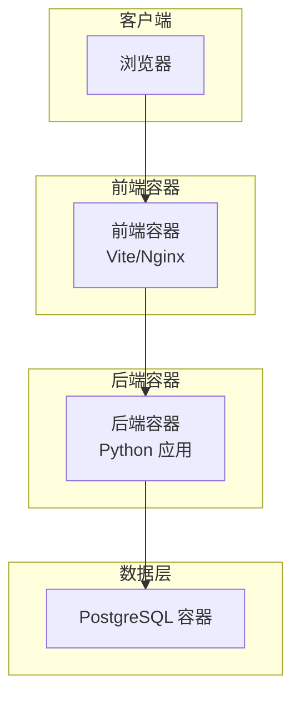
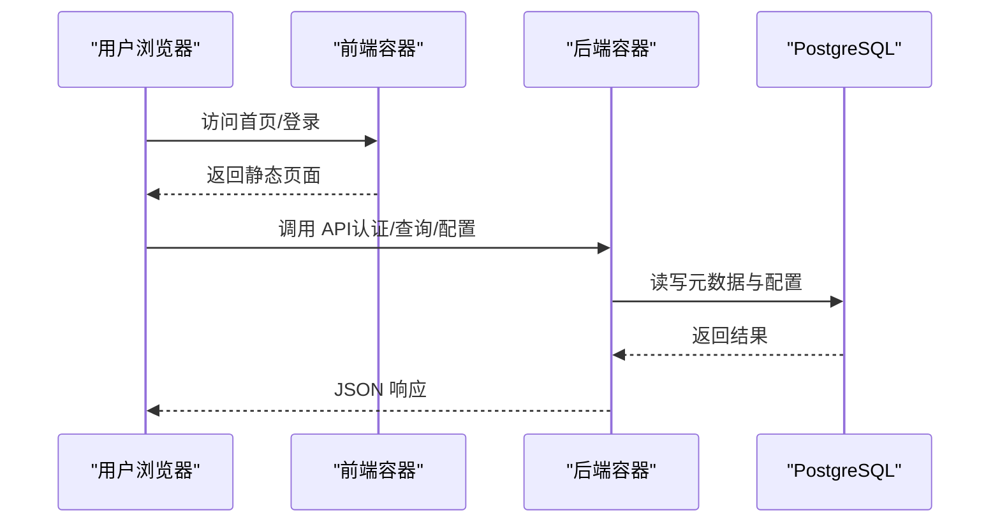
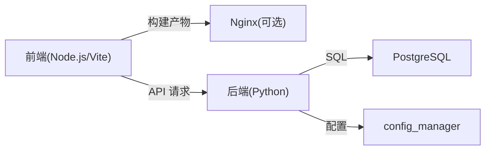

# 环境搭建

<cite>
**本文引用的文件**   
- [README.md](file://README.md)
- [docker-compose.yml](file://docker-compose.yml)
- [backend/requirements.txt](file://backend/requirements.txt)
- [frontend/package.json](file://frontend/package.json)
- [backend/Dockerfile](file://backend/Dockerfile)
- [frontend/Dockerfile](file://frontend/Dockerfile)
- [deploy.sh](file://deploy.sh)
- [start_all.bat](file://start_all.bat)
- [start_backend.bat](file://start_backend.bat)
- [start_frontend.bat](file://start_frontend.bat)
- [doctor.sh](file://doctor.sh)
- [doctor.ps1](file://doctor.ps1)
- [scripts/verify_deployment.py](file://scripts/verify_deployment.py)
- [backend/app.py](file://backend/app.py)
- [backend/config_manager.py](file://backend/config_manager.py)
- [docker/postgres/init/001_bookshelf_schema.sql](file://docker/postgres/init/001_bookshelf_schema.sql)
</cite>

## 目录
1. [简介](#简介)
2. [项目结构](#项目结构)
3. [核心组件](#核心组件)
4. [架构总览](#架构总览)
5. [详细组件分析](#详细组件分析)
6. [依赖分析](#依赖分析)
7. [性能考虑](#性能考虑)
8. [故障排查指南](#故障排查指南)
9. [结论](#结论)
10. [附录](#附录)

## 简介
本环境搭建文档面向 SmartAsk 智能问数平台，覆盖系统要求、安装步骤、环境变量与数据库配置、端口设置、开发与生产差异、跨操作系统安装指引、网络与防火墙/域名解析要求，以及常见问题排查方法。读者可据此在本地或服务器快速完成部署并验证服务可用。

## 项目结构
SmartAsk 采用前后端分离架构：
- 后端：Python Web 应用（FastAPI/Flask 风格），通过 Docker 容器化运行，依赖 PostgreSQL 作为持久化存储。
- 前端：基于 Node.js/Vite 构建的 SPA，提供管理控制台与问答交互界面。
- 编排：使用 docker-compose 统一启动后端、数据库及初始化脚本。
- 脚本：提供一键部署、健康检查、验证脚本等运维工具。

图表来源
- [docker-compose.yml](file://docker-compose.yml)
- [backend/Dockerfile](file://backend/Dockerfile)
- [frontend/Dockerfile](file://frontend/Dockerfile)

章节来源
- [README.md](file://README.md)
- [docker-compose.yml](file://docker-compose.yml)

## 核心组件
- 后端服务：负责业务逻辑、权限控制、数据集与报表配置、飞书同步等能力。
- 前端应用：提供用户交互、可视化与配置管理界面。
- 数据库：PostgreSQL，承载元数据、配置与运行时数据。
- 编排与脚本：docker-compose、部署脚本、健康检查与验证脚本。

章节来源
- [backend/app.py](file://backend/app.py)
- [backend/config_manager.py](file://backend/config_manager.py)
- [docker-compose.yml](file://docker-compose.yml)

## 架构总览
下图展示从浏览器到后端与数据库的请求链路，以及前端静态资源与后端 API 的通信关系。

图表来源
- [docker-compose.yml](file://docker-compose.yml)
- [backend/app.py](file://backend/app.py)

## 详细组件分析

### 系统要求与环境准备
- 操作系统
  - Linux：推荐主流发行版（如 Ubuntu 20.04/22.04、CentOS 7+/Rocky 8+）。
  - Windows：支持 Docker Desktop 的 Windows 10/11 专业版或企业版。
  - macOS：macOS 12+，建议启用 Rosetta 2（如需运行 x86 镜像）。
- 硬件配置（参考）
  - CPU：≥ 2 核（开发），≥ 4 核（生产）。
  - 内存：≥ 4 GB（开发），≥ 8 GB（生产）。
  - 磁盘：≥ 40 GB（含镜像与日志），SSD 更佳。
- 软件依赖
  - Python：3.10+（后端运行与脚本）。
  - Node.js：18+（前端构建与开发）。
  - PostgreSQL：13+（推荐 14/15）。
  - Docker & Docker Compose：最新稳定版。
  - 可选：Git、curl、wget。

章节来源
- [backend/requirements.txt](file://backend/requirements.txt)
- [frontend/package.json](file://frontend/package.json)
- [backend/Dockerfile](file://backend/Dockerfile)
- [frontend/Dockerfile](file://frontend/Dockerfile)

### 依赖包安装
- 后端依赖
  - 使用 requirements.txt 安装 Python 依赖。
  - 若使用虚拟环境，请先创建并激活 venv。
- 前端依赖
  - 使用 package.json 中的依赖管理器（npm/pnpm/yarn）安装依赖。
- 数据库
  - 通过 docker-compose 拉起 PostgreSQL 容器，自动执行初始化 SQL。

章节来源
- [backend/requirements.txt](file://backend/requirements.txt)
- [frontend/package.json](file://frontend/package.json)
- [docker/postgres/init/001_bookshelf_schema.sql](file://docker/postgres/init/001_bookshelf_schema.sql)

### 环境变量与配置
- 通用环境变量
  - 数据库连接：主机、端口、用户名、密码、库名。
  - 后端服务端口、调试开关、日志级别。
  - 前端代理地址（开发时指向后端）。
- 配置文件位置
  - 后端配置由 config_manager 加载，支持环境变量覆盖。
  - 数据库初始化脚本位于 docker/postgres/init。
- 安全建议
  - 敏感信息通过环境变量注入，避免硬编码。
  - 生产环境开启 HTTPS 与强口令策略。

章节来源
- [backend/config_manager.py](file://backend/config_manager.py)
- [docker-compose.yml](file://docker-compose.yml)

### 数据库连接配置
- 连接参数
  - 主机：容器名或宿主机 IP。
  - 端口：默认 5432。
  - 用户名/密码：由 compose 或环境变量设定。
  - 库名：bookshelf（示例）。
- 初始化
  - 首次启动会自动执行 init SQL，创建必要表结构与基础数据。
- 迁移
  - 后续变更通过 migrations 目录下的 SQL 脚本进行。

章节来源
- [docker-compose.yml](file://docker-compose.yml)
- [docker/postgres/init/001_bookshelf_schema.sql](file://docker/postgres/init/001_bookshelf_schema.sql)

### 端口设置与服务暴露
- 前端端口：默认 80/443（Nginx），开发模式可使用 Vite 端口。
- 后端端口：默认 8000（可通过环境变量覆盖）。
- 数据库端口：5432（仅容器内或受信任网络访问）。
- 反向代理
  - 生产建议使用 Nginx/Traefik 统一入口，配置 SSL 终止与路径转发。

章节来源
- [docker-compose.yml](file://docker-compose.yml)
- [frontend/Dockerfile](file://frontend/Dockerfile)
- [backend/Dockerfile](file://backend/Dockerfile)

### 开发与生产环境差异
- 开发环境
  - 前端热重载，后端调试模式，日志更详细。
  - 可直接访问后端端口进行接口调试。
- 生产环境
  - 关闭调试，限制日志级别，启用 HTTPS。
  - 使用反向代理与负载均衡，集中化管理证书。
  - 数据库连接池与超时参数调优。

章节来源
- [backend/config_manager.py](file://backend/config_manager.py)
- [docker-compose.yml](file://docker-compose.yml)

### 跨操作系统安装指南
- Linux
  - 安装 Docker 与 Docker Compose。
  - 克隆仓库后执行部署脚本。
  - 使用 systemctl 管理服务进程。
- Windows
  - 安装 Docker Desktop，确保 WSL2 已启用。
  - 使用 .bat/.ps1 脚本启动前后端。
  - 注意路径与换行符问题。
- macOS
  - 安装 Docker Desktop，允许网络与文件系统共享。
  - 使用终端命令启动服务。
  - 如遇 Rosetta 警告，按提示安装。

章节来源
- [deploy.sh](file://deploy.sh)
- [start_all.bat](file://start_all.bat)
- [start_backend.bat](file://start_backend.bat)
- [start_frontend.bat](file://start_frontend.bat)
- [doctor.sh](file://doctor.sh)
- [doctor.ps1](file://doctor.ps1)

### 网络配置要求
- 防火墙
  - 开放前端端口（80/443）、后端端口（8000，仅内部或代理访问）。
  - 数据库端口不对外暴露。
- 域名解析
  - 将域名 A/CNAME 记录指向服务器公网 IP。
  - 配置反向代理将域名请求转发至前端容器。
- 代理与跨域
  - 开发模式下前端代理后端 API 以避免跨域。
  - 生产模式通过反向代理统一处理跨域与鉴权。

章节来源
- [docker-compose.yml](file://docker-compose.yml)

## 依赖分析
SmartAsk 的关键依赖关系如下：
- 前端依赖 Node.js 生态（Vite、Vue 等）。
- 后端依赖 Python 生态（Web 框架、ORM、异步库等）。
- 数据库依赖 PostgreSQL 及其扩展。
- 容器编排依赖 Docker 与 Compose。

图表来源
- [frontend/package.json](file://frontend/package.json)
- [backend/requirements.txt](file://backend/requirements.txt)
- [backend/config_manager.py](file://backend/config_manager.py)
- [docker-compose.yml](file://docker-compose.yml)

章节来源
- [frontend/package.json](file://frontend/package.json)
- [backend/requirements.txt](file://backend/requirements.txt)
- [backend/config_manager.py](file://backend/config_manager.py)
- [docker-compose.yml](file://docker-compose.yml)

## 性能考虑
- 数据库
  - 合理设置连接池大小与超时；为常用查询建立索引。
  - 定期清理日志与历史数据。
- 后端
  - 启用异步 I/O，减少阻塞操作。
  - 缓存热点数据（如字典、权限、模型配置）。
- 前端
  - 静态资源压缩与 CDN 加速。
  - 按需加载路由与组件。
- 容器
  - 限制 CPU/内存配额，避免资源争用。
  - 使用多阶段构建减小镜像体积。

[本节为通用指导，无需特定文件引用]

## 故障排查指南
- 常见症状
  - 无法访问前端页面：检查 Nginx/端口映射、域名解析、防火墙。
  - 后端 502/504：确认后端容器健康、依赖服务可达、日志报错。
  - 数据库连接失败：核对主机、端口、用户名、密码、库名。
  - 权限错误：检查 RBAC 配置与用户角色。
- 诊断工具
  - 使用 doctor 脚本检测环境与依赖。
  - 使用 verify_deployment 脚本验证部署状态。
  - 查看容器日志与后端日志定位问题。
- 恢复步骤
  - 重启相关容器或服务。
  - 重新执行初始化脚本（谨慎操作）。
  - 回滚配置与代码版本。

章节来源
- [doctor.sh](file://doctor.sh)
- [doctor.ps1](file://doctor.ps1)
- [scripts/verify_deployment.py](file://scripts/verify_deployment.py)
- [backend/app.py](file://backend/app.py)

## 结论
通过遵循本环境搭建文档，您可以在不同操作系统上快速完成 SmartAsk 的安装与配置。建议在生产环境严格遵循安全与性能最佳实践，并结合监控与告警保障稳定性。

[本节为总结性内容，无需特定文件引用]

## 附录
- 快速启动命令（Linux/macOS）
  - 拉取镜像、启动服务、查看日志。
- 快速启动命令（Windows）
  - 使用 .bat/.ps1 脚本一键启动。
- 常用维护命令
  - 备份/恢复数据库、导出/导入配置。

章节来源
- [deploy.sh](file://deploy.sh)
- [start_all.bat](file://start_all.bat)
- [backup.sh](file://backup.sh)
- [restore.sh](file://restore.sh)