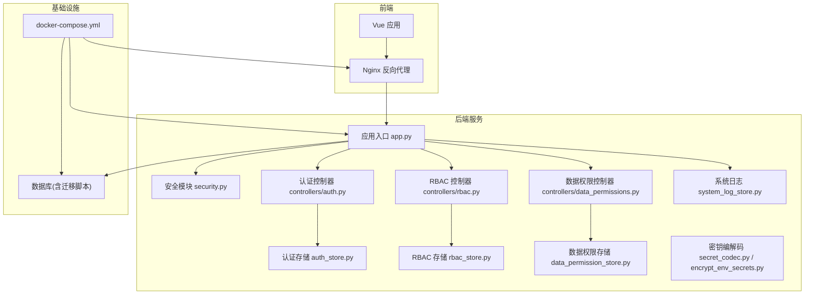
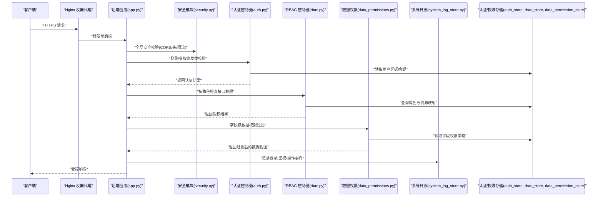
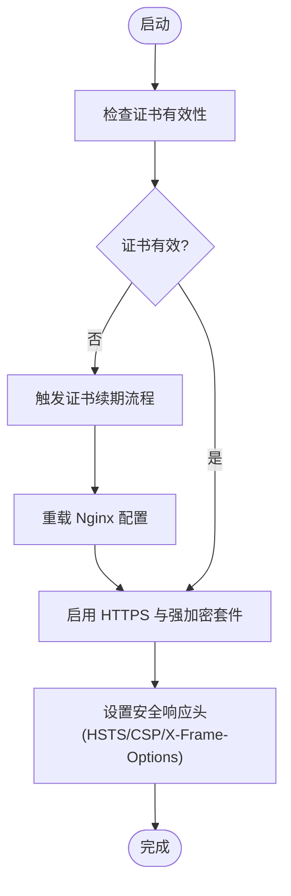
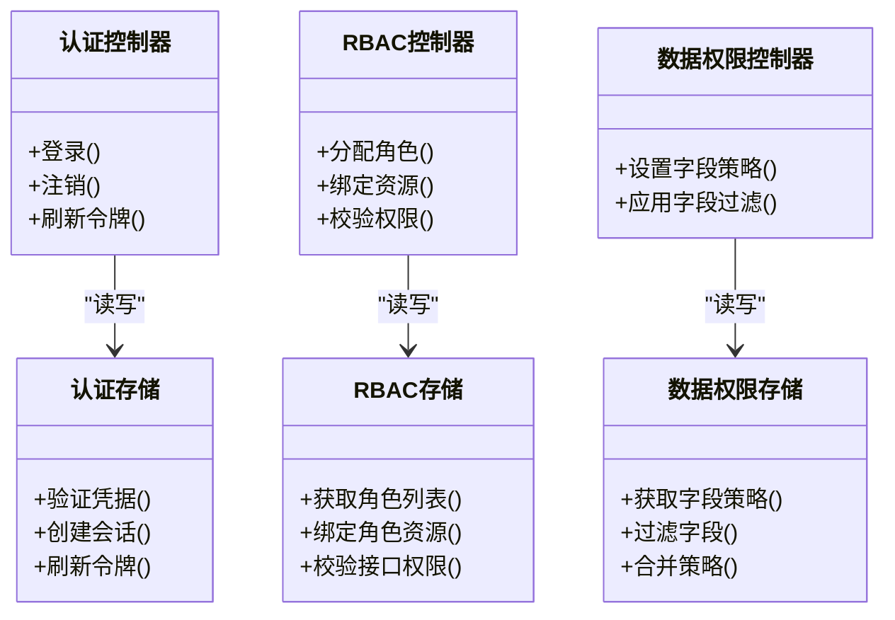
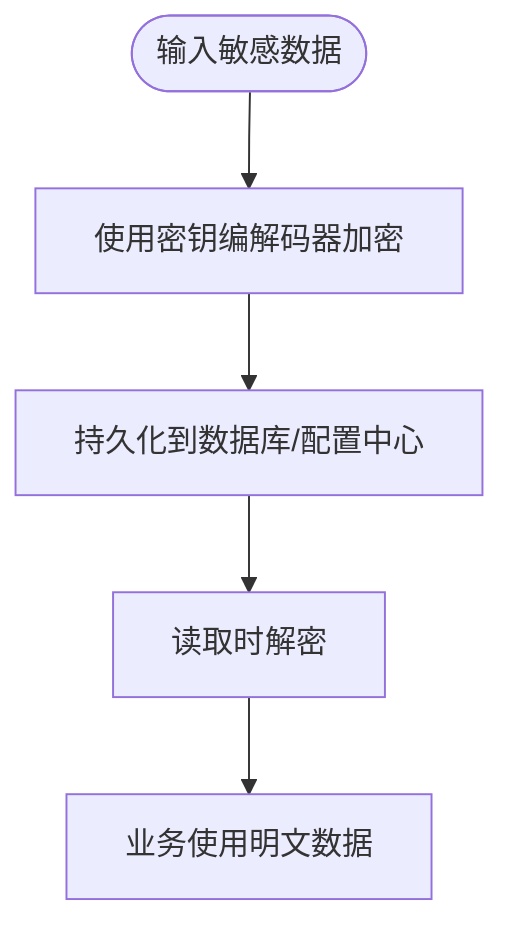
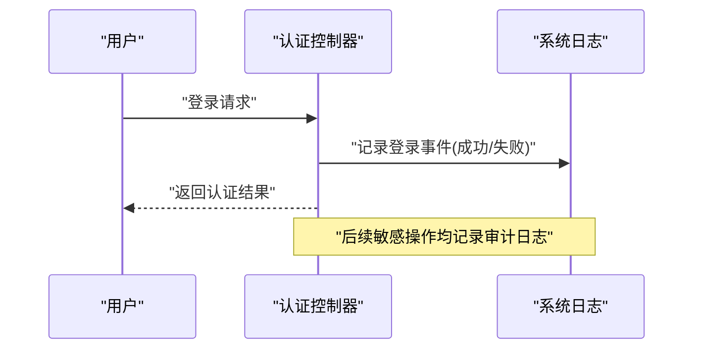
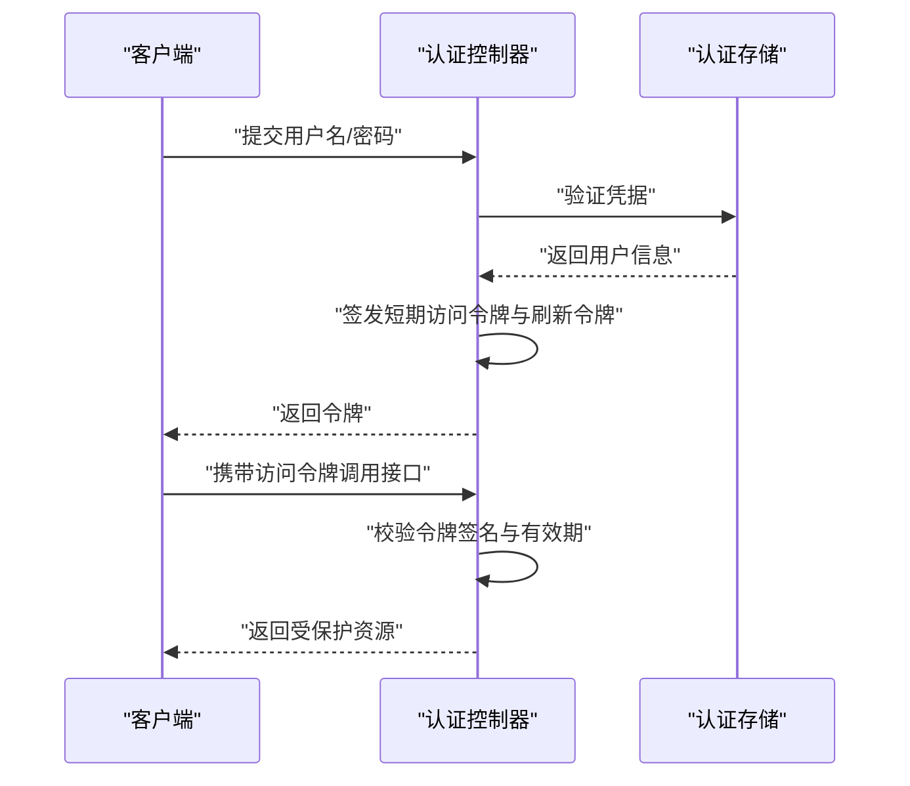
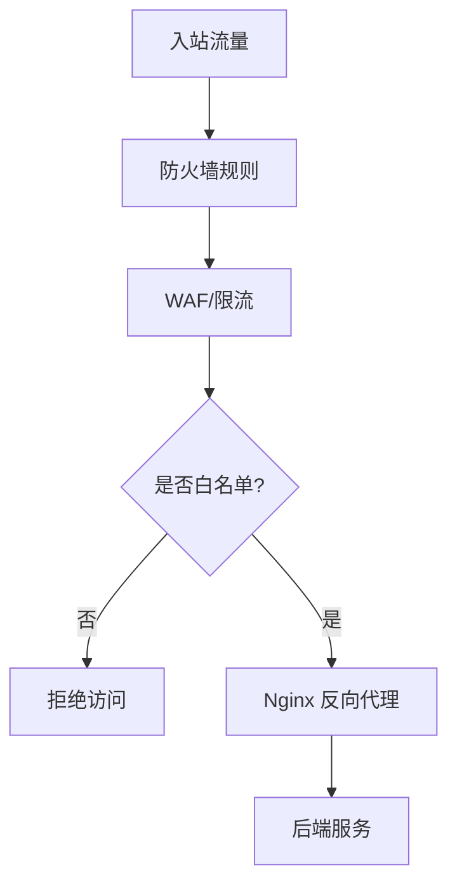
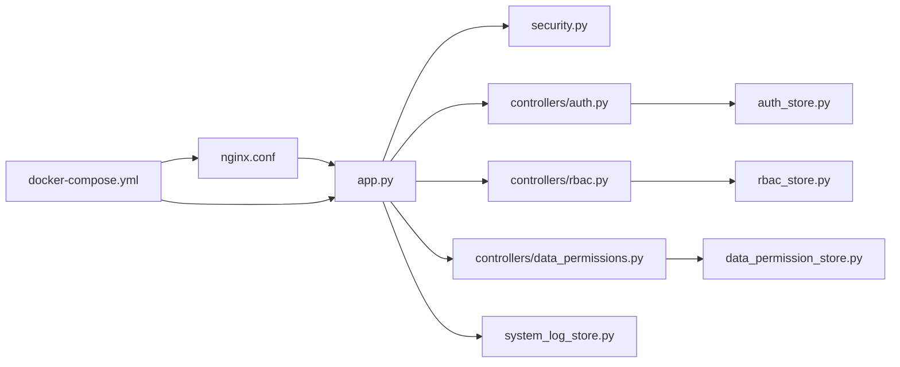

# 安全加固配置

<cite>
**本文引用的文件**   
- [backend/app.py](file://backend/app.py)
- [backend/security.py](file://backend/security.py)
- [backend/auth_store.py](file://backend/auth_store.py)
- [backend/rbac_store.py](file://backend/rbac_store.py)
- [backend/data_permission_store.py](file://backend/data_permission_store.py)
- [backend/controllers/auth.py](file://backend/controllers/auth.py)
- [backend/controllers/rbac.py](file://backend/controllers/rbac.py)
- [backend/controllers/data_permissions.py](file://backend/controllers/data_permissions.py)
- [backend/system_log_store.py](file://backend/system_log_store.py)
- [backend/encrypt_env_secrets.py](file://backend/encrypt_env_secrets.py)
- [backend/secret_codec.py](file://backend/secret_codec.py)
- [frontend/nginx.conf](file://frontend/nginx.conf)
- [docker-compose.yml](file://docker-compose.yml)
</cite>

## 目录
1. [简介](#简介)
2. [项目结构](#项目结构)
3. [核心组件](#核心组件)
4. [架构总览](#架构总览)
5. [详细组件分析](#详细组件分析)
6. [依赖关系分析](#依赖关系分析)
7. [性能考虑](#性能考虑)
8. [故障排查指南](#故障排查指南)
9. [结论](#结论)
10. [附录](#附录)

## 简介
本文件为 SmartAsk 智能问数平台的安全加固配置指南，覆盖以下关键领域：
- SSL/TLS 证书与 HTTPS 启用、证书更新流程与加密套件选择
- 访问控制：RBAC 权限模型、字段级权限控制、API 访问限制
- 数据加密：敏感数据加密存储、传输加密、密钥管理策略
- 安全审计：登录日志记录、操作审计追踪与安全事件监控
- 身份认证：JWT Token 管理、会话安全、多因素认证支持
- 网络安全：防火墙规则、IP 白名单、请求频率限制
- 漏洞扫描与定期安全评估流程

本指南面向运维、安全工程师与后端开发者，提供可操作的配置建议与落地路径。

## 项目结构
SmartAsk 采用前后端分离架构，后端基于 Python（Flask/FastAPI 风格），前端使用 Vue + Vite，并通过 Nginx 反向代理对外暴露 HTTPS。安全相关能力主要分布在后端模块与容器编排文件中。

**图表来源**
- [backend/app.py](file://backend/app.py)
- [backend/security.py](file://backend/security.py)
- [backend/controllers/auth.py](file://backend/controllers/auth.py)
- [backend/controllers/rbac.py](file://backend/controllers/rbac.py)
- [backend/controllers/data_permissions.py](file://backend/controllers/data_permissions.py)
- [backend/auth_store.py](file://backend/auth_store.py)
- [backend/rbac_store.py](file://backend/rbac_store.py)
- [backend/data_permission_store.py](file://backend/data_permission_store.py)
- [backend/system_log_store.py](file://backend/system_log_store.py)
- [backend/secret_codec.py](file://backend/secret_codec.py)
- [backend/encrypt_env_secrets.py](file://backend/encrypt_env_secrets.py)
- [frontend/nginx.conf](file://frontend/nginx.conf)
- [docker-compose.yml](file://docker-compose.yml)

**章节来源**
- [backend/app.py](file://backend/app.py)
- [frontend/nginx.conf](file://frontend/nginx.conf)
- [docker-compose.yml](file://docker-compose.yml)

## 核心组件
- 应用入口与安全中间件：负责全局安全策略、HTTPS 重定向、请求头校验、CORS、速率限制等。
- 认证与授权：JWT 签发与校验、会话管理、RBAC 角色权限、字段级数据权限。
- 数据存储与加密：敏感信息加密存储、密钥管理、环境变量加密。
- 审计与日志：登录、鉴权失败、关键操作审计、安全事件上报。
- 网络与安全网关：Nginx 反向代理、TLS 终止、IP 白名单、限流。

**章节来源**
- [backend/app.py](file://backend/app.py)
- [backend/security.py](file://backend/security.py)
- [backend/controllers/auth.py](file://backend/controllers/auth.py)
- [backend/controllers/rbac.py](file://backend/controllers/rbac.py)
- [backend/controllers/data_permissions.py](file://backend/controllers/data_permissions.py)
- [backend/auth_store.py](file://backend/auth_store.py)
- [backend/rbac_store.py](file://backend/rbac_store.py)
- [backend/data_permission_store.py](file://backend/data_permission_store.py)
- [backend/system_log_store.py](file://backend/system_log_store.py)
- [backend/secret_codec.py](file://backend/secret_codec.py)
- [backend/encrypt_env_secrets.py](file://backend/encrypt_env_secrets.py)
- [frontend/nginx.conf](file://frontend/nginx.conf)

## 架构总览
下图展示从客户端到后端的完整安全链路，包括 TLS 终止、认证授权、数据权限、审计与日志。

**图表来源**
- [backend/app.py](file://backend/app.py)
- [backend/security.py](file://backend/security.py)
- [backend/controllers/auth.py](file://backend/controllers/auth.py)
- [backend/controllers/rbac.py](file://backend/controllers/rbac.py)
- [backend/controllers/data_permissions.py](file://backend/controllers/data_permissions.py)
- [backend/auth_store.py](file://backend/auth_store.py)
- [backend/rbac_store.py](file://backend/rbac_store.py)
- [backend/data_permission_store.py](file://backend/data_permission_store.py)
- [backend/system_log_store.py](file://backend/system_log_store.py)

## 详细组件分析

### SSL/TLS 与 HTTPS 配置
- 目标
  - 强制 HTTPS，禁用弱协议与不安全加密套件
  - 自动化证书续期与热重载
  - 统一安全响应头（HSTS、CSP、X-Frame-Options 等）
- 实施要点
  - 在 Nginx 中配置 TLS 终止、HTTP 自动跳转 HTTPS、启用现代加密套件与 HSTS
  - 在应用层开启 HTTPS 重定向与严格安全头
  - 通过容器编排注入证书与私钥，避免硬编码
- 证书更新流程
  - 使用自动化证书管理工具（如 Let’s Encrypt/Certbot）生成并续期证书
  - 将新证书写入挂载卷，触发 Nginx 平滑重载
  - 应用侧无需重启，仅依赖 Nginx 的 TLS 终止
- 加密套件选择
  - 优先 TLSv1.3，禁用 SSLv3/TLS1.0/1.1
  - 选择 AEAD 套件（如 ECDHE-ECDSA/AES-GCM）
  - 关闭不安全的压缩与重协商

**图表来源**
- [frontend/nginx.conf](file://frontend/nginx.conf)
- [docker-compose.yml](file://docker-compose.yml)

**章节来源**
- [frontend/nginx.conf](file://frontend/nginx.conf)
- [docker-compose.yml](file://docker-compose.yml)

### 访问控制：RBAC、字段级权限与 API 限制
- RBAC 权限模型
  - 角色-资源-动作三元组，支持组织/数据集维度隔离
  - 接口级权限注解或装饰器，结合路由注册进行静态校验
- 字段级权限控制
  - 针对查询结果字段进行动态过滤，依据用户角色与数据策略决定可见性
  - 对导出/报表场景同样生效，防止越权数据泄露
- API 访问限制
  - 基于 IP、用户、租户维度的速率限制
  - 对敏感接口（登录、密码重置、批量导出）加强限制

**图表来源**
- [backend/controllers/auth.py](file://backend/controllers/auth.py)
- [backend/controllers/rbac.py](file://backend/controllers/rbac.py)
- [backend/controllers/data_permissions.py](file://backend/controllers/data_permissions.py)
- [backend/auth_store.py](file://backend/auth_store.py)
- [backend/rbac_store.py](file://backend/rbac_store.py)
- [backend/data_permission_store.py](file://backend/data_permission_store.py)

**章节来源**
- [backend/controllers/auth.py](file://backend/controllers/auth.py)
- [backend/controllers/rbac.py](file://backend/controllers/rbac.py)
- [backend/controllers/data_permissions.py](file://backend/controllers/data_permissions.py)
- [backend/auth_store.py](file://backend/auth_store.py)
- [backend/rbac_store.py](file://backend/rbac_store.py)
- [backend/data_permission_store.py](file://backend/data_permission_store.py)

### 数据加密与密钥管理
- 敏感数据加密存储
  - 对密码、密钥、连接串等敏感字段进行加密存储
  - 使用强算法（如 AES-GCM）与随机 IV
- 传输加密
  - 全链路 TLS，禁止明文 HTTP
  - 内部服务间通信建议使用 mTLS 或签名校验
- 密钥管理策略
  - 密钥与代码分离，通过环境变量或密钥管理服务注入
  - 支持环境变量加密（如预加密值）与运行时解密
  - 定期轮换密钥，支持双密钥过渡期

**图表来源**
- [backend/secret_codec.py](file://backend/secret_codec.py)
- [backend/encrypt_env_secrets.py](file://backend/encrypt_env_secrets.py)

**章节来源**
- [backend/secret_codec.py](file://backend/secret_codec.py)
- [backend/encrypt_env_secrets.py](file://backend/encrypt_env_secrets.py)

### 安全审计与事件监控
- 登录日志记录
  - 记录登录成功/失败、来源 IP、设备指纹、时间戳
- 操作审计追踪
  - 对敏感操作（权限变更、数据导出、配置修改）进行审计
- 安全事件监控
  - 异常登录、暴力破解、越权访问尝试告警
  - 集中日志收集与可视化（对接 SIEM/ELK）

**图表来源**
- [backend/controllers/auth.py](file://backend/controllers/auth.py)
- [backend/system_log_store.py](file://backend/system_log_store.py)

**章节来源**
- [backend/system_log_store.py](file://backend/system_log_store.py)
- [backend/controllers/auth.py](file://backend/controllers/auth.py)

### 身份认证与会话安全
- JWT Token 管理
  - 短生命周期访问令牌 + 刷新令牌机制
  - 签名算法选择强哈希（如 RS256/ES256）
  - 服务端黑名单/撤销机制支持
- 会话安全
  - 会话绑定设备/IP 指纹，防劫持
  - 空闲超时与绝对过期策略
- 多因素认证（MFA）
  - 可选 TOTP 或短信验证码二次校验
  - 对高危操作强制 MFA

**图表来源**
- [backend/controllers/auth.py](file://backend/controllers/auth.py)
- [backend/auth_store.py](file://backend/auth_store.py)

**章节来源**
- [backend/controllers/auth.py](file://backend/controllers/auth.py)
- [backend/auth_store.py](file://backend/auth_store.py)

### 网络安全与边界防护
- 防火墙规则
  - 仅开放必要端口（如 443），内网服务间走私有网络
- IP 白名单
  - 对管理接口与敏感操作启用 IP 白名单
- 请求频率限制
  - 基于 IP/用户/租户的速率限制，防止滥用与暴力破解
- 安全响应头
  - HSTS、CSP、X-Content-Type-Options、Referrer-Policy 等

**图表来源**
- [frontend/nginx.conf](file://frontend/nginx.conf)
- [docker-compose.yml](file://docker-compose.yml)

**章节来源**
- [frontend/nginx.conf](file://frontend/nginx.conf)
- [docker-compose.yml](file://docker-compose.yml)

### 安全漏洞扫描与定期评估
- 自动化扫描
  - 镜像漏洞扫描（Trivy/Syft）、依赖库漏洞（Dependabot/Safety）
  - 代码安全扫描（SAST/DAST）
- 定期评估
  - 季度渗透测试与红蓝对抗演练
  - 安全基线核查与合规审计
- 修复闭环
  - 严重漏洞 SLA 与升级流程
  - 修复验证与回归测试

[本节为通用流程说明，不直接分析具体文件]

## 依赖关系分析
- 组件耦合
  - 认证控制器依赖认证存储；RBAC 控制器依赖 RBAC 存储；数据权限控制器依赖数据权限存储
  - 应用入口依赖安全模块进行全局校验
  - 所有控制器与存储通过统一的日志模块记录审计事件
- 外部依赖
  - Nginx 作为反向代理与 TLS 终止点
  - 数据库承载认证、权限、审计与敏感数据
  - 容器编排统一管理证书、环境变量与服务发现

**图表来源**
- [backend/app.py](file://backend/app.py)
- [backend/security.py](file://backend/security.py)
- [backend/controllers/auth.py](file://backend/controllers/auth.py)
- [backend/controllers/rbac.py](file://backend/controllers/rbac.py)
- [backend/controllers/data_permissions.py](file://backend/controllers/data_permissions.py)
- [backend/auth_store.py](file://backend/auth_store.py)
- [backend/rbac_store.py](file://backend/rbac_store.py)
- [backend/data_permission_store.py](file://backend/data_permission_store.py)
- [backend/system_log_store.py](file://backend/system_log_store.py)
- [frontend/nginx.conf](file://frontend/nginx.conf)
- [docker-compose.yml](file://docker-compose.yml)

**章节来源**
- [backend/app.py](file://backend/app.py)
- [backend/security.py](file://backend/security.py)
- [backend/controllers/auth.py](file://backend/controllers/auth.py)
- [backend/controllers/rbac.py](file://backend/controllers/rbac.py)
- [backend/controllers/data_permissions.py](file://backend/controllers/data_permissions.py)
- [backend/auth_store.py](file://backend/auth_store.py)
- [backend/rbac_store.py](file://backend/rbac_store.py)
- [backend/data_permission_store.py](file://backend/data_permission_store.py)
- [backend/system_log_store.py](file://backend/system_log_store.py)
- [frontend/nginx.conf](file://frontend/nginx.conf)
- [docker-compose.yml](file://docker-compose.yml)

## 性能考虑
- 认证与授权缓存
  - 对角色与字段权限进行短时缓存，降低存储压力
- 令牌校验优化
  - 使用本地公钥校验减少远程验证开销
- 日志异步写入
  - 审计日志采用异步队列，避免阻塞主流程
- 限流与熔断
  - 合理设置阈值，避免误伤正常流量
- 证书与 TLS
  - 启用会话复用与 OCSP Stapling，提升握手性能

[本节为通用性能建议，不直接分析具体文件]

## 故障排查指南
- 常见问题
  - HTTPS 无法访问：检查 Nginx 证书路径与权限、端口占用、防火墙规则
  - 认证失败：确认 JWT 签名算法、密钥一致性、时钟同步
  - 权限不足：核对角色-资源映射、字段级策略是否正确加载
  - 审计缺失：检查日志模块初始化与写入权限
- 诊断步骤
  - 查看应用日志与系统日志，定位错误堆栈
  - 使用抓包工具验证 TLS 握手与请求头
  - 逐步关闭安全策略以复现问题，再逐项恢复

**章节来源**
- [backend/system_log_store.py](file://backend/system_log_store.py)
- [backend/controllers/auth.py](file://backend/controllers/auth.py)
- [frontend/nginx.conf](file://frontend/nginx.conf)

## 结论
通过对 SSL/TLS、访问控制、数据加密、审计、认证与会话、网络安全以及漏洞扫描的系统化加固，SmartAsk 可在生产环境中实现高安全基线。建议持续集成安全扫描与自动化部署，确保策略一致性与可追溯性。

[本节为总结性内容，不直接分析具体文件]

## 附录
- 配置清单
  - Nginx：TLS 版本、加密套件、HSTS、CSP、IP 白名单、限流
  - 应用：安全头、CORS、速率限制、JWT 算法、会话策略
  - 存储：敏感字段加密、密钥轮换、备份与恢复
  - 审计：日志级别、保留周期、告警规则
- 最佳实践
  - 最小权限原则与职责分离
  - 密钥与配置外置，禁止硬编码
  - 定期演练与复盘，完善应急响应预案

[本节为补充信息，不直接分析具体文件]