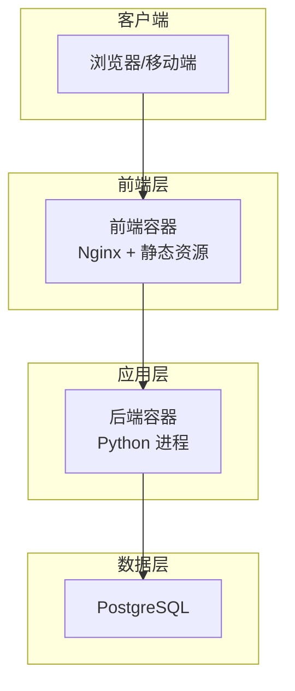
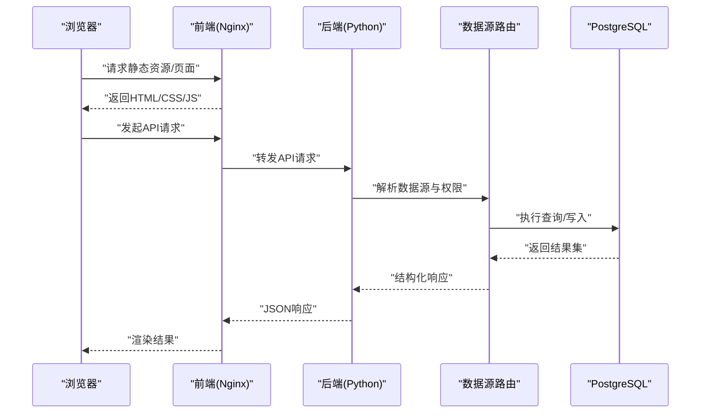
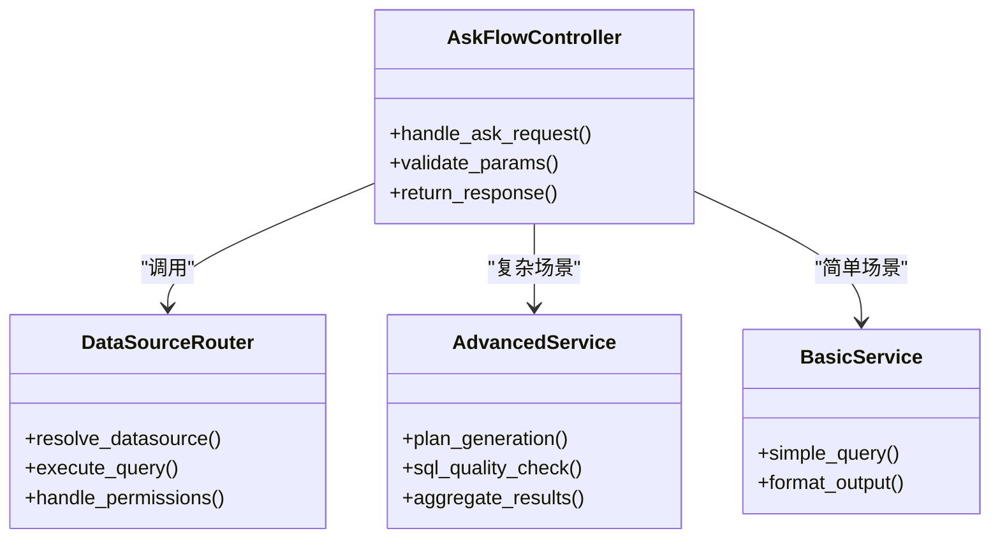

# 性能调优指南

<cite>
**本文引用的文件**   
- [docker-compose.yml](file://docker-compose.yml)
- [backend/Dockerfile](file://backend/Dockerfile)
- [backend/app.py](file://backend/app.py)
- [backend/requirements.txt](file://backend/requirements.txt)
- [frontend/Dockerfile](file://frontend/Dockerfile)
- [frontend/nginx.conf](file://frontend/nginx.conf)
- [frontend/vite.config.js](file://frontend/vite.config.js)
- [frontend/package.json](file://frontend/package.json)
- [backend/bootstrap.py](file://backend/bootstrap.py)
- [backend/config_manager.py](file://backend/config_manager.py)
- [backend/datasource_router.py](file://backend/datasource_router.py)
- [backend/smartask_advanced/service.py](file://backend/smartask_advanced/service.py)
- [backend/smartask_basic/service.py](file://backend/smartask_basic/service.py)
- [backend/controllers/ask_flow.py](file://backend/controllers/ask_flow.py)
- [backend/controllers/datasources.py](file://backend/controllers/datasources.py)
- [backend/migrations/20260330_bookshelf_schema.sql](file://backend/migrations/20260330_bookshelf_schema.sql)
- [backend/migrations/20260512_system_event_logs.sql](file://backend/migrations/20260512_system_event_logs.sql)
- [docker/postgres/init/001_bookshelf_schema.sql](file://docker/postgres/init/001_bookshelf_schema.sql)
- [scripts/integration_test.py](file://scripts/integration_test.py)
</cite>

## 目录
1. [简介](#简介)
2. [项目结构](#项目结构)
3. [核心组件](#核心组件)
4. [架构总览](#架构总览)
5. [详细组件分析](#详细组件分析)
6. [依赖关系分析](#依赖关系分析)
7. [性能考虑](#性能考虑)
8. [故障排查指南](#故障排查指南)
9. [结论](#结论)
10. [附录](#附录)

## 简介
本指南面向 SmartAsk 智能问数平台的运维与研发人员，聚焦生产环境的性能调优。内容覆盖数据库、应用服务器、前端、缓存、系统资源、监控与基准测试、容量规划与扩容策略等关键维度，帮助团队在保障稳定性的前提下提升吞吐、降低延迟并优化资源利用率。

## 项目结构
SmartAsk 采用前后端分离架构：
- 后端：Python 服务（FastAPI/Flask 风格），通过 Docker 容器化部署，使用 PostgreSQL 作为主存储，提供数据源路由、权限控制、报告配置、飞书同步等能力。
- 前端：基于 Vite + Vue 的 SPA，Nginx 反向代理静态资源，支持构建优化与 CDN 加速。
- 编排：docker-compose 统一编排后端、数据库与前端 Nginx。

图表来源
- [docker-compose.yml](file://docker-compose.yml)
- [frontend/nginx.conf](file://frontend/nginx.conf)
- [backend/Dockerfile](file://backend/Dockerfile)
- [frontend/Dockerfile](file://frontend/Dockerfile)

章节来源
- [docker-compose.yml](file://docker-compose.yml)
- [backend/Dockerfile](file://backend/Dockerfile)
- [frontend/Dockerfile](file://frontend/Dockerfile)
- [frontend/nginx.conf](file://frontend/nginx.conf)

## 核心组件
- 后端入口与启动：应用初始化、配置加载、中间件注册、数据库连接池与外部服务集成。
- 数据源路由：根据请求上下文选择合适的数据源，执行查询或调用下游服务。
- 高级/基础问数服务：封装不同复杂度的问数流程，包含计划生成、SQL 质量检查、结果聚合等。
- 控制器层：对外暴露 API，处理鉴权、参数校验、业务编排与响应返回。
- 数据库迁移与初始化：Schema 定义、索引与视图创建、系统事件日志表。

章节来源
- [backend/app.py](file://backend/app.py)
- [backend/bootstrap.py](file://backend/bootstrap.py)
- [backend/config_manager.py](file://backend/config_manager.py)
- [backend/datasource_router.py](file://backend/datasource_router.py)
- [backend/smartask_advanced/service.py](file://backend/smartask_advanced/service.py)
- [backend/smartask_basic/service.py](file://backend/smartask_basic/service.py)
- [backend/controllers/ask_flow.py](file://backend/controllers/ask_flow.py)
- [backend/controllers/datasources.py](file://backend/controllers/datasources.py)
- [backend/migrations/20260330_bookshelf_schema.sql](file://backend/migrations/20260330_bookshelf_schema.sql)
- [backend/migrations/20260512_system_event_logs.sql](file://backend/migrations/20260512_system_event_logs.sql)

## 架构总览
下图展示从用户请求到数据落库的关键路径，包括前端静态资源、后端 API、数据源路由与数据库交互。

图表来源
- [frontend/nginx.conf](file://frontend/nginx.conf)
- [backend/app.py](file://backend/app.py)
- [backend/datasource_router.py](file://backend/datasource_router.py)
- [backend/controllers/ask_flow.py](file://backend/controllers/ask_flow.py)

## 详细组件分析

### 数据库性能优化
- 索引优化
  - 针对高频查询条件列建立 B-Tree 索引；对复合查询使用联合索引，注意列顺序与选择性。
  - 对大文本字段避免全表扫描，必要时使用全文检索或物化视图。
  - 定期分析统计信息，确保查询计划最优。
- 查询优化
  - 避免 SELECT *，仅选取必要字段；减少子查询，改用 JOIN 或 CTE。
  - 分页查询使用游标或基于主键的范围过滤，避免深分页。
  - 合理使用 EXPLAIN/EXPLAIN ANALYZE 定位慢查询与全表扫描。
- 连接池配置
  - 合理设置最大连接数与空闲超时，避免连接泄漏与耗尽。
  - 按业务模块划分连接池，隔离热点与长事务。
- 慢查询分析
  - 开启慢查询日志，设定阈值，结合 pg_stat_statements 进行热点 SQL 分析。
  - 对慢查询进行改写、加索引或引入缓存。

章节来源
- [backend/migrations/20260330_bookshelf_schema.sql](file://backend/migrations/20260330_bookshelf_schema.sql)
- [backend/migrations/20260512_system_event_logs.sql](file://backend/migrations/20260512_system_event_logs.sql)
- [docker/postgres/init/001_bookshelf_schema.sql](file://docker/postgres/init/001_bookshelf_schema.sql)

### 应用服务器调优（Python）
- 进程与线程模型
  - 使用多进程（如 Gunicorn/Uvicorn workers）提升并发处理能力；根据 CPU 核数与 I/O 特性调整 worker 数量。
  - 对于阻塞型任务（I/O 密集）可配合异步框架或任务队列。
- 内存管理
  - 监控 Python 进程内存增长，识别内存泄漏；限制单进程内存上限。
  - 合理设置 GC 参数，避免频繁回收导致抖动。
- CPU 资源分配
  - 为容器设置 CPU 配额与限制，防止争抢；对计算密集型任务进行限流与降级。
- 启动与配置
  - 通过环境变量或配置文件集中管理数据库连接池、超时、重试等参数。

章节来源
- [backend/Dockerfile](file://backend/Dockerfile)
- [backend/app.py](file://backend/app.py)
- [backend/bootstrap.py](file://backend/bootstrap.py)
- [backend/config_manager.py](file://backend/config_manager.py)
- [backend/requirements.txt](file://backend/requirements.txt)

### 前端性能优化
- 代码分割与懒加载
  - 按路由或功能模块拆分 JS/CSS，按需加载，减少首屏体积。
  - 使用动态 import 与 Suspense 实现组件级懒加载。
- 静态资源压缩与缓存
  - 启用 gzip/brotli 压缩，图片使用 WebP/AVIF，字体子集化。
  - 利用浏览器缓存与 CDN 缓存策略，设置合适的 Cache-Control。
- CDN 加速配置
  - 将静态资源托管至 CDN，配置回源策略与缓存失效规则。
  - 对 API 请求启用 HTTP/2 与 Keep-Alive。
- 构建优化
  - 使用 Vite 插件进行 Tree-shaking、预加载与资源哈希。
  - 生产环境关闭调试输出，启用 SourceMap 仅在需要时生成。

章节来源
- [frontend/vite.config.js](file://frontend/vite.config.js)
- [frontend/package.json](file://frontend/package.json)
- [frontend/nginx.conf](file://frontend/nginx.conf)
- [frontend/Dockerfile](file://frontend/Dockerfile)

### 缓存策略优化
- 多级缓存设计
  - 客户端缓存（HTTP 缓存、Service Worker）、CDN 缓存、应用层缓存（Redis/Memcached）、数据库查询缓存。
  - 分层命中策略：先查本地缓存，再查分布式缓存，最后回源数据库。
- 缓存命中率监控
  - 记录各层缓存命中率、过期率与回源比例，设置告警阈值。
  - 使用 APM 工具追踪热点 Key 与冷热点分布。
- 缓存失效策略
  - 采用 TTL + 主动失效（版本号/时间戳）双保险；对写多读少场景使用延迟双删或订阅变更。
  - 热点 Key 防穿透与雪崩：布隆过滤器、随机过期、限流降级。

章节来源
- [backend/config_manager.py](file://backend/config_manager.py)
- [backend/datasource_router.py](file://backend/datasource_router.py)
- [backend/smartask_advanced/service.py](file://backend/smartask_advanced/service.py)
- [backend/smartask_basic/service.py](file://backend/smartask_basic/service.py)

### 系统资源优化
- Docker 容器资源限制
  - 为每个服务设置 CPU 与内存限制，避免资源争用；合理划分副本数。
  - 使用健康检查与自动重启策略，提高可用性。
- 操作系统参数调优
  - 调整内核参数（如 net.core.somaxconn、fs.file-max、vm.swappiness）以优化网络与文件句柄。
  - 禁用不必要的服务，释放资源给应用。
- 磁盘 I/O 优化
  - 使用 SSD 与 RAID 提升 IOPS；对日志与临时文件分盘存放。
  - 调整文件系统挂载选项（如 noatime），减少元数据开销。

章节来源
- [docker-compose.yml](file://docker-compose.yml)
- [backend/Dockerfile](file://backend/Dockerfile)
- [frontend/Dockerfile](file://frontend/Dockerfile)

### 性能监控指标定义
- 应用层指标
  - QPS、TP99/TP95、错误率、CPU/内存使用率、GC 停顿时间、线程池占用。
- 数据库指标
  - 连接数、锁等待、慢查询数、缓冲命中率、I/O 吞吐、复制延迟。
- 前端指标
  - 首屏加载时间、TTFB、资源大小、错误率、用户交互延迟。
- 基础设施指标
  - CPU 使用率、内存水位、磁盘 I/O、网络带宽、容器重启次数。

章节来源
- [backend/app.py](file://backend/app.py)
- [backend/config_manager.py](file://backend/config_manager.py)
- [backend/migrations/20260512_system_event_logs.sql](file://backend/migrations/20260512_system_event_logs.sql)

### 基准测试方法与瓶颈定位工具
- 基准测试
  - 使用 wrk/JMeter/k6 模拟高并发场景，验证 QPS、延迟与稳定性。
  - 构建端到端测试脚本，覆盖核心业务流程。
- 瓶颈定位
  - APM 工具（如 SkyWalking、Prometheus+Grafana）采集链路与时序指标。
  - 数据库层面使用 EXPLAIN、pg_stat_statements、锁等待分析。
  - 前端使用 Lighthouse、WebPageTest 分析加载与渲染性能。

章节来源
- [scripts/integration_test.py](file://scripts/integration_test.py)
- [backend/app.py](file://backend/app.py)
- [backend/migrations/20260512_system_event_logs.sql](file://backend/migrations/20260512_system_event_logs.sql)

### 容量规划建议与扩容策略
- 容量规划
  - 基于历史峰值与增长趋势估算资源需求；预留 30%-50% 冗余。
  - 区分读写负载，独立扩缩容数据库与计算节点。
- 扩容策略
  - 水平扩展：增加应用实例与只读副本；垂直扩展：升级 CPU/内存。
  - 使用负载均衡与健康检查，实现无缝扩容与故障转移。
  - 数据分片与分区：按租户或时间维度拆分，降低单点压力。

章节来源
- [docker-compose.yml](file://docker-compose.yml)
- [backend/config_manager.py](file://backend/config_manager.py)
- [backend/datasource_router.py](file://backend/datasource_router.py)

## 依赖关系分析
下图展示后端核心模块之间的依赖关系，包括控制器、服务层与数据源路由。

图表来源
- [backend/controllers/ask_flow.py](file://backend/controllers/ask_flow.py)
- [backend/datasource_router.py](file://backend/datasource_router.py)
- [backend/smartask_advanced/service.py](file://backend/smartask_advanced/service.py)
- [backend/smartask_basic/service.py](file://backend/smartask_basic/service.py)

章节来源
- [backend/controllers/ask_flow.py](file://backend/controllers/ask_flow.py)
- [backend/datasource_router.py](file://backend/datasource_router.py)
- [backend/smartask_advanced/service.py](file://backend/smartask_advanced/service.py)
- [backend/smartask_basic/service.py](file://backend/smartask_basic/service.py)

## 性能考虑
- 数据库层面优先优化索引与查询，其次考虑连接池与缓存。
- 应用层关注进程模型、内存管理与 CPU 配额，避免阻塞与泄漏。
- 前端注重首屏体验与资源加载效率，合理利用 CDN 与缓存。
- 监控与基准测试贯穿始终，持续发现与修复瓶颈。

[本节为通用指导，不直接分析具体文件]

## 故障排查指南
- 常见问题
  - 数据库连接耗尽：检查连接池上限与泄漏；缩短长事务。
  - 慢查询频发：分析执行计划，补充索引或改写 SQL。
  - 前端加载缓慢：检查资源大小与缓存策略，启用压缩与 CDN。
  - 内存溢出：定位大对象与循环引用，限制进程内存。
- 诊断步骤
  - 查看应用日志与数据库慢查询日志。
  - 使用 APM 与系统监控工具定位热点与异常。
  - 逐步隔离问题域（前端/后端/数据库），复现与验证修复。

章节来源
- [backend/app.py](file://backend/app.py)
- [backend/migrations/20260512_system_event_logs.sql](file://backend/migrations/20260512_system_event_logs.sql)

## 结论
通过系统化的性能调优实践，SmartAsk 可在高并发与大数据量场景下保持稳定与高效。建议团队建立常态化的监控、基准测试与容量规划机制，持续迭代优化，确保用户体验与业务目标的达成。

[本节为总结性内容，不直接分析具体文件]

## 附录
- 常用命令与工具
  - 数据库：EXPLAIN、pg_stat_statements、慢查询日志开关。
  - 应用：APM 探针、日志聚合、性能剖析工具。
  - 前端：Lighthouse、WebPageTest、浏览器开发者工具。
- 参考配置
  - docker-compose 资源限制与健康检查。
  - Nginx 缓存与压缩配置。
  - Vite 构建优化与插件配置。

[本节为补充信息，不直接分析具体文件]