# 灾难恢复预案

<cite>
**本文引用的文件**   
- [docker-compose.yml](file://docker-compose.yml)
- [backup.sh](file://backup.sh)
- [restore.sh](file://restore.sh)
- [scripts/backup_all.py](file://scripts/backup_all.py)
- [backend/app.py](file://backend/app.py)
- [backend/bootstrap.py](file://backend/bootstrap.py)
- [backend/config_manager.py](file://backend/config_manager.py)
- [backend/security.py](file://backend/security.py)
- [backend/auth_store.py](file://backend/auth_store.py)
- [backend/system_log_store.py](file://backend/system_log_store.py)
- [backend/smartask_report_history_store.py](file://backend/smartask_report_history_store.py)
- [backend/bookshelf_repository.py](file://backend/bookshelf_repository.py)
- [backend/data_permission_store.py](file://backend/data_permission_store.py)
- [backend/rbac_store.py](file://backend/rbac_store.py)
- [backend/organization_tree_store.py](file://backend/organization_tree_store.py)
- [backend/runtime_migration.py](file://backend/runtime_migration.py)
- [backend/migrations/20260330_bookshelf_schema.sql](file://backend/migrations/20260330_bookshelf_schema.sql)
- [backend/migrations/20260430_report_config.sql](file://backend/migrations/20260430_report_config.sql)
- [backend/migrations/20260512_system_event_logs.sql](file://backend/migrations/20260512_system_event_logs.sql)
- [backend/migrations/20260630_dataset_transforms.sql](file://backend/migrations/20260630_dataset_transforms.sql)
- [docker/postgres/init/001_bookshelf_schema.sql](file://docker/postgres/init/001_bookshelf_schema.sql)
- [docker/postgres/init/002_angel_group_data.sql](file://docker/postgres/init/002_angel_group_data.sql)
- [docker/postgres/init/003_bookshelf_agent1_prompt_upgrade.sql](file://docker/postgres/init/003_bookshelf_agent1_prompt_upgrade.sql)
- [docker/postgres/init/004_report_config.sql](file://docker/postgres/init/004_report_config.sql)
- [docker/postgres/init/005_report_thresholds.sql](file://docker/postgres/init/005_report_thresholds.sql)
- [docker/postgres/init/006_system_event_logs.sql](file://docker/postgres/init/006_system_event_logs.sql)
- [frontend/nginx.conf](file://frontend/nginx.conf)
- [deploy.sh](file://deploy.sh)
- [update.sh](file://update.sh)
- [start_backend.bat](file://start_backend.bat)
- [start_frontend.bat](file://start_frontend.bat)
- [stop_all.bat](file://stop_all.bat)
- [doctor.sh](file://doctor.sh)
- [scripts/integration_test.py](file://scripts/integration_test.py)
</cite>

## 目录
1. [引言](#引言)
2. [项目结构](#项目结构)
3. [核心组件](#核心组件)
4. [架构总览](#架构总览)
5. [详细组件分析](#详细组件分析)
6. [依赖关系分析](#依赖关系分析)
7. [性能与容量规划](#性能与容量规划)
8. [故障切换机制](#故障切换机制)
9. [数据备份与恢复策略](#数据备份与恢复策略)
10. [系统恢复流程](#系统恢复流程)
11. [演练计划](#演练计划)
12. [文档维护与应急联系](#文档维护与应急联系)
13. [事后分析与改进](#事后分析与改进)
14. [结论](#结论)

## 引言
本预案面向 SmartAsk 智能问数平台，覆盖硬件故障、软件故障、数据损坏与安全事件的分类与处置流程；明确 RTO/RPO、备份策略与恢复优先级；给出基础设施重建、应用部署与数据恢复的标准化步骤；定义主备切换、流量切换与服务降级策略；提供演练计划与评估方法；并规范预案维护与事后改进闭环。

## 项目结构
SmartAsk 采用前后端分离与容器化部署：
- 后端服务（Python）通过 Docker 运行，依赖 PostgreSQL 数据库
- 前端静态资源由 Nginx 托管
- 运维脚本集中管理备份、恢复、部署与健康检查

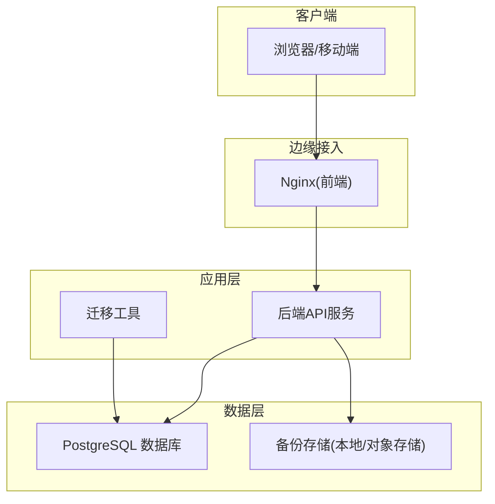

**图示来源** 
- [docker-compose.yml](file://docker-compose.yml)
- [frontend/nginx.conf](file://frontend/nginx.conf)
- [backend/app.py](file://backend/app.py)

**章节来源**
- [docker-compose.yml](file://docker-compose.yml)
- [frontend/nginx.conf](file://frontend/nginx.conf)
- [backend/app.py](file://backend/app.py)

## 核心组件
- 应用入口与生命周期
  - 后端启动与配置加载：[backend/app.py](file://backend/app.py)、[backend/bootstrap.py](file://backend/bootstrap.py)、[backend/config_manager.py](file://backend/config_manager.py)
- 数据存储与权限
  - 认证与授权：[backend/auth_store.py](file://backend/auth_store.py)、[backend/rbac_store.py](file://backend/rbac_store.py)、[backend/data_permission_store.py](file://backend/data_permission_store.py)
  - 组织树与书架：[backend/organization_tree_store.py](file://backend/organization_tree_store.py)、[backend/bookshelf_repository.py](file://backend/bookshelf_repository.py)
  - 报告历史与系统日志：[backend/smartask_report_history_store.py](file://backend/smartask_report_history_store.py)、[backend/system_log_store.py](file://backend/system_log_store.py)
- 安全与密钥
  - 安全模块与加密：[backend/security.py](file://backend/security.py)
- 数据迁移
  - 运行时迁移与初始化脚本：[backend/runtime_migration.py](file://backend/runtime_migration.py)、[docker/postgres/init/*.sql](file://docker/postgres/init/001_bookshelf_schema.sql)

**章节来源**
- [backend/app.py](file://backend/app.py)
- [backend/bootstrap.py](file://backend/bootstrap.py)
- [backend/config_manager.py](file://backend/config_manager.py)
- [backend/auth_store.py](file://backend/auth_store.py)
- [backend/rbac_store.py](file://backend/rbac_store.py)
- [backend/data_permission_store.py](file://backend/data_permission_store.py)
- [backend/organization_tree_store.py](file://backend/organization_tree_store.py)
- [backend/bookshelf_repository.py](file://backend/bookshelf_repository.py)
- [backend/smartask_report_history_store.py](file://backend/smartask_report_history_store.py)
- [backend/system_log_store.py](file://backend/system_log_store.py)
- [backend/security.py](file://backend/security.py)
- [backend/runtime_migration.py](file://backend/runtime_migration.py)
- [docker/postgres/init/001_bookshelf_schema.sql](file://docker/postgres/init/001_bookshelf_schema.sql)

## 架构总览
SmartAsk 的关键运行路径为：用户请求经 Nginx 转发至后端 API，后端读写 PostgreSQL，并通过迁移脚本完成数据结构演进。备份与恢复由独立脚本驱动，支持全量与增量策略。

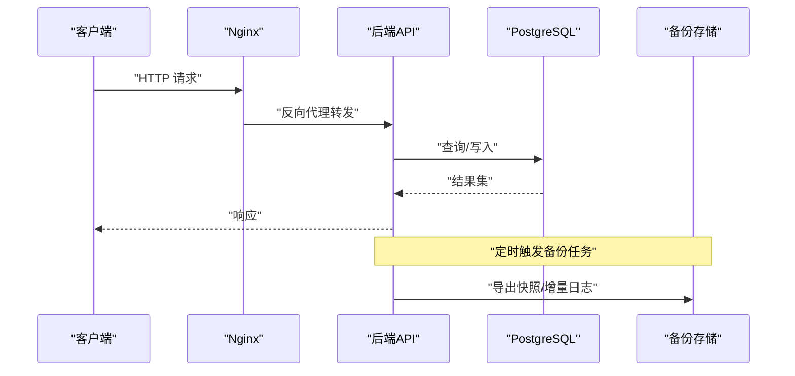

**图示来源** 
- [frontend/nginx.conf](file://frontend/nginx.conf)
- [backend/app.py](file://backend/app.py)
- [scripts/backup_all.py](file://scripts/backup_all.py)

## 详细组件分析

### 应用启动与配置加载
- 启动顺序：bootstrap 初始化环境 -> app 注册路由与中间件 -> config_manager 加载配置
- 关键职责：环境变量注入、数据库连接池、健康检查端点、日志与监控接入

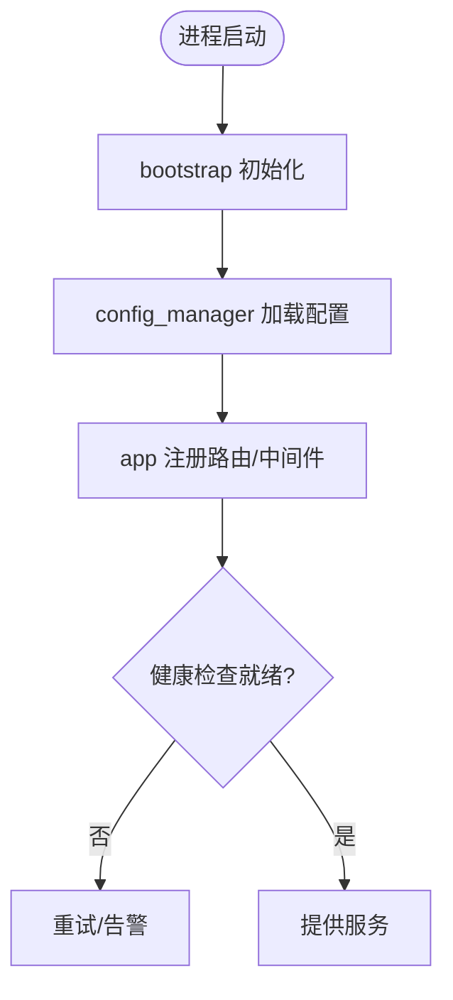

**图示来源** 
- [backend/bootstrap.py](file://backend/bootstrap.py)
- [backend/config_manager.py](file://backend/config_manager.py)
- [backend/app.py](file://backend/app.py)

**章节来源**
- [backend/bootstrap.py](file://backend/bootstrap.py)
- [backend/config_manager.py](file://backend/config_manager.py)
- [backend/app.py](file://backend/app.py)

### 认证与权限模型
- 认证存储：用户会话、令牌、密码策略
- RBAC 与数据权限：角色-资源-操作映射，数据集级访问控制
- 组织树：企业组织架构与数据隔离

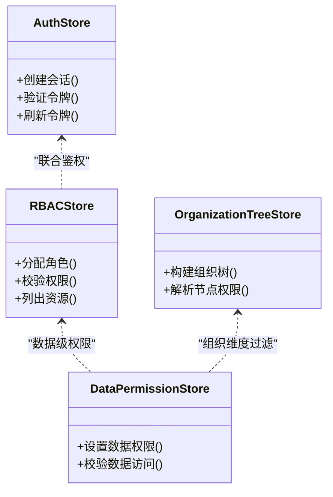

**图示来源** 
- [backend/auth_store.py](file://backend/auth_store.py)
- [backend/rbac_store.py](file://backend/rbac_store.py)
- [backend/data_permission_store.py](file://backend/data_permission_store.py)
- [backend/organization_tree_store.py](file://backend/organization_tree_store.py)

**章节来源**
- [backend/auth_store.py](file://backend/auth_store.py)
- [backend/rbac_store.py](file://backend/rbac_store.py)
- [backend/data_permission_store.py](file://backend/data_permission_store.py)
- [backend/organization_tree_store.py](file://backend/organization_tree_store.py)

### 数据迁移与初始化
- 运行时迁移：按版本顺序执行 SQL 变更
- 数据库初始化：容器启动时自动导入基础结构与种子数据

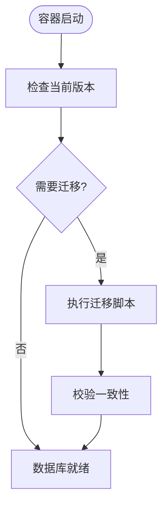

**图示来源** 
- [backend/runtime_migration.py](file://backend/runtime_migration.py)
- [docker/postgres/init/001_bookshelf_schema.sql](file://docker/postgres/init/001_bookshelf_schema.sql)
- [docker/postgres/init/004_report_config.sql](file://docker/postgres/init/004_report_config.sql)
- [docker/postgres/init/006_system_event_logs.sql](file://docker/postgres/init/006_system_event_logs.sql)

**章节来源**
- [backend/runtime_migration.py](file://backend/runtime_migration.py)
- [docker/postgres/init/001_bookshelf_schema.sql](file://docker/postgres/init/001_bookshelf_schema.sql)
- [docker/postgres/init/004_report_config.sql](file://docker/postgres/init/004_report_config.sql)
- [docker/postgres/init/006_system_event_logs.sql](file://docker/postgres/init/006_system_event_logs.sql)

### 安全与密钥管理
- 敏感信息加密：环境变量与配置文件中的密钥统一编码
- 安全策略：最小权限、传输加密、访问审计

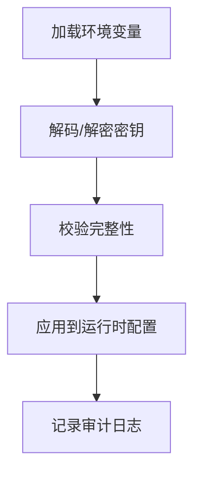

**图示来源** 
- [backend/security.py](file://backend/security.py)
- [backend/config_manager.py](file://backend/config_manager.py)

**章节来源**
- [backend/security.py](file://backend/security.py)
- [backend/config_manager.py](file://backend/config_manager.py)

## 依赖关系分析
- 外部依赖：PostgreSQL、Nginx、对象存储（可选）
- 内部依赖：后端模块间通过 store/manager 解耦，迁移与备份脚本独立于运行时

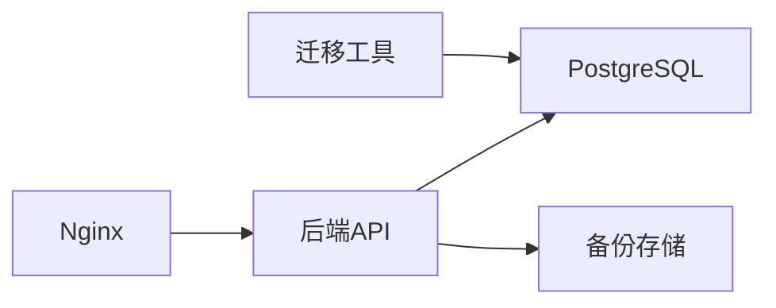

**图示来源** 
- [docker-compose.yml](file://docker-compose.yml)
- [frontend/nginx.conf](file://frontend/nginx.conf)
- [scripts/backup_all.py](file://scripts/backup_all.py)

**章节来源**
- [docker-compose.yml](file://docker-compose.yml)
- [frontend/nginx.conf](file://frontend/nginx.conf)
- [scripts/backup_all.py](file://scripts/backup_all.py)

## 性能与容量规划
- 数据库容量：根据报表历史、系统日志增长趋势预估磁盘空间与 IOPS
- 备份窗口：结合业务低峰期设定备份时间，避免影响在线查询
- 缓存与限流：在网关或应用层对热点接口实施限流与缓存策略

[本节为通用指导，不直接分析具体文件]

## 故障切换机制
- 主备切换：通过 docker-compose 编排多实例，配合负载均衡器实现自动/手动切换
- 流量切换：DNS/网关层切换指向新主节点，确保无状态服务快速漂移
- 服务降级：在数据库不可用时返回只读缓存或友好提示，保障基本可用性

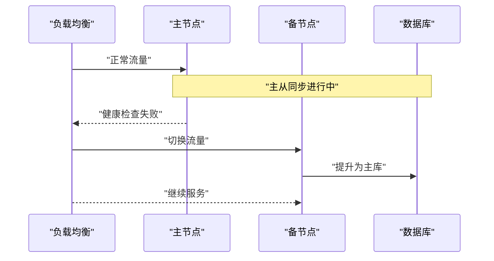

**图示来源** 
- [docker-compose.yml](file://docker-compose.yml)
- [frontend/nginx.conf](file://frontend/nginx.conf)

**章节来源**
- [docker-compose.yml](file://docker-compose.yml)
- [frontend/nginx.conf](file://frontend/nginx.conf)

## 数据备份与恢复策略
- 备份范围：PostgreSQL 全量/增量、应用配置、静态资源、迁移脚本
- 备份频率：全量每日一次，增量每 15 分钟一次（可按业务调整）
- 保留策略：近 7 天增量、近 30 天全量、归档冷备
- 恢复目标：
  - RTO：≤ 30 分钟（应用层）
  - RPO：≤ 15 分钟（数据库）

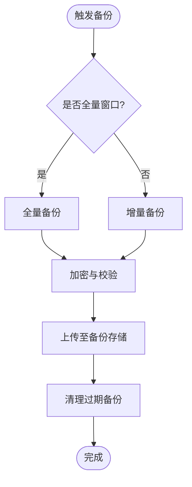

**图示来源** 
- [backup.sh](file://backup.sh)
- [scripts/backup_all.py](file://scripts/backup_all.py)

**章节来源**
- [backup.sh](file://backup.sh)
- [scripts/backup_all.py](file://scripts/backup_all.py)

## 系统恢复流程
- 基础设施重建：准备主机/容器环境、网络与安全组、存储卷挂载
- 应用部署：拉取镜像、生成配置、启动服务
- 数据恢复：先恢复数据库，再校验迁移一致性，最后启动应用

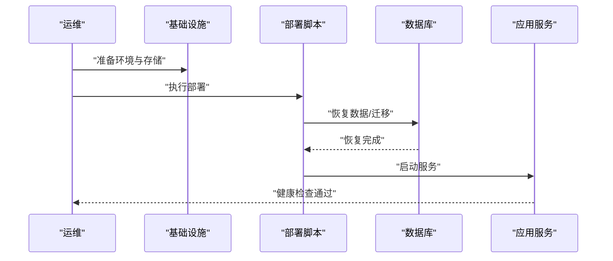

**图示来源** 
- [restore.sh](file://restore.sh)
- [deploy.sh](file://deploy.sh)
- [update.sh](file://update.sh)
- [start_backend.bat](file://start_backend.bat)
- [start_frontend.bat](file://start_frontend.bat)

**章节来源**
- [restore.sh](file://restore.sh)
- [deploy.sh](file://deploy.sh)
- [update.sh](file://update.sh)
- [start_backend.bat](file://start_backend.bat)
- [start_frontend.bat](file://start_frontend.bat)

## 演练计划
- 演练类型：桌面推演、模拟切换、真实恢复演练
- 周期：每季度至少一次，重大变更后立即演练
- 脚本与用例：基于集成测试与恢复脚本构造场景
- 评估指标：RTO/RPO 达成率、错误率、回滚成功率

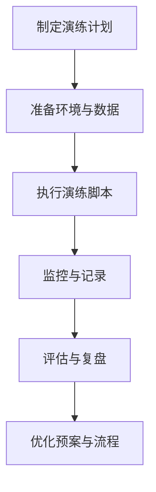

**图示来源** 
- [scripts/integration_test.py](file://scripts/integration_test.py)
- [doctor.sh](file://doctor.sh)

**章节来源**
- [scripts/integration_test.py](file://scripts/integration_test.py)
- [doctor.sh](file://doctor.sh)

## 文档维护与应急联系
- 预案更新：每次变更需同步更新本预案与操作步骤
- 联系人列表：明确责任人、联系方式与升级路径
- 应急渠道：建立即时通讯群、电话会议桥与值班表

[本节为通用指导，不直接分析具体文件]

## 事后分析与改进
- 事件复盘：根因分析、影响面评估、处置过程回顾
- 改进措施：技术加固、流程优化、自动化增强
- 跟踪闭环：将改进项纳入迭代计划并验收

[本节为通用指导，不直接分析具体文件]

## 结论
本预案以容器化与脚本化为抓手，明确了 SmartAsk 的灾备目标、恢复流程与演练机制。通过严格的 RTO/RPO 约束与标准化的操作步骤，可在硬件、软件、数据与安全事件中快速恢复服务，持续降低业务风险。