# 生产环境架构设计

<cite>
**本文引用的文件**   
- [docker-compose.yml](file://docker-compose.yml)
- [backend/Dockerfile](file://backend/Dockerfile)
- [frontend/Dockerfile](file://frontend/Dockerfile)
- [frontend/nginx.conf](file://frontend/nginx.conf)
- [backend/app.py](file://backend/app.py)
- [backend/config_manager.py](file://backend/config_manager.py)
- [backend/feature_flags.py](file://backend/feature_flags.py)
- [backend/security.py](file://backend/security.py)
- [backend/auth_store.py](file://backend/auth_store.py)
- [backend/datasource_router.py](file://backend/datasource_router.py)
- [backend/smartask_advanced/service.py](file://backend/smartask_advanced/service.py)
- [backend/smartask_basic/service.py](file://backend/smartask_basic/service.py)
- [backend/controllers/auth.py](file://backend/controllers/auth.py)
- [backend/controllers/ask_flow.py](file://backend/controllers/ask_flow.py)
- [backend/controllers/system_logs.py](file://backend/controllers/system_logs.py)
- [backend/migrations/20260330_bookshelf_schema.sql](file://backend/migrations/20260330_bookshelf_schema.sql)
- [backend/migrations/20260512_system_event_logs.sql](file://backend/migrations/20260512_system_event_logs.sql)
- [docker/postgres/init/001_bookshelf_schema.sql](file://docker/postgres/init/001_bookshelf_schema.sql)
- [docker/postgres/init/006_system_event_logs.sql](file://docker/postgres/init/006_system_event_logs.sql)
- [deploy.sh](file://deploy.sh)
- [scripts/verify_deployment.py](file://scripts/verify_deployment.py)
</cite>

## 目录
1. [简介](#简介)
2. [项目结构](#项目结构)
3. [核心组件](#核心组件)
4. [架构总览](#架构总览)
5. [详细组件分析](#详细组件分析)
6. [依赖关系分析](#依赖关系分析)
7. [性能考虑](#性能考虑)
8. [故障排查指南](#故障排查指南)
9. [结论](#结论)
10. [附录](#附录)

## 简介
本文件面向 SmartAsk 智能问数平台的生产环境，给出端到端架构设计与部署方案。内容覆盖前后端分离、微服务拆分策略、容器化与编排、负载均衡（Nginx）反向代理与会话保持、健康检查、高可用（多实例、自动转移、数据一致性）、数据库（主从复制、读写分离、连接池）、缓存（Redis 层、预热与失效）、网络拓扑与安全边界（防火墙、VPC、安全组）。文档以仓库现有配置与代码为依据，并结合生产最佳实践进行系统化阐述。

## 项目结构
SmartAsk 采用前后端分离与容器化部署：
- 前端：基于 Vue/Vite 构建，使用 Nginx 静态资源服务与反向代理。
- 后端：Python FastAPI/Flask 应用（由 app.py 启动），按功能模块拆分为控制器与服务层。
- 数据：PostgreSQL 作为持久化存储，初始化脚本位于 docker/postgres/init。
- 编排：docker-compose.yml 统一编排 Web、API、DB 等组件。
- 运维：提供部署脚本 deploy.sh 与健康校验 scripts/verify_deployment.py。

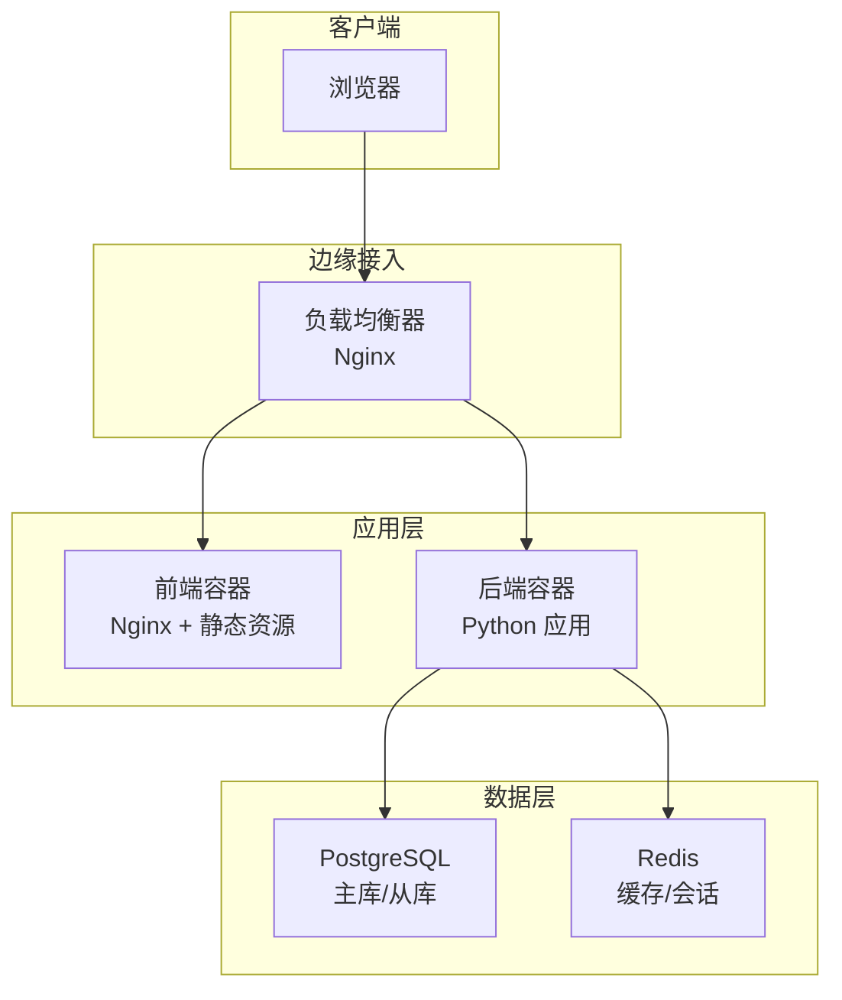

图表来源
- [frontend/nginx.conf](file://frontend/nginx.conf)
- [backend/app.py](file://backend/app.py)
- [docker-compose.yml](file://docker-compose.yml)

章节来源
- [docker-compose.yml](file://docker-compose.yml)
- [frontend/Dockerfile](file://frontend/Dockerfile)
- [backend/Dockerfile](file://backend/Dockerfile)
- [frontend/nginx.conf](file://frontend/nginx.conf)

## 核心组件
- 前端服务：Nginx 提供静态资源与反向代理，转发 API 请求至后端。
- 后端服务：REST API 暴露业务接口，包含认证、权限、数据集路由、问答流程等。
- 数据存储：PostgreSQL 承载结构化数据；Redis 用于缓存与会话。
- 编排与部署：Docker Compose 管理多容器生命周期；部署脚本自动化发布与验证。

章节来源
- [backend/app.py](file://backend/app.py)
- [frontend/nginx.conf](file://frontend/nginx.conf)
- [docker-compose.yml](file://docker-compose.yml)

## 架构总览
整体采用“前端静态站点 + 后端 API 服务 + 数据库 + 缓存”的分层架构，通过 Nginx 实现统一入口、反向代理与负载均衡；后端按领域拆分为多个控制器与服务，便于独立扩展与演进。

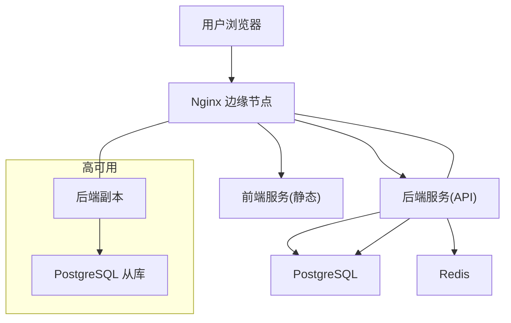

图表来源
- [frontend/nginx.conf](file://frontend/nginx.conf)
- [backend/app.py](file://backend/app.py)
- [docker-compose.yml](file://docker-compose.yml)

## 详细组件分析

### 负载均衡与反向代理（Nginx）
- 角色：统一入口、静态资源托管、API 反向代理、健康检查、会话保持。
- 关键能力：
  - 将 /api/* 请求转发到后端服务集群。
  - 对静态资源路径直接返回，减少后端压力。
  - 可配置 upstream 多后端实例以实现负载均衡。
  - 可通过健康检查探针剔除异常节点。
  - 支持 Cookie/URL 的会话保持（sticky session）。

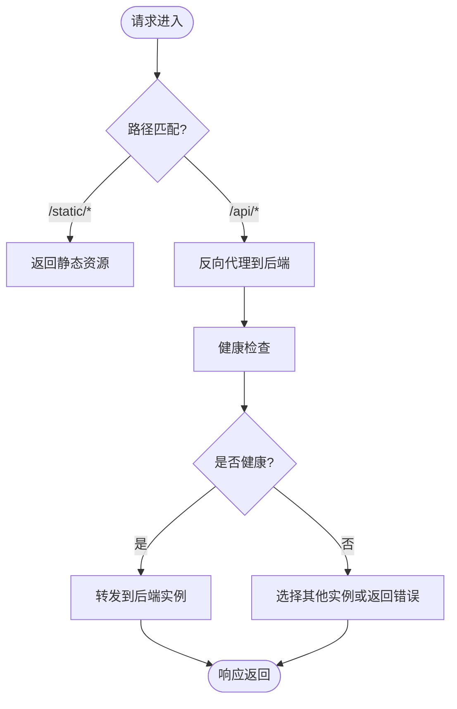

图表来源
- [frontend/nginx.conf](file://frontend/nginx.conf)

章节来源
- [frontend/nginx.conf](file://frontend/nginx.conf)

### 后端服务（Python 应用）
- 入口：app.py 定义应用启动、路由注册与中间件。
- 控制器：controllers 下按领域划分（认证、数据集、报告、系统日志等）。
- 服务层：smartask_advanced/basic 提供高级/基础问数能力。
- 配置与特性：config_manager.py 管理运行时配置；feature_flags.py 控制功能开关。
- 安全：security.py 提供鉴权、签名、限流等通用能力。

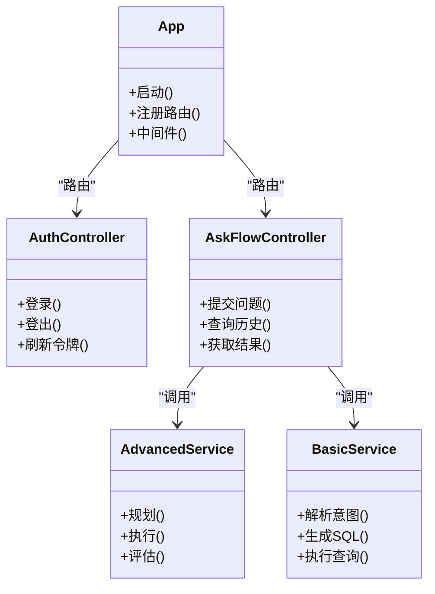

图表来源
- [backend/app.py](file://backend/app.py)
- [backend/controllers/auth.py](file://backend/controllers/auth.py)
- [backend/controllers/ask_flow.py](file://backend/controllers/ask_flow.py)
- [backend/smartask_advanced/service.py](file://backend/smartask_advanced/service.py)
- [backend/smartask_basic/service.py](file://backend/smartask_basic/service.py)

章节来源
- [backend/app.py](file://backend/app.py)
- [backend/controllers/auth.py](file://backend/controllers/auth.py)
- [backend/controllers/ask_flow.py](file://backend/controllers/ask_flow.py)
- [backend/smartask_advanced/service.py](file://backend/smartask_advanced/service.py)
- [backend/smartask_basic/service.py](file://backend/smartask_basic/service.py)
- [backend/config_manager.py](file://backend/config_manager.py)
- [backend/feature_flags.py](file://backend/feature_flags.py)
- [backend/security.py](file://backend/security.py)

### 认证与会话
- 认证流程：前端登录后，后端签发访问令牌并维护会话状态。
- 会话存储：建议 Redis 存储会话信息，支持跨实例共享与会话保持。
- 安全策略：JWT 或短期令牌，配合签名校验与过期时间控制。

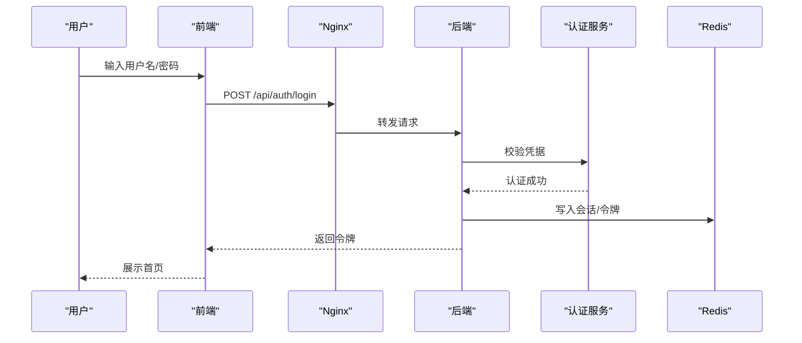

图表来源
- [backend/controllers/auth.py](file://backend/controllers/auth.py)
- [backend/auth_store.py](file://backend/auth_store.py)
- [frontend/nginx.conf](file://frontend/nginx.conf)

章节来源
- [backend/controllers/auth.py](file://backend/controllers/auth.py)
- [backend/auth_store.py](file://backend/auth_store.py)

### 数据源路由与查询
- 路由策略：datasource_router.py 根据组织/数据集维度选择目标数据源。
- 执行链路：AskFlowController 协调高级/基础服务，生成 SQL 并执行。
- 权限控制：结合 RBAC 与数据权限存储，确保最小权限访问。

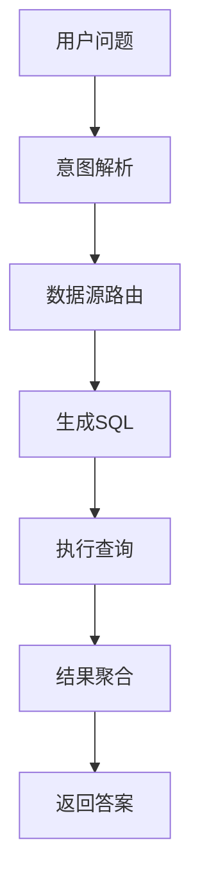

图表来源
- [backend/controllers/ask_flow.py](file://backend/controllers/ask_flow.py)
- [backend/datasource_router.py](file://backend/datasource_router.py)
- [backend/smartask_advanced/service.py](file://backend/smartask_advanced/service.py)
- [backend/smartask_basic/service.py](file://backend/smartask_basic/service.py)

章节来源
- [backend/controllers/ask_flow.py](file://backend/controllers/ask_flow.py)
- [backend/datasource_router.py](file://backend/datasource_router.py)
- [backend/smartask_advanced/service.py](file://backend/smartask_advanced/service.py)
- [backend/smartask_basic/service.py](file://backend/smartask_basic/service.py)

### 数据库架构（PostgreSQL）
- 模式与迁移：migrations 与 docker/postgres/init 提供初始 schema 与增量升级。
- 主从复制：推荐一主多从，读多写少场景下提升吞吐与可用性。
- 读写分离：后端通过连接池区分读写连接，读请求走从库，写请求走主库。
- 连接池：后端使用连接池管理数据库连接，避免频繁创建销毁。

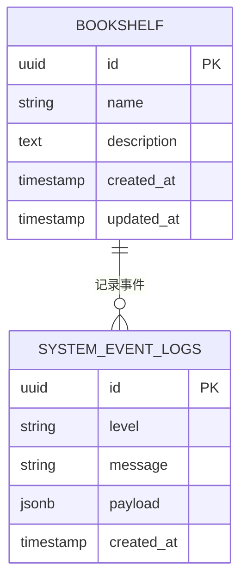

图表来源
- [docker/postgres/init/001_bookshelf_schema.sql](file://docker/postgres/init/001_bookshelf_schema.sql)
- [docker/postgres/init/006_system_event_logs.sql](file://docker/postgres/init/006_system_event_logs.sql)
- [backend/migrations/20260330_bookshelf_schema.sql](file://backend/migrations/20260330_bookshelf_schema.sql)
- [backend/migrations/20260512_system_event_logs.sql](file://backend/migrations/20260512_system_event_logs.sql)

章节来源
- [docker/postgres/init/001_bookshelf_schema.sql](file://docker/postgres/init/001_bookshelf_schema.sql)
- [docker/postgres/init/006_system_event_logs.sql](file://docker/postgres/init/006_system_event_logs.sql)
- [backend/migrations/20260330_bookshelf_schema.sql](file://backend/migrations/20260330_bookshelf_schema.sql)
- [backend/migrations/20260512_system_event_logs.sql](file://backend/migrations/20260512_system_event_logs.sql)

### 缓存策略（Redis）
- 用途：热点数据缓存、会话存储、分布式锁、限流计数。
- 预热：启动时加载常用字典、指标阈值、模板等。
- 失效：TTL 过期、主动失效、版本号/哈希键名更新。
- 一致性：先更新数据库再删除缓存，或使用双写+延迟双删策略。

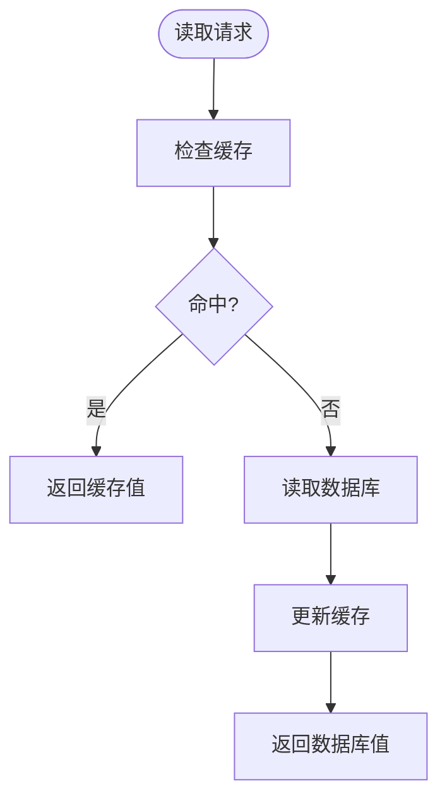

图表来源
- [backend/config_manager.py](file://backend/config_manager.py)
- [backend/feature_flags.py](file://backend/feature_flags.py)

章节来源
- [backend/config_manager.py](file://backend/config_manager.py)
- [backend/feature_flags.py](file://backend/feature_flags.py)

### 高可用与故障转移
- 多实例：后端至少两个实例，Nginx 做负载均衡与健康检查。
- 自动转移：当某实例失败，Nginx 将其剔除；数据库主库故障时切换从库为主。
- 数据一致性：事务边界清晰，读写分离需保证最终一致；必要时引入补偿机制。

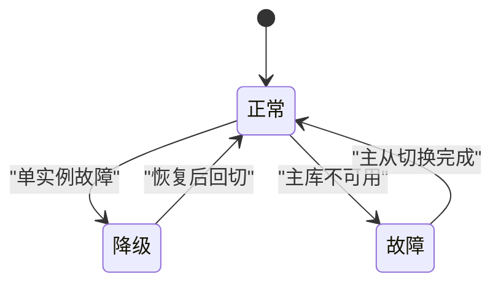

图表来源
- [frontend/nginx.conf](file://frontend/nginx.conf)
- [docker-compose.yml](file://docker-compose.yml)

章节来源
- [frontend/nginx.conf](file://frontend/nginx.conf)
- [docker-compose.yml](file://docker-compose.yml)

### 容器化与编排
- 镜像构建：backend/Dockerfile、frontend/Dockerfile 分别定义后端与前端的构建过程。
- 编排：docker-compose.yml 统一管理 Web、API、DB、缓存等服务的端口、卷、环境变量。
- 部署：deploy.sh 提供一键部署、滚动更新与回滚能力。

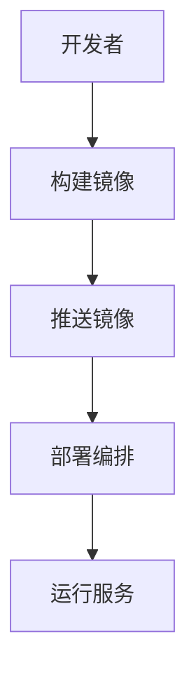

图表来源
- [backend/Dockerfile](file://backend/Dockerfile)
- [frontend/Dockerfile](file://frontend/Dockerfile)
- [docker-compose.yml](file://docker-compose.yml)
- [deploy.sh](file://deploy.sh)

章节来源
- [backend/Dockerfile](file://backend/Dockerfile)
- [frontend/Dockerfile](file://frontend/Dockerfile)
- [docker-compose.yml](file://docker-compose.yml)
- [deploy.sh](file://deploy.sh)

### 安全边界与网络拓扑
- 网络分区：VPC 隔离不同环境（开发/测试/生产），安全组限制入站出站流量。
- 防火墙：仅开放必要端口（如 80/443 对外，内部服务间通过内网通信）。
- 访问控制：Nginx 白名单、后端鉴权、RBAC 与数据权限。
- 传输加密：HTTPS 终止于 Nginx，后端服务间使用内网 TLS。

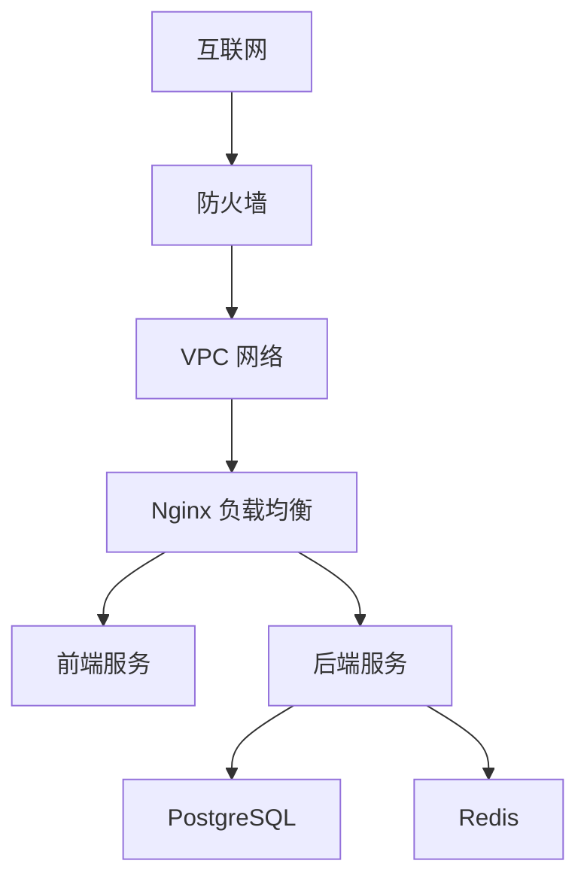

图表来源
- [frontend/nginx.conf](file://frontend/nginx.conf)
- [backend/security.py](file://backend/security.py)

章节来源
- [frontend/nginx.conf](file://frontend/nginx.conf)
- [backend/security.py](file://backend/security.py)

## 依赖关系分析
- 前端依赖 Nginx 静态资源与反向代理。
- 后端依赖数据库与缓存，控制器依赖服务层。
- 编排依赖 Docker 与 Compose，部署依赖脚本。

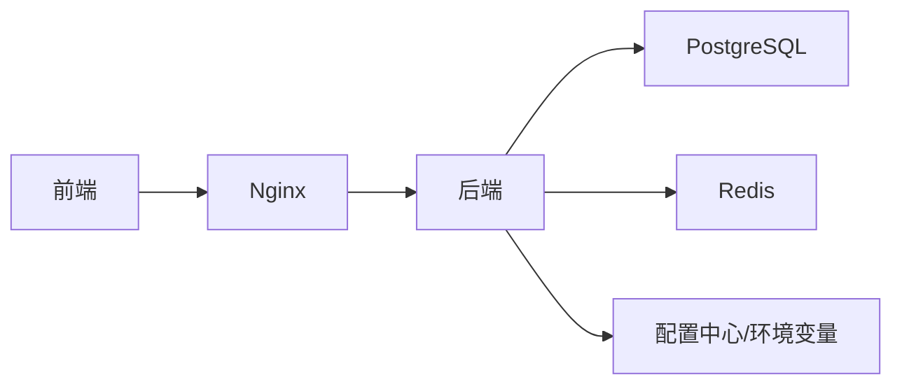

图表来源
- [frontend/nginx.conf](file://frontend/nginx.conf)
- [backend/app.py](file://backend/app.py)
- [docker-compose.yml](file://docker-compose.yml)

章节来源
- [frontend/nginx.conf](file://frontend/nginx.conf)
- [backend/app.py](file://backend/app.py)
- [docker-compose.yml](file://docker-compose.yml)

## 性能考虑
- 前端：静态资源压缩、CDN 加速、HTTP/2。
- 后端：连接池、异步处理、缓存命中率优化、慢查询监控。
- 数据库：索引优化、读写分离、分库分表（按需）、备份与归档。
- 缓存：热点数据优先、合理 TTL、预加载与批量更新。
- 监控：全链路日志、APM、告警阈值。

## 故障排查指南
- 健康检查：Nginx 健康探针、后端健康端点、数据库连通性。
- 日志收集：后端系统日志、数据库慢查询日志、Nginx 访问日志。
- 验证工具：scripts/verify_deployment.py 用于部署后自检。
- 常见问题：
  - 端口冲突：检查 docker-compose 端口映射。
  - 数据库连接失败：检查连接串、权限、网络可达性。
  - 缓存未命中：检查 TTL、键命名空间、预热任务。

章节来源
- [scripts/verify_deployment.py](file://scripts/verify_deployment.py)
- [backend/controllers/system_logs.py](file://backend/controllers/system_logs.py)

## 结论
SmartAsk 生产环境采用前后端分离与容器化编排，通过 Nginx 实现统一入口与负载均衡，后端按领域拆分以提升可维护性与扩展性。数据库主从与读写分离保障高可用与吞吐，Redis 缓存层提升响应速度与稳定性。结合严格的安全边界与完善的监控告警，可满足企业级问数平台的稳定运行需求。

## 附录
- 部署清单：镜像版本、环境变量、端口映射、卷挂载。
- 回滚策略：灰度发布、快速回滚、数据迁移兼容。
- 容量规划：CPU/内存/磁盘预估，弹性扩缩容策略。
- 合规要求：数据脱敏、审计留痕、访问审批。