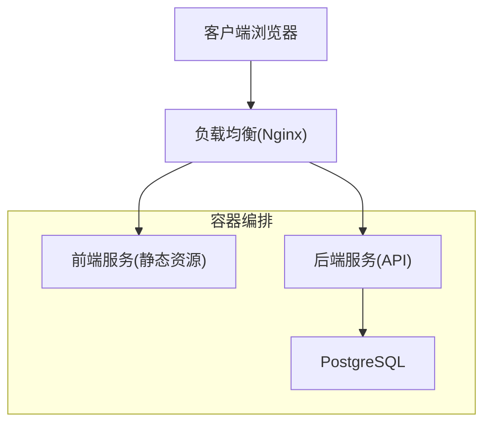
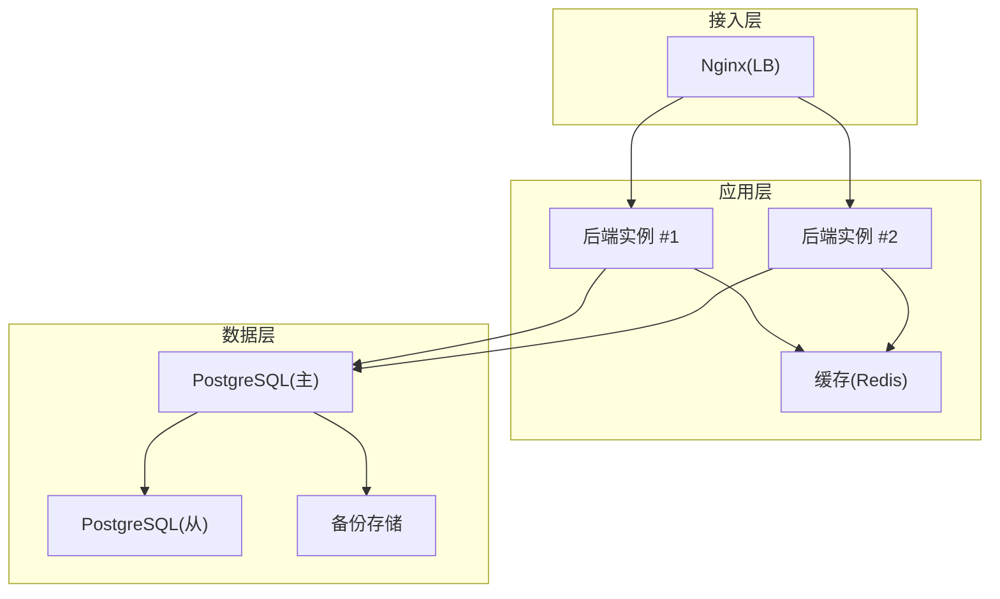
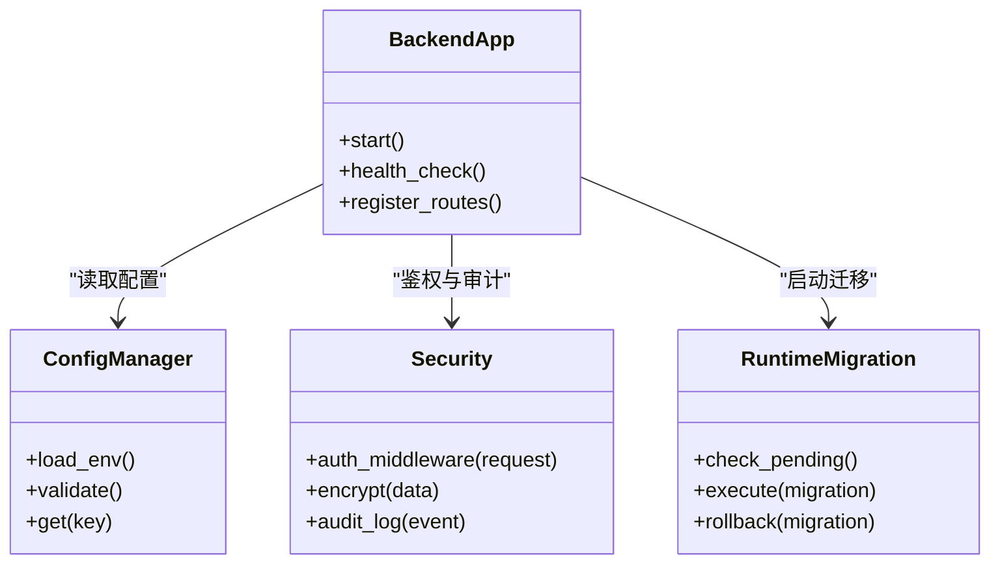
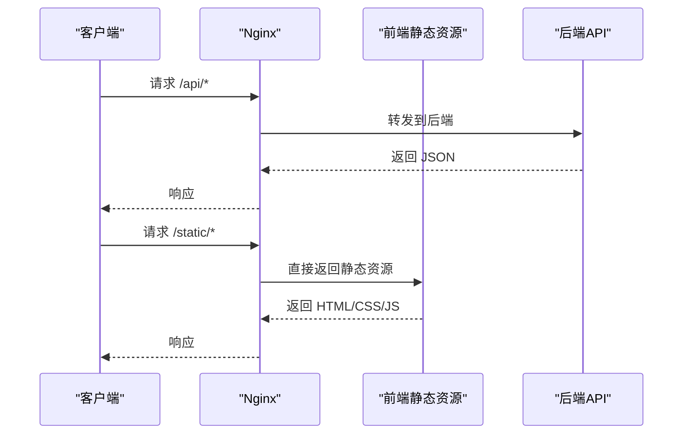
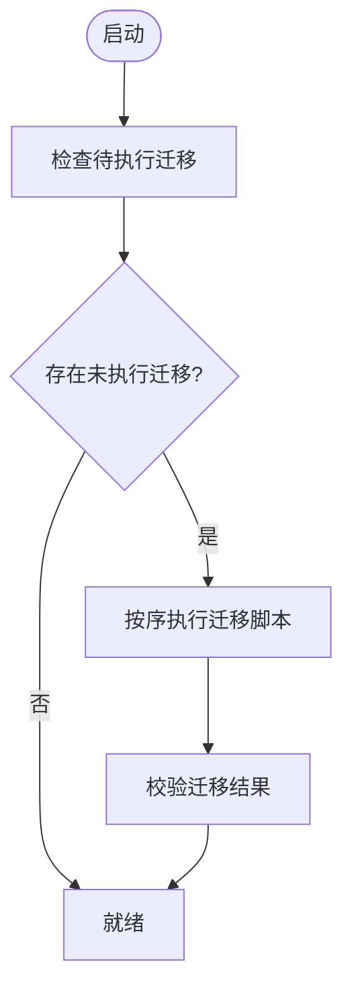
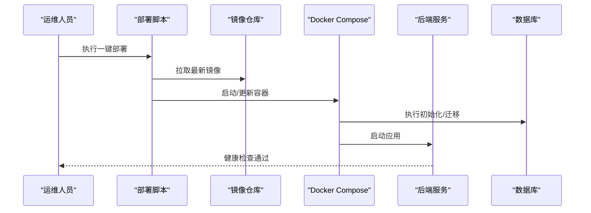
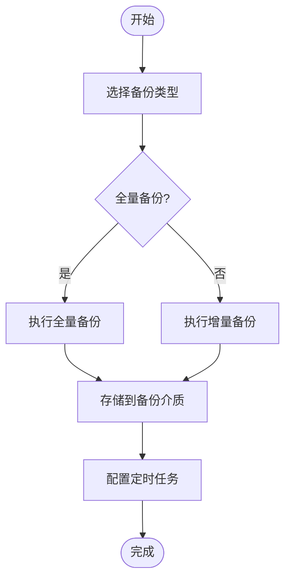
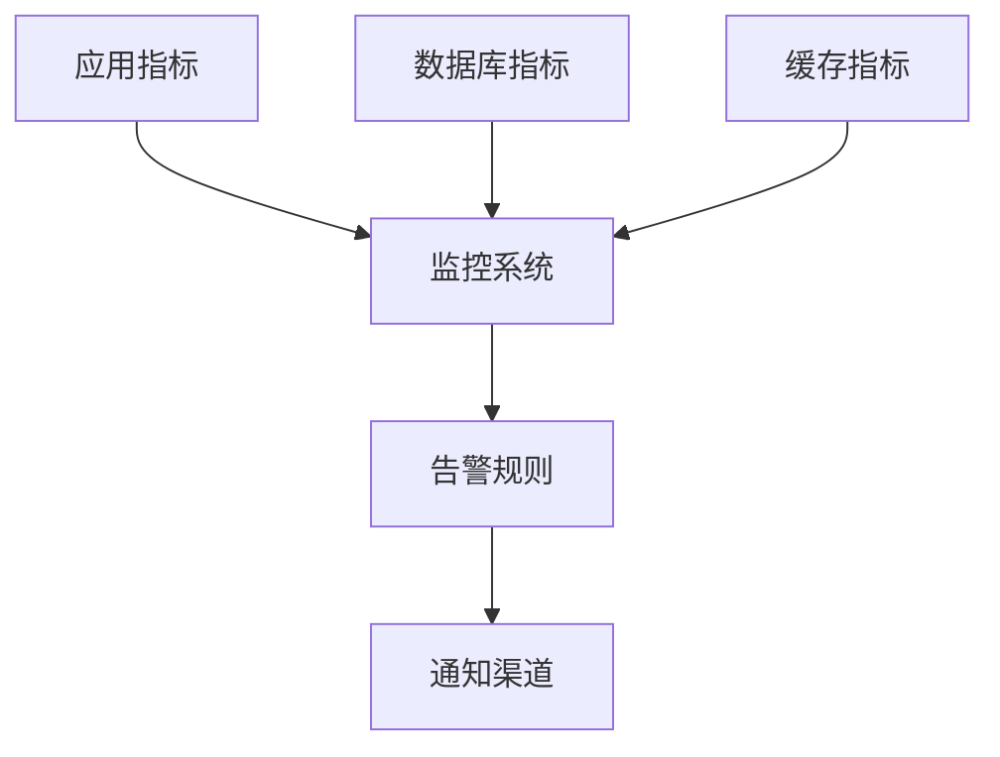
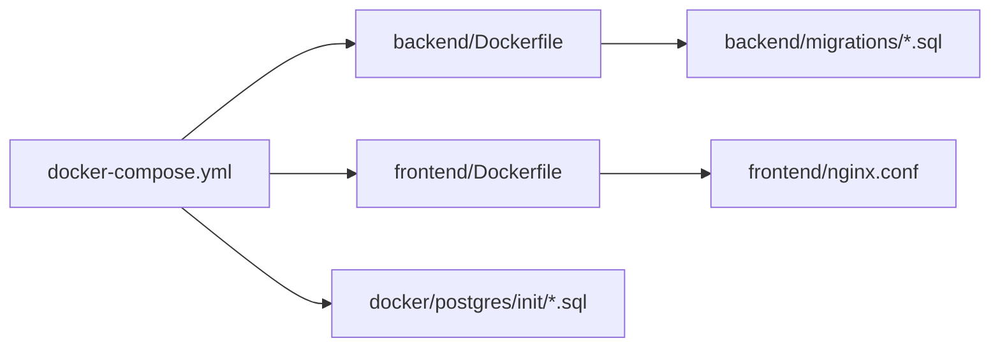

# 生产环境部署

<cite>
**本文引用的文件**   
- [docker-compose.yml](file://docker-compose.yml)
- [backend/Dockerfile](file://backend/Dockerfile)
- [frontend/Dockerfile](file://frontend/Dockerfile)
- [frontend/nginx.conf](file://frontend/nginx.conf)
- [deploy.sh](file://deploy.sh)
- [update.sh](file://update.sh)
- [restore.sh](file://restore.sh)
- [backup.sh](file://backup.sh)
- [scripts/backup_all.py](file://scripts/backup_all.py)
- [scripts/integration_test.py](file://scripts/integration_test.py)
- [scripts/verify_deployment.py](file://scripts/verify_deployment.py)
- [backend/app.py](file://backend/app.py)
- [backend/config_manager.py](file://backend/config_manager.py)
- [backend/security.py](file://backend/security.py)
- [backend/runtime_migration.py](file://backend/runtime_migration.py)
- [backend/migrations/20260330_bookshelf_schema.sql](file://backend/migrations/20260330_bookshelf_schema.sql)
- [backend/migrations/20260430_report_config.sql](file://backend/migrations/20260430_report_config.sql)
- [backend/migrations/20260512_system_event_logs.sql](file://backend/migrations/20260512_system_event_logs.sql)
- [docker/postgres/init/001_bookshelf_schema.sql](file://docker/postgres/init/001_bookshelf_schema.sql)
- [docker/postgres/init/002_angel_group_data.sql](file://docker/postgres/init/002_angel_group_data.sql)
- [docker/postgres/init/003_bookshelf_agent1_prompt_upgrade.sql](file://docker/postgres/init/003_bookshelf_agent1_prompt_upgrade.sql)
- [docker/postgres/init/004_report_config.sql](file://docker/postgres/init/004_report_config.sql)
- [docker/postgres/init/005_report_thresholds.sql](file://docker/postgres/init/005_report_thresholds.sql)
- [docker/postgres/init/006_system_event_logs.sql](file://docker/postgres/init/006_system_event_logs.sql)
- [docs/SmartAsk_部署与交付手册.md](file://docs/SmartAsk_部署与交付手册.md)
</cite>

## 目录
1. [简介](#简介)
2. [项目结构](#项目结构)
3. [核心组件](#核心组件)
4. [架构总览](#架构总览)
5. [详细组件分析](#详细组件分析)
6. [依赖关系分析](#依赖关系分析)
7. [性能考虑](#性能考虑)
8. [故障排查指南](#故障排查指南)
9. [结论](#结论)
10. [附录](#附录)

## 简介
本文件为 SmartAsk 智能问数平台的生产环境部署文档，覆盖以下关键主题：
- 生产环境架构设计：负载均衡、高可用、数据库主从复制与缓存策略
- 完整部署脚本使用：一键部署、版本升级、回滚操作与数据迁移
- 数据备份与恢复：全量/增量备份与定时任务配置
- 安全加固：SSL/TLS、访问控制、数据加密与安全审计
- 性能调优：数据库优化、应用参数调优与系统资源优化
- 监控告警：关键指标、错误追踪与自动告警规则
- 灾难恢复预案与故障处理流程

## 项目结构
SmartAsk 采用前后端分离与容器化部署模式：
- 后端服务（Python）通过 Docker 镜像构建并运行
- 前端静态资源由 Nginx 提供，反向代理至后端 API
- PostgreSQL 作为持久化存储，初始化脚本位于 docker/postgres/init
- 运维脚本集中在根目录与 scripts 目录，涵盖部署、更新、备份、恢复与验证

图表来源
- [docker-compose.yml](file://docker-compose.yml)
- [frontend/nginx.conf](file://frontend/nginx.conf)
- [backend/Dockerfile](file://backend/Dockerfile)
- [frontend/Dockerfile](file://frontend/Dockerfile)

章节来源
- [docker-compose.yml](file://docker-compose.yml)
- [backend/Dockerfile](file://backend/Dockerfile)
- [frontend/Dockerfile](file://frontend/Dockerfile)
- [frontend/nginx.conf](file://frontend/nginx.conf)

## 核心组件
- 后端服务
  - 入口与路由：后端应用启动与接口暴露
  - 配置管理：运行时配置加载与校验
  - 安全模块：鉴权、加密与审计相关能力
  - 运行时迁移：数据库结构与运行时配置变更
- 前端服务
  - 静态资源与反向代理：Nginx 配置与端口映射
- 数据存储
  - 初始化 SQL：数据库表结构与基础数据
  - 迁移脚本：按时间戳命名的增量变更
- 运维脚本
  - 部署与更新：一键部署、滚动升级与回滚
  - 备份与恢复：全量/增量备份与恢复流程
  - 集成测试与部署验证：健康检查与冒烟测试

章节来源
- [backend/app.py](file://backend/app.py)
- [backend/config_manager.py](file://backend/config_manager.py)
- [backend/security.py](file://backend/security.py)
- [backend/runtime_migration.py](file://backend/runtime_migration.py)
- [frontend/nginx.conf](file://frontend/nginx.conf)
- [docker/postgres/init/001_bookshelf_schema.sql](file://docker/postgres/init/001_bookshelf_schema.sql)
- [backend/migrations/20260330_bookshelf_schema.sql](file://backend/migrations/20260330_bookshelf_schema.sql)
- [backend/migrations/20260430_report_config.sql](file://backend/migrations/20260430_report_config.sql)
- [backend/migrations/20260512_system_event_logs.sql](file://backend/migrations/20260512_system_event_logs.sql)

## 架构总览
生产环境建议的架构要点：
- 负载均衡
  - 使用 Nginx 或云厂商 LB 进行流量分发与健康检查
  - 前端静态资源与后端 API 路径分离，统一入口
- 高可用
  - 多副本后端实例，无状态化设计
  - 数据库主从复制与读写分离，连接池与超时配置
  - 缓存层（如 Redis）用于热点数据与会话缓存
- 数据一致性
  - 数据库迁移按版本号执行，支持幂等与回滚
  - 备份策略结合全量与增量，确保 RPO/RTO 目标

图表来源
- [docker-compose.yml](file://docker-compose.yml)
- [frontend/nginx.conf](file://frontend/nginx.conf)

## 详细组件分析

### 后端服务
- 应用入口与生命周期
  - 启动时加载配置、注册路由、初始化依赖
  - 健康检查端点用于负载均衡探测
- 配置管理
  - 环境变量与配置文件合并，敏感信息加密存储
- 安全模块
  - 鉴权中间件、请求签名、审计日志
- 运行时迁移
  - 启动前检测并执行未完成的迁移脚本
  - 支持回滚与幂等执行

图表来源
- [backend/app.py](file://backend/app.py)
- [backend/config_manager.py](file://backend/config_manager.py)
- [backend/security.py](file://backend/security.py)
- [backend/runtime_migration.py](file://backend/runtime_migration.py)

章节来源
- [backend/app.py](file://backend/app.py)
- [backend/config_manager.py](file://backend/config_manager.py)
- [backend/security.py](file://backend/security.py)
- [backend/runtime_migration.py](file://backend/runtime_migration.py)

### 前端与反向代理
- Nginx 负责静态资源与反向代理
- 可配置 HTTPS、Gzip、缓存头与跨域策略
- 健康检查与限流策略可在 Nginx 层实现

图表来源
- [frontend/nginx.conf](file://frontend/nginx.conf)

章节来源
- [frontend/nginx.conf](file://frontend/nginx.conf)

### 数据库与迁移
- 初始化脚本定义表结构与基础数据
- 迁移脚本按时间戳命名，支持顺序执行与幂等
- 建议开启 WAL 归档与 PITR，配合备份工具实现时间点恢复

图表来源
- [backend/runtime_migration.py](file://backend/runtime_migration.py)
- [backend/migrations/20260330_bookshelf_schema.sql](file://backend/migrations/20260330_bookshelf_schema.sql)
- [backend/migrations/20260430_report_config.sql](file://backend/migrations/20260430_report_config.sql)
- [backend/migrations/20260512_system_event_logs.sql](file://backend/migrations/20260512_system_event_logs.sql)
- [docker/postgres/init/001_bookshelf_schema.sql](file://docker/postgres/init/001_bookshelf_schema.sql)
- [docker/postgres/init/002_angel_group_data.sql](file://docker/postgres/init/002_angel_group_data.sql)
- [docker/postgres/init/003_bookshelf_agent1_prompt_upgrade.sql](file://docker/postgres/init/003_bookshelf_agent1_prompt_upgrade.sql)
- [docker/postgres/init/004_report_config.sql](file://docker/postgres/init/004_report_config.sql)
- [docker/postgres/init/005_report_thresholds.sql](file://docker/postgres/init/005_report_thresholds.sql)
- [docker/postgres/init/006_system_event_logs.sql](file://docker/postgres/init/006_system_event_logs.sql)

章节来源
- [backend/runtime_migration.py](file://backend/runtime_migration.py)
- [backend/migrations/20260330_bookshelf_schema.sql](file://backend/migrations/20260330_bookshelf_schema.sql)
- [backend/migrations/20260430_report_config.sql](file://backend/migrations/20260430_report_config.sql)
- [backend/migrations/20260512_system_event_logs.sql](file://backend/migrations/20260512_system_event_logs.sql)
- [docker/postgres/init/001_bookshelf_schema.sql](file://docker/postgres/init/001_bookshelf_schema.sql)
- [docker/postgres/init/002_angel_group_data.sql](file://docker/postgres/init/002_angel_group_data.sql)
- [docker/postgres/init/003_bookshelf_agent1_prompt_upgrade.sql](file://docker/postgres/init/003_bookshelf_agent1_prompt_upgrade.sql)
- [docker/postgres/init/004_report_config.sql](file://docker/postgres/init/004_report_config.sql)
- [docker/postgres/init/005_report_thresholds.sql](file://docker/postgres/init/005_report_thresholds.sql)
- [docker/postgres/init/006_system_event_logs.sql](file://docker/postgres/init/006_system_event_logs.sql)

### 部署与更新
- 一键部署
  - 使用部署脚本拉取镜像、创建网络与卷、启动服务
  - 自动执行数据库初始化与迁移
- 版本升级
  - 滚动更新后端实例，保持服务可用性
  - 前置迁移与后置校验
- 回滚操作
  - 快速回退到上一镜像版本
  - 必要时回滚数据库迁移（谨慎评估影响）

图表来源
- [deploy.sh](file://deploy.sh)
- [update.sh](file://update.sh)
- [docker-compose.yml](file://docker-compose.yml)

章节来源
- [deploy.sh](file://deploy.sh)
- [update.sh](file://update.sh)
- [docker-compose.yml](file://docker-compose.yml)

### 备份与恢复
- 全量备份
  - 定期导出数据库快照与配置文件
- 增量备份
  - 基于 WAL 归档与时间点恢复
- 恢复流程
  - 选择合适的时间点进行恢复
  - 验证数据一致性与业务可用性

图表来源
- [backup.sh](file://backup.sh)
- [scripts/backup_all.py](file://scripts/backup_all.py)

章节来源
- [backup.sh](file://backup.sh)
- [scripts/backup_all.py](file://scripts/backup_all.py)
- [restore.sh](file://restore.sh)

### 监控与告警
- 关键指标
  - 应用健康、QPS、延迟、错误率
  - 数据库连接数、慢查询、锁等待
  - 缓存命中率与内存使用
- 错误追踪
  - 结构化日志与链路追踪
- 自动告警
  - 阈值触发与通知渠道

[此图为概念性展示，不直接映射具体源码文件]

## 依赖关系分析
- 容器编排
  - docker-compose 定义服务、网络与卷
- 镜像构建
  - 后端与前端各自 Dockerfile
- 反向代理
  - Nginx 配置与端口映射
- 数据库初始化与迁移
  - 初始化 SQL 与迁移脚本

图表来源
- [docker-compose.yml](file://docker-compose.yml)
- [backend/Dockerfile](file://backend/Dockerfile)
- [frontend/Dockerfile](file://frontend/Dockerfile)
- [frontend/nginx.conf](file://frontend/nginx.conf)
- [docker/postgres/init/001_bookshelf_schema.sql](file://docker/postgres/init/001_bookshelf_schema.sql)
- [backend/migrations/20260330_bookshelf_schema.sql](file://backend/migrations/20260330_bookshelf_schema.sql)

章节来源
- [docker-compose.yml](file://docker-compose.yml)
- [backend/Dockerfile](file://backend/Dockerfile)
- [frontend/Dockerfile](file://frontend/Dockerfile)
- [frontend/nginx.conf](file://frontend/nginx.conf)
- [docker/postgres/init/001_bookshelf_schema.sql](file://docker/postgres/init/001_bookshelf_schema.sql)
- [backend/migrations/20260330_bookshelf_schema.sql](file://backend/migrations/20260330_bookshelf_schema.sql)

## 性能考虑
- 数据库优化
  - 连接池大小、超时与重试策略
  - 索引优化与慢查询分析
  - 主从复制延迟监控与读写分离
- 应用参数调优
  - 工作进程与线程数
  - 请求体大小限制与超时
  - 缓存策略（TTL、淘汰策略）
- 系统资源优化
  - CPU/内存限制与弹性伸缩
  - I/O 吞吐与磁盘类型选择
  - 网络带宽与并发连接上限

[本节为通用指导，不直接分析具体文件]

## 故障排查指南
- 部署验证
  - 使用集成测试与部署验证脚本确认服务健康
- 常见问题
  - 端口冲突、镜像拉取失败、数据库连接异常
  - 迁移失败与回滚策略
- 日志与诊断
  - 集中式日志收集与检索
  - 错误追踪与堆栈分析

章节来源
- [scripts/integration_test.py](file://scripts/integration_test.py)
- [scripts/verify_deployment.py](file://scripts/verify_deployment.py)

## 结论
通过容器化与脚本化部署，SmartAsk 在生产环境可实现高可用、可扩展与易维护。结合完善的备份恢复、安全加固与监控告警，能够保障业务连续性与数据安全。建议在上线前完成压测与演练，确保各项指标达到预期。

## 附录
- 参考文档
  - 部署与交付手册：[docs/SmartAsk_部署与交付手册.md](file://docs/SmartAsk_部署与交付手册.md)