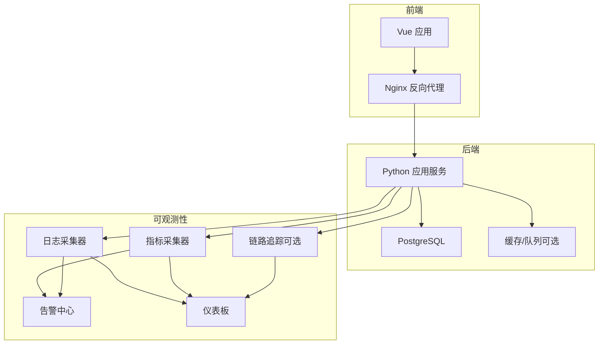
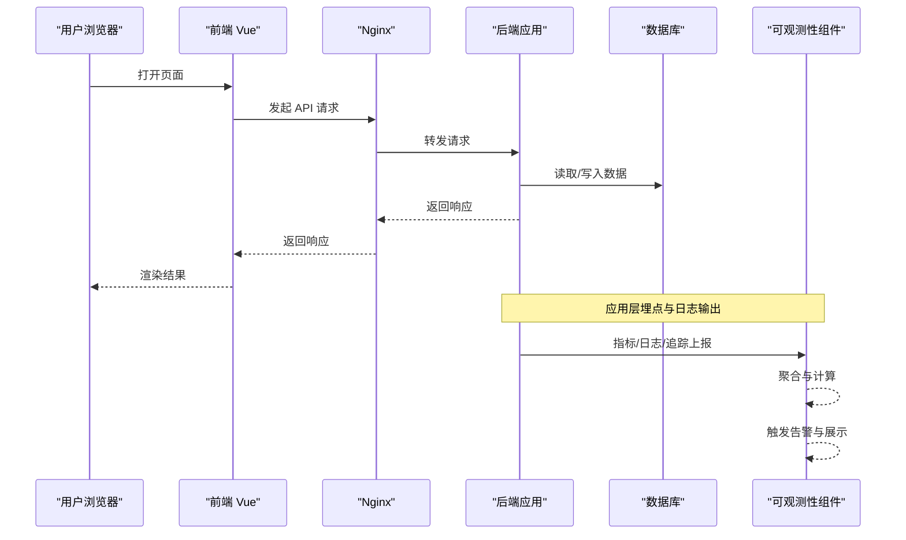
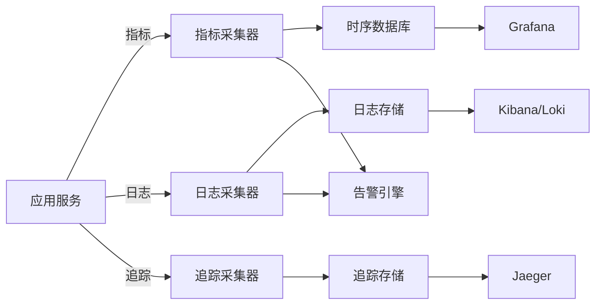

# 监控告警配置

<cite>
**本文引用的文件**   
- [app.py](file://backend/app.py)
- [bootstrap.py](file://backend/bootstrap.py)
- [config_manager.py](file://backend/config_manager.py)
- [system_log_store.py](file://backend/system_log_store.py)
- [report_contract_health.py](file://backend/report_contract_health.py)
- [docker-compose.yml](file://docker-compose.yml)
- [Dockerfile (后端)](file://backend/Dockerfile)
- [nginx.conf](file://frontend/nginx.conf)
- [package.json](file://frontend/package.json)
- [vite.config.js](file://frontend/vite.config.js)
- [SKILL.md（飞书同步运维）](file://.agents/skills/smartask-feishu-sync-ops/SKILL.md)
- [SKILL.md（运行时迁移）](file://.agents/skills/smartask-runtime-migration/SKILL.md)
- [SKILL.md（技能维护）](file://.agents/skills/smartask-skill-maintenance/SKILL.md)
- [SKILL.md（技能使用指南）](file://.agents/skills/smartask-skill-usage-guide/SKILL.md)
- [SKILL.md（全局约束）](file://.agents/skills/smartask-global-constraints/SKILL.md)
- [SKILL.md（排名调试）](file://.agents/skills/smartask-ranking-debug/SKILL.md)
</cite>

## 目录
1. [简介](#简介)
2. [项目结构](#项目结构)
3. [核心组件](#核心组件)
4. [架构总览](#架构总览)
5. [详细组件分析](#详细组件分析)
6. [依赖关系分析](#依赖关系分析)
7. [性能考虑](#性能考虑)
8. [故障诊断指南](#故障诊断指南)
9. [结论](#结论)
10. [附录](#附录)

## 简介
本文件为 SmartAsk 智能问数平台的监控与告警配置指南，覆盖应用性能指标、业务指标、系统资源指标、日志收集与聚合、告警规则、健康检查、故障诊断工具、仪表板与通知模板等。目标是帮助运维与研发快速搭建可观测性体系，保障平台稳定运行与持续优化。

## 项目结构
SmartAsk 采用前后端分离架构：
- 后端：Python 服务，提供 API、数据访问、任务处理与系统集成能力
- 前端：Vue 应用，通过 Nginx 反向代理对外暴露
- 容器化：docker-compose 编排后端、数据库与可选的日志/监控组件
- 文档与脚本：部署、测试、迁移与运维脚本位于根目录与 scripts 目录

图表来源
- [docker-compose.yml](file://docker-compose.yml)
- [Dockerfile (后端)](file://backend/Dockerfile)
- [nginx.conf](file://frontend/nginx.conf)

章节来源
- [docker-compose.yml](file://docker-compose.yml)
- [Dockerfile (后端)](file://backend/Dockerfile)
- [nginx.conf](file://frontend/nginx.conf)

## 核心组件
- 应用入口与启动流程：负责初始化配置、注册路由、加载中间件与扩展
- 配置管理：集中化管理环境变量、密钥与功能开关
- 系统日志存储：结构化日志写入与查询接口
- 健康检查：服务可用性探测与依赖状态上报
- 容器编排：统一拉起服务与依赖，便于在集群中部署

章节来源
- [app.py](file://backend/app.py)
- [bootstrap.py](file://backend/bootstrap.py)
- [config_manager.py](file://backend/config_manager.py)
- [system_log_store.py](file://backend/system_log_store.py)
- [report_contract_health.py](file://backend/report_contract_health.py)

## 架构总览
下图展示请求从前端到后端的完整路径，以及监控与告警的接入点。

图表来源
- [nginx.conf](file://frontend/nginx.conf)
- [app.py](file://backend/app.py)
- [system_log_store.py](file://backend/system_log_store.py)

## 详细组件分析

### 应用性能指标监控（响应时间、吞吐量、错误率）
- 指标定义
  - 响应时间：P50/P90/P99 延迟
  - 吞吐量：QPS、并发连接数
  - 错误率：HTTP 5xx/4xx 比例、异常抛出率
- 采集方式
  - 应用层埋点：在每个控制器/处理器入口与出口记录耗时与状态码
  - 框架中间件：统一拦截请求，统计时延与错误
  - 进程级指标：GC、线程池、内存占用
- 上报与聚合
  - 指标导出到 Prometheus 或兼容系统
  - 日志以结构化 JSON 输出，便于 Logstash/Fluent Bit 采集
- 可视化与告警
  - Grafana 仪表板展示趋势与分布
  - 基于阈值与多窗口滑动窗口触发告警

章节来源
- [app.py](file://backend/app.py)
- [bootstrap.py](file://backend/bootstrap.py)

### 业务指标监控（用户活跃度、查询成功率）
- 指标定义
  - 用户活跃度：日活/周活、会话数、消息数
  - 查询成功率：成功/失败次数、重试率、超时率
  - 数据质量：SQL 生成成功率、执行成功率、结果集大小分布
- 采集方式
  - 业务事件埋点：登录、提问、执行、结果查看
  - 数据库审计：慢查询、锁等待、事务失败
- 上报与聚合
  - 事件流式写入 Kafka/ClickHouse
  - 批处理汇总至 OLAP 用于报表
- 可视化与告警
  - 业务看板：活跃趋势、成功率曲线、Top 失败原因
  - 告警：成功率低于阈值、异常峰值

章节来源
- [system_log_store.py](file://backend/system_log_store.py)

### 系统资源指标监控（CPU、内存、磁盘使用率）
- 指标定义
  - CPU：使用率、负载、上下文切换
  - 内存：RSS、堆使用、GC 暂停
  - 磁盘：IOPS、吞吐、空间使用率
  - 网络：带宽、连接数、丢包率
- 采集方式
  - Node Exporter/系统探针采集主机指标
  - 容器指标：cAdvisor/Kubelet（如使用 K8s）
- 上报与聚合
  - 时序数据库存储（Prometheus/TimescaleDB）
- 可视化与告警
  - 资源水位看板
  - 阈值告警：CPU>80%、内存>85%、磁盘>90%

章节来源
- [docker-compose.yml](file://docker-compose.yml)
- [Dockerfile (后端)](file://backend/Dockerfile)

### 日志收集配置（结构化日志、级别管理、聚合方案）
- 结构化日志格式
  - 字段：timestamp、level、service、trace_id、span_id、method、path、status_code、duration_ms、message、extra
  - 编码：UTF-8，JSON 单行输出
- 日志级别管理
  - DEBUG/INFO/WARN/ERROR/FATAL
  - 按环境区分默认级别，生产默认 INFO
- 聚合方案
  - 采集器：Fluent Bit/Logstash/Filebeat
  - 传输：TCP/UDP/HTTP 推送
  - 存储：Elasticsearch/Loki
  - 查询与分析：Kibana/Loki Explore
- 最佳实践
  - 避免敏感信息入日志
  - 控制日志量，采样高频日志
  - 关联 trace_id 实现跨服务追踪

章节来源
- [system_log_store.py](file://backend/system_log_store.py)

### 告警规则配置（阈值、级别、通知渠道）
- 阈值设置
  - 静态阈值：如错误率>5%、P99>2s
  - 动态阈值：同比/环比、滑动窗口异常检测
- 告警级别定义
  - P0：严重故障，立即响应
  - P1：重要问题，尽快处理
  - P2：一般问题，计划修复
  - P3：提示性信息
- 通知渠道
  - 企业微信/钉钉/飞书机器人
  - 邮件、短信、电话
  - PagerDuty/OpsGenie 集成
- 降噪策略
  - 去重、合并、抑制、静默期
  - 值班轮转与升级策略

章节来源
- [SKILL.md（飞书同步运维）](file://.agents/skills/smartask-feishu-sync-ops/SKILL.md)

### 健康检查机制（可用性、依赖状态、自动恢复）
- 服务可用性检测
  - /healthz 存活探针：进程是否存活
  - /readyz 就绪探针：依赖是否就绪
- 依赖服务状态监控
  - 数据库连通性与慢查询
  - 外部 API 可达性与延迟
  - 缓存命中率与连接池状态
- 自动恢复策略
  - 重启策略：最大重试次数、退避策略
  - 熔断与降级：失败率阈值触发
  - 限流与背压：保护下游

章节来源
- [report_contract_health.py](file://backend/report_contract_health.py)

### 故障诊断工具（链路追踪、性能分析、错误堆栈）
- 链路追踪
  - 注入 trace_id/span_id，贯穿请求全链路
  - 采集各阶段耗时与调用拓扑
- 性能分析
  - CPU Profile、内存 Profile、阻塞分析
  - 热点 SQL 与索引建议
- 错误堆栈分析
  - 统一异常捕获与上报
  - 堆栈快照与上下文变量
- 工具链
  - Jaeger/Zipkin 追踪
  - Py-Spy/py-slowdown 性能剖析
  - Sentry/自研错误平台

章节来源
- [system_log_store.py](file://backend/system_log_store.py)

### 监控仪表板配置与告警通知模板定制
- 仪表板
  - 概览：健康度、错误率、延迟、吞吐
  - 业务：活跃、成功率、Top 失败原因
  - 资源：CPU/内存/磁盘/网络
  - 追踪：调用拓扑、热点链路
- 通知模板
  - 标题、级别、摘要、详情链接、处置建议
  - 多通道适配（企微/钉钉/飞书/邮件）

章节来源
- [SKILL.md（飞书同步运维）](file://.agents/skills/smartask-feishu-sync-ops/SKILL.md)

## 依赖关系分析
SmartAsk 的可观测性依赖如下：
- 应用层：埋点与日志输出
- 采集层：指标与日志采集器
- 存储层：时序数据库与日志存储
- 展示层：Grafana/Kibana/Loki
- 告警层：Alertmanager/自研告警引擎

图表来源
- [docker-compose.yml](file://docker-compose.yml)
- [Dockerfile (后端)](file://backend/Dockerfile)

章节来源
- [docker-compose.yml](file://docker-compose.yml)

## 性能考虑
- 指标采样：对高频指标进行采样，降低存储压力
- 日志采样：对 DEBUG 日志采样，避免 I/O 瓶颈
- 异步上报：指标与日志异步写入，减少主链路影响
- 批量写入：聚合后批量提交，提升吞吐
- 资源隔离：监控组件独立部署，避免争抢资源

## 故障诊断指南
- 快速定位
  - 通过 trace_id 检索全链路日志与指标
  - 查看错误堆栈与上下文变量
- 性能瓶颈
  - 热点方法/SQL 定位
  - GC 停顿与内存泄漏排查
- 依赖故障
  - 数据库慢查询与锁等待
  - 外部 API 超时与重试风暴
- 恢复策略
  - 临时扩容与限流
  - 降级与熔断
  - 回滚与热修复

章节来源
- [system_log_store.py](file://backend/system_log_store.py)
- [report_contract_health.py](file://backend/report_contract_health.py)

## 结论
通过统一的指标、日志与追踪体系，结合合理的告警与仪表板，SmartAsk 可实现端到端可观测性。建议在上线前完成基线数据采集与告警阈值校准，持续迭代优化，确保稳定性与用户体验。

## 附录
- 部署参考
  - docker-compose 编排示例
  - Nginx 反向代理与 HTTPS
  - 环境变量与密钥管理
- 运维脚本
  - 备份与恢复
  - 健康检查与自愈
  - 日志清理与归档

章节来源
- [docker-compose.yml](file://docker-compose.yml)
- [nginx.conf](file://frontend/nginx.conf)
- [package.json](file://frontend/package.json)
- [vite.config.js](file://frontend/vite.config.js)
- [SKILL.md（运行时迁移）](file://.agents/skills/smartask-runtime-migration/SKILL.md)
- [SKILL.md（技能维护）](file://.agents/skills/smartask-skill-maintenance/SKILL.md)
- [SKILL.md（技能使用指南）](file://.agents/skills/smartask-skill-usage-guide/SKILL.md)
- [SKILL.md（全局约束）](file://.agents/skills/smartask-global-constraints/SKILL.md)
- [SKILL.md（排名调试）](file://.agents/skills/smartask-ranking-debug/SKILL.md)