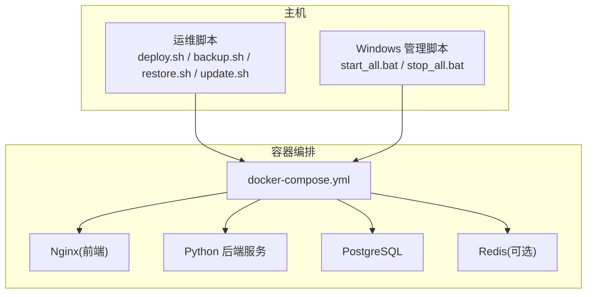
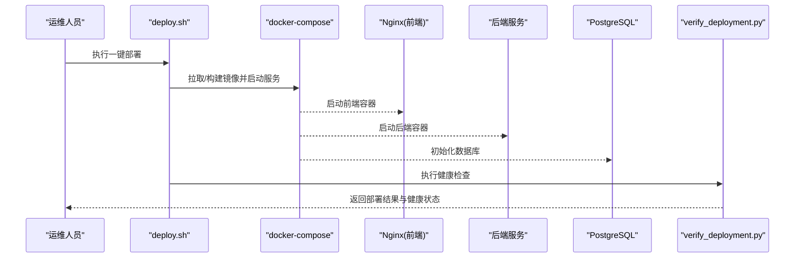
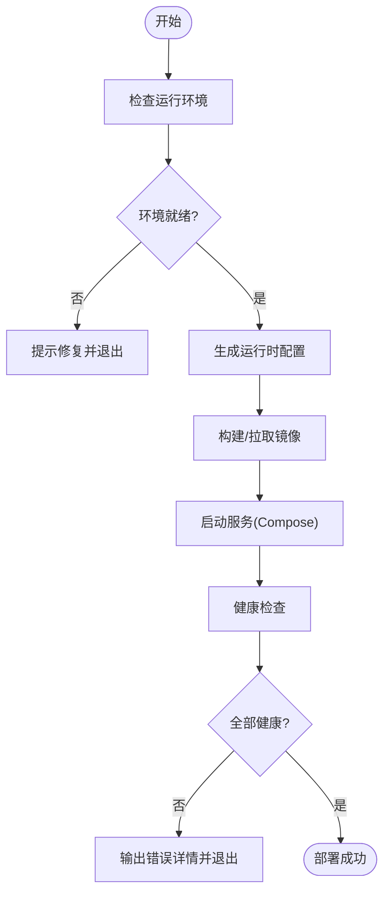
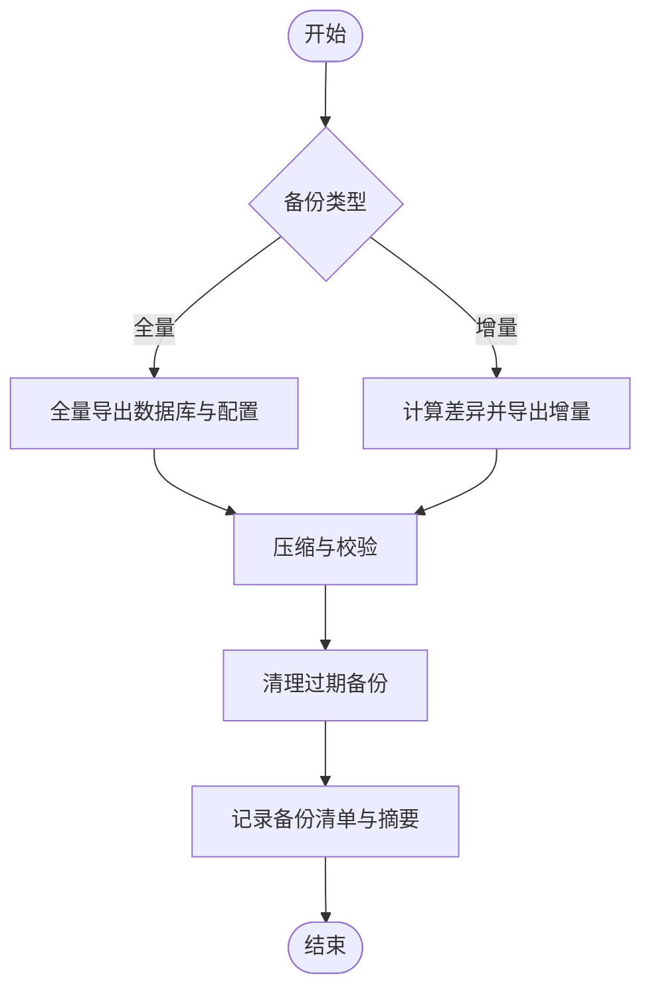
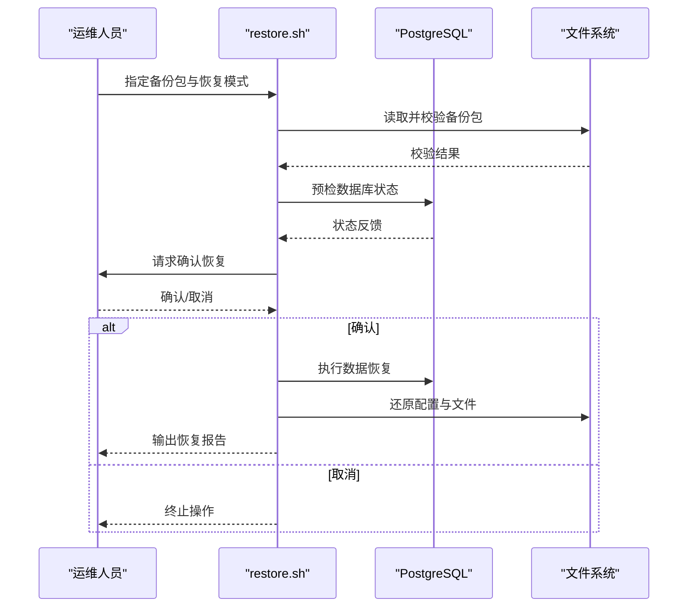
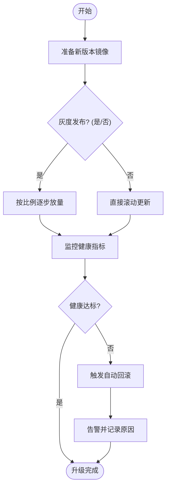
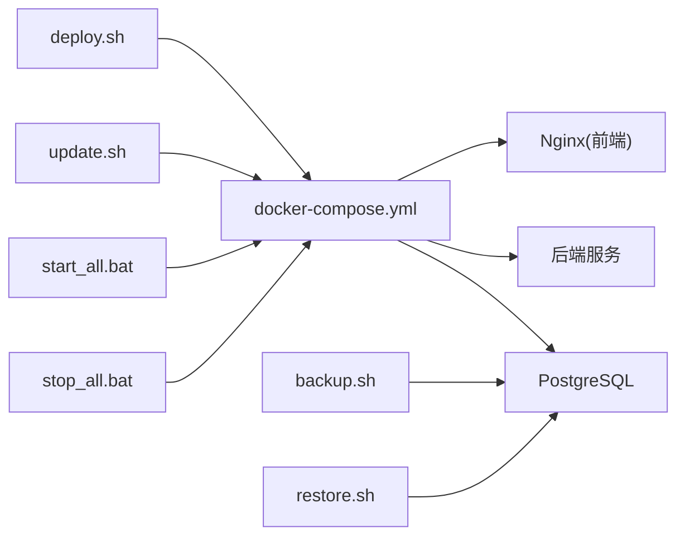

# 部署脚本使用指南

<cite>
**本文引用的文件**   
- [deploy.sh](file://deploy.sh)
- [backup.sh](file://backup.sh)
- [restore.sh](file://restore.sh)
- [update.sh](file://update.sh)
- [start_all.bat](file://start_all.bat)
- [stop_all.bat](file://stop_all.bat)
- [docker-compose.yml](file://docker-compose.yml)
- [scripts/backup_all.py](file://scripts/backup_all.py)
- [scripts/verify_deployment.py](file://scripts/verify_deployment.py)
- [backend/app.py](file://backend/app.py)
- [frontend/nginx.conf](file://frontend/nginx.conf)
</cite>

## 目录
1. [简介](#简介)
2. [项目结构](#项目结构)
3. [核心组件](#核心组件)
4. [架构总览](#架构总览)
5. [详细组件分析](#详细组件分析)
6. [依赖关系分析](#依赖关系分析)
7. [性能注意事项](#性能注意事项)
8. [故障排查指南](#故障排查指南)
9. [结论](#结论)
10. [附录](#附录)

## 简介
本指南面向 SmartAsk 智能问数平台的运维与交付人员，聚焦于部署、备份、恢复与升级等关键操作。文档围绕以下脚本展开：
- deploy.sh：一键部署脚本，涵盖环境准备、镜像构建、服务启动与基础验证
- backup.sh：数据备份脚本，支持全量与增量备份策略及定时任务配置
- restore.sh：数据恢复脚本，提供数据校验与恢复确认流程
- update.sh：版本升级脚本，支持灰度发布与回滚策略
- start_all.bat / stop_all.bat：Windows 环境下的启停管理脚本

同时，文档给出权限配置、日志位置、错误处理机制以及常见问题排查方法，帮助读者快速、安全地完成生产环境的部署与运维。

## 项目结构
SmartAsk 采用前后端分离与容器化部署模式：
- 后端服务基于 Python（FastAPI/Flask 风格），由 docker-compose 编排
- 前端静态资源通过 Nginx 提供服务
- 数据库与缓存等中间件通过容器统一编排
- 部署与运维脚本集中在仓库根目录与 scripts 子目录

图表来源
- [docker-compose.yml](file://docker-compose.yml)
- [frontend/nginx.conf](file://frontend/nginx.conf)
- [backend/app.py](file://backend/app.py)

章节来源
- [docker-compose.yml](file://docker-compose.yml)
- [frontend/nginx.conf](file://frontend/nginx.conf)
- [backend/app.py](file://backend/app.py)

## 核心组件
- 部署脚本（deploy.sh）
  - 作用：检查运行环境、拉取或构建镜像、生成配置文件、启动容器、执行健康检查
  - 关键参数：目标环境（开发/测试/生产）、是否跳过构建、是否启用调试、端口映射、外部依赖地址
  - 输出：控制台日志、部署结果、健康检查报告
- 备份脚本（backup.sh）
  - 作用：对数据库与关键配置进行全量/增量备份，归档并保留历史版本
  - 关键参数：备份类型（全量/增量）、保留天数、存储路径、压缩选项
  - 输出：备份包、校验摘要、备份清单
- 恢复脚本（restore.sh）
  - 作用：从备份包恢复数据，执行一致性校验，提供恢复确认与回退方案
  - 关键参数：备份包路径、恢复模式（覆盖/合并）、确认开关、预检开关
  - 输出：恢复日志、校验报告、状态码
- 升级脚本（update.sh）
  - 作用：执行版本升级，支持灰度发布与自动回滚
  - 关键参数：新版本号、灰度比例、回滚阈值、滚动更新策略
  - 输出：升级进度、健康检查结果、回滚记录
- Windows 管理脚本（start_all.bat / stop_all.bat）
  - 作用：在 Windows 环境下批量启停各服务进程
  - 关键参数：服务名、端口、工作目录、日志路径
  - 输出：进程状态、端口占用信息、错误日志

章节来源
- [deploy.sh](file://deploy.sh)
- [backup.sh](file://backup.sh)
- [restore.sh](file://restore.sh)
- [update.sh](file://update.sh)
- [start_all.bat](file://start_all.bat)
- [stop_all.bat](file://stop_all.bat)

## 架构总览
SmartAsk 的部署与运维流程以 docker-compose 为核心，配合脚本完成环境准备、服务编排与生命周期管理。

图表来源
- [deploy.sh](file://deploy.sh)
- [docker-compose.yml](file://docker-compose.yml)
- [scripts/verify_deployment.py](file://scripts/verify_deployment.py)
- [frontend/nginx.conf](file://frontend/nginx.conf)
- [backend/app.py](file://backend/app.py)

## 详细组件分析

### 部署脚本（deploy.sh）
- 功能要点
  - 环境检查：操作系统、Docker、网络连通性、端口占用
  - 配置生成：根据环境变量生成运行时配置
  - 镜像管理：按需拉取或本地构建镜像
  - 服务编排：通过 docker-compose 启动前后端与依赖服务
  - 健康检查：调用 verify_deployment.py 验证服务可用性
- 使用方法
  - 基本用法：直接执行脚本，按提示输入目标环境与参数
  - 参数说明：常见参数包括 --env、--skip-build、--debug、--port、--db-url 等
  - 失败处理：遇到错误会打印详细日志并退出，建议查看日志定位问题
- 日志与排错
  - 日志位置：/var/log/smartask/deploy.log（默认）
  - 常见错误：端口冲突、镜像拉取失败、数据库连接异常
  - 解决建议：释放端口、检查网络代理、核对数据库连接串

图表来源
- [deploy.sh](file://deploy.sh)
- [scripts/verify_deployment.py](file://scripts/verify_deployment.py)

章节来源
- [deploy.sh](file://deploy.sh)
- [scripts/verify_deployment.py](file://scripts/verify_deployment.py)

### 备份脚本（backup.sh）
- 功能要点
  - 全量备份：导出数据库与关键配置为压缩包
  - 增量备份：仅备份变更的数据与配置差异
  - 保留策略：按天数清理旧备份，避免磁盘占满
  - 定时任务：支持 crontab 或系统计划任务集成
- 使用方法
  - 全量备份：指定备份类型为 full，设置存储路径与保留天数
  - 增量备份：指定上次备份点，仅备份增量内容
  - 定时任务：将命令写入 crontab，例如每日凌晨执行
- 日志与排错
  - 日志位置：/var/log/smartask/backup.log（默认）
  - 常见错误：磁盘空间不足、权限不足、数据库锁表
  - 解决建议：扩容磁盘、调整权限、选择低峰期执行

图表来源
- [backup.sh](file://backup.sh)
- [scripts/backup_all.py](file://scripts/backup_all.py)

章节来源
- [backup.sh](file://backup.sh)
- [scripts/backup_all.py](file://scripts/backup_all.py)

### 恢复脚本（restore.sh）
- 功能要点
  - 数据校验：校验备份包完整性与一致性
  - 恢复模式：支持覆盖恢复与合并恢复
  - 确认流程：二次确认防止误操作
  - 回退方案：恢复失败时自动回退到上一版本
- 使用方法
  - 指定备份包路径与恢复模式
  - 开启预检模式进行风险评估
  - 确认后执行恢复并观察日志
- 日志与排错
  - 日志位置：/var/log/smartask/restore.log（默认）
  - 常见错误：备份包损坏、版本不兼容、权限不足
  - 解决建议：重新下载备份、核对版本、提升权限

图表来源
- [restore.sh](file://restore.sh)

章节来源
- [restore.sh](file://restore.sh)

### 升级脚本（update.sh）
- 功能要点
  - 版本切换：平滑切换到新版本镜像
  - 灰度发布：按比例逐步放量，监控健康指标
  - 自动回滚：当错误率超过阈值时自动回滚
  - 滚动更新：逐个实例更新，保证服务可用
- 使用方法
  - 指定新版本号与灰度比例
  - 设置回滚阈值与监控周期
  - 观察升级进度与健康检查报告
- 日志与排错
  - 日志位置：/var/log/smartask/update.log（默认）
  - 常见错误：新镜像不可用、健康检查失败、依赖服务异常
  - 解决建议：检查镜像仓库、核对依赖、降低灰度比例

图表来源
- [update.sh](file://update.sh)

章节来源
- [update.sh](file://update.sh)

### Windows 管理脚本（start_all.bat / stop_all.bat）
- 功能要点
  - 批量启停：一次性启动或停止所有相关服务进程
  - 端口管理：检测端口占用并提示冲突
  - 日志输出：将进程日志重定向到指定目录
- 使用方法
  - 以管理员身份运行脚本
  - 根据需要传入服务名或端口参数
  - 查看控制台输出确认状态
- 日志与排错
  - 日志位置：当前目录 logs 子文件夹
  - 常见错误：权限不足、端口被占用、路径不存在
  - 解决建议：提升权限、释放端口、创建必要目录

章节来源
- [start_all.bat](file://start_all.bat)
- [stop_all.bat](file://stop_all.bat)

## 依赖关系分析
SmartAsk 的部署与运维脚本依赖于以下核心组件：
- docker-compose：服务编排与生命周期管理
- PostgreSQL：数据存储
- Nginx：前端静态资源服务
- Python 后端服务：业务逻辑与 API 接口
- 验证脚本：部署后健康检查与状态上报

图表来源
- [deploy.sh](file://deploy.sh)
- [backup.sh](file://backup.sh)
- [restore.sh](file://restore.sh)
- [update.sh](file://update.sh)
- [start_all.bat](file://start_all.bat)
- [stop_all.bat](file://stop_all.bat)
- [docker-compose.yml](file://docker-compose.yml)
- [frontend/nginx.conf](file://frontend/nginx.conf)
- [backend/app.py](file://backend/app.py)

章节来源
- [docker-compose.yml](file://docker-compose.yml)
- [frontend/nginx.conf](file://frontend/nginx.conf)
- [backend/app.py](file://backend/app.py)

## 性能注意事项
- 备份与恢复
  - 建议在低峰期执行，避免影响在线查询
  - 合理设置压缩级别与并发度，平衡 CPU 与 I/O
- 部署与升级
  - 使用镜像缓存减少构建时间
  - 灰度发布时逐步放量，观察关键指标
- 资源规划
  - 为数据库预留足够内存与磁盘空间
  - 为 Nginx 与后端服务分配合理的 CPU 配额

[本节为通用指导，无需特定文件引用]

## 故障排查指南
- 部署失败
  - 检查端口占用与防火墙规则
  - 查看 Docker 镜像拉取日志与网络代理设置
  - 核对数据库连接串与权限
- 备份异常
  - 确认磁盘空间与备份目录权限
  - 检查数据库锁表与事务状态
  - 查看备份日志中的错误码与堆栈
- 恢复失败
  - 校验备份包完整性与版本兼容性
  - 确认恢复模式是否符合预期
  - 查看恢复日志中的阶段与失败点
- 升级回滚
  - 检查健康检查阈值与监控指标
  - 确认新镜像可访问且依赖服务正常
  - 查看升级日志中的回滚触发条件

章节来源
- [scripts/verify_deployment.py](file://scripts/verify_deployment.py)
- [scripts/backup_all.py](file://scripts/backup_all.py)

## 结论
通过本指南，您可以掌握 SmartAsk 智能问数平台的核心部署与运维脚本使用方法。建议在生产环境中严格遵循权限配置、日志管理与错误处理规范，结合健康检查与监控体系，确保系统稳定可靠地运行。

[本节为总结性内容，无需特定文件引用]

## 附录
- 常用命令速查
  - 一键部署：./deploy.sh --env production
  - 全量备份：./backup.sh --type full --retention 30
  - 增量备份：./backup.sh --type incremental --since <last_backup>
  - 数据恢复：./restore.sh --backup <path> --mode overwrite --confirm
  - 版本升级：./update.sh --version v1.2.3 --canary 0.2 --rollback-threshold 0.05
  - Windows 启停：start_all.bat / stop_all.bat
- 日志位置
  - 部署日志：/var/log/smartask/deploy.log
  - 备份日志：/var/log/smartask/backup.log
  - 恢复日志：/var/log/smartask/restore.log
  - 升级日志：/var/log/smartask/update.log
- 权限要求
  - Linux：root 或具备 sudo 权限
  - Windows：管理员权限
  - Docker：加入 docker 用户组或使用 sudo

[本节为补充信息，无需特定文件引用]