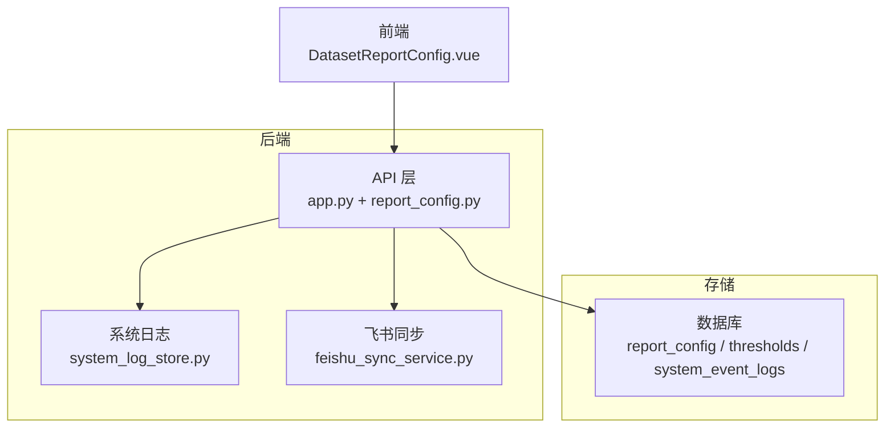
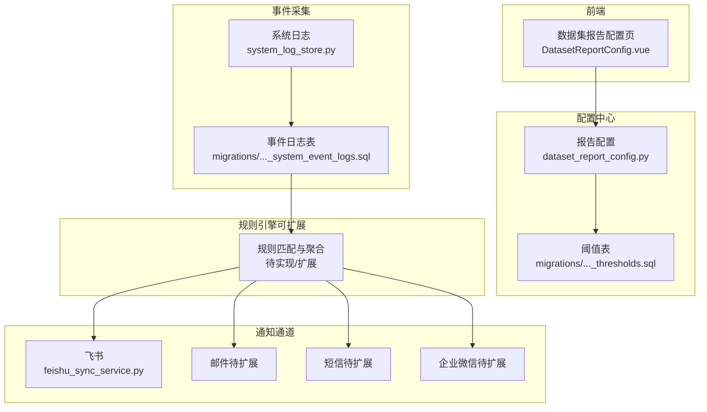
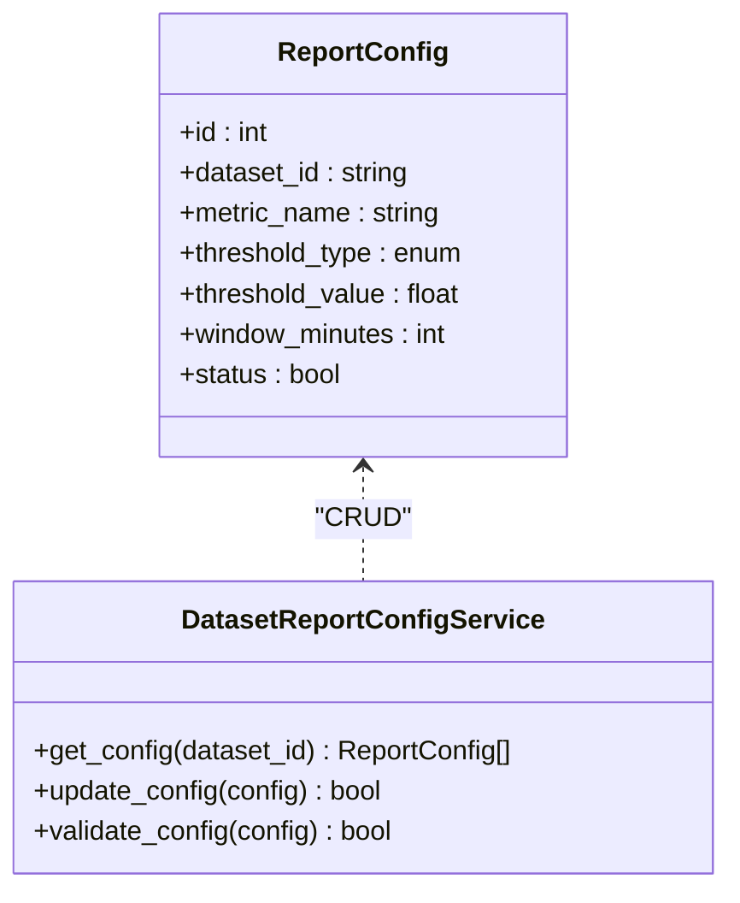
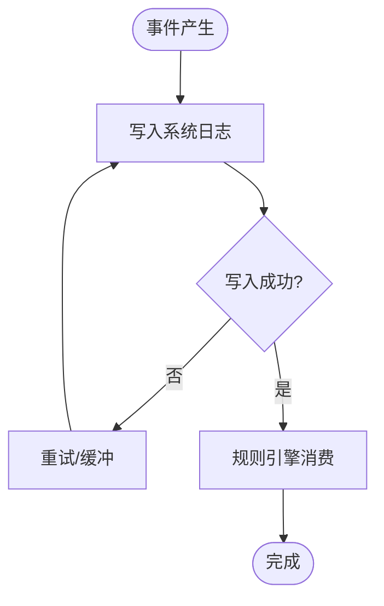
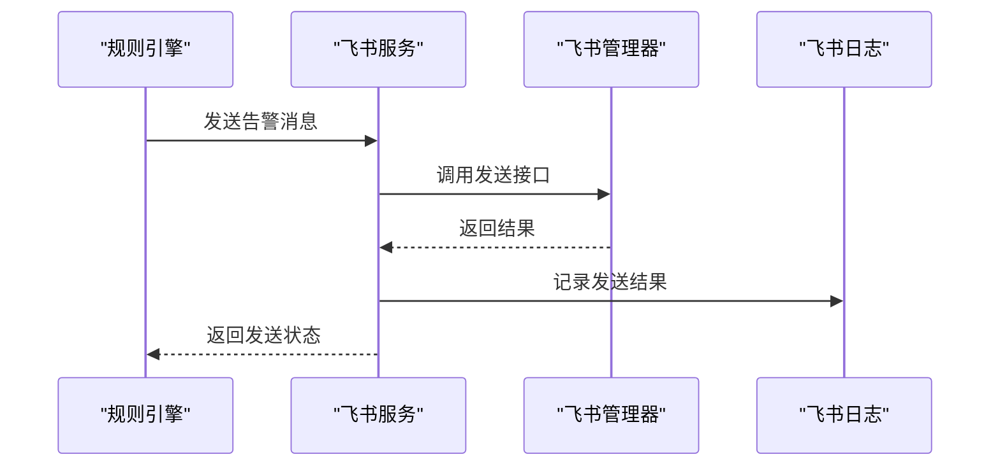
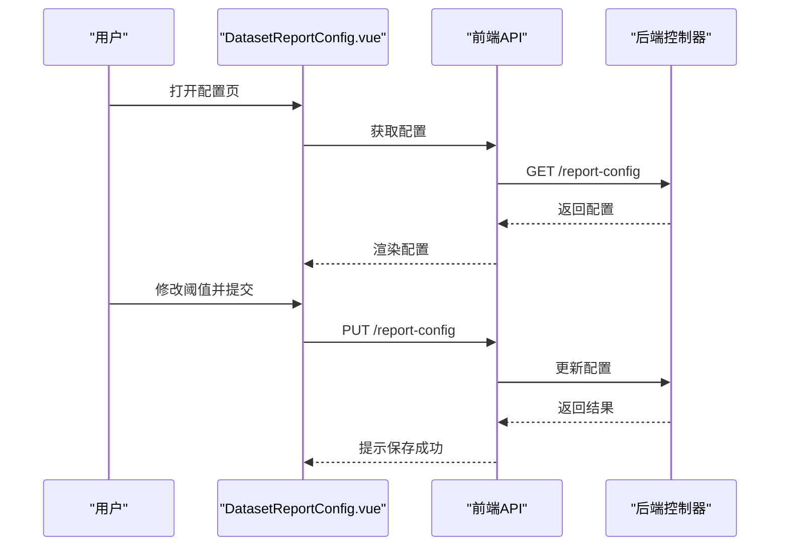
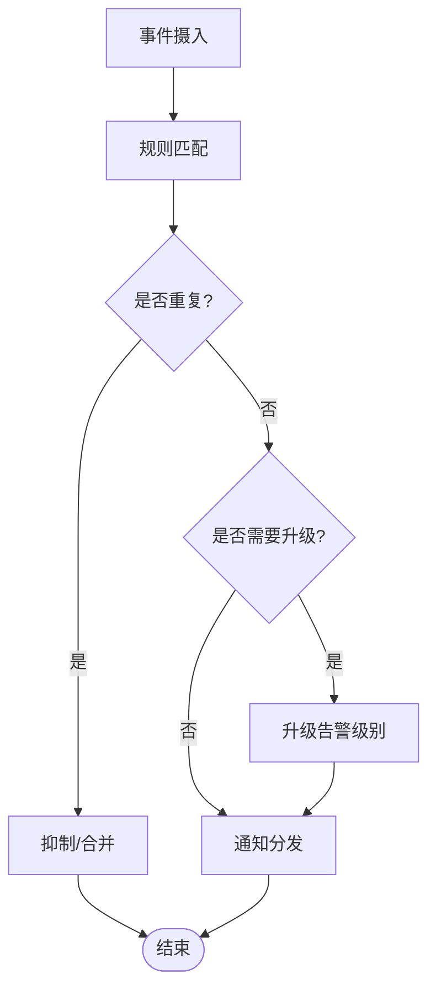
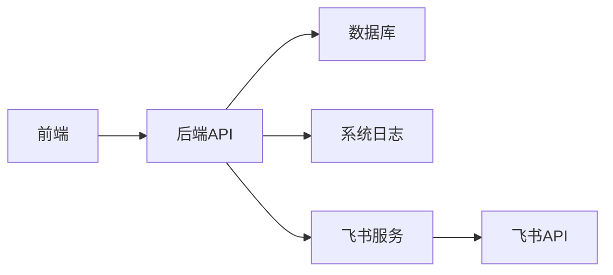

# 告警系统

<cite>
**本文引用的文件**   
- [backend/app.py](file://backend/app.py)
- [backend/controllers/report_config.py](file://backend/controllers/report_config.py)
- [backend/dataset_report_config.py](file://backend/dataset_report_config.py)
- [backend/migrations/20260509_report_thresholds.sql](file://backend/migrations/20260509_report_thresholds.sql)
- [docker/postgres/init/004_report_config.sql](file://docker/postgres/init/004_report_config.sql)
- [docker/postgres/init/005_report_thresholds.sql](file://docker/postgres/init/005_report_thresholds.sql)
- [backend/system_log_store.py](file://backend/system_log_store.py)
- [backend/migrations/20260512_system_event_logs.sql](file://backend/migrations/20260512_system_event_logs.sql)
- [frontend/src/views/DatasetReportConfig.vue](file://frontend/src/views/DatasetReportConfig.vue)
- [frontend/src/api/index.js](file://frontend/src/api/index.js)
- [backend/feishu_sync_service.py](file://backend/feishu_sync_service.py)
- [backend/feishu_sync_manager.py](file://backend/feishu_sync_manager.py)
- [backend/feishu_sync_logger.py](file://backend/feishu_sync_logger.py)
- [backend/ask_flow/controller.py](file://backend/ask_flow/controller.py)
- [backend/smartask_advanced/service.py](file://backend/smartask_advanced/service.py)
</cite>

## 目录
1. [简介](#简介)
2. [项目结构](#项目结构)
3. [核心组件](#核心组件)
4. [架构总览](#架构总览)
5. [详细组件分析](#详细组件分析)
6. [依赖关系分析](#依赖关系分析)
7. [性能考量](#性能考量)
8. [故障排查指南](#故障排查指南)
9. [结论](#结论)
10. [附录](#附录)

## 简介
本文件为 SmartAsk 智能问数平台的“告警系统”技术文档，面向运维与产品使用者，覆盖以下目标：
- 告警规则配置：阈值设置、条件判断、告警级别定义
- 通知机制：邮件、短信、企业微信、飞书等渠道的配置与使用
- 升级策略：静默期、重复告警抑制、自动升级
- 关联分析：根因定位、影响范围评估、故障传播链分析
- 响应流程：自动化脚本、工单系统集成、运维操作指引
- 效果评估与优化建议

说明：当前仓库未包含独立的告警引擎实现，但存在报告阈值配置、系统事件日志、以及飞书同步能力。本文基于现有代码与数据库迁移脚本，给出可落地的告警体系设计与集成方案，并明确哪些能力已具备、哪些需要扩展。

## 项目结构
与告警相关的关键位置如下：
- 后端服务入口与控制器：用于暴露配置接口与触发逻辑
- 数据集报告配置：提供阈值与规则配置的持久化模型与迁移脚本
- 系统事件日志：记录平台运行事件，可作为告警数据源
- 前端页面：数据集报告配置界面，便于用户维护阈值与规则
- 飞书同步：提供与企业协作工具集成的基础能力

图表来源
- [backend/app.py](file://backend/app.py)
- [backend/controllers/report_config.py](file://backend/controllers/report_config.py)
- [backend/dataset_report_config.py](file://backend/dataset_report_config.py)
- [backend/system_log_store.py](file://backend/system_log_store.py)
- [backend/feishu_sync_service.py](file://backend/feishu_sync_service.py)

章节来源
- [backend/app.py](file://backend/app.py)
- [backend/controllers/report_config.py](file://backend/controllers/report_config.py)
- [backend/dataset_report_config.py](file://backend/dataset_report_config.py)
- [backend/system_log_store.py](file://backend/system_log_store.py)
- [backend/feishu_sync_service.py](file://backend/feishu_sync_service.py)

## 核心组件
- 报告与阈值配置
  - 通过迁移脚本与后端模块定义报告配置与阈值表结构，支撑阈值与规则的持久化
  - 关键文件：
    - [backend/migrations/20260509_report_thresholds.sql](file://backend/migrations/20260509_report_thresholds.sql)
    - [docker/postgres/init/004_report_config.sql](file://docker/postgres/init/004_report_config.sql)
    - [docker/postgres/init/005_report_thresholds.sql](file://docker/postgres/init/005_report_thresholds.sql)
    - [backend/dataset_report_config.py](file://backend/dataset_report_config.py)
- 系统事件日志
  - 提供系统级事件记录能力，可作为告警事件的输入或审计依据
  - 关键文件：
    - [backend/migrations/20260512_system_event_logs.sql](file://backend/migrations/20260512_system_event_logs.sql)
    - [backend/system_log_store.py](file://backend/system_log_store.py)
- 飞书同步能力
  - 提供与飞书的数据同步与消息能力，可作为告警通知的渠道之一
  - 关键文件：
    - [backend/feishu_sync_service.py](file://backend/feishu_sync_service.py)
    - [backend/feishu_sync_manager.py](file://backend/feishu_sync_manager.py)
    - [backend/feishu_sync_logger.py](file://backend/feishu_sync_logger.py)
- 前端配置界面
  - 提供数据集报告配置的前端页面，便于维护阈值与规则
  - 关键文件：
    - [frontend/src/views/DatasetReportConfig.vue](file://frontend/src/views/DatasetReportConfig.vue)
    - [frontend/src/api/index.js](file://frontend/src/api/index.js)

章节来源
- [backend/migrations/20260509_report_thresholds.sql](file://backend/migrations/20260509_report_thresholds.sql)
- [docker/postgres/init/004_report_config.sql](file://docker/postgres/init/004_report_config.sql)
- [docker/postgres/init/005_report_thresholds.sql](file://docker/postgres/init/005_report_thresholds.sql)
- [backend/dataset_report_config.py](file://backend/dataset_report_config.py)
- [backend/migrations/20260512_system_event_logs.sql](file://backend/migrations/20260512_system_event_logs.sql)
- [backend/system_log_store.py](file://backend/system_log_store.py)
- [backend/feishu_sync_service.py](file://backend/feishu_sync_service.py)
- [backend/feishu_sync_manager.py](file://backend/feishu_sync_manager.py)
- [backend/feishu_sync_logger.py](file://backend/feishu_sync_logger.py)
- [frontend/src/views/DatasetReportConfig.vue](file://frontend/src/views/DatasetReportConfig.vue)
- [frontend/src/api/index.js](file://frontend/src/api/index.js)

## 架构总览
告警系统的整体架构由“配置中心 + 事件采集 + 规则引擎（可扩展） + 通知通道 + 审计与追踪”构成。当前仓库提供了配置与事件的基础设施，告警规则引擎与多渠道通知可按需扩展。

图表来源
- [backend/dataset_report_config.py](file://backend/dataset_report_config.py)
- [backend/migrations/20260509_report_thresholds.sql](file://backend/migrations/20260509_report_thresholds.sql)
- [backend/system_log_store.py](file://backend/system_log_store.py)
- [backend/migrations/20260512_system_event_logs.sql](file://backend/migrations/20260512_system_event_logs.sql)
- [backend/feishu_sync_service.py](file://backend/feishu_sync_service.py)
- [frontend/src/views/DatasetReportConfig.vue](file://frontend/src/views/DatasetReportConfig.vue)

## 详细组件分析

### 报告与阈值配置组件
- 职责
  - 管理数据集的报告配置与阈值规则，支持按数据集维度配置指标阈值与判定条件
  - 提供前后端接口以读取/更新配置
- 数据结构与复杂度
  - 阈值表通常包含：数据集标识、指标名称、阈值类型（如大于/小于）、阈值数值、生效时间窗口、状态等字段
  - 查询复杂度取决于索引设计；建议在数据集ID、指标名、时间戳上建立索引以提升查询效率
- 依赖关系
  - 前端通过 API 调用读写配置
  - 后端通过 ORM/SQL 访问数据库
- 错误处理
  - 参数校验失败返回错误码
  - 数据库异常进行重试与降级
- 优化机会
  - 对高频查询路径增加缓存（如 Redis）
  - 批量更新时采用事务与分批提交

图表来源
- [backend/dataset_report_config.py](file://backend/dataset_report_config.py)
- [backend/migrations/20260509_report_thresholds.sql](file://backend/migrations/20260509_report_thresholds.sql)
- [docker/postgres/init/005_report_thresholds.sql](file://docker/postgres/init/005_report_thresholds.sql)

章节来源
- [backend/dataset_report_config.py](file://backend/dataset_report_config.py)
- [backend/migrations/20260509_report_thresholds.sql](file://backend/migrations/20260509_report_thresholds.sql)
- [docker/postgres/init/005_report_thresholds.sql](file://docker/postgres/init/005_report_thresholds.sql)

### 系统事件日志组件
- 职责
  - 记录系统运行事件，包括请求、任务执行、异常等，作为告警事件源
- 数据结构与复杂度
  - 事件表通常包含：事件类型、时间戳、来源模块、上下文信息、级别、状态等
  - 写入路径应保证高吞吐，建议异步写入与分区表
- 依赖关系
  - 各模块通过统一日志接口写入
  - 告警规则引擎消费事件流进行匹配
- 错误处理
  - 写入失败进行重试与落盘缓冲
  - 监控写入延迟与堆积量

图表来源
- [backend/system_log_store.py](file://backend/system_log_store.py)
- [backend/migrations/20260512_system_event_logs.sql](file://backend/migrations/20260512_system_event_logs.sql)

章节来源
- [backend/system_log_store.py](file://backend/system_log_store.py)
- [backend/migrations/20260512_system_event_logs.sql](file://backend/migrations/20260512_system_event_logs.sql)

### 飞书通知组件
- 职责
  - 提供与飞书的同步与消息发送能力，可作为告警通知渠道之一
- 集成点
  - 通过服务层封装飞书 API 调用
  - 结合管理器进行任务调度与状态跟踪
- 错误处理
  - 网络异常与鉴权失败的退避重试
  - 失败事件记录到日志以便排查

图表来源
- [backend/feishu_sync_service.py](file://backend/feishu_sync_service.py)
- [backend/feishu_sync_manager.py](file://backend/feishu_sync_manager.py)
- [backend/feishu_sync_logger.py](file://backend/feishu_sync_logger.py)

章节来源
- [backend/feishu_sync_service.py](file://backend/feishu_sync_service.py)
- [backend/feishu_sync_manager.py](file://backend/feishu_sync_manager.py)
- [backend/feishu_sync_logger.py](file://backend/feishu_sync_logger.py)

### 前端配置界面
- 职责
  - 提供数据集报告配置界面，支持阈值与规则的增删改查
- 交互流程
  - 页面加载时拉取配置
  - 用户修改后提交至后端 API
- 错误处理
  - 表单校验失败提示用户
  - 网络异常提示重试

图表来源
- [frontend/src/views/DatasetReportConfig.vue](file://frontend/src/views/DatasetReportConfig.vue)
- [frontend/src/api/index.js](file://frontend/src/api/index.js)
- [backend/controllers/report_config.py](file://backend/controllers/report_config.py)

章节来源
- [frontend/src/views/DatasetReportConfig.vue](file://frontend/src/views/DatasetReportConfig.vue)
- [frontend/src/api/index.js](file://frontend/src/api/index.js)
- [backend/controllers/report_config.py](file://backend/controllers/report_config.py)

### 告警规则引擎（扩展点）
- 职责
  - 消费系统事件日志，匹配阈值与条件，生成告警事件
  - 支持去重、静默期、升级策略
- 设计要点
  - 事件流接入：从系统日志表或消息队列消费
  - 规则匹配：基于数据集、指标、时间窗口的条件判断
  - 聚合与抑制：相同事件在静默期内合并
  - 升级策略：按级别与持续时间自动升级
- 输出
  - 告警事件写入告警表，并触发通知通道

[本节为概念性设计，不直接映射具体源码]

## 依赖关系分析
- 组件耦合
  - 前端与后端通过 REST API 解耦
  - 后端与数据库通过 ORM/SQL 解耦
  - 通知通道通过服务层抽象，便于替换与扩展
- 外部依赖
  - 飞书 API 作为通知渠道之一
  - 数据库（PostgreSQL）作为配置与事件存储
- 潜在循环依赖
  - 避免服务层直接依赖通知通道实现细节，使用接口抽象

图表来源
- [backend/app.py](file://backend/app.py)
- [backend/controllers/report_config.py](file://backend/controllers/report_config.py)
- [backend/system_log_store.py](file://backend/system_log_store.py)
- [backend/feishu_sync_service.py](file://backend/feishu_sync_service.py)

章节来源
- [backend/app.py](file://backend/app.py)
- [backend/controllers/report_config.py](file://backend/controllers/report_config.py)
- [backend/system_log_store.py](file://backend/system_log_store.py)
- [backend/feishu_sync_service.py](file://backend/feishu_sync_service.py)

## 性能考量
- 事件写入
  - 使用异步写入与批处理，降低主链路延迟
  - 对事件表按时间分区，提升查询与归档效率
- 规则匹配
  - 对高频条件建立索引，减少全表扫描
  - 引入内存缓存热点规则，降低数据库压力
- 通知发送
  - 对第三方 API 调用进行限流与退避
  - 失败重试与死信队列保障可靠性

[本节为通用性能建议，不直接映射具体源码]

## 故障排查指南
- 常见问题
  - 配置未生效：检查前端提交与后端更新接口返回值
  - 事件未消费：查看系统日志写入是否成功，规则引擎是否启动
  - 通知失败：检查飞书服务日志与 API 鉴权配置
- 排查步骤
  - 确认数据库表结构与索引
  - 检查服务健康与依赖连接
  - 查看系统日志与告警事件记录
- 恢复措施
  - 重启规则引擎与通知服务
  - 清理堆积事件并重放
  - 回滚异常配置

章节来源
- [backend/system_log_store.py](file://backend/system_log_store.py)
- [backend/feishu_sync_logger.py](file://backend/feishu_sync_logger.py)

## 结论
当前仓库提供了告警系统所需的基础设施：报告与阈值配置、系统事件日志、以及飞书通知能力。建议在此基础上扩展规则引擎与多渠道通知，形成完整的告警闭环。通过合理的配置、严格的规则与可靠的通道，可有效提升平台稳定性与运维效率。

## 附录
- 告警规则配置建议
  - 阈值类型：大于、小于、等于、区间
  - 条件判断：按数据集、指标、时间窗口组合
  - 告警级别：提示、警告、严重、致命
- 通知渠道配置
  - 飞书：配置 Webhook 或机器人令牌
  - 邮件：SMTP 服务器与发件人配置
  - 短信：网关账号与签名模板
  - 企业微信：应用 ID 与回调地址
- 升级策略
  - 静默期：同一事件在 N 分钟内合并
  - 重复抑制：相同条件在 M 小时内仅通知一次
  - 自动升级：持续超过阈值 T 分钟升级为更高级别
- 关联分析与响应
  - 根因定位：基于事件拓扑与依赖关系
  - 影响范围：按数据集与服务边界评估
  - 自动化脚本：一键止血与恢复
  - 工单集成：自动生成工单并流转

[本节为通用指导，不直接映射具体源码]