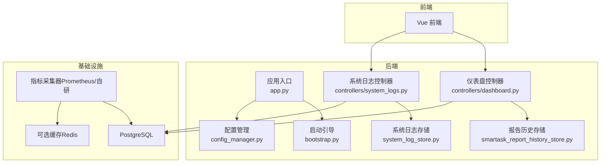
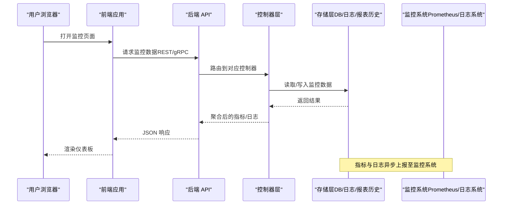
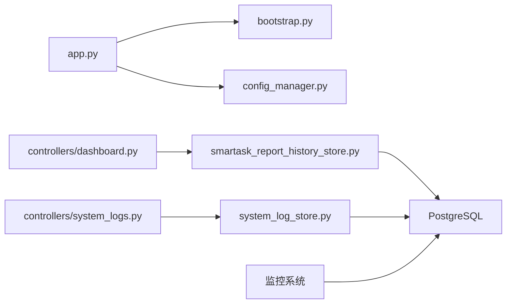

# 应用监控

<cite>
**本文引用的文件**   
- [app.py](file://backend/app.py)
- [bootstrap.py](file://backend/bootstrap.py)
- [config_manager.py](file://backend/config_manager.py)
- [system_log_store.py](file://backend/system_log_store.py)
- [smartask_report_history_store.py](file://backend/smartask_report_history_store.py)
- [controllers/dashboard.py](file://backend/controllers/dashboard.py)
- [controllers/system_logs.py](file://backend/controllers/system_logs.py)
- [docker-compose.yml](file://docker-compose.yml)
- [Dockerfile (backend)](file://backend/Dockerfile)
- [requirements.txt](file://backend/requirements.txt)
</cite>

## 目录
1. [简介](#简介)
2. [项目结构](#项目结构)
3. [核心组件](#核心组件)
4. [架构总览](#架构总览)
5. [详细组件分析](#详细组件分析)
6. [依赖分析](#依赖分析)
7. [性能考虑](#性能考虑)
8. [故障排查指南](#故障排查指南)
9. [结论](#结论)
10. [附录](#附录)

## 简介
本文件为 SmartAsk 智能问数平台的应用监控文档，聚焦以下目标：
- 关键业务指标监控：用户活跃度、查询成功率、响应时间、数据集访问统计等指标的采集与展示。
- 系统资源监控：CPU、内存、磁盘 I/O、网络带宽的实时监控方案。
- 性能指标收集：数据库查询性能、API 接口响应时间、缓存命中率等关键指标的采集与分析方法。
- 存储策略与查询优化：监控数据的存储设计与查询优化建议。
- 自定义监控指标实现指南与仪表板配置示例：提供可操作的落地方案。

## 项目结构
SmartAsk 后端采用 Python Web 框架组织，监控相关能力主要分布在应用启动、日志与报表历史存储、以及控制器层。前端通过 API 获取监控数据并渲染仪表板。部署层面使用 Docker Compose 编排服务。

图表来源
- [app.py](file://backend/app.py)
- [bootstrap.py](file://backend/bootstrap.py)
- [config_manager.py](file://backend/config_manager.py)
- [system_log_store.py](file://backend/system_log_store.py)
- [smartask_report_history_store.py](file://backend/smartask_report_history_store.py)
- [controllers/dashboard.py](file://backend/controllers/dashboard.py)
- [controllers/system_logs.py](file://backend/controllers/system_logs.py)
- [docker-compose.yml](file://docker-compose.yml)

章节来源
- [app.py](file://backend/app.py)
- [bootstrap.py](file://backend/bootstrap.py)
- [config_manager.py](file://backend/config_manager.py)
- [system_log_store.py](file://backend/system_log_store.py)
- [smartask_report_history_store.py](file://backend/smartask_report_history_store.py)
- [controllers/dashboard.py](file://backend/controllers/dashboard.py)
- [controllers/system_logs.py](file://backend/controllers/system_logs.py)
- [docker-compose.yml](file://docker-compose.yml)

## 核心组件
- 应用入口与中间件：负责请求生命周期、错误处理、统一埋点与指标上报。
- 启动引导与配置：加载运行时配置、初始化监控组件（如日志、指标、健康检查）。
- 日志与报表历史存储：持久化系统事件与报表执行历史，支撑审计与回溯。
- 控制器层：暴露监控相关 API（如仪表盘聚合、日志检索），供前端调用。

章节来源
- [app.py](file://backend/app.py)
- [bootstrap.py](file://backend/bootstrap.py)
- [config_manager.py](file://backend/config_manager.py)
- [system_log_store.py](file://backend/system_log_store.py)
- [smartask_report_history_store.py](file://backend/smartask_report_history_store.py)
- [controllers/dashboard.py](file://backend/controllers/dashboard.py)
- [controllers/system_logs.py](file://backend/controllers/system_logs.py)

## 架构总览
下图展示了从前端到后端、再到存储与外部监控系统的整体数据流，涵盖业务指标、系统资源与性能指标的采集路径。

图表来源
- [controllers/dashboard.py](file://backend/controllers/dashboard.py)
- [controllers/system_logs.py](file://backend/controllers/system_logs.py)
- [system_log_store.py](file://backend/system_log_store.py)
- [smartask_report_history_store.py](file://backend/smartask_report_history_store.py)

## 详细组件分析

### 应用入口与监控中间件
- 职责：注册路由、挂载监控中间件（请求耗时、状态码、异常计数）、统一错误处理与告警触发。
- 关键点：
  - 在请求进入时记录开始时间与上下文（用户、租户、会话）。
  - 在响应返回时计算耗时、记录成功/失败、采样上报。
  - 对慢请求与异常进行分级告警。

章节来源
- [app.py](file://backend/app.py)

### 启动引导与配置
- 职责：加载配置、初始化数据库连接池、日志与指标子系统、健康检查端点。
- 关键点：
  - 通过配置开关控制是否启用指标采集与采样率。
  - 初始化存储客户端（DB、缓存、对象存储）。
  - 暴露健康检查与就绪探针（Kubernetes 兼容）。

章节来源
- [bootstrap.py](file://backend/bootstrap.py)
- [config_manager.py](file://backend/config_manager.py)

### 系统日志存储
- 职责：持久化系统事件、操作审计、错误堆栈与诊断信息。
- 关键点：
  - 结构化日志字段（时间、级别、模块、用户、请求ID、消息）。
  - 支持按时间范围、级别、模块过滤查询。
  - 异步落盘与轮转，避免阻塞主流程。

章节来源
- [system_log_store.py](file://backend/system_log_store.py)
- [controllers/system_logs.py](file://backend/controllers/system_logs.py)

### 报告历史存储
- 职责：保存报表生成历史、SQL 执行轨迹、结果摘要与状态。
- 关键点：
  - 关联用户、数据集、任务 ID、执行时长、状态码。
  - 支持分页与条件检索，便于问题定位与性能分析。

章节来源
- [smartask_report_history_store.py](file://backend/smartask_report_history_store.py)
- [controllers/dashboard.py](file://backend/controllers/dashboard.py)

### 仪表盘控制器
- 职责：聚合多维度指标（用户活跃、查询成功率、响应时间、数据集访问），返回前端所需视图模型。
- 关键点：
  - 多源聚合（DB 统计、缓存命中、日志计数）。
  - 缓存热点指标，降低重复查询压力。
  - 支持时间窗口与维度筛选（租户、数据集、用户角色）。

章节来源
- [controllers/dashboard.py](file://backend/controllers/dashboard.py)

### 系统日志控制器
- 职责：提供日志检索、导出、过滤与详情查看接口。
- 关键点：
  - 支持关键字搜索、级别过滤、时间范围限定。
  - 大结果集分页与流式输出。

章节来源
- [controllers/system_logs.py](file://backend/controllers/system_logs.py)

### 部署与服务编排
- 职责：容器化部署、环境变量注入、端口映射、依赖服务启动顺序。
- 关键点：
  - 通过 docker-compose 编排后端、数据库、缓存与监控组件。
  - 健康检查与重启策略配置。

章节来源
- [docker-compose.yml](file://docker-compose.yml)
- [Dockerfile (backend)](file://backend/Dockerfile)

## 依赖分析
- 内部依赖：
  - 控制器依赖存储层（系统日志、报表历史）。
  - 应用入口依赖启动引导与配置管理。
- 外部依赖：
  - 数据库（PostgreSQL）、缓存（可选 Redis）、监控系统（Prometheus/日志系统）。
- 耦合与解耦：
  - 通过控制器抽象存储访问，便于替换实现。
  - 指标采集与业务逻辑解耦，采用异步上报。

图表来源
- [app.py](file://backend/app.py)
- [bootstrap.py](file://backend/bootstrap.py)
- [config_manager.py](file://backend/config_manager.py)
- [controllers/dashboard.py](file://backend/controllers/dashboard.py)
- [controllers/system_logs.py](file://backend/controllers/system_logs.py)
- [system_log_store.py](file://backend/system_log_store.py)
- [smartask_report_history_store.py](file://backend/smartask_report_history_store.py)

章节来源
- [requirements.txt](file://backend/requirements.txt)
- [docker-compose.yml](file://docker-compose.yml)

## 性能考虑
- 指标采集开销控制：
  - 采样策略：对高频指标进行采样（如每 N 次请求上报一次）。
  - 批量上报：合并多条指标后一次性提交，减少网络与写放大。
- 存储与查询优化：
  - 索引设计：按时间、租户、用户、数据集建立复合索引。
  - 分区表：按时间分区（日/周）提升查询效率。
  - 冷热分离：热数据保留短期，冷数据归档至对象存储。
- 缓存策略：
  - 热点指标缓存（如最近 5 分钟聚合结果），设置合理过期时间。
  - 缓存穿透保护：空值缓存与布隆过滤器。
- 数据库性能：
  - 慢查询监控与自动限流。
  - 连接池大小与超时参数调优。

[本节为通用指导，不直接分析具体文件]

## 故障排查指南
- 常见问题定位：
  - 高延迟：查看慢查询日志、数据库锁等待、缓存命中率。
  - 高错误率：检查异常堆栈、上游依赖健康状态、重试与熔断策略。
  - 资源瓶颈：CPU、内存、磁盘 I/O、网络带宽峰值与持续占用。
- 排查步骤：
  - 通过系统日志控制器检索错误级别日志与关键字。
  - 使用仪表盘查看近段时间的指标趋势与异常点。
  - 结合数据库慢查询与执行计划分析根因。
- 告警与恢复：
  - 设置阈值告警（错误率、延迟、资源使用率）。
  - 自动降级与熔断，保障核心链路可用性。

章节来源
- [controllers/system_logs.py](file://backend/controllers/system_logs.py)
- [controllers/dashboard.py](file://backend/controllers/dashboard.py)

## 结论
SmartAsk 的监控体系以应用入口与控制器为核心，结合存储层与外部监控系统，形成完整的指标采集、存储与展示闭环。通过合理的采样、缓存与索引策略，可在保证准确性的同时控制开销。后续建议引入更细粒度的分布式追踪与自动化告警，进一步提升可观测性与运维效率。

[本节为总结性内容，不直接分析具体文件]

## 附录

### 关键业务指标定义与采集方法
- 用户活跃度：
  - 定义：单位时间内登录用户数、活跃会话数、功能使用频次。
  - 采集：登录事件、页面访问事件、API 调用计数。
- 查询成功率：
  - 定义：成功返回的查询请求占比。
  - 采集：HTTP 状态码、业务状态码、异常计数。
- 响应时间：
  - 定义：端到端请求耗时（P50/P90/P99）。
  - 采集：请求开始与结束时间戳差值。
- 数据集访问统计：
  - 定义：各数据集被访问次数、独立用户数、平均耗时。
  - 采集：数据集访问事件与执行轨迹。

章节来源
- [controllers/dashboard.py](file://backend/controllers/dashboard.py)
- [system_log_store.py](file://backend/system_log_store.py)
- [smartask_report_history_store.py](file://backend/smartask_report_history_store.py)

### 系统资源监控方案
- CPU：进程级与系统级 CPU 使用率、负载均值。
- 内存：RSS、虚拟内存、GC 停顿（如适用）。
- 磁盘 I/O：读写吞吐、IOPS、延迟。
- 网络带宽：入站/出站流量、连接数、重传率。
- 采集方式：
  - 操作系统指标（node_exporter/procfs）。
  - 应用内指标（Python 标准库或第三方库）。
  - 容器指标（cgroups/stats）。

[本节为通用指导，不直接分析具体文件]

### 性能指标收集方法
- 数据库查询性能：
  - 慢查询日志、执行计划、锁等待。
- API 接口响应时间：
  - 分层计时（网关、业务、存储）。
- 缓存命中率：
  - 命中/未命中计数、过期率、淘汰率。

章节来源
- [controllers/dashboard.py](file://backend/controllers/dashboard.py)
- [system_log_store.py](file://backend/system_log_store.py)

### 监控数据存储策略与查询优化
- 存储策略：
  - 时序指标：按时间分区，保留周期分级。
  - 日志：结构化存储，支持全文检索。
  - 报表历史：关联维度索引，支持快速检索。
- 查询优化：
  - 预聚合与物化视图。
  - 索引覆盖与联合索引。
  - 分页与游标查询。

章节来源
- [system_log_store.py](file://backend/system_log_store.py)
- [smartask_report_history_store.py](file://backend/smartask_report_history_store.py)

### 自定义监控指标实现指南
- 指标类型：计数器、直方图、仪表盘、标签。
- 实现步骤：
  - 定义指标名称、单位、标签。
  - 在关键路径埋点（入口、出口、异常分支）。
  - 异步上报至监控系统。
- 最佳实践：
  - 标签基数控制，避免高基数导致存储膨胀。
  - 采样与批处理，降低开销。
  - 命名规范与版本管理。

[本节为通用指导，不直接分析具体文件]

### 监控仪表板配置示例
- 指标面板：
  - QPS、错误率、P95/P99 延迟。
  - 用户活跃度趋势、数据集访问 TopN。
- 日志面板：
  - 错误级别分布、关键字搜索。
- 资源面板：
  - CPU、内存、磁盘、网络。
- 告警规则：
  - 阈值告警、同比环比异常检测。

[本节为通用指导，不直接分析具体文件]