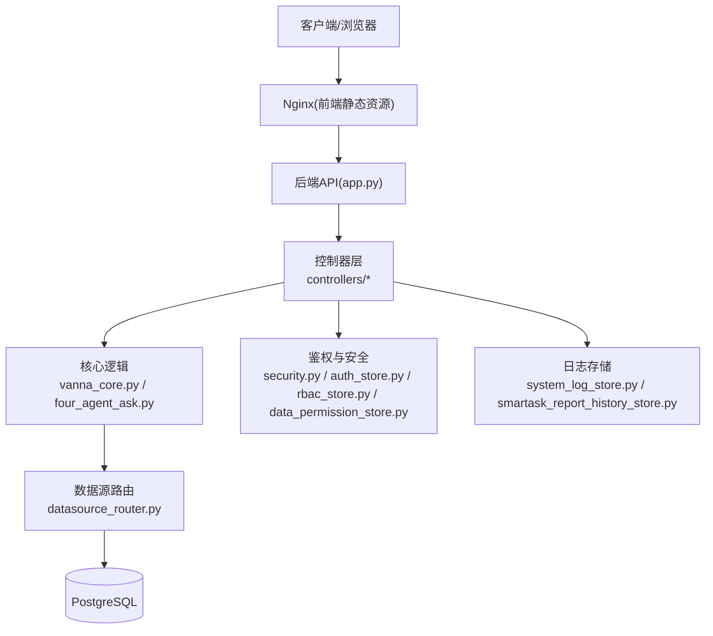
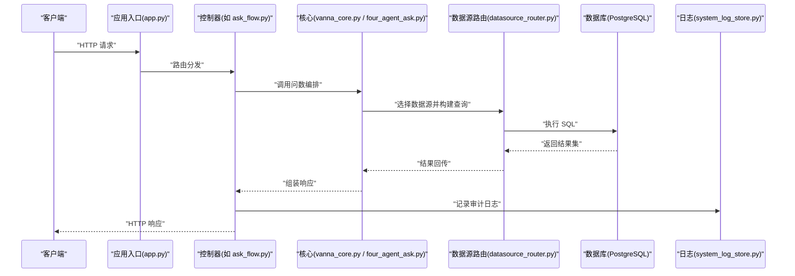
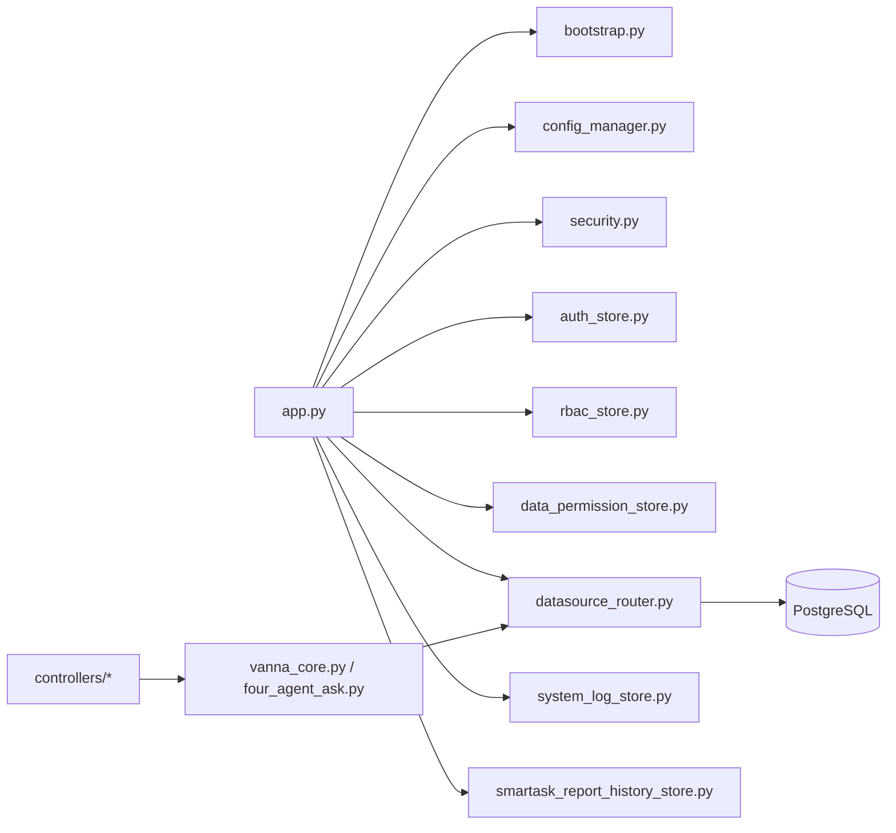

# 故障诊断

<cite>
**本文引用的文件**   
- [app.py](file://backend/app.py)
- [bootstrap.py](file://backend/bootstrap.py)
- [config_manager.py](file://backend/config_manager.py)
- [security.py](file://backend/security.py)
- [auth_store.py](file://backend/auth_store.py)
- [rbac_store.py](file://backend/rbac_store.py)
- [data_permission_store.py](file://backend/data_permission_store.py)
- [datasource_router.py](file://backend/datasource_router.py)
- [system_log_store.py](file://backend/system_log_store.py)
- [smartask_report_history_store.py](file://backend/smartask_report_history_store.py)
- [controllers/ask_flow.py](file://backend/controllers/ask_flow.py)
- [controllers/auth.py](file://backend/controllers/auth.py)
- [controllers/datasources.py](file://backend/controllers/datasources.py)
- [controllers/system_logs.py](file://backend/controllers/system_logs.py)
- [controllers/data_permissions.py](file://backend/controllers/data_permissions.py)
- [controllers/rbac.py](file://backend/controllers/rbac.py)
- [vanna_core.py](file://backend/vanna_core.py)
- [four_agent_ask.py](file://backend/four_agent_ask.py)
- [docker-compose.yml](file://docker-compose.yml)
- [Dockerfile](file://backend/Dockerfile)
- [requirements.txt](file://backend/requirements.txt)
- [backup.sh](file://backup.sh)
- [restore.sh](file://restore.sh)
- [doctor.sh](file://doctor.sh)
- [deploy.sh](file://deploy.sh)
- [start_backend.bat](file://start_backend.bat)
- [stop_all.bat](file://stop_all.bat)
- [scripts/integration_test.py](file://scripts/integration_test.py)
- [scripts/verify_deployment.py](file://scripts/verify_deployment.py)
</cite>

## 目录
1. [简介](#简介)
2. [项目结构](#项目结构)
3. [核心组件](#核心组件)
4. [架构总览](#架构总览)
5. [详细组件分析](#详细组件分析)
6. [依赖关系分析](#依赖关系分析)
7. [性能注意事项](#性能注意事项)
8. [故障排查指南](#故障排查指南)
9. [结论](#结论)
10. [附录](#附录)

## 简介
本文件面向 SmartAsk 智能问数平台的运维与研发人员，提供系统化的故障诊断与恢复指南。内容覆盖常见故障模式（服务不可用、性能下降、数据异常、权限错误等）、日志分析方法（错误堆栈、慢查询、内存泄漏、线程死锁）、性能瓶颈定位技巧（CPU 热点、数据库连接池、缓存失效、网络延迟）、调试工具集成配置、故障恢复流程（备份恢复、重启策略、降级方案）以及复盘改进方法。文档以仓库实际代码为依据，结合部署脚本与运维工具，给出可操作的步骤与检查清单。

## 项目结构
SmartAsk 后端采用 Python Web 应用结构，入口为 app.py，启动引导在 bootstrap.py；配置管理集中在 config_manager.py；安全与鉴权相关逻辑位于 security.py、auth_store.py、rbac_store.py、data_permission_store.py；数据源路由在 datasource_router.py；系统与业务日志分别由 system_log_store.py 与 smartask_report_history_store.py 管理；控制器层按功能划分在 controllers 目录下；核心推理与编排涉及 vanna_core.py 与 four_agent_ask.py。前端位于 frontend 目录，通过 Nginx 反向代理与后端交互。部署与运维脚本集中于根目录与 scripts 目录。

图表来源
- [app.py:1-200](file://backend/app.py#L1-L200)
- [bootstrap.py:1-200](file://backend/bootstrap.py#L1-L200)
- [controllers/ask_flow.py:1-200](file://backend/controllers/ask_flow.py#L1-L200)
- [controllers/auth.py:1-200](file://backend/controllers/auth.py#L1-L200)
- [controllers/datasources.py:1-200](file://backend/controllers/datasources.py#L1-L200)
- [controllers/system_logs.py:1-200](file://backend/controllers/system_logs.py#L1-L200)
- [controllers/data_permissions.py:1-200](file://backend/controllers/data_permissions.py#L1-L200)
- [controllers/rbac.py:1-200](file://backend/controllers/rbac.py#L1-L200)
- [vanna_core.py:1-200](file://backend/vanna_core.py#L1-L200)
- [four_agent_ask.py:1-200](file://backend/four_agent_ask.py#L1-L200)
- [datasource_router.py:1-200](file://backend/datasource_router.py#L1-L200)
- [system_log_store.py:1-200](file://backend/system_log_store.py#L1-L200)
- [smartask_report_history_store.py:1-200](file://backend/smartask_report_history_store.py#L1-L200)

章节来源
- [app.py:1-200](file://backend/app.py#L1-L200)
- [bootstrap.py:1-200](file://backend/bootstrap.py#L1-L200)
- [requirements.txt:1-200](file://backend/requirements.txt#L1-L200)
- [docker-compose.yml:1-200](file://docker-compose.yml#L1-L200)

## 核心组件
- 应用入口与生命周期：app.py 负责注册路由与中间件，bootstrap.py 负责初始化配置、依赖注入与启动参数解析。
- 配置管理：config_manager.py 集中加载环境变量与配置文件，提供统一访问接口。
- 鉴权与安全：security.py 实现令牌校验、签名验证等；auth_store.py 管理会话与用户信息；rbac_store.py 与 data_permission_store.py 分别处理角色权限与数据级权限。
- 数据源路由：datasource_router.py 根据请求上下文选择目标数据源并建立连接。
- 日志与审计：system_log_store.py 记录系统事件；smartask_report_history_store.py 记录报告历史与执行轨迹。
- 控制器层：controllers 下各模块暴露 REST API，协调核心逻辑与存储层。
- 核心推理与编排：vanna_core.py 与 four_agent_ask.py 封装问数流程、SQL 生成与结果聚合。

章节来源
- [app.py:1-200](file://backend/app.py#L1-L200)
- [bootstrap.py:1-200](file://backend/bootstrap.py#L1-L200)
- [config_manager.py:1-200](file://backend/config_manager.py#L1-L200)
- [security.py:1-200](file://backend/security.py#L1-L200)
- [auth_store.py:1-200](file://backend/auth_store.py#L1-L200)
- [rbac_store.py:1-200](file://backend/rbac_store.py#L1-L200)
- [data_permission_store.py:1-200](file://backend/data_permission_store.py#L1-L200)
- [datasource_router.py:1-200](file://backend/datasource_router.py#L1-L200)
- [system_log_store.py:1-200](file://backend/system_log_store.py#L1-L200)
- [smartask_report_history_store.py:1-200](file://backend/smartask_report_history_store.py#1-L200)
- [controllers/ask_flow.py:1-200](file://backend/controllers/ask_flow.py#L1-L200)
- [controllers/auth.py:1-200](file://backend/controllers/auth.py#L1-L200)
- [controllers/datasources.py:1-200](file://backend/controllers/datasources.py#L1-L200)
- [controllers/system_logs.py:1-200](file://backend/controllers/system_logs.py#L1-L200)
- [controllers/data_permissions.py:1-200](file://backend/controllers/data_permissions.py#L1-L200)
- [controllers/rbac.py:1-200](file://backend/controllers/rbac.py#L1-L200)
- [vanna_core.py:1-200](file://backend/vanna_core.py#L1-L200)
- [four_agent_ask.py:1-200](file://backend/four_agent_ask.py#L1-L200)

## 架构总览
SmartAsk 后端遵循“控制器-核心-存储”分层架构。请求进入 app.py 后由控制器路由到具体业务逻辑，核心层进行问数编排与 SQL 生成，数据源路由选择目标数据库并执行查询，结果经控制器返回给前端。鉴权与安全贯穿请求链路，日志与审计在关键节点记录。

图表来源
- [app.py:1-200](file://backend/app.py#L1-L200)
- [controllers/ask_flow.py:1-200](file://backend/controllers/ask_flow.py#L1-L200)
- [vanna_core.py:1-200](file://backend/vanna_core.py#L1-L200)
- [four_agent_ask.py:1-200](file://backend/four_agent_ask.py#L1-L200)
- [datasource_router.py:1-200](file://backend/datasource_router.py#L1-L200)
- [system_log_store.py:1-200](file://backend/system_log_store.py#L1-L200)

## 详细组件分析

### 服务不可用问题
- 症状：端口无响应、进程崩溃、健康检查失败。
- 定位要点：
  - 检查应用入口与启动脚本是否正常运行，确认依赖库安装与环境变量配置。
  - 查看容器化部署配置，确保端口映射、资源限制与健康探针设置正确。
  - 检查系统日志与错误输出，定位异常堆栈。
- 恢复建议：
  - 使用启动/停止脚本快速重启服务。
  - 若为依赖问题，重新安装依赖或修复环境。
  - 若为资源不足，调整容器或主机资源配额。

章节来源
- [app.py:1-200](file://backend/app.py#L1-L200)
- [bootstrap.py:1-200](file://backend/bootstrap.py#L1-L200)
- [Dockerfile:1-200](file://backend/Dockerfile#L1-L200)
- [docker-compose.yml:1-200](file://docker-compose.yml#L1-L200)
- [start_backend.bat:1-200](file://start_backend.bat#L1-L200)
- [stop_all.bat:1-200](file://stop_all.bat#L1-L200)

### 性能下降问题
- 症状：响应时间升高、吞吐下降、CPU/内存占用异常。
- 定位要点：
  - 监控 CPU 热点与慢查询，识别耗时 SQL 与阻塞点。
  - 检查数据库连接池大小与等待队列长度。
  - 分析缓存命中率与失效频率。
  - 测量网络延迟与外部依赖响应时间。
- 恢复建议：
  - 优化慢查询索引与语句结构。
  - 调整连接池与并发参数。
  - 预热缓存与合理设置过期策略。
  - 限流与熔断保护下游依赖。

章节来源
- [datasource_router.py:1-200](file://backend/datasource_router.py#L1-L200)
- [vanna_core.py:1-200](file://backend/vanna_core.py#L1-L200)
- [four_agent_ask.py:1-200](file://backend/four_agent_ask.py#L1-L200)
- [config_manager.py:1-200](file://backend/config_manager.py#L1-L200)

### 数据异常问题
- 症状：查询结果为空、字段缺失、数值异常、一致性不一致。
- 定位要点：
  - 核对数据源连接与权限，确认表结构与视图定义。
  - 检查数据转换与清洗逻辑，定位异常分支。
  - 对比历史快照与增量变更，追踪数据漂移。
- 恢复建议：
  - 回滚有问题的迁移或配置。
  - 重建索引与物化视图。
  - 启用数据校验与告警规则。

章节来源
- [controllers/datasources.py:1-200](file://backend/controllers/datasources.py#L1-L200)
- [smartask_report_history_store.py:1-200](file://backend/smartask_report_history_store.py#L1-L200)
- [system_log_store.py:1-200](file://backend/system_log_store.py#L1-L200)

### 权限错误问题
- 症状：401/403 响应、无法访问特定数据或功能。
- 定位要点：
  - 检查令牌有效性、签名与过期时间。
  - 核查 RBAC 与数据级权限配置是否正确。
  - 确认用户角色与资源绑定关系。
- 恢复建议：
  - 重置或刷新令牌。
  - 修正权限配置与角色分配。
  - 增加权限校验日志以便追踪。

章节来源
- [security.py:1-200](file://backend/security.py#L1-L200)
- [auth_store.py:1-200](file://backend/auth_store.py#L1-L200)
- [rbac_store.py:1-200](file://backend/rbac_store.py#L1-L200)
- [data_permission_store.py:1-200](file://backend/data_permission_store.py#L1-L200)
- [controllers/auth.py:1-200](file://backend/controllers/auth.py#L1-L200)
- [controllers/rbac.py:1-200](file://backend/controllers/rbac.py#L1-L200)
- [controllers/data_permissions.py:1-200](file://backend/controllers/data_permissions.py#L1-L200)

### 日志分析方法
- 错误堆栈分析：
  - 收集应用日志与异常堆栈，定位抛出位置与调用链。
  - 关联请求 ID 与用户上下文，缩小影响范围。
- 慢查询追踪：
  - 开启数据库慢查询日志，统计耗时阈值与频率。
  - 结合执行计划分析索引命中与扫描方式。
- 内存泄漏检测：
  - 监控进程内存增长趋势，识别未释放对象。
  - 使用内存分析工具抓取堆快照，定位大对象与循环引用。
- 线程死锁排查：
  - 采集线程栈与锁持有信息，识别竞争条件。
  - 简化锁粒度与顺序，避免嵌套锁。

章节来源
- [system_log_store.py:1-200](file://backend/system_log_store.py#L1-L200)
- [controllers/system_logs.py:1-200](file://backend/controllers/system_logs.py#L1-L200)
- [vanna_core.py:1-200](file://backend/vanna_core.py#L1-L200)
- [datasource_router.py:1-200](file://backend/datasource_router.py#L1-L200)

### 性能瓶颈定位技巧
- CPU 热点分析：
  - 使用采样器定位热点函数与循环。
  - 减少重复计算与序列化开销。
- 数据库连接池监控：
  - 观察连接创建/销毁速率与等待时间。
  - 调整最大连接数与超时策略。
- 缓存失效分析：
  - 统计命中率与淘汰率，优化键设计与过期时间。
  - 引入多级缓存与预取机制。
- 网络延迟诊断：
  - 测量端到端 RTT 与下游依赖响应时间。
  - 启用连接复用与压缩传输。

章节来源
- [config_manager.py:1-200](file://backend/config_manager.py#L1-L200)
- [datasource_router.py:1-200](file://backend/datasource_router.py#L1-L200)
- [vanna_core.py:1-200](file://backend/vanna_core.py#L1-L200)

### 调试工具集成与配置
- 应用调试器：
  - 启用开发模式与断点调试，配合 IDE 远程调试。
  - 打印关键路径的入参出参与耗时。
- 数据库分析工具：
  - 使用 EXPLAIN ANALYZE 分析执行计划。
  - 监控锁等待与事务隔离级别。
- 性能分析工具：
  - 使用 cProfile、py-spy、memory_profiler 等工具。
  - 结合 APM 平台进行全链路追踪。

章节来源
- [requirements.txt:1-200](file://backend/requirements.txt#L1-L200)
- [scripts/integration_test.py:1-200](file://scripts/integration_test.py#L1-L200)
- [scripts/verify_deployment.py:1-200](file://scripts/verify_deployment.py#L1-L200)

### 故障恢复流程
- 数据备份恢复：
  - 定期执行全量与增量备份，保留多版本快照。
  - 恢复前校验完整性与一致性。
- 服务重启策略：
  - 优雅关闭与滚动升级，避免单点故障。
  - 健康检查与自动拉起机制。
- 降级方案实施：
  - 关闭非核心功能，保障主流程可用。
  - 切换只读模式与缓存优先策略。

章节来源
- [backup.sh:1-200](file://backup.sh#L1-L200)
- [restore.sh:1-200](file://restore.sh#L1-L200)
- [doctor.sh:1-200](file://doctor.sh#L1-L200)
- [deploy.sh:1-200](file://deploy.sh#L1-L200)

## 依赖关系分析
SmartAsk 后端依赖关系清晰，控制器依赖核心逻辑与存储层，核心逻辑依赖数据源路由与数据库，鉴权与安全贯穿各层。配置管理为全局依赖，日志与审计作为横切关注点。

图表来源
- [app.py:1-200](file://backend/app.py#L1-L200)
- [bootstrap.py:1-200](file://backend/bootstrap.py#L1-L200)
- [config_manager.py:1-200](file://backend/config_manager.py#L1-L200)
- [security.py:1-200](file://backend/security.py#L1-L200)
- [auth_store.py:1-200](file://backend/auth_store.py#L1-L200)
- [rbac_store.py:1-200](file://backend/rbac_store.py#L1-L200)
- [data_permission_store.py:1-200](file://backend/data_permission_store.py#L1-L200)
- [datasource_router.py:1-200](file://backend/datasource_router.py#L1-L200)
- [system_log_store.py:1-200](file://backend/system_log_store.py#L1-L200)
- [smartask_report_history_store.py:1-200](file://backend/smartask_report_history_store.py#L1-L200)
- [controllers/ask_flow.py:1-200](file://backend/controllers/ask_flow.py#L1-L200)
- [controllers/auth.py:1-200](file://backend/controllers/auth.py#L1-L200)
- [controllers/datasources.py:1-200](file://backend/controllers/datasources.py#L1-L200)
- [controllers/system_logs.py:1-200](file://backend/controllers/system_logs.py#L1-L200)
- [controllers/data_permissions.py:1-200](file://backend/controllers/data_permissions.py#L1-L200)
- [controllers/rbac.py:1-200](file://backend/controllers/rbac.py#L1-L200)
- [vanna_core.py:1-200](file://backend/vanna_core.py#L1-L200)
- [four_agent_ask.py:1-200](file://backend/four_agent_ask.py#L1-L200)

## 性能注意事项
- 控制并发与超时，避免雪崩效应。
- 使用连接池与缓存降低数据库压力。
- 对热点路径进行异步化与批量化处理。
- 监控关键指标（QPS、RT、错误率、资源利用率）。
- 定期进行压测与容量规划。

## 故障排查指南
- 服务不可用：
  - 检查进程状态与端口监听。
  - 查看启动日志与依赖初始化结果。
  - 验证容器健康检查与负载均衡状态。
- 性能下降：
  - 采集 CPU、内存、IO 与网络指标。
  - 分析慢查询与锁等待。
  - 检查缓存命中率与外部依赖响应。
- 数据异常：
  - 核对数据源连通性与权限。
  - 检查数据转换逻辑与边界条件。
  - 对比历史快照与变更记录。
- 权限错误：
  - 验证令牌与签名。
  - 检查 RBAC 与数据级权限配置。
  - 增加权限校验日志。

章节来源
- [system_log_store.py:1-200](file://backend/system_log_store.py#L1-L200)
- [controllers/system_logs.py:1-200](file://backend/controllers/system_logs.py#L1-L200)
- [security.py:1-200](file://backend/security.py#L1-L200)
- [auth_store.py:1-200](file://backend/auth_store.py#L1-L200)
- [rbac_store.py:1-200](file://backend/rbac_store.py#L1-L200)
- [data_permission_store.py:1-200](file://backend/data_permission_store.py#L1-L200)
- [datasource_router.py:1-200](file://backend/datasource_router.py#L1-L200)
- [vanna_core.py:1-200](file://backend/vanna_core.py#L1-L200)

## 结论
通过对 SmartAsk 平台的核心组件、架构与依赖关系的深入分析，结合日志分析与性能监控手段，可以系统化地识别与定位常见故障模式。借助备份恢复、重启策略与降级方案，能够快速恢复服务可用性。持续复盘与改进措施将进一步提升系统的稳定性与可维护性。

## 附录
- 常用命令与脚本：
  - 备份与恢复：backup.sh、restore.sh
  - 健康检查与诊断：doctor.sh
  - 部署与更新：deploy.sh
  - 启动与停止：start_backend.bat、stop_all.bat
- 测试与验证：
  - 集成测试：scripts/integration_test.py
  - 部署验证：scripts/verify_deployment.py

章节来源
- [backup.sh:1-200](file://backup.sh#L1-L200)
- [restore.sh:1-200](file://restore.sh#L1-L200)
- [doctor.sh:1-200](file://doctor.sh#L1-L200)
- [deploy.sh:1-200](file://deploy.sh#L1-L200)
- [start_backend.bat:1-200](file://start_backend.bat#L1-L200)
- [stop_all.bat:1-200](file://stop_all.bat#L1-L200)
- [scripts/integration_test.py:1-200](file://scripts/integration_test.py#L1-L200)
- [scripts/verify_deployment.py:1-200](file://scripts/verify_deployment.py#L1-L200)