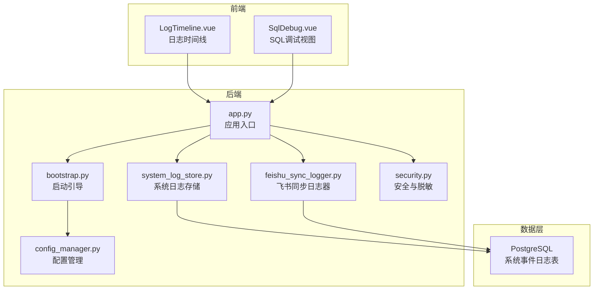
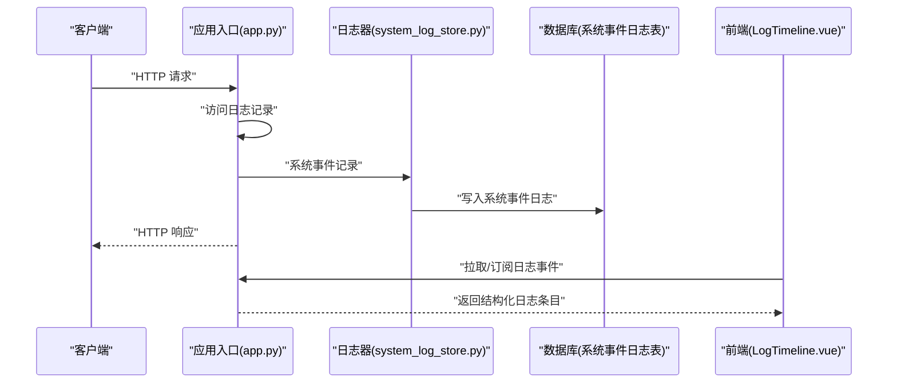
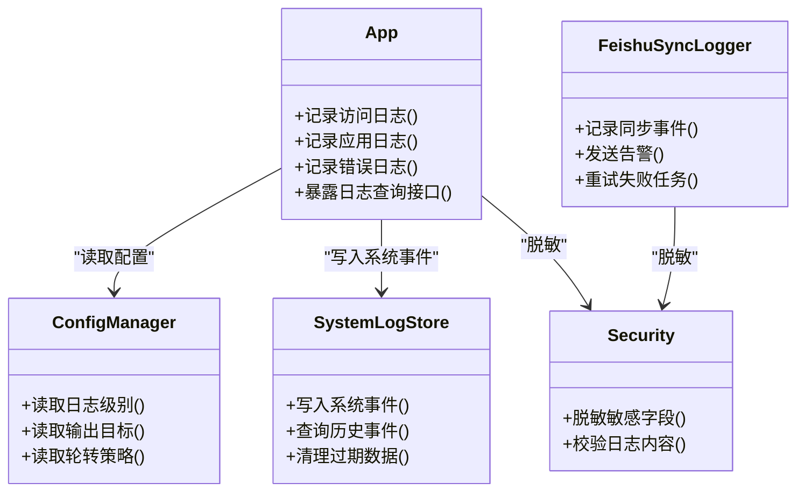

# 日志收集

<cite>
**本文引用的文件**   
- [backend/app.py](file://backend/app.py)
- [backend/bootstrap.py](file://backend/bootstrap.py)
- [backend/config_manager.py](file://backend/config_manager.py)
- [backend/system_log_store.py](file://backend/system_log_store.py)
- [backend/feishu_sync_logger.py](file://backend/feishu_sync_logger.py)
- [backend/security.py](file://backend/security.py)
- [docker/postgres/init/006_system_event_logs.sql](file://docker/postgres/init/006_system_event_logs.sql)
- [frontend/src/components/smartask/LogTimeline.vue](file://frontend/src/components/smartask/LogTimeline.vue)
- [frontend/src/views/SqlDebug.vue](file://frontend/src/views/SqlDebug.vue)
</cite>

## 目录
1. [简介](#简介)
2. [项目结构](#项目结构)
3. [核心组件](#核心组件)
4. [架构总览](#架构总览)
5. [详细组件分析](#详细组件分析)
6. [依赖关系分析](#依赖关系分析)
7. [性能考虑](#性能考虑)
8. [故障排查指南](#故障排查指南)
9. [结论](#结论)
10. [附录](#附录)

## 简介
本文件为 SmartAsk 智能问数平台的日志收集规范与实现说明，覆盖日志分类策略、采集架构、格式规范、轮转策略、分析工具与安全脱敏。目标是帮助研发、运维与审计人员统一日志标准，提升可观测性与问题定位效率。

## 项目结构
SmartAsk 后端基于 Python（Flask/FastAPI 风格），前端基于 Vue。日志相关的关键位置包括：
- 应用启动与配置初始化：bootstrap、app、config_manager
- 系统事件日志存储：system_log_store 及数据库初始化脚本
- 飞书同步模块的专用日志器：feishu_sync_logger
- 安全与敏感信息处理：security
- 前端可视化与调试：LogTimeline、SqlDebug

图表来源
- [backend/app.py](file://backend/app.py)
- [backend/bootstrap.py](file://backend/bootstrap.py)
- [backend/config_manager.py](file://backend/config_manager.py)
- [backend/system_log_store.py](file://backend/system_log_store.py)
- [backend/feishu_sync_logger.py](file://backend/feishu_sync_logger.py)
- [backend/security.py](file://backend/security.py)
- [docker/postgres/init/006_system_event_logs.sql](file://docker/postgres/init/006_system_event_logs.sql)
- [frontend/src/components/smartask/LogTimeline.vue](file://frontend/src/components/smartask/LogTimeline.vue)
- [frontend/src/views/SqlDebug.vue](file://frontend/src/views/SqlDebug.vue)

章节来源
- [backend/app.py](file://backend/app.py)
- [backend/bootstrap.py](file://backend/bootstrap.py)
- [backend/config_manager.py](file://backend/config_manager.py)
- [backend/system_log_store.py](file://backend/system_log_store.py)
- [backend/feishu_sync_logger.py](file://backend/feishu_sync_logger.py)
- [backend/security.py](file://backend/security.py)
- [docker/postgres/init/006_system_event_logs.sql](file://docker/postgres/init/006_system_event_logs.sql)
- [frontend/src/components/smartask/LogTimeline.vue](file://frontend/src/components/smartask/LogTimeline.vue)
- [frontend/src/views/SqlDebug.vue](file://frontend/src/views/SqlDebug.vue)

## 核心组件
- 应用入口与中间件：负责请求生命周期、全局异常捕获、访问日志记录与响应标准化。
- 配置管理：集中化日志级别、输出目标、轮转策略等开关。
- 系统日志存储：将关键系统事件写入持久化存储（数据库），便于审计与回溯。
- 飞书同步日志器：针对外部集成场景提供结构化日志与告警通道。
- 安全与脱敏：对敏感字段进行过滤与掩码，避免泄露。
- 前端日志展示：以时间线形式呈现执行过程，辅助用户与开发者定位问题。

章节来源
- [backend/app.py](file://backend/app.py)
- [backend/config_manager.py](file://backend/config_manager.py)
- [backend/system_log_store.py](file://backend/system_log_store.py)
- [backend/feishu_sync_logger.py](file://backend/feishu_sync_logger.py)
- [backend/security.py](file://backend/security.py)
- [frontend/src/components/smartask/LogTimeline.vue](file://frontend/src/components/smartask/LogTimeline.vue)

## 架构总览
日志采集与流转遵循“本地文件 + 集中式存储 + 实时流”的混合模式：
- 本地日志文件：按模块或功能划分，支持大小与时间轮转，便于快速定位与离线分析。
- 集中式存储：通过 system_log_store 将系统事件落库，满足审计与聚合查询需求。
- 实时日志流：通过接口暴露或消息队列（可选）推送关键事件，供前端与监控消费。

图表来源
- [backend/app.py](file://backend/app.py)
- [backend/system_log_store.py](file://backend/system_log_store.py)
- [docker/postgres/init/006_system_event_logs.sql](file://docker/postgres/init/006_system_event_logs.sql)
- [frontend/src/components/smartask/LogTimeline.vue](file://frontend/src/components/smartask/LogTimeline.vue)

## 详细组件分析

### 应用日志与访问日志
- 应用日志：记录服务启动、配置加载、任务调度、外部调用结果等。
- 访问日志：记录 HTTP 请求方法、路径、状态码、耗时、客户端信息等，用于流量分析与性能监控。
- 建议实现要点：
  - 在请求进入与退出时分别记录开始与结束事件。
  - 统一日志级别（DEBUG/INFO/WARN/ERROR），并按模块设置不同默认级别。
  - 使用结构化 JSON 格式，包含 trace_id、span_id、timestamp、level、module、message、extra 字段。

章节来源
- [backend/app.py](file://backend/app.py)
- [backend/config_manager.py](file://backend/config_manager.py)

### 错误日志
- 定义：所有未预期异常、业务校验失败、第三方调用失败等。
- 要求：
  - 必须包含堆栈信息与上下文（如请求ID、参数摘要）。
  - 自动脱敏敏感字段（密码、令牌、身份证号等）。
  - 区分可恢复错误与致命错误，触发不同告警策略。

章节来源
- [backend/security.py](file://backend/security.py)
- [backend/app.py](file://backend/app.py)

### 审计日志
- 定义：涉及权限变更、数据导出、配置修改、登录登出等关键操作。
- 存储：通过 system_log_store 写入数据库，确保不可篡改与长期保留。
- 字段：操作人、主体、动作、对象、结果、时间戳、来源IP、trace_id。

章节来源
- [backend/system_log_store.py](file://backend/system_log_store.py)
- [docker/postgres/init/006_system_event_logs.sql](file://docker/postgres/init/006_system_event_logs.sql)

### 业务日志
- 定义：与问数流程相关的步骤日志，如 SQL 生成、执行、结果解析、报告生成。
- 特点：高吞吐、强关联（同一 trace_id）、需支持前端实时展示。
- 前端展示：LogTimeline 组件按时间线渲染，SqlDebug 视图聚焦 SQL 调试。

章节来源
- [frontend/src/components/smartask/LogTimeline.vue](file://frontend/src/components/smartask/LogTimeline.vue)
- [frontend/src/views/SqlDebug.vue](file://frontend/src/views/SqlDebug.vue)
- [backend/system_log_store.py](file://backend/system_log_store.py)

### 飞书同步日志器
- 用途：记录与飞书集成的同步任务、回调、错误与重试。
- 特性：结构化输出、可配置告警通道、失败重试与幂等性保障。

章节来源
- [backend/feishu_sync_logger.py](file://backend/feishu_sync_logger.py)

### 安全与敏感信息脱敏
- 原则：最小化暴露、默认脱敏、白名单放行。
- 实现：对输入输出进行字段级过滤与掩码；对日志序列化前进行清洗。
- 建议：提供统一的脱敏工具函数与日志过滤器。

章节来源
- [backend/security.py](file://backend/security.py)

## 依赖关系分析
- app.py 依赖 config_manager 获取日志配置，依赖 system_log_store 写入系统事件，依赖 security 进行脱敏。
- feishu_sync_logger 独立于主链路，但共享脱敏与配置能力。
- 前端 LogTimeline 与 SqlDebug 通过 API 消费后端日志事件。

图表来源
- [backend/app.py](file://backend/app.py)
- [backend/config_manager.py](file://backend/config_manager.py)
- [backend/system_log_store.py](file://backend/system_log_store.py)
- [backend/feishu_sync_logger.py](file://backend/feishu_sync_logger.py)
- [backend/security.py](file://backend/security.py)

章节来源
- [backend/app.py](file://backend/app.py)
- [backend/config_manager.py](file://backend/config_manager.py)
- [backend/system_log_store.py](file://backend/system_log_store.py)
- [backend/feishu_sync_logger.py](file://backend/feishu_sync_logger.py)
- [backend/security.py](file://backend/security.py)

## 性能考虑
- 异步写入：系统事件与访问日志采用异步队列或批量写入，降低主链路延迟。
- 采样策略：对高频 DEBUG 日志启用采样，避免磁盘与网络拥塞。
- 压缩与归档：本地文件按天/小时滚动并压缩，减少存储空间占用。
- 索引优化：数据库侧对 trace_id、时间戳、模块名建立索引，提升检索性能。
- 前端渲染：LogTimeline 采用虚拟列表与增量更新，避免大数据量卡顿。

[本节为通用指导，不直接分析具体文件]

## 故障排查指南
- 常见问题：
  - 日志缺失：检查日志级别与模块开关、输出目标是否可达、异步队列是否堆积。
  - 日志乱码：确认编码设置为 UTF-8，序列化器配置正确。
  - 性能下降：关闭不必要的 DEBUG 日志、启用采样、检查数据库写入瓶颈。
  - 敏感信息泄露：复核脱敏规则与白名单，补充遗漏字段。
- 排查步骤：
  - 通过 trace_id 串联全链路日志。
  - 优先查看 ERROR 与 WARN 级别，结合堆栈定位根因。
  - 使用系统事件日志表进行审计回溯与合规检查。
  - 前端 LogTimeline 与 SqlDebug 辅助验证业务流程与 SQL 执行情况。

章节来源
- [backend/system_log_store.py](file://backend/system_log_store.py)
- [backend/security.py](file://backend/security.py)
- [frontend/src/components/smartask/LogTimeline.vue](file://frontend/src/components/smartask/LogTimeline.vue)
- [frontend/src/views/SqlDebug.vue](file://frontend/src/views/SqlDebug.vue)

## 结论
通过统一的日志分类、结构化格式、集中式存储与前端可视化，SmartAsk 平台实现了从应用运行到业务执行的端到端可观测性。配合严格的脱敏与轮转策略，既保障了安全合规，又提升了运维效率。建议在后续迭代中持续完善采样、索引与告警联动，进一步提升稳定性与可维护性。

[本节为总结性内容，不直接分析具体文件]

## 附录

### 日志分类与定义
- 应用日志：服务生命周期、任务调度、外部调用等。
- 访问日志：HTTP 请求/响应元数据与性能指标。
- 错误日志：异常、校验失败、第三方错误等。
- 审计日志：权限、配置、登录登出等关键操作。
- 业务日志：问数流程各阶段步骤与结果。

### 日志格式规范
- 结构化 JSON 字段建议：
  - timestamp：ISO8601 时间戳
  - level：DEBUG/INFO/WARN/ERROR
  - module：模块名
  - trace_id：链路追踪ID
  - span_id：跨度ID
  - message：人类可读消息
  - extra：键值对扩展字段（脱敏后）
- 序列化标准：UTF-8、无尾逗号、避免循环引用、限制字符串长度。

### 日志轮转策略
- 文件大小限制：单文件上限（如 100MB），达到阈值触发轮转。
- 时间轮转：按小时/天切分，保留周期（如 30 天）。
- 存储空间管理：压缩旧文件、定期清理、配额告警。

### 日志分析工具
- 检索：按 trace_id、模块、级别、时间范围过滤。
- 过滤：正则匹配关键字段，排除噪声。
- 聚合：统计错误率、耗时分布、模块活跃度。
- 可视化：时间线、热力图、趋势图。

### 安全与脱敏
- 敏感字段清单：密码、令牌、身份证、手机号、邮箱、银行卡号等。
- 脱敏策略：哈希、掩码、替换为占位符。
- 审计与合规：保留审计日志，禁止在生产环境输出明文敏感信息。

[本节为通用规范，不直接分析具体文件]