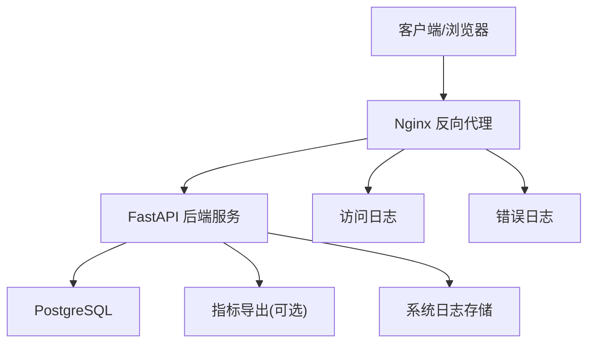
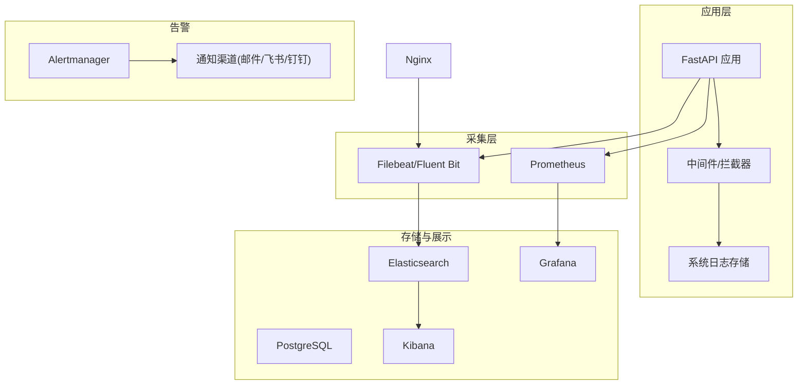
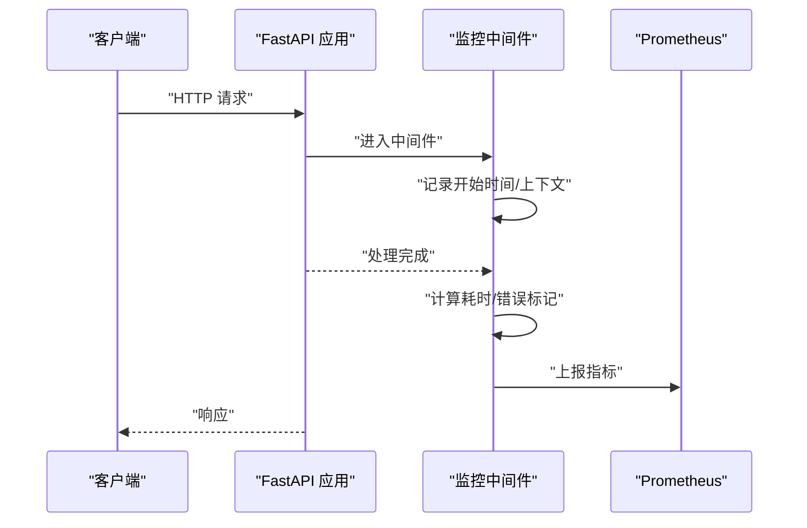
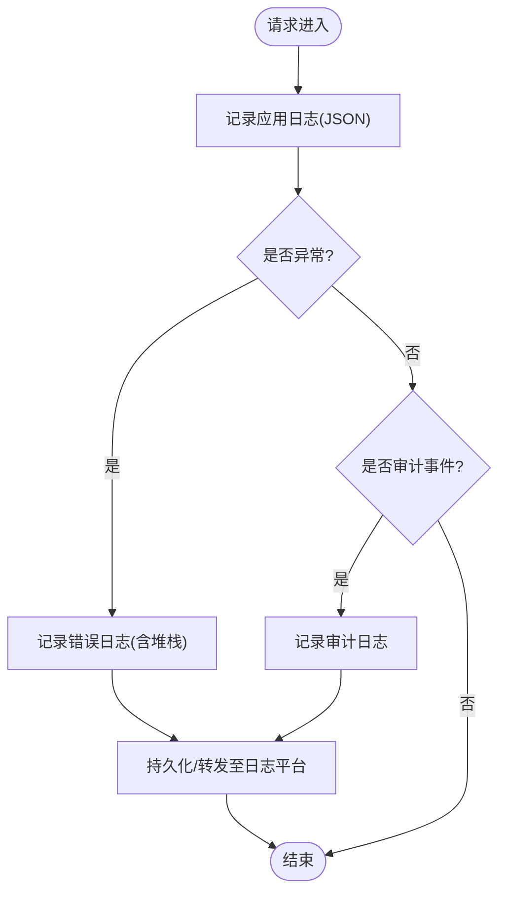
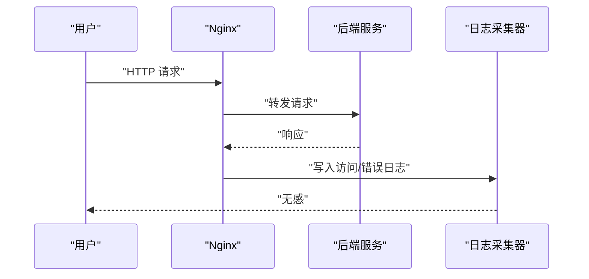
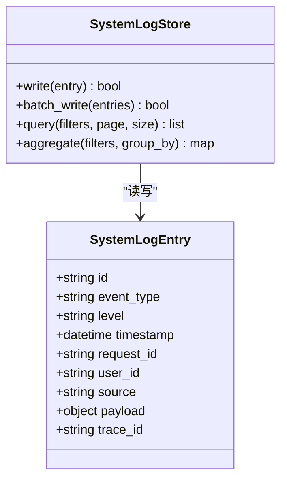
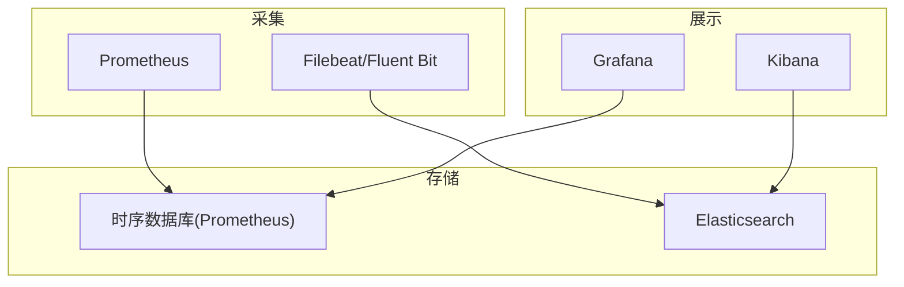
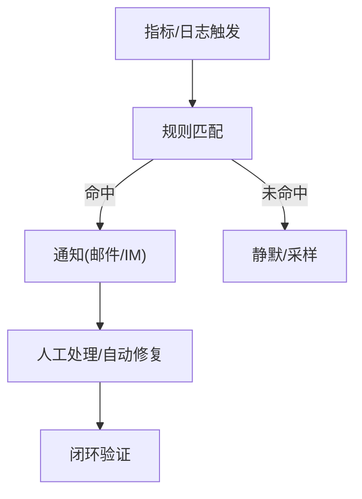
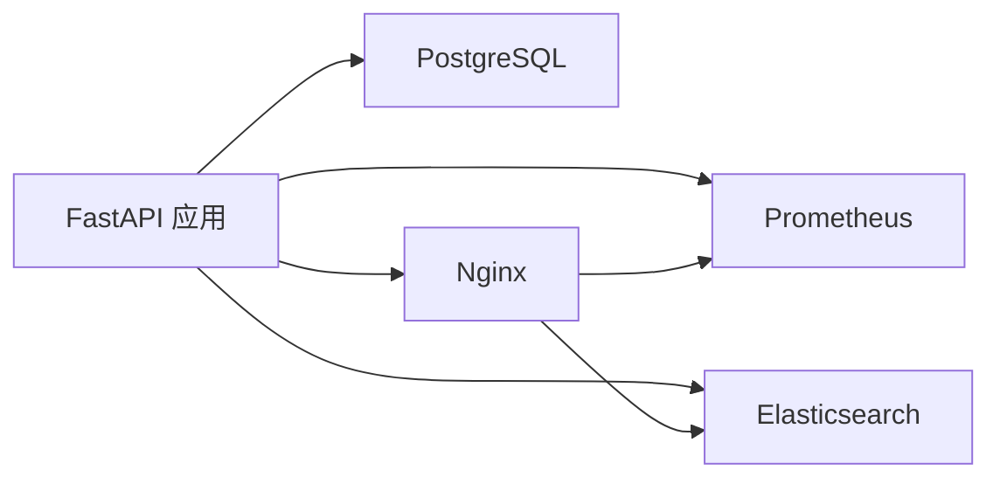

# 监控与日志

<cite>
**本文引用的文件**   
- [backend/app.py](file://backend/app.py)
- [backend/bootstrap.py](file://backend/bootstrap.py)
- [backend/config_manager.py](file://backend/config_manager.py)
- [backend/system_log_store.py](file://backend/system_log_store.py)
- [backend/controllers/system_logs.py](file://backend/controllers/system_logs.py)
- [docker-compose.yml](file://docker-compose.yml)
- [frontend/nginx.conf](file://frontend/nginx.conf)
- [backend/requirements.txt](file://backend/requirements.txt)
</cite>

## 目录
1. [简介](#简介)
2. [项目结构](#项目结构)
3. [核心组件](#核心组件)
4. [架构总览](#架构总览)
5. [详细组件分析](#详细组件分析)
6. [依赖关系分析](#依赖关系分析)
7. [性能考虑](#性能考虑)
8. [故障诊断指南](#故障诊断指南)
9. [结论](#结论)
10. [附录](#附录)

## 简介
本文件为 SmartAsk 智能问数平台的“监控与日志”专项文档，面向运维、研发与产品团队，覆盖以下目标：
- 应用监控方案：关键业务指标、系统资源指标、性能指标采集与可视化。
- 日志管理策略：应用日志、访问日志、错误日志、审计日志的采集、存储与分析。
- 监控工具集成：Prometheus、Grafana、ELK Stack 等工具的部署与配置要点。
- 告警规则：阈值设置、通知渠道与自动化响应建议。
- 故障诊断：日志分析、性能瓶颈定位、错误追踪方法。
- 仪表板与自定义指标：示例与实现路径。
- 日志生命周期：轮转、归档与清理策略。

## 项目结构
SmartAsk 后端基于 Python Web 框架（FastAPI），前端通过 Nginx 反向代理提供服务。监控与日志相关的关键位置如下：
- 后端入口与中间件：应用启动、请求处理链路、健康检查端点。
- 系统日志存储：结构化事件日志持久化与查询接口。
- Nginx 配置：访问日志、错误日志输出格式与路径。
- 容器编排：服务间依赖、端口暴露、环境变量注入。

**图表来源** 
- [backend/app.py](file://backend/app.py)
- [frontend/nginx.conf](file://frontend/nginx.conf)
- [docker-compose.yml](file://docker-compose.yml)

**章节来源**
- [backend/app.py](file://backend/app.py)
- [frontend/nginx.conf](file://frontend/nginx.conf)
- [docker-compose.yml](file://docker-compose.yml)

## 核心组件
- 应用监控
  - 健康检查与健康探针：用于存活探测与就绪判断。
  - 指标采集：QPS、延迟分布、错误率、数据库连接池状态、外部调用耗时。
  - 资源监控：CPU、内存、磁盘、网络 I/O。
- 日志体系
  - 应用日志：结构化 JSON 日志，包含请求上下文、耗时、用户信息。
  - 访问日志：Nginx 访问与错误日志，统一收集到集中式日志平台。
  - 错误日志：异常堆栈、错误码、关联请求 ID。
  - 审计日志：敏感操作记录（登录、权限变更、数据导出）。
- 存储与检索
  - 结构化事件日志持久化（系统日志表）与 API 查询。
  - 集中式日志平台（ELK/EFK）或对象存储 + 索引。
- 告警与可视化
  - Prometheus + Grafana：指标采集与可视化。
  - ELK Stack：日志检索、聚合、告警。

**章节来源**
- [backend/system_log_store.py](file://backend/system_log_store.py)
- [backend/controllers/system_logs.py](file://backend/controllers/system_logs.py)
- [frontend/nginx.conf](file://frontend/nginx.conf)

## 架构总览
整体监控与日志架构采用“边车+集中式”模式：
- 应用侧埋点：在 FastAPI 中间件层采集请求级指标与结构化日志。
- 基础设施侧：Nginx 输出访问/错误日志；容器运行时提供资源指标。
- 采集层：Prometheus 抓取应用指标；Filebeat/Fluent Bit 收集 Nginx 与应用日志。
- 存储与展示：Prometheus/Grafana 负责指标；Elasticsearch/Kibana 负责日志。
- 告警：Alertmanager 与 Kibana 告警联动，支持多渠道通知。

**图表来源** 
- [backend/app.py](file://backend/app.py)
- [backend/system_log_store.py](file://backend/system_log_store.py)
- [frontend/nginx.conf](file://frontend/nginx.conf)
- [docker-compose.yml](file://docker-compose.yml)

## 详细组件分析

### 应用监控与指标采集
- 健康检查端点
  - /health：返回服务存活状态（进程、依赖可用性）。
  - /ready：返回服务就绪状态（数据库、缓存、外部依赖）。
- 指标采集
  - 请求级指标：QPS、P50/P90/P99 延迟、错误率、重试次数。
  - 资源级指标：CPU、内存、GC 停顿、线程池使用率。
  - 业务级指标：问答成功率、SQL 生成成功率、数据集命中率。
- 实现建议
  - 使用标准库或第三方库暴露 /metrics 端点供 Prometheus 抓取。
  - 在中间件层埋点，确保每个请求都有唯一 request_id 并贯穿全链路。

**图表来源** 
- [backend/app.py](file://backend/app.py)

**章节来源**
- [backend/app.py](file://backend/app.py)

### 日志体系与存储
- 日志分类
  - 应用日志：结构化 JSON，包含 level、timestamp、request_id、user_id、module、message、latency_ms、status_code。
  - 访问日志：Nginx access/error log，统一格式便于解析。
  - 错误日志：异常类型、堆栈摘要、关联上下文。
  - 审计日志：操作主体、动作、资源、结果、IP、UA。
- 存储与查询
  - 系统日志表：持久化关键事件，提供查询 API。
  - 集中式日志：ES 索引按天分片，保留策略可配置。
- 实现建议
  - 统一日志门面，避免直接耦合具体实现。
  - 对高吞吐场景采用异步写入与批量提交。

**图表来源** 
- [backend/system_log_store.py](file://backend/system_log_store.py)
- [backend/controllers/system_logs.py](file://backend/controllers/system_logs.py)
- [frontend/nginx.conf](file://frontend/nginx.conf)

**章节来源**
- [backend/system_log_store.py](file://backend/system_log_store.py)
- [backend/controllers/system_logs.py](file://backend/controllers/system_logs.py)
- [frontend/nginx.conf](file://frontend/nginx.conf)

### 访问日志与 Nginx 集成
- 访问日志
  - 启用 access.log 与 error.log，定义统一格式（JSON 或可解析文本）。
  - 将日志路径映射到宿主机或共享卷，供 Filebeat/Fluent Bit 采集。
- 安全与脱敏
  - 过滤敏感字段（密码、Token、身份证号等）。
  - 对 IP 进行匿名化处理（按需）。

**图表来源** 
- [frontend/nginx.conf](file://frontend/nginx.conf)

**章节来源**
- [frontend/nginx.conf](file://frontend/nginx.conf)

### 系统日志 API 与事件模型
- 事件模型
  - 字段：event_type、level、timestamp、request_id、user_id、source、payload、trace_id。
  - 索引：按 event_type、level、timestamp、user_id 建立常用查询索引。
- API 设计
  - 写入接口：批量写入、幂等性保证。
  - 查询接口：条件过滤、分页、排序、聚合统计。
- 存储策略
  - 热数据：近 7 天高性能存储（内存/SSD）。
  - 冷数据：归档到对象存储或压缩备份。

**图表来源** 
- [backend/system_log_store.py](file://backend/system_log_store.py)
- [backend/controllers/system_logs.py](file://backend/controllers/system_logs.py)

**章节来源**
- [backend/system_log_store.py](file://backend/system_log_store.py)
- [backend/controllers/system_logs.py](file://backend/controllers/system_logs.py)

### 监控工具集成（Prometheus、Grafana、ELK）
- Prometheus
  - 暴露 /metrics 端点，配置 scrape 间隔与超时。
  - 指标命名规范：前缀、维度、单位明确。
- Grafana
  - 仪表盘模板：服务健康、QPS、延迟、错误率、资源使用。
  - 变量与筛选：按环境、模块、用户维度过滤。
- ELK Stack
  - Filebeat/Fluent Bit 采集 Nginx 与应用日志。
  - Index Template 与 Ingest Pipeline 标准化字段。
  - Kibana 看板：错误趋势、慢请求、审计事件。

**图表来源** 
- [docker-compose.yml](file://docker-compose.yml)

**章节来源**
- [docker-compose.yml](file://docker-compose.yml)

### 告警规则与自动化响应
- 指标告警
  - 错误率 > 阈值（如 5% 持续 5 分钟）。
  - P99 延迟 > 阈值（如 2s）。
  - 资源使用率 > 阈值（CPU > 80%，内存 > 85%）。
- 日志告警
  - 错误关键字匹配（如 “Exception”、“Timeout”）。
  - 审计异常（如频繁失败登录、越权访问）。
- 通知与自动化
  - Alertmanager 路由到邮件、飞书、钉钉。
  - 自动恢复：重启失败实例、限流降级、熔断隔离。

[此图为概念流程，不绑定具体源码]

### 仪表板与自定义指标
- 推荐仪表板
  - 服务健康：存活/就绪、依赖健康、错误率。
  - 性能：QPS、延迟分布、吞吐、队列长度。
  - 资源：CPU、内存、磁盘、网络。
  - 业务：问答成功率、SQL 生成成功率、数据集命中率。
- 自定义指标
  - 定义指标名称、维度、单位与采集频率。
  - 在中间件或服务层埋点，确保一致性。
  - 在 Grafana 中创建面板与阈值。

[本节为通用指导，不直接分析具体文件]

### 日志轮转、归档与清理
- 轮转策略
  - 按大小/时间切分，保留最近 N 份。
  - 压缩归档，降低存储成本。
- 归档策略
  - 热数据在线，冷数据对象存储。
  - 索引生命周期管理（ILM）自动滚动与删除。
- 清理策略
  - 过期数据自动删除。
  - 敏感数据脱敏与合规清理。

[本节为通用指导，不直接分析具体文件]

## 依赖关系分析
- 外部依赖
  - PostgreSQL：系统日志与业务数据存储。
  - Nginx：反向代理与访问日志。
  - Prometheus/Grafana：指标采集与可视化。
  - Elasticsearch/Kibana：日志存储与检索。
- 内部依赖
  - 中间件与控制器：指标与日志埋点。
  - 系统日志存储与 API：事件持久化与查询。

**图表来源** 
- [backend/app.py](file://backend/app.py)
- [frontend/nginx.conf](file://frontend/nginx.conf)
- [docker-compose.yml](file://docker-compose.yml)

**章节来源**
- [backend/app.py](file://backend/app.py)
- [frontend/nginx.conf](file://frontend/nginx.conf)
- [docker-compose.yml](file://docker-compose.yml)

## 性能考虑
- 指标采集开销
  - 控制采集频率，避免高频上报影响主流程。
  - 使用异步与批量化上报。
- 日志写入优化
  - 异步写入、缓冲队列、批量提交。
  - 避免在热点路径执行重 IO。
- 存储与检索
  - 合理索引与分区，减少扫描范围。
  - 冷热分层，提升查询性能。

[本节为通用指导，不直接分析具体文件]

## 故障诊断指南
- 快速定位
  - 通过 request_id 串联全链路日志与指标。
  - 查看健康检查与依赖状态。
- 错误分析
  - 错误堆栈与上下文信息。
  - 关联最近变更（代码、配置、依赖）。
- 性能瓶颈
  - 慢请求分析（SQL、外部调用、序列化）。
  - 资源争用（CPU、内存、锁竞争）。
- 审计追溯
  - 操作主体、动作、资源、结果。
  - 异常行为检测（频次、来源 IP、UA）。

[本节为通用指导，不直接分析具体文件]

## 结论
通过统一的指标与日志体系，SmartAsk 可实现端到端的可观测性。建议在现有 FastAPI 应用中完善中间件埋点，结合 Nginx 访问日志与集中式日志平台，构建完善的监控、告警与诊断能力。同时制定严格的日志生命周期策略，保障性能与合规。

[本节为总结，不直接分析具体文件]

## 附录
- 配置清单
  - Prometheus scrape 配置、Grafana 仪表盘导入、ELK 索引模板。
- 最佳实践
  - 指标命名规范、日志字段标准、告警分级与降噪。
- 参考脚本与工具
  - 部署脚本、备份与恢复脚本、验证脚本。

[本节为补充信息，不直接分析具体文件]