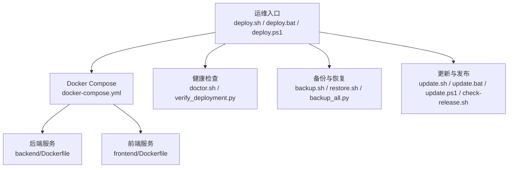
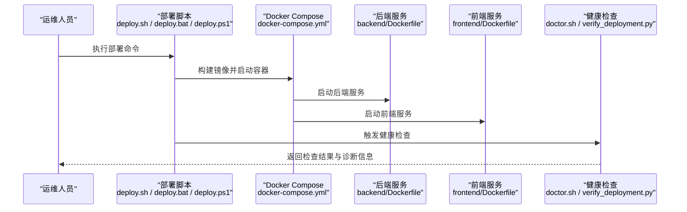
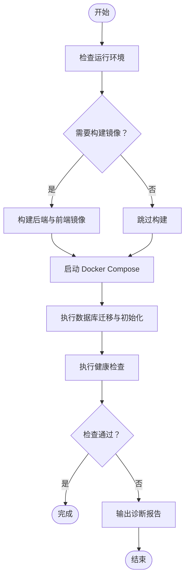
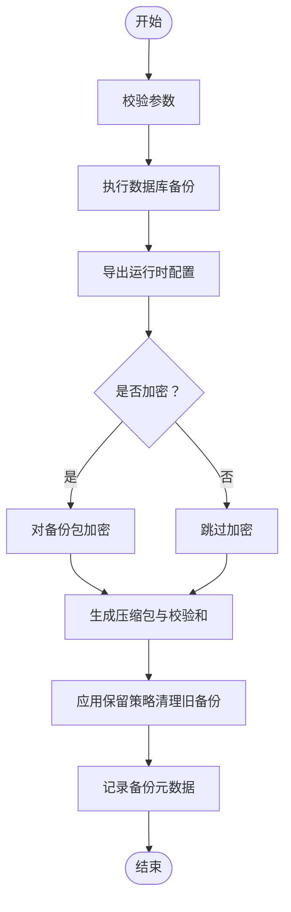
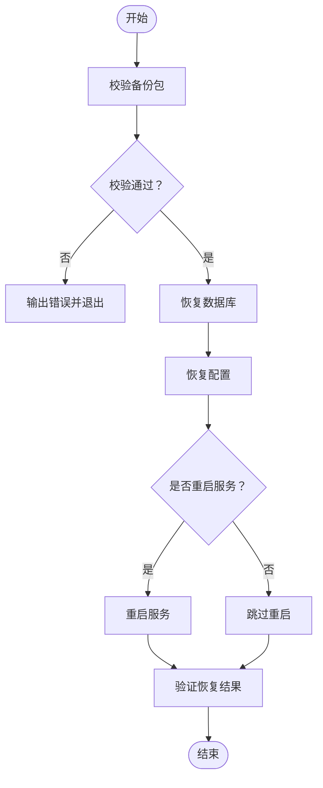
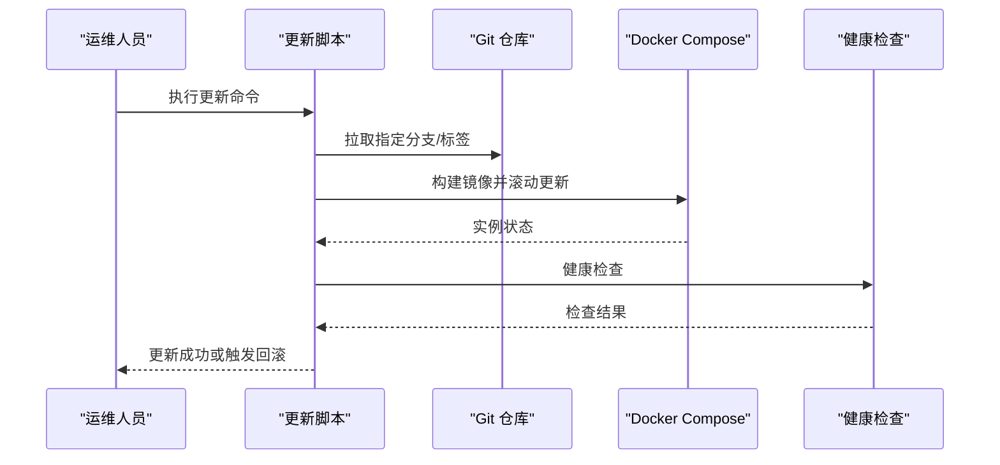
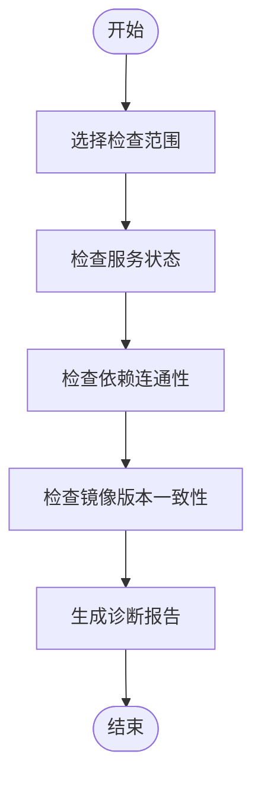
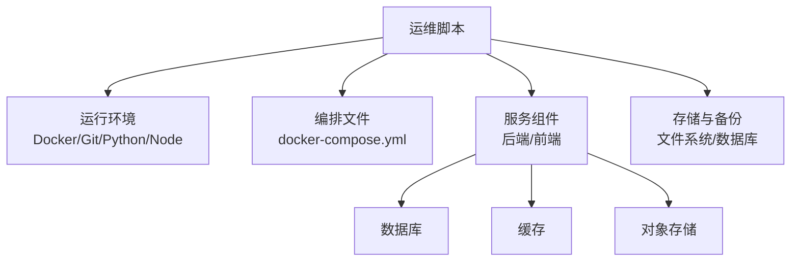

# 运维脚本使用

<cite>
**本文引用的文件**   
- [deploy.sh](file://deploy.sh)
- [backup.sh](file://backup.sh)
- [restore.sh](file://restore.sh)
- [update.sh](file://update.sh)
- [doctor.sh](file://doctor.sh)
- [docker-compose.yml](file://docker-compose.yml)
- [backend/Dockerfile](file://backend/Dockerfile)
- [frontend/Dockerfile](file://frontend/Dockerfile)
- [scripts/verify_deployment.py](file://scripts/verify_deployment.py)
- [scripts/integration_test.py](file://scripts/integration_test.py)
- [scripts/backup_all.py](file://scripts/backup_all.py)
- [scripts/export_runtime_config.py](file://scripts/export_runtime_config.py)
- [scripts/import_runtime_config.py](file://scripts/import_runtime_config.py)
- [scripts/check_report_spec.py](file://scripts/check_report_spec.py)
- [start_backend.bat](file://start_backend.bat)
- [start_frontend.bat](file://start_frontend.bat)
- [start_feishu_sync.bat](file://start_feishu_sync.bat)
- [stop_all.bat](file://stop_all.bat)
- [deploy.bat](file://deploy.bat)
- [deploy.ps1](file://deploy.ps1)
- [update.bat](file://update.bat)
- [update.ps1](file://update.ps1)
- [backup.ps1](file://backup.ps1)
- [reset.ps1](file://reset.ps1)
- [check-release.sh](file://check-release.sh)
</cite>

## 目录
1. [简介](#简介)
2. [项目结构](#项目结构)
3. [核心组件](#核心组件)
4. [架构总览](#架构总览)
5. [详细组件分析](#详细组件分析)
6. [依赖关系分析](#依赖关系分析)
7. [性能考虑](#性能考虑)
8. [故障排除指南](#故障排除指南)
9. [结论](#结论)
10. [附录](#附录)

## 简介
本文件为 SmartAsk 智能问数平台的运维脚本使用文档，覆盖部署、备份、恢复、更新与健康检查等关键运维场景。文档面向运维工程师与平台管理员，提供命令行参数说明、执行示例、权限与环境要求、批量与自动化配置方法、调试与排障指引、定时任务（cron/systemd）配置、版本管理与更新策略，以及自定义运维脚本的开发指南与最佳实践。

## 项目结构
SmartAsk 的运维脚本主要分布在仓库根目录与 scripts 子目录中：
- 根目录脚本：deploy.sh、backup.sh、restore.sh、update.sh、doctor.sh、check-release.sh 及 Windows 批处理/PowerShell 脚本
- Docker 编排：docker-compose.yml
- 后端与前端容器镜像构建：backend/Dockerfile、frontend/Dockerfile
- 辅助 Python 脚本：scripts 目录下的验证、集成测试、备份导出导入等工具

图表来源
- [deploy.sh](file://deploy.sh)
- [docker-compose.yml](file://docker-compose.yml)
- [backend/Dockerfile](file://backend/Dockerfile)
- [frontend/Dockerfile](file://frontend/Dockerfile)
- [doctor.sh](file://doctor.sh)
- [scripts/verify_deployment.py](file://scripts/verify_deployment.py)
- [backup.sh](file://backup.sh)
- [restore.sh](file://restore.sh)
- [scripts/backup_all.py](file://scripts/backup_all.py)
- [update.sh](file://update.sh)
- [update.bat](file://update.bat)
- [update.ps1](file://update.ps1)
- [check-release.sh](file://check-release.sh)

章节来源
- [docker-compose.yml](file://docker-compose.yml)
- [backend/Dockerfile](file://backend/Dockerfile)
- [frontend/Dockerfile](file://frontend/Dockerfile)

## 核心组件
本节概述各运维脚本的职责与典型用法，具体参数与行为以各脚本源码为准。

- 部署脚本
  - Linux/macOS: deploy.sh
  - Windows: deploy.bat、deploy.ps1
  - 作用：拉取代码、构建镜像、启动服务、初始化数据库与基础数据、运行健康检查
  - 常见参数：环境选择（开发/预发/生产）、端口映射、镜像标签、是否跳过构建、是否执行迁移
  - 执行示例：在仓库根目录执行部署脚本并指定环境参数

- 备份脚本
  - Linux/macOS: backup.sh
  - Windows: backup.ps1
  - Python 工具: scripts/backup_all.py
  - 作用：对数据库与关键配置文件进行打包备份，支持按日期命名与保留策略
  - 常见参数：目标路径、压缩格式、保留天数、是否包含日志
  - 执行示例：执行备份脚本并指定输出目录与保留策略

- 恢复脚本
  - Linux/macOS: restore.sh
  - 作用：从备份包恢复数据库与配置，支持校验与回滚提示
  - 常见参数：备份包路径、目标环境、是否强制覆盖、是否重启服务
  - 执行示例：指定备份包路径执行恢复流程

- 更新脚本
  - Linux/macOS: update.sh
  - Windows: update.bat、update.ps1
  - 作用：拉取最新代码、构建镜像、滚动更新服务、回滚到上一版本
  - 常见参数：目标分支或标签、是否灰度更新、是否自动回滚
  - 执行示例：切换到指定分支并执行更新

- 健康检查脚本
  - doctor.sh
  - Python 验证器: scripts/verify_deployment.py
  - 作用：检查服务状态、端口监听、依赖连通性、镜像版本一致性
  - 常见参数：检查范围（全部/仅后端/仅前端）、超时时间、告警级别
  - 执行示例：执行健康检查并输出诊断报告

章节来源
- [deploy.sh](file://deploy.sh)
- [deploy.bat](file://deploy.bat)
- [deploy.ps1](file://deploy.ps1)
- [backup.sh](file://backup.sh)
- [backup.ps1](file://backup.ps1)
- [scripts/backup_all.py](file://scripts/backup_all.py)
- [restore.sh](file://restore.sh)
- [update.sh](file://update.sh)
- [update.bat](file://update.bat)
- [update.ps1](file://update.ps1)
- [doctor.sh](file://doctor.sh)
- [scripts/verify_deployment.py](file://scripts/verify_deployment.py)

## 架构总览
下图展示运维脚本与系统组件的交互关系，包括部署、备份、恢复、更新与健康检查的关键路径。

图表来源
- [deploy.sh](file://deploy.sh)
- [deploy.bat](file://deploy.bat)
- [deploy.ps1](file://deploy.ps1)
- [docker-compose.yml](file://docker-compose.yml)
- [backend/Dockerfile](file://backend/Dockerfile)
- [frontend/Dockerfile](file://frontend/Dockerfile)
- [doctor.sh](file://doctor.sh)
- [scripts/verify_deployment.py](file://scripts/verify_deployment.py)

## 详细组件分析

### 部署脚本（deploy.sh / deploy.bat / deploy.ps1）
- 功能要点
  - 环境准备：检查依赖（Docker、Git、Python、Node.js 等）
  - 镜像构建：根据 Dockerfile 构建后端与前端镜像
  - 服务启动：通过 docker-compose 拉起服务
  - 数据初始化：执行必要的数据库迁移与种子数据
  - 健康检查：调用 doctor.sh 与 verify_deployment.py 验证服务可用性
- 常用参数
  - 环境标识（如 dev/staging/prod）
  - 是否跳过构建（--skip-build）
  - 是否执行迁移（--run-migrations）
  - 端口映射（--ports）
  - 镜像标签（--tag）
- 执行示例
  - Linux/macOS：./deploy.sh --env prod --tag v1.2.3
  - Windows：.\deploy.bat --env staging
  - PowerShell：.\deploy.ps1 --env dev --skip-build

图表来源
- [deploy.sh](file://deploy.sh)
- [deploy.bat](file://deploy.bat)
- [deploy.ps1](file://deploy.ps1)
- [docker-compose.yml](file://docker-compose.yml)
- [backend/Dockerfile](file://backend/Dockerfile)
- [frontend/Dockerfile](file://frontend/Dockerfile)
- [doctor.sh](file://doctor.sh)
- [scripts/verify_deployment.py](file://scripts/verify_deployment.py)

章节来源
- [deploy.sh](file://deploy.sh)
- [deploy.bat](file://deploy.bat)
- [deploy.ps1](file://deploy.ps1)
- [docker-compose.yml](file://docker-compose.yml)
- [backend/Dockerfile](file://backend/Dockerfile)
- [frontend/Dockerfile](file://frontend/Dockerfile)
- [doctor.sh](file://doctor.sh)
- [scripts/verify_deployment.py](file://scripts/verify_deployment.py)

### 备份脚本（backup.sh / backup.ps1 / scripts/backup_all.py）
- 功能要点
  - 数据库备份：对 PostgreSQL 或其他数据库进行逻辑或物理备份
  - 配置备份：导出运行时配置、密钥与敏感信息（加密存储）
  - 归档与保留：按日期生成压缩包，支持保留策略与清理旧备份
  - 完整性校验：生成校验和并记录元数据
- 常用参数
  - 目标路径（--output-dir）
  - 压缩格式（--format tar/gz）
  - 保留天数（--retention-days）
  - 是否包含日志（--include-logs）
  - 加密开关（--encrypt）
- 执行示例
  - Linux/macOS：./backup.sh --output-dir /data/backups --retention-days 30
  - Windows PowerShell：.\backup.ps1 -OutputDir "C:\Backups" -RetentionDays 14

图表来源
- [backup.sh](file://backup.sh)
- [backup.ps1](file://backup.ps1)
- [scripts/backup_all.py](file://scripts/backup_all.py)

章节来源
- [backup.sh](file://backup.sh)
- [backup.ps1](file://backup.ps1)
- [scripts/backup_all.py](file://scripts/backup_all.py)

### 恢复脚本（restore.sh）
- 功能要点
  - 备份包校验：校验压缩包与校验和
  - 数据恢复：还原数据库与配置
  - 服务重启：可选自动重启服务以生效
  - 回滚提示：失败时提供回滚建议
- 常用参数
  - 备份包路径（--backup-file）
  - 目标环境（--env）
  - 强制覆盖（--force）
  - 自动重启（--restart）
- 执行示例
  - ./restore.sh --backup-file /data/backups/20260731.tar.gz --env prod --force

图表来源
- [restore.sh](file://restore.sh)

章节来源
- [restore.sh](file://restore.sh)

### 更新脚本（update.sh / update.bat / update.ps1）
- 功能要点
  - 代码拉取：切换分支或标签
  - 镜像构建：按需构建新镜像
  - 滚动更新：逐步替换实例，避免停机
  - 自动回滚：检测健康失败后回滚到上一版本
- 常用参数
  - 目标分支/标签（--branch/--tag）
  - 灰度比例（--canary-percent）
  - 自动回滚（--auto-rollback）
  - 是否跳过构建（--skip-build）
- 执行示例
  - Linux/macOS：./update.sh --branch main --tag v1.3.0 --auto-rollback
  - Windows：.\update.bat --tag v1.3.0
  - PowerShell：.\update.ps1 --branch develop --canary-percent 20

图表来源
- [update.sh](file://update.sh)
- [update.bat](file://update.bat)
- [update.ps1](file://update.ps1)
- [docker-compose.yml](file://docker-compose.yml)

章节来源
- [update.sh](file://update.sh)
- [update.bat](file://update.bat)
- [update.ps1](file://update.ps1)

### 健康检查脚本（doctor.sh / scripts/verify_deployment.py）
- 功能要点
  - 服务状态：检查进程与端口监听
  - 依赖连通：数据库、缓存、对象存储等
  - 镜像版本：对比期望版本与实际运行版本
  - 诊断报告：输出结构化诊断信息
- 常用参数
  - 检查范围（--scope all/backend/frontend）
  - 超时时间（--timeout）
  - 告警级别（--level info/warn/critical）
- 执行示例
  - ./doctor.sh --scope all --timeout 30s
  - python scripts/verify_deployment.py --env prod

图表来源
- [doctor.sh](file://doctor.sh)
- [scripts/verify_deployment.py](file://scripts/verify_deployment.py)

章节来源
- [doctor.sh](file://doctor.sh)
- [scripts/verify_deployment.py](file://scripts/verify_deployment.py)

### 其他辅助脚本
- 集成测试：scripts/integration_test.py
  - 用途：端到端接口测试与回归验证
  - 参数：测试套件、并发数、超时、输出格式
- 运行时配置导出/导入：scripts/export_runtime_config.py、scripts/import_runtime_config.py
  - 用途：导出/导入运行时配置，便于迁移与同步
  - 参数：输入/输出路径、加密开关、环境过滤
- 报表规格检查：scripts/check_report_spec.py
  - 用途：校验报表定义与依赖一致性
  - 参数：配置文件路径、严格模式、输出报告
- Windows 快速启动：start_backend.bat、start_frontend.bat、start_feishu_sync.bat、stop_all.bat
  - 用途：本地开发与调试的快速启停
- 发布检查：check-release.sh
  - 用途：发布前检查清单（版本号、依赖、许可证等）

章节来源
- [scripts/integration_test.py](file://scripts/integration_test.py)
- [scripts/export_runtime_config.py](file://scripts/export_runtime_config.py)
- [scripts/import_runtime_config.py](file://scripts/import_runtime_config.py)
- [scripts/check_report_spec.py](file://scripts/check_report_spec.py)
- [start_backend.bat](file://start_backend.bat)
- [start_frontend.bat](file://start_frontend.bat)
- [start_feishu_sync.bat](file://start_feishu_sync.bat)
- [stop_all.bat](file://stop_all.bat)
- [check-release.sh](file://check-release.sh)

## 依赖关系分析
- 运行环境依赖
  - Docker 与 Docker Compose：用于容器化部署与服务编排
  - Git：代码拉取与版本管理
  - Python 与 Node.js：部分脚本与前端构建依赖
  - 操作系统：Linux/macOS 使用 shell 脚本；Windows 使用批处理/PowerShell
- 组件耦合
  - 部署脚本依赖 docker-compose.yml 的服务定义
  - 健康检查脚本依赖后端与前端服务的暴露端口与探针
  - 备份/恢复脚本依赖数据库驱动与文件系统权限
  - 更新脚本依赖 Git 仓库与镜像仓库访问权限

图表来源
- [docker-compose.yml](file://docker-compose.yml)
- [backend/Dockerfile](file://backend/Dockerfile)
- [frontend/Dockerfile](file://frontend/Dockerfile)

章节来源
- [docker-compose.yml](file://docker-compose.yml)
- [backend/Dockerfile](file://backend/Dockerfile)
- [frontend/Dockerfile](file://frontend/Dockerfile)

## 性能考虑
- 构建优化
  - 使用多阶段构建减少镜像体积
  - 缓存依赖层，避免重复安装
  - 并行构建后端与前端镜像
- 部署优化
  - 滚动更新避免全量停机
  - 灰度发布降低风险
  - 资源限制与请求限流
- 备份优化
  - 增量备份减少 I/O 压力
  - 压缩与并行写入提升吞吐
  - 异步校验与上报元数据

[本节为通用指导，不直接分析具体文件]

## 故障排除指南
- 常见问题定位
  - 服务无法启动：检查端口占用、环境变量、镜像版本
  - 健康检查失败：查看诊断报告与依赖连通性
  - 备份失败：确认磁盘空间、权限与数据库连接
  - 恢复失败：校验备份包完整性与版本兼容性
- 调试技巧
  - 启用详细日志与调试模式
  - 分步执行脚本并观察中间状态
  - 使用容器日志与系统日志聚合
- 回滚策略
  - 更新失败自动回滚到上一版本
  - 备份包保留策略确保可恢复
  - 配置变更需具备一键回滚能力

章节来源
- [doctor.sh](file://doctor.sh)
- [scripts/verify_deployment.py](file://scripts/verify_deployment.py)
- [backup.sh](file://backup.sh)
- [restore.sh](file://restore.sh)
- [update.sh](file://update.sh)

## 结论
SmartAsk 的运维脚本体系覆盖了部署、备份、恢复、更新与健康检查等核心场景，结合 Docker 与 docker-compose 实现标准化与可重复的运维流程。通过完善的参数设计、健康检查与回滚机制，保障系统在稳定与高效的前提下持续演进。建议在生产环境中严格遵循权限与环境要求，配合定时任务与监控告警，形成闭环的运维自动化体系。

[本节为总结性内容，不直接分析具体文件]

## 附录

### 权限与环境要求
- 用户权限
  - Linux/macOS：建议使用非 root 用户，授予 sudo 必要命令权限
  - Windows：以管理员身份运行批处理/PowerShell 脚本
- 依赖环境
  - Docker 与 Docker Compose：已安装且服务正常运行
  - Git：已安装并可访问代码仓库
  - Python/Node.js：根据脚本需求安装对应版本
- 网络与存储
  - 确保内网/外网访问镜像仓库与依赖服务
  - 备份目录具备足够空间与读写权限

[本节为通用指导，不直接分析具体文件]

### 批量操作与自动化任务
- cron 作业
  - 每日备份：0 2 * * * /path/to/backup.sh --output-dir /data/backups --retention-days 30
  - 每周健康检查：0 8 * * 1 /path/to/doctor.sh --scope all --level critical
- systemd 服务
  - 将更新脚本封装为 service，设置开机自启与失败重启
  - 使用 ExecStart 与 EnvironmentFile 管理参数与环境变量
- 流水线集成
  - CI/CD 中集成部署与测试脚本
  - 发布前执行 check-release.sh 与集成测试

[本节为通用指导，不直接分析具体文件]

### 版本管理与更新策略
- 版本规范
  - 语义化版本（主.次.修订）
  - 分支策略（main/develop/release/*）
  - 标签与镜像标签一致
- 更新策略
  - 灰度发布与蓝绿部署
  - 自动回滚与健康检查联动
  - 变更日志与回滚预案

[本节为通用指导，不直接分析具体文件]

### 自定义运维脚本开发指南与最佳实践
- 设计原则
  - 单一职责：每个脚本聚焦一个运维任务
  - 参数化：所有可变项通过参数或环境变量注入
  - 幂等性：重复执行不会产生副作用
  - 可观测性：输出结构化日志与指标
- 编码规范
  - 错误处理：捕获异常并输出明确错误信息
  - 返回值：使用退出码表示成功/失败
  - 文档：脚本头部注释与帮助信息
- 测试与验证
  - 单元测试与集成测试
  - 模拟环境与沙箱验证
  - 回归测试与性能基准

[本节为通用指导，不直接分析具体文件]