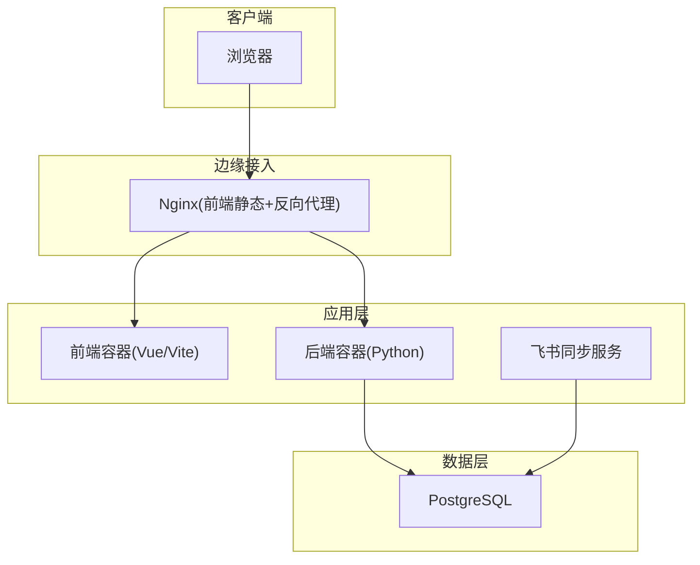
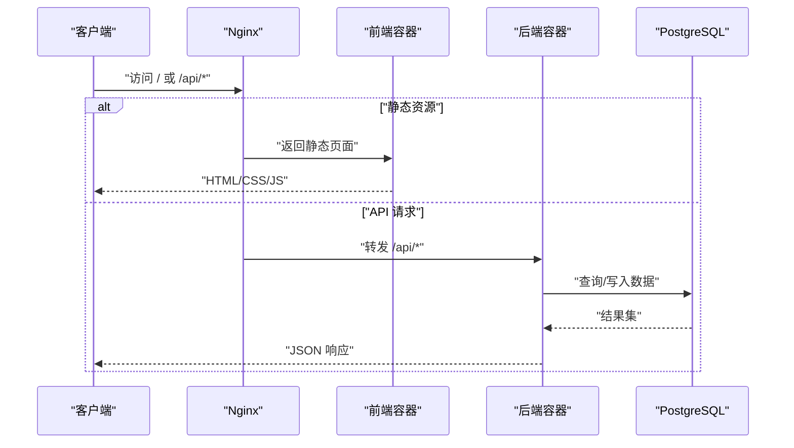
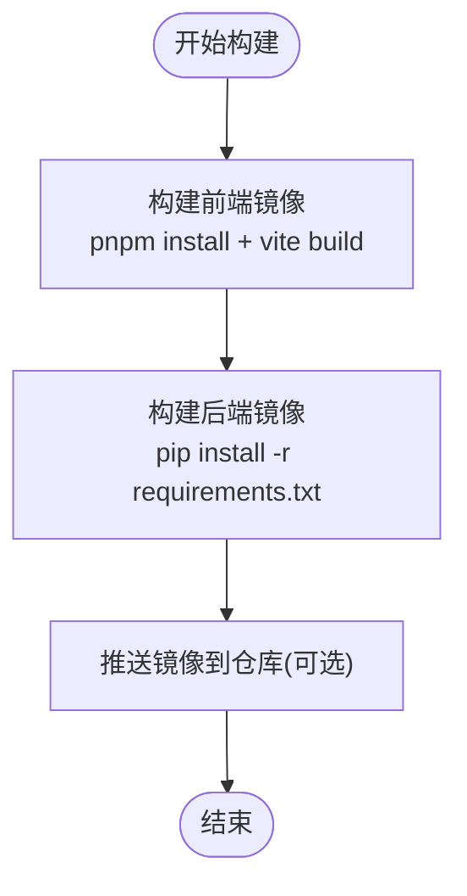
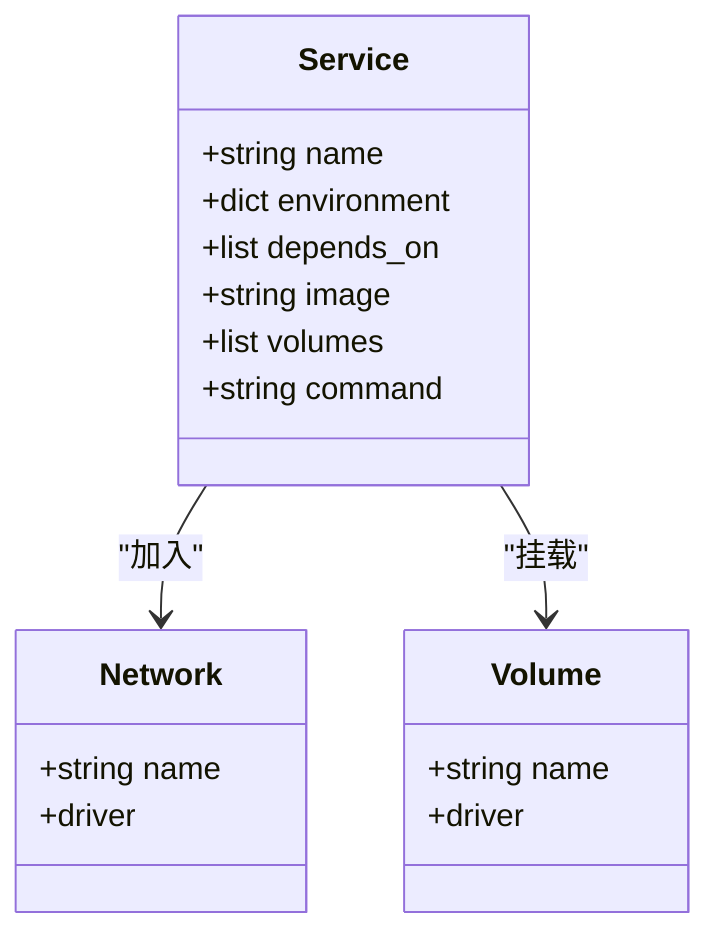
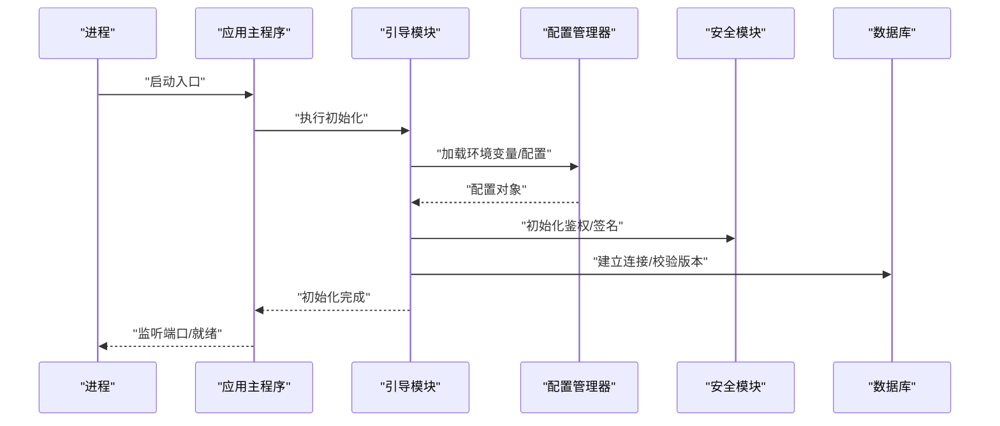
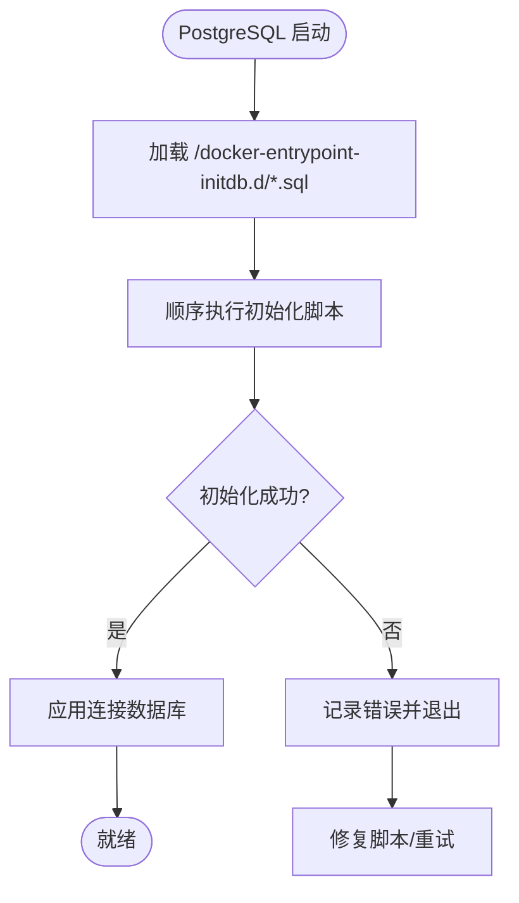
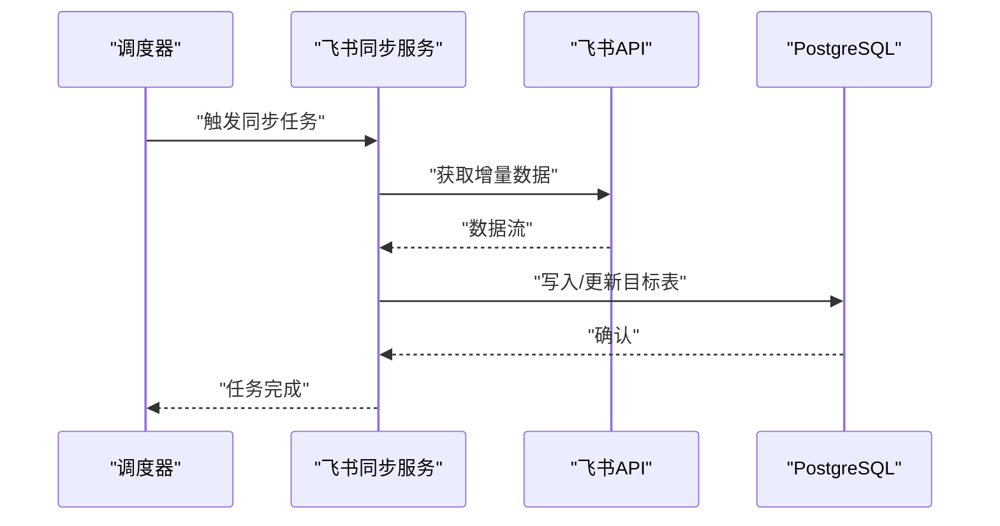
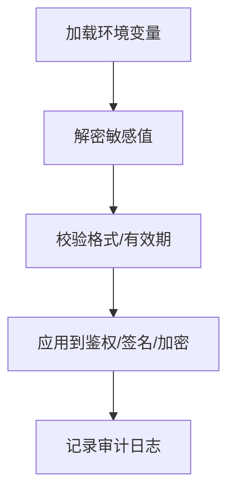
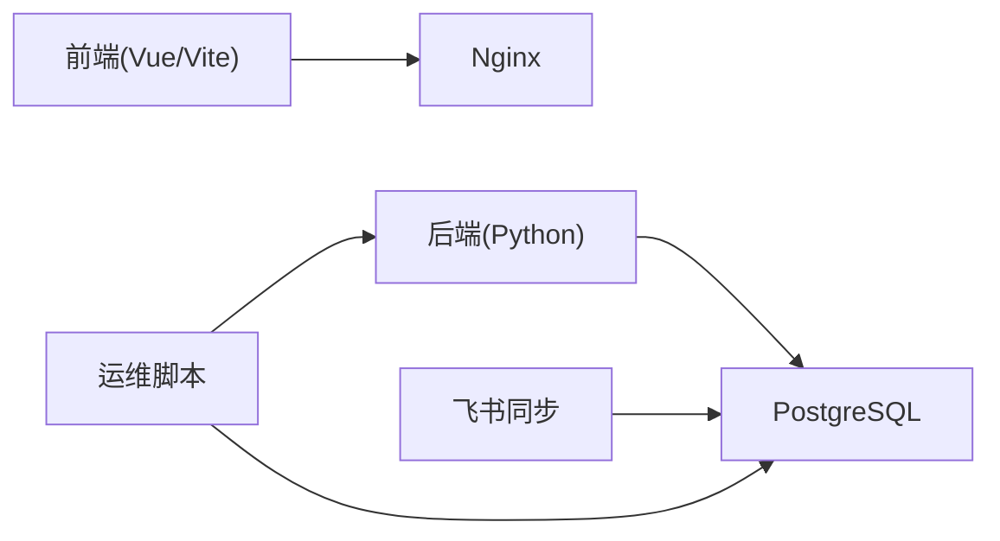

# 部署与运维

<cite>
**本文引用的文件**   
- [docker-compose.yml](file://docker-compose.yml)
- [backend/Dockerfile](file://backend/Dockerfile)
- [frontend/Dockerfile](file://frontend/Dockerfile)
- [backend/app.py](file://backend/app.py)
- [backend/bootstrap.py](file://backend/bootstrap.py)
- [backend/config_manager.py](file://backend/config_manager.py)
- [backend/secret_codec.py](file://backend/secret_codec.py)
- [backend/security.py](file://backend/security.py)
- [backend/encrypt_env_secrets.py](file://backend/encrypt_env_secrets.py)
- [backend/start_feishu_sync.py](file://backend/start_feishu_sync.py)
- [scripts/backup_all.py](file://scripts/backup_all.py)
- [scripts/verify_deployment.py](file://scripts/verify_deployment.py)
- [scripts/integration_test.py](file://scripts/integration_test.py)
- [scripts/export_runtime_config.py](file://scripts/export_runtime_config.py)
- [scripts/import_runtime_config.py](file://scripts/import_runtime_config.py)
- [scripts/check_report_spec.py](file://scripts/check_report_spec.py)
- [deploy.sh](file://deploy.sh)
- [update.sh](file://update.sh)
- [restore.sh](file://restore.sh)
- [backup.sh](file://backup.sh)
- [doctor.sh](file://doctor.sh)
- [start_backend.bat](file://start_backend.bat)
- [start_frontend.bat](file://start_frontend.bat)
- [start_feishu_sync.bat](file://start_feishu_sync.bat)
- [stop_all.bat](file://stop_all.bat)
- [update.bat](file://update.bat)
- [deploy.bat](file://deploy.bat)
- [deploy.ps1](file://deploy.ps1)
- [update.ps1](file://update.ps1)
- [reset.ps1](file://reset.ps1)
- [doctor.ps1](file://doctor.ps1)
- [nginx.conf](file://frontend/nginx.conf)
- [vite.config.js](file://frontend/vite.config.js)
- [package.json](file://frontend/package.json)
- [requirements.txt](file://backend/requirements.txt)
- [.dockerignore](file://.dockerignore)
- [backend/.dockerignore](file://backend/.dockerignore)
- [frontend/.dockerignore](file://frontend/.dockerignore)
- [docker/postgres/init/001_bookshelf_schema.sql](file://docker/postgres/init/001_bookshelf_schema.sql)
- [docker/postgres/init/002_angel_group_data.sql](file://docker/postgres/init/002_angel_group_data.sql)
- [docker/postgres/init/003_bookshelf_agent1_prompt_upgrade.sql](file://docker/postgres/init/003_bookshelf_agent1_prompt_upgrade.sql)
- [docker/postgres/init/004_report_config.sql](file://docker/postgres/init/004_report_config.sql)
- [docker/postgres/init/005_report_thresholds.sql](file://docker/postgres/init/005_report_thresholds.sql)
- [docker/postgres/init/006_system_event_logs.sql](file://docker/postgres/init/006_system_event_logs.sql)
</cite>

## 目录
1. [简介](#简介)
2. [项目结构](#项目结构)
3. [核心组件](#核心组件)
4. [架构总览](#架构总览)
5. [详细组件分析](#详细组件分析)
6. [依赖关系分析](#依赖关系分析)
7. [性能考虑](#性能考虑)
8. [故障排查指南](#故障排查指南)
9. [结论](#结论)
10. [附录](#附录)

## 简介
本文件为 SmartAsk 智能问数平台的部署与运维手册，覆盖容器化镜像构建、Docker Compose 编排、服务依赖管理、环境搭建、生产高可用与负载均衡、数据备份与灾难恢复、监控与日志、运维脚本使用、安全加固、常见问题与性能调优，以及多环境配置示例与最佳实践。文档面向运维工程师与平台管理员，兼顾非技术读者的可理解性。

## 项目结构
SmartAsk 采用前后端分离架构：
- 后端：Python 应用（FastAPI/Flask 风格），提供 API、权限控制、飞书同步、报告生成等能力。
- 前端：Vue/Vite 构建的 Web 界面，通过 Nginx 静态资源托管或反向代理。
- 数据库：PostgreSQL，初始化脚本位于 docker/postgres/init。
- 编排：docker-compose.yml 统一编排后端、前端、Nginx、PostgreSQL 等服务。
- 脚本：提供部署、升级、备份、恢复、健康检查、集成测试等自动化脚本。

图表来源
- [docker-compose.yml](file://docker-compose.yml)
- [frontend/nginx.conf](file://frontend/nginx.conf)
- [backend/app.py](file://backend/app.py)

章节来源
- [docker-compose.yml](file://docker-compose.yml)
- [frontend/Dockerfile](file://frontend/Dockerfile)
- [backend/Dockerfile](file://backend/Dockerfile)
- [requirements.txt](file://backend/requirements.txt)
- [package.json](file://frontend/package.json)

## 核心组件
- 后端应用：负责业务逻辑、鉴权、数据源路由、报表配置、系统日志、飞书同步等。入口与启动流程由应用主程序与引导模块协同完成。
- 前端应用：用户交互界面，通过 Vite 构建并交由 Nginx 提供服务。
- 数据库：PostgreSQL，包含书架、报表配置、系统事件日志等初始化 SQL。
- 编排与运行：docker-compose 定义服务网络、卷挂载、环境变量；各服务 Dockerfile 定义镜像构建过程。
- 运维脚本：涵盖部署、升级、备份、恢复、诊断、集成测试、运行时配置导入导出等。

章节来源
- [backend/app.py](file://backend/app.py)
- [backend/bootstrap.py](file://backend/bootstrap.py)
- [backend/config_manager.py](file://backend/config_manager.py)
- [backend/start_feishu_sync.py](file://backend/start_feishu_sync.py)
- [frontend/nginx.conf](file://frontend/nginx.conf)
- [docker/postgres/init/001_bookshelf_schema.sql](file://docker/postgres/init/001_bookshelf_schema.sql)

## 架构总览
SmartAsk 的整体部署拓扑如下：
- 外部流量经 Nginx 进入，静态资源由前端容器提供，API 请求转发至后端容器。
- 后端通过环境变量加载配置，连接 PostgreSQL 读写数据。
- 可选的飞书同步服务独立运行，按策略同步数据。
- 所有持久化数据通过卷挂载到宿主机，便于备份与迁移。

图表来源
- [frontend/nginx.conf](file://frontend/nginx.conf)
- [backend/app.py](file://backend/app.py)
- [docker-compose.yml](file://docker-compose.yml)

## 详细组件分析

### 容器镜像构建
- 后端镜像：基于 Python 基础镜像，安装依赖、复制代码、暴露端口、设置启动命令。
- 前端镜像：基于 Node 构建产物，使用 Nginx 作为静态服务器。
- .dockerignore：排除不必要的文件，减小镜像体积。

图表来源
- [frontend/Dockerfile](file://frontend/Dockerfile)
- [backend/Dockerfile](file://backend/Dockerfile)
- [frontend/.dockerignore](file://frontend/.dockerignore)
- [backend/.dockerignore](file://backend/.dockerignore)
- [requirements.txt](file://backend/requirements.txt)
- [package.json](file://frontend/package.json)

章节来源
- [frontend/Dockerfile](file://frontend/Dockerfile)
- [backend/Dockerfile](file://backend/Dockerfile)
- [frontend/.dockerignore](file://frontend/.dockerignore)
- [backend/.dockerignore](file://backend/.dockerignore)
- [requirements.txt](file://backend/requirements.txt)
- [package.json](file://frontend/package.json)

### 服务编排与环境变量
- docker-compose.yml 定义服务、网络、卷、环境变量、依赖关系与健康检查。
- 关键环境变量包括数据库连接、密钥、功能开关、日志级别等。
- 卷挂载用于持久化数据库与配置文件。

图表来源
- [docker-compose.yml](file://docker-compose.yml)

章节来源
- [docker-compose.yml](file://docker-compose.yml)

### 后端启动与配置加载
- 应用主程序负责注册路由、中间件、错误处理、健康检查等。
- 引导模块负责初始化配置、数据库连接、缓存、权限系统等。
- 配置管理器从环境变量与配置文件加载参数，支持加密密钥解码。
- 安全模块提供鉴权、签名、限流等能力。

图表来源
- [backend/app.py](file://backend/app.py)
- [backend/bootstrap.py](file://backend/bootstrap.py)
- [backend/config_manager.py](file://backend/config_manager.py)
- [backend/security.py](file://backend/security.py)

章节来源
- [backend/app.py](file://backend/app.py)
- [backend/bootstrap.py](file://backend/bootstrap.py)
- [backend/config_manager.py](file://backend/config_manager.py)
- [backend/security.py](file://backend/security.py)

### 数据库初始化与迁移
- PostgreSQL 初始化脚本包含书架模式、天使组数据、报表配置、阈值、系统事件日志等。
- 首次启动时，PostgreSQL 容器自动执行 init 目录下的 SQL。
- 后续可通过迁移脚本或导入工具更新结构与数据。

图表来源
- [docker/postgres/init/001_bookshelf_schema.sql](file://docker/postgres/init/001_bookshelf_schema.sql)
- [docker/postgres/init/002_angel_group_data.sql](file://docker/postgres/init/002_angel_group_data.sql)
- [docker/postgres/init/003_bookshelf_agent1_prompt_upgrade.sql](file://docker/postgres/init/003_bookshelf_agent1_prompt_upgrade.sql)
- [docker/postgres/init/004_report_config.sql](file://docker/postgres/init/004_report_config.sql)
- [docker/postgres/init/005_report_thresholds.sql](file://docker/postgres/init/005_report_thresholds.sql)
- [docker/postgres/init/006_system_event_logs.sql](file://docker/postgres/init/006_system_event_logs.sql)

章节来源
- [docker/postgres/init/001_bookshelf_schema.sql](file://docker/postgres/init/001_bookshelf_schema.sql)
- [docker/postgres/init/002_angel_group_data.sql](file://docker/postgres/init/002_angel_group_data.sql)
- [docker/postgres/init/003_bookshelf_agent1_prompt_upgrade.sql](file://docker/postgres/init/003_bookshelf_agent1_prompt_upgrade.sql)
- [docker/postgres/init/004_report_config.sql](file://docker/postgres/init/004_report_config.sql)
- [docker/postgres/init/005_report_thresholds.sql](file://docker/postgres/init/005_report_thresholds.sql)
- [docker/postgres/init/006_system_event_logs.sql](file://docker/postgres/init/006_system_event_logs.sql)

### 飞书同步服务
- 独立的飞书同步服务按策略拉取或推送数据，避免阻塞主业务流程。
- 通过环境变量配置认证、目标表、调度频率等。
- 可与主应用共享数据库连接。

图表来源
- [backend/start_feishu_sync.py](file://backend/start_feishu_sync.py)

章节来源
- [backend/start_feishu_sync.py](file://backend/start_feishu_sync.py)

### 安全与密钥管理
- 安全模块提供鉴权、签名、限流等能力。
- 密钥编码与解密工具支持环境变量中的敏感信息加密存储与运行时解密。
- 建议在生产环境启用 HTTPS、最小权限原则、审计日志。

图表来源
- [backend/security.py](file://backend/security.py)
- [backend/secret_codec.py](file://backend/secret_codec.py)
- [backend/encrypt_env_secrets.py](file://backend/encrypt_env_secrets.py)

章节来源
- [backend/security.py](file://backend/security.py)
- [backend/secret_codec.py](file://backend/secret_codec.py)
- [backend/encrypt_env_secrets.py](file://backend/encrypt_env_secrets.py)

## 依赖关系分析
- 后端依赖：Python 包（requirements.txt）、PostgreSQL、可选的外部 API（如飞书）。
- 前端依赖：Node/pnpm、Vite、Vue 生态。
- 编排依赖：Docker、docker-compose。
- 运维依赖：Shell/PowerShell 脚本、数据库客户端、日志采集工具。

图表来源
- [requirements.txt](file://backend/requirements.txt)
- [package.json](file://frontend/package.json)
- [docker-compose.yml](file://docker-compose.yml)

章节来源
- [requirements.txt](file://backend/requirements.txt)
- [package.json](file://frontend/package.json)
- [docker-compose.yml](file://docker-compose.yml)

## 性能考虑
- 容器资源限制：为后端与数据库设置 CPU/内存上限，避免争用。
- 连接池：合理配置数据库连接池大小与超时时间。
- 静态资源优化：前端开启 Gzip/Brotli，CDN 加速。
- 缓存策略：热点数据引入 Redis（可选）或应用内缓存。
- 异步处理：将耗时任务（如报表生成、飞书同步）放入队列或独立服务。
- 监控指标：收集 QPS、延迟、错误率、CPU/内存、数据库慢查询。

[本节为通用指导，不直接分析具体文件]

## 故障排查指南
- 健康检查：使用 verify_deployment 脚本验证服务状态与连通性。
- 日志定位：查看容器日志与应用日志，结合错误码与堆栈信息。
- 数据库问题：检查连接字符串、权限、初始化脚本执行结果。
- 网络问题：确认防火墙、端口映射、域名解析与证书。
- 性能瓶颈：分析慢查询、GC 停顿、线程阻塞、I/O 等待。

章节来源
- [scripts/verify_deployment.py](file://scripts/verify_deployment.py)
- [scripts/integration_test.py](file://scripts/integration_test.py)

## 结论
SmartAsk 采用容器化与编排方式实现快速部署与弹性扩展。通过明确的环境变量、初始化脚本与运维脚本，可实现标准化的上线流程。生产环境应重点关注高可用、安全加固、监控告警与备份恢复，确保系统的稳定性与可维护性。

[本节为总结，不直接分析具体文件]

## 附录

### 环境搭建与服务器要求
- 硬件建议：至少 4C8G（开发），生产建议 8C16G 以上，磁盘 SSD。
- 软件依赖：Docker、docker-compose、Git、Node/pnpm（仅构建前端镜像时使用）。
- 环境变量：数据库连接、密钥、功能开关、日志级别、外部服务地址等。
- 数据库初始化：首次启动自动执行 init SQL，后续通过迁移脚本更新。

章节来源
- [docker-compose.yml](file://docker-compose.yml)
- [docker/postgres/init/001_bookshelf_schema.sql](file://docker/postgres/init/001_bookshelf_schema.sql)

### 生产部署策略
- 负载均衡：Nginx 或云负载均衡器分发流量，多实例后端横向扩展。
- 高可用：数据库主从或集群，应用无状态化，会话外置。
- 数据备份：定期全量与增量备份，异地容灾。
- 灾难恢复：演练恢复流程，确保 RTO/RPO 达标。

章节来源
- [docker-compose.yml](file://docker-compose.yml)
- [backup.sh](file://backup.sh)
- [restore.sh](file://restore.sh)

### 监控与日志收集
- 应用监控：健康检查接口、指标暴露、错误追踪。
- 性能指标：QPS、延迟、错误率、资源使用、数据库慢查询。
- 日志收集：集中式日志（ELK/Loki），结构化输出，分级过滤。
- 告警配置：阈值告警、异常告警、容量告警。

[本节为通用指导，不直接分析具体文件]

### 运维脚本使用方法
- 启动/停止：
  - Linux/macOS：deploy.sh、update.sh、backup.sh、restore.sh、doctor.sh
  - Windows：deploy.bat、update.bat、start_backend.bat、start_frontend.bat、start_feishu_sync.bat、stop_all.bat
  - PowerShell：deploy.ps1、update.ps1、reset.ps1、doctor.ps1
- 版本升级：update.sh/update.bat 进行滚动升级，回滚策略见脚本说明。
- 数据备份：backup.sh 执行全量/增量备份，保留策略与路径可配置。
- 故障排查：doctor.sh/doctor.ps1 进行健康检查与诊断。

章节来源
- [deploy.sh](file://deploy.sh)
- [update.sh](file://update.sh)
- [backup.sh](file://backup.sh)
- [restore.sh](file://restore.sh)
- [doctor.sh](file://doctor.sh)
- [deploy.bat](file://deploy.bat)
- [update.bat](file://update.bat)
- [start_backend.bat](file://start_backend.bat)
- [start_frontend.bat](file://start_frontend.bat)
- [start_feishu_sync.bat](file://start_feishu_sync.bat)
- [stop_all.bat](file://stop_all.bat)
- [deploy.ps1](file://deploy.ps1)
- [update.ps1](file://update.ps1)
- [reset.ps1](file://reset.ps1)
- [doctor.ps1](file://doctor.ps1)

### 安全加固措施
- 网络安全：启用 TLS/HTTPS，最小开放端口，ACL 白名单。
- 访问控制：RBAC、最小权限、强密码策略、会话安全。
- 数据加密：传输加密、存储加密、密钥轮换。
- 审计日志：操作审计、访问审计、合规留存。

章节来源
- [backend/security.py](file://backend/security.py)
- [backend/secret_codec.py](file://backend/secret_codec.py)
- [backend/encrypt_env_secrets.py](file://backend/encrypt_env_secrets.py)

### 常见问题解决方案
- 启动失败：检查环境变量、端口占用、依赖安装、镜像版本。
- 数据库连接失败：核对连接串、权限、网络可达、SSL 配置。
- 前端无法访问：确认 Nginx 配置、静态资源路径、域名解析。
- 性能下降：分析慢查询、缓存命中率、GC 与线程池。

章节来源
- [scripts/verify_deployment.py](file://scripts/verify_deployment.py)
- [scripts/integration_test.py](file://scripts/integration_test.py)

### 不同部署环境的配置示例与最佳实践
- 开发环境：单节点、最小配置、调试日志、本地数据库。
- 测试环境：隔离网络、模拟外部依赖、自动化测试。
- 预生产环境：接近生产配置、压测与灰度发布。
- 生产环境：多副本、负载均衡、监控告警、备份恢复、安全加固。

章节来源
- [docker-compose.yml](file://docker-compose.yml)
- [frontend/nginx.conf](file://frontend/nginx.conf)
- [backend/config_manager.py](file://backend/config_manager.py)

### 运行时配置导入导出
- 导出运行时配置：export_runtime_config.py
- 导入运行时配置：import_runtime_config.py
- 报表规格检查：check_report_spec.py

章节来源
- [scripts/export_runtime_config.py](file://scripts/export_runtime_config.py)
- [scripts/import_runtime_config.py](file://scripts/import_runtime_config.py)
- [scripts/check_report_spec.py](file://scripts/check_report_spec.py)