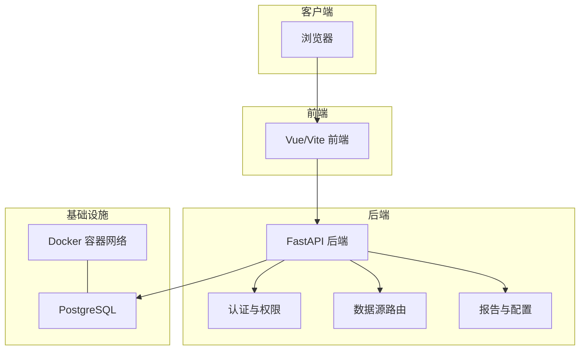
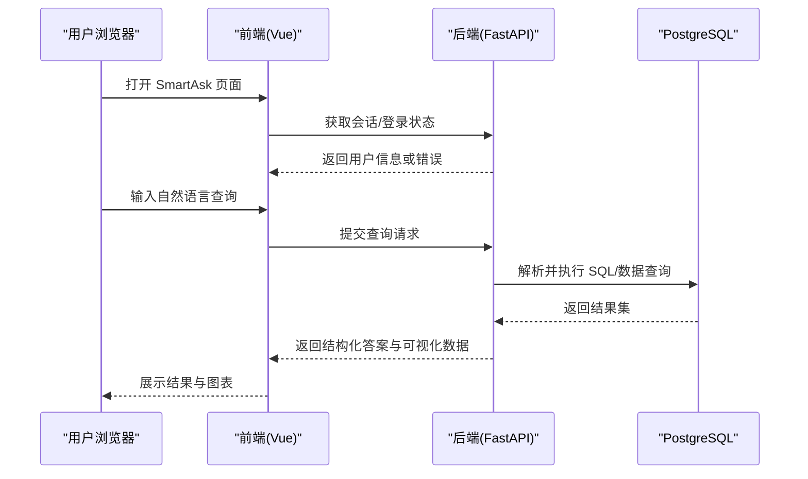
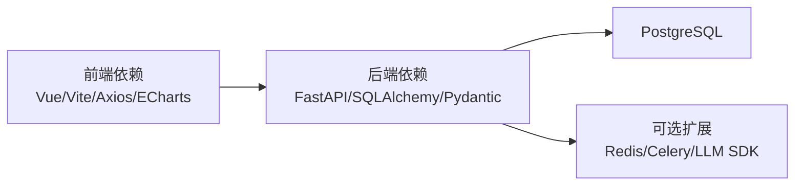

# 快速开始指南

<cite>
**本文引用的文件**   
- [README.md](file://README.md)
- [docker-compose.yml](file://docker-compose.yml)
- [backend/app.py](file://backend/app.py)
- [backend/requirements.txt](file://backend/requirements.txt)
- [frontend/package.json](file://frontend/package.json)
- [frontend/vite.config.js](file://frontend/vite.config.js)
- [deploy.sh](file://deploy.sh)
- [start_all.bat](file://start_all.bat)
- [start_backend.bat](file://start_backend.bat)
- [start_frontend.bat](file://start_frontend.bat)
- [stop_all.bat](file://stop_all.bat)
- [doctor.sh](file://doctor.sh)
- [doctor.ps1](file://doctor.ps1)
- [backup.sh](file://backup.sh)
- [update.sh](file://update.sh)
- [docker/postgres/init/001_bookshelf_schema.sql](file://docker/postgres/init/001_bookshelf_schema.sql)
</cite>

## 目录
1. [简介](#简介)
2. [项目结构](#项目结构)
3. [核心组件](#核心组件)
4. [架构总览](#架构总览)
5. [详细组件分析](#详细组件分析)
6. [依赖分析](#依赖分析)
7. [性能考虑](#性能考虑)
8. [故障排除指南](#故障排除指南)
9. [结论](#结论)
10. [附录](#附录)

## 简介
本指南面向首次接触 SmartAsk 智能问数平台的用户，目标是帮助你在 15 分钟内完成环境准备、本地搭建与第一个自然语言查询的完整流程。内容涵盖：
- 前置条件清单（操作系统、Python、Node.js、Docker）
- 本地开发环境搭建步骤（克隆代码、安装依赖、环境变量、数据库初始化）
- 一键启动脚本使用方法（Windows/Linux）
- 基础配置项说明与示例
- 从登录到执行第一个查询的端到端流程
- 常见安装问题与解决方案

## 项目结构
SmartAsk 采用前后端分离架构：
- 后端：Python FastAPI 应用，提供 REST API、权限控制、数据源路由、报告配置等能力
- 前端：Vue 3 + Vite 构建，提供对话式问答界面与管理控制台
- 数据层：PostgreSQL 作为主存储，通过 Docker Compose 统一编排
- 运维脚本：提供一键部署、更新、备份、健康检查等常用操作

图表来源
- [docker-compose.yml](file://docker-compose.yml)
- [backend/app.py](file://backend/app.py)
- [frontend/package.json](file://frontend/package.json)
- [frontend/vite.config.js](file://frontend/vite.config.js)

章节来源
- [README.md](file://README.md)
- [docker-compose.yml](file://docker-compose.yml)

## 核心组件
- 后端服务：基于 FastAPI 的 Web 服务，负责请求路由、业务逻辑、鉴权、数据源访问、报告生成等
- 前端界面：Vue 3 + Vite，提供聊天式问答、数据集管理、报表配置、系统管理等页面
- 数据库：PostgreSQL，包含书架、报表配置、系统日志等初始表结构与样例数据
- 运行编排：Docker Compose 统一管理前后端与数据库容器

章节来源
- [backend/app.py](file://backend/app.py)
- [frontend/package.json](file://frontend/package.json)
- [docker/postgres/init/001_bookshelf_schema.sql](file://docker/postgres/init/001_bookshelf_schema.sql)

## 架构总览
下图展示了从浏览器发起请求到数据库返回结果的典型调用链，以及容器化部署的网络关系。

图表来源
- [backend/app.py](file://backend/app.py)
- [frontend/package.json](file://frontend/package.json)
- [docker-compose.yml](file://docker-compose.yml)

## 详细组件分析

### 环境与前置条件
- 操作系统：支持主流 Windows、macOS、Linux
- Python：建议 3.10+（用于后端开发与测试）
- Node.js：建议 18+（用于前端开发与构建）
- Docker：建议使用 Docker Desktop（含 Docker Compose）
- 端口占用：默认后端 8000、前端 5173、数据库 5432（可在配置中调整）

章节来源
- [backend/requirements.txt](file://backend/requirements.txt)
- [frontend/package.json](file://frontend/package.json)
- [docker-compose.yml](file://docker-compose.yml)

### 本地开发环境搭建（推荐：Docker 一键启动）
- 克隆仓库后，进入项目根目录
- 使用 Docker Compose 启动所有服务（后端、前端、数据库）
- 等待容器就绪后，在浏览器访问前端地址
- 首次登录可使用内置管理员账号（详见 README）

章节来源
- [docker-compose.yml](file://docker-compose.yml)
- [README.md](file://README.md)

### 本地开发环境搭建（纯本地模式）
- 安装 Python 与 Node.js 依赖
- 初始化 PostgreSQL 数据库（可手动或使用 Docker 镜像）
- 配置后端环境变量（数据库连接、JWT 密钥、第三方服务等）
- 分别启动后端与前端服务

章节来源
- [backend/requirements.txt](file://backend/requirements.txt)
- [frontend/package.json](file://frontend/package.json)
- [backend/app.py](file://backend/app.py)

### 一键启动脚本使用方法
- Windows：
  - 双击 start_all.bat 启动全部服务
  - 单独启动后端：start_backend.bat
  - 单独启动前端：start_frontend.bat
  - 停止全部服务：stop_all.bat
- Linux/macOS：
  - 执行 deploy.sh 进行一键部署与启动
  - 使用 doctor.sh 进行环境诊断
  - 使用 update.sh 拉取最新代码并重建服务

章节来源
- [start_all.bat](file://start_all.bat)
- [start_backend.bat](file://start_backend.bat)
- [start_frontend.bat](file://start_frontend.bat)
- [stop_all.bat](file://stop_all.bat)
- [deploy.sh](file://deploy.sh)
- [doctor.sh](file://doctor.sh)
- [update.sh](file://update.sh)

### 基础配置与环境变量
- 数据库连接：主机、端口、用户名、密码、库名
- JWT 相关：签名密钥、过期时间
- 第三方服务：如飞书集成、模型服务 URL 等
- 前端代理：开发模式下将 /api 请求转发至后端

章节来源
- [backend/app.py](file://backend/app.py)
- [frontend/vite.config.js](file://frontend/vite.config.js)
- [docker-compose.yml](file://docker-compose.yml)

### 第一个查询完整流程（从登录到成功执行）
- 打开前端页面，使用管理员账号登录
- 在聊天框输入自然语言问题（例如“查看本月销售额”）
- 后端解析意图、生成 SQL、执行查询并返回结果
- 前端渲染答案与图表，支持进一步追问

章节来源
- [backend/app.py](file://backend/app.py)
- [frontend/package.json](file://frontend/package.json)
- [docker/postgres/init/001_bookshelf_schema.sql](file://docker/postgres/init/001_bookshelf_schema.sql)

## 依赖分析
- 后端依赖：FastAPI、SQLAlchemy、Pydantic、Jinja2、OpenAI SDK（可选）、各种数据源驱动等
- 前端依赖：Vue 3、Vite、Axios、ECharts（图表）等
- 运行时依赖：Docker、PostgreSQL、可选的 Redis/Celery（扩展场景）

图表来源
- [backend/requirements.txt](file://backend/requirements.txt)
- [frontend/package.json](file://frontend/package.json)
- [docker-compose.yml](file://docker-compose.yml)

章节来源
- [backend/requirements.txt](file://backend/requirements.txt)
- [frontend/package.json](file://frontend/package.json)

## 性能考虑
- 数据库连接池：合理设置连接数与超时，避免连接耗尽
- 查询优化：为常用字段建立索引，避免全表扫描
- 缓存策略：对热点数据启用缓存（如 Redis），降低数据库压力
- 前端渲染：大数据集分页加载与虚拟滚动，提升交互体验
- 异步任务：耗时任务（如报表生成）放入队列异步处理

[本节为通用指导，不直接分析具体文件]

## 故障排除指南
- 端口冲突：修改 docker-compose.yml 或 vite.config.js 中的端口映射
- 数据库连接失败：检查环境变量中的数据库连接参数是否正确
- 前端无法访问后端：确认 vite.config.js 的代理配置与后端服务是否启动
- 权限或登录异常：检查 JWT 密钥与用户表数据是否初始化
- 第三方服务不可用：核对 API Key 与网络连通性

章节来源
- [docker-compose.yml](file://docker-compose.yml)
- [frontend/vite.config.js](file://frontend/vite.config.js)
- [backend/app.py](file://backend/app.py)

## 结论
通过本指南，你可以在 15 分钟内完成 SmartAsk 的环境准备与本地搭建，并使用第一个自然语言查询验证平台功能。后续可根据业务需求扩展数据源、权限模型与报表配置。

[本节为总结性内容，不直接分析具体文件]

## 附录
- 备份与恢复：使用 backup.sh 与 restore.sh 进行数据备份与恢复
- 健康检查：使用 doctor.sh 与 doctor.ps1 进行环境诊断
- 更新与升级：使用 update.sh 与 update.ps1 拉取最新代码并重建服务

章节来源
- [backup.sh](file://backup.sh)
- [doctor.sh](file://doctor.sh)
- [doctor.ps1](file://doctor.ps1)
- [update.sh](file://update.sh)