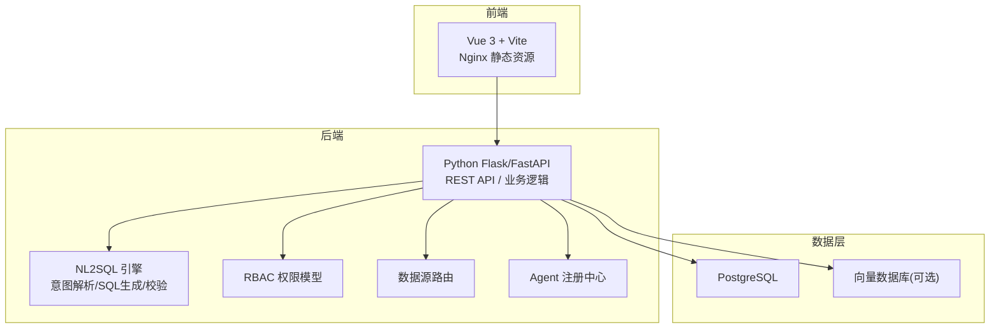
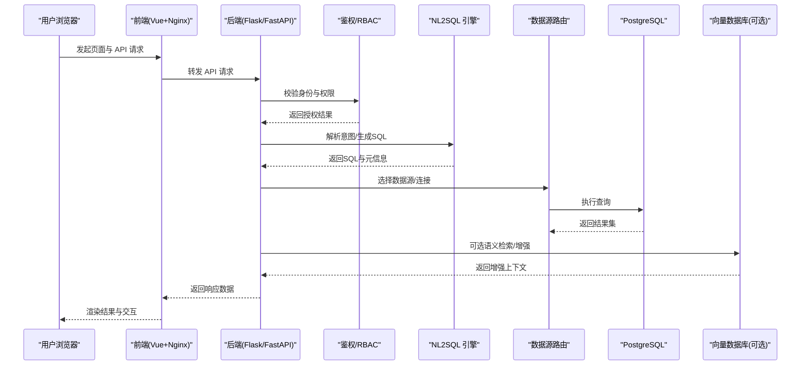
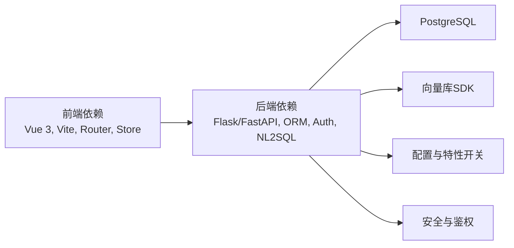

# 技术栈概览

<cite>
**本文引用的文件**   
- [backend/app.py](file://backend/app.py)
- [backend/requirements.txt](file://backend/requirements.txt)
- [backend/Dockerfile](file://backend/Dockerfile)
- [docker-compose.yml](file://docker-compose.yml)
- [frontend/package.json](file://frontend/package.json)
- [frontend/vite.config.js](file://frontend/vite.config.js)
- [frontend/Dockerfile](file://frontend/Dockerfile)
- [frontend/nginx.conf](file://frontend/nginx.conf)
- [docker/postgres/init/001_bookshelf_schema.sql](file://docker/postgres/init/001_bookshelf_schema.sql)
- [backend/controllers/rbac.py](file://backend/controllers/rbac.py)
- [backend/auth_store.py](file://backend/auth_store.py)
- [backend/data_permission_store.py](file://backend/data_permission_store.py)
- [backend/smartask_advanced/service.py](file://backend/smartask_advanced/service.py)
- [backend/smartask_basic/service.py](file://backend/smartask_basic/service.py)
- [backend/datasource_router.py](file://backend/datasource_router.py)
- [backend/agent_registry.py](file://backend/agent_registry.py)
- [backend/organization_route_resolver.py](file://backend/organization_route_resolver.py)
- [backend/feature_flags.py](file://backend/feature_flags.py)
- [backend/config_manager.py](file://backend/config_manager.py)
- [backend/security.py](file://backend/security.py)
- [backend/bookshelf_repository.py](file://backend/bookshelf_repository.py)
- [backend/runtime_migration.py](file://backend/runtime_migration.py)
</cite>

## 目录
1. [简介](#简介)
2. [项目结构](#项目结构)
3. [核心组件](#核心组件)
4. [架构总览](#架构总览)
5. [详细组件分析](#详细组件分析)
6. [依赖关系分析](#依赖关系分析)
7. [性能考量](#性能考量)
8. [故障排查指南](#故障排查指南)
9. [结论](#结论)
10. [附录](#附录)

## 简介
本技术栈概览面向 SmartAsk 智能问数平台，系统采用前后端分离架构：后端基于 Python（Flask/FastAPI）提供 REST API、权限与数据路由、NL2SQL 引擎编排与执行；前端基于 Vue.js 3 + Vite 构建现代化交互界面；持久化层使用 PostgreSQL。容器化通过 Docker + docker-compose 实现一键部署与可重复环境。文档覆盖架构设计、关键组件（NL2SQL、向量数据库集成、RBAC、实时通信）、版本兼容性与依赖关系、架构图与数据流、选型考量及学习路径。

## 项目结构
- 后端 backend：Python 应用，包含控制器、服务、迁移脚本、Docker 镜像构建配置等。
- 前端 frontend：Vue 3 + Vite 工程，Nginx 静态资源托管，Docker 镜像构建配置。
- 基础设施 docker/postgres：PostgreSQL 初始化 SQL。
- 编排 docker-compose.yml：统一编排后端、前端、数据库等服务。

图表来源
- [backend/app.py:1-200](file://backend/app.py#L1-L200)
- [frontend/vite.config.js:1-200](file://frontend/vite.config.js#L1-L200)
- [docker-compose.yml:1-200](file://docker-compose.yml#L1-L200)

章节来源
- [backend/app.py:1-200](file://backend/app.py#L1-L200)
- [frontend/package.json:1-200](file://frontend/package.json#L1-L200)
- [docker-compose.yml:1-200](file://docker-compose.yml#L1-L200)

## 核心组件
- 后端框架与入口
  - Flask/FastAPI 作为 Web 框架，暴露 REST API，承载鉴权、路由、业务编排与结果返回。
  - 入口模块负责应用初始化、中间件挂载、路由注册与生命周期管理。
- 前端工程
  - Vue 3 + Vite 构建，模块化组件与状态管理，Nginx 反向代理与静态资源优化。
- 数据库与迁移
  - PostgreSQL 作为主存储，支持事务、复杂查询与扩展生态；迁移脚本用于 schema 演进。
- 容器化与编排
  - Docker 镜像封装运行环境与依赖，docker-compose 定义多服务编排与网络、卷挂载。
- 关键能力
  - NL2SQL 引擎：自然语言到 SQL 的转换、校验与执行。
  - 向量数据库集成：语义检索与增强提示。
  - RBAC 权限模型：角色-资源-操作细粒度控制。
  - 实时通信机制：事件推送与执行进度反馈（如 SSE/WebSocket）。

章节来源
- [backend/app.py:1-200](file://backend/app.py#L1-L200)
- [frontend/vite.config.js:1-200](file://frontend/vite.config.js#L1-L200)
- [docker/postgres/init/001_bookshelf_schema.sql:1-200](file://docker/postgres/init/001_bookshelf_schema.sql#L1-L200)
- [docker-compose.yml:1-200](file://docker-compose.yml#L1-L200)

## 架构总览
SmartAsk 的整体架构由前端、后端、数据库与可选向量库组成。前端通过 Nginx 提供静态资源并转发 API 请求至后端；后端通过路由分发到各控制器与服务，调用 NL2SQL 引擎生成 SQL，经数据源路由访问 PostgreSQL，必要时结合向量库进行语义增强；权限由 RBAC 控制，安全策略贯穿请求链路。

图表来源
- [backend/app.py:1-200](file://backend/app.py#L1-L200)
- [backend/controllers/rbac.py:1-200](file://backend/controllers/rbac.py#L1-L200)
- [backend/datasource_router.py:1-200](file://backend/datasource_router.py#L1-L200)
- [backend/smartask_advanced/service.py:1-200](file://backend/smartask_advanced/service.py#L1-L200)
- [backend/smartask_basic/service.py:1-200](file://backend/smartask_basic/service.py#L1-L200)

## 详细组件分析

### 后端框架与入口（Flask/FastAPI）
- 职责
  - 应用初始化、中间件注册、路由装配、错误处理、健康检查。
  - 对外暴露 REST API，统一鉴权与日志记录。
- 关键点
  - 启动流程与生命周期钩子。
  - 配置加载与环境变量注入。
  - 跨域与安全头设置。

章节来源
- [backend/app.py:1-200](file://backend/app.py#L1-L200)
- [backend/config_manager.py:1-200](file://backend/config_manager.py#L1-L200)
- [backend/security.py:1-200](file://backend/security.py#L1-L200)

### 前端工程（Vue 3 + Vite）
- 职责
  - 页面与组件组织、状态管理、API 调用、路由与权限守卫。
  - 构建优化与开发体验提升。
- 关键点
  - Vite 插件与代理配置。
  - 环境变量与特性开关。
  - Nginx 反向代理与缓存策略。

章节来源
- [frontend/package.json:1-200](file://frontend/package.json#L1-L200)
- [frontend/vite.config.js:1-200](file://frontend/vite.config.js#L1-L200)
- [frontend/nginx.conf:1-200](file://frontend/nginx.conf#L1-L200)

### 数据库与迁移（PostgreSQL）
- 职责
  - 结构化数据存储、事务与并发控制、索引优化。
  - 迁移脚本管理 schema 演进与数据初始化。
- 关键点
  - 初始 schema 与示例数据。
  - 迁移顺序与回滚策略。
  - 连接池与慢查询治理。

章节来源
- [docker/postgres/init/001_bookshelf_schema.sql:1-200](file://docker/postgres/init/001_bookshelf_schema.sql#L1-L200)
- [backend/runtime_migration.py:1-200](file://backend/runtime_migration.py#L1-L200)

### 容器化与编排（Docker + docker-compose）
- 职责
  - 构建前后端镜像，隔离依赖与环境。
  - 定义服务间网络、端口映射、卷挂载与启动顺序。
- 关键点
  - 多阶段构建与镜像瘦身。
  - 环境变量注入与密钥管理。
  - 健康检查与重启策略。

章节来源
- [backend/Dockerfile:1-200](file://backend/Dockerfile#L1-L200)
- [frontend/Dockerfile:1-200](file://frontend/Dockerfile#L1-L200)
- [docker-compose.yml:1-200](file://docker-compose.yml#L1-L200)

### NL2SQL 引擎
- 职责
  - 意图识别、实体抽取、SQL 生成与校验、结果解释。
  - 与数据源路由协作，确保 SQL 在正确库/表上执行。
- 关键点
  - 基础版与进阶版服务分层。
  - 规则与 LLM 协同生成策略。
  - 质量评估与回溯调试。

章节来源
- [backend/smartask_basic/service.py:1-200](file://backend/smartask_basic/service.py#L1-200)
- [backend/smartask_advanced/service.py:1-200](file://backend/smartask_advanced/service.py#L1-200)
- [backend/datasource_router.py:1-200](file://backend/datasource_router.py#L1-200)

### 向量数据库集成
- 职责
  - 文本向量化与相似度检索，增强提示与答案召回。
  - 与 NL2SQL 流程结合，提高意图理解与实体消歧。
- 关键点
  - 嵌入模型选择与批量更新。
  - 索引结构与检索策略。
  - 失败降级与缓存策略。

章节来源
- [backend/smartask_advanced/service.py:1-200](file://backend/smartask_advanced/service.py#L1-200)

### RBAC 权限模型
- 职责
  - 用户-角色-资源-操作的权限控制，支持菜单、按钮与数据级权限。
  - 鉴权中间件与接口级保护。
- 关键点
  - 权限存储与缓存。
  - 动态权限加载与刷新。
  - 审计与日志追踪。

章节来源
- [backend/controllers/rbac.py:1-200](file://backend/controllers/rbac.py#L1-200)
- [backend/auth_store.py:1-200](file://backend/auth_store.py#L1-200)
- [backend/data_permission_store.py:1-200](file://backend/data_permission_store.py#L1-200)

### 实时通信机制
- 职责
  - 执行进度、日志与结果增量推送，提升用户体验。
  - 支持 SSE 或 WebSocket 长连接。
- 关键点
  - 事件模型与消息序列化。
  - 断线重连与幂等性。
  - 服务端并发与背压控制。

章节来源
- [backend/app.py:1-200](file://backend/app.py#L1-200)

### Agent 注册中心与组织路由
- 职责
  - 统一管理各类 Agent 的能力与版本，按需调度。
  - 根据组织树与路由策略选择合适的数据源与执行路径。
- 关键点
  - 注册表与发现机制。
  - 路由优先级与冲突解决。
  - 监控与熔断。

章节来源
- [backend/agent_registry.py:1-200](file://backend/agent_registry.py#L1-200)
- [backend/organization_route_resolver.py:1-200](file://backend/organization_route_resolver.py#L1-200)

### 功能开关与配置管理
- 职责
  - 运行时特性开关与灰度发布。
  - 集中式配置管理与热更新。
- 关键点
  - 配置项分类与默认值。
  - 权限与审计。
  - 配置变更通知与回滚。

章节来源
- [backend/feature_flags.py:1-200](file://backend/feature_flags.py#L1-200)
- [backend/config_manager.py:1-200](file://backend/config_manager.py#L1-200)

### 书架与运行时迁移
- 职责
  - 知识库/书架资源的导入导出与版本管理。
  - 运行时迁移工具保障平滑升级。
- 关键点
  - 数据一致性校验。
  - 迁移幂等与回滚。
  - 备份与恢复策略。

章节来源
- [backend/bookshelf_repository.py:1-200](file://backend/bookshelf_repository.py#L1-200)
- [backend/runtime_migration.py:1-200](file://backend/runtime_migration.py#L1-200)

## 依赖关系分析
- 后端依赖
  - Web 框架（Flask/FastAPI）、ORM/驱动（PostgreSQL）、鉴权库、日志与监控、NL2SQL 相关库、向量库 SDK。
- 前端依赖
  - Vue 3、Vite、路由与状态管理、HTTP 客户端、UI 组件库。
- 基础设施依赖
  - Docker、docker-compose、Nginx、PostgreSQL。

图表来源
- [backend/requirements.txt:1-200](file://backend/requirements.txt#L1-200)
- [frontend/package.json:1-200](file://frontend/package.json#L1-200)

章节来源
- [backend/requirements.txt:1-200](file://backend/requirements.txt#L1-200)
- [frontend/package.json:1-200](file://frontend/package.json#L1-200)

## 性能考量
- 后端
  - 连接池与异步 I/O，减少阻塞；SQL 执行计划分析与索引优化。
  - 缓存热点数据与结果集，降低数据库压力。
  - 限流与熔断，避免雪崩。
- 前端
  - 代码分割与懒加载，首屏优化。
  - 请求合并与去抖节流，减少无效调用。
- 数据库
  - 读写分离与分库分表规划，冷热数据分层。
  - 慢查询监控与告警。
- 容器化
  - 镜像分层与缓存复用，缩短构建时间。
  - 资源限制与健康检查，保证稳定性。

[本节为通用指导，不直接分析具体文件]

## 故障排查指南
- 常见问题
  - 启动失败：检查环境变量、端口占用、镜像构建产物。
  - 鉴权失败：确认 Token 与权限配置，查看 RBAC 存储。
  - NL2SQL 异常：核对数据源连通性、SQL 语法与权限。
  - 向量检索失败：检查向量库连接与索引状态。
- 定位手段
  - 启用详细日志与链路追踪。
  - 使用健康检查与探针。
  - 回放请求与模拟数据。

章节来源
- [backend/security.py:1-200](file://backend/security.py#L1-200)
- [backend/controllers/rbac.py:1-200](file://backend/controllers/rbac.py#L1-200)
- [backend/datasource_router.py:1-200](file://backend/datasource_router.py#L1-200)

## 结论
SmartAsk 以清晰的前后端分离架构为基础，结合 NL2SQL、向量检索与 RBAC 等关键技术，构建了可扩展、易维护的智能问数平台。容器化与编排提升了交付效率与稳定性。后续可在性能优化、可观测性与多租户方面持续演进。

[本节为总结性内容，不直接分析具体文件]

## 附录

### 技术选型考量
- 后端框架
  - Flask/FastAPI：轻量、生态丰富、易于扩展；FastAPI 适合高并发与类型安全。
- 前端工程
  - Vue 3 + Vite：组件化、生态完善、构建速度快。
- 数据库
  - PostgreSQL：成熟稳定、强一致、扩展性强，适合复杂查询与分析场景。
- 容器化
  - Docker + docker-compose：标准化环境、快速部署、便于运维。
- 性能与可扩展性
  - 微服务拆分、缓存与队列、水平扩展与弹性伸缩。
- 维护成本
  - 代码规范、自动化测试、CI/CD、文档与培训。

[本节为通用指导，不直接分析具体文件]

### 兼容性要求与依赖关系
- 后端
  - Python 版本与依赖包版本锁定于 requirements.txt。
- 前端
  - Node.js 版本与依赖包版本锁定于 package.json。
- 基础设施
  - Docker 与 docker-compose 版本建议与镜像标签对齐。

章节来源
- [backend/requirements.txt:1-200](file://backend/requirements.txt#L1-200)
- [frontend/package.json:1-200](file://frontend/package.json#L1-200)

### 学习路径与资源推荐
- 后端
  - Flask/FastAPI 官方文档、SQLAlchemy 教程、PostgreSQL 最佳实践。
- 前端
  - Vue 3 官方指南、Vite 插件生态、Nginx 配置手册。
- 容器化
  - Docker 入门与最佳实践、docker-compose 编排模式。
- 领域知识
  - NL2SQL 原理与实践、向量检索与嵌入模型、RBAC 权限模型设计。

[本节为通用指导，不直接分析具体文件]