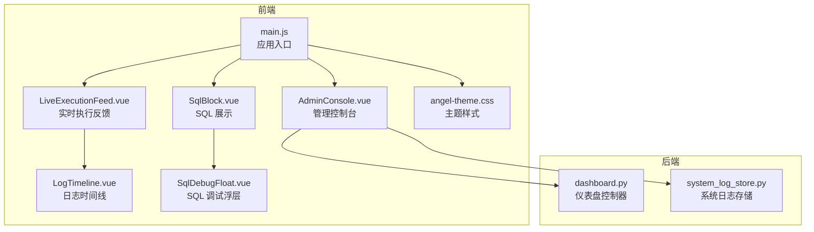
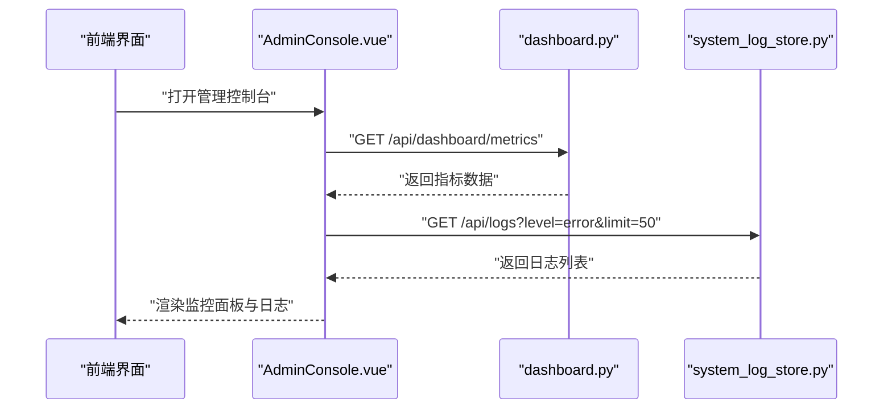
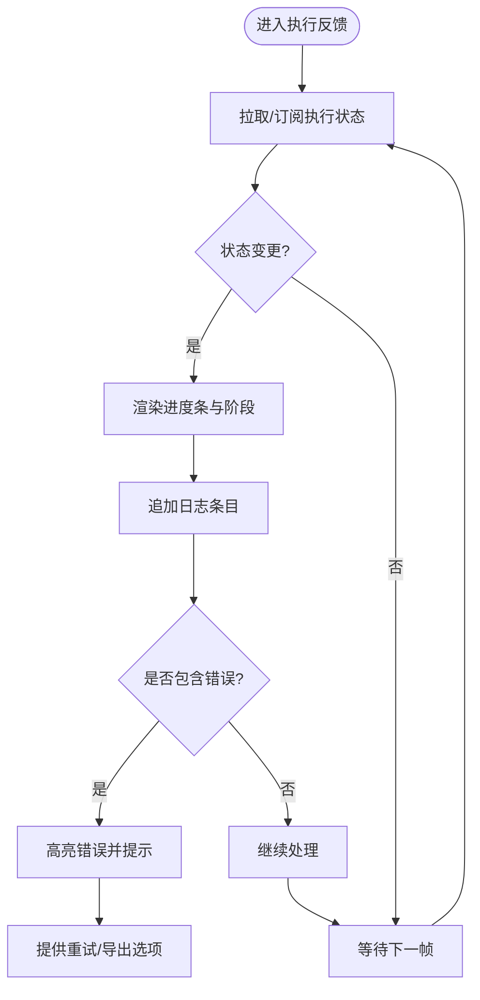
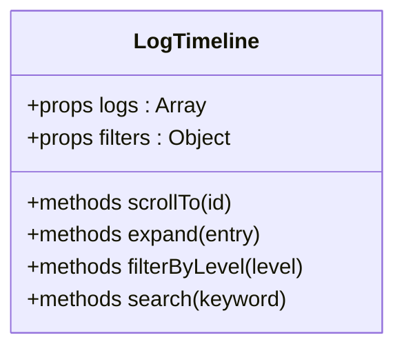
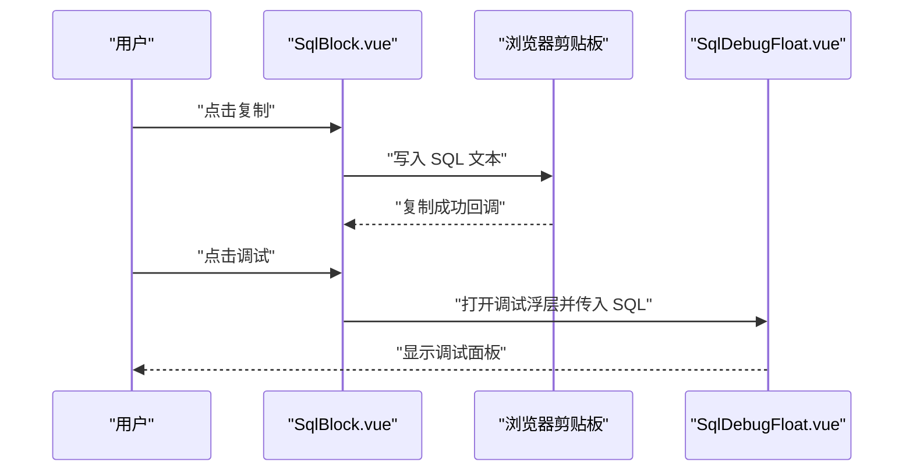
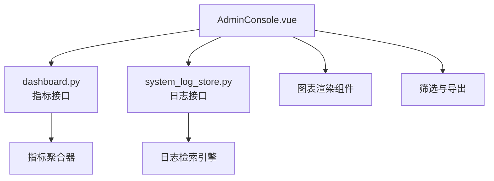
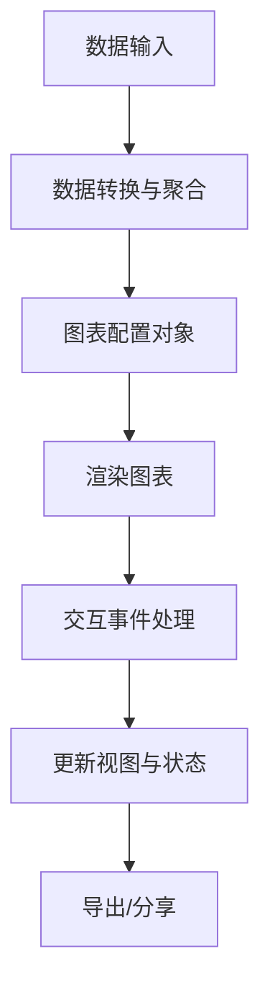
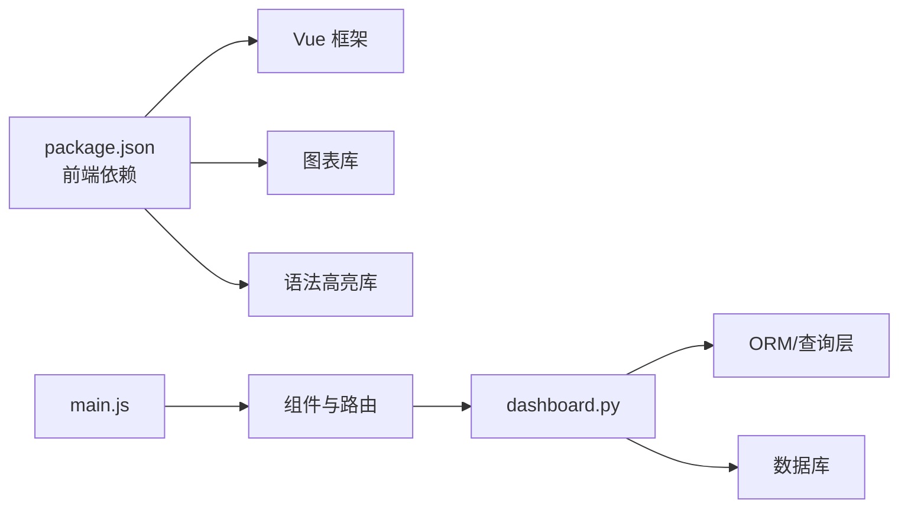

# 可视化与仪表盘

<cite>
**本文引用的文件**   
- [frontend/src/components/smartask/LiveExecutionFeed.vue](file://frontend/src/components/smartask/LiveExecutionFeed.vue)
- [frontend/src/components/smartask/LogTimeline.vue](file://frontend/src/components/smartask/LogTimeline.vue)
- [frontend/src/components/smartask/SqlBlock.vue](file://frontend/src/components/smartask/SqlBlock.vue)
- [frontend/src/components/SqlDebugFloat.vue](file://frontend/src/components/SqlDebugFloat.vue)
- [frontend/src/views/AdminConsole.vue](file://frontend/src/views/AdminConsole.vue)
- [backend/controllers/dashboard.py](file://backend/controllers/dashboard.py)
- [backend/system_log_store.py](file://backend/system_log_store.py)
- [frontend/src/styles/angel-theme.css](file://frontend/src/styles/angel-theme.css)
- [frontend/src/main.js](file://frontend/src/main.js)
- [frontend/package.json](file://frontend/package.json)
</cite>

## 目录
1. [简介](#简介)
2. [项目结构](#项目结构)
3. [核心组件](#核心组件)
4. [架构总览](#架构总览)
5. [详细组件分析](#详细组件分析)
6. [依赖分析](#依赖分析)
7. [性能考虑](#性能考虑)
8. [故障排查指南](#故障排查指南)
9. [结论](#结论)
10. [附录](#附录)

## 简介
本文件面向 SmartAsk 的“可视化与仪表盘”能力，覆盖以下关键主题：
- 实时执行反馈界面：执行状态展示、进度条动画、日志输出与错误提示
- 结果可视化组件：图表类型支持（折线图、柱状图、饼图等）、交互功能与自定义配置
- SQL 代码展示：语法高亮、格式化、复制与调试工具
- 管理控制台：系统监控、性能指标、用户活动审计与资源使用
- 响应式设计：移动端适配、屏幕适配与用户体验优化
- 可视化配置选项、主题定制与扩展开发指南
- 常用图表配置示例与最佳实践

## 项目结构
SmartAsk 的前端采用 Vue 单页应用组织，可视化与仪表盘相关能力主要分布在以下位置：
- 前端组件层：实时执行反馈、SQL 展示与调试、管理控制台视图
- 后端控制器与存储：仪表盘数据接口、系统日志存储
- 样式与主题：全局主题变量与样式入口
- 构建与依赖：包管理与第三方库声明

**图示来源** 
- [frontend/src/main.js](file://frontend/src/main.js)
- [frontend/src/views/AdminConsole.vue](file://frontend/src/views/AdminConsole.vue)
- [frontend/src/components/smartask/LiveExecutionFeed.vue](file://frontend/src/components/smartask/LiveExecutionFeed.vue)
- [frontend/src/components/smartask/LogTimeline.vue](file://frontend/src/components/smartask/LogTimeline.vue)
- [frontend/src/components/smartask/SqlBlock.vue](file://frontend/src/components/smartask/SqlBlock.vue)
- [frontend/src/components/SqlDebugFloat.vue](file://frontend/src/components/SqlDebugFloat.vue)
- [frontend/src/styles/angel-theme.css](file://frontend/src/styles/angel-theme.css)
- [backend/controllers/dashboard.py](file://backend/controllers/dashboard.py)
- [backend/system_log_store.py](file://backend/system_log_store.py)

**章节来源**
- [frontend/src/main.js](file://frontend/src/main.js)
- [frontend/package.json](file://frontend/package.json)

## 核心组件
- 实时执行反馈（LiveExecutionFeed）：负责渲染执行状态、进度条动画、阶段化日志与错误提示，提供滚动定位与自动更新。
- 日志时间线（LogTimeline）：以时间轴形式呈现结构化日志，支持过滤、展开详情与错误高亮。
- SQL 代码展示（SqlBlock）：提供语法高亮、格式化、一键复制与跳转调试。
- SQL 调试浮层（SqlDebugFloat）：轻量级调试面板，支持执行上下文查看、参数注入与结果预览。
- 管理控制台（AdminConsole）：聚合系统监控、性能指标、用户活动审计与资源使用情况。

**章节来源**
- [frontend/src/components/smartask/LiveExecutionFeed.vue](file://frontend/src/components/smartask/LiveExecutionFeed.vue)
- [frontend/src/components/smartask/LogTimeline.vue](file://frontend/src/components/smartask/LogTimeline.vue)
- [frontend/src/components/smartask/SqlBlock.vue](file://frontend/src/components/smartask/SqlBlock.vue)
- [frontend/src/components/SqlDebugFloat.vue](file://frontend/src/components/SqlDebugFloat.vue)
- [frontend/src/views/AdminConsole.vue](file://frontend/src/views/AdminConsole.vue)

## 架构总览
前后端通过 REST API 协作：前端组件发起请求获取仪表盘数据与日志，后端控制器从存储层读取并返回结构化数据；前端基于主题与组件库进行渲染与交互。

**图示来源** 
- [frontend/src/views/AdminConsole.vue](file://frontend/src/views/AdminConsole.vue)
- [backend/controllers/dashboard.py](file://backend/controllers/dashboard.py)
- [backend/system_log_store.py](file://backend/system_log_store.py)

## 详细组件分析

### 实时执行反馈（LiveExecutionFeed）
- 执行状态展示：根据后端事件流或轮询结果更新任务状态（等待、运行中、成功、失败）。
- 进度条动画：按阶段推进显示进度百分比，支持平滑过渡与中断恢复。
- 日志输出：增量追加日志条目，支持错误级别高亮与折叠展开。
- 错误提示：捕获异常信息并以醒目方式展示，提供重试与导出日志按钮。

**图示来源** 
- [frontend/src/components/smartask/LiveExecutionFeed.vue](file://frontend/src/components/smartask/LiveExecutionFeed.vue)
- [frontend/src/components/smartask/LogTimeline.vue](file://frontend/src/components/smartask/LogTimeline.vue)

**章节来源**
- [frontend/src/components/smartask/LiveExecutionFeed.vue](file://frontend/src/components/smartask/LiveExecutionFeed.vue)
- [frontend/src/components/smartask/LogTimeline.vue](file://frontend/src/components/smartask/LogTimeline.vue)

### 日志时间线（LogTimeline）
- 时间轴渲染：按时间顺序排列日志条目，支持分页与虚拟滚动。
- 过滤与搜索：按级别、关键字、时间段筛选。
- 详情展开：点击条目查看完整堆栈与上下文。
- 错误高亮：对错误与警告进行颜色区分与快速定位。

**图示来源** 
- [frontend/src/components/smartask/LogTimeline.vue](file://frontend/src/components/smartask/LogTimeline.vue)

**章节来源**
- [frontend/src/components/smartask/LogTimeline.vue](file://frontend/src/components/smartask/LogTimeline.vue)

### SQL 代码展示（SqlBlock）
- 语法高亮：基于语言模式对 SQL 关键字、函数、字符串等进行着色。
- 格式化：统一缩进、换行与空格，提升可读性。
- 复制功能：一键复制当前 SQL 到剪贴板。
- 调试工具：跳转到 SqlDebugFloat 进行参数注入与执行预览。

**图示来源** 
- [frontend/src/components/smartask/SqlBlock.vue](file://frontend/src/components/smartask/SqlBlock.vue)
- [frontend/src/components/SqlDebugFloat.vue](file://frontend/src/components/SqlDebugFloat.vue)

**章节来源**
- [frontend/src/components/smartask/SqlBlock.vue](file://frontend/src/components/smartask/SqlBlock.vue)
- [frontend/src/components/SqlDebugFloat.vue](file://frontend/src/components/SqlDebugFloat.vue)

### 管理控制台（AdminConsole）
- 系统监控：CPU、内存、磁盘、网络等指标展示。
- 性能指标：API 延迟、吞吐量、错误率趋势。
- 用户活动审计：登录、操作轨迹与权限变更记录。
- 资源使用：数据库连接池、队列长度与缓存命中率。

**图示来源** 
- [frontend/src/views/AdminConsole.vue](file://frontend/src/views/AdminConsole.vue)
- [backend/controllers/dashboard.py](file://backend/controllers/dashboard.py)
- [backend/system_log_store.py](file://backend/system_log_store.py)

**章节来源**
- [frontend/src/views/AdminConsole.vue](file://frontend/src/views/AdminConsole.vue)
- [backend/controllers/dashboard.py](file://backend/controllers/dashboard.py)
- [backend/system_log_store.py](file://backend/system_log_store.py)

### 结果可视化组件（图表）
- 支持的图表类型：折线图、柱状图、饼图、面积图、散点图等。
- 交互功能：缩放、平移、图例切换、数据点提示、联动筛选。
- 自定义配置：主题色、坐标轴、标签、动画与导出图片。
- 数据源绑定：支持静态 JSON、API 动态加载与定时刷新。

[此图为概念流程，不直接映射具体源码文件]

## 依赖分析
- 前端依赖：Vue 生态、图表库（如 ECharts/AntV）、代码高亮库（如 Prism/SyntaxHighlighter）、主题样式。
- 后端依赖：Web 框架（如 FastAPI/Flask）、ORM/查询构建器、日志存储与检索。
- 外部集成：数据库、消息队列、缓存与监控系统。

**图示来源** 
- [frontend/package.json](file://frontend/package.json)
- [frontend/src/main.js](file://frontend/src/main.js)
- [backend/controllers/dashboard.py](file://backend/controllers/dashboard.py)

**章节来源**
- [frontend/package.json](file://frontend/package.json)
- [frontend/src/main.js](file://frontend/src/main.js)
- [backend/controllers/dashboard.py](file://backend/controllers/dashboard.py)

## 性能考虑
- 前端渲染：使用虚拟滚动与按需加载减少 DOM 压力；对大数据集进行分页与采样。
- 网络请求：合并请求、缓存策略与增量更新；避免频繁轮询，优先使用事件推送。
- 图表性能：限制数据点数量、启用动画节流与懒加载；导出时异步处理。
- 后端存储：索引优化、查询分页与聚合预计算；日志写入采用批处理与异步落盘。

[本节为通用指导，不直接分析具体文件]

## 故障排查指南
- 实时反馈无更新：检查网络连接与后端事件源；确认前端订阅是否正确；查看浏览器控制台错误。
- 日志缺失或乱码：确认日志编码与传输格式；检查后端日志存储与检索接口；验证前端解析逻辑。
- SQL 高亮失效：核对语言模式配置；检查高亮库版本与 CSS 引入；确保内容未转义。
- 管理控制台数据为空：校验权限与认证；检查指标采集服务与数据库连接；查看后端日志与错误码。

**章节来源**
- [frontend/src/components/smartask/LiveExecutionFeed.vue](file://frontend/src/components/smartask/LiveExecutionFeed.vue)
- [frontend/src/components/smartask/LogTimeline.vue](file://frontend/src/components/smartask/LogTimeline.vue)
- [frontend/src/components/smartask/SqlBlock.vue](file://frontend/src/components/smartask/SqlBlock.vue)
- [frontend/src/views/AdminConsole.vue](file://frontend/src/views/AdminConsole.vue)
- [backend/controllers/dashboard.py](file://backend/controllers/dashboard.py)
- [backend/system_log_store.py](file://backend/system_log_store.py)

## 结论
SmartAsk 的可视化与仪表盘模块通过清晰的前后端分层与组件化设计，实现了实时执行反馈、丰富的图表展示、完善的 SQL 调试与管理控制台监控。遵循本文档的配置与最佳实践，可进一步提升系统的稳定性、性能与用户体验。

[本节为总结性内容，不直接分析具体文件]

## 附录
- 可视化配置选项：图表类型、数据绑定、主题色、坐标轴、图例、动画与导出设置。
- 主题定制：在主题文件中定义颜色变量、字体与间距，并通过样式入口全局生效。
- 扩展开发指南：新增图表类型需实现数据适配器与渲染器；新增监控指标需在控制器中暴露接口并在前端注册。
- 常用图表配置示例与最佳实践：
  - 折线图：适合时间序列与趋势分析，启用平滑曲线与数据点提示。
  - 柱状图：适合分类对比，注意分组与堆叠场景的图例说明。
  - 饼图：适合占比分析，限制类别数量并启用环形图提升可读性。
  - 面积图：适合累积量展示，注意区域透明度与重叠处理。
  - 散点图：适合相关性分析，启用聚类与回归线辅助解读。

**章节来源**
- [frontend/src/styles/angel-theme.css](file://frontend/src/styles/angel-theme.css)
- [frontend/src/main.js](file://frontend/src/main.js)
- [backend/controllers/dashboard.py](file://backend/controllers/dashboard.py)