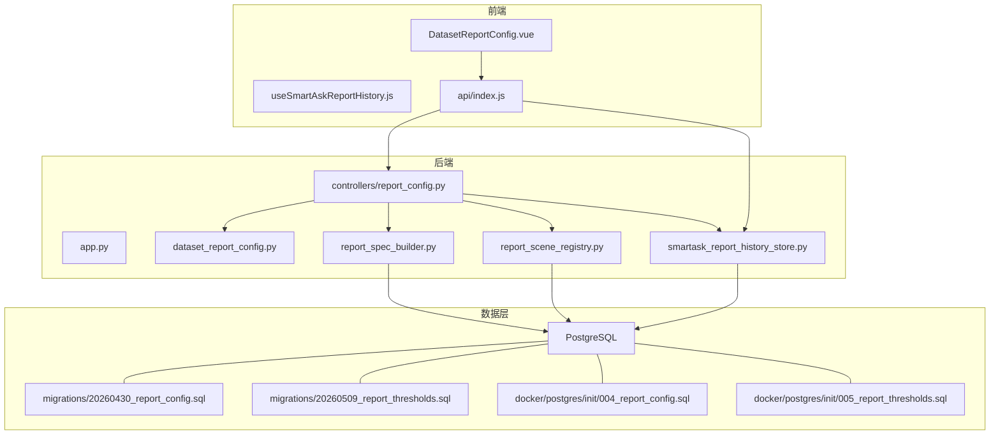
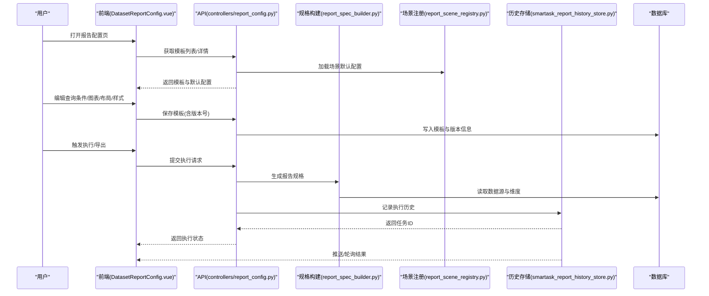
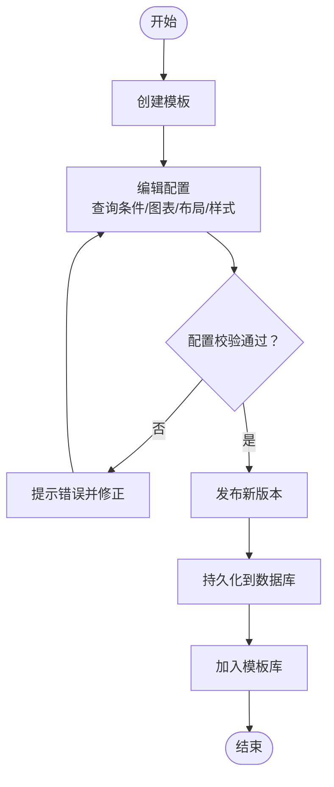
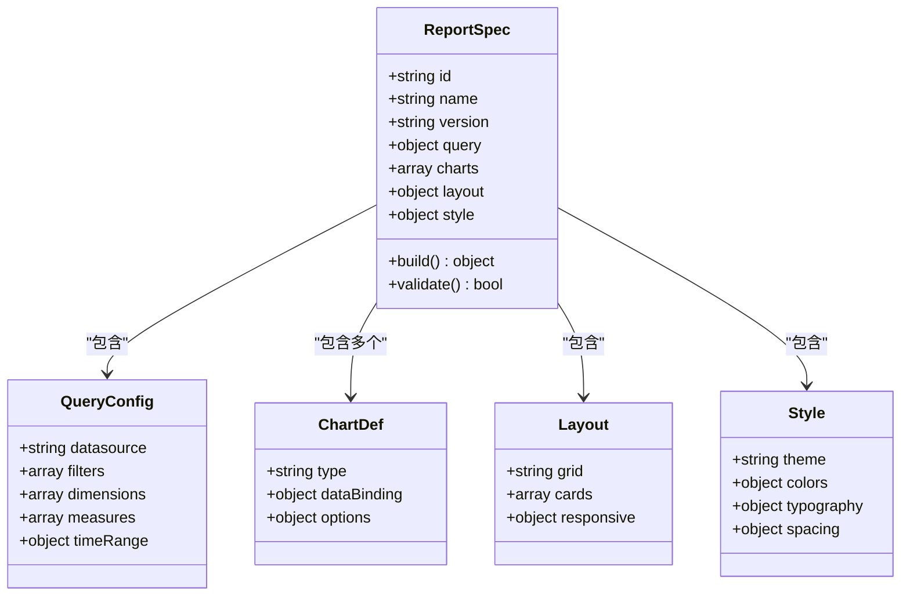
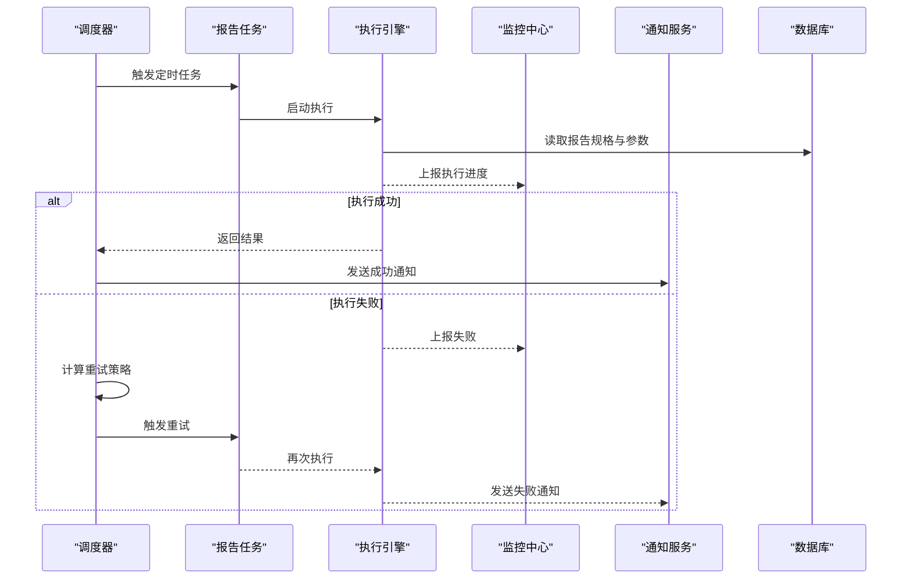
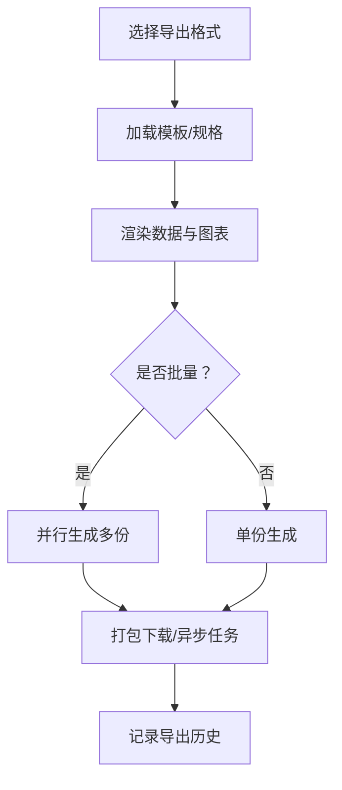
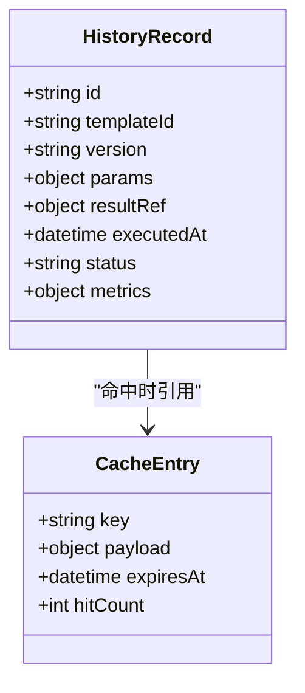
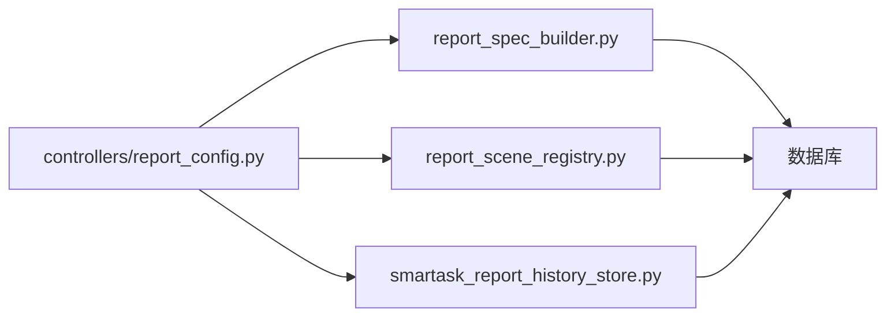

# 报告系统

<cite>
**本文引用的文件**   
- [report_config.py](file://backend/controllers/report_config.py)
- [dataset_report_config.py](file://backend/dataset_report_config.py)
- [smartask_report_history_store.py](file://backend/smartask_report_history_store.py)
- [report_spec_builder.py](file://backend/report_spec_builder.py)
- [report_scene_registry.py](file://backend/report_scene_registry.py)
- [app.py](file://backend/app.py)
- [20260430_report_config.sql](file://backend/migrations/20260430_report_config.sql)
- [20260509_report_thresholds.sql](file://backend/migrations/20260509_report_thresholds.sql)
- [004_report_config.sql](file://docker/postgres/init/004_report_config.sql)
- [005_report_thresholds.sql](file://docker/postgres/init/005_report_thresholds.sql)
- [DatasetReportConfig.vue](file://frontend/src/views/DatasetReportConfig.vue)
- [useSmartAskReportHistory.js](file://frontend/src/composables/useSmartAskReportHistory.js)
- [api/index.js](file://frontend/src/api/index.js)
</cite>

## 目录
1. [简介](#简介)
2. [项目结构](#项目结构)
3. [核心组件](#核心组件)
4. [架构总览](#架构总览)
5. [详细组件分析](#详细组件分析)
6. [依赖关系分析](#依赖关系分析)
7. [性能考虑](#性能考虑)
8. [故障排查指南](#故障排查指南)
9. [结论](#结论)
10. [附录：配置示例与使用场景](#附录配置示例与使用场景)

## 简介
本文件为 SmartAsk 报告系统的全面功能文档，覆盖以下关键能力：
- 报告模板管理：模板创建、编辑、版本控制与模板库管理
- 报告配置机制：查询条件配置、图表类型选择、布局设置与样式定制
- 定时任务系统：调度策略、执行监控、失败重试与通知机制
- 报告导出：支持的格式（PDF、Excel、图片）、批量导出与自定义模板
- 报告历史记录：历史查询、结果缓存、版本对比与回溯分析
- 最佳实践、性能优化技巧与常见问题解决方案
- 完整的报告配置示例与典型使用场景

## 项目结构
后端围绕“报告配置”“报告规格构建”“场景注册”“历史存储”四大模块组织；前端提供可视化配置页面与历史查询组合式函数。数据库通过迁移脚本初始化报告相关表结构与阈值配置。

**图示来源** 
- [app.py](file://backend/app.py)
- [report_config.py](file://backend/controllers/report_config.py)
- [dataset_report_config.py](file://backend/dataset_report_config.py)
- [report_spec_builder.py](file://backend/report_spec_builder.py)
- [report_scene_registry.py](file://backend/report_scene_registry.py)
- [smartask_report_history_store.py](file://backend/smartask_report_history_store.py)
- [20260430_report_config.sql](file://backend/migrations/20260430_report_config.sql)
- [20260509_report_thresholds.sql](file://backend/migrations/20260509_report_thresholds.sql)
- [004_report_config.sql](file://docker/postgres/init/004_report_config.sql)
- [005_report_thresholds.sql](file://docker/postgres/init/005_report_thresholds.sql)

**章节来源**
- [app.py](file://backend/app.py)
- [report_config.py](file://backend/controllers/report_config.py)
- [dataset_report_config.py](file://backend/dataset_report_config.py)
- [report_spec_builder.py](file://backend/report_spec_builder.py)
- [report_scene_registry.py](file://backend/report_scene_registry.py)
- [smartask_report_history_store.py](file://backend/smartask_report_history_store.py)
- [20260430_report_config.sql](file://backend/migrations/20260430_report_config.sql)
- [20260509_report_thresholds.sql](file://backend/migrations/20260509_report_thresholds.sql)
- [004_report_config.sql](file://docker/postgres/init/004_report_config.sql)
- [005_report_thresholds.sql](file://docker/postgres/init/005_report_thresholds.sql)

## 核心组件
- 报告配置控制器：对外暴露报告配置的增删改查、发布与版本化接口，协调下游服务完成查询构建与渲染。
- 数据集报告配置：面向数据集维度的报表配置聚合与校验，支撑多数据集联合报表。
- 报告规格构建器：将用户配置转换为可执行的报告规格（查询计划、图表定义、布局与样式）。
- 场景注册中心：按业务场景注册报告模板与默认配置，便于快速复用。
- 报告历史存储：持久化报告执行历史、结果快照与元数据，支持检索、对比与回溯。

**章节来源**
- [report_config.py](file://backend/controllers/report_config.py)
- [dataset_report_config.py](file://backend/dataset_report_config.py)
- [report_spec_builder.py](file://backend/report_spec_builder.py)
- [report_scene_registry.py](file://backend/report_scene_registry.py)
- [smartask_report_history_store.py](file://backend/smartask_report_history_store.py)

## 架构总览
报告系统采用前后端分离架构。前端通过 API 调用后端控制器，控制器根据配置生成报告规格并调度执行，最终由历史存储记录执行轨迹与结果。

**图示来源** 
- [DatasetReportConfig.vue](file://frontend/src/views/DatasetReportConfig.vue)
- [report_config.py](file://backend/controllers/report_config.py)
- [report_spec_builder.py](file://backend/report_spec_builder.py)
- [report_scene_registry.py](file://backend/report_scene_registry.py)
- [smartask_report_history_store.py](file://backend/smartask_report_history_store.py)

## 详细组件分析

### 报告模板管理（创建、编辑、版本控制、模板库）
- 模板创建与编辑：前端提供表单与可视化编辑器，后端接收配置并落库，自动维护版本字段与时间戳。
- 版本控制：每次发布生成新版本号，保留历史版本用于回滚与对比。
- 模板库管理：按场景或数据集分类展示模板，支持搜索、筛选与导入导出。

**图示来源** 
- [report_config.py](file://backend/controllers/report_config.py)
- [dataset_report_config.py](file://backend/dataset_report_config.py)
- [20260430_report_config.sql](file://backend/migrations/20260430_report_config.sql)
- [004_report_config.sql](file://docker/postgres/init/004_report_config.sql)

**章节来源**
- [report_config.py](file://backend/controllers/report_config.py)
- [dataset_report_config.py](file://backend/dataset_report_config.py)
- [20260430_report_config.sql](file://backend/migrations/20260430_report_config.sql)
- [004_report_config.sql](file://docker/postgres/init/004_report_config.sql)

### 报告配置机制（查询条件、图表类型、布局、样式）
- 查询条件：支持多维度过滤、时间范围、分组与聚合。
- 图表类型：折线、柱状、饼图、表格等，支持多图表组合。
- 布局设置：网格布局、卡片排列、响应式适配。
- 样式定制：主题色、字体、边距、标题与图例样式。

**图示来源** 
- [report_spec_builder.py](file://backend/report_spec_builder.py)
- [dataset_report_config.py](file://backend/dataset_report_config.py)

**章节来源**
- [report_spec_builder.py](file://backend/report_spec_builder.py)
- [dataset_report_config.py](file://backend/dataset_report_config.py)

### 定时任务系统（调度、监控、重试、通知）
- 调度策略：基于 Cron 表达式或固定间隔，支持按日/周/月周期执行。
- 执行监控：记录任务生命周期、运行时长、资源占用与日志。
- 失败重试：指数退避重试，支持最大重试次数与死信队列。
- 通知机制：邮件、飞书、企业微信等渠道告警与结果推送。

**图示来源** 
- [smartask_report_history_store.py](file://backend/smartask_report_history_store.py)
- [report_config.py](file://backend/controllers/report_config.py)

**章节来源**
- [smartask_report_history_store.py](file://backend/smartask_report_history_store.py)
- [report_config.py](file://backend/controllers/report_config.py)

### 报告导出（PDF、Excel、图片、批量、自定义模板）
- 支持格式：PDF、Excel、PNG/JPG 等图片格式。
- 批量导出：按模板批量生成多期或多维度报告。
- 自定义模板：复用已发布的模板进行二次定制，支持占位符与动态内容。

**图示来源** 
- [report_spec_builder.py](file://backend/report_spec_builder.py)
- [smartask_report_history_store.py](file://backend/smartask_report_history_store.py)

**章节来源**
- [report_spec_builder.py](file://backend/report_spec_builder.py)
- [smartask_report_history_store.py](file://backend/smartask_report_history_store.py)

### 报告历史记录（查询、缓存、版本对比、回溯）
- 查询历史：按时间、模板、执行人筛选历史执行记录。
- 结果缓存：对相同参数的执行结果进行缓存，提升重复查询性能。
- 版本对比：对比不同版本的报告差异（数据、图表、布局）。
- 回溯分析：定位问题根因，查看执行日志与中间结果。

**图示来源** 
- [smartask_report_history_store.py](file://backend/smartask_report_history_store.py)

**章节来源**
- [smartask_report_history_store.py](file://backend/smartask_report_history_store.py)

## 依赖关系分析
- 控制器依赖规格构建器与场景注册中心，统一组装报告执行上下文。
- 历史存储独立于业务逻辑，提供统一的执行轨迹与结果存取。
- 数据库迁移脚本确保表结构一致性与兼容性。

**图示来源** 
- [report_config.py](file://backend/controllers/report_config.py)
- [report_spec_builder.py](file://backend/report_spec_builder.py)
- [report_scene_registry.py](file://backend/report_scene_registry.py)
- [smartask_report_history_store.py](file://backend/smartask_report_history_store.py)

**章节来源**
- [report_config.py](file://backend/controllers/report_config.py)
- [report_spec_builder.py](file://backend/report_spec_builder.py)
- [report_scene_registry.py](file://backend/report_scene_registry.py)
- [smartask_report_history_store.py](file://backend/smartask_report_history_store.py)

## 性能考虑
- 查询优化：合理设置分页、索引与聚合粒度，避免全表扫描。
- 缓存策略：对热点查询启用短期缓存，降低数据库压力。
- 并发控制：批量导出与定时任务需限制并发度，防止资源争用。
- 渲染优化：按需渲染图表，延迟加载大图与复杂组件。
- 监控告警：建立慢查询与失败率监控，及时扩容与优化。

[本节为通用指导，不直接分析具体文件]

## 故障排查指南
- 配置校验失败：检查查询条件合法性、图表绑定字段是否存在、布局参数是否越界。
- 执行超时：排查数据源连接、SQL 复杂度、网络延迟与并发冲突。
- 导出异常：确认模板可用、渲染引擎正常、磁盘空间充足。
- 历史缺失：核对历史存储写入流程与事务一致性。
- 通知未送达：检查通知渠道配置与权限。

**章节来源**
- [smartask_report_history_store.py](file://backend/smartask_report_history_store.py)
- [report_config.py](file://backend/controllers/report_config.py)

## 结论
SmartAsk 报告系统以“配置驱动+规格构建+历史追溯”为核心，提供从模板管理、配置编排、定时调度到导出与回溯的完整闭环。通过合理的架构设计与性能优化策略，可满足多样化报表场景与高可用需求。

[本节为总结性内容，不直接分析具体文件]

## 附录：配置示例与使用场景

### 配置示例（端到端）
- 新建模板：在 DatasetReportConfig 页面创建模板，填写名称与描述，选择数据集与维度。
- 配置查询：添加时间范围、分组维度与指标度量，预览数据。
- 选择图表：选择折线图或柱状图，绑定数据字段与颜色主题。
- 设置布局：拖拽卡片调整布局，设置响应式断点。
- 样式定制：选择主题色、字体大小与边距，预览效果。
- 发布版本：保存并发布新版本，进入模板库。
- 定时执行：配置 Cron 表达式，设置执行周期与通知渠道。
- 导出报告：选择 PDF/Excel/图片，批量导出并下载。
- 查看历史：在历史页面检索执行记录，进行版本对比与回溯。

**章节来源**
- [DatasetReportConfig.vue](file://frontend/src/views/DatasetReportConfig.vue)
- [api/index.js](file://frontend/src/api/index.js)
- [report_config.py](file://backend/controllers/report_config.py)
- [report_spec_builder.py](file://backend/report_spec_builder.py)
- [smartask_report_history_store.py](file://backend/smartask_report_history_store.py)

### 使用场景
- 月度经营分析：按月周期自动生成经营指标报表，推送管理层。
- 销售趋势追踪：按区域与产品线绘制趋势图，支持对比与下钻。
- 库存预警报告：设定阈值，超阈自动告警并生成预警报告。
- 合规审计报表：定期导出审计所需数据与图表，归档备查。

**章节来源**
- [report_scene_registry.py](file://backend/report_scene_registry.py)
- [dataset_report_config.py](file://backend/dataset_report_config.py)