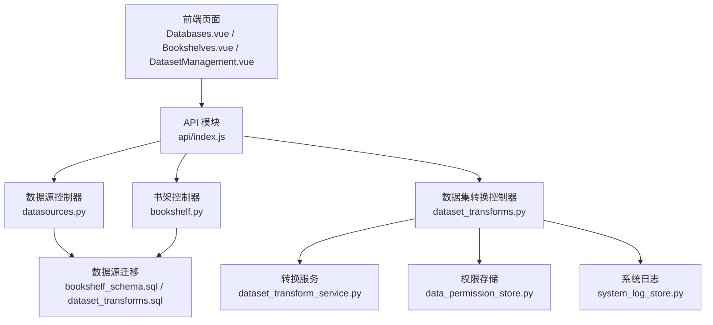
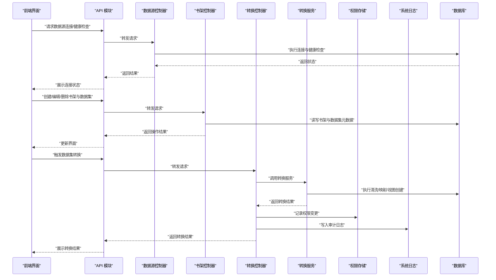
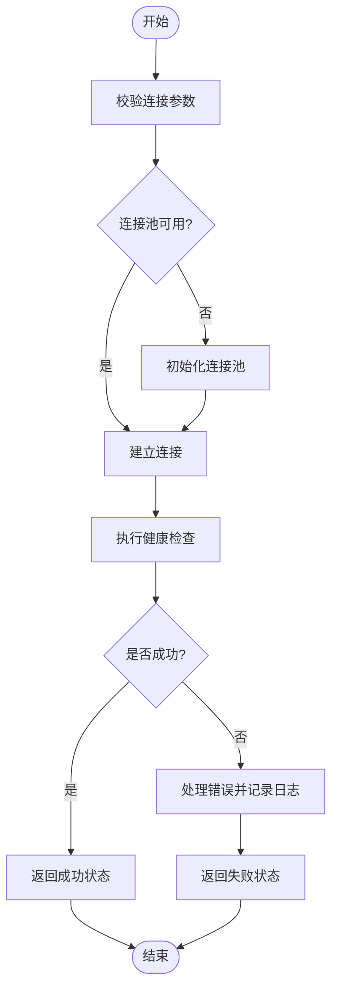
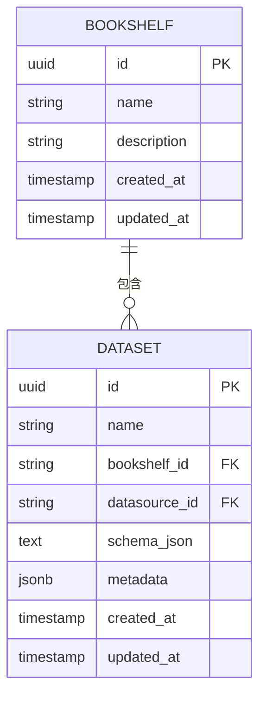
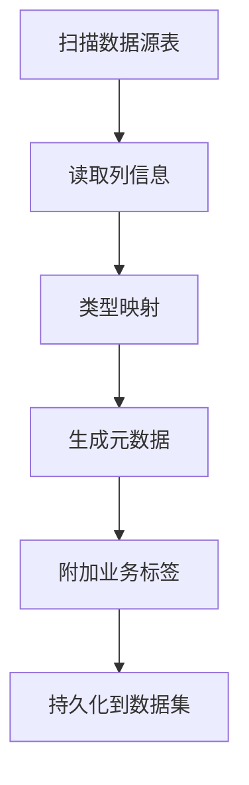
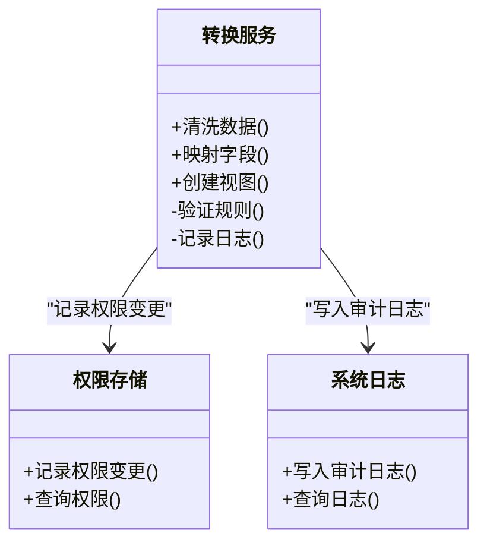
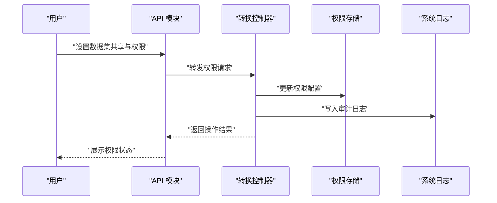
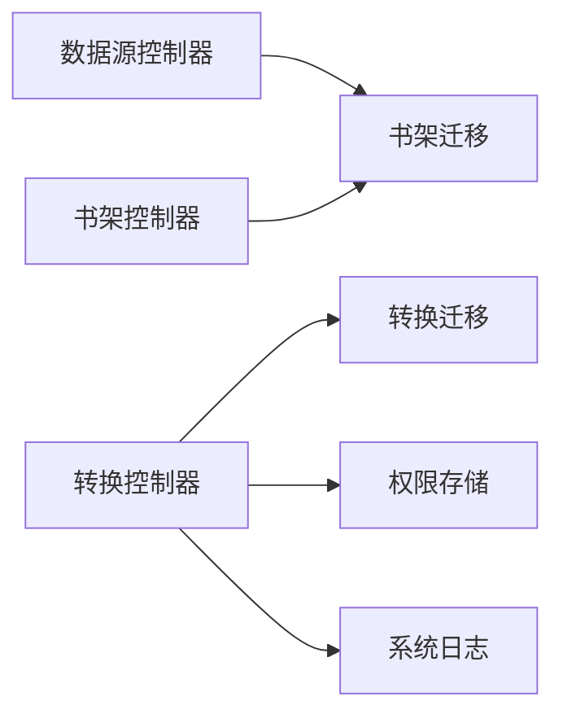

# 数据集管理

<cite>
**本文引用的文件**   
- [backend/controllers/datasources.py](file://backend/controllers/datasources.py)
- [backend/controllers/bookshelf.py](file://backend/controllers/bookshelf.py)
- [backend/dataset_transform_service.py](file://backend/dataset_transform_service.py)
- [backend/controllers/dataset_transforms.py](file://backend/controllers/dataset_transforms.py)
- [backend/data_permission_store.py](file://backend/data_permission_store.py)
- [backend/system_log_store.py](file://backend/system_log_store.py)
- [backend/migrations/20260330_bookshelf_schema.sql](file://backend/migrations/20260330_bookshelf_schema.sql)
- [backend/migrations/20260630_dataset_transforms.sql](file://backend/migrations/20260630_dataset_transforms.sql)
- [docker/postgres/init/001_bookshelf_schema.sql](file://docker/postgres/init/001_bookshelf_schema.sql)
- [frontend/src/views/Databases.vue](file://frontend/src/views/Databases.vue)
- [frontend/src/views/Bookshelves.vue](file://frontend/src/views/Bookshelves.vue)
- [frontend/src/views/DatasetManagement.vue](file://frontend/src/views/DatasetManagement.vue)
- [frontend/src/api/index.js](file://frontend/src/api/index.js)
</cite>

## 目录
1. [简介](#简介)
2. [项目结构](#项目结构)
3. [核心组件](#核心组件)
4. [架构总览](#架构总览)
5. [详细组件分析](#详细组件分析)
6. [依赖关系分析](#依赖关系分析)
7. [性能考虑](#性能考虑)
8. [故障排除指南](#故障排除指南)
9. [结论](#结论)
10. [附录](#附录)

## 简介
本文件面向 SmartAsk 的数据集管理功能，围绕数据源连接管理、书架（Bookshelf）与数据集组织、元数据管理、数据集转换服务、权限配置与审计日志等主题进行系统化说明。文档旨在帮助读者快速理解系统如何连接多种数据库、如何以“书架”为维度组织数据集、如何进行字段类型映射与业务标签管理、如何通过转换服务完成清洗与视图构建，以及如何通过共享设置与访问控制实现安全合规的数据使用。

## 项目结构
SmartAsk 后端采用控制器与服务分离的架构：控制器负责 HTTP 接口编排，服务层封装领域逻辑；前端通过 Vue 页面与 API 模块交互。与数据集管理相关的关键位置包括：
- 数据源连接管理：后端控制器与迁移脚本定义连接信息与校验流程
- 书架与数据集：后端控制器与数据库迁移脚本定义实体与关系
- 元数据管理：基于表结构自动发现与字段类型映射
- 数据集转换：服务层提供清洗、映射、视图创建能力
- 权限与审计：权限存储与系统日志记录

图表来源 
- [backend/controllers/datasources.py](file://backend/controllers/datasources.py)
- [backend/controllers/bookshelf.py](file://backend/controllers/bookshelf.py)
- [backend/controllers/dataset_transforms.py](file://backend/controllers/dataset_transforms.py)
- [backend/dataset_transform_service.py](file://backend/dataset_transform_service.py)
- [backend/migrations/20260330_bookshelf_schema.sql](file://backend/migrations/20260330_bookshelf_schema.sql)
- [backend/migrations/20260630_dataset_transforms.sql](file://backend/migrations/20260630_dataset_transforms.sql)
- [frontend/src/views/Databases.vue](file://frontend/src/views/Databases.vue)
- [frontend/src/views/Bookshelves.vue](file://frontend/src/views/Bookshelves.vue)
- [frontend/src/views/DatasetManagement.vue](file://frontend/src/views/DatasetManagement.vue)
- [frontend/src/api/index.js](file://frontend/src/api/index.js)

章节来源
- [backend/controllers/datasources.py](file://backend/controllers/datasources.py)
- [backend/controllers/bookshelf.py](file://backend/controllers/bookshelf.py)
- [backend/controllers/dataset_transforms.py](file://backend/controllers/dataset_transforms.py)
- [backend/dataset_transform_service.py](file://backend/dataset_transform_service.py)
- [backend/migrations/20260330_bookshelf_schema.sql](file://backend/migrations/20260330_bookshelf_schema.sql)
- [backend/migrations/20260630_dataset_transforms.sql](file://backend/migrations/20260630_dataset_transforms.sql)
- [frontend/src/views/Databases.vue](file://frontend/src/views/Databases.vue)
- [frontend/src/views/Bookshelves.vue](file://frontend/src/views/Bookshelves.vue)
- [frontend/src/views/DatasetManagement.vue](file://frontend/src/views/DatasetManagement.vue)
- [frontend/src/api/index.js](file://frontend/src/api/index.js)

## 核心组件
- 数据源连接管理：支持多类型数据库连接，提供连接配置、健康检查与连接池管理策略
- 书架（Bookshelf）与数据集组织：以书架为容器组织数据集，支持创建、编辑、删除等操作
- 元数据管理：表结构自动发现、字段类型映射、业务标签管理
- 数据集转换服务：数据清洗、字段映射、视图创建
- 权限与审计：共享设置、访问控制、审计日志记录

章节来源
- [backend/controllers/datasources.py](file://backend/controllers/datasources.py)
- [backend/controllers/bookshelf.py](file://backend/controllers/bookshelf.py)
- [backend/dataset_transform_service.py](file://backend/dataset_transform_service.py)
- [backend/controllers/dataset_transforms.py](file://backend/controllers/dataset_transforms.py)
- [backend/data_permission_store.py](file://backend/data_permission_store.py)
- [backend/system_log_store.py](file://backend/system_log_store.py)

## 架构总览
SmartAsk 的数据集管理由前端页面驱动，通过 API 模块调用后端控制器。控制器协调数据源、书架、转换服务、权限与日志等子系统，最终通过数据库迁移脚本维护持久化结构。

图表来源 
- [backend/controllers/datasources.py](file://backend/controllers/datasources.py)
- [backend/controllers/bookshelf.py](file://backend/controllers/bookshelf.py)
- [backend/controllers/dataset_transforms.py](file://backend/controllers/dataset_transforms.py)
- [backend/dataset_transform_service.py](file://backend/dataset_transform_service.py)
- [backend/data_permission_store.py](file://backend/data_permission_store.py)
- [backend/system_log_store.py](file://backend/system_log_store.py)

## 详细组件分析

### 数据源连接管理
- 支持的数据库类型：根据迁移与控制器实现，系统支持常见关系型数据库（如 PostgreSQL、MySQL 等），通过统一连接参数抽象不同方言
- 连接配置：包含主机、端口、数据库名、用户名、密码、SSL 选项、连接超时等；敏感信息建议加密存储
- 连接池管理：控制器或服务层可维护连接池，限制最大连接数、空闲回收、重试策略
- 健康检查：定期或按需探测连接可用性，返回连通性与延迟指标，用于前端展示与告警

图表来源 
- [backend/controllers/datasources.py](file://backend/controllers/datasources.py)

章节来源
- [backend/controllers/datasources.py](file://backend/controllers/datasources.py)

### 书架（Bookshelf）与数据集组织
- 书架概念：书架作为数据集的逻辑容器，便于按业务域或团队划分数据集集合
- 数据集组织：每个书架下可包含多个数据集，数据集描述其数据来源、字段结构与业务标签
- 操作能力：创建、编辑、删除书架与数据集；支持批量导入导出与版本化管理

图表来源 
- [backend/migrations/20260330_bookshelf_schema.sql](file://backend/migrations/20260330_bookshelf_schema.sql)
- [docker/postgres/init/001_bookshelf_schema.sql](file://docker/postgres/init/001_bookshelf_schema.sql)

章节来源
- [backend/controllers/bookshelf.py](file://backend/controllers/bookshelf.py)
- [backend/migrations/20260330_bookshelf_schema.sql](file://backend/migrations/20260330_bookshelf_schema.sql)
- [docker/postgres/init/001_bookshelf_schema.sql](file://docker/postgres/init/001_bookshelf_schema.sql)

### 元数据管理机制
- 表结构自动发现：从数据源读取表列表与列信息，生成结构化元数据
- 字段类型映射：将数据源类型映射到系统内部类型，确保查询与展示一致性
- 业务标签管理：为字段添加业务标签（如“金额”、“时间”、“维度”），辅助智能问数与报表生成

图表来源 
- [backend/controllers/bookshelf.py](file://backend/controllers/bookshelf.py)

章节来源
- [backend/controllers/bookshelf.py](file://backend/controllers/bookshelf.py)

### 数据集转换服务
- 数据清洗：去除空值、标准化格式、去重、异常值处理
- 字段映射：将原始字段映射到目标字段，支持别名与计算字段
- 视图创建：在数据源或中间库中创建视图，提升查询性能与复用性

图表来源 
- [backend/dataset_transform_service.py](file://backend/dataset_transform_service.py)
- [backend/data_permission_store.py](file://backend/data_permission_store.py)
- [backend/system_log_store.py](file://backend/system_log_store.py)

章节来源
- [backend/dataset_transform_service.py](file://backend/dataset_transform_service.py)
- [backend/controllers/dataset_transforms.py](file://backend/controllers/dataset_transforms.py)
- [backend/migrations/20260630_dataset_transforms.sql](file://backend/migrations/20260630_dataset_transforms.sql)

### 权限配置与审计日志
- 共享设置：支持数据集级别的共享开关与可见范围
- 访问控制：基于角色或用户组的细粒度权限控制
- 审计日志：记录关键操作的主体、时间、对象与结果，便于追溯与合规

图表来源 
- [backend/controllers/dataset_transforms.py](file://backend/controllers/dataset_transforms.py)
- [backend/data_permission_store.py](file://backend/data_permission_store.py)
- [backend/system_log_store.py](file://backend/system_log_store.py)

章节来源
- [backend/controllers/dataset_transforms.py](file://backend/controllers/dataset_transforms.py)
- [backend/data_permission_store.py](file://backend/data_permission_store.py)
- [backend/system_log_store.py](file://backend/system_log_store.py)

### 前端集成
- 数据源页面：展示连接状态、健康检查结果、配置入口
- 书架页面：管理书架与数据集的增删改查
- 数据集管理页面：执行转换、查看元数据、配置权限

章节来源
- [frontend/src/views/Databases.vue](file://frontend/src/views/Databases.vue)
- [frontend/src/views/Bookshelves.vue](file://frontend/src/views/Bookshelves.vue)
- [frontend/src/views/DatasetManagement.vue](file://frontend/src/views/DatasetManagement.vue)
- [frontend/src/api/index.js](file://frontend/src/api/index.js)

## 依赖关系分析
- 控制器依赖：数据源、书架、转换控制器分别依赖对应的服务与存储
- 存储依赖：权限存储与系统日志为横切关注点，被多个控制器调用
- 数据库依赖：迁移脚本定义书架与数据集的持久化结构

图表来源 
- [backend/controllers/datasources.py](file://backend/controllers/datasources.py)
- [backend/controllers/bookshelf.py](file://backend/controllers/bookshelf.py)
- [backend/controllers/dataset_transforms.py](file://backend/controllers/dataset_transforms.py)
- [backend/migrations/20260330_bookshelf_schema.sql](file://backend/migrations/20260330_bookshelf_schema.sql)
- [backend/migrations/20260630_dataset_transforms.sql](file://backend/migrations/20260630_dataset_transforms.sql)

章节来源
- [backend/controllers/datasources.py](file://backend/controllers/datasources.py)
- [backend/controllers/bookshelf.py](file://backend/controllers/bookshelf.py)
- [backend/controllers/dataset_transforms.py](file://backend/controllers/dataset_transforms.py)
- [backend/migrations/20260330_bookshelf_schema.sql](file://backend/migrations/20260330_bookshelf_schema.sql)
- [backend/migrations/20260630_dataset_transforms.sql](file://backend/migrations/20260630_dataset_transforms.sql)

## 性能考虑
- 连接池优化：合理设置最大连接数与空闲回收策略，避免连接泄漏
- 元数据缓存：对表结构与字段类型进行缓存，减少重复扫描
- 转换任务异步化：将清洗与视图创建放入队列，避免阻塞请求
- 查询优化：为常用查询创建索引，合理使用视图与物化视图

## 故障排除指南
- 连接失败：检查网络连通性、认证信息、SSL 配置与防火墙策略
- 健康检查失败：确认数据源服务状态、端口监听与权限
- 元数据不一致：重新扫描表结构，清理缓存后重试
- 转换失败：查看转换日志，定位清洗规则或映射错误
- 权限问题：核对角色与用户组配置，确认共享设置与访问控制

章节来源
- [backend/system_log_store.py](file://backend/system_log_store.py)
- [backend/data_permission_store.py](file://backend/data_permission_store.py)

## 结论
SmartAsk 的数据集管理通过清晰的分层架构与完善的迁移脚本，实现了数据源连接、书架组织、元数据管理、转换服务与权限审计的闭环。建议在生产环境中结合连接池优化、元数据缓存与异步转换策略，以提升稳定性与性能。

## 附录
- 数据源配置示例：参考数据源控制器中的参数定义与迁移脚本中的默认值
- 最佳实践：
  - 使用书架按业务域隔离数据集
  - 为关键字段添加业务标签，提升智能问数效果
  - 定期执行健康检查与元数据同步
  - 启用审计日志，满足合规要求
- 故障排除清单：
  - 网络连接与认证
  - 元数据缓存失效
  - 转换规则错误
  - 权限配置冲突